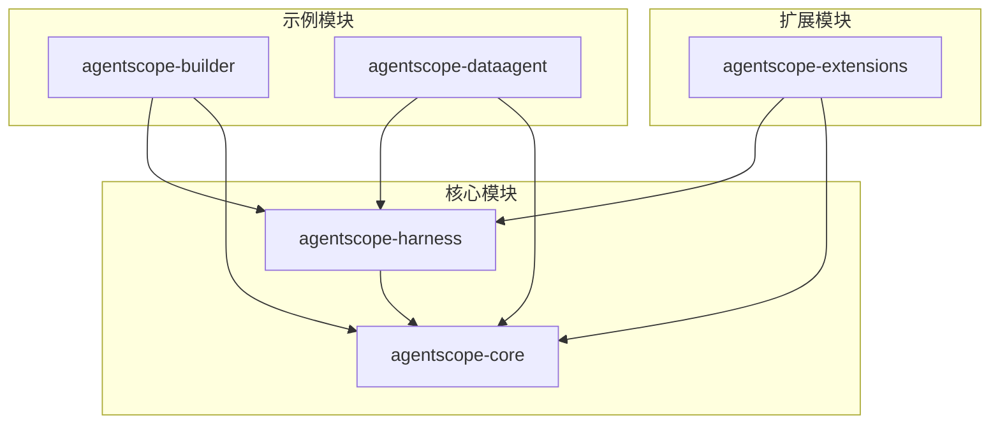
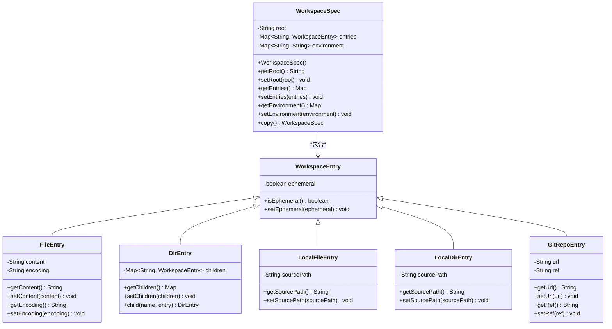
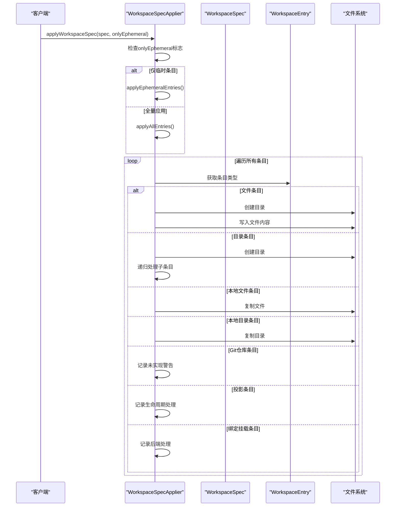
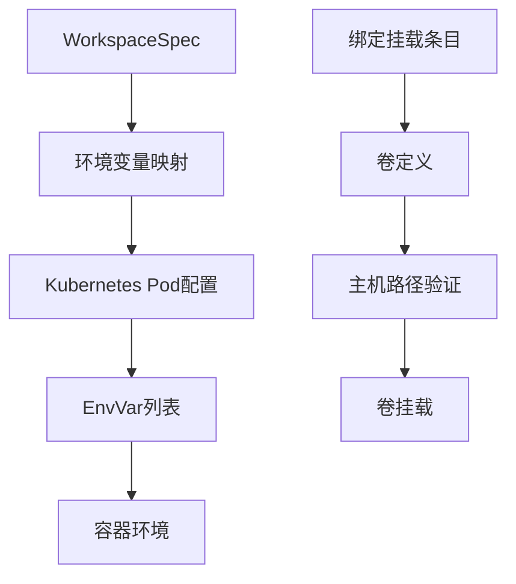
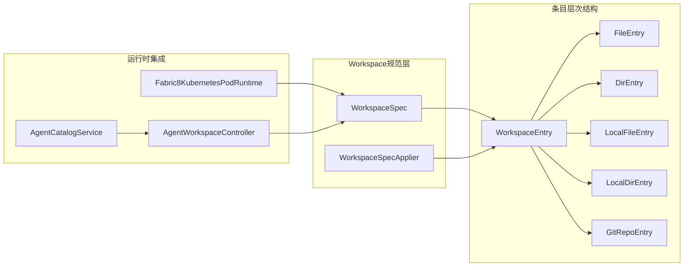

# 工作区规格定义API

<cite>
**本文档引用的文件**
- [WorkspaceSpec.java](file://agentscope-harness/src/main/java/io/agentscope/harness/agent/sandbox/WorkspaceSpec.java)
- [WorkspaceSpecApplier.java](file://agentscope-harness/src/main/java/io/agentscope/harness/agent/sandbox/WorkspaceSpecApplier.java)
- [WorkspaceEntry.java](file://agentscope-harness/src/main/java/io/agentscope/harness/agent/sandbox/layout/WorkspaceEntry.java)
- [FileEntry.java](file://agentscope-harness/src/main/java/io/agentscope/harness/agent/sandbox/layout/FileEntry.java)
- [DirEntry.java](file://agentscope-harness/src/main/java/io/agentscope/harness/agent/sandbox/layout/DirEntry.java)
- [LocalFileEntry.java](file://agentscope-harness/src/main/java/io/agentscope/harness/agent/sandbox/layout/LocalFileEntry.java)
- [LocalDirEntry.java](file://agentscope-harness/src/main/java/io/agentscope/harness/agent/sandbox/layout/LocalDirEntry.java)
- [GitRepoEntry.java](file://agentscope-harness/src/main/java/io/agentscope/harness/agent/sandbox/layout/GitRepoEntry.java)
- [Fabric8KubernetesPodRuntime.java](file://agentscope-extensions/agentscope-extensions-sandbox/agentscope-extensions-sandbox-kubernetes/src/main/java/io/agentscope/extensions/sandbox/kubernetes/Fabric8KubernetesPodRuntime.java)
- [AgentWorkspaceController.java](file://agentscope-examples/agents/agentscope-builder/src/main/java/io/agentscope/builder/web/api/AgentWorkspaceController.java)
- [AgentCatalogService.java](file://agentscope-examples/agents/agentscope-builder/src/main/java/io/agentscope/builder/web/catalog/AgentCatalogService.java)
- [BuilderWorkspaceConfig.java](file://agentscope-examples/agents/agentscope-builder/src/main/java/io/agentscope/builder/web/workspace/BuilderWorkspaceConfig.java)
</cite>

## 目录
1. [简介](#简介)
2. [项目结构](#项目结构)
3. [核心组件](#核心组件)
4. [架构概览](#架构概览)
5. [详细组件分析](#详细组件分析)
6. [依赖关系分析](#依赖关系分析)
7. [性能考虑](#性能考虑)
8. [故障排除指南](#故障排除指南)
9. [结论](#结论)
10. [附录](#附录)

## 简介

Workspace规格定义系统是AgentScope框架中用于描述和管理沙箱工作区初始状态的核心组件。该系统通过WorkspaceSpec类定义工作区的根路径、文件/目录条目以及环境变量，支持多种条目类型来满足不同的工作区初始化需求。

本系统采用构建器模式设计，提供了灵活的工作区规格创建、修改和验证功能。支持的条目类型包括：
- 文件条目：内联内容创建文件
- 目录条目：递归创建目录结构
- 本地文件条目：从主机复制单个文件
- 本地目录条目：从主机复制整个目录
- Git仓库条目：克隆远程仓库到工作区
- 绑定挂载条目：在容器启动时应用绑定挂载

## 项目结构

Workspace规格定义系统主要分布在以下模块中：

**图表来源**
- [WorkspaceSpec.java:1-87](file://agentscope-harness/src/main/java/io/agentscope/harness/agent/sandbox/WorkspaceSpec.java#L1-L87)
- [WorkspaceSpecApplier.java:1-166](file://agentscope-harness/src/main/java/io/agentscope/harness/agent/sandbox/WorkspaceSpecApplier.java#L1-L166)

**章节来源**
- [WorkspaceSpec.java:1-87](file://agentscope-harness/src/main/java/io/agentscope/harness/agent/sandbox/WorkspaceSpec.java#L1-L87)
- [WorkspaceSpecApplier.java:1-166](file://agentscope-harness/src/main/java/io/agentscope/harness/agent/sandbox/WorkspaceSpecApplier.java#L1-L166)

## 核心组件

### WorkspaceSpec类

WorkspaceSpec是工作区规格的核心类，用于描述沙箱工作区的期望初始状态。它包含三个主要字段：

- **root**：工作区在沙箱内的根路径，默认值为"/workspace"
- **entries**：文件、目录和其他条目的映射表
- **environment**：注入到每个执行命令中的环境变量映射

### WorkspaceEntry抽象基类

所有工作区条目的基础抽象类，定义了通用属性和行为：

- **ephemeral**：是否为临时条目（默认false）
- **isEphemeral()**：获取临时性标志
- **setEphemeral()**：设置临时性标志

**章节来源**
- [WorkspaceSpec.java:22-87](file://agentscope-harness/src/main/java/io/agentscope/harness/agent/sandbox/WorkspaceSpec.java#L22-L87)
- [WorkspaceEntry.java:21-67](file://agentscope-harness/src/main/java/io/agentscope/harness/agent/sandbox/layout/WorkspaceEntry.java#L21-L67)

## 架构概览

**图表来源**
- [WorkspaceSpec.java:43-87](file://agentscope-harness/src/main/java/io/agentscope/harness/agent/sandbox/WorkspaceSpec.java#L43-L87)
- [WorkspaceEntry.java:42-67](file://agentscope-harness/src/main/java/io/agentscope/harness/agent/sandbox/layout/WorkspaceEntry.java#L42-L67)
- [FileEntry.java:18-85](file://agentscope-harness/src/main/java/io/agentscope/harness/agent/sandbox/layout/FileEntry.java#L18-L85)
- [DirEntry.java:21-73](file://agentscope-harness/src/main/java/io/agentscope/harness/agent/sandbox/layout/DirEntry.java#L21-L73)
- [LocalFileEntry.java:18-58](file://agentscope-harness/src/main/java/io/agentscope/harness/agent/sandbox/layout/LocalFileEntry.java#L18-L58)
- [LocalDirEntry.java:18-59](file://agentscope-harness/src/main/java/io/agentscope/harness/agent/sandbox/layout/LocalDirEntry.java#L18-L59)
- [GitRepoEntry.java:18-80](file://agentscope-harness/src/main/java/io/agentscope/harness/agent/sandbox/layout/GitRepoEntry.java#L18-L80)

## 详细组件分析

### WorkspaceSpecApplier应用器

WorkspaceSpecApplier负责将WorkspaceSpec应用到目标目录，实现条目的材料化。支持两种应用模式：

1. **全量应用**：应用所有条目（分支C/D）
2. **临时应用**：仅应用标记为临时的条目（分支A/B）

**图表来源**
- [WorkspaceSpecApplier.java:64-139](file://agentscope-harness/src/main/java/io/agentscope/harness/agent/sandbox/WorkspaceSpecApplier.java#L64-L139)

**章节来源**
- [WorkspaceSpecApplier.java:38-166](file://agentscope-harness/src/main/java/io/agentscope/harness/agent/sandbox/WorkspaceSpecApplier.java#L38-L166)

### 条目类型详解

#### 文件条目（FileEntry）
用于创建具有内联文本内容的文件：
- 支持自定义字符编码
- 默认UTF-8编码
- 可设置文件内容

#### 目录条目（DirEntry）
用于创建目录及其嵌套子条目：
- 支持递归的树状结构
- 子条目可以是任意类型的WorkspaceEntry
- 提供child()方法进行链式调用

#### 本地文件条目（LocalFileEntry）
从主机文件系统复制单个文件：
- 需要绝对路径作为源
- 支持跨平台路径序列化
- 自动处理路径规范化

#### 本地目录条目（LocalDirEntry）
从主机文件系统复制整个目录：
- 递归复制所有子文件
- 验证源路径必须为目录
- 支持大型目录的高效复制

#### Git仓库条目（GitRepoEntry）
克隆远程Git仓库到工作区：
- 支持指定URL和ref（分支/标签/提交SHA）
- 作为JSON序列化的类型骨架
- 当前实现中记录未完成警告

**章节来源**
- [FileEntry.java:18-85](file://agentscope-harness/src/main/java/io/agentscope/harness/agent/sandbox/layout/FileEntry.java#L18-L85)
- [DirEntry.java:21-73](file://agentscope-harness/src/main/java/io/agentscope/harness/agent/sandbox/layout/DirEntry.java#L21-L73)
- [LocalFileEntry.java:18-58](file://agentscope-harness/src/main/java/io/agentscope/harness/agent/sandbox/layout/LocalFileEntry.java#L18-L58)
- [LocalDirEntry.java:18-59](file://agentscope-harness/src/main/java/io/agentscope/harness/agent/sandbox/layout/LocalDirEntry.java#L18-L59)
- [GitRepoEntry.java:18-80](file://agentscope-harness/src/main/java/io/agentscope/harness/agent/sandbox/layout/GitRepoEntry.java#L18-L80)

### 环境变量集成

工作区规格中的环境变量会在沙箱运行时注入到执行环境中：

**图表来源**
- [Fabric8KubernetesPodRuntime.java:259-299](file://agentscope-extensions/agentscope-extensions-sandbox/agentscope-extensions-sandbox-kubernetes/src/main/java/io/agentscope/extensions/sandbox/kubernetes/Fabric8KubernetesPodRuntime.java#L259-L299)

**章节来源**
- [Fabric8KubernetesPodRuntime.java:259-299](file://agentscope-extensions/agentscope-extensions-sandbox/agentscope-extensions-sandbox-kubernetes/src/main/java/io/agentscope/extensions/sandbox/kubernetes/Fabric8KubernetesPodRuntime.java#L259-L299)

## 依赖关系分析

**图表来源**
- [WorkspaceSpec.java:18-47](file://agentscope-harness/src/main/java/io/agentscope/harness/agent/sandbox/WorkspaceSpec.java#L18-L47)
- [WorkspaceSpecApplier.java:18-36](file://agentscope-harness/src/main/java/io/agentscope/harness/agent/sandbox/WorkspaceSpecApplier.java#L18-L36)
- [Fabric8KubernetesPodRuntime.java:259-269](file://agentscope-extensions/agentscope-extensions-sandbox/agentscope-extensions-sandbox-kubernetes/src/main/java/io/agentscope/extensions/sandbox/kubernetes/Fabric8KubernetesPodRuntime.java#L259-L269)

**章节来源**
- [WorkspaceSpec.java:1-87](file://agentscope-harness/src/main/java/io/agentscope/harness/agent/sandbox/WorkspaceSpec.java#L1-L87)
- [WorkspaceSpecApplier.java:1-166](file://agentscope-harness/src/main/java/io/agentscope/harness/agent/sandbox/WorkspaceSpecApplier.java#L1-L166)

## 性能考虑

### 材料化策略优化

1. **临时条目优先**：onlyEphemeral模式允许只应用临时条目，提高启动效率
2. **递归复制优化**：LocalDirEntry使用Files.walk()进行高效的目录遍历
3. **内存管理**：WorkspaceSpec.copy()实现浅拷贝以减少内存分配

### 路径处理优化

1. **绝对路径规范化**：LocalFileEntry和LocalDirEntry自动处理路径规范化
2. **字符集缓存**：FileEntry使用UTF-8作为默认编码，避免重复解析
3. **空值检查**：各条目类型都有适当的空值检查和异常处理

## 故障排除指南

### 常见问题及解决方案

#### 路径遍历攻击防护
当用户输入相对路径时，系统会拒绝包含".."段的路径：
- 输入包含".."会被拒绝并返回400状态码
- 绝对路径直接通过验证
- 相对路径自动规范化

#### 目录复制失败
LocalDirEntry在复制目录时会进行严格的验证：
- 源路径必须存在且为目录
- 使用标准复制选项替换现有文件
- 异常情况抛出UncheckedIOException

#### Git仓库条目未实现
GitRepoEntry当前处于未实现状态：
- 系统会记录警告信息
- 继续处理其他条目
- 后续版本将支持Git仓库克隆

**章节来源**
- [AgentCatalogService.java:320-353](file://agentscope-examples/agents/agentscope-builder/src/main/java/io/agentscope/builder/web/catalog/AgentCatalogService.java#L320-L353)
- [WorkspaceSpecApplier.java:141-164](file://agentscope-harness/src/main/java/io/agentscope/harness/agent/sandbox/WorkspaceSpecApplier.java#L141-L164)

## 结论

Workspace规格定义系统提供了完整的沙箱工作区管理解决方案。通过清晰的类层次结构和灵活的条目类型，系统能够满足各种复杂的工作区初始化需求。

关键优势包括：
- **模块化设计**：清晰分离规范定义和应用逻辑
- **类型安全**：通过抽象基类确保条目的一致性
- **可扩展性**：易于添加新的条目类型
- **安全性**：内置路径验证和访问控制
- **性能优化**：针对大文件和目录的高效处理

该系统为AgentScope框架提供了强大的工作区管理能力，支持从简单文件创建到复杂的多层目录结构，以及从本地文件复制到远程仓库克隆的各种场景。

## 附录

### API使用示例

#### 定义基本工作区规格
创建工作区规格的最简单方式是使用默认构造函数，然后设置必要的属性。

#### 设置文件条目
通过FileEntry创建包含内联内容的文件，支持自定义字符编码。

#### 添加目录结构
使用DirEntry创建目录，并通过child()方法添加嵌套的子条目，形成树状结构。

#### 配置环境变量
在WorkspaceSpec的environment映射中添加键值对，这些变量将在沙箱运行时注入到执行环境中。

#### 应用工作区规格
使用WorkspaceSpecApplier将规格应用到目标目录，选择合适的材料化模式。

**章节来源**
- [WorkspaceSpec.java:35-41](file://agentscope-harness/src/main/java/io/agentscope/harness/agent/sandbox/WorkspaceSpec.java#L35-L41)
- [FileEntry.java:26-47](file://agentscope-harness/src/main/java/io/agentscope/harness/agent/sandbox/layout/FileEntry.java#L26-L47)
- [DirEntry.java:31-71](file://agentscope-harness/src/main/java/io/agentscope/harness/agent/sandbox/layout/DirEntry.java#L31-L71)