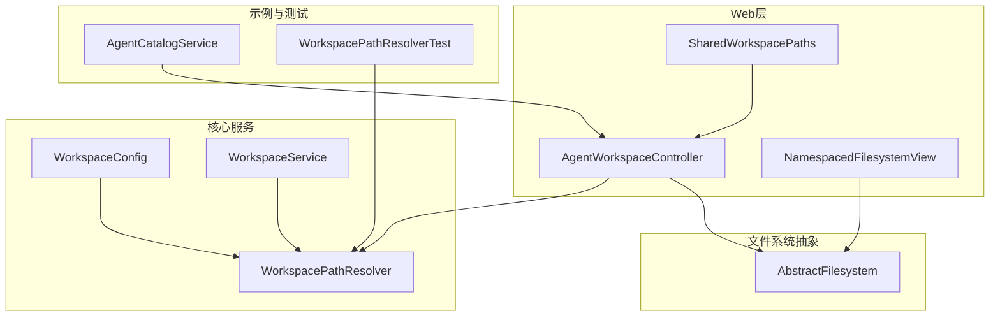
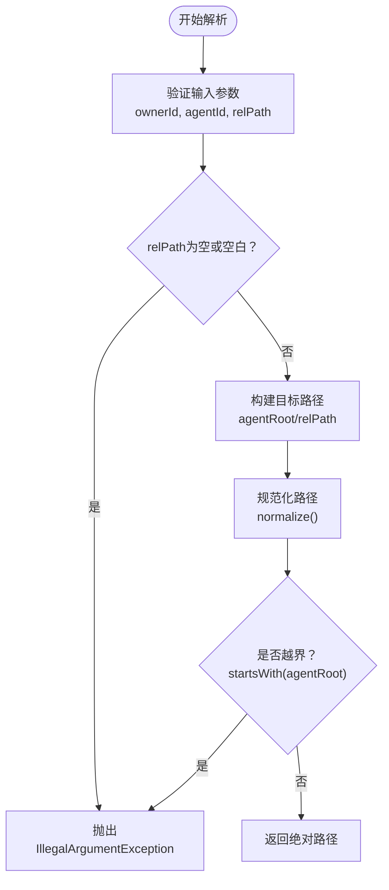
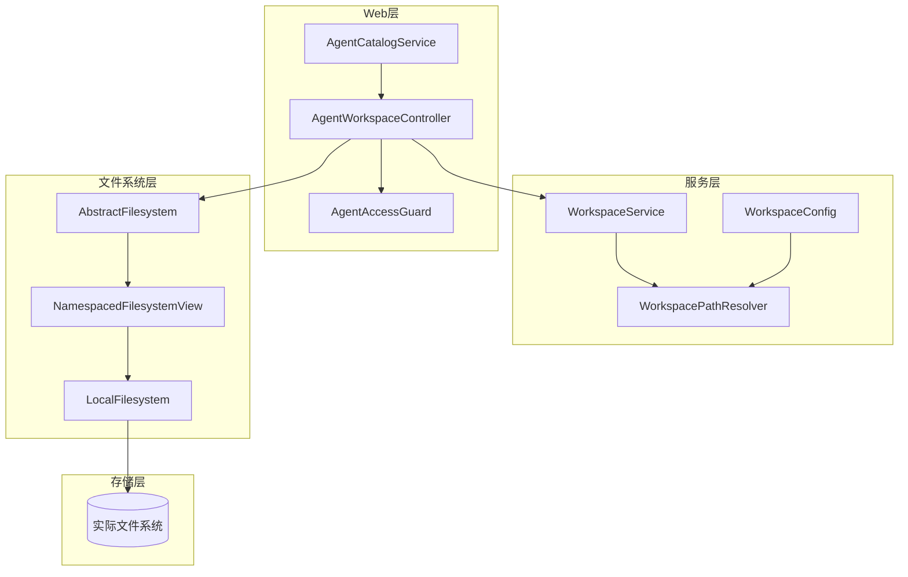
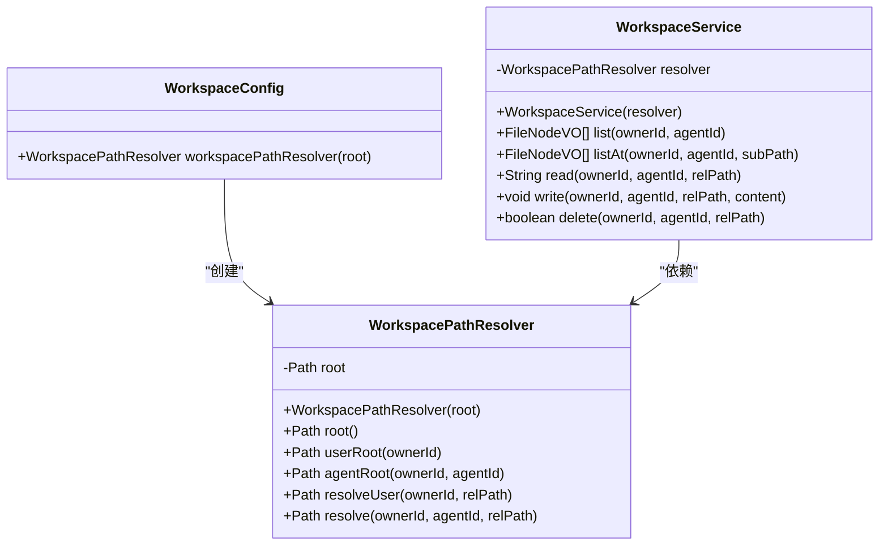
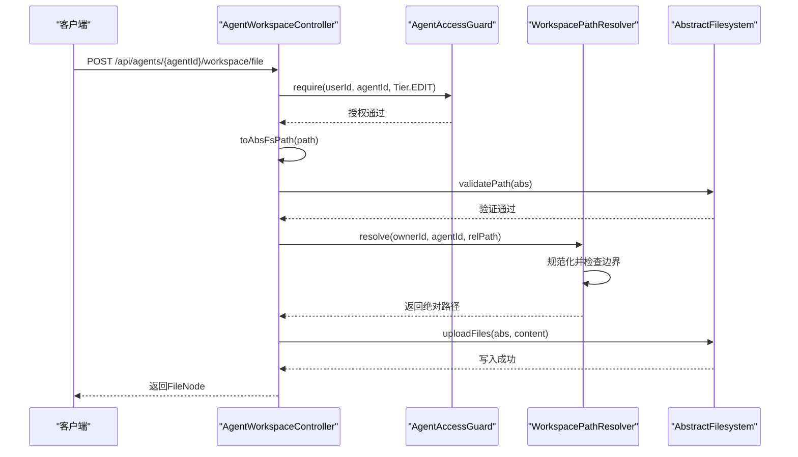
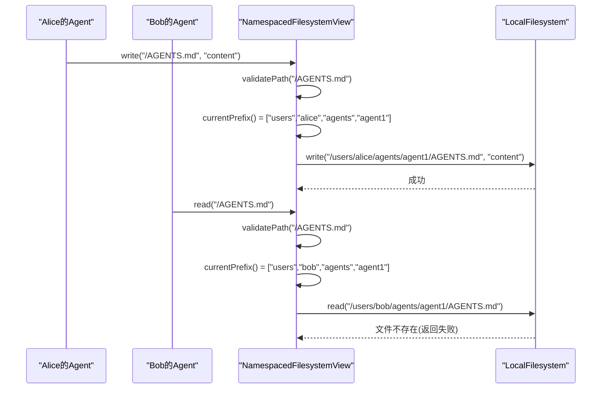
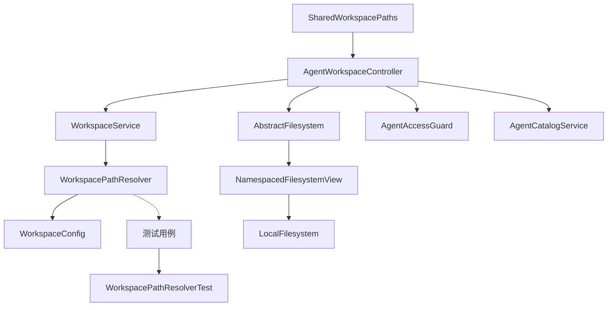

# 工作区路径管理API

<cite>
**本文档引用的文件**
- [WorkspacePathResolver.java](file://agentscope-builder-saton/src/main/java/io/agentscope/builder/saton/workspace/service/WorkspacePathResolver.java)
- [WorkspaceConfig.java](file://agentscope-builder-saton/src/main/java/io/agentscope/builder/saton/workspace/service/WorkspaceConfig.java)
- [WorkspaceService.java](file://agentscope-builder-saton/src/main/java/io/agentscope/builder/saton/workspace/service/WorkspaceService.java)
- [WorkspacePathResolverTest.java](file://agentscope-builder-saton/src/test/java/io/agentscope/builder/saton/workspace/service/WorkspacePathResolverTest.java)
- [AbstractFilesystem.java](file://agentscope-harness/src/main/java/io/agentscope/harness/agent/filesystem/AbstractFilesystem.java)
- [AgentWorkspaceController.java](file://agentscope-examples/agents/agentscope-builder/src/main/java/io/agentscope/builder/web/api/AgentWorkspaceController.java)
- [NamespacedFilesystemView.java](file://agentscope-examples/agents/agentscope-builder/src/main/java/io/agentscope/builder/web/workspace/NamespacedFilesystemView.java)
- [SharedWorkspacePaths.java](file://agentscope-examples/agents/agentscope-builder/src/main/java/io/agentscope/builder/web/workspace/SharedWorkspacePaths.java)
- [AgentCatalogService.java](file://agentscope-examples/agents/agentscope-builder/src/main/java/io/agentscope/builder/web/catalog/AgentCatalogService.java)
</cite>

## 目录
1. [简介](#简介)
2. [项目结构](#项目结构)
3. [核心组件](#核心组件)
4. [架构概览](#架构概览)
5. [详细组件分析](#详细组件分析)
6. [依赖关系分析](#依赖关系分析)
7. [性能考虑](#性能考虑)
8. [故障排除指南](#故障排除指南)
9. [结论](#结论)

## 简介
本文件为Agentscope Java项目中Workspace路径管理系统提供完整的API文档。系统围绕三个核心组件构建：WorkspacePathNormalizer（路径规范化器）、WorkspacePathPolicy（路径策略）和WorkspacePathResolver（路径解析器）。这些组件协同实现以下目标：
- 将用户输入的工作区路径进行安全规范化，拒绝危险的相对路径遍历（如包含".."段）
- 基于所有权和代理标识生成隔离且可预测的物理路径布局
- 提供严格的边界检查，防止越权访问和路径逃逸
- 支持工作区文件的读写、列出、删除等操作，并在多租户环境中确保数据隔离

## 项目结构
Workspace路径管理相关代码分布在多个模块中：
- 核心解析器：agentscope-builder-saton模块中的WorkspacePathResolver、WorkspaceConfig、WorkspaceService
- 文件系统抽象：agentscope-harness模块中的AbstractFilesystem接口
- Web层集成：agentscope-examples/agents/agentscope-builder模块中的AgentWorkspaceController、NamespacedFilesystemView、SharedWorkspacePaths
- 示例与测试：WorkspacePathResolverTest用于验证解析器行为

**图表来源**
- [WorkspacePathResolver.java:33-91](file://agentscope-builder-saton/src/main/java/io/agentscope/builder/saton/workspace/service/WorkspacePathResolver.java#L33-L91)
- [WorkspaceConfig.java:13-17](file://agentscope-builder-saton/src/main/java/io/agentscope/builder/saton/workspace/service/WorkspaceConfig.java#L13-L17)
- [WorkspaceService.java:35-37](file://agentscope-builder-saton/src/main/java/io/agentscope/builder/saton/workspace/service/WorkspaceService.java#L35-L37)
- [AbstractFilesystem.java:44-186](file://agentscope-harness/src/main/java/io/agentscope/harness/agent/filesystem/AbstractFilesystem.java#L44-L186)
- [AgentWorkspaceController.java:109-116](file://agentscope-examples/agents/agentscope-builder/src/main/java/io/agentscope/builder/web/api/AgentWorkspaceController.java#L109-L116)
- [NamespacedFilesystemView.java:52-192](file://agentscope-examples/agents/agentscope-builder/src/main/java/io/agentscope/builder/web/workspace/NamespacedFilesystemView.java#L52-L192)
- [SharedWorkspacePaths.java:29-77](file://agentscope-examples/agents/agentscope-builder/src/main/java/io/agentscope/builder/web/workspace/SharedWorkspacePaths.java#L29-L77)
- [AgentCatalogService.java:320-353](file://agentscope-examples/agents/agentscope-builder/src/main/java/io/agentscope/builder/web/catalog/AgentCatalogService.java#L320-L353)

**章节来源**
- [WorkspacePathResolver.java:1-92](file://agentscope-builder-saton/src/main/java/io/agentscope/builder/saton/workspace/service/WorkspacePathResolver.java#L1-L92)
- [WorkspaceConfig.java:1-19](file://agentscope-builder-saton/src/main/java/io/agentscope/builder/saton/workspace/service/WorkspaceConfig.java#L1-L19)
- [WorkspaceService.java:1-152](file://agentscope-builder-saton/src/main/java/io/agentscope/builder/saton/workspace/service/WorkspaceService.java#L1-L152)

## 核心组件
本节详细介绍三个核心组件的功能、接口和使用方式。

### WorkspacePathResolver（路径解析器）
WorkspacePathResolver负责将(ownerId, agentId, relPath)三元组解析为绝对物理路径，并执行严格的边界检查以防止路径逃逸。

主要功能：
- 根目录获取：提供全局root和用户级root的访问方法
- 代理私有路径解析：确保agent私有数据只能访问其专属目录
- 用户级共享路径解析：支持跨代理共享的用户级文件访问
- 边界检查：通过路径规范化和startsWith检查防止越界访问

关键API：
- `root()`：获取全局工作区根目录
- `userRoot(ownerId)`：获取用户级共享根目录
- `agentRoot(ownerId, agentId)`：获取代理私有根目录
- `resolveUser(ownerId, relPath)`：解析用户级相对路径
- `resolve(ownerId, agentId, relPath)`：解析代理级相对路径

**章节来源**
- [WorkspacePathResolver.java:33-91](file://agentscope-builder-saton/src/main/java/io/agentscope/builder/saton/workspace/service/WorkspacePathResolver.java#L33-L91)

### WorkspacePathPolicy（路径策略）
路径策略通过多种机制实现访问控制和边界检查：

1. **路径规范化器**（WorkspacePathNormalizer）
   - 拒绝包含".."段的相对路径
   - 自动为路径片段添加"-workspace"后缀
   - 支持null和空白输入的回退逻辑

2. **文件系统路径验证**
   - AbstractFilesystem.validatePath()拒绝包含".."的路径
   - NamespacedFilesystemView在每次操作前进行路径验证

3. **多租户命名空间**
   - NamespacedFilesystemView为每个(ownerId, agentId)组合生成唯一命名空间
   - 确保不同租户间的数据完全隔离

**章节来源**
- [AgentWorkspaceController.java:729-744](file://agentscope-examples/agents/agentscope-builder/src/main/java/io/agentscope/builder/web/api/AgentWorkspaceController.java#L729-L744)
- [AbstractFilesystem.java:178-185](file://agentscope-harness/src/main/java/io/agentscope/harness/agent/filesystem/AbstractFilesystem.java#L178-L185)
- [NamespacedFilesystemView.java:172-186](file://agentscope-examples/agents/agentscope-builder/src/main/java/io/agentscope/builder/web/workspace/NamespacedFilesystemView.java#L172-L186)

### WorkspacePathResolver（解析算法）
解析算法采用"规范化+边界检查"的双重保障机制：

**图表来源**
- [WorkspacePathResolver.java:80-90](file://agentscope-builder-saton/src/main/java/io/agentscope/builder/saton/workspace/service/WorkspacePathResolver.java#L80-L90)

**章节来源**
- [WorkspacePathResolver.java:67-90](file://agentscope-builder-saton/src/main/java/io/agentscope/builder/saton/workspace/service/WorkspacePathResolver.java#L67-L90)

## 架构概览
系统采用分层架构，从Web层到核心解析器再到文件系统抽象：

**图表来源**
- [AgentWorkspaceController.java:109-116](file://agentscope-examples/agents/agentscope-builder/src/main/java/io/agentscope/builder/web/api/AgentWorkspaceController.java#L109-L116)
- [WorkspaceService.java:35-37](file://agentscope-builder-saton/src/main/java/io/agentscope/builder/saton/workspace/service/WorkspaceService.java#L35-L37)
- [WorkspacePathResolver.java:37-39](file://agentscope-builder-saton/src/main/java/io/agentscope/builder/saton/workspace/service/WorkspacePathResolver.java#L37-L39)
- [AbstractFilesystem.java:44-186](file://agentscope-harness/src/main/java/io/agentscope/harness/agent/filesystem/AbstractFilesystem.java#L44-L186)
- [NamespacedFilesystemView.java:52-61](file://agentscope-examples/agents/agentscope-builder/src/main/java/io/agentscope/builder/web/workspace/NamespacedFilesystemView.java#L52-L61)

## 详细组件分析

### WorkspacePathResolver类图

**图表来源**
- [WorkspacePathResolver.java:33-91](file://agentscope-builder-saton/src/main/java/io/agentscope/builder/saton/workspace/service/WorkspacePathResolver.java#L33-L91)
- [WorkspaceConfig.java:13-17](file://agentscope-builder-saton/src/main/java/io/agentscope/builder/saton/workspace/service/WorkspaceConfig.java#L13-L17)
- [WorkspaceService.java:33-37](file://agentscope-builder-saton/src/main/java/io/agentscope/builder/saton/workspace/service/WorkspaceService.java#L33-L37)

### 路径规范化流程

**图表来源**
- [AgentWorkspaceController.java:264-287](file://agentscope-examples/agents/agentscope-builder/src/main/java/io/agentscope/builder/web/api/AgentWorkspaceController.java#L264-L287)
- [AbstractFilesystem.java:178-185](file://agentscope-harness/src/main/java/io/agentscope/harness/agent/filesystem/AbstractFilesystem.java#L178-L185)
- [WorkspacePathResolver.java:80-90](file://agentscope-builder-saton/src/main/java/io/agentscope/builder/saton/workspace/service/WorkspacePathResolver.java#L80-L90)

### 多租户命名空间机制

**图表来源**
- [NamespacedFilesystemView.java:172-186](file://agentscope-examples/agents/agentscope-builder/src/main/java/io/agentscope/builder/web/workspace/NamespacedFilesystemView.java#L172-L186)
- [AbstractFilesystem.java:178-185](file://agentscope-harness/src/main/java/io/agentscope/harness/agent/filesystem/AbstractFilesystem.java#L178-L185)

**章节来源**
- [WorkspacePathResolver.java:1-92](file://agentscope-builder-saton/src/main/java/io/agentscope/builder/saton/workspace/service/WorkspacePathResolver.java#L1-L92)
- [WorkspaceService.java:1-152](file://agentscope-builder-saton/src/main/java/io/agentscope/builder/saton/workspace/service/WorkspaceService.java#L1-L152)
- [AgentWorkspaceController.java:1-200](file://agentscope-examples/agents/agentscope-builder/src/main/java/io/agentscope/builder/web/api/AgentWorkspaceController.java#L1-L200)

## 依赖关系分析
系统各组件间的依赖关系如下：

**图表来源**
- [AgentWorkspaceController.java:109-116](file://agentscope-examples/agents/agentscope-builder/src/main/java/io/agentscope/builder/web/api/AgentWorkspaceController.java#L109-L116)
- [WorkspaceService.java:35-37](file://agentscope-builder-saton/src/main/java/io/agentscope/builder/saton/workspace/service/WorkspaceService.java#L35-L37)
- [WorkspacePathResolver.java:37-39](file://agentscope-builder-saton/src/main/java/io/agentscope/builder/saton/workspace/service/WorkspacePathResolver.java#L37-L39)
- [WorkspaceConfig.java:13-17](file://agentscope-builder-saton/src/main/java/io/agentscope/builder/saton/workspace/service/WorkspaceConfig.java#L13-L17)
- [NamespacedFilesystemView.java:52-61](file://agentscope-examples/agents/agentscope-builder/src/main/java/io/agentscope/builder/web/workspace/NamespacedFilesystemView.java#L52-L61)
- [SharedWorkspacePaths.java:29-42](file://agentscope-examples/agents/agentscope-builder/src/main/java/io/agentscope/builder/web/workspace/SharedWorkspacePaths.java#L29-L42)

**章节来源**
- [WorkspacePathResolverTest.java:1-108](file://agentscope-builder-saton/src/test/java/io/agentscope/builder/saton/workspace/service/WorkspacePathResolverTest.java#L1-L108)

## 性能考虑
- 路径解析复杂度：O(n)，其中n为路径段数量
- 文件系统操作：基于NIO，支持流式读取和写入
- 缓存策略：通过Spring容器管理单例实例，避免重复创建
- 并发处理：WorkspaceService不保证并发原子性，适用于单人视角场景

## 故障排除指南

### 常见错误及解决方案
1. **路径逃逸异常**
   - 现象：IllegalArgumentException("path escapes workspace")
   - 原因：相对路径包含".."段
   - 解决：使用绝对路径或重新组织相对路径

2. **空路径异常**
   - 现象：IllegalArgumentException("path must not be blank")
   - 原因：传入null或空白字符串
   - 解决：确保relPath非空且有意义

3. **代理ID无效**
   - 现象：IllegalArgumentException("agentId must not be blank")
   - 原因：agentId为null或空白
   - 解决：使用有效的业务ID字符串

4. **文件过大**
   - 现象：返回截断提示信息
   - 原因：文件大小超过512KB限制
   - 解决：分片读取或压缩文件

**章节来源**
- [WorkspacePathResolver.java:60-62](file://agentscope-builder-saton/src/main/java/io/agentscope/builder/saton/workspace/service/WorkspacePathResolver.java#L60-L62)
- [WorkspaceService.java:82-85](file://agentscope-builder-saton/src/main/java/io/agentscope/builder/saton/workspace/service/WorkspaceService.java#L82-L85)

## 结论
Agentscope的Workspace路径管理系统通过"路径规范化器+路径策略+路径解析器"的三层架构，实现了安全、可靠且高效的文件系统访问控制。系统特点包括：
- 强制的路径安全验证，有效防止路径遍历攻击
- 清晰的多租户命名空间隔离机制
- 简洁明了的API设计，易于集成和扩展
- 完善的边界检查和错误处理机制

该系统为Agentscope平台提供了坚实的工作区管理基础，支持复杂的多代理协作场景。