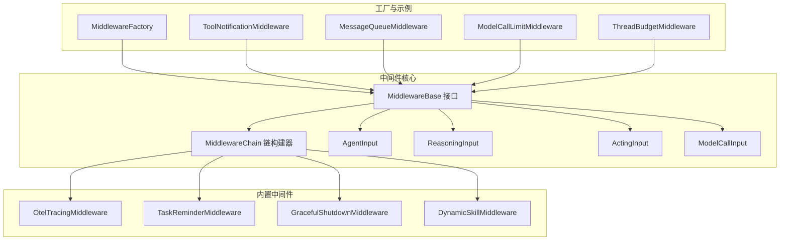
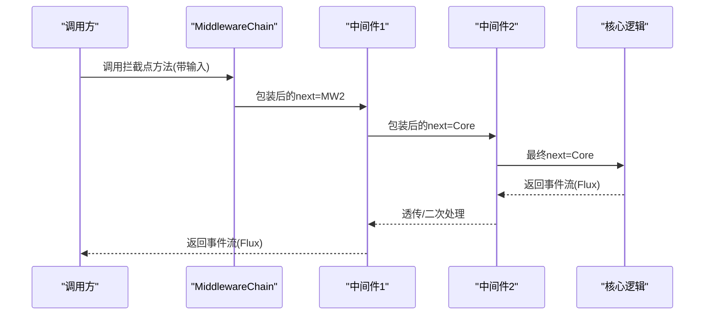
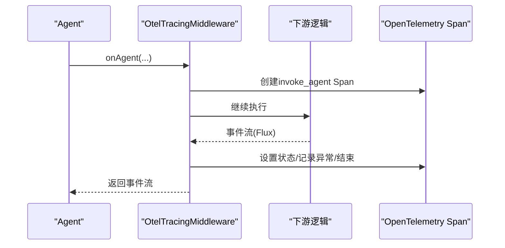
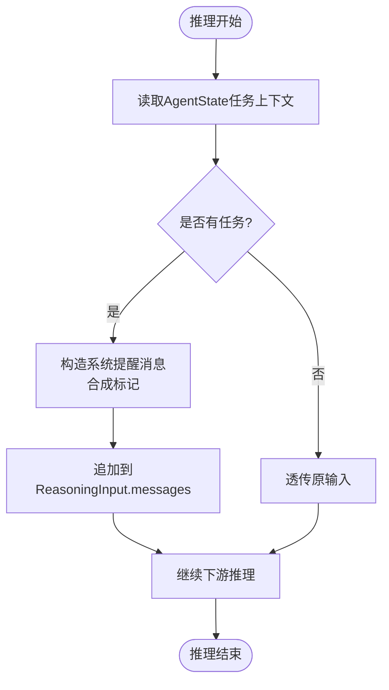
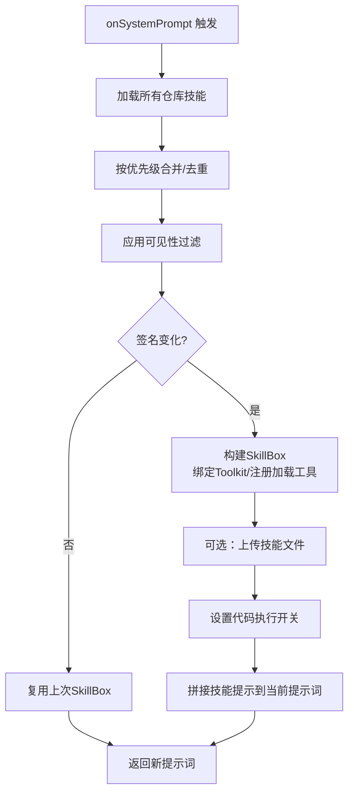
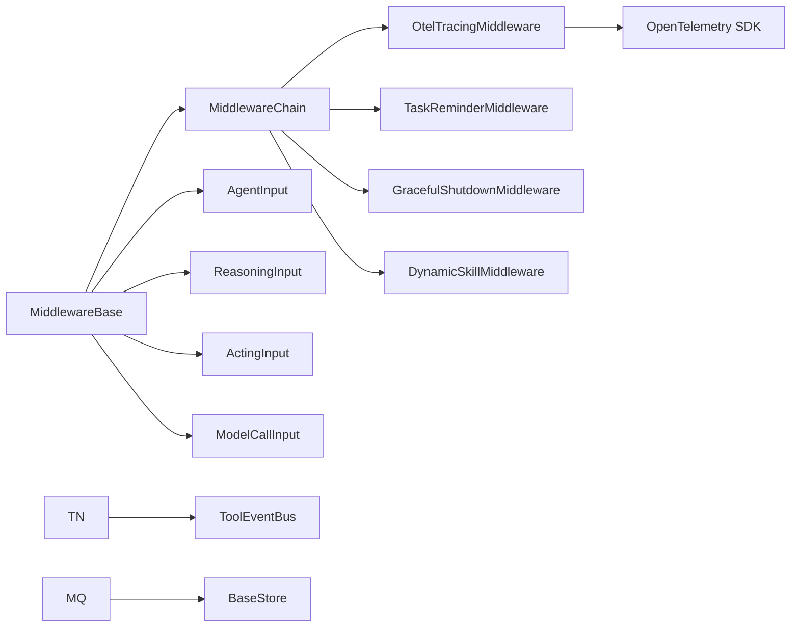

# 中间件API

<cite>
**本文引用的文件**   
- [MiddlewareBase.java](file://agentscope-core/src/main/java/io/agentscope/core/middleware/MiddlewareBase.java)
- [MiddlewareChain.java](file://agentscope-core/src/main/java/io/agentscope/core/middleware/MiddlewareChain.java)
- [AgentInput.java](file://agentscope-core/src/main/java/io/agentscope/core/middleware/AgentInput.java)
- [ReasoningInput.java](file://agentscope-core/src/main/java/io/agentscope/core/middleware/ReasoningInput.java)
- [ActingInput.java](file://agentscope-core/src/main/java/io/agentscope/core/middleware/ActingInput.java)
- [ModelCallInput.java](file://agentscope-core/src/main/java/io/agentscope/core/middleware/ModelCallInput.java)
- [TaskReminderMiddleware.java](file://agentscope-core/src/main/java/io/agentscope/core/middleware/TaskReminderMiddleware.java)
- [OtelTracingMiddleware.java](file://agentscope-core/src/main/java/io/agentscope/core/tracing/OtelTracingMiddleware.java)
- [GracefulShutdownMiddleware.java](file://agentscope-core/src/main/java/io/agentscope/core/shutdown/GracefulShutdownMiddleware.java)
- [DynamicSkillMiddleware.java](file://agentscope-core/src/main/java/io/agentscope/core/skill/DynamicSkillMiddleware.java)
- [MiddlewareFactory.java](file://agentscope-builder-saton/src/main/java/io/agentscope/builder/saton/factory/service/middleware/MiddlewareFactory.java)
- [ToolNotificationMiddleware.java](file://agentscope-examples/agents/agentscope-builder/src/main/java/io/agentscope/builder/web/toolbus/ToolNotificationMiddleware.java)
- [MessageQueueMiddleware.java](file://agentscope-examples/agents/agentscope-codingagent/src/main/java/io/agentscope/harness/coding/middleware/MessageQueueMiddleware.java)
- [ModelCallLimitMiddleware.java](file://agentscope-examples/agents/agentscope-codingagent/src/main/java/io/agentscope/harness/coding/middleware/ModelCallLimitMiddleware.java)
- [ThreadBudgetMiddleware.java](file://agentscope-examples/agents/agentscope-codingagent/src/main/java/io/agentscope/harness/coding/middleware/ThreadBudgetMiddleware.java)
</cite>

## 目录
1. [简介](#简介)
2. [项目结构](#项目结构)
3. [核心组件](#核心组件)
4. [架构总览](#架构总览)
5. [详细组件分析](#详细组件分析)
6. [依赖关系分析](#依赖关系分析)
7. [性能考量](#性能考量)
8. [故障排查指南](#故障排查指南)
9. [结论](#结论)
10. [附录：API与配置规范](#附录api与配置规范)

## 简介
本文件为中间件系统的详细API参考，覆盖以下主题：
- 中间件接口与生命周期钩子
- 中间件链构建与执行顺序
- 常见中间件（代理追踪、任务提醒、动态技能注入、优雅停机、线程预算与全局调用限制、工具事件通知、消息队列注入）
- 中间件注册、配置与自定义开发规范
- 性能监控、错误处理与调试接口
- 实际代码示例（通过源码路径指引）

## 项目结构
中间件体系位于核心模块中，围绕统一的拦截接口与洋葱式链路组织，典型目录如下：
- 接口与链路：MiddlewareBase、MiddlewareChain、各类输入数据对象
- 具体中间件：OtelTracingMiddleware、TaskReminderMiddleware、GracefulShutdownMiddleware、DynamicSkillMiddleware
- 工厂与类型：MiddlewareFactory（用于按类型实例化中间件）
- 示例中间件：ToolNotificationMiddleware、MessageQueueMiddleware、ModelCallLimitMiddleware、ThreadBudgetMiddleware

图表来源
- [MiddlewareBase.java:59-142](file://agentscope-core/src/main/java/io/agentscope/core/middleware/MiddlewareBase.java#L59-L142)
- [MiddlewareChain.java:31-78](file://agentscope-core/src/main/java/io/agentscope/core/middleware/MiddlewareChain.java#L31-L78)
- [AgentInput.java:21-26](file://agentscope-core/src/main/java/io/agentscope/core/middleware/AgentInput.java#L21-L26)
- [ReasoningInput.java:23-30](file://agentscope-core/src/main/java/io/agentscope/core/middleware/ReasoningInput.java#L23-L30)
- [ActingInput.java:21-26](file://agentscope-core/src/main/java/io/agentscope/core/middleware/ActingInput.java#L21-L26)
- [ModelCallInput.java:24-33](file://agentscope-core/src/main/java/io/agentscope/core/middleware/ModelCallInput.java#L24-L33)
- [OtelTracingMiddleware.java:72-344](file://agentscope-core/src/main/java/io/agentscope/core/tracing/OtelTracingMiddleware.java#L72-L344)
- [TaskReminderMiddleware.java:54-128](file://agentscope-core/src/main/java/io/agentscope/core/middleware/TaskReminderMiddleware.java#L54-L128)
- [GracefulShutdownMiddleware.java:53-96](file://agentscope-core/src/main/java/io/agentscope/core/shutdown/GracefulShutdownMiddleware.java#L53-L96)
- [DynamicSkillMiddleware.java:60-358](file://agentscope-core/src/main/java/io/agentscope/core/skill/DynamicSkillMiddleware.java#L60-L358)
- [MiddlewareFactory.java:20-41](file://agentscope-builder-saton/src/main/java/io/agentscope/builder/saton/factory/service/middleware/MiddlewareFactory.java#L20-L41)
- [ToolNotificationMiddleware.java:40-88](file://agentscope-examples/agents/agentscope-builder/src/main/java/io/agentscope/builder/web/toolbus/ToolNotificationMiddleware.java#L40-L88)
- [MessageQueueMiddleware.java:50-105](file://agentscope-examples/agents/agentscope-codingagent/src/main/java/io/agentscope/harness/coding/middleware/MessageQueueMiddleware.java#L50-L105)
- [ModelCallLimitMiddleware.java:35-72](file://agentscope-examples/agents/agentscope-codingagent/src/main/java/io/agentscope/harness/coding/middleware/ModelCallLimitMiddleware.java#L35-L72)
- [ThreadBudgetMiddleware.java:39-86](file://agentscope-examples/agents/agentscope-codingagent/src/main/java/io/agentscope/harness/coding/middleware/ThreadBudgetMiddleware.java#L39-L86)

章节来源
- [MiddlewareBase.java:25-58](file://agentscope-core/src/main/java/io/agentscope/core/middleware/MiddlewareBase.java#L25-L58)
- [MiddlewareChain.java:25-30](file://agentscope-core/src/main/java/io/agentscope/core/middleware/MiddlewareChain.java#L25-L30)

## 核心组件
- 中间件接口：定义五处拦截点（onAgent、onReasoning、onActing、onModelCall）与一处变换管线（onSystemPrompt），默认透传至下一个中间件或核心逻辑。
- 中间件链：将多个中间件按“外层到内层”的顺序包裹，形成洋葱式调用链。
- 输入模型：AgentInput、ReasoningInput、ActingInput、ModelCallInput，分别承载不同阶段的上下文输入。

章节来源
- [MiddlewareBase.java:59-142](file://agentscope-core/src/main/java/io/agentscope/core/middleware/MiddlewareBase.java#L59-L142)
- [MiddlewareChain.java:46-62](file://agentscope-core/src/main/java/io/agentscope/core/middleware/MiddlewareChain.java#L46-L62)
- [AgentInput.java:21-26](file://agentscope-core/src/main/java/io/agentscope/core/middleware/AgentInput.java#L21-L26)
- [ReasoningInput.java:23-30](file://agentscope-core/src/main/java/io/agentscope/core/middleware/ReasoningInput.java#L23-L30)
- [ActingInput.java:21-26](file://agentscope-core/src/main/java/io/agentscope/core/middleware/ActingInput.java#L21-L26)
- [ModelCallInput.java:24-33](file://agentscope-core/src/main/java/io/agentscope/core/middleware/ModelCallInput.java#L24-L33)

## 架构总览
中间件在Agent生命周期的关键节点进行拦截与增强，支持事件流式处理与上下文传递。链式构建确保中间件可插拔组合，且具备良好的性能与可观测性。

图表来源
- [MiddlewareChain.java:46-62](file://agentscope-core/src/main/java/io/agentscope/core/middleware/MiddlewareChain.java#L46-L62)
- [MiddlewareBase.java:70-127](file://agentscope-core/src/main/java/io/agentscope/core/middleware/MiddlewareBase.java#L70-L127)

## 详细组件分析

### 中间件接口与生命周期
- 拦截点
  - onAgent：拦截整个Agent调用，适合鉴权、限流、会话管理等。
  - onReasoning：拦截推理/模型调用阶段，适合日志、追踪、策略控制。
  - onActing：拦截工具调用执行阶段，适合审计、通知、熔断。
  - onModelCall：拦截原始模型API调用，适合配额、缓存、代理转发。
  - onSystemPrompt：管道式变换系统提示词，适合动态技能注入、上下文注入。
- 默认行为：每个钩子默认直接调用next，便于仅覆盖所需点位。

章节来源
- [MiddlewareBase.java:25-58](file://agentscope-core/src/main/java/io/agentscope/core/middleware/MiddlewareBase.java#L25-L58)
- [MiddlewareBase.java:70-142](file://agentscope-core/src/main/java/io/agentscope/core/middleware/MiddlewareBase.java#L70-L142)

### 中间件链构建与执行顺序
- 构建策略：从后向前包裹，最后一个中间件最外层，第一个中间件最内层。
- 执行顺序：外层先于内层进入，内层先于外层退出；onComplete/onError/onCancel钩子按顺序触发。
- 上下文传播：通过Reactor Context与OpenTelemetry上下文传播操作符保证跨线程可见。

章节来源
- [MiddlewareChain.java:25-30](file://agentscope-core/src/main/java/io/agentscope/core/middleware/MiddlewareChain.java#L25-L30)
- [MiddlewareChain.java:46-62](file://agentscope-core/src/main/java/io/agentscope/core/middleware/MiddlewareChain.java#L46-L62)

### 代理追踪中间件（OpenTelemetry）
- 功能要点
  - 为Agent调用、模型调用、工具执行生成独立Span，设置通用属性（如gen_ai.*）。
  - 自动注册Reactor上下文传播钩子，保证跨线程/调度器的父Span关联。
  - 在事件流上设置状态码、异常记录、取消状态，结束Span。
- 使用建议
  - 与Tracing配置配合，避免无OTel SDK时的额外开销。
  - 关注工具批量调用的Span命名与call id聚合。

图表来源
- [OtelTracingMiddleware.java:97-159](file://agentscope-core/src/main/java/io/agentscope/core/tracing/OtelTracingMiddleware.java#L97-L159)
- [OtelTracingMiddleware.java:165-228](file://agentscope-core/src/main/java/io/agentscope/core/tracing/OtelTracingMiddleware.java#L165-L228)
- [OtelTracingMiddleware.java:234-305](file://agentscope-core/src/main/java/io/agentscope/core/tracing/OtelTracingMiddleware.java#L234-L305)

章节来源
- [OtelTracingMiddleware.java:44-71](file://agentscope-core/src/main/java/io/agentscope/core/tracing/OtelTracingMiddleware.java#L44-L71)
- [OtelTracingMiddleware.java:311-317](file://agentscope-core/src/main/java/io/agentscope/core/tracing/OtelTracingMiddleware.java#L311-L317)

### 任务提醒中间件（Task Reminder）
- 功能要点
  - 在系统提示词阶段注入静态“使用说明”。
  - 在每次推理前注入“系统提醒”消息，包含当前任务清单，标记为合成内容，不持久化。
- 适用场景
  - 长流程任务保持上下文一致性，避免对话压缩导致的任务状态丢失。

图表来源
- [TaskReminderMiddleware.java:74-100](file://agentscope-core/src/main/java/io/agentscope/core/middleware/TaskReminderMiddleware.java#L74-L100)

章节来源
- [TaskReminderMiddleware.java:33-53](file://agentscope-core/src/main/java/io/agentscope/core/middleware/TaskReminderMiddleware.java#L33-L53)
- [TaskReminderMiddleware.java:102-128](file://agentscope-core/src/main/java/io/agentscope/core/middleware/TaskReminderMiddleware.java#L102-L128)

### 动态技能注入中间件（Dynamic Skill）
- 功能要点
  - 基于仓库列表合并/去重，按优先级覆盖，动态生成技能提示并注入系统提示词。
  - 支持运行时可见性过滤、工作目录稳定化、文件上传、代码执行开关。
  - 内容指纹缓存，避免重复重建。
- 适用场景
  - 多用户隔离、市场/商店集成、按环境/灰度动态启用技能。

图表来源
- [DynamicSkillMiddleware.java:129-143](file://agentscope-core/src/main/java/io/agentscope/core/skill/DynamicSkillMiddleware.java#L129-L143)
- [DynamicSkillMiddleware.java:166-256](file://agentscope-core/src/main/java/io/agentscope/core/skill/DynamicSkillMiddleware.java#L166-L256)

章节来源
- [DynamicSkillMiddleware.java:40-58](file://agentscope-core/src/main/java/io/agentscope/core/skill/DynamicSkillMiddleware.java#L40-L58)
- [DynamicSkillMiddleware.java:115-121](file://agentscope-core/src/main/java/io/agentscope/core/skill/DynamicSkillMiddleware.java#L115-L121)

### 优雅停机中间件（Graceful Shutdown）
- 功能要点
  - 在推理与行动完成后检查系统停机状态，安全中断当前请求，避免浪费输出token。
  - 通过Reactor Context中的requestId进行独立跟踪与注销。
- 适用场景
  - 集群/服务滚动升级、资源回收、强制超时保护。

章节来源
- [GracefulShutdownMiddleware.java:30-52](file://agentscope-core/src/main/java/io/agentscope/core/shutdown/GracefulShutdownMiddleware.java#L30-L52)
- [GracefulShutdownMiddleware.java:63-95](file://agentscope-core/src/main/java/io/agentscope/core/shutdown/GracefulShutdownMiddleware.java#L63-L95)

### 工具事件通知中间件（Tool Notification）
- 功能要点
  - 在工具执行前向事件总线发布工具调用事件，支持实时SSE推送。
  - 会话键来自RuntimeContext的sessionId或userId。
- 适用场景
  - 实时前端交互、工具执行可视化、调试与可观测性。

章节来源
- [ToolNotificationMiddleware.java:31-39](file://agentscope-examples/agents/agentscope-builder/src/main/java/io/agentscope/builder/web/toolbus/ToolNotificationMiddleware.java#L31-L39)
- [ToolNotificationMiddleware.java:50-79](file://agentscope-examples/agents/agentscope-builder/src/main/java/io/agentscope/builder/web/toolbus/ToolNotificationMiddleware.java#L50-L79)

### 消息队列注入中间件（Message Queue）
- 功能要点
  - 在系统提示词阶段读取线程本地标识，从存储中拉取并注入队列消息，随后清理。
  - 通过ThreadLocal CURRENT_THREAD_ID传递线程标识。
- 适用场景
  - 异步回调/Webhook驱动的多轮注入、批处理消息透传。

章节来源
- [MessageQueueMiddleware.java:28-48](file://agentscope-examples/agents/agentscope-codingagent/src/main/java/io/agentscope/harness/coding/middleware/MessageQueueMiddleware.java#L28-L48)
- [MessageQueueMiddleware.java:66-82](file://agentscope-examples/agents/agentscope-codingagent/src/main/java/io/agentscope/harness/coding/middleware/MessageQueueMiddleware.java#L66-L82)
- [MessageQueueMiddleware.java:84-104](file://agentscope-examples/agents/agentscope-codingagent/src/main/java/io/agentscope/harness/coding/middleware/MessageQueueMiddleware.java#L84-L104)

### 全局调用限制中间件（Model Call Limit）
- 功能要点
  - 全局计数器限制模型调用次数，超过阈值抛出异常终止。
- 适用场景
  - 成本控制、试用期保护、突发流量兜底。

章节来源
- [ModelCallLimitMiddleware.java:29-48](file://agentscope-examples/agents/agentscope-codingagent/src/main/java/io/agentscope/harness/coding/middleware/ModelCallLimitMiddleware.java#L29-L48)
- [ModelCallLimitMiddleware.java:50-67](file://agentscope-examples/agents/agentscope-codingagent/src/main/java/io/agentscope/harness/coding/middleware/ModelCallLimitMiddleware.java#L50-L67)

### 线程预算中间件（Thread Budget）
- 功能要点
  - 基于线程标识统计模型调用次数，超过阈值终止当前线程的运行。
- 适用场景
  - 并发场景下的资源隔离与公平性控制。

章节来源
- [ThreadBudgetMiddleware.java:30-48](file://agentscope-examples/agents/agentscope-codingagent/src/main/java/io/agentscope/harness/coding/middleware/ThreadBudgetMiddleware.java#L30-L48)
- [ThreadBudgetMiddleware.java:50-81](file://agentscope-examples/agents/agentscope-codingagent/src/main/java/io/agentscope/harness/coding/middleware/ThreadBudgetMiddleware.java#L50-L81)

## 依赖关系分析
- 中间件对核心模块的依赖
  - MiddlewareBase/MiddlewareChain：核心接口与链构建
  - 输入模型：AgentInput/ReasoningInput/ActingInput/ModelCallInput
  - 运行时上下文：RuntimeContext、Agent、事件模型（AgentEvent等）
- 第三方与外部集成
  - OpenTelemetry：OtelTracingMiddleware
  - 事件总线：ToolNotificationMiddleware
  - 存储/键空间：MessageQueueMiddleware
  - 线程池/调度：GracefulShutdownMiddleware（与全局管理器协作）

图表来源
- [MiddlewareBase.java:18-23](file://agentscope-core/src/main/java/io/agentscope/core/middleware/MiddlewareBase.java#L18-L23)
- [OtelTracingMiddleware.java:30-42](file://agentscope-core/src/main/java/io/agentscope/core/tracing/OtelTracingMiddleware.java#L30-L42)
- [ToolNotificationMiddleware.java:23-29](file://agentscope-examples/agents/agentscope-builder/src/main/java/io/agentscope/builder/web/toolbus/ToolNotificationMiddleware.java#L23-L29)
- [MessageQueueMiddleware.java:21-26](file://agentscope-examples/agents/agentscope-codingagent/src/main/java/io/agentscope/harness/coding/middleware/MessageQueueMiddleware.java#L21-L26)

## 性能考量
- 链路深度与开销
  - 中间件数量增加带来包裹与上下文传播成本，建议按需组合。
  - 无OTel SDK时，OtelTracingMiddleware短路，近似零开销。
- 变换管线
  - onSystemPrompt串行执行，注意提示词拼接与计算复杂度。
- 缓存与短路
  - DynamicSkillMiddleware基于内容指纹缓存SkillBox，减少重复构建。
- 流式处理
  - 使用Flux/Mono进行背压与异步处理，避免阻塞。

## 故障排查指南
- OpenTelemetry未生效
  - 确认已引入OTel SDK并正确初始化；无SDK时中间件将短路。
  - 检查Reactor上下文传播是否注册。
- 工具事件未推送
  - 确认ToolNotificationMiddleware已注入，并且会话键可解析。
- 线程预算/全局限制未生效
  - 确认ThreadBudgetMiddleware与MessageQueueMiddleware的CURRENT_THREAD_ID设置与清理。
  - 检查ModelCallLimitMiddleware的阈值与累计计数。
- 技能注入为空或不一致
  - 检查仓库可用性、可见性过滤逻辑、内容指纹是否变化。
- 优雅停机未触发
  - 确认请求已在AgentBase.call中注册requestId并在finally中注销。

章节来源
- [OtelTracingMiddleware.java:54-62](file://agentscope-core/src/main/java/io/agentscope/core/tracing/OtelTracingMiddleware.java#L54-L62)
- [ToolNotificationMiddleware.java:63-76](file://agentscope-examples/agents/agentscope-builder/src/main/java/io/agentscope/builder/web/toolbus/ToolNotificationMiddleware.java#L63-L76)
- [MessageQueueMiddleware.java:67-82](file://agentscope-examples/agents/agentscope-codingagent/src/main/java/io/agentscope/harness/coding/middleware/MessageQueueMiddleware.java#L67-L82)
- [ModelCallLimitMiddleware.java:56-67](file://agentscope-examples/agents/agentscope-codingagent/src/main/java/io/agentscope/harness/coding/middleware/ModelCallLimitMiddleware.java#L56-L67)
- [ThreadBudgetMiddleware.java:56-81](file://agentscope-examples/agents/agentscope-codingagent/src/main/java/io/agentscope/harness/coding/middleware/ThreadBudgetMiddleware.java#L56-L81)
- [DynamicSkillMiddleware.java:177-183](file://agentscope-core/src/main/java/io/agentscope/core/skill/DynamicSkillMiddleware.java#L177-L183)
- [GracefulShutdownMiddleware.java:33-38](file://agentscope-core/src/main/java/io/agentscope/core/shutdown/GracefulShutdownMiddleware.java#L33-L38)

## 结论
中间件系统通过统一接口与洋葱式链路，提供了高扩展性的Agent生命周期增强能力。结合OpenTelemetry、事件总线、存储与预算控制等机制，可在保证性能的同时实现可观测性、可控性与可维护性。建议按需组合中间件，充分利用缓存与短路策略，并在生产环境完善监控与告警。

## 附录：API与配置规范

### 中间件注册与配置
- 注册方式
  - 通过工厂按类型字符串与属性实例化中间件，或直接构造后加入链路。
- 类型与属性
  - 类型由实现类注册表管理；属性为Map形式传入，具体字段由各中间件实现定义。
- 顺序规则
  - 列表中靠前的中间件更外层，靠后的中间件更内层。

章节来源
- [MiddlewareFactory.java:28-40](file://agentscope-builder-saton/src/main/java/io/agentscope/builder/saton/factory/service/middleware/MiddlewareFactory.java#L28-L40)

### 生命周期钩子API规范
- onAgent(Agent, RuntimeContext, AgentInput, next)
  - 输入：AgentInput（消息列表）
  - 返回：Flux<AgentEvent>
- onReasoning(Agent, RuntimeContext, ReasoningInput, next)
  - 输入：ReasoningInput（消息、工具、生成选项）
  - 返回：Flux<AgentEvent>
- onActing(Agent, RuntimeContext, ActingInput, next)
  - 输入：ActingInput（工具调用块列表）
  - 返回：Flux<AgentEvent>
- onModelCall(Agent, RuntimeContext, ModelCallInput, next)
  - 输入：ModelCallInput（消息、工具、生成选项、模型实例）
  - 返回：Flux<AgentEvent>
- onSystemPrompt(Agent, RuntimeContext, currentPrompt)
  - 输入：当前系统提示词
  - 返回：Mono<String>（新提示词）

章节来源
- [MiddlewareBase.java:70-142](file://agentscope-core/src/main/java/io/agentscope/core/middleware/MiddlewareBase.java#L70-L142)
- [AgentInput.java:21-26](file://agentscope-core/src/main/java/io/agentscope/core/middleware/AgentInput.java#L21-L26)
- [ReasoningInput.java:23-30](file://agentscope-core/src/main/java/io/agentscope/core/middleware/ReasoningInput.java#L23-L30)
- [ActingInput.java:21-26](file://agentscope-core/src/main/java/io/agentscope/core/middleware/ActingInput.java#L21-L26)
- [ModelCallInput.java:24-33](file://agentscope-core/src/main/java/io/agentscope/core/middleware/ModelCallInput.java#L24-L33)

### 输入模型与关键字段
- AgentInput
  - msgs：消息列表
- ReasoningInput
  - messages：发送给模型的消息
  - tools：可用工具Schema列表
  - options：生成选项
- ActingInput
  - toolCalls：待执行的工具调用块列表
- ModelCallInput
  - messages、tools、options、model：同ReasoningInput并包含模型实例

章节来源
- [AgentInput.java:21-26](file://agentscope-core/src/main/java/io/agentscope/core/middleware/AgentInput.java#L21-L26)
- [ReasoningInput.java:23-30](file://agentscope-core/src/main/java/io/agentscope/core/middleware/ReasoningInput.java#L23-L30)
- [ActingInput.java:21-26](file://agentscope-core/src/main/java/io/agentscope/core/middleware/ActingInput.java#L21-L26)
- [ModelCallInput.java:24-33](file://agentscope-core/src/main/java/io/agentscope/core/middleware/ModelCallInput.java#L24-L33)

### 自定义中间件开发步骤
- 实现接口
  - 选择需要覆盖的钩子，重写对应方法，默认透传next。
- 组装链路
  - 使用MiddlewareChain.build按顺序组装中间件列表。
- 注册与注入
  - 通过工厂或直接注入到Agent构建器中。
- 测试与验证
  - 使用事件流断言、OpenTelemetry导出、日志与异常捕获验证行为。

章节来源
- [MiddlewareChain.java:46-62](file://agentscope-core/src/main/java/io/agentscope/core/middleware/MiddlewareChain.java#L46-L62)
- [MiddlewareFactory.java:32-40](file://agentscope-builder-saton/src/main/java/io/agentscope/builder/saton/factory/service/middleware/MiddlewareFactory.java#L32-L40)

### 实际示例（代码路径）
- 代理追踪中间件
  - [OtelTracingMiddleware.java:97-159](file://agentscope-core/src/main/java/io/agentscope/core/tracing/OtelTracingMiddleware.java#L97-L159)
- 任务提醒中间件
  - [TaskReminderMiddleware.java:74-100](file://agentscope-core/src/main/java/io/agentscope/core/middleware/TaskReminderMiddleware.java#L74-L100)
- 动态技能注入中间件
  - [DynamicSkillMiddleware.java:129-143](file://agentscope-core/src/main/java/io/agentscope/core/skill/DynamicSkillMiddleware.java#L129-L143)
- 优雅停机中间件
  - [GracefulShutdownMiddleware.java:63-95](file://agentscope-core/src/main/java/io/agentscope/core/shutdown/GracefulShutdownMiddleware.java#L63-L95)
- 工具事件通知中间件
  - [ToolNotificationMiddleware.java:50-79](file://agentscope-examples/agents/agentscope-builder/src/main/java/io/agentscope/builder/web/toolbus/ToolNotificationMiddleware.java#L50-L79)
- 消息队列注入中间件
  - [MessageQueueMiddleware.java:66-82](file://agentscope-examples/agents/agentscope-codingagent/src/main/java/io/agentscope/harness/coding/middleware/MessageQueueMiddleware.java#L66-L82)
- 全局调用限制中间件
  - [ModelCallLimitMiddleware.java:50-67](file://agentscope-examples/agents/agentscope-codingagent/src/main/java/io/agentscope/harness/coding/middleware/ModelCallLimitMiddleware.java#L50-L67)
- 线程预算中间件
  - [ThreadBudgetMiddleware.java:50-81](file://agentscope-examples/agents/agentscope-codingagent/src/main/java/io/agentscope/harness/coding/middleware/ThreadBudgetMiddleware.java#L50-L81)