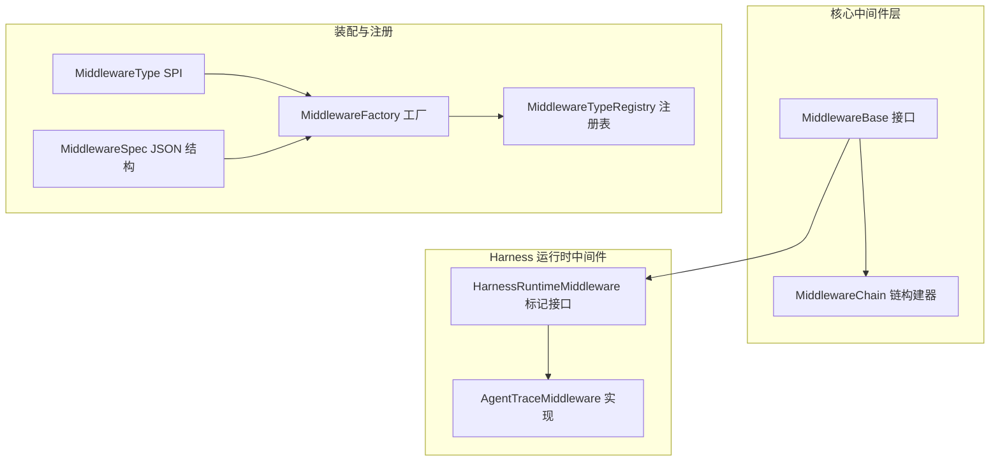
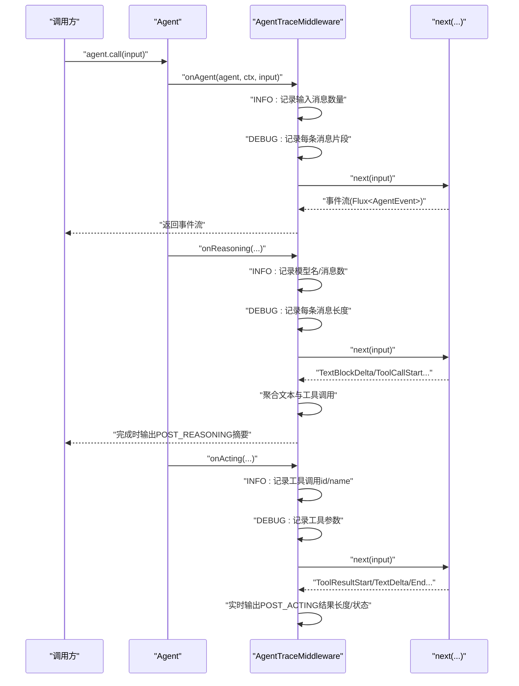
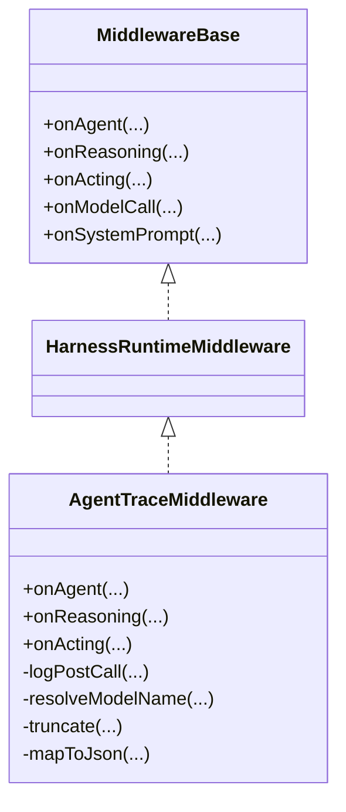
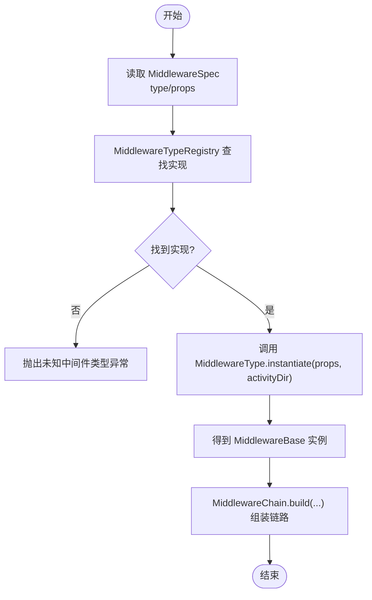
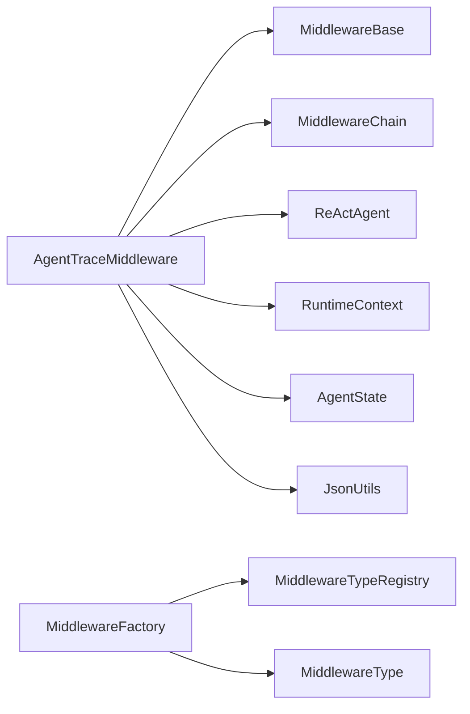

# 代理追踪中间件

<cite>
**本文引用的文件**
- [AgentTraceMiddleware.java](file://agentscope-harness/src/main/java/io/agentscope/harness/agent/middleware/AgentTraceMiddleware.java)
- [HarnessRuntimeMiddleware.java](file://agentscope-harness/src/main/java/io/agentscope/harness/agent/middleware/HarnessRuntimeMiddleware.java)
- [MiddlewareBase.java](file://agentscope-core/src/main/java/io/agentscope/core/middleware/MiddlewareBase.java)
- [MiddlewareChain.java](file://agentscope-core/src/main/java/io/agentscope/core/middleware/MiddlewareChain.java)
- [MiddlewareFactory.java](file://agentscope-builder-saton/src/main/java/io/agentscope/builder/saton/factory/service/middleware/MiddlewareFactory.java)
- [MiddlewareType.java](file://agentscope-builder-saton/src/main/java/io/agentscope/builder/saton/factory/service/middleware/MiddlewareType.java)
- [MiddlewareTypeRegistry.java](file://agentscope-builder-saton/src/main/java/io/agentscope/builder/saton/factory/service/middleware/MiddlewareTypeRegistry.java)
- [MiddlewareSpec.java](file://agentscope-builder-saton/src/main/java/io/agentscope/builder/saton/agent/orm/entity/MiddlewareSpec.java)
- [architecture.md](file://docs/v2/zh/docs/harness/architecture.md)
</cite>

## 目录
1. [简介](#简介)
2. [项目结构](#项目结构)
3. [核心组件](#核心组件)
4. [架构总览](#架构总览)
5. [详细组件分析](#详细组件分析)
6. [依赖关系分析](#依赖关系分析)
7. [性能考量](#性能考量)
8. [故障排查指南](#故障排查指南)
9. [结论](#结论)
10. [附录](#附录)

## 简介
本文件为代理追踪中间件（AgentTraceMiddleware）的详细API与使用文档。该中间件用于在代理推理与行动阶段输出可观测性日志，帮助开发者在INFO与DEBUG两个日志级别下，分别获取简洁摘要与完整细节，从而进行行为调试与性能分析。文档涵盖以下要点：
- AgentTraceMiddleware类的实现原理与拦截点
- 代理调用、推理与行动阶段的日志记录机制
- INFO与DEBUG级别的日志格式与内容差异
- 日志在不同阶段的输出字段与截断策略
- 中间件在不同日志级别下的行为说明
- 如何通过日志进行代理行为调试与性能分析
- 实际使用示例与配置建议

## 项目结构
AgentTraceMiddleware位于harness模块中，作为运行时中间件，遵循核心中间件接口规范，并通过工厂与类型注册表在构建期或运行期被装配到代理执行链路中。

图表来源
- [MiddlewareBase.java:1-144](file://agentscope-core/src/main/java/io/agentscope/core/middleware/MiddlewareBase.java#L1-L144)
- [MiddlewareChain.java:1-79](file://agentscope-core/src/main/java/io/agentscope/core/middleware/MiddlewareChain.java#L1-L79)
- [HarnessRuntimeMiddleware.java:1-26](file://agentscope-harness/src/main/java/io/agentscope/harness/agent/middleware/HarnessRuntimeMiddleware.java#L1-L26)
- [AgentTraceMiddleware.java:1-285](file://agentscope-harness/src/main/java/io/agentscope/harness/agent/middleware/AgentTraceMiddleware.java#L1-L285)
- [MiddlewareFactory.java:1-41](file://agentscope-builder-saton/src/main/java/io/agentscope/builder/saton/factory/service/middleware/MiddlewareFactory.java#L1-L41)
- [MiddlewareType.java:1-20](file://agentscope-builder-saton/src/main/java/io/agentscope/builder/saton/factory/service/middleware/MiddlewareType.java#L1-L20)
- [MiddlewareTypeRegistry.java:1-15](file://agentscope-builder-saton/src/main/java/io/agentscope/builder/saton/factory/service/middleware/MiddlewareTypeRegistry.java#L1-L15)
- [MiddlewareSpec.java:1-10](file://agentscope-builder-saton/src/main/java/io/agentscope/builder/saton/agent/orm/entity/MiddlewareSpec.java#L1-L10)

章节来源
- [architecture.md:1-27](file://docs/v2/zh/docs/harness/architecture.md#L1-L27)

## 核心组件
- AgentTraceMiddleware：实现HarnessRuntimeMiddleware，覆盖代理调用、推理与行动三个阶段的日志记录，支持INFO与DEBUG两级日志输出。
- MiddlewareBase：定义中间件拦截点与默认行为，采用洋葱模型组织链式调用。
- MiddlewareChain：负责将多个中间件按顺序组装成洋葱式调用链。
- MiddlewareFactory/MiddlewareType/MiddlewareTypeRegistry：提供基于类型字符串的中间件实例化能力，支持从配置中加载并装配中间件。
- MiddlewareSpec：描述中间件配置项的JSON结构（type与props）。

章节来源
- [AgentTraceMiddleware.java:44-51](file://agentscope-harness/src/main/java/io/agentscope/harness/agent/middleware/AgentTraceMiddleware.java#L44-L51)
- [MiddlewareBase.java:25-58](file://agentscope-core/src/main/java/io/agentscope/core/middleware/MiddlewareBase.java#L25-L58)
- [MiddlewareChain.java:25-62](file://agentscope-core/src/main/java/io/agentscope/core/middleware/MiddlewareChain.java#L25-L62)
- [MiddlewareFactory.java:13-41](file://agentscope-builder-saton/src/main/java/io/agentscope/builder/saton/factory/service/middleware/MiddlewareFactory.java#L13-L41)
- [MiddlewareType.java:9-20](file://agentscope-builder-saton/src/main/java/io/agentscope/builder/saton/factory/service/middleware/MiddlewareType.java#L9-L20)
- [MiddlewareTypeRegistry.java:8-15](file://agentscope-builder-saton/src/main/java/io/agentscope/builder/saton/factory/service/middleware/MiddlewareTypeRegistry.java#L8-L15)
- [MiddlewareSpec.java:5-10](file://agentscope-builder-saton/src/main/java/io/agentscope/builder/saton/agent/orm/entity/MiddlewareSpec.java#L5-L10)

## 架构总览
AgentTraceMiddleware在代理生命周期的关键节点插入日志逻辑：
- onAgent：记录输入消息数量与消息片段（DEBUG）
- onReasoning：记录模型名、消息条数与文本摘要，以及工具调用信息
- onActing：记录工具调用参数（DEBUG）与工具结果长度与状态

图表来源
- [AgentTraceMiddleware.java:55-85](file://agentscope-harness/src/main/java/io/agentscope/harness/agent/middleware/AgentTraceMiddleware.java#L55-L85)
- [AgentTraceMiddleware.java:87-155](file://agentscope-harness/src/main/java/io/agentscope/harness/agent/middleware/AgentTraceMiddleware.java#L87-L155)
- [AgentTraceMiddleware.java:157-219](file://agentscope-harness/src/main/java/io/agentscope/harness/agent/middleware/AgentTraceMiddleware.java#L157-L219)

## 详细组件分析

### AgentTraceMiddleware 类
- 继承关系：实现HarnessRuntimeMiddleware，后者继承MiddlewareBase
- 日志级别控制：仅当INFO级别可用时才输出摘要；DEBUG级别额外输出详细内容
- 关键拦截点：
  - onAgent：记录输入消息数量；DEBUG下逐条输出消息角色与文本片段
  - onReasoning：记录模型名、消息数量；聚合文本与工具调用，输出POST_REASONING摘要
  - onActing：记录工具调用id/name；DEBUG下输出参数；实时输出工具结果长度与状态
- 截断策略：对长文本与参数进行截断，避免日志膨胀
- 错误处理：捕获异常并在INFO级别输出错误摘要

图表来源
- [MiddlewareBase.java:59-143](file://agentscope-core/src/main/java/io/agentscope/core/middleware/MiddlewareBase.java#L59-L143)
- [HarnessRuntimeMiddleware.java:20-25](file://agentscope-harness/src/main/java/io/agentscope/harness/agent/middleware/HarnessRuntimeMiddleware.java#L20-L25)
- [AgentTraceMiddleware.java:51-285](file://agentscope-harness/src/main/java/io/agentscope/harness/agent/middleware/AgentTraceMiddleware.java#L51-L285)

章节来源
- [AgentTraceMiddleware.java:44-51](file://agentscope-harness/src/main/java/io/agentscope/harness/agent/middleware/AgentTraceMiddleware.java#L44-L51)
- [AgentTraceMiddleware.java:55-85](file://agentscope-harness/src/main/java/io/agentscope/harness/agent/middleware/AgentTraceMiddleware.java#L55-L85)
- [AgentTraceMiddleware.java:87-155](file://agentscope-harness/src/main/java/io/agentscope/harness/agent/middleware/AgentTraceMiddleware.java#L87-L155)
- [AgentTraceMiddleware.java:157-219](file://agentscope-harness/src/main/java/io/agentscope/harness/agent/middleware/AgentTraceMiddleware.java#L157-L219)
- [AgentTraceMiddleware.java:221-255](file://agentscope-harness/src/main/java/io/agentscope/harness/agent/middleware/AgentTraceMiddleware.java#L221-L255)
- [AgentTraceMiddleware.java:257-283](file://agentscope-harness/src/main/java/io/agentscope/harness/agent/middleware/AgentTraceMiddleware.java#L257-L283)

### 日志格式与内容差异（INFO vs DEBUG）

- 代理调用阶段（onAgent）
  - INFO：输出“代理名 + 输入消息数量”
  - DEBUG：逐条输出“消息角色 + 文本片段（截断至200字符）”

- 推理阶段（onReasoning）
  - INFO：输出“代理名 + 模型名 + 消息数量”，并输出文本摘要（截断至120字符）与工具调用列表（id与name）
  - DEBUG：逐条输出“消息角色 + 文本长度”

- 行动阶段（onActing）
  - INFO：输出“代理名 + 工具调用id + 工具名 + 结果长度 + 状态”
  - DEBUG：输出“代理名 + 参数（JSON，截断至500字符）”与“结果文本（截断至500字符）”

- 调用结束（logPostCall）
  - INFO：输出最终回复摘要（截断至120字符），若最后一条助手消息携带工具调用则标注“以工具调用回合结束且无最终文本回复”

章节来源
- [AgentTraceMiddleware.java:61-75](file://agentscope-harness/src/main/java/io/agentscope/harness/agent/middleware/AgentTraceMiddleware.java#L61-L75)
- [AgentTraceMiddleware.java:96-108](file://agentscope-harness/src/main/java/io/agentscope/harness/agent/middleware/AgentTraceMiddleware.java#L96-L108)
- [AgentTraceMiddleware.java:167-177](file://agentscope-harness/src/main/java/io/agentscope/harness/agent/middleware/AgentTraceMiddleware.java#L167-L177)
- [AgentTraceMiddleware.java:221-254](file://agentscope-harness/src/main/java/io/agentscope/harness/agent/middleware/AgentTraceMiddleware.java#L221-L254)

### 不同日志级别下的行为说明
- INFO级别
  - 输出简洁摘要，便于生产环境观察整体行为
  - 包含输入消息数量、模型名、工具调用标识、结果长度与状态
- DEBUG级别
  - 输出详细内容，便于开发与调试
  - 包含消息片段、消息长度、工具参数与工具结果文本
- 错误级别
  - 发生异常时输出异常类型与简短消息

章节来源
- [AgentTraceMiddleware.java:61-84](file://agentscope-harness/src/main/java/io/agentscope/harness/agent/middleware/AgentTraceMiddleware.java#L61-L84)
- [AgentTraceMiddleware.java:96-108](file://agentscope-harness/src/main/java/io/agentscope/harness/agent/middleware/AgentTraceMiddleware.java#L96-L108)
- [AgentTraceMiddleware.java:167-177](file://agentscope-harness/src/main/java/io/agentscope/harness/agent/middleware/AgentTraceMiddleware.java#L167-L177)

### 中间件装配与配置
- 通过MiddlewareFactory按类型字符串与属性装配中间件实例
- MiddlewareType定义SPI，MiddlewareTypeRegistry收集所有实现
- MiddlewareSpec描述配置项（type与props），用于从hook_specs_json加载

图表来源
- [MiddlewareFactory.java:32-40](file://agentscope-builder-saton/src/main/java/io/agentscope/builder/saton/factory/service/middleware/MiddlewareFactory.java#L32-L40)
- [MiddlewareType.java:18-19](file://agentscope-builder-saton/src/main/java/io/agentscope/builder/saton/factory/service/middleware/MiddlewareType.java#L18-L19)
- [MiddlewareTypeRegistry.java:12-14](file://agentscope-builder-saton/src/main/java/io/agentscope/builder/saton/factory/service/middleware/MiddlewareTypeRegistry.java#L12-L14)
- [MiddlewareSpec.java:5-10](file://agentscope-builder-saton/src/main/java/io/agentscope/builder/saton/agent/orm/entity/MiddlewareSpec.java#L5-L10)

章节来源
- [MiddlewareFactory.java:13-41](file://agentscope-builder-saton/src/main/java/io/agentscope/builder/saton/factory/service/middleware/MiddlewareFactory.java#L13-L41)
- [MiddlewareType.java:9-20](file://agentscope-builder-saton/src/main/java/io/agentscope/builder/saton/factory/service/middleware/MiddlewareType.java#L9-L20)
- [MiddlewareTypeRegistry.java:8-15](file://agentscope-builder-saton/src/main/java/io/agentscope/builder/saton/factory/service/middleware/MiddlewareTypeRegistry.java#L8-L15)
- [MiddlewareSpec.java:5-10](file://agentscope-builder-saton/src/main/java/io/agentscope/builder/saton/agent/orm/entity/MiddlewareSpec.java#L5-L10)

### 使用示例与配置建议
- 示例场景
  - 在INFO级别观察代理整体行为：输入消息数量、模型名、工具调用与最终回复摘要
  - 在DEBUG级别深入定位问题：查看消息片段、工具参数与工具结果文本
- 配置建议
  - 生产环境：开启INFO级别日志，关注摘要即可
  - 开发/调试：开启DEBUG级别日志，结合工具参数与结果文本定位问题
  - 性能考虑：DEBUG日志量较大，建议仅在必要时启用；对长文本与参数采用截断策略
  - 中间件装配：通过MiddlewareSpec的type与props配置中间件，确保类型正确且活动目录可写（如审计类中间件）

章节来源
- [AgentTraceMiddleware.java:61-84](file://agentscope-harness/src/main/java/io/agentscope/harness/agent/middleware/AgentTraceMiddleware.java#L61-L84)
- [AgentTraceMiddleware.java:96-108](file://agentscope-harness/src/main/java/io/agentscope/harness/agent/middleware/AgentTraceMiddleware.java#L96-L108)
- [AgentTraceMiddleware.java:167-177](file://agentscope-harness/src/main/java/io/agentscope/harness/agent/middleware/AgentTraceMiddleware.java#L167-L177)
- [MiddlewareSpec.java:5-10](file://agentscope-builder-saton/src/main/java/io/agentscope/builder/saton/agent/orm/entity/MiddlewareSpec.java#L5-L10)

## 依赖关系分析
- AgentTraceMiddleware依赖于：
  - MiddlewareBase：定义拦截点与默认行为
  - MiddlewareChain：构建洋葱式调用链
  - ReActAgent：解析模型名
  - RuntimeContext/AgentState：解析上下文与最终回复
  - JsonUtils：参数序列化
- 装配依赖：
  - MiddlewareFactory依赖MiddlewareTypeRegistry与MiddlewareType
  - MiddlewareTypeRegistry收集所有MiddlewareType实现

图表来源
- [AgentTraceMiddleware.java:18-42](file://agentscope-harness/src/main/java/io/agentscope/harness/agent/middleware/AgentTraceMiddleware.java#L18-L42)
- [MiddlewareChain.java:31-62](file://agentscope-core/src/main/java/io/agentscope/core/middleware/MiddlewareChain.java#L31-L62)
- [MiddlewareFactory.java:22-40](file://agentscope-builder-saton/src/main/java/io/agentscope/builder/saton/factory/service/middleware/MiddlewareFactory.java#L22-L40)
- [MiddlewareTypeRegistry.java:12-14](file://agentscope-builder-saton/src/main/java/io/agentscope/builder/saton/factory/service/middleware/MiddlewareTypeRegistry.java#L12-L14)

章节来源
- [AgentTraceMiddleware.java:18-42](file://agentscope-harness/src/main/java/io/agentscope/harness/agent/middleware/AgentTraceMiddleware.java#L18-L42)
- [MiddlewareChain.java:31-62](file://agentscope-core/src/main/java/io/agentscope/core/middleware/MiddlewareChain.java#L31-L62)
- [MiddlewareFactory.java:22-40](file://agentscope-builder-saton/src/main/java/io/agentscope/builder/saton/factory/service/middleware/MiddlewareFactory.java#L22-L40)
- [MiddlewareTypeRegistry.java:12-14](file://agentscope-builder-saton/src/main/java/io/agentscope/builder/saton/factory/service/middleware/MiddlewareTypeRegistry.java#L12-L14)

## 性能考量
- 日志级别选择：INFO级别开销较低，适合生产；DEBUG级别包含大量文本与参数，可能影响性能
- 截断策略：对文本与参数进行截断，避免日志过大导致IO瓶颈
- 事件流处理：中间件在事件流上进行聚合与实时输出，尽量减少内存占用
- 装配成本：中间件链越长，性能开销越大，建议仅保留必要的中间件

## 故障排查指南
- 未看到任何日志
  - 检查日志级别是否开启INFO级
  - 确认代理名与消息输入是否为空
- 工具调用未显示
  - 确认推理阶段确实产生了工具调用事件
  - 检查DEBUG级别是否开启以查看工具参数
- 最终回复为空
  - 检查AgentState上下文中的最后一条助手消息
  - 若最后一条消息携带工具调用，系统会提示“以工具调用回合结束且无最终文本回复”
- 异常处理
  - 发生异常时会在INFO级别输出异常类型与简短消息，便于快速定位

章节来源
- [AgentTraceMiddleware.java:61-84](file://agentscope-harness/src/main/java/io/agentscope/harness/agent/middleware/AgentTraceMiddleware.java#L61-L84)
- [AgentTraceMiddleware.java:221-254](file://agentscope-harness/src/main/java/io/agentscope/harness/agent/middleware/AgentTraceMiddleware.java#L221-L254)

## 结论
AgentTraceMiddleware通过在代理生命周期的关键节点输出结构化日志，为调试与性能分析提供了清晰的观测路径。在INFO级别下可快速掌握代理的整体行为，在DEBUG级别下可深入定位问题。配合MiddlewareFactory与MiddlewareType体系，可在不侵入核心逻辑的前提下灵活装配与管理中间件。

## 附录
- 相关文档：Harness架构说明（中间件注册顺序、共享对象等）
  
章节来源
- [architecture.md:12-27](file://docs/v2/zh/docs/harness/architecture.md#L12-L27)