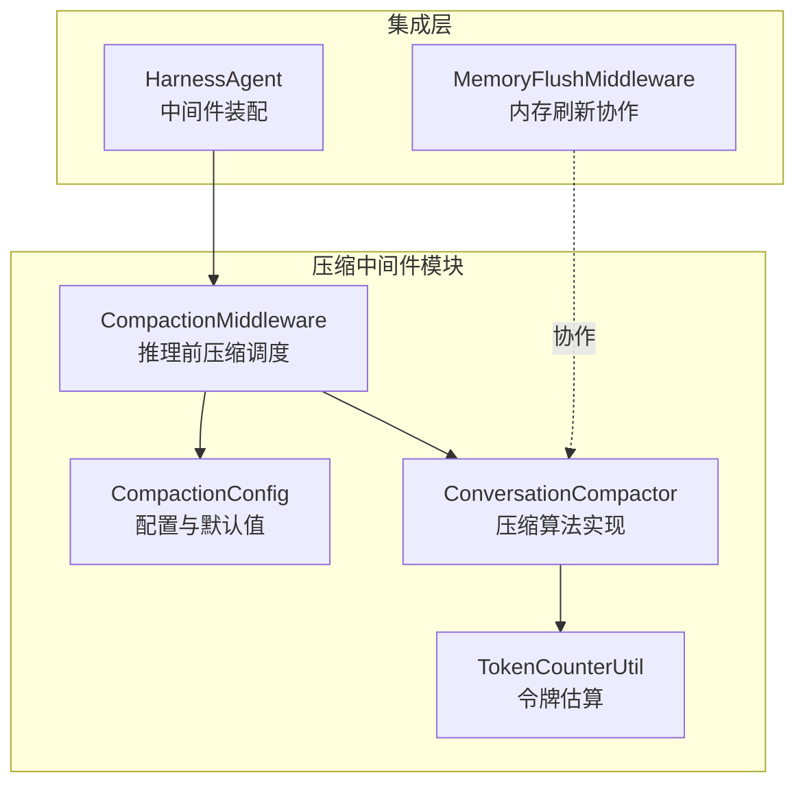
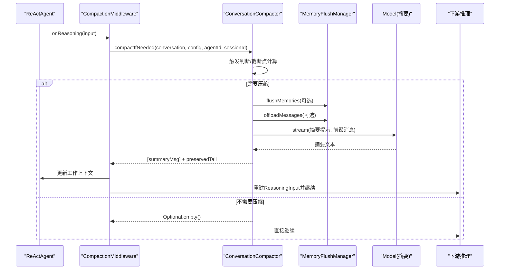
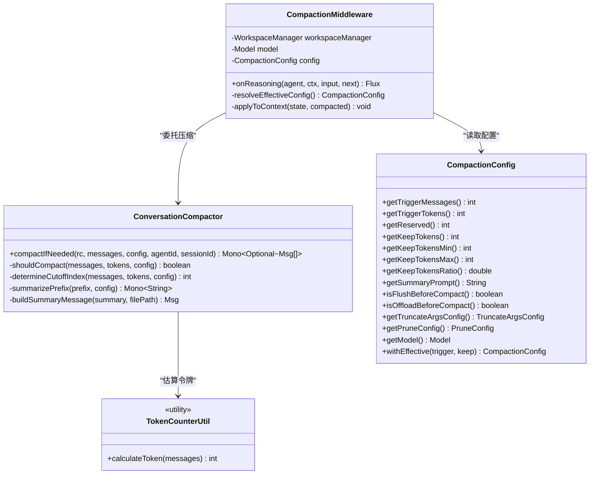
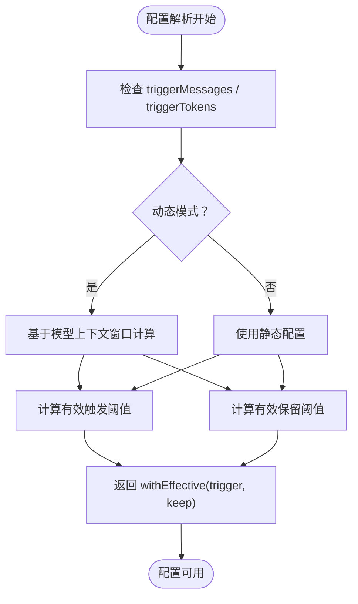
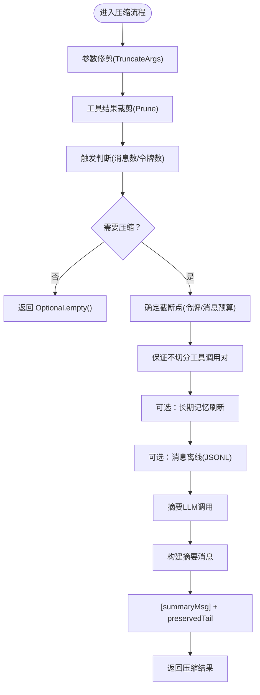
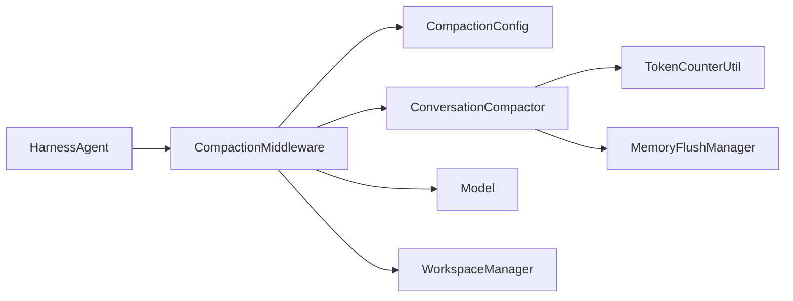

# 压缩中间件

<cite>
**本文档引用的文件**
- [CompactionMiddleware.java](file://agentscope-harness/src/main/java/io/agentscope/harness/agent/middleware/CompactionMiddleware.java)
- [CompactionConfig.java](file://agentscope-harness/src/main/java/io/agentscope/harness/agent/memory/compaction/CompactionConfig.java)
- [ConversationCompactor.java](file://agentscope-harness/src/main/java/io/agentscope/harness/agent/memory/compaction/ConversationCompactor.java)
- [TokenCounterUtil.java](file://agentscope-harness/src/main/java/io/agentscope/harness/agent/memory/compaction/TokenCounterUtil.java)
- [HarnessAgent.java](file://agentscope-harness/src/main/java/io/agentscope/harness/agent/HarnessAgent.java)
- [MemoryFlushMiddleware.java](file://agentscope-harness/src/main/java/io/agentscope/harness/agent/middleware/MemoryFlushMiddleware.java)
- [compaction.md](file://docs/v2/en/docs/harness/compaction.md)
- [memory.md](file://docs/v2/en/docs/harness/memory.md)
- [agentscope-2.0.0-RC2-guide.html](file://agentscope-2.0.0-RC2-guide.html)
</cite>

## 目录
1. [简介](#简介)
2. [项目结构](#项目结构)
3. [核心组件](#核心组件)
4. [架构概览](#架构概览)
5. [详细组件分析](#详细组件分析)
6. [依赖关系分析](#依赖关系分析)
7. [性能考量](#性能考量)
8. [故障排除指南](#故障排除指南)
9. [结论](#结论)
10. [附录](#附录)

## 简介
本文件为压缩中间件（CompactionMiddleware）提供详细的API文档与技术解析。该中间件在推理调用前执行对话压缩，通过摘要生成、内存刷新与消息离线存储等步骤，优化代理在长对话场景下的数据存储与传输效率，防止上下文溢出并降低LLM调用成本。

## 项目结构
压缩中间件位于 agentscope-harness 模块中，围绕以下核心文件组织：
- 中间件入口：CompactionMiddleware
- 配置模型：CompactionConfig（含摘要提示、触发阈值、保留缓冲、修剪参数、聚合裁剪）
- 压缩算法：ConversationCompactor（触发判断、截断点确定、摘要生成、消息过滤与预处理）
- 令牌估算：TokenCounterUtil（字符比估算、消息/内容块/工具调用/结果的开销建模）
- 集成点：HarnessAgent（构建期装配）、MemoryFlushMiddleware（与压缩协作）

**图表来源**
- [CompactionMiddleware.java:57-143](file://agentscope-harness/src/main/java/io/agentscope/harness/agent/middleware/CompactionMiddleware.java#L57-L143)
- [CompactionConfig.java:61-269](file://agentscope-harness/src/main/java/io/agentscope/harness/agent/memory/compaction/CompactionConfig.java#L61-L269)
- [ConversationCompactor.java:57-201](file://agentscope-harness/src/main/java/io/agentscope/harness/agent/memory/compaction/ConversationCompactor.java#L57-L201)
- [TokenCounterUtil.java:41-256](file://agentscope-harness/src/main/java/io/agentscope/harness/agent/memory/compaction/TokenCounterUtil.java#L41-L256)
- [HarnessAgent.java:2168-2177](file://agentscope-harness/src/main/java/io/agentscope/harness/agent/HarnessAgent.java#L2168-L2177)
- [MemoryFlushMiddleware.java:46-52](file://agentscope-harness/src/main/java/io/agentscope/harness/agent/middleware/MemoryFlushMiddleware.java#L46-L52)

**章节来源**
- [CompactionMiddleware.java:38-56](file://agentscope-harness/src/main/java/io/agentscope/harness/agent/middleware/CompactionMiddleware.java#L38-L56)
- [HarnessAgent.java:2168-2177](file://agentscope-harness/src/main/java/io/agentscope/harness/agent/HarnessAgent.java#L2168-L2177)

## 核心组件
- CompactionMiddleware：在推理阶段前检查并触发压缩流程，负责将工作上下文替换为摘要+尾部消息，并重建推理输入。
- CompactionConfig：集中定义压缩策略（触发阈值、保留缓冲、保留窗口、摘要提示、是否刷新/离线、参数修剪与聚合裁剪配置）。
- ConversationCompactor：实现压缩算法，包含触发判断、截断点计算、内存刷新、消息离线、摘要生成与结果重建。
- TokenCounterUtil：提供消息级令牌估算，支持文本、工具调用与工具结果的结构化开销建模。
- 集成点：HarnessAgent 在构建时根据配置装配压缩中间件；MemoryFlushMiddleware 与压缩协作，确保前缀长期记忆被提取到日志账本。

**章节来源**
- [CompactionMiddleware.java:57-143](file://agentscope-harness/src/main/java/io/agentscope/harness/agent/middleware/CompactionMiddleware.java#L57-L143)
- [CompactionConfig.java:61-269](file://agentscope-harness/src/main/java/io/agentscope/harness/agent/memory/compaction/CompactionConfig.java#L61-L269)
- [ConversationCompactor.java:57-201](file://agentscope-harness/src/main/java/io/agentscope/harness/agent/memory/compaction/ConversationCompactor.java#L57-L201)
- [TokenCounterUtil.java:41-256](file://agentscope-harness/src/main/java/io/agentscope/harness/agent/memory/compaction/TokenCounterUtil.java#L41-L256)
- [HarnessAgent.java:2168-2177](file://agentscope-harness/src/main/java/io/agentscope/harness/agent/HarnessAgent.java#L2168-L2177)
- [MemoryFlushMiddleware.java:46-52](file://agentscope-harness/src/main/java/io/agentscope/harness/agent/middleware/MemoryFlushMiddleware.java#L46-L52)

## 架构概览
压缩中间件在推理链路中的位置如下：

**图表来源**
- [CompactionMiddleware.java:72-143](file://agentscope-harness/src/main/java/io/agentscope/harness/agent/middleware/CompactionMiddleware.java#L72-L143)
- [ConversationCompactor.java:89-201](file://agentscope-harness/src/main/java/io/agentscope/harness/agent/memory/compaction/ConversationCompactor.java#L89-L201)
- [MemoryFlushMiddleware.java:46-52](file://agentscope-harness/src/main/java/io/agentscope/harness/agent/middleware/MemoryFlushMiddleware.java#L46-L52)

## 详细组件分析

### CompactionMiddleware 类
职责与行为：
- 仅对 ReActAgent 生效，在推理阶段前执行压缩。
- 解析动态配置：当触发令牌或保留窗口为动态时，基于模型上下文窗口计算有效阈值。
- 执行压缩：委托 ConversationCompactor 完成压缩，更新 AgentState 上下文，并重建 ReasoningInput。
- 错误处理：压缩失败时记录告警并回退到直接推理。

关键方法与流程：
- onReasoning：接收推理输入，分离系统消息，调用压缩器，应用结果到上下文并重建输入。
- resolveEffectiveConfig：动态计算触发与保留窗口，避免过度激活或零触发。
- applyToContext：将压缩后的消息写入 AgentState 的可变上下文。

**图表来源**
- [CompactionMiddleware.java:57-227](file://agentscope-harness/src/main/java/io/agentscope/harness/agent/middleware/CompactionMiddleware.java#L57-L227)
- [ConversationCompactor.java:57-711](file://agentscope-harness/src/main/java/io/agentscope/harness/agent/memory/compaction/ConversationCompactor.java#L57-L711)
- [CompactionConfig.java:61-608](file://agentscope-harness/src/main/java/io/agentscope/harness/agent/memory/compaction/CompactionConfig.java#L61-L608)
- [TokenCounterUtil.java:41-256](file://agentscope-harness/src/main/java/io/agentscope/harness/agent/memory/compaction/TokenCounterUtil.java#L41-L256)

**章节来源**
- [CompactionMiddleware.java:72-143](file://agentscope-harness/src/main/java/io/agentscope/harness/agent/middleware/CompactionMiddleware.java#L72-L143)
- [CompactionMiddleware.java:148-211](file://agentscope-harness/src/main/java/io/agentscope/harness/agent/middleware/CompactionMiddleware.java#L148-L211)
- [CompactionMiddleware.java:213-226](file://agentscope-harness/src/main/java/io/agentscope/harness/agent/middleware/CompactionMiddleware.java#L213-L226)

### CompactionConfig 配置模型
主要配置项与语义：
- 触发条件
  - triggerMessages：消息数量阈值（0禁用）
  - triggerTokens：令牌数量阈值（0启用动态模式）
- 保留策略
  - reserved：压缩过程自身预留令牌（摘要提示+输出），仅在动态模式生效
  - keepMessages / keepTokens ±：保留窗口（消息数或令牌预算），-1表示动态计算
  - keepTokensMin/Max/ratio：动态保留窗口的边界与比例
- 摘要提示
  - summaryPrompt：摘要LLM的提示模板（需包含占位符）
- 行为开关
  - flushBeforeCompact：压缩前是否从前缀提取长期记忆
  - offloadBeforeCompact：压缩前是否将原始消息离线到会话JSONL
- 预处理与裁剪
  - TruncateArgsConfig：轻量参数修剪（非LLM），保护最近消息，缩短过长参数
  - PruneConfig：聚合工具结果裁剪（非LLM），保护最近N令牌输出，对超限结果做头尾预览

默认行为（动态模式）：
- 触发：模型上下文窗口 - reserved 或 50条消息（取较小者）
- 保留：min(8k, max(2k, usable * 0.25))，其中 usable = contextWindow - reserved

**图表来源**
- [CompactionConfig.java:148-211](file://agentscope-harness/src/main/java/io/agentscope/harness/agent/memory/compaction/CompactionConfig.java#L148-L211)

**章节来源**
- [CompactionConfig.java:118-242](file://agentscope-harness/src/main/java/io/agentscope/harness/agent/memory/compaction/CompactionConfig.java#L118-L242)
- [CompactionConfig.java:244-265](file://agentscope-harness/src/main/java/io/agentscope/harness/agent/memory/compaction/CompactionConfig.java#L244-L265)
- [CompactionConfig.java:271-402](file://agentscope-harness/src/main/java/io/agentscope/harness/agent/memory/compaction/CompactionConfig.java#L271-L402)
- [CompactionConfig.java:404-608](file://agentscope-harness/src/main/java/io/agentscope/harness/agent/memory/compaction/CompactionConfig.java#L404-L608)

### ConversationCompactor 压缩算法
核心步骤与逻辑：
- 预处理
  - 轻量参数修剪（TruncateArgsConfig）：在保留窗口之前的旧消息中，缩短过长字符串参数
  - 聚合工具结果裁剪（PruneConfig）：向后扫描，保护最近N令牌输出，对超限结果做头尾预览
- 触发判断
  - 比较消息数与令牌数是否超过阈值
- 截断点确定
  - 令牌预算：二分搜索最早满足“后缀令牌数 ≤ 保留令牌”的索引
  - 消息数预算：直接取尾部保留的消息数
  - 安全性：避免将ASSISTANT工具调用与其TOOL结果分割
- 前缀处理
  - 可选：从前缀提取长期记忆至日志账本
  - 可选：将完整对话离线到会话JSONL，记录文件路径
- 摘要生成
  - 将前缀格式化为人类可读文本，拼接到摘要提示中，调用模型流式生成摘要
- 结果重建
  - 生成摘要用户消息（可携带离线路径），与保留尾部合并作为新的消息列表

**图表来源**
- [ConversationCompactor.java:89-201](file://agentscope-harness/src/main/java/io/agentscope/harness/agent/memory/compaction/ConversationCompactor.java#L89-L201)
- [ConversationCompactor.java:230-328](file://agentscope-harness/src/main/java/io/agentscope/harness/agent/memory/compaction/ConversationCompactor.java#L230-L328)
- [ConversationCompactor.java:334-371](file://agentscope-harness/src/main/java/io/agentscope/harness/agent/memory/compaction/ConversationCompactor.java#L334-L371)
- [ConversationCompactor.java:441-461](file://agentscope-harness/src/main/java/io/agentscope/harness/agent/memory/compaction/ConversationCompactor.java#L441-L461)

**章节来源**
- [ConversationCompactor.java:89-201](file://agentscope-harness/src/main/java/io/agentscope/harness/agent/memory/compaction/ConversationCompactor.java#L89-L201)
- [ConversationCompactor.java:230-328](file://agentscope-harness/src/main/java/io/agentscope/harness/agent/memory/compaction/ConversationCompactor.java#L230-L328)
- [ConversationCompactor.java:334-371](file://agentscope-harness/src/main/java/io/agentscope/harness/agent/memory/compaction/ConversationCompactor.java#L334-L371)
- [ConversationCompactor.java:441-461](file://agentscope-harness/src/main/java/io/agentscope/harness/agent/memory/compaction/ConversationCompactor.java#L441-L461)

### TokenCounterUtil 令牌估算
估算策略：
- 文本内容：按字符估算，保守比率适配中英文混合
- 消息结构：角色、名称、格式化等固定开销
- 工具调用：名称、ID、参数（JSON近似）与结构开销
- 工具结果：名称、ID、输出内容与结构开销
- 其他块类型：图像/音频等按最小开销估算

复杂度与性能：
- 时间复杂度：O(N)（N为消息总数），适合在压缩前快速评估
- 空间复杂度：O(1)，常量额外空间

**章节来源**
- [TokenCounterUtil.java:41-256](file://agentscope-harness/src/main/java/io/agentscope/harness/agent/memory/compaction/TokenCounterUtil.java#L41-L256)

## 依赖关系分析
- 组件耦合
  - CompactionMiddleware 依赖 CompactionConfig 与 ConversationCompactor，耦合度低但职责清晰
  - ConversationCompactor 依赖 TokenCounterUtil 进行令牌估算，依赖 MemoryFlushManager 执行刷新与离线
- 外部依赖
  - Model 接口用于摘要LLM调用
  - WorkspaceManager 提供会话与工作区上下文
- 集成点
  - HarnessAgent 在构建期根据配置决定是否装配 CompactionMiddleware
  - MemoryFlushMiddleware 与压缩协作，避免重复存储摘要消息

**图表来源**
- [HarnessAgent.java:2168-2177](file://agentscope-harness/src/main/java/io/agentscope/harness/agent/HarnessAgent.java#L2168-L2177)
- [CompactionMiddleware.java:65-70](file://agentscope-harness/src/main/java/io/agentscope/harness/agent/middleware/CompactionMiddleware.java#L65-L70)
- [ConversationCompactor.java:67-70](file://agentscope-harness/src/main/java/io/agentscope/harness/agent/memory/compaction/ConversationCompactor.java#L67-L70)

**章节来源**
- [HarnessAgent.java:2168-2177](file://agentscope-harness/src/main/java/io/agentscope/harness/agent/HarnessAgent.java#L2168-L2177)
- [MemoryFlushMiddleware.java:46-52](file://agentscope-harness/src/main/java/io/agentscope/harness/agent/middleware/MemoryFlushMiddleware.java#L46-L52)

## 性能考量
- 令牌估算成本低，适合在每次推理前快速评估
- 压缩流程包含一次摘要LLM调用，成本与前缀长度相关
- 参数修剪与工具结果裁剪为非LLM操作，可在压缩前显著减少上下文体积
- 动态阈值避免频繁压缩（thrash），提升稳定性
- 建议为压缩摘要选择轻量模型，以降低成本与延迟

[本节为通用性能讨论，无需特定文件分析]

## 故障排除指南
常见问题与处理：
- 压缩失败
  - 现象：压缩过程中出现异常，中间件记录告警并回退到直接推理
  - 处理：检查模型可用性、令牌估算配置、摘要提示模板与磁盘权限
- 触发阈值不当
  - 现象：压缩过于频繁或不触发
  - 处理：调整 triggerMessages、triggerTokens、reserved 或切换为静态/动态模式
- 保留窗口过小
  - 现象：摘要丢失关键信息
  - 处理：增大 keepTokens 或调整 keepTokensMin/Max/ratio
- 工具结果过大
  - 现象：摘要前后上下文仍过大
  - 处理：启用/调整 PruneConfig，保护最近N令牌输出，裁剪超限结果
- 参数过长
  - 现象：工具调用参数导致上下文膨胀
  - 处理：启用/调整 TruncateArgsConfig，缩短过长参数

**章节来源**
- [CompactionMiddleware.java:134-141](file://agentscope-harness/src/main/java/io/agentscope/harness/agent/middleware/CompactionMiddleware.java#L134-L141)
- [ConversationCompactor.java:136-142](file://agentscope-harness/src/main/java/io/agentscope/harness/agent/memory/compaction/ConversationCompactor.java#L136-L142)
- [ConversationCompactor.java:366-370](file://agentscope-harness/src/main/java/io/agentscope/harness/agent/memory/compaction/ConversationCompactor.java#L366-L370)

## 结论
压缩中间件通过“预处理-触发-截断-摘要-重建”的流水线，在推理前高效控制上下文规模，兼顾信息完整性与成本控制。其动态阈值与轻量预处理策略使其适用于长对话与高并发场景。合理配置 CompactionConfig 并结合 MemoryFlushMiddleware，可显著提升代理在复杂任务中的稳定性与性能。

[本节为总结性内容，无需特定文件分析]

## 附录

### 使用建议与最佳实践
- 启用压缩
  - 建议在生产环境尽早启用压缩，避免线上上下文溢出
- 配置优先级
  - 动态模式优先：基于模型上下文窗口自动计算触发与保留阈值
  - 明确保留缓冲（reserved）：为摘要提示与输出预留安全余量
  - 保留窗口策略：优先使用令牌预算（keepTokens）而非消息数
- 预处理配合
  - 开启参数修剪与工具结果裁剪，减少冗余信息
- 摘要模型选择
  - 为压缩摘要选择轻量模型，降低调用成本
- 与内存刷新协作
  - 压缩前刷新长期记忆，压缩后离线原始消息，便于审计与回溯

**章节来源**
- [compaction.md:30-64](file://docs/v2/en/docs/harness/compaction.md#L30-L64)
- [memory.md:26-69](file://docs/v2/en/docs/harness/memory.md#L26-L69)
- [agentscope-2.0.0-RC2-guide.html:252-262](file://agentscope-2.0.0-RC2-guide.html#L252-L262)

### API参考（方法与属性）
- CompactionMiddleware
  - 构造函数：接受 WorkspaceManager、Model、CompactionConfig
  - onReasoning：推理前压缩入口
  - resolveEffectiveConfig：动态配置解析
  - applyToContext：上下文写入
- CompactionConfig
  - 触发：getTriggerMessages、getTriggerTokens
  - 保留：getReserved、getKeepTokens、getKeepTokensMin/Max/ratio
  - 摘要：getSummaryPrompt、withEffective
  - 行为：isFlushBeforeCompact、isOffloadBeforeCompact
  - 预处理：getTruncateArgsConfig、getPruneConfig、getModel
- ConversationCompactor
  - compactIfNeeded：主流程入口
  - shouldCompact、determineCutoffIndex、findSafeCutoffPoint
  - summarizePrefix、formatMessagesForSummary、buildSummaryMessage
  - pruneToolResults、truncateArgs
- TokenCounterUtil
  - calculateToken：消息级令牌估算

**章节来源**
- [CompactionMiddleware.java:65-227](file://agentscope-harness/src/main/java/io/agentscope/harness/agent/middleware/CompactionMiddleware.java#L65-L227)
- [CompactionConfig.java:150-242](file://agentscope-harness/src/main/java/io/agentscope/harness/agent/memory/compaction/CompactionConfig.java#L150-L242)
- [ConversationCompactor.java:89-711](file://agentscope-harness/src/main/java/io/agentscope/harness/agent/memory/compaction/ConversationCompactor.java#L89-L711)
- [TokenCounterUtil.java:71-256](file://agentscope-harness/src/main/java/io/agentscope/harness/agent/memory/compaction/TokenCounterUtil.java#L71-L256)