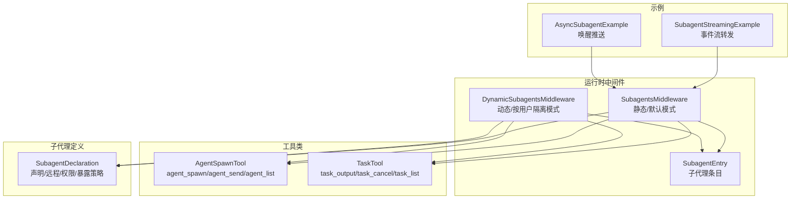
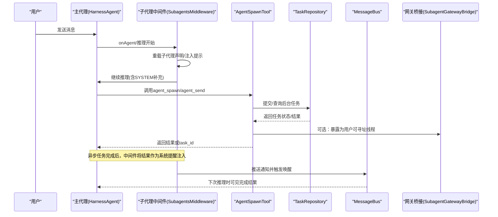
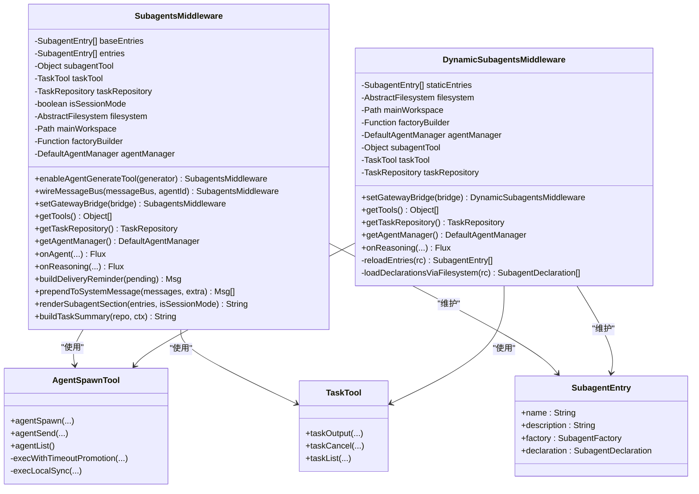
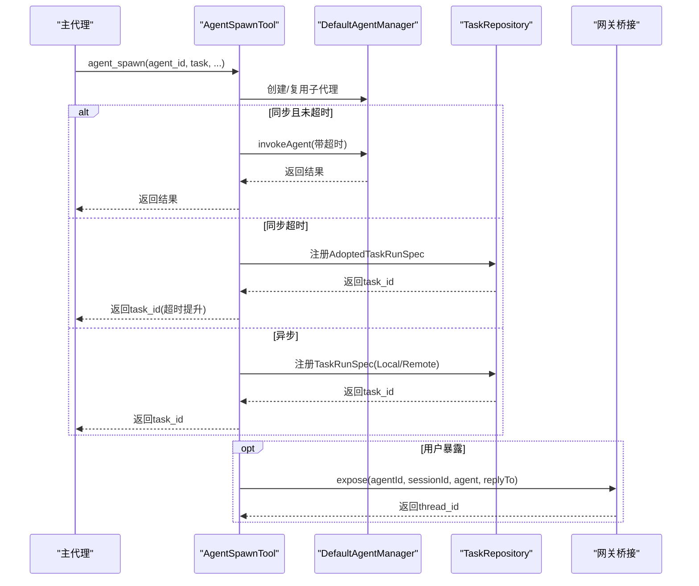
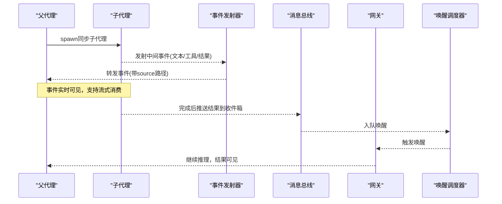
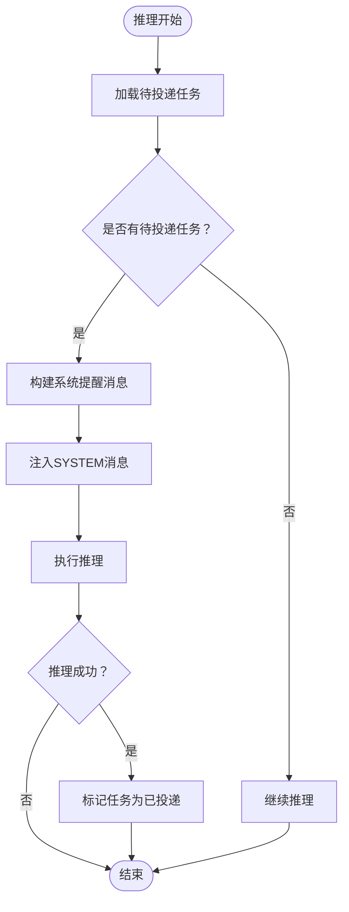
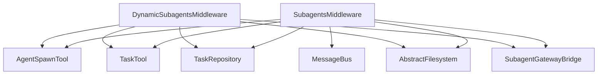

# 子代理中间件

<cite>
**本文档引用的文件**
- [SubagentsMiddleware.java](file://agentscope-harness/src/main/java/io/agentscope/harness/agent/middleware/SubagentsMiddleware.java)
- [DynamicSubagentsMiddleware.java](file://agentscope-harness/src/main/java/io/agentscope/harness/agent/middleware/DynamicSubagentsMiddleware.java)
- [SubagentEntry.java](file://agentscope-harness/src/main/java/io/agentscope/harness/agent/middleware/SubagentEntry.java)
- [AgentSpawnTool.java](file://agentscope-harness/src/main/java/io/agentscope/harness/agent/tool/AgentSpawnTool.java)
- [TaskTool.java](file://agentscope-harness/src/main/java/io/agentscope/harness/agent/tool/TaskTool.java)
- [SubagentDeclaration.java](file://agentscope-harness/src/main/java/io/agentscope/harness/agent/subagent/SubagentDeclaration.java)
- [SubagentStreamingExample.java](file://agentscope-examples/documentation/src/main/java/io/agentscope/examples/documentation2/harness/subagent/SubagentStreamingExample.java)
- [AsyncSubagentExample.java](file://agentscope-examples/documentation/src/main/java/io/agentscope/examples/documentation2/harness/async/AsyncSubagentExample.java)
</cite>

## 目录
1. [简介](#简介)
2. [项目结构](#项目结构)
3. [核心组件](#核心组件)
4. [架构概览](#架构概览)
5. [详细组件分析](#详细组件分析)
6. [依赖关系分析](#依赖关系分析)
7. [性能考量](#性能考量)
8. [故障排除指南](#故障排除指南)
9. [结论](#结论)
10. [附录](#附录)

## 简介
本文件为子代理中间件（SubagentsMiddleware）提供完整的API文档与技术解析，涵盖以下关键主题：
- SubagentsMiddleware类的实现机制与职责边界
- 子代理的创建、调度与协调流程
- 子代理间的通信方式与数据传递规则
- 基于中间件的复杂多代理协作模式
- 配置选项与使用场景
- 架构设计与性能优化建议

子代理中间件是AgentScope运行时的核心扩展点之一，负责在推理阶段动态注入子代理可用性提示、异步任务摘要，并将后台任务完成结果以系统提醒的形式推送到会话历史中，从而实现“主代理-子代理”的协同工作流。

## 项目结构
子代理中间件相关代码主要位于以下模块与包中：
- 运行时中间件：io.agentscope.harness.agent.middleware
- 工具类：io.agentscope.harness.agent.tool
- 子代理声明与工厂：io.agentscope.harness.agent.subagent
- 示例与用法：agentscope-examples/documentation

图表来源
- [SubagentsMiddleware.java:76-704](file://agentscope-harness/src/main/java/io/agentscope/harness/agent/middleware/SubagentsMiddleware.java#L76-L704)
- [DynamicSubagentsMiddleware.java:66-272](file://agentscope-harness/src/main/java/io/agentscope/harness/agent/middleware/DynamicSubagentsMiddleware.java#L66-L272)
- [AgentSpawnTool.java:87-1176](file://agentscope-harness/src/main/java/io/agentscope/harness/agent/tool/AgentSpawnTool.java#L87-L1176)
- [TaskTool.java:42-247](file://agentscope-harness/src/main/java/io/agentscope/harness/agent/tool/TaskTool.java#L42-L247)
- [SubagentDeclaration.java:63-563](file://agentscope-harness/src/main/java/io/agentscope/harness/agent/subagent/SubagentDeclaration.java#L63-L563)

章节来源
- [SubagentsMiddleware.java:55-75](file://agentscope-harness/src/main/java/io/agentscope/harness/agent/middleware/SubagentsMiddleware.java#L55-L75)
- [DynamicSubagentsMiddleware.java:46-65](file://agentscope-harness/src/main/java/io/agentscope/harness/agent/middleware/DynamicSubagentsMiddleware.java#L46-L65)

## 核心组件
本节对子代理中间件的关键组件进行深入分析，包括职责、构造参数、公共方法与内部机制。

- SubagentsMiddleware（静态/默认模式）
  - 职责
    - 暴露子代理工具与任务工具到Agent工具箱
    - 在每次推理前从工作区文件系统重载子代理声明，支持按用户隔离
    - 将丰富的子代理使用指导与当前异步任务摘要前置到SYSTEM消息中
  - 关键字段
    - baseEntries/entries：基础与当前子代理条目列表
    - subagentTool：AgentSpawnTool实例
    - taskTool：TaskTool实例
    - taskRepository：后台任务仓库
    - isSessionMode：是否处于会话模式（外部工具接管）
    - filesystem/mainWorkspace/factoryBuilder/agentManager：文件系统扫描与子代理工厂构建器
  - 公共方法
    - enableAgentGenerateTool：启用LLM驱动的子代理规范生成工具（仅默认模式有效）
    - wireMessageBus：连接消息总线，实现后台任务完成后的自动推送与唤醒
    - setGatewayBridge：设置网关桥接，使子代理可被用户直接寻址
    - getTools/getTaskRepository/getAgentManager：获取工具集、任务仓库与代理管理器
    - onAgent/onReasoning：中间件生命周期钩子，分别处理“代理初始化”和“推理阶段”

- DynamicSubagentsMiddleware（动态/按用户隔离模式）
  - 职责
    - 每次推理时重新解析子代理集合，支持基于命名空间的用户隔离
    - 合并本地工作区与远程文件系统的声明，动态构建子代理工厂
  - 关键机制
    - 双层加载：本地subagents目录 + 文件系统glob读取
    - 合并策略：远程声明覆盖本地同名声明；静态注册优先于动态声明
  - 公共方法
    - setGatewayBridge/getTools/getTaskRepository/getAgentManager：与默认模式类似但更强调动态性

- SubagentEntry（子代理条目）
  - 描述一个子代理的身份、描述、工厂与可选声明对象
  - 支持无声明的程序化注册（始终可见）

- AgentSpawnTool（子代理执行工具）
  - 提供agent_spawn/agent_send/agent_list三个工具方法
  - 支持同步与异步两种执行路径，具备超时提升机制
  - 支持事件流转发（streamEvents），将子代理中间结果实时传回父代理
  - 支持远程子代理调用（HTTP任务服务器）
  - 支持用户暴露（thread_id），通过网关桥接对外暴露

- TaskTool（后台任务工具）
  - 提供task_output/task_cancel/task_list三个工具方法
  - 所有操作均以当前会话ID为作用域，确保跨节点一致性
  - 支持阻塞/非阻塞查询与超时控制

- SubagentDeclaration（子代理声明）
  - 定义子代理的身份、工作区解析策略、模型参数、工具/技能白名单等
  - 支持本地工作区、内联系统提示与远程HTTP三种来源
  - 控制子代理的可见性、会话持久化、权限继承与用户暴露策略

章节来源
- [SubagentsMiddleware.java:180-260](file://agentscope-harness/src/main/java/io/agentscope/harness/agent/middleware/SubagentsMiddleware.java#L180-L260)
- [DynamicSubagentsMiddleware.java:82-102](file://agentscope-harness/src/main/java/io/agentscope/harness/agent/middleware/DynamicSubagentsMiddleware.java#L82-L102)
- [SubagentEntry.java:21-31](file://agentscope-harness/src/main/java/io/agentscope/harness/agent/middleware/SubagentEntry.java#L21-L31)
- [AgentSpawnTool.java:183-587](file://agentscope-harness/src/main/java/io/agentscope/harness/agent/tool/AgentSpawnTool.java#L183-L587)
- [TaskTool.java:53-209](file://agentscope-harness/src/main/java/io/agentscope/harness/agent/tool/TaskTool.java#L53-L209)
- [SubagentDeclaration.java:22-48](file://agentscope-harness/src/main/java/io/agentscope/harness/agent/subagent/SubagentDeclaration.java#L22-L48)

## 架构概览
下图展示了子代理中间件在Agent运行时中的位置与交互关系：

图表来源
- [SubagentsMiddleware.java:386-470](file://agentscope-harness/src/main/java/io/agentscope/harness/agent/middleware/SubagentsMiddleware.java#L386-L470)
- [AgentSpawnTool.java:183-423](file://agentscope-harness/src/main/java/io/agentscope/harness/agent/tool/AgentSpawnTool.java#L183-L423)
- [AsyncSubagentExample.java:42-49](file://agentscope-examples/documentation/src/main/java/io/agentscope/examples/documentation2/harness/async/AsyncSubagentExample.java#L42-L49)

## 详细组件分析

### SubagentsMiddleware 类分析
- 实现要点
  - 默认模式：内置DefaultAgentManager与AgentSpawnTool，适合独立运行
  - 会话模式：由外部工具（如SessionsTool）接管子代理创建，中间件仅负责注入提示与任务摘要
  - 动态重载：在非会话模式下，每次推理前从文件系统加载最新子代理声明，实现按用户隔离
  - 任务推送：在ReActAgent场景下，将新完成的任务结果以系统提醒形式注入当前SYSTEM消息，并在推理成功后标记已投递
  - 网关桥接：可选地将子代理暴露为用户可寻址线程，便于跨节点恢复与交互
  - LLM提示：渲染子代理工具清单、任务摘要与使用建议，帮助LLM做出委托决策

图表来源
- [SubagentsMiddleware.java:76-704](file://agentscope-harness/src/main/java/io/agentscope/harness/agent/middleware/SubagentsMiddleware.java#L76-L704)
- [DynamicSubagentsMiddleware.java:66-272](file://agentscope-harness/src/main/java/io/agentscope/harness/agent/middleware/DynamicSubagentsMiddleware.java#L66-L272)
- [AgentSpawnTool.java:87-1176](file://agentscope-harness/src/main/java/io/agentscope/harness/agent/tool/AgentSpawnTool.java#L87-L1176)
- [TaskTool.java:42-247](file://agentscope-harness/src/main/java/io/agentscope/harness/agent/tool/TaskTool.java#L42-L247)
- [SubagentEntry.java:26-31](file://agentscope-harness/src/main/java/io/agentscope/harness/agent/middleware/SubagentEntry.java#L26-L31)

章节来源
- [SubagentsMiddleware.java:55-75](file://agentscope-harness/src/main/java/io/agentscope/harness/agent/middleware/SubagentsMiddleware.java#L55-L75)
- [SubagentsMiddleware.java:386-470](file://agentscope-harness/src/main/java/io/agentscope/harness/agent/middleware/SubagentsMiddleware.java#L386-L470)
- [SubagentsMiddleware.java:587-616](file://agentscope-harness/src/main/java/io/agentscope/harness/agent/middleware/SubagentsMiddleware.java#L587-L616)
- [SubagentsMiddleware.java:628-702](file://agentscope-harness/src/main/java/io/agentscope/harness/agent/middleware/SubagentsMiddleware.java#L628-L702)

### 子代理创建与调度流程
- agent_spawn
  - 解析参数：agent_id、task、label、timeout_seconds、expose_to_user
  - 校验深度限制与标签唯一性
  - 创建/复用子代理会话，必要时继承父权限与计划模式
  - 可选：通过网关桥接将子代理暴露为用户可寻址线程
  - 同步执行：支持超时提升，超时则转为后台任务并返回task_id
  - 异步执行：提交至TaskRepository，返回task_id用于后续查询

图表来源
- [AgentSpawnTool.java:194-423](file://agentscope-harness/src/main/java/io/agentscope/harness/agent/tool/AgentSpawnTool.java#L194-L423)
- [AgentSpawnTool.java:706-766](file://agentscope-harness/src/main/java/io/agentscope/harness/agent/tool/AgentSpawnTool.java#L706-L766)

章节来源
- [AgentSpawnTool.java:183-423](file://agentscope-harness/src/main/java/io/agentscope/harness/agent/tool/AgentSpawnTool.java#L183-L423)
- [AgentSpawnTool.java:706-766](file://agentscope-harness/src/main/java/io/agentscope/harness/agent/tool/AgentSpawnTool.java#L706-L766)

### 子代理间通信与数据传递
- 事件流转发（streamEvents）
  - 当父代理spawn同步子代理时，子代理的中间事件（文本增量、工具调用、结果等）通过事件发射器实时转发到父代理的流中
  - 每个子事件携带source路径（如"main/researcher"），便于区分父子事件
- 任务结果推送（Mode B）
  - 子代理完成后，中间件通过MessageBus将结果推送到会话收件箱，并入队唤醒信号
  - WakeupDispatcher轮询唤醒队列，触发网关运行唤醒逻辑，使会话继续推理并看到结果

图表来源
- [SubagentStreamingExample.java:34-51](file://agentscope-examples/documentation/src/main/java/io/agentscope/examples/documentation2/harness/subagent/SubagentStreamingExample.java#L34-L51)
- [AsyncSubagentExample.java:42-49](file://agentscope-examples/documentation/src/main/java/io/agentscope/examples/documentation2/harness/async/AsyncSubagentExample.java#L42-L49)

章节来源
- [SubagentStreamingExample.java:30-58](file://agentscope-examples/documentation/src/main/java/io/agentscope/examples/documentation2/harness/subagent/SubagentStreamingExample.java#L30-L58)
- [AsyncSubagentExample.java:35-57](file://agentscope-examples/documentation/src/main/java/io/agentscope/examples/documentation2/harness/async/AsyncSubagentExample.java#L35-L57)

### 异步任务管理与摘要
- 任务摘要
  - 中间件在每次推理前构建当前会话的异步任务摘要，最多展示固定数量条目
  - 已投递的任务不会重复列出，避免token浪费与误导
- 结果推送
  - 新完成的任务以系统提醒形式注入SYSTEM消息，包含任务状态、结果或错误信息
  - 仅在推理成功完成后才标记为已投递，保证幂等性与一致性

图表来源
- [SubagentsMiddleware.java:409-470](file://agentscope-harness/src/main/java/io/agentscope/harness/agent/middleware/SubagentsMiddleware.java#L409-L470)
- [SubagentsMiddleware.java:481-538](file://agentscope-harness/src/main/java/io/agentscope/harness/agent/middleware/SubagentsMiddleware.java#L481-L538)

章节来源
- [SubagentsMiddleware.java:651-702](file://agentscope-harness/src/main/java/io/agentscope/harness/agent/middleware/SubagentsMiddleware.java#L651-L702)
- [SubagentsMiddleware.java:481-538](file://agentscope-harness/src/main/java/io/agentscope/harness/agent/middleware/SubagentsMiddleware.java#L481-L538)

## 依赖关系分析
- 组件耦合
  - SubagentsMiddleware与DynamicSubagentsMiddleware共享部分工具与静态方法（如提示渲染、任务摘要构建）
  - AgentSpawnTool与TaskTool依赖TaskRepository实现任务生命周期管理
  - 网关桥接与消息总线用于实现跨节点的子代理暴露与唤醒推送
- 外部依赖
  - 文件系统抽象（AbstractFilesystem）用于动态加载子代理声明
  - 模型注册中心（ModelRegistry）用于子代理模型解析
  - 权限引擎（PermissionEngine）用于子代理权限继承

图表来源
- [SubagentsMiddleware.java:16-53](file://agentscope-harness/src/main/java/io/agentscope/harness/agent/middleware/SubagentsMiddleware.java#L16-L53)
- [DynamicSubagentsMiddleware.java:23-44](file://agentscope-harness/src/main/java/io/agentscope/harness/agent/middleware/DynamicSubagentsMiddleware.java#L23-L44)

章节来源
- [SubagentsMiddleware.java:16-53](file://agentscope-harness/src/main/java/io/agentscope/harness/agent/middleware/SubagentsMiddleware.java#L16-L53)
- [DynamicSubagentsMiddleware.java:23-44](file://agentscope-harness/src/main/java/io/agentscope/harness/agent/middleware/DynamicSubagentsMiddleware.java#L23-L44)

## 性能考量
- 任务投递与幂等性
  - 仅在推理成功完成后标记任务为已投递，避免重复推送带来的额外token消耗
- 超时提升
  - 同步spawn在超时后自动提升为后台任务，减少丢失风险并保持对话流畅
- 事件流转发
  - 使用Reactor上下文传播与事件发射器，避免阻塞订阅导致的上下文丢失
- 文件系统扫描
  - 动态模式下采用分层加载与合并策略，减少冲突并提高加载效率
- 会话持久化
  - 对于需要跨重启恢复的子代理，使用确定性会话键与持久化存储，降低重建成本

## 故障排除指南
- agent_spawn返回“未知agent_id”
  - 检查子代理声明是否正确加载，确认DefaultAgentManager中是否存在该agent_id
- agent_spawn返回“最大spawn深度超出”
  - 减少嵌套spawn层级，或调整最大深度阈值
- agent_send返回“未知agent_key/标签”
  - 确认agent_key格式正确（以"agent:"开头），或使用spawn时设置的标签
- 任务长时间未完成
  - 使用task_list检查任务状态，必要时使用task_output(block=false)轮询
- 结果未显示在下次推理中
  - 确认wireMessageBus已正确设置，且MessageBus与WakeupDispatcher正常运行
- 子代理未被用户直接寻址
  - 检查setGatewayBridge是否已调用，且网关桥接配置正确

章节来源
- [AgentSpawnTool.java:236-252](file://agentscope-harness/src/main/java/io/agentscope/harness/agent/tool/AgentSpawnTool.java#L236-L252)
- [AgentSpawnTool.java:467-496](file://agentscope-harness/src/main/java/io/agentscope/harness/agent/tool/AgentSpawnTool.java#L467-L496)
- [TaskTool.java:136-166](file://agentscope-harness/src/main/java/io/agentscope/harness/agent/tool/TaskTool.java#L136-L166)
- [SubagentsMiddleware.java:281-331](file://agentscope-harness/src/main/java/io/agentscope/harness/agent/middleware/SubagentsMiddleware.java#L281-L331)

## 结论
子代理中间件通过“提示注入+任务推送+事件转发+网关暴露”的组合机制，实现了主代理与子代理之间的高效协作。其默认模式适合独立部署，动态模式则满足多租户与用户隔离需求。配合后台任务工具与消息总线，系统能够在异步场景下实现可靠的唤醒与结果交付。合理配置权限、暴露策略与超时行为，可在保证安全性的前提下最大化协作效率。

## 附录
- 配置选项速查
  - enableAgentGenerateTool：启用LLM自动生成子代理规范（默认关闭）
  - wireMessageBus：连接消息总线以启用自动推送与唤醒（默认关闭）
  - setGatewayBridge：启用子代理用户暴露（默认关闭）
  - expose_to_user：控制子代理是否可被用户直接寻址（声明级/运行时级）
  - persistSession：控制子代理会话是否跨调用持久化（声明级）
- 使用场景
  - 并行研究：多个子代理同时执行不同任务，结束后统一汇总
  - 委托推理：复杂问题分解为多个子任务，子代理自主完成后再合成答案
  - 异步处理：长耗时任务后台执行，主代理继续其他工作，完成后自动推送结果
  - 多租户隔离：基于命名空间的文件系统扫描，实现用户间子代理声明隔离