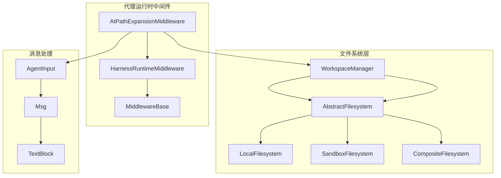
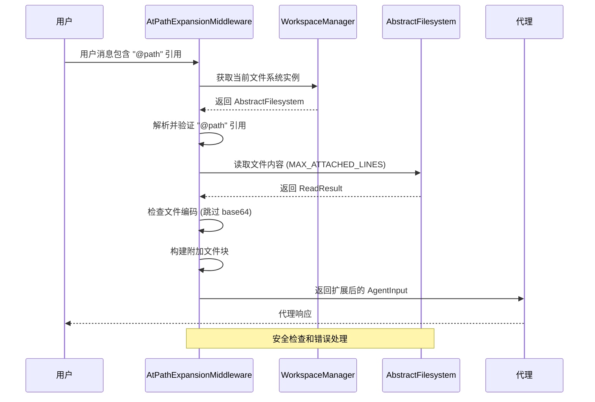
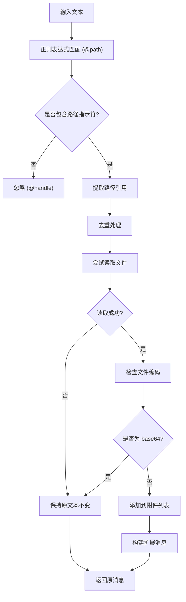
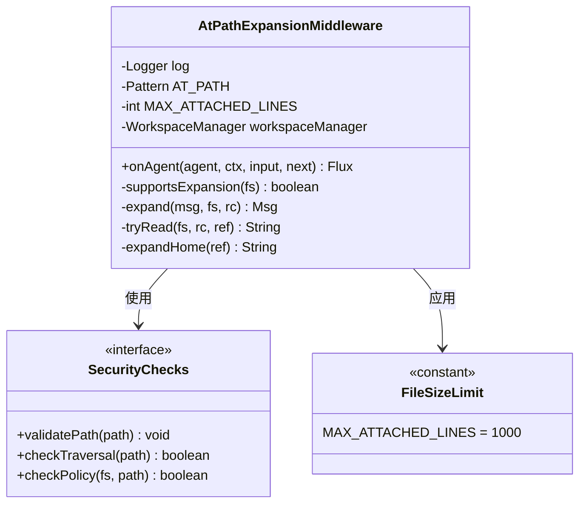
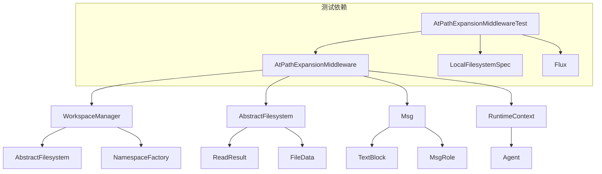
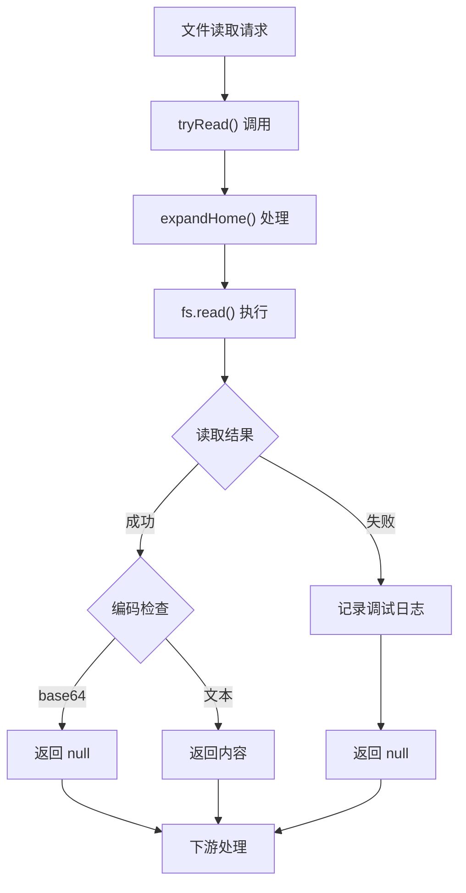

# 路径扩展中间件

<cite>
**本文档引用的文件**
- [AtPathExpansionMiddleware.java](file://agentscope-harness/src/main/java/io/agentscope/harness/agent/middleware/AtPathExpansionMiddleware.java)
- [HarnessRuntimeMiddleware.java](file://agentscope-harness/src/main/java/io/agentscope/harness/agent/middleware/HarnessRuntimeMiddleware.java)
- [WorkspaceManager.java](file://agentscope-harness/src/main/java/io/agentscope/harness/agent/workspace/WorkspaceManager.java)
- [AbstractFilesystem.java](file://agentscope-harness/src/main/java/io/agentscope/harness/agent/filesystem/AbstractFilesystem.java)
- [ReadResult.java](file://agentscope-harness/src/main/java/io/agentscope/harness/agent/filesystem/model/ReadResult.java)
- [FileData.java](file://agentscope-harness/src/main/java/io/agentscope/harness/agent/filesystem/model/FileData.java)
- [AtPathExpansionMiddlewareTest.java](file://agentscope-harness/src/test/java/io/agentscope/harness/agent/middleware/AtPathExpansionMiddlewareTest.java)
</cite>

## 目录
1. [简介](#简介)
2. [项目结构](#项目结构)
3. [核心组件](#核心组件)
4. [架构概览](#架构概览)
5. [详细组件分析](#详细组件分析)
6. [依赖关系分析](#依赖关系分析)
7. [性能考虑](#性能考虑)
8. [故障排除指南](#故障排除指南)
9. [结论](#结论)

## 简介

AtPathExpansionMiddleware 是一个专门设计用于在代理工作流中扩展和解析路径参数的中间件组件。该中间件实现了 Claude Code CLI 的 "@file" 输入语法，能够将用户消息中的 "@path" 引用自动扩展为实际的文件内容，并将其作为附加文件块添加到消息末尾。

该中间件的核心功能包括：
- 智能识别用户消息中的 "@path" 引用模式
- 安全地读取指定路径的文件内容
- 将文件内容作为结构化数据附加到消息中
- 支持多种文件系统类型（本地、沙箱、远程）
- 实施安全策略防止路径遍历攻击

## 项目结构

AtPathExpansionMiddleware 位于 agentscope-harness 模块中，是代理运行时中间件生态系统的一部分：

**图表来源**
- [AtPathExpansionMiddleware.java:67-197](file://agentscope-harness/src/main/java/io/agentscope/harness/agent/middleware/AtPathExpansionMiddleware.java#L67-L197)
- [HarnessRuntimeMiddleware.java:20-26](file://agentscope-harness/src/main/java/io/agentscope/harness/agent/middleware/HarnessRuntimeMiddleware.java#L20-L26)
- [WorkspaceManager.java:190-192](file://agentscope-harness/src/main/java/io/agentscope/harness/agent/workspace/WorkspaceManager.java#L190-L192)

**章节来源**
- [AtPathExpansionMiddleware.java:16-67](file://agentscope-harness/src/main/java/io/agentscope/harness/agent/middleware/AtPathExpansionMiddleware.java#L16-L67)
- [HarnessRuntimeMiddleware.java:16-26](file://agentscope-harness/src/main/java/io/agentscope/harness/agent/middleware/HarnessRuntimeMiddleware.java#L16-L26)

## 核心组件

### AtPathExpansionMiddleware 类

AtPathExpansionMiddleware 是一个实现了 HarnessRuntimeMiddleware 接口的中间件类，专门负责处理 "@path" 引用的扩展。

**主要特性：**
- 基于正则表达式的智能路径识别
- 多种文件系统类型的兼容性
- 安全的文件访问控制
- 最大文件大小限制
- 重复引用去重机制

**关键方法：**
- `onAgent()`: 主要的中间件处理入口点
- `expand()`: 执行路径扩展的核心逻辑
- `tryRead()`: 安全的文件读取操作
- `supportsExpansion()`: 文件系统支持性检查

**章节来源**
- [AtPathExpansionMiddleware.java:67-197](file://agentscope-harness/src/main/java/io/agentscope/harness/agent/middleware/AtPathExpansionMiddleware.java#L67-L197)

### WorkspaceManager 集成

中间件通过 WorkspaceManager 访问底层文件系统，确保所有文件操作都经过适当的权限验证和命名空间管理。

**集成特点：**
- 透明的文件系统抽象
- 支持多层命名空间隔离
- 统一的读写操作接口
- 并发安全的文件访问

**章节来源**
- [WorkspaceManager.java:190-192](file://agentscope-harness/src/main/java/io/agentscope/harness/agent/workspace/WorkspaceManager.java#L190-L192)

## 架构概览

AtPathExpansionMiddleware 在代理工作流中的位置和交互关系如下：

**图表来源**
- [AtPathExpansionMiddleware.java:94-121](file://agentscope-harness/src/main/java/io/agentscope/harness/agent/middleware/AtPathExpansionMiddleware.java#L94-L121)
- [AbstractFilesystem.java:64](file://agentscope-harness/src/main/java/io/agentscope/harness/agent/filesystem/AbstractFilesystem.java#L64)

## 详细组件分析

### 路径识别和解析机制

中间件使用复杂的正则表达式来识别 "@path" 引用：

**图表来源**
- [AtPathExpansionMiddleware.java:77-83](file://agentscope-harness/src/main/java/io/agentscope/harness/agent/middleware/AtPathExpansionMiddleware.java#L77-L83)
- [AtPathExpansionMiddleware.java:140-166](file://agentscope-harness/src/main/java/io/agentscope/harness/agent/middleware/AtPathExpansionMiddleware.java#L140-L166)

### 文件系统支持矩阵

中间件对不同文件系统类型的支持策略：

| 文件系统类型 | 支持状态 | 处理方式 | 安全考虑 |
|------------|----------|----------|----------|
| LocalFilesystem | ✅ 支持 | 直接读取，受策略限制 | 路径白名单检查 |
| SandboxFilesystem | ✅ 支持 | 沙箱内路径访问 | 内部沙箱隔离 |
| CompositeFilesystem | ❌ 不支持 | 保留原引用 | 远程部署限制 |
| RemoteFilesystem | ⚠️ 部分支持 | 仅本地覆盖 | 网络延迟考虑 |

**章节来源**
- [AtPathExpansionMiddleware.java:123-132](file://agentscope-harness/src/main/java/io/agentscope/harness/agent/middleware/AtPathExpansionMiddleware.java#L123-L132)

### 安全机制和限制

**图表来源**
- [AtPathExpansionMiddleware.java:85-87](file://agentscope-harness/src/main/java/io/agentscope/harness/agent/middleware/AtPathExpansionMiddleware.java#L85-L87)
- [AbstractFilesystem.java:178-185](file://agentscope-harness/src/main/java/io/agentscope/harness/agent/filesystem/AbstractFilesystem.java#L178-L185)

**章节来源**
- [AtPathExpansionMiddleware.java:168-187](file://agentscope-harness/src/main/java/io/agentscope/harness/agent/middleware/AtPathExpansionMiddleware.java#L168-L187)

### 配置和参数传递

中间件通过以下方式处理配置和参数：

**构造函数参数：**
- `WorkspaceManager`: 提供文件系统访问能力
- 内部配置常量：最大行数限制、日志级别等

**运行时参数：**
- `RuntimeContext`: 传递会话和用户上下文信息
- `AgentInput`: 包含待处理的消息列表
- `next`: 下游中间件链的调用函数

**章节来源**
- [AtPathExpansionMiddleware.java:90-92](file://agentscope-harness/src/main/java/io/agentscope/harness/agent/middleware/AtPathExpansionMiddleware.java#L90-L92)
- [AtPathExpansionMiddleware.java:98-121](file://agentscope-harness/src/main/java/io/agentscope/harness/agent/middleware/AtPathExpansionMiddleware.java#L98-L121)

## 依赖关系分析

### 核心依赖图

**图表来源**
- [AtPathExpansionMiddleware.java:18-31](file://agentscope-harness/src/main/java/io/agentscope/harness/agent/middleware/AtPathExpansionMiddleware.java#L18-L31)
- [WorkspaceManager.java:35-42](file://agentscope-harness/src/main/java/io/agentscope/harness/agent/workspace/WorkspaceManager.java#L35-L42)

### 错误处理和异常传播

中间件实现了多层次的错误处理机制：

**图表来源**
- [AtPathExpansionMiddleware.java:168-187](file://agentscope-harness/src/main/java/io/agentscope/harness/agent/middleware/AtPathExpansionMiddleware.java#L168-L187)

**章节来源**
- [AtPathExpansionMiddleware.java:181-185](file://agentscope-harness/src/main/java/io/agentscope/harness/agent/middleware/AtPathExpansionMiddleware.java#L181-L185)

## 性能考虑

### 内存和带宽优化

- **行数限制**: 默认最多读取 1000 行，防止意外的大文件占用过多内存
- **二进制文件过滤**: 自动跳过 base64 编码的二进制文件，避免无意义的内容传输
- **重复引用去重**: 同一文件的多次引用只读取一次并生成单一附件块
- **按需读取**: 只有包含 "@" 符号的用户消息才会触发文件读取操作

### 并发和线程安全

- 中间件本身是无状态的，天然线程安全
- 文件系统操作通过 WorkspaceManager 的锁机制保证并发安全
- 使用 LinkedHashMap 保持附件引用的插入顺序

## 故障排除指南

### 常见问题和解决方案

**问题 1: "@path" 引用未被扩展**
- 检查文件系统类型是否支持扩展
- 验证路径是否在允许的策略范围内
- 确认文件是否存在且可读

**问题 2: 扩展后的消息过大**
- 检查 MAX_ATTACHED_LINES 配置
- 考虑使用更精确的路径引用
- 分割大文件为多个小文件引用

**问题 3: 安全警告和拒绝访问**
- 检查路径遍历攻击防护
- 验证文件系统策略配置
- 确认用户权限设置

**章节来源**
- [AtPathExpansionMiddlewareTest.java:82-99](file://agentscope-harness/src/test/java/io/agentscope/harness/agent/middleware/AtPathExpansionMiddlewareTest.java#L82-L99)

### 测试用例分析

中间件包含全面的测试用例，覆盖各种使用场景：

- **相对路径扩展**: `@./README.md` 正确扩展为文件内容
- **绝对路径扩展**: `@/absolute/path` 在策略允许范围内扩展
- **策略外路径**: 远离策略范围的路径保持不变
- **裸句柄保护**: `@alice` 不会被误认为路径引用
- **重复引用去重**: 同一文件多次引用只生成一个附件块

**章节来源**
- [AtPathExpansionMiddlewareTest.java:49-143](file://agentscope-harness/src/test/java/io/agentscope/harness/agent/middleware/AtPathExpansionMiddlewareTest.java#L49-L143)

## 结论

AtPathExpansionMiddleware 是一个设计精良的代理中间件组件，它：

1. **功能完整**: 提供了完整的 "@path" 引用扩展功能，支持多种文件系统类型
2. **安全可靠**: 实施了多层次的安全检查，防止路径遍历和越权访问
3. **性能优化**: 通过行数限制和二进制文件过滤确保高效运行
4. **易于集成**: 与现有的代理中间件架构无缝集成
5. **测试充分**: 包含全面的单元测试，覆盖各种边界情况

该中间件为代理系统提供了强大的文件访问能力，同时保持了高度的安全性和性能表现，是构建现代 AI 代理应用的重要基础设施组件。