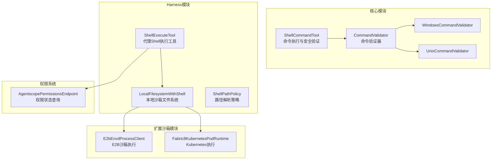
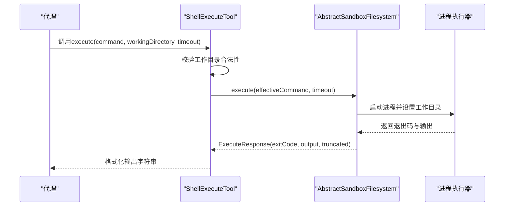
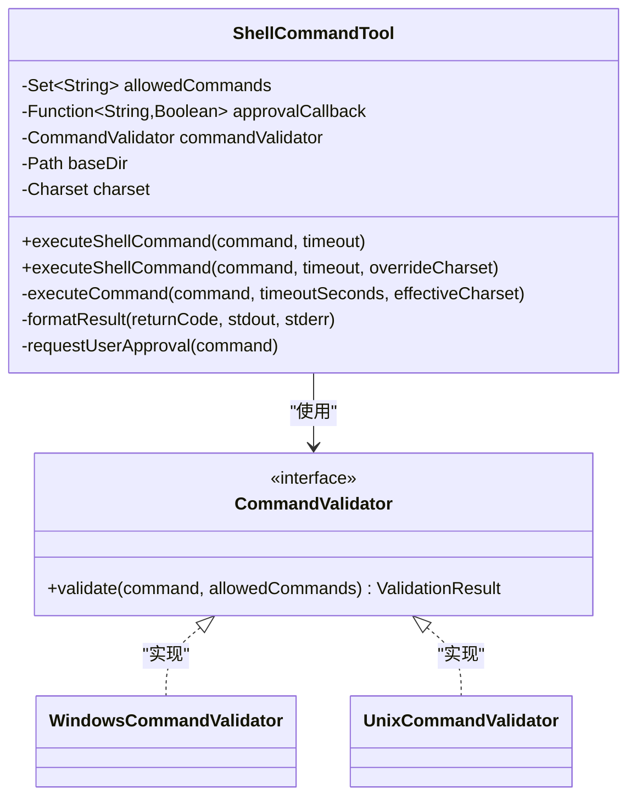
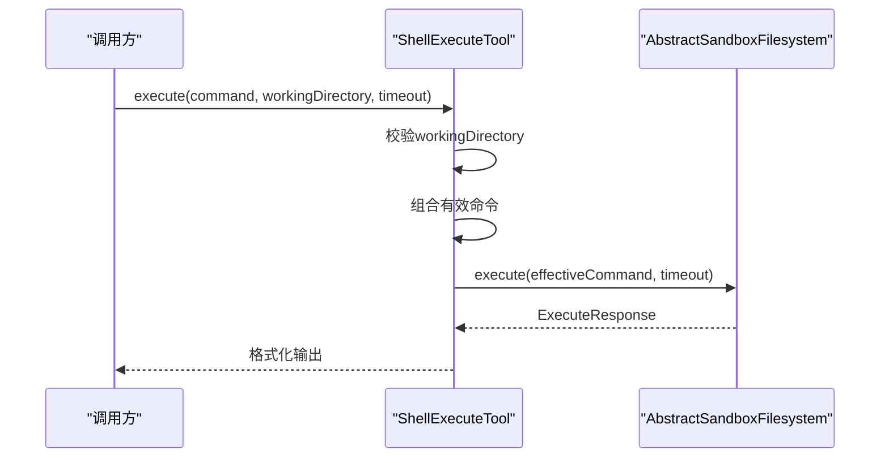
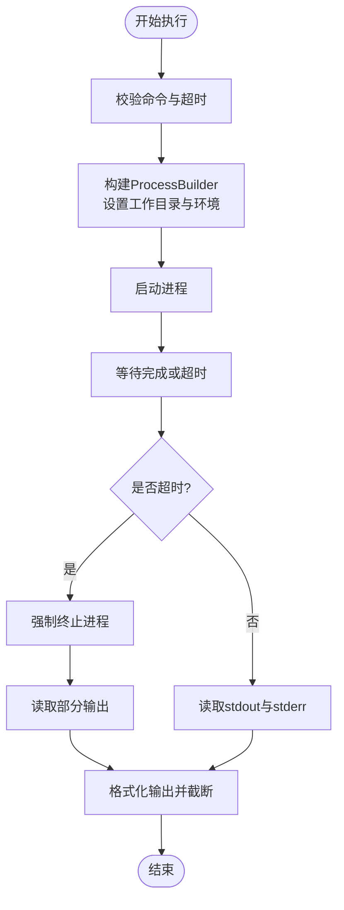
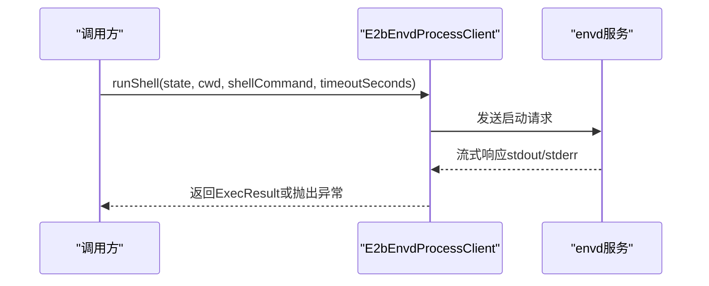
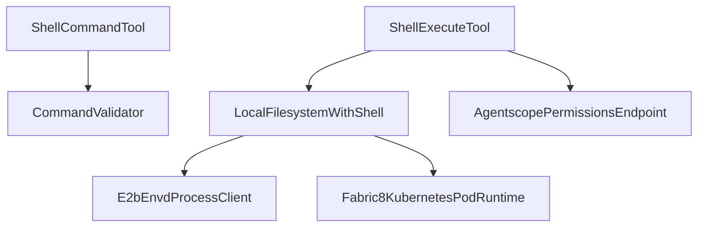

# Shell执行工具

<cite>
**本文档引用的文件**
- [ShellCommandTool.java](file://agentscope-core/src/main/java/io/agentscope/core/tool/coding/ShellCommandTool.java)
- [ShellExecuteTool.java](file://agentscope-harness/src/main/java/io/agentscope/harness/agent/tool/ShellExecuteTool.java)
- [LocalFilesystemWithShell.java](file://agentscope-harness/src/main/java/io/agentscope/harness/agent/filesystem/local/LocalFilesystemWithShell.java)
- [ShellPathPolicy.java](file://agentscope-harness/src/main/java/io/agentscope/harness/agent/skill/runtime/ShellPathPolicy.java)
- [E2bEnvdProcessClient.java](file://agentscope-extensions/agentscope-extensions-sandbox/agentscope-extensions-sandbox-e2b/src/main/java/io/agentscope/extensions/sandbox/e2b/E2bEnvdProcessClient.java)
- [Fabric8KubernetesPodRuntime.java](file://agentscope-extensions/agentscope-extensions-sandbox/agentscope-extensions-sandbox-kubernetes/src/main/java/io/agentscope/extensions/sandbox/kubernetes/Fabric8KubernetesPodRuntime.java)
- [AgentscopePermissionsEndpoint.java](file://agentscope-extensions/agentscope-spring-boot-starters/agentscope-admin-spring-boot-starter/src/main/java/io/agentscope/spring/boot/admin/endpoint/AgentscopePermissionsEndpoint.java)
- [permission-system.md](file://docs/v2/en/docs/building-blocks/permission-system.md)
- [filesystem.md](file://docs/v1/en/docs/harness/filesystem.md)
- [going-to-production.md](file://docs/v2/en/docs/others/going-to-production.md)
</cite>

## 目录
1. [简介](#简介)
2. [项目结构](#项目结构)
3. [核心组件](#核心组件)
4. [架构概览](#架构概览)
5. [详细组件分析](#详细组件分析)
6. [依赖关系分析](#依赖关系分析)
7. [性能考虑](#性能考虑)
8. [故障排除指南](#故障排除指南)
9. [结论](#结论)
10. [附录](#附录)

## 简介
本文件为Shell执行工具的详细API文档，涵盖命令参数验证、执行权限控制、输出结果处理、安全策略、超时控制与资源限制机制。文档同时提供在代理中的使用示例，包括命令组合、管道操作与错误处理，并展示在受控环境中安全执行系统命令的最佳实践，包括沙箱隔离与权限管理。

## 项目结构
该功能分布在多个模块中：
- 核心工具模块：提供通用的Shell命令执行工具与安全验证器
- Harness工具模块：提供面向代理的Shell执行工具与本地沙箱文件系统
- 扩展沙箱模块：提供多种沙箱后端（如E2B、Kubernetes等）的Shell执行能力
- 权限系统模块：提供统一的权限控制与规则管理
- 文档与示例：提供架构图与使用说明

**图表来源**
- [ShellCommandTool.java:73-800](file://agentscope-core/src/main/java/io/agentscope/core/tool/coding/ShellCommandTool.java#L73-L800)
- [ShellExecuteTool.java:27-80](file://agentscope-harness/src/main/java/io/agentscope/harness/agent/tool/ShellExecuteTool.java#L27-L80)
- [LocalFilesystemWithShell.java:46-434](file://agentscope-harness/src/main/java/io/agentscope/harness/agent/filesystem/local/LocalFilesystemWithShell.java#L46-L434)
- [ShellPathPolicy.java:38-143](file://agentscope-harness/src/main/java/io/agentscope/harness/agent/skill/runtime/ShellPathPolicy.java#L38-L143)
- [E2bEnvdProcessClient.java:93-163](file://agentscope-extensions/agentscope-extensions-sandbox/agentscope-extensions-sandbox-e2b/src/main/java/io/agentscope/extensions/sandbox/e2b/E2bEnvdProcessClient.java#L93-L163)
- [Fabric8KubernetesPodRuntime.java:108-130](file://agentscope-extensions/agentscope-extensions-sandbox/agentscope-extensions-sandbox-kubernetes/src/main/java/io/agentscope/extensions/sandbox/kubernetes/Fabric8KubernetesPodRuntime.java#L108-L130)
- [AgentscopePermissionsEndpoint.java:73-113](file://agentscope-extensions/agentscope-spring-boot-starters/agentscope-admin-spring-boot-starter/src/main/java/io/agentscope/spring/boot/admin/endpoint/AgentscopePermissionsEndpoint.java#L73-L113)

**章节来源**
- [ShellCommandTool.java:1-800](file://agentscope-core/src/main/java/io/agentscope/core/tool/coding/ShellCommandTool.java#L1-L800)
- [ShellExecuteTool.java:1-80](file://agentscope-harness/src/main/java/io/agentscope/harness/agent/tool/ShellExecuteTool.java#L1-L80)
- [LocalFilesystemWithShell.java:1-434](file://agentscope-harness/src/main/java/io/agentscope/harness/agent/filesystem/local/LocalFilesystemWithShell.java#L1-L434)
- [ShellPathPolicy.java:1-143](file://agentscope-harness/src/main/java/io/agentscope/harness/agent/skill/runtime/ShellPathPolicy.java#L1-L143)
- [E2bEnvdProcessClient.java:93-163](file://agentscope-extensions/agentscope-extensions-sandbox/agentscope-extensions-sandbox-e2b/src/main/java/io/agentscope/extensions/sandbox/e2b/E2bEnvdProcessClient.java#L93-L163)
- [Fabric8KubernetesPodRuntime.java:108-130](file://agentscope-extensions/agentscope-extensions-sandbox/agentscope-extensions-sandbox-kubernetes/src/main/java/io/agentscope/extensions/sandbox/kubernetes/Fabric8KubernetesPodRuntime.java#L108-L130)
- [AgentscopePermissionsEndpoint.java:73-113](file://agentscope-extensions/agentscope-spring-boot-starters/agentscope-admin-spring-boot-starter/src/main/java/io/agentscope/spring/boot/admin/endpoint/AgentscopePermissionsEndpoint.java#L73-L113)

## 核心组件
本节概述Shell执行工具的关键组件及其职责。

- ShellCommandTool：核心命令执行工具，支持白名单、用户审批回调、多命令检测、超时控制与平台特定验证。
- ShellExecuteTool：代理层Shell执行工具，封装工作目录、超时与输出格式化。
- LocalFilesystemWithShell：本地沙箱文件系统，提供直接的Shell执行能力（无沙箱隔离）。
- ShellPathPolicy：根据当前Shell模式解析技能文件根路径。
- E2bEnvdProcessClient与Fabric8KubernetesPodRuntime：扩展沙箱后端的Shell执行客户端与运行时。
- 权限系统：统一的权限控制与规则管理，支持ALLOW/DENY/ASK/PASSTHROUGH决策。

**章节来源**
- [ShellCommandTool.java:73-800](file://agentscope-core/src/main/java/io/agentscope/core/tool/coding/ShellCommandTool.java#L73-L800)
- [ShellExecuteTool.java:27-80](file://agentscope-harness/src/main/java/io/agentscope/harness/agent/tool/ShellExecuteTool.java#L27-L80)
- [LocalFilesystemWithShell.java:35-434](file://agentscope-harness/src/main/java/io/agentscope/harness/agent/filesystem/local/LocalFilesystemWithShell.java#L35-L434)
- [ShellPathPolicy.java:38-143](file://agentscope-harness/src/main/java/io/agentscope/harness/agent/skill/runtime/ShellPathPolicy.java#L38-L143)
- [E2bEnvdProcessClient.java:93-163](file://agentscope-extensions/agentscope-extensions-sandbox/agentscope-extensions-sandbox-e2b/src/main/java/io/agentscope/extensions/sandbox/e2b/E2bEnvdProcessClient.java#L93-L163)
- [Fabric8KubernetesPodRuntime.java:108-130](file://agentscope-extensions/agentscope-extensions-sandbox/agentscope-extensions-sandbox-kubernetes/src/main/java/io/agentscope/extensions/sandbox/kubernetes/Fabric8KubernetesPodRuntime.java#L108-L130)

## 架构概览
下图展示了Shell执行工具的整体架构与数据流：

**图表来源**
- [ShellExecuteTool.java:42-78](file://agentscope-harness/src/main/java/io/agentscope/harness/agent/tool/ShellExecuteTool.java#L42-L78)
- [LocalFilesystemWithShell.java:308-408](file://agentscope-harness/src/main/java/io/agentscope/harness/agent/filesystem/local/LocalFilesystemWithShell.java#L308-L408)

## 详细组件分析

### ShellCommandTool 组件分析
ShellCommandTool是核心的命令执行工具，具备以下特性：
- 命令白名单：仅允许白名单内的命令直接执行
- 用户审批回调：非白名单命令需经用户批准
- 多命令检测：阻止命令串联攻击（&、|、;）
- 平台特定验证：Windows与Unix/Linux/macOS采用不同验证规则
- 超时控制：默认300秒，支持自定义超时
- 输出处理：异步读取stdout/stderr，防止管道缓冲区死锁
- 字符集解码：支持UTF-8、GBK等字符集

**图表来源**
- [ShellCommandTool.java:73-800](file://agentscope-core/src/main/java/io/agentscope/core/tool/coding/ShellCommandTool.java#L73-L800)

**章节来源**
- [ShellCommandTool.java:73-800](file://agentscope-core/src/main/java/io/agentscope/core/tool/coding/ShellCommandTool.java#L73-L800)

### ShellExecuteTool 组件分析
ShellExecuteTool是代理层的Shell执行工具，负责：
- 工作目录校验：禁止绝对路径、~与..等危险路径
- 命令组合：将工作目录切换命令与原命令组合执行
- 超时控制：默认30秒，支持自定义超时
- 输出格式化：返回退出码与输出内容

**图表来源**
- [ShellExecuteTool.java:42-78](file://agentscope-harness/src/main/java/io/agentscope/harness/agent/tool/ShellExecuteTool.java#L42-L78)

**章节来源**
- [ShellExecuteTool.java:27-80](file://agentscope-harness/src/main/java/io/agentscope/harness/agent/tool/ShellExecuteTool.java#L27-L80)

### LocalFilesystemWithShell 组件分析
LocalFilesystemWithShell提供本地直连的Shell执行能力（无沙箱隔离），适用于开发与CI环境：
- 默认超时120秒，最大输出字节数100KB
- 支持环境变量注入与继承
- 解析执行工作目录：优先使用shellCwd，否则使用命名空间后的rootDir
- 输出截断：超过阈值自动截断并标记

**图表来源**
- [LocalFilesystemWithShell.java:308-408](file://agentscope-harness/src/main/java/io/agentscope/harness/agent/filesystem/local/LocalFilesystemWithShell.java#L308-L408)

**章节来源**
- [LocalFilesystemWithShell.java:35-434](file://agentscope-harness/src/main/java/io/agentscope/harness/agent/filesystem/local/LocalFilesystemWithShell.java#L35-L434)

### ShellPathPolicy 组件分析
ShellPathPolicy用于根据当前Shell模式解析技能文件根路径：
- NO_SHELL：无Shell可用，返回null
- SANDBOX：返回/workspace前缀下的路径
- LOCAL_WITH_SHELL：返回宿主机绝对路径

**章节来源**
- [ShellPathPolicy.java:38-143](file://agentscope-harness/src/main/java/io/agentscope/harness/agent/skill/runtime/ShellPathPolicy.java#L38-L143)

### 扩展沙箱执行组件分析
扩展沙箱提供了两种执行方式：
- E2bEnvdProcessClient：通过envd API执行命令，支持超时与输出截断
- Fabric8KubernetesPodRuntime：在Kubernetes Pod中执行命令，支持超时与输出截断

**图表来源**
- [E2bEnvdProcessClient.java:93-163](file://agentscope-extensions/agentscope-extensions-sandbox/agentscope-extensions-sandbox-e2b/src/main/java/io/agentscope/extensions/sandbox/e2b/E2bEnvdProcessClient.java#L93-L163)

**章节来源**
- [E2bEnvdProcessClient.java:93-163](file://agentscope-extensions/agentscope-extensions-sandbox/agentscope-extensions-sandbox-e2b/src/main/java/io/agentscope/extensions/sandbox/e2b/E2bEnvdProcessClient.java#L93-L163)
- [Fabric8KubernetesPodRuntime.java:108-130](file://agentscope-extensions/agentscope-extensions-sandbox/agentscope-extensions-sandbox-kubernetes/src/main/java/io/agentscope/extensions/sandbox/kubernetes/Fabric8KubernetesPodRuntime.java#L108-L130)

## 依赖关系分析
Shell执行工具的依赖关系如下：

**图表来源**
- [ShellCommandTool.java:73-800](file://agentscope-core/src/main/java/io/agentscope/core/tool/coding/ShellCommandTool.java#L73-L800)
- [ShellExecuteTool.java:27-80](file://agentscope-harness/src/main/java/io/agentscope/harness/agent/tool/ShellExecuteTool.java#L27-L80)
- [LocalFilesystemWithShell.java:46-434](file://agentscope-harness/src/main/java/io/agentscope/harness/agent/filesystem/local/LocalFilesystemWithShell.java#L46-L434)
- [E2bEnvdProcessClient.java:93-163](file://agentscope-extensions/agentscope-extensions-sandbox/agentscope-extensions-sandbox-e2b/src/main/java/io/agentscope/extensions/sandbox/e2b/E2bEnvdProcessClient.java#L93-L163)
- [Fabric8KubernetesPodRuntime.java:108-130](file://agentscope-extensions/agentscope-extensions-sandbox/agentscope-extensions-sandbox-kubernetes/src/main/java/io/agentscope/extensions/sandbox/kubernetes/Fabric8KubernetesPodRuntime.java#L108-L130)
- [AgentscopePermissionsEndpoint.java:73-113](file://agentscope-extensions/agentscope-spring-boot-starters/agentscope-admin-spring-boot-starter/src/main/java/io/agentscope/spring/boot/admin/endpoint/AgentscopePermissionsEndpoint.java#L73-L113)

**章节来源**
- [ShellCommandTool.java:73-800](file://agentscope-core/src/main/java/io/agentscope/core/tool/coding/ShellCommandTool.java#L73-L800)
- [ShellExecuteTool.java:27-80](file://agentscope-harness/src/main/java/io/agentscope/harness/agent/tool/ShellExecuteTool.java#L27-L80)
- [LocalFilesystemWithShell.java:46-434](file://agentscope-harness/src/main/java/io/agentscope/harness/agent/filesystem/local/LocalFilesystemWithShell.java#L46-L434)
- [E2bEnvdProcessClient.java:93-163](file://agentscope-extensions/agentscope-extensions-sandbox/agentscope-extensions-sandbox-e2b/src/main/java/io/agentscope/extensions/sandbox/e2b/E2bEnvdProcessClient.java#L93-L163)
- [Fabric8KubernetesPodRuntime.java:108-130](file://agentscope-extensions/agentscope-extensions-sandbox/agentscope-extensions-sandbox-kubernetes/src/main/java/io/agentscope/extensions/sandbox/kubernetes/Fabric8KubernetesPodRuntime.java#L108-L130)
- [AgentscopePermissionsEndpoint.java:73-113](file://agentscope-extensions/agentscope-spring-boot-starters/agentscope-admin-spring-boot-starter/src/main/java/io/agentscope/spring/boot/admin/endpoint/AgentscopePermissionsEndpoint.java#L73-L113)

## 性能考虑
- 异步流读取：避免管道缓冲区死锁，提升大输出场景的稳定性
- 超时控制：合理设置超时时间，防止长时间阻塞
- 输出截断：限制最大输出字节数，避免内存占用过高
- 线程池复用：使用缓存线程池处理流读取任务
- 分布式执行保护：在全局作用域下使用分布式锁防止并发冲突

**章节来源**
- [ShellCommandTool.java:83-98](file://agentscope-core/src/main/java/io/agentscope/core/tool/coding/ShellCommandTool.java#L83-L98)
- [LocalFilesystemWithShell.java:308-408](file://agentscope-harness/src/main/java/io/agentscope/harness/agent/filesystem/local/LocalFilesystemWithShell.java#L308-L408)
- [going-to-production.md:319-355](file://docs/v2/en/docs/others/going-to-production.md#L319-L355)

## 故障排除指南
常见问题与解决方案：
- 命令被拒绝：检查白名单与审批回调配置
- 超时错误：增加超时时间或优化命令执行逻辑
- 输出截断：调整最大输出字节数或分段执行
- 权限不足：检查权限规则与模式配置
- 管道死锁：确保使用异步流读取或升级到新版本

**章节来源**
- [ShellCommandTool.java:522-542](file://agentscope-core/src/main/java/io/agentscope/core/tool/coding/ShellCommandTool.java#L522-L542)
- [LocalFilesystemWithShell.java:343-360](file://agentscope-harness/src/main/java/io/agentscope/harness/agent/filesystem/local/LocalFilesystemWithShell.java#L343-L360)
- [AgentscopePermissionsEndpoint.java:73-113](file://agentscope-extensions/agentscope-spring-boot-starters/agentscope-admin-spring-boot-starter/src/main/java/io/agentscope/spring/boot/admin/endpoint/AgentscopePermissionsEndpoint.java#L73-L113)

## 结论
Shell执行工具提供了从核心验证到代理集成再到沙箱执行的完整链路。通过白名单、审批回调、多命令检测与超时控制等安全机制，结合异步流读取与输出截断等性能优化，能够在受控环境中安全高效地执行系统命令。建议在生产环境中启用严格的权限规则与沙箱隔离，并合理配置超时与资源限制。

## 附录

### API规范与使用示例

- ShellCommandTool
  - 名称：execute_shell_command
  - 参数：
    - command：要执行的Shell命令
    - timeout：命令运行的最大时间（秒，默认300）
    - charset：输出解码字符集（默认UTF-8）
  - 返回：包含returncode、stdout、stderr的格式化结果
  - 安全策略：白名单+审批回调+多命令检测+平台特定验证
  - 超时控制：默认300秒，支持自定义
  - 资源限制：异步流读取，防止死锁；可配置字符集

- ShellExecuteTool
  - 名称：execute
  - 参数：
    - command：Shell命令
    - working_directory：工作目录（相对路径，不允许绝对路径、~与..）
    - timeout：超时（秒，默认30）
  - 返回：包含退出码与输出的字符串
  - 安全策略：工作目录合法性校验；与沙箱文件系统配合

- LocalFilesystemWithShell
  - 特性：本地直连执行，无沙箱隔离
  - 默认超时：120秒
  - 最大输出：100KB
  - 环境变量：可配置或继承父进程环境
  - 输出截断：超过阈值自动截断并标记

- 权限系统
  - 决策类型：ALLOW/DENY/ASK/PASSTHROUGH
  - 配置方式：初始化时通过PermissionContextState.builder()配置规则；运行时通过建议规则接受
  - 查询接口：AgentscopePermissionsEndpoint提供权限状态描述

**章节来源**
- [ShellCommandTool.java:352-422](file://agentscope-core/src/main/java/io/agentscope/core/tool/coding/ShellCommandTool.java#L352-L422)
- [ShellExecuteTool.java:42-55](file://agentscope-harness/src/main/java/io/agentscope/harness/agent/tool/ShellExecuteTool.java#L42-L55)
- [LocalFilesystemWithShell.java:308-318](file://agentscope-harness/src/main/java/io/agentscope/harness/agent/filesystem/local/LocalFilesystemWithShell.java#L308-L318)
- [AgentscopePermissionsEndpoint.java:73-113](file://agentscope-extensions/agentscope-spring-boot-starters/agentscope-admin-spring-boot-starter/src/main/java/io/agentscope/spring/boot/admin/endpoint/AgentscopePermissionsEndpoint.java#L73-L113)
- [permission-system.md:150-201](file://docs/v2/en/docs/building-blocks/permission-system.md#L150-L201)