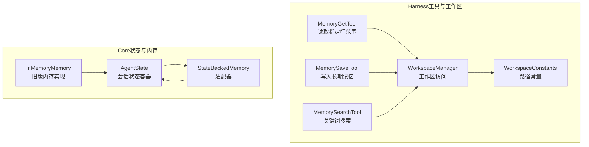
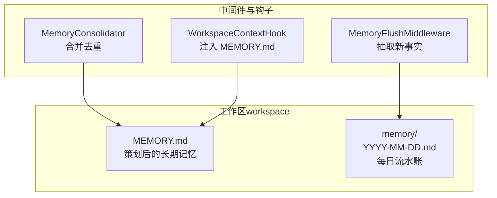
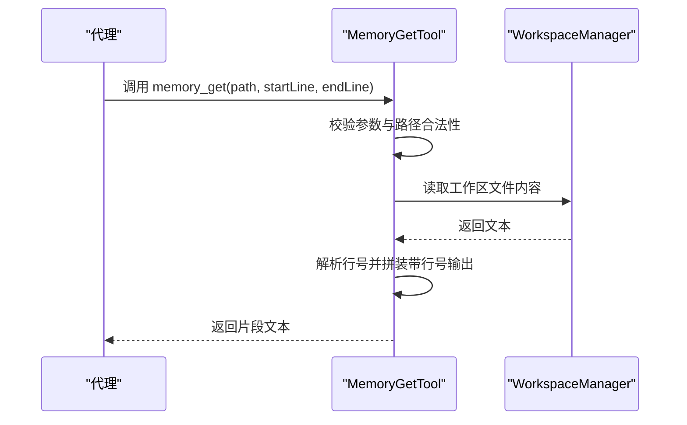
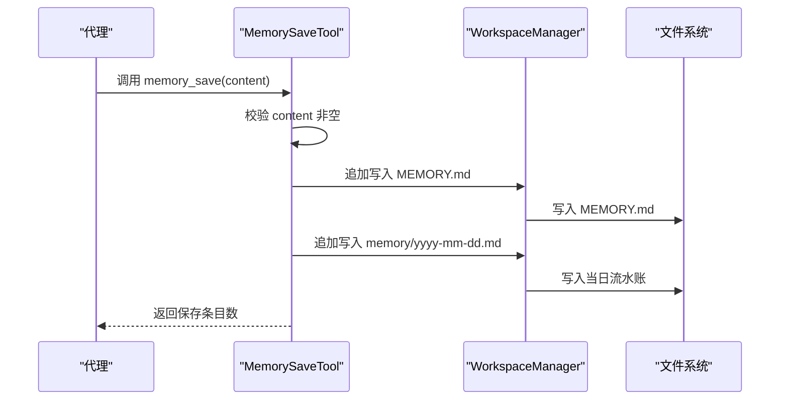
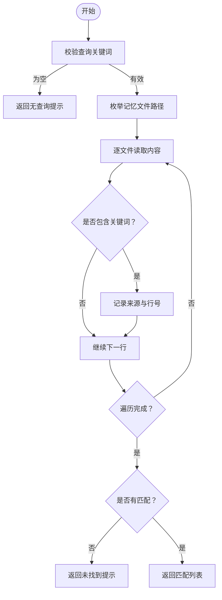
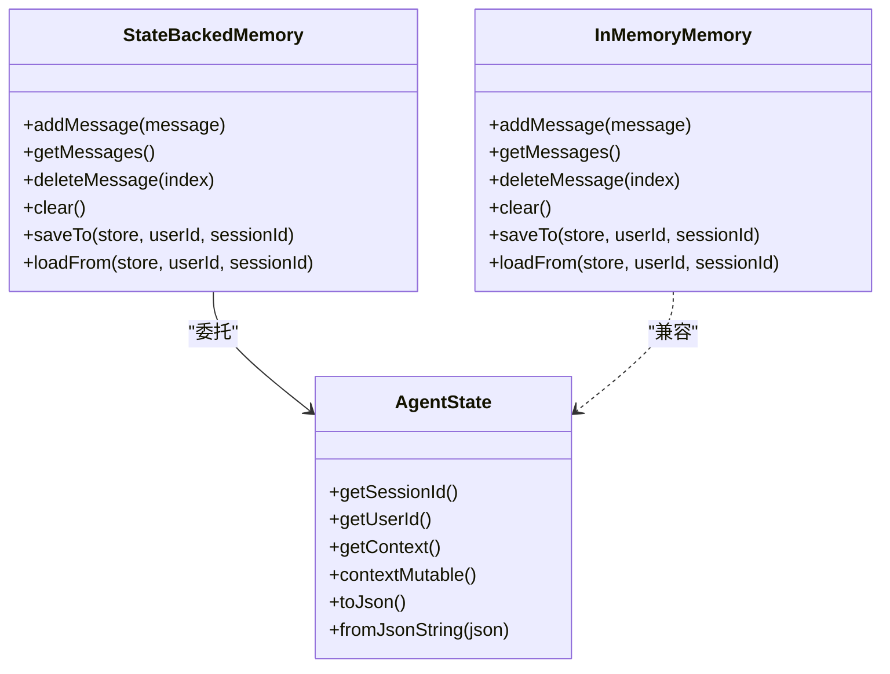
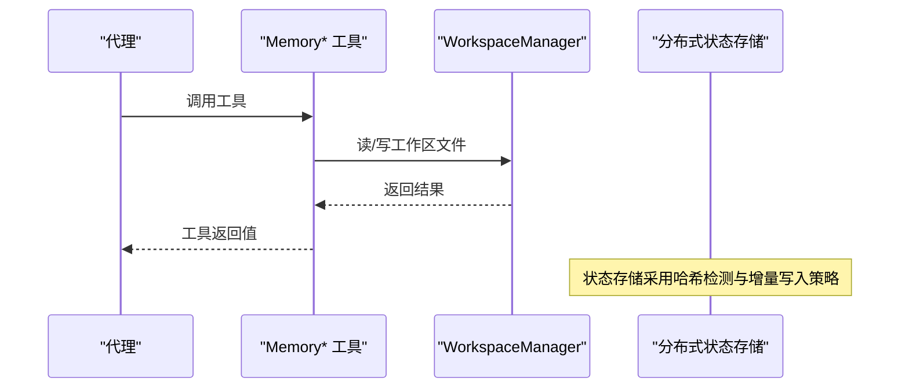
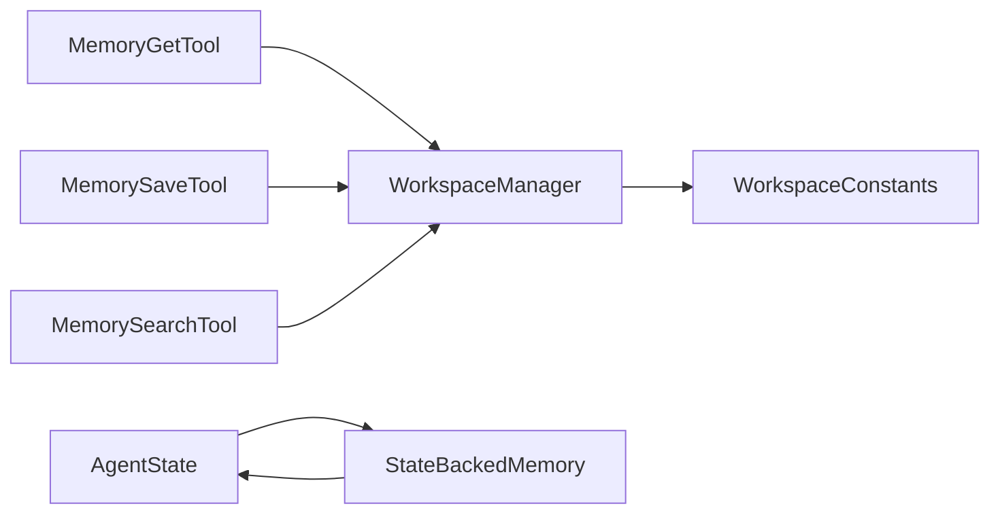

# 内存工具

<cite>
**本文引用的文件**
- [MemoryGetTool.java](file://agentscope-harness/src/main/java/io/agentscope/harness/agent/tool/MemoryGetTool.java)
- [MemorySaveTool.java](file://agentscope-harness/src/main/java/io/agentscope/harness/agent/tool/MemorySaveTool.java)
- [MemorySearchTool.java](file://agentscope-harness/src/main/java/io/agentscope/harness/agent/tool/MemorySearchTool.java)
- [WorkspaceManager.java](file://agentscope-harness/src/main/java/io/agentscope/harness/agent/workspace/WorkspaceManager.java)
- [WorkspaceConstants.java](file://agentscope-harness/src/main/java/io/agentscope/harness/agent/workspace/WorkspaceConstants.java)
- [AgentState.java](file://agentscope-core/src/main/java/io/agentscope/core/state/AgentState.java)
- [StateBackedMemory.java](file://agentscope-core/src/main/java/io/agentscope/core/memory/StateBackedMemory.java)
- [InMemoryMemory.java](file://agentscope-core/src/main/java/io/agentscope/core/memory/InMemoryMemory.java)
- [LongTermMemoryTools.java](file://agentscope-core/src/main/java/io/agentscope/core/memory/LongTermMemoryTools.java)
- [JedisAgentStateStore.java](file://agentscope-extensions/agentscope-extensions-redis/src/main/java/io/agentscope/extensions/redis/state/jedis/JedisAgentStateStore.java)
- [memory.md（v2 中文）](file://docs/v2/zh/docs/harness/memory.md)
- [workspace.md（v2 中文）](file://docs/v2/zh/docs/harness/workspace.md)
- [architecture.md（v1 英文）](file://docs/v1/en/docs/harness/architecture.md)
- [session.md（v1 英文）](file://docs/v1/en/docs/harness/session.md)
</cite>

## 目录
1. [简介](#简介)
2. [项目结构](#项目结构)
3. [核心组件](#核心组件)
4. [架构总览](#架构总览)
5. [组件详解](#组件详解)
6. [依赖关系分析](#依赖关系分析)
7. [性能考量](#性能考量)
8. [故障排查指南](#故障排查指南)
9. [结论](#结论)
10. [附录](#附录)

## 简介
本文件面向“内存工具”的使用者与维护者，系统性梳理并规范两类核心工具：
- 内存获取工具：用于从工作区中的长期记忆文件中读取指定行范围的内容，辅助代理定位历史信息。
- 内存保存工具：用于将用户偏好、决策、上下文等事实性信息安全地写入长期记忆（MEMORY.md 与每日流水账 memory/yyyy-mm-dd.md），确保跨会话可检索与沉淀。

同时，文档覆盖以下主题：
- 长期记忆的读取、写入、更新与删除操作的 API 规范
- 与核心内存系统的集成方式（数据序列化、缓存策略、并发控制）
- 在代理中使用内存工具进行状态管理与数据持久化的最佳实践
- 错误处理与性能优化建议

## 项目结构
围绕“内存工具”的关键代码与文档分布如下：
- 工具实现位于 harness 模块的 tool 包，依赖 workspace 管理器完成文件系统访问
- 核心状态与内存抽象位于 core 模块，提供 AgentState、StateBackedMemory、InMemoryMemory 等
- 文档对工作区结构、内存写入路径、后台维护策略进行了详细说明

**图表来源**
- [MemoryGetTool.java:1-85](file://agentscope-harness/src/main/java/io/agentscope/harness/agent/tool/MemoryGetTool.java#L1-L85)
- [MemorySaveTool.java:1-89](file://agentscope-harness/src/main/java/io/agentscope/harness/agent/tool/MemorySaveTool.java#L1-L89)
- [MemorySearchTool.java:1-91](file://agentscope-harness/src/main/java/io/agentscope/harness/agent/tool/MemorySearchTool.java#L1-L91)
- [WorkspaceManager.java](file://agentscope-harness/src/main/java/io/agentscope/harness/agent/workspace/WorkspaceManager.java)
- [WorkspaceConstants.java](file://agentscope-harness/src/main/java/io/agentscope/harness/agent/workspace/WorkspaceConstants.java)
- [AgentState.java:1-424](file://agentscope-core/src/main/java/io/agentscope/core/state/AgentState.java#L1-L424)
- [StateBackedMemory.java:1-80](file://agentscope-core/src/main/java/io/agentscope/core/memory/StateBackedMemory.java#L1-L80)
- [InMemoryMemory.java:1-135](file://agentscope-core/src/main/java/io/agentscope/core/memory/InMemoryMemory.java#L1-L135)

**章节来源**
- [MemoryGetTool.java:1-85](file://agentscope-harness/src/main/java/io/agentscope/harness/agent/tool/MemoryGetTool.java#L1-L85)
- [MemorySaveTool.java:1-89](file://agentscope-harness/src/main/java/io/agentscope/harness/agent/tool/MemorySaveTool.java#L1-L89)
- [MemorySearchTool.java:1-91](file://agentscope-harness/src/main/java/io/agentscope/harness/agent/tool/MemorySearchTool.java#L1-L91)
- [workspace.md（v2 中文）:295-320](file://docs/v2/zh/docs/harness/workspace.md#L295-L320)

## 核心组件
- MemoryGetTool：提供只读工具 memory_get，支持按行号区间读取工作区内的长期记忆文件，返回带行号的文本片段，便于后续检索与引用。
- MemorySaveTool：提供只读工具 memory_save，将用户希望长期记住的事实以 Markdown 列表形式写入 MEMORY.md，并同步写入当日流水账 memory/yyyy-mm-dd.md，供后续合并与检索。
- MemorySearchTool：提供只读工具 memory_search，基于关键词在 MEMORY.md 与 memory/*.md 文件中进行全文检索，返回匹配行及其来源路径与行号。

上述工具均通过 @Tool 注解暴露给代理，配合 WorkspaceManager 完成工作区文件访问与路径校验。

**章节来源**
- [MemoryGetTool.java:37-83](file://agentscope-harness/src/main/java/io/agentscope/harness/agent/tool/MemoryGetTool.java#L37-L83)
- [MemorySaveTool.java:48-87](file://agentscope-harness/src/main/java/io/agentscope/harness/agent/tool/MemorySaveTool.java#L48-L87)
- [MemorySearchTool.java:45-89](file://agentscope-harness/src/main/java/io/agentscope/harness/agent/tool/MemorySearchTool.java#L45-L89)

## 架构总览
长期记忆的写入与读取路径由工作区与中间件共同保障：
- 写入路径：对话压缩前，MemoryFlushMiddleware 将对话前缀中的新事实抽至每日流水账；后台节流任务定期合并去重，重写 MEMORY.md；MEMORY.md 每轮以预算控制方式注入 system prompt。
- 读取路径：框架自动读取 MEMORY.md；代理可通过 memory_search 与 memory_get 主动检索与拉取上下文。

**图表来源**
- [workspace.md（v2 中文）:300-320](file://docs/v2/zh/docs/harness/workspace.md#L300-L320)
- [architecture.md（v1 英文）:183-224](file://docs/v1/en/docs/harness/architecture.md#L183-L224)

**章节来源**
- [workspace.md（v2 中文）:295-320](file://docs/v2/zh/docs/harness/workspace.md#L295-L320)
- [architecture.md（v1 英文）:183-224](file://docs/v1/en/docs/harness/architecture.md#L183-L224)

## 组件详解

### MemoryGetTool（内存获取工具）
- 工具名称：memory_get
- 作用：读取工作区内指定路径的文件，返回从 startLine 到 endLine 的带行号文本片段
- 参数
  - path：相对工作区的文件路径（如 MEMORY.md 或 memory/2026-04-01.md）
  - startLine：起始行号（1 基）
  - endLine：结束行号（1 基）
- 行为与约束
  - 路径规范化与工作区边界检查，防止路径穿越
  - 若文件不存在或为空，返回错误提示
  - 返回格式为“行号|内容”的多行文本
- 并发与错误处理
  - 使用工作区管理器读取 UTF-8 文本
  - 对越界行号进行保护性处理并返回错误信息

**图表来源**
- [MemoryGetTool.java:43-83](file://agentscope-harness/src/main/java/io/agentscope/harness/agent/tool/MemoryGetTool.java#L43-L83)
- [WorkspaceManager.java](file://agentscope-harness/src/main/java/io/agentscope/harness/agent/workspace/WorkspaceManager.java)

**章节来源**
- [MemoryGetTool.java:37-83](file://agentscope-harness/src/main/java/io/agentscope/harness/agent/tool/MemoryGetTool.java#L37-L83)

### MemorySaveTool（内存保存工具）
- 工具名称：memory_save
- 作用：将一组要点式事实写入长期记忆，保证可检索与跨会话持久化
- 参数
  - content：Markdown 列表形式的事实要点（每项以 - 开头）
- 行为与约束
  - 追加写入 MEMORY.md 与当日流水账 memory/yyyy-mm-dd.md
  - 仅允许通过该工具写入长期记忆路径，避免非确定性命名
  - 统计保存条目数量并返回确认信息
- 并发与错误处理
  - 使用工作区管理器执行 UTF-8 追加写入
  - 对空内容进行校验并返回错误提示

**图表来源**
- [MemorySaveTool.java:55-87](file://agentscope-harness/src/main/java/io/agentscope/harness/agent/tool/MemorySaveTool.java#L55-L87)
- [WorkspaceManager.java](file://agentscope-harness/src/main/java/io/agentscope/harness/agent/workspace/WorkspaceManager.java)
- [WorkspaceConstants.java](file://agentscope-harness/src/main/java/io/agentscope/harness/agent/workspace/WorkspaceConstants.java)

**章节来源**
- [MemorySaveTool.java:48-87](file://agentscope-harness/src/main/java/io/agentscope/harness/agent/tool/MemorySaveTool.java#L48-L87)

### MemorySearchTool（内存搜索工具）
- 工具名称：memory_search
- 作用：在 MEMORY.md 与 memory/*.md 中按关键词进行不区分大小写的全文检索
- 参数
  - query：关键词
- 行为与约束
  - 遍历可见的记忆文件，匹配行并返回“来源路径#行号: 内容”的列表
  - 若无匹配，返回提示信息
- 并发与错误处理
  - 使用工作区管理器读取文件内容
  - 忽略空文件，继续遍历其他文件

**图表来源**
- [MemorySearchTool.java:52-89](file://agentscope-harness/src/main/java/io/agentscope/harness/agent/tool/MemorySearchTool.java#L52-L89)

**章节来源**
- [MemorySearchTool.java:45-89](file://agentscope-harness/src/main/java/io/agentscope/harness/agent/tool/MemorySearchTool.java#L45-L89)

### 与核心内存系统的集成

#### 数据序列化与状态模块
- AgentState 提供会话级状态容器，其中 context 为对话缓冲区，支持序列化与反序列化
- StateBackedMemory 作为适配器，将旧版 Memory 接口调用映射到 AgentState.contextMutable，保持向后兼容
- InMemoryMemory 为旧版内存实现，提供保存/加载到 AgentStateStore 的能力（已标记弃用）

**图表来源**
- [AgentState.java:59-424](file://agentscope-core/src/main/java/io/agentscope/core/state/AgentState.java#L59-L424)
- [StateBackedMemory.java:36-79](file://agentscope-core/src/main/java/io/agentscope/core/memory/StateBackedMemory.java#L36-L79)
- [InMemoryMemory.java:37-134](file://agentscope-core/src/main/java/io/agentscope/core/memory/InMemoryMemory.java#L37-L134)

**章节来源**
- [AgentState.java:1-424](file://agentscope-core/src/main/java/io/agentscope/core/state/AgentState.java#L1-L424)
- [StateBackedMemory.java:1-80](file://agentscope-core/src/main/java/io/agentscope/core/memory/StateBackedMemory.java#L1-L80)
- [InMemoryMemory.java:1-135](file://agentscope-core/src/main/java/io/agentscope/core/memory/InMemoryMemory.java#L1-L135)

#### 缓存策略与并发控制
- 工作区文件访问通过 WorkspaceManager 统一管理，避免路径穿越与越权访问
- 长期记忆写入采用追加写策略，合并与去重由后台任务集中处理，降低写放大
- 状态存储（如 Redis）采用哈希变更检测，支持列表的增量/全量写入策略，兼顾一致性与性能

**图表来源**
- [JedisAgentStateStore.java:102-134](file://agentscope-extensions/agentscope-extensions-redis/src/main/java/io/agentscope/extensions/redis/state/jedis/JedisAgentStateStore.java#L102-L134)

**章节来源**
- [JedisAgentStateStore.java:102-134](file://agentscope-extensions/agentscope-extensions-redis/src/main/java/io/agentscope/extensions/redis/state/jedis/JedisAgentStateStore.java#L102-L134)

#### 与旧版长期记忆工具的关系
- LongTermMemoryTools 提供了面向长期记忆的工具适配（记录/检索），但已在 2.0.0 版本标记弃用
- 新架构推荐使用 MEMORY.md 与 memory/*.md 的文件化长期记忆体系，配合专用工具进行读写

**章节来源**
- [LongTermMemoryTools.java:64-66](file://agentscope-core/src/main/java/io/agentscope/core/memory/LongTermMemoryTools.java#L64-L66)

## 依赖关系分析
- 工具依赖 WorkspaceManager 完成工作区文件访问，确保路径安全与编码正确
- WorkspaceConstants 提供统一的路径常量，保证写入目标的一致性
- AgentState 作为会话状态载体，承载对话上下文与工具上下文，支撑工具调用的运行时环境

**图表来源**
- [MemoryGetTool.java:31-35](file://agentscope-harness/src/main/java/io/agentscope/harness/agent/tool/MemoryGetTool.java#L31-L35)
- [MemorySaveTool.java:42-46](file://agentscope-harness/src/main/java/io/agentscope/harness/agent/tool/MemorySaveTool.java#L42-L46)
- [MemorySearchTool.java:39-43](file://agentscope-harness/src/main/java/io/agentscope/harness/agent/tool/MemorySearchTool.java#L39-L43)
- [WorkspaceConstants.java](file://agentscope-harness/src/main/java/io/agentscope/harness/agent/workspace/WorkspaceConstants.java)
- [AgentState.java:59-424](file://agentscope-core/src/main/java/io/agentscope/core/state/AgentState.java#L59-L424)
- [StateBackedMemory.java:36-79](file://agentscope-core/src/main/java/io/agentscope/core/memory/StateBackedMemory.java#L36-L79)

**章节来源**
- [MemoryGetTool.java:1-85](file://agentscope-harness/src/main/java/io/agentscope/harness/agent/tool/MemoryGetTool.java#L1-L85)
- [MemorySaveTool.java:1-89](file://agentscope-harness/src/main/java/io/agentscope/harness/agent/tool/MemorySaveTool.java#L1-L89)
- [MemorySearchTool.java:1-91](file://agentscope-harness/src/main/java/io/agentscope/harness/agent/tool/MemorySearchTool.java#L1-L91)
- [WorkspaceManager.java](file://agentscope-harness/src/main/java/io/agentscope/harness/agent/workspace/WorkspaceManager.java)
- [WorkspaceConstants.java](file://agentscope-harness/src/main/java/io/agentscope/harness/agent/workspace/WorkspaceConstants.java)
- [AgentState.java:1-424](file://agentscope-core/src/main/java/io/agentscope/core/state/AgentState.java#L1-L424)
- [StateBackedMemory.java:1-80](file://agentscope-core/src/main/java/io/agentscope/core/memory/StateBackedMemory.java#L1-L80)

## 性能考量
- 写入路径
  - 追加写入 MEMORY.md 与每日流水账，避免随机写放大
  - 合并与去重由后台任务周期性执行，降低实时写入开销
- 读取路径
  - memory_search 采用关键词匹配，建议在代理提示词中明确关键词，减少扫描范围
  - memory_get 仅读取指定行范围，避免一次性加载大文件
- 存储与并发
  - 使用分布式状态存储（如 Redis）时，利用哈希检测实现增量写入，减少网络与存储压力
  - 对于大量工具结果，可参考工具结果卸载策略，避免上下文膨胀

[本节为通用指导，无需列出具体文件来源]

## 故障排查指南
- 路径问题
  - memory_get 返回“路径穿越不允许”：请使用相对工作区路径，不要包含 “../”
  - memory_get 返回“文件未找到”：确认路径与文件名正确，检查工作区权限
- 查询问题
  - memory_search 返回“无匹配”：尝试更精确的关键词或扩大查询范围
- 写入问题
  - memory_save 返回“缺少内容”：请提供符合 Markdown 列表格式的事实要点
  - 写入失败：检查工作区文件系统权限与磁盘空间
- 状态存储
  - 分布式状态存储异常：核对连接配置与哈希检测逻辑，确保增量写入生效

**章节来源**
- [MemoryGetTool.java:55-83](file://agentscope-harness/src/main/java/io/agentscope/harness/agent/tool/MemoryGetTool.java#L55-L83)
- [MemorySaveTool.java:65-87](file://agentscope-harness/src/main/java/io/agentscope/harness/agent/tool/MemorySaveTool.java#L65-L87)
- [MemorySearchTool.java:56-89](file://agentscope-harness/src/main/java/io/agentscope/harness/agent/tool/MemorySearchTool.java#L56-L89)
- [JedisAgentStateStore.java:102-134](file://agentscope-extensions/agentscope-extensions-redis/src/main/java/io/agentscope/extensions/redis/state/jedis/JedisAgentStateStore.java#L102-L134)

## 结论
- MemoryGetTool、MemorySaveTool、MemorySearchTool 构成了长期记忆的读取、写入与检索闭环
- 新架构以文件化长期记忆为核心，配合专用工具与后台任务，实现高可靠、可审计、可扩展的状态管理
- 建议在代理提示词中明确引导使用 memory_save 与 memory_search，结合 memory_get 获取上下文，提升长期知识利用效率

[本节为总结性内容，无需列出具体文件来源]

## 附录

### API 规范摘要
- memory_get
  - 名称：memory_get
  - 只读：是
  - 参数：path（相对工作区）、startLine（1 基）、endLine（1 基）
  - 返回：带行号的文本片段
- memory_save
  - 名称：memory_save
  - 只读：是
  - 参数：content（Markdown 列表形式的事实要点）
  - 返回：保存条目数量
- memory_search
  - 名称：memory_search
  - 只读：是
  - 参数：query（关键词）
  - 返回：匹配行列表（含来源路径与行号）

**章节来源**
- [MemoryGetTool.java:37-83](file://agentscope-harness/src/main/java/io/agentscope/harness/agent/tool/MemoryGetTool.java#L37-L83)
- [MemorySaveTool.java:48-87](file://agentscope-harness/src/main/java/io/agentscope/harness/agent/tool/MemorySaveTool.java#L48-L87)
- [MemorySearchTool.java:45-89](file://agentscope-harness/src/main/java/io/agentscope/harness/agent/tool/MemorySearchTool.java#L45-L89)

### 相关文档链接
- 工作区与长期记忆结构：[workspace.md（v2 中文）:295-320](file://docs/v2/zh/docs/harness/workspace.md#L295-L320)
- 代理可用的记忆工具与后台维护：[memory.md（v2 中文）:228-257](file://docs/v2/zh/docs/harness/memory.md#L228-L257)
- 架构与状态流转（v1）：[architecture.md（v1 英文）:183-224](file://docs/v1/en/docs/harness/architecture.md#L183-L224)
- 会话与状态存储（v1）：[session.md（v1 英文）:35-59](file://docs/v1/en/docs/harness/session.md#L35-L59)