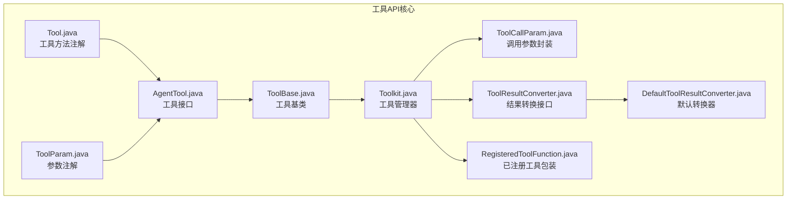
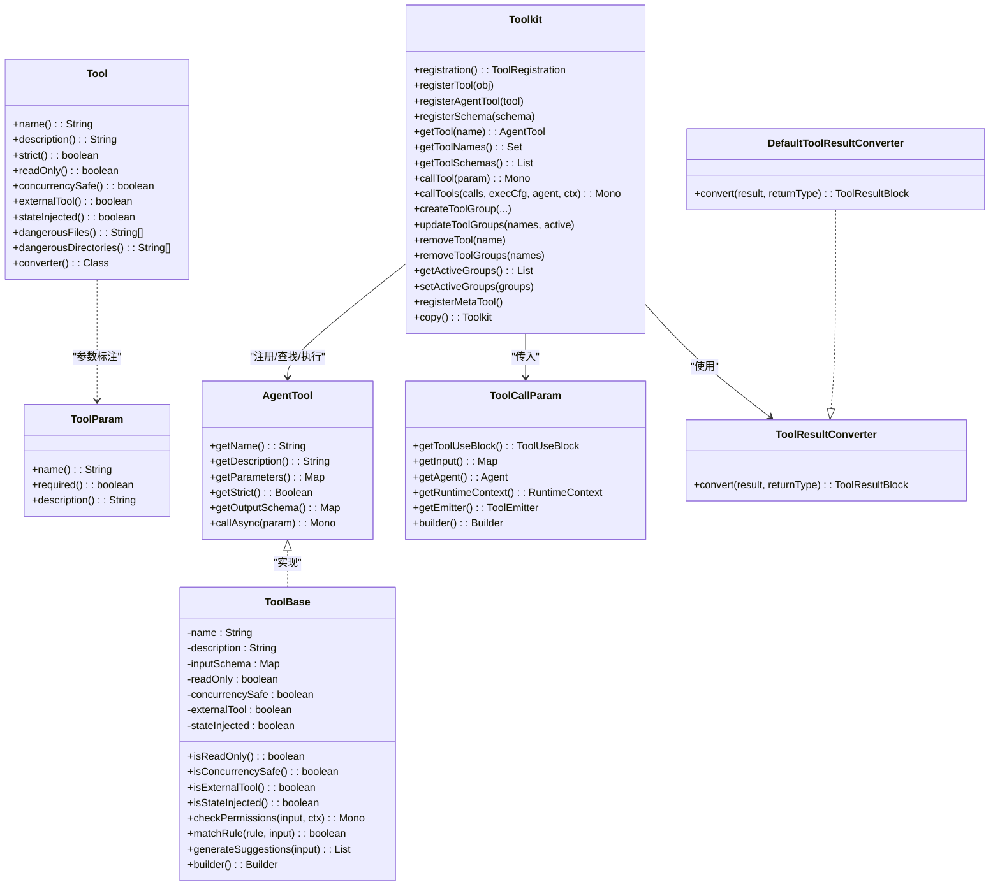
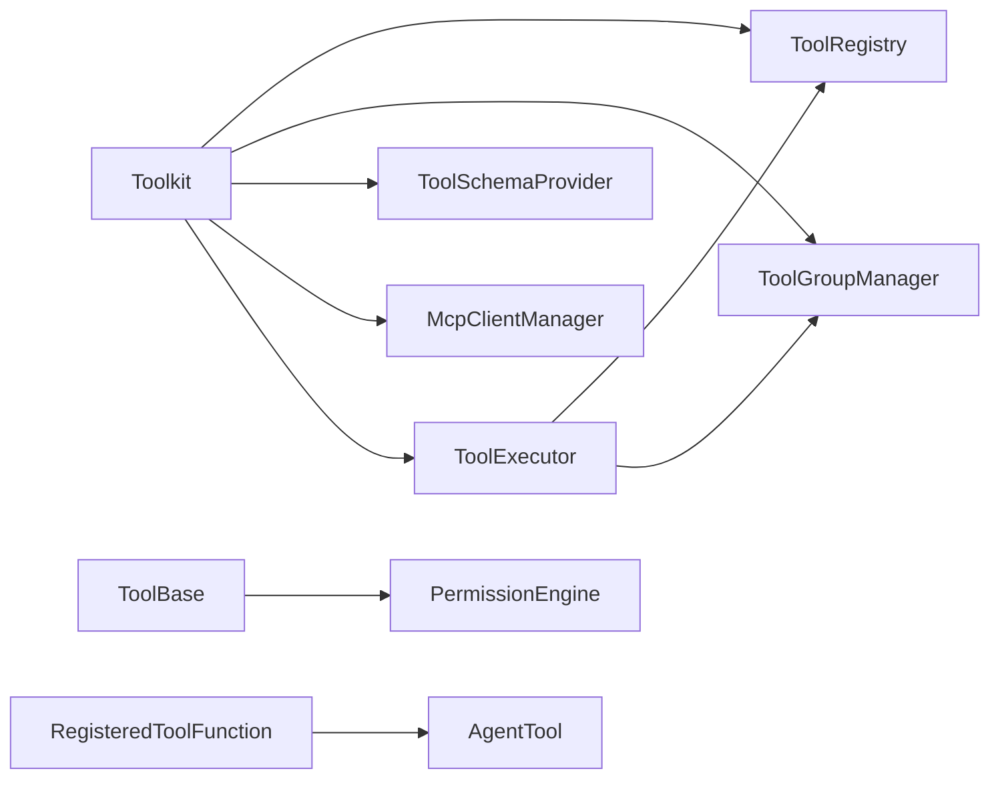

# 工具API

<cite>
**本文引用的文件**
- [Tool.java](file://agentscope-core/src/main/java/io/agentscope/core/tool/Tool.java)
- [ToolParam.java](file://agentscope-core/src/main/java/io/agentscope/core/tool/ToolParam.java)
- [AgentTool.java](file://agentscope-core/src/main/java/io/agentscope/core/tool/AgentTool.java)
- [ToolBase.java](file://agentscope-core/src/main/java/io/agentscope/core/tool/ToolBase.java)
- [Toolkit.java](file://agentscope-core/src/main/java/io/agentscope/core/tool/Toolkit.java)
- [ToolCallParam.java](file://agentscope-core/src/main/java/io/agentscope/core/tool/ToolCallParam.java)
- [ToolResultConverter.java](file://agentscope-core/src/main/java/io/agentscope/core/tool/ToolResultConverter.java)
- [DefaultToolResultConverter.java](file://agentscope-core/src/main/java/io/agentscope/core/tool/DefaultToolResultConverter.java)
- [RegisteredToolFunction.java](file://agentscope-core/src/main/java/io/agentscope/core/tool/RegisteredToolFunction.java)
</cite>

## 目录
1. [简介](#简介)
2. [项目结构](#项目结构)
3. [核心组件](#核心组件)
4. [架构总览](#架构总览)
5. [详细组件分析](#详细组件分析)
6. [依赖关系分析](#依赖关系分析)
7. [性能与并发特性](#性能与并发特性)
8. [故障排查指南](#故障排查指南)
9. [结论](#结论)
10. [附录：API规范与示例路径](#附录api规范与示例路径)

## 简介
本文件为工具系统的API参考文档，覆盖工具注册、配置、执行、权限控制、结果转换以及工具组管理等能力。内容基于agentscope-core模块中工具相关的核心类，面向开发者提供从“使用现有工具”到“开发自定义工具”的完整接口说明，并给出可直接定位到源码的示例路径。

## 项目结构
工具系统位于agentscope-core模块的io.agentscope.core.tool包下，围绕以下核心抽象展开：
- 注解与参数标注：用于声明工具方法及其参数元数据
- 工具接口与基类：统一工具行为契约与默认实现
- 工具注册与执行：集中式工具管理器，支持反射工具、外部工具、MCP工具与工具组
- 结果转换：将工具返回值标准化为消息块
- 调用参数封装：统一承载调用上下文（工具调用块、输入、代理、运行时上下文、流式发射器）

图表来源
- [Tool.java:1-194](file://agentscope-core/src/main/java/io/agentscope/core/tool/Tool.java#L1-L194)
- [ToolParam.java:1-105](file://agentscope-core/src/main/java/io/agentscope/core/tool/ToolParam.java#L1-L105)
- [AgentTool.java:1-119](file://agentscope-core/src/main/java/io/agentscope/core/tool/AgentTool.java#L1-L119)
- [ToolBase.java:1-342](file://agentscope-core/src/main/java/io/agentscope/core/tool/ToolBase.java#L1-L342)
- [Toolkit.java:1-1032](file://agentscope-core/src/main/java/io/agentscope/core/tool/Toolkit.java#L1-L1032)
- [ToolCallParam.java:1-260](file://agentscope-core/src/main/java/io/agentscope/core/tool/ToolCallParam.java#L1-L260)
- [ToolResultConverter.java:1-59](file://agentscope-core/src/main/java/io/agentscope/core/tool/ToolResultConverter.java#L1-L59)
- [DefaultToolResultConverter.java:1-98](file://agentscope-core/src/main/java/io/agentscope/core/tool/DefaultToolResultConverter.java#L1-L98)
- [RegisteredToolFunction.java:1-143](file://agentscope-core/src/main/java/io/agentscope/core/tool/RegisteredToolFunction.java#L1-L143)

章节来源
- [Toolkit.java:1-1032](file://agentscope-core/src/main/java/io/agentscope/core/tool/Toolkit.java#L1-L1032)

## 核心组件
- 工具注解与参数标注
  - @Tool：标记方法为工具，支持名称、描述、严格模式、只读、并发安全、外部工具、状态注入、危险文件/目录白名单、自定义结果转换器等配置
  - @ToolParam：为工具方法参数提供名称、是否必需、描述等元信息
- 工具接口与基类
  - AgentTool：定义工具名、描述、参数JSON Schema、输出Schema（可选）、异步调用入口
  - ToolBase：实现AgentTool，提供权限检查、规则匹配、危险路径检测、构建器等通用能力
- 工具管理器
  - Toolkit：集中式入口，负责工具注册（对象扫描、AgentTool实例、Schema定义）、工具组管理、MCP客户端集成、执行编排、流式回调设置、深拷贝等
- 结果转换
  - ToolResultConverter：将任意返回值转换为ToolResultBlock
  - DefaultToolResultConverter：默认JSON序列化策略，含空值与void处理回退
- 调用参数封装
  - ToolCallParam：封装工具调用块、输入参数、代理、运行时上下文、流式发射器，支持构建器与复制构造

章节来源
- [Tool.java:1-194](file://agentscope-core/src/main/java/io/agentscope/core/tool/Tool.java#L1-L194)
- [ToolParam.java:1-105](file://agentscope-core/src/main/java/io/agentscope/core/tool/ToolParam.java#L1-L105)
- [AgentTool.java:1-119](file://agentscope-core/src/main/java/io/agentscope/core/tool/AgentTool.java#L1-L119)
- [ToolBase.java:1-342](file://agentscope-core/src/main/java/io/agentscope/core/tool/ToolBase.java#L1-L342)
- [Toolkit.java:1-1032](file://agentscope-core/src/main/java/io/agentscope/core/tool/Toolkit.java#L1-L1032)
- [ToolCallParam.java:1-260](file://agentscope-core/src/main/java/io/agentscope/core/tool/ToolCallParam.java#L1-L260)
- [ToolResultConverter.java:1-59](file://agentscope-core/src/main/java/io/agentscope/core/tool/ToolResultConverter.java#L1-L59)
- [DefaultToolResultConverter.java:1-98](file://agentscope-core/src/main/java/io/agentscope/core/tool/DefaultToolResultConverter.java#L1-L98)

## 架构总览
工具系统采用“注解驱动+集中管理+可插拔扩展”的架构：
- 注解层：通过@Tool/@ToolParam声明工具与参数元数据
- 接口层：AgentTool/ToolBase统一工具行为与默认实现
- 管理层：Toolkit负责注册、分组、Schema生成、执行编排、MCP与外部工具桥接
- 执行层：ToolExecutor协调并行/串行执行、权限评估、结果转换与流式回调
- 输出层：ToolResultConverter将结果标准化为消息块

图表来源
- [Tool.java:1-194](file://agentscope-core/src/main/java/io/agentscope/core/tool/Tool.java#L1-L194)
- [ToolParam.java:1-105](file://agentscope-core/src/main/java/io/agentscope/core/tool/ToolParam.java#L1-L105)
- [AgentTool.java:1-119](file://agentscope-core/src/main/java/io/agentscope/core/tool/AgentTool.java#L1-L119)
- [ToolBase.java:1-342](file://agentscope-core/src/main/java/io/agentscope/core/tool/ToolBase.java#L1-L342)
- [Toolkit.java:1-1032](file://agentscope-core/src/main/java/io/agentscope/core/tool/Toolkit.java#L1-L1032)
- [ToolCallParam.java:1-260](file://agentscope-core/src/main/java/io/agentscope/core/tool/ToolCallParam.java#L1-L260)
- [ToolResultConverter.java:1-59](file://agentscope-core/src/main/java/io/agentscope/core/tool/ToolResultConverter.java#L1-L59)
- [DefaultToolResultConverter.java:1-98](file://agentscope-core/src/main/java/io/agentscope/core/tool/DefaultToolResultConverter.java#L1-L98)

## 详细组件分析

### 注解与参数标注
- @Tool
  - 支持字段：name、description、strict、readOnly、concurrencySafe、externalTool、stateInjected、dangerousFiles、dangerousDirectories、converter
  - 用途：声明工具方法，自动注册；生成JSON Schema；控制权限与执行策略
  - 示例路径：[示例用法与要求说明:31-51](file://agentscope-core/src/main/java/io/agentscope/core/tool/Tool.java#L31-L51)
- @ToolParam
  - 支持字段：name、required、description
  - 用途：为工具参数提供元数据，确保LLM理解参数含义与约束
  - 示例路径：[参数注解示例与注意事项:31-54](file://agentscope-core/src/main/java/io/agentscope/core/tool/ToolParam.java#L31-L54)

章节来源
- [Tool.java:1-194](file://agentscope-core/src/main/java/io/agentscope/core/tool/Tool.java#L1-L194)
- [ToolParam.java:1-105](file://agentscope-core/src/main/java/io/agentscope/core/tool/ToolParam.java#L1-L105)

### 工具接口与基类
- AgentTool
  - 规范：工具名、描述、参数Schema、可选输出Schema、异步调用
  - 关键点：参数Schema遵循JSON Schema格式；异步返回Mono<ToolResultBlock>
  - 示例路径：[接口契约与实现指南:28-34](file://agentscope-core/src/main/java/io/agentscope/core/tool/AgentTool.java#L28-L34)
- ToolBase
  - 默认实现：权限检查（checkPermissions）、规则匹配（matchRule）、建议生成（generateSuggestions）
  - 安全机制：危险文件/目录检测（isDangerousPath），支持符号链接真实路径校验
  - 构建器：builder()提供流畅配置（name/description/inputSchema/readOnly/concurrencySafe/externalTool/stateInjected/mcp/dangerousFiles/dangerousDirectories）
  - 示例路径：[默认权限检查与规则匹配:196-216](file://agentscope-core/src/main/java/io/agentscope/core/tool/ToolBase.java#L196-L216)，[危险路径检测逻辑:224-260](file://agentscope-core/src/main/java/io/agentscope/core/tool/ToolBase.java#L224-L260)

章节来源
- [AgentTool.java:1-119](file://agentscope-core/src/main/java/io/agentscope/core/tool/AgentTool.java#L1-L119)
- [ToolBase.java:1-342](file://agentscope-core/src/main/java/io/agentscope/core/tool/ToolBase.java#L1-L342)

### 工具管理器（Toolkit）
- 注册能力
  - registerTool(Object)：扫描对象上的@Tool方法并注册
  - registerAgentTool(AgentTool)：直接注册AgentTool实例
  - registerSchema(ToolSchema)：注册仅含Schema的外部工具
  - registration().mcpClient()/tool()/apply()：链式注册（含组、预设参数、扩展模型）
- 查询与执行
  - getTool(name)/getToolNames()：获取工具或工具名集合
  - getToolSchemas()/getToolSchemas(activeGroups)：按激活组过滤生成Schema
  - callTool(ToolCallParam)/callTools(...)：单个/批量异步执行
- 工具组管理
  - createToolGroup(...)/createSkillToolGroup(...)/registerToolGroup(...)
  - updateToolGroups(...)/removeToolGroups(...)
  - getActiveGroups()/setActiveGroups(...)
  - registerMetaTool()：注册动态管理工具组的元工具
- 预设参数与深拷贝
  - updateToolPresetParameters(...)：运行时更新预设参数
  - copy()：深拷贝工具集与激活状态，保留用户回调
- 外部工具与MCP
  - isExternalTool(name)：判断是否外部工具
  - registerMcpClient/removeMcpClient：MCP客户端生命周期管理
- 示例路径：[注册与执行示例:122-143](file://agentscope-core/src/main/java/io/agentscope/core/tool/Toolkit.java#L122-L143)，[外部工具注册与判断:266-325](file://agentscope-core/src/main/java/io/agentscope/core/tool/Toolkit.java#L266-L325)

章节来源
- [Toolkit.java:1-1032](file://agentscope-core/src/main/java/io/agentscope/core/tool/Toolkit.java#L1-L1032)

### 调用参数封装（ToolCallParam）
- 字段：toolUseBlock、input、agent、runtimeContext、emitter
- 能力：不可变输入视图、复制构建器、弃用的context兼容方法
- 示例路径：[参数封装与构建器:122-156](file://agentscope-core/src/main/java/io/agentscope/core/tool/ToolCallParam.java#L122-L156)

章节来源
- [ToolCallParam.java:1-260](file://agentscope-core/src/main/java/io/agentscope/core/tool/ToolCallParam.java#L1-L260)

### 结果转换（ToolResultConverter 与 DefaultToolResultConverter）
- ToolResultConverter.convert：将任意返回值转为ToolResultBlock
- DefaultToolResultConverter：
  - null → 文本"null"
  - void → 文本"Done"
  - 已是ToolResultBlock → 直接返回
  - 其他 → JSON序列化，失败则toString回退
- 示例路径：[默认转换策略:44-59](file://agentscope-core/src/main/java/io/agentscope/core/tool/DefaultToolResultConverter.java#L44-L59)

章节来源
- [ToolResultConverter.java:1-59](file://agentscope-core/src/main/java/io/agentscope/core/tool/ToolResultConverter.java#L1-L59)
- [DefaultToolResultConverter.java:1-98](file://agentscope-core/src/main/java/io/agentscope/core/tool/DefaultToolResultConverter.java#L1-L98)

### 已注册工具包装（RegisteredToolFunction）
- 作用：在AgentTool基础上附加扩展模型、MCP客户端关联与预设参数
- 能力：获取扩展参数Schema、运行时更新预设参数
- 示例路径：[预设参数与扩展Schema合并:105-141](file://agentscope-core/src/main/java/io/agentscope/core/tool/RegisteredToolFunction.java#L105-L141)

章节来源
- [RegisteredToolFunction.java:1-143](file://agentscope-core/src/main/java/io/agentscope/core/tool/RegisteredToolFunction.java#L1-L143)

## 依赖关系分析
- 组件耦合
  - Toolkit对AgentTool、ToolCallParam、ToolResultConverter、ToolGroupManager、McpClientManager存在强依赖
  - ToolBase对权限引擎（PermissionDecision/PermissionRule）有交互
  - RegisteredToolFunction作为装饰器持有AgentTool并扩展元数据
- 外部依赖
  - Reactor Mono用于异步执行
  - 日志框架用于记录注册与变更事件
- 潜在循环
  - 未见直接循环依赖；注册流程通过注册表与组管理器解耦

图表来源
- [Toolkit.java:1-1032](file://agentscope-core/src/main/java/io/agentscope/core/tool/Toolkit.java#L1-L1032)
- [ToolBase.java:1-342](file://agentscope-core/src/main/java/io/agentscope/core/tool/ToolBase.java#L1-L342)
- [RegisteredToolFunction.java:1-143](file://agentscope-core/src/main/java/io/agentscope/core/tool/RegisteredToolFunction.java#L1-L143)

章节来源
- [Toolkit.java:1-1032](file://agentscope-core/src/main/java/io/agentscope/core/tool/Toolkit.java#L1-L1032)

## 性能与并发特性
- 并发安全标志
  - @Tool(concurrencySafe)：默认true，表示可并行调用；false时框架在并行批次内串行化
- 执行策略
  - Toolkit支持并行/串行执行，结合ExecutionConfig进行超时与重试
- 流式回调
  - setChunkCallback/setInternalChunkCallback：支持工具进度分片回调，ReActAgent可转发至内部钩子
- 危险路径检测
  - 符号链接解析与段级目录匹配，避免绕过敏感路径

章节来源
- [Tool.java:110-117](file://agentscope-core/src/main/java/io/agentscope/core/tool/Tool.java#L110-L117)
- [Toolkit.java:495-525](file://agentscope-core/src/main/java/io/agentscope/core/tool/Toolkit.java#L495-L525)
- [ToolBase.java:224-260](file://agentscope-core/src/main/java/io/agentscope/core/tool/ToolBase.java#L224-L260)

## 故障排查指南
- 工具未被发现
  - 确认工具方法使用@Tool注解且非静态
  - 使用registerTool(Object)扫描对象上的@Tool方法
  - 参考：[注册工具方法流程:154-197](file://agentscope-core/src/main/java/io/agentscope/core/tool/Toolkit.java#L154-L197)
- 工具无法执行
  - 检查是否为外部工具（isExternalTool），外部工具需由框架抛出暂停信号而非本地执行
  - 参考：[外部工具判断:312-325](file://agentscope-core/src/main/java/io/agentscope/core/tool/Toolkit.java#L312-L325)
- 权限拒绝
  - 自定义工具可重写checkPermissions，或通过规则表与模式控制
  - 参考：[权限检查与规则匹配:196-216](file://agentscope-core/src/main/java/io/agentscope/core/tool/ToolBase.java#L196-L216)
- 结果格式异常
  - 自定义ToolResultConverter或使用默认转换器
  - 参考：[默认转换策略:44-59](file://agentscope-core/src/main/java/io/agentscope/core/tool/DefaultToolResultConverter.java#L44-L59)
- 工具组不生效
  - 确认组处于激活状态（getActiveGroups/setActiveGroups）
  - 参考：[工具组管理:691-712](file://agentscope-core/src/main/java/io/agentscope/core/tool/Toolkit.java#L691-L712)

章节来源
- [Toolkit.java:154-325](file://agentscope-core/src/main/java/io/agentscope/core/tool/Toolkit.java#L154-L325)
- [ToolBase.java:196-216](file://agentscope-core/src/main/java/io/agentscope/core/tool/ToolBase.java#L196-L216)
- [DefaultToolResultConverter.java:44-59](file://agentscope-core/src/main/java/io/agentscope/core/tool/DefaultToolResultConverter.java#L44-L59)

## 结论
工具API以注解与接口为核心，配合集中式管理器实现灵活的工具注册、分组与执行。通过权限引擎与结果转换器，系统在安全性与易用性之间取得平衡。开发者可通过@Tool/@ToolParam快速声明工具，借助Toolkit完成注册与执行，并通过自定义转换器与权限策略满足复杂场景需求。

## 附录：API规范与示例路径
- 工具声明与参数标注
  - @Tool：[注解字段与使用要求:60-193](file://agentscope-core/src/main/java/io/agentscope/core/tool/Tool.java#L60-L193)
  - @ToolParam：[参数注解字段与示例:62-104](file://agentscope-core/src/main/java/io/agentscope/core/tool/ToolParam.java#L62-L104)
- 工具接口与基类
  - AgentTool：[接口契约:40-118](file://agentscope-core/src/main/java/io/agentscope/core/tool/AgentTool.java#L40-L118)
  - ToolBase：[默认实现与构建器:60-341](file://agentscope-core/src/main/java/io/agentscope/core/tool/ToolBase.java#L60-L341)
- 工具管理器
  - 注册与查询：[注册与查询API:154-262](file://agentscope-core/src/main/java/io/agentscope/core/tool/Toolkit.java#L154-L262)
  - 执行与Schema：[执行与Schema生成:467-351](file://agentscope-core/src/main/java/io/agentscope/core/tool/Toolkit.java#L467-L351)
  - 工具组管理：[组创建/更新/删除/查询:562-722](file://agentscope-core/src/main/java/io/agentscope/core/tool/Toolkit.java#L562-L722)
  - 外部工具与MCP：[外部工具与MCP管理:266-550](file://agentscope-core/src/main/java/io/agentscope/core/tool/Toolkit.java#L266-L550)
- 调用参数与结果转换
  - ToolCallParam：[参数封装与构建器:46-258](file://agentscope-core/src/main/java/io/agentscope/core/tool/ToolCallParam.java#L46-L258)
  - ToolResultConverter：[转换接口:48-58](file://agentscope-core/src/main/java/io/agentscope/core/tool/ToolResultConverter.java#L48-L58)
  - DefaultToolResultConverter：[默认转换策略:44-96](file://agentscope-core/src/main/java/io/agentscope/core/tool/DefaultToolResultConverter.java#L44-L96)
- 已注册工具包装
  - RegisteredToolFunction：[预设参数与扩展Schema:105-141](file://agentscope-core/src/main/java/io/agentscope/core/tool/RegisteredToolFunction.java#L105-L141)