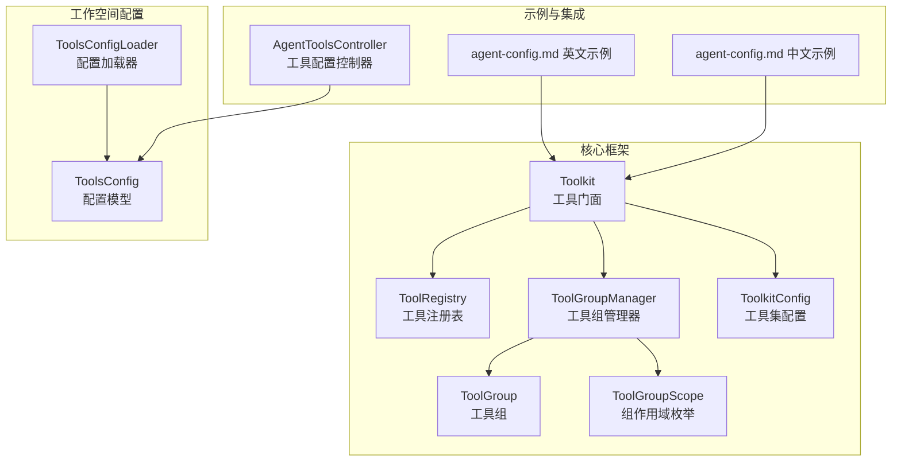
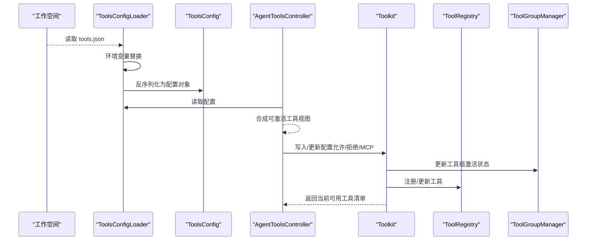
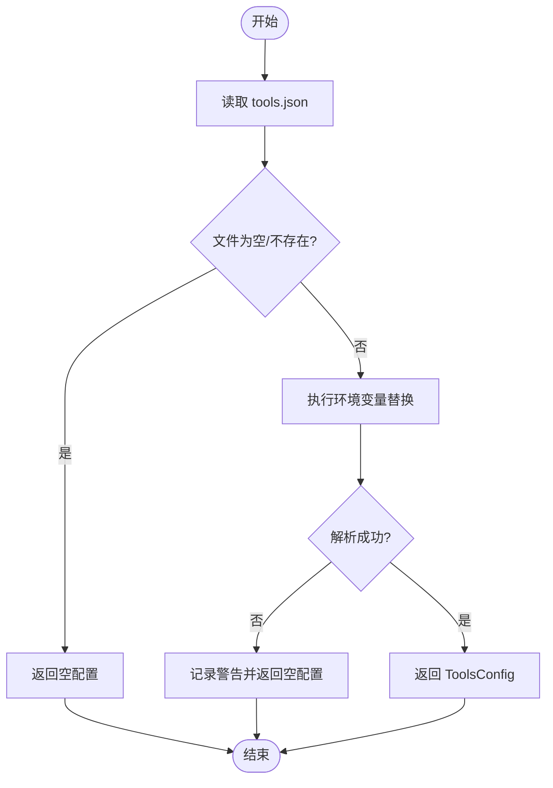
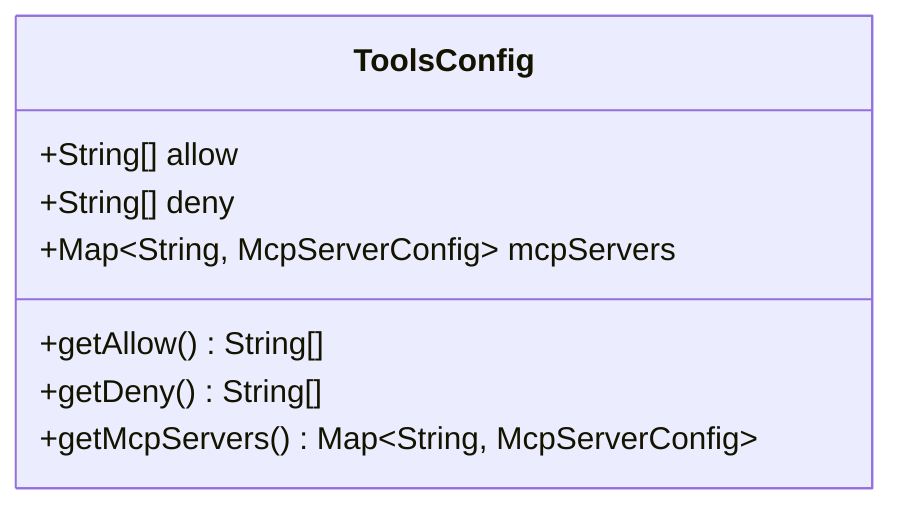
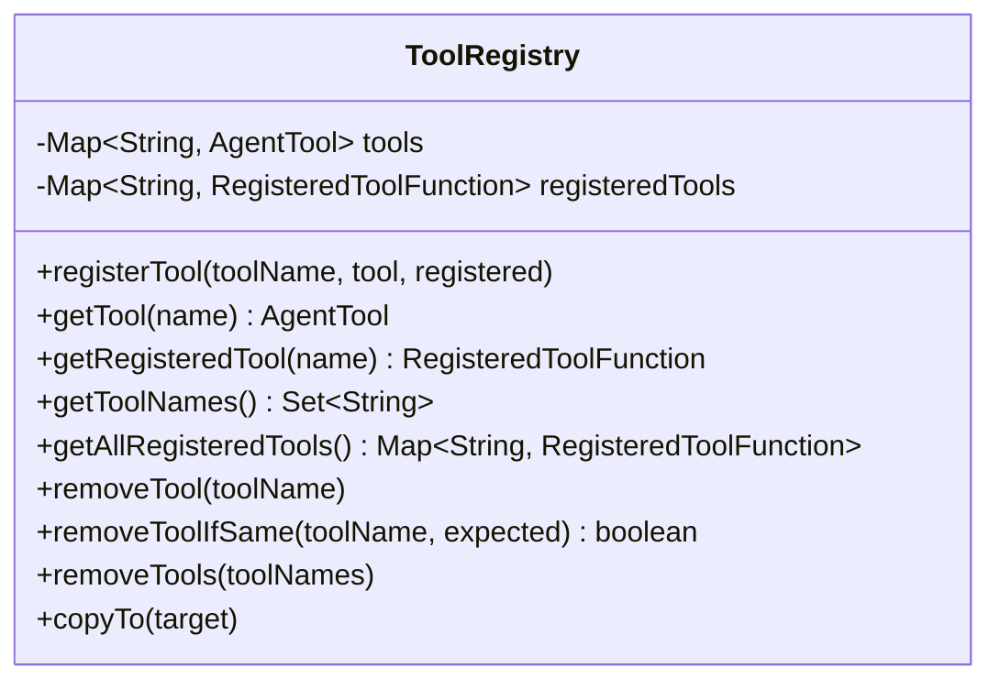
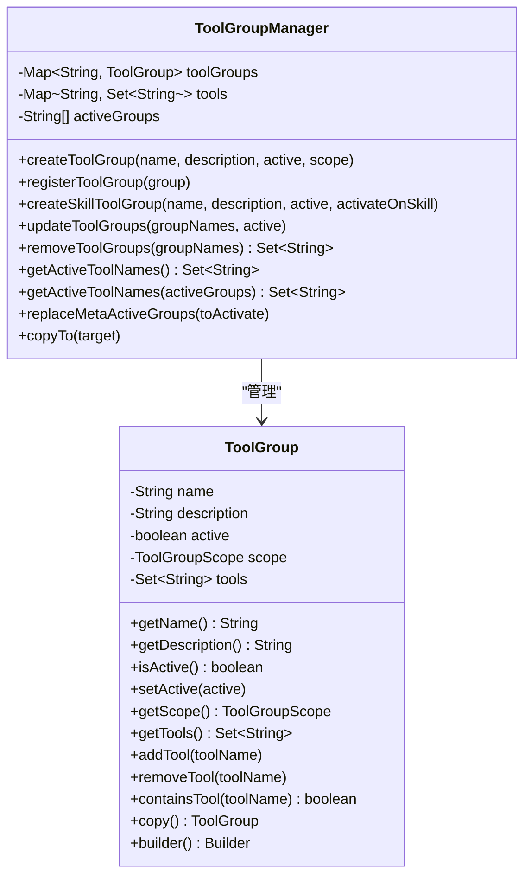
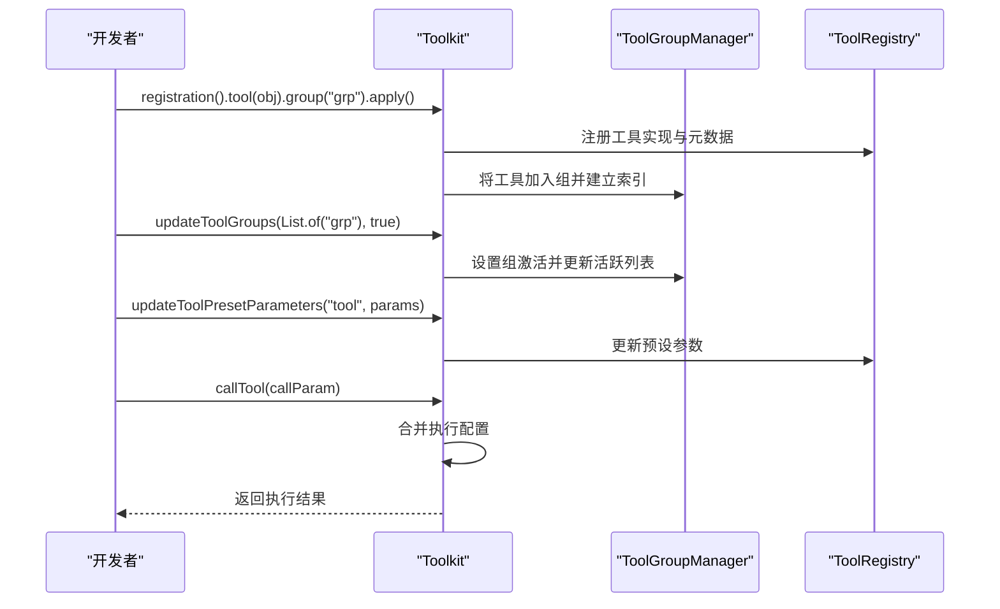
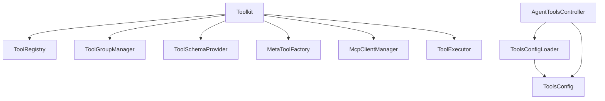

# 工具配置管理

<cite>
**本文档引用的文件**
- [Toolkit.java](file://agentscope-core/src/main/java/io/agentscope/core/tool/Toolkit.java)
- [ToolRegistry.java](file://agentscope-core/src/main/java/io/agentscope/core/tool/ToolRegistry.java)
- [ToolGroup.java](file://agentscope-core/src/main/java/io/agentscope/core/tool/ToolGroup.java)
- [ToolGroupManager.java](file://agentscope-core/src/main/java/io/agentscope/core/tool/ToolGroupManager.java)
- [ToolkitConfig.java](file://agentscope-core/src/main/java/io/agentscope/core/tool/ToolkitConfig.java)
- [ToolGroupScope.java](file://agentscope-core/src/main/java/io/agentscope/core/tool/ToolGroupScope.java)
- [ToolsConfigLoader.java](file://agentscope-harness/src/main/java/io/agentscope/harness/agent/tools/ToolsConfigLoader.java)
- [ToolsConfig.java](file://agentscope-harness/src/main/java/io/agentscope/harness/agent/tools/ToolsConfig.java)
- [AgentToolsController.java](file://agentscope-examples/agents/agentscope-builder/src/main/java/io/agentscope/builder/web/api/AgentToolsController.java)
- [agent-config.md](file://docs/v1/en/docs/task/agent-config.md)
- [agent-config.md](file://docs/v1/zh/docs/task/agent-config.md)
</cite>

## 目录
1. [简介](#简介)
2. [项目结构](#项目结构)
3. [核心组件](#核心组件)
4. [架构总览](#架构总览)
5. [详细组件分析](#详细组件分析)
6. [依赖关系分析](#依赖关系分析)
7. [性能考虑](#性能考虑)
8. [故障排除指南](#故障排除指南)
9. [结论](#结论)
10. [附录](#附录)

## 简介
本文件面向工具配置管理系统，围绕以下目标展开：  
- 工具配置加载（ToolsConfigLoader）：从工作空间读取 tools.json，支持环境变量替换与容错处理。  
- 工具注册表（ToolRegistry）：维护工具名称到实现的映射及注册元数据，支持动态增删改查与深拷贝。  
- 工具组管理（ToolGroup 与 ToolGroupManager）：对工具进行分组、激活状态管理、组内工具索引与可见性控制。  
- 工具配置文件格式、动态加载机制与配置验证规则。  
- 工具组的创建、管理与使用：过滤、权限控制与生命周期管理。  
- 运行时动态添加、移除与修改工具配置：支持配置热更新与版本管理方案。

## 项目结构
工具配置管理涉及核心框架与示例/扩展模块：
- 核心框架（agentscope-core）：提供 Toolkit、ToolRegistry、ToolGroup、ToolGroupManager、ToolkitConfig 等核心能力。
- 工作空间配置（agentscope-harness）：提供 ToolsConfigLoader 与 ToolsConfig，用于从 workspace/tools.json 加载工具配置。
- 示例与集成（agentscope-examples）：提供前端控制器示例，演示工具配置的读写与视图生成。
- 文档示例（docs）：提供完整的工具配置与工具组使用示例，便于理解 API 的实际应用。

**图表来源**
- [Toolkit.java:66-117](file://agentscope-core/src/main/java/io/agentscope/core/tool/Toolkit.java#L66-L117)
- [ToolRegistry.java:40-58](file://agentscope-core/src/main/java/io/agentscope/core/tool/ToolRegistry.java#L40-L58)
- [ToolGroupManager.java:32-84](file://agentscope-core/src/main/java/io/agentscope/core/tool/ToolGroupManager.java#L32-L84)
- [ToolkitConfig.java:32-46](file://agentscope-core/src/main/java/io/agentscope/core/tool/ToolkitConfig.java#L32-L46)
- [ToolsConfigLoader.java:41-89](file://agentscope-harness/src/main/java/io/agentscope/harness/agent/tools/ToolsConfigLoader.java#L41-L89)
- [ToolsConfig.java:41-77](file://agentscope-harness/src/main/java/io/agentscope/harness/agent/tools/ToolsConfig.java#L41-L77)
- [AgentToolsController.java:192-216](file://agentscope-examples/agents/agentscope-builder/src/main/java/io/agentscope/builder/web/api/AgentToolsController.java#L192-L216)
- [agent-config.md:474-771](file://docs/v1/en/docs/task/agent-config.md#L474-L771)
- [agent-config.md:474-765](file://docs/v1/zh/docs/task/agent-config.md#L474-L765)

**章节来源**
- [Toolkit.java:66-117](file://agentscope-core/src/main/java/io/agentscope/core/tool/Toolkit.java#L66-L117)
- [ToolsConfigLoader.java:41-89](file://agentscope-harness/src/main/java/io/agentscope/harness/agent/tools/ToolsConfigLoader.java#L41-L89)

## 核心组件
- 工具门面（Toolkit）：对外统一入口，聚合注册表、组管理、模式生成、MCP 管理、执行器等子系统，提供注册、执行、组管理、元工具等能力。
- 工具注册表（ToolRegistry）：线程安全存储工具实现与注册元数据，支持按名检索、批量删除、原子删除与深拷贝。
- 工具组（ToolGroup）：封装组名、描述、激活状态、作用域与工具集合，提供构建器与深拷贝。
- 工具组管理器（ToolGroupManager）：维护组与工具的双向索引、活跃组列表、组级过滤与可见性判断。
- 工具集配置（ToolkitConfig）：控制并发执行、自定义执行器、默认执行配置与是否允许删除工具。
- 工具组作用域（ToolGroupScope）：区分 META（由代理管理）与 EXTERNAL（开发者管理）两类组。
- 配置加载器（ToolsConfigLoader）：从工作空间读取 tools.json，执行环境变量替换，解析为 ToolsConfig。
- 工具配置（ToolsConfig）：定义 allow/deny 过滤与 MCP 服务器配置字段。

**章节来源**
- [Toolkit.java:66-117](file://agentscope-core/src/main/java/io/agentscope/core/tool/Toolkit.java#L66-L117)
- [ToolRegistry.java:40-58](file://agentscope-core/src/main/java/io/agentscope/core/tool/ToolRegistry.java#L40-L58)
- [ToolGroup.java:42-70](file://agentscope-core/src/main/java/io/agentscope/core/tool/ToolGroup.java#L42-L70)
- [ToolGroupManager.java:32-84](file://agentscope-core/src/main/java/io/agentscope/core/tool/ToolGroupManager.java#L32-L84)
- [ToolkitConfig.java:32-46](file://agentscope-core/src/main/java/io/agentscope/core/tool/ToolkitConfig.java#L32-L46)
- [ToolGroupScope.java](file://agentscope-core/src/main/java/io/agentscope/core/tool/ToolGroupScope.java)
- [ToolsConfigLoader.java:41-89](file://agentscope-harness/src/main/java/io/agentscope/harness/agent/tools/ToolsConfigLoader.java#L41-L89)
- [ToolsConfig.java:41-77](file://agentscope-harness/src/main/java/io/agentscope/harness/agent/tools/ToolsConfig.java#L41-L77)

## 架构总览
下图展示工具配置管理的端到端流程：从工作空间加载配置，到工具注册与组管理，再到运行时动态变更与执行。

**图表来源**
- [ToolsConfigLoader.java:57-89](file://agentscope-harness/src/main/java/io/agentscope/harness/agent/tools/ToolsConfigLoader.java#L57-L89)
- [ToolsConfig.java:41-77](file://agentscope-harness/src/main/java/io/agentscope/harness/agent/tools/ToolsConfig.java#L41-L77)
- [AgentToolsController.java:192-216](file://agentscope-examples/agents/agentscope-builder/src/main/java/io/agentscope/builder/web/api/AgentToolsController.java#L192-L216)
- [Toolkit.java:633-641](file://agentscope-core/src/main/java/io/agentscope/core/tool/Toolkit.java#L633-L641)
- [ToolRegistry.java:52-58](file://agentscope-core/src/main/java/io/agentscope/core/tool/ToolRegistry.java#L52-L58)
- [ToolGroupManager.java:148-168](file://agentscope-core/src/main/java/io/agentscope/core/tool/ToolGroupManager.java#L148-L168)

## 详细组件分析

### 工具配置加载器（ToolsConfigLoader）
- 职责：从工作空间读取 tools.json，执行环境变量替换，反序列化为 ToolsConfig；对缺失、不可读或解析失败的情况进行容错处理。
- 关键行为：
  - 通过 WorkspaceManager 读取受控路径文件，确保沙箱/远程文件系统的兼容性。
  - 对 ${VAR} 形式的环境变量进行替换，未设置变量会记录警告并替换为空字符串。
  - 解析失败时返回空值，保证代理仍能以默认工具集启动。
- 错误处理：日志记录读取异常与解析异常，不抛出异常影响主流程。

**图表来源**
- [ToolsConfigLoader.java:57-89](file://agentscope-harness/src/main/java/io/agentscope/harness/agent/tools/ToolsConfigLoader.java#L57-L89)
- [ToolsConfigLoader.java:96-116](file://agentscope-harness/src/main/java/io/agentscope/harness/agent/tools/ToolsConfigLoader.java#L96-L116)

**章节来源**
- [ToolsConfigLoader.java:41-89](file://agentscope-harness/src/main/java/io/agentscope/harness/agent/tools/ToolsConfigLoader.java#L41-L89)
- [ToolsConfigLoader.java:96-116](file://agentscope-harness/src/main/java/io/agentscope/harness/agent/tools/ToolsConfigLoader.java#L96-L116)

### 工具配置（ToolsConfig）
- 字段与语义：
  - allow：白名单，仅保留出现在该列表中的工具。
  - deny：黑名单，优先于 allow 生效。
  - mcpServers：声明外部 MCP 服务器及其工具授权列表。
- 解析策略：忽略未知字段；当 allow 为空时视为不限制；deny 为空时视为无屏蔽。

**图表来源**
- [ToolsConfig.java:41-77](file://agentscope-harness/src/main/java/io/agentscope/harness/agent/tools/ToolsConfig.java#L41-L77)

**章节来源**
- [ToolsConfig.java:25-38](file://agentscope-harness/src/main/java/io/agentscope/harness/agent/tools/ToolsConfig.java#L25-L38)
- [ToolsConfig.java:41-77](file://agentscope-harness/src/main/java/io/agentscope/harness/agent/tools/ToolsConfig.java#L41-L77)

### 工具注册表（ToolRegistry）
- 职责：维护工具名称到实现的映射与注册元数据，支持动态增删改查与深拷贝。
- 并发特性：内部使用并发容器，支持多线程注册与查找。
- 关键方法：注册、按名获取、获取全部注册元数据、删除单个/多个、原子删除、深拷贝。

**图表来源**
- [ToolRegistry.java:40-58](file://agentscope-core/src/main/java/io/agentscope/core/tool/ToolRegistry.java#L40-L58)
- [ToolRegistry.java:109-131](file://agentscope-core/src/main/java/io/agentscope/core/tool/ToolRegistry.java#L109-L131)

**章节来源**
- [ToolRegistry.java:23-38](file://agentscope-core/src/main/java/io/agentscope/core/tool/ToolRegistry.java#L23-L38)
- [ToolRegistry.java:52-58](file://agentscope-core/src/main/java/io/agentscope/core/tool/ToolRegistry.java#L52-L58)
- [ToolRegistry.java:109-131](file://agentscope-core/src/main/java/io/agentscope/core/tool/ToolRegistry.java#L109-L131)

### 工具组与工具组管理器（ToolGroup 与 ToolGroupManager）
- ToolGroup：封装组名、描述、激活状态、作用域与工具集合，提供构建器与深拷贝。
- ToolGroupManager：维护组与工具的双向索引、活跃组列表、组级过滤与可见性判断。
- 关键能力：
  - 创建/注册组（含 META/EXTERNAL 作用域）、创建技能绑定组、更新激活状态、删除组并回收工具。
  - 判断工具是否处于活跃组、是否被分组、获取活跃工具名集合、按传入激活组集合计算工具表面。
  - 替换 META 组的活跃集合、复制组状态到目标管理器。

**图表来源**
- [ToolGroup.java:42-70](file://agentscope-core/src/main/java/io/agentscope/core/tool/ToolGroup.java#L42-L70)
- [ToolGroup.java:163-171](file://agentscope-core/src/main/java/io/agentscope/core/tool/ToolGroup.java#L163-L171)
- [ToolGroupManager.java:32-84](file://agentscope-core/src/main/java/io/agentscope/core/tool/ToolGroupManager.java#L32-L84)
- [ToolGroupManager.java:148-168](file://agentscope-core/src/main/java/io/agentscope/core/tool/ToolGroupManager.java#L148-L168)
- [ToolGroupManager.java:381-415](file://agentscope-core/src/main/java/io/agentscope/core/tool/ToolGroupManager.java#L381-L415)

**章节来源**
- [ToolGroup.java:22-41](file://agentscope-core/src/main/java/io/agentscope/core/tool/ToolGroup.java#L22-L41)
- [ToolGroup.java:163-171](file://agentscope-core/src/main/java/io/agentscope/core/tool/ToolGroup.java#L163-L171)
- [ToolGroupManager.java:148-168](file://agentscope-core/src/main/java/io/agentscope/core/tool/ToolGroupManager.java#L148-L168)
- [ToolGroupManager.java:381-415](file://agentscope-core/src/main/java/io/agentscope/core/tool/ToolGroupManager.java#L381-L415)

### 工具集配置（ToolkitConfig）
- 控制项：
  - 并发执行开关（parallel）
  - 自定义执行器（executorService）
  - 默认执行配置（executionConfig）
  - 是否允许删除工具（allowToolDeletion）
  - 默认执行上下文（默认弃用）
- 用途：决定工具执行策略、超时与重试行为、是否允许运行时删除工具。

**章节来源**
- [ToolkitConfig.java:32-46](file://agentscope-core/src/main/java/io/agentscope/core/tool/ToolkitConfig.java#L32-L46)
- [ToolkitConfig.java:118-120](file://agentscope-core/src/main/java/io/agentscope/core/tool/ToolkitConfig.java#L118-L120)

### 工具门面（Toolkit）与运行时动态管理
- 注册与执行：
  - 支持扫描注解工具、直接注册 AgentTool、注册 MCP 客户端与子代理工具。
  - 提供工具执行入口（单个/多个），合并多层执行配置（工具集默认 + 代理层 + 系统默认）。
- 组管理：
  - 创建/注册组、更新激活状态、删除工具/组、设置活跃组集合、获取活跃组列表。
  - 元工具：提供 reset_equipped_tools 动态切换工具组的能力。
- 运行时修改：
  - 更新工具预设参数（无需重新注册）。
  - 深拷贝工具集以隔离状态。

**图表来源**
- [Toolkit.java:146-148](file://agentscope-core/src/main/java/io/agentscope/core/tool/Toolkit.java#L146-L148)
- [Toolkit.java:154-197](file://agentscope-core/src/main/java/io/agentscope/core/tool/Toolkit.java#L154-L197)
- [Toolkit.java:633-641](file://agentscope-core/src/main/java/io/agentscope/core/tool/Toolkit.java#L633-L641)
- [Toolkit.java:752-760](file://agentscope-core/src/main/java/io/agentscope/core/tool/Toolkit.java#L752-L760)
- [Toolkit.java:490-525](file://agentscope-core/src/main/java/io/agentscope/core/tool/Toolkit.java#L490-L525)

**章节来源**
- [Toolkit.java:146-197](file://agentscope-core/src/main/java/io/agentscope/core/tool/Toolkit.java#L146-L197)
- [Toolkit.java:633-641](file://agentscope-core/src/main/java/io/agentscope/core/tool/Toolkit.java#L633-L641)
- [Toolkit.java:752-760](file://agentscope-core/src/main/java/io/agentscope/core/tool/Toolkit.java#L752-L760)
- [Toolkit.java:490-525](file://agentscope-core/src/main/java/io/agentscope/core/tool/Toolkit.java#L490-L525)

### 工具配置文件格式、动态加载与验证规则
- 文件位置：workspace/tools.json
- 字段说明：
  - allow：白名单，仅保留出现在该列表中的工具。
  - deny：黑名单，优先于 allow 生效。
  - mcpServers：键为 MCP 服务器标识，值为连接与工具授权配置。
- 加载与替换：
  - 读取后执行环境变量替换（${VAR} → System.getenv(VAR)），未设置变量记录警告并替换为空字符串。
  - 解析失败返回空配置，不影响代理启动。
- 验证规则：
  - allow/deny 为空表示无过滤。
  - mcpServers 为空表示不引入外部工具。
  - 未知字段忽略。

**章节来源**
- [ToolsConfig.java:25-38](file://agentscope-harness/src/main/java/io/agentscope/harness/agent/tools/ToolsConfig.java#L25-L38)
- [ToolsConfigLoader.java:96-116](file://agentscope-harness/src/main/java/io/agentscope/harness/agent/tools/ToolsConfigLoader.java#L96-L116)
- [ToolsConfigLoader.java:78-88](file://agentscope-harness/src/main/java/io/agentscope/harness/agent/tools/ToolsConfigLoader.java#L78-L88)

### 工具组的创建、管理与使用（过滤、权限控制、生命周期）
- 创建与注册：
  - createToolGroup/createSkillToolGroup/registerToolGroup 支持 META/EXTERNAL 作用域。
  - 技能绑定组会在描述中提示使用时需激活。
- 权限与可见性：
  - 仅活跃组内的工具对代理可见；未分组工具默认可见。
  - isActiveTool/isGroupedTool 提供工具级可见性判断。
- 生命周期：
  - 更新激活状态（updateToolGroups）；删除组（removeToolGroups）并回收工具；设置活跃组（setActiveGroups）用于状态恢复。
- 运行时控制：
  - 元工具 reset_equipped_tools 动态切换工具组。
  - 允许运行时更新预设参数，无需重新注册。

**章节来源**
- [ToolGroupManager.java:129-139](file://agentscope-core/src/main/java/io/agentscope/core/tool/ToolGroupManager.java#L129-L139)
- [ToolGroupManager.java:286-330](file://agentscope-core/src/main/java/io/agentscope/core/tool/ToolGroupManager.java#L286-L330)
- [Toolkit.java:732-739](file://agentscope-core/src/main/java/io/agentscope/core/tool/Toolkit.java#L732-L739)
- [Toolkit.java:752-760](file://agentscope-core/src/main/java/io/agentscope/core/tool/Toolkit.java#L752-L760)

### 在运行时动态添加、移除与修改工具配置
- 添加：
  - registration().tool()/agentTool()/mcpClient()...apply() 注册新工具或 MCP 客户端。
- 移除：
  - removeTool/removeToolIfSame：删除工具（受 allowToolDeletion 限制）。
  - removeToolGroups：删除组并回收其工具。
- 修改：
  - updateToolPresetParameters：动态更新预设参数。
  - updateToolGroups：切换组激活状态。
- 热更新与版本管理建议：
  - 热更新：通过 registration 与 updateToolPresetParameters 实现，避免重启。
  - 版本管理：在工具实现层面维护版本号与兼容性检查，结合 allow/deny 控制灰度发布。

**章节来源**
- [Toolkit.java:648-688](file://agentscope-core/src/main/java/io/agentscope/core/tool/Toolkit.java#L648-L688)
- [Toolkit.java:752-760](file://agentscope-core/src/main/java/io/agentscope/core/tool/Toolkit.java#L752-L760)
- [Toolkit.java:633-641](file://agentscope-core/src/main/java/io/agentscope/core/tool/Toolkit.java#L633-L641)

### 前端控制器示例：工具配置读写与视图生成
- 视图生成：根据 tools.json 的 allow/deny 与内置工具列表生成“可激活工具”视图。
- 写入配置：解析请求体为 ToolsConfig，记录活动并持久化到 tools.json。
- 容错：读取/解析失败时返回空配置并记录日志。

**章节来源**
- [AgentToolsController.java:192-216](file://agentscope-examples/agents/agentscope-builder/src/main/java/io/agentscope/builder/web/api/AgentToolsController.java#L192-L216)
- [AgentToolsController.java:257-277](file://agentscope-examples/agents/agentscope-builder/src/main/java/io/agentscope/builder/web/api/AgentToolsController.java#L257-L277)
- [AgentToolsController.java:280-289](file://agentscope-examples/agents/agentscope-builder/src/main/java/io/agentscope/builder/web/api/AgentToolsController.java#L280-L289)

## 依赖关系分析
- Toolkit 依赖 ToolRegistry、ToolGroupManager、ToolSchemaProvider、MetaToolFactory、McpClientManager、ToolExecutor 等子系统。
- ToolGroupManager 维护 ToolGroup 与工具的双向索引，支撑工具可见性与组激活状态。
- ToolsConfigLoader 与 ToolsConfig 协作，提供工作空间级别的工具配置输入。
- AgentToolsController 作为示例，演示 tools.json 的读取与写入流程。

**图表来源**
- [Toolkit.java:70-78](file://agentscope-core/src/main/java/io/agentscope/core/tool/Toolkit.java#L70-L78)
- [ToolsConfigLoader.java:41-89](file://agentscope-harness/src/main/java/io/agentscope/harness/agent/tools/ToolsConfigLoader.java#L41-L89)
- [AgentToolsController.java:192-216](file://agentscope-examples/agents/agentscope-builder/src/main/java/io/agentscope/builder/web/api/AgentToolsController.java#L192-L216)

**章节来源**
- [Toolkit.java:70-78](file://agentscope-core/src/main/java/io/agentscope/core/tool/Toolkit.java#L70-L78)

## 性能考虑
- 并发安全：ToolRegistry 与 ToolGroupManager 使用并发容器，适合高并发注册与查询场景。
- 执行策略：ToolkitConfig 支持并行执行与自定义执行器，合理配置可提升吞吐量。
- 深拷贝：Toolkit.copy() 保留用户回调，减少重复初始化开销。
- 热更新：通过预设参数更新与组状态切换实现，避免全量重启带来的抖动。

## 故障排除指南
- 配置加载失败：
  - 症状：tools.json 读取异常或解析失败。
  - 排查：查看日志中关于读取与解析的警告；确认文件路径与权限；检查环境变量是否正确设置。
- 工具不可见：
  - 症状：模型无法看到某些工具。
  - 排查：确认工具所属组是否激活；检查 allow/deny 过滤；确认工具未被删除。
- 删除操作无效：
  - 症状：调用 removeTool/removeToolGroups 后工具仍存在。
  - 排查：检查 ToolkitConfig.allowToolDeletion 是否为 true；若为 false，删除会被忽略。
- MCP 工具未生效：
  - 症状：mcpServers 配置未产生效果。
  - 排查：确认 MCP 客户端已注册；检查工具授权列表与组绑定。

**章节来源**
- [ToolsConfigLoader.java:66-88](file://agentscope-harness/src/main/java/io/agentscope/harness/agent/tools/ToolsConfigLoader.java#L66-L88)
- [ToolkitConfig.java:177-180](file://agentscope-core/src/main/java/io/agentscope/core/tool/ToolkitConfig.java#L177-L180)
- [Toolkit.java:633-641](file://agentscope-core/src/main/java/io/agentscope/core/tool/Toolkit.java#L633-L641)

## 结论
工具配置管理系统通过 ToolsConfigLoader 与 ToolsConfig 提供工作空间级配置输入，借助 Toolkit、ToolRegistry 与 ToolGroupManager 实现工具的注册、分组、激活与动态管理。配合 ToolsConfig 的 allow/deny 过滤与 MCP 支持，系统实现了灵活的工具可见性控制与运行时热更新能力。推荐在生产环境中结合版本管理与灰度策略，确保配置变更的安全与可控。

## 附录
- 完整示例参考：英文与中文的综合配置示例文档，涵盖工具组创建、工具注册、执行策略与钩子配置等。

**章节来源**
- [agent-config.md:474-771](file://docs/v1/en/docs/task/agent-config.md#L474-L771)
- [agent-config.md:474-765](file://docs/v1/zh/docs/task/agent-config.md#L474-L765)