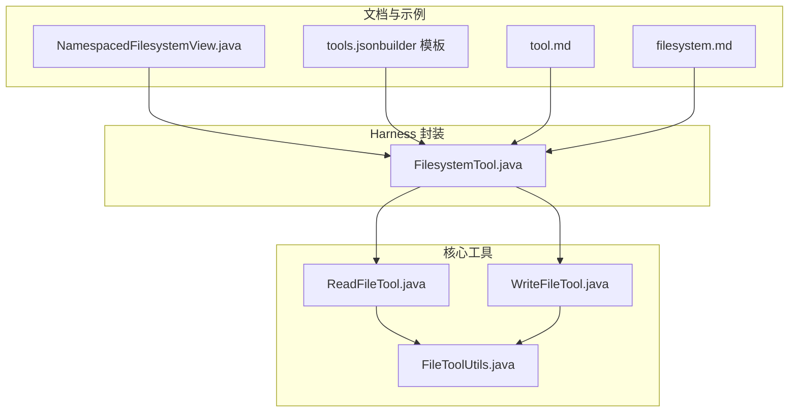
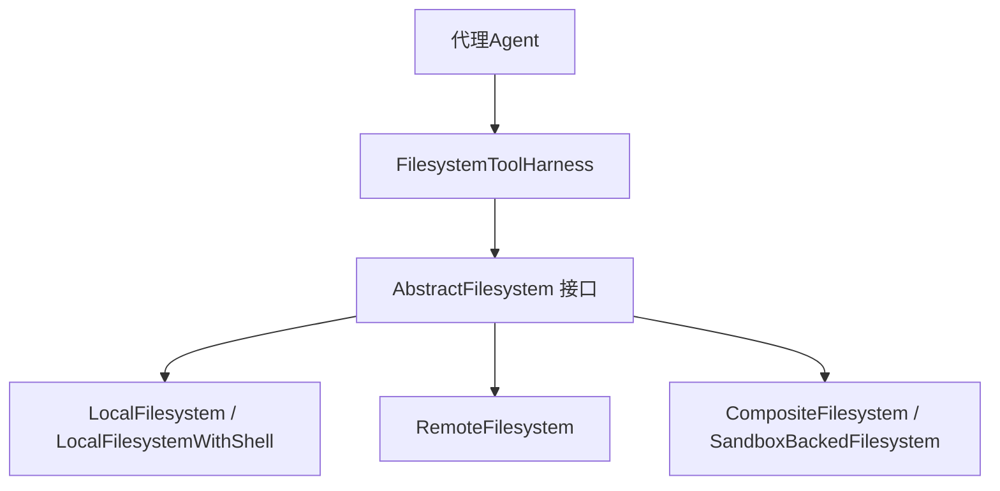
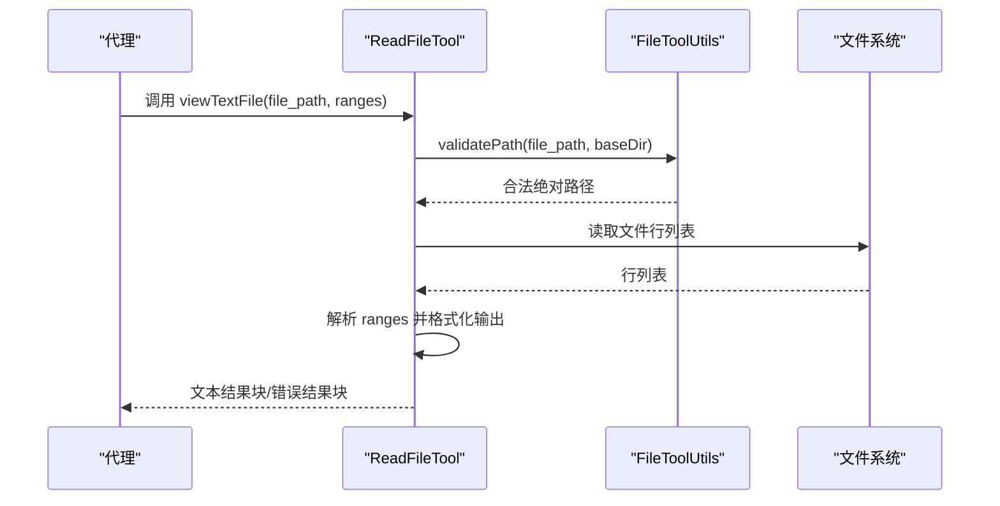
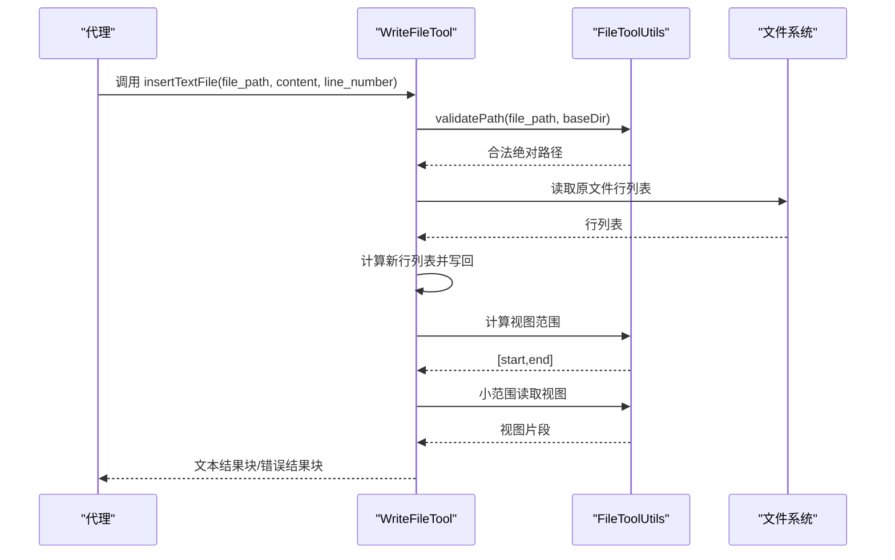
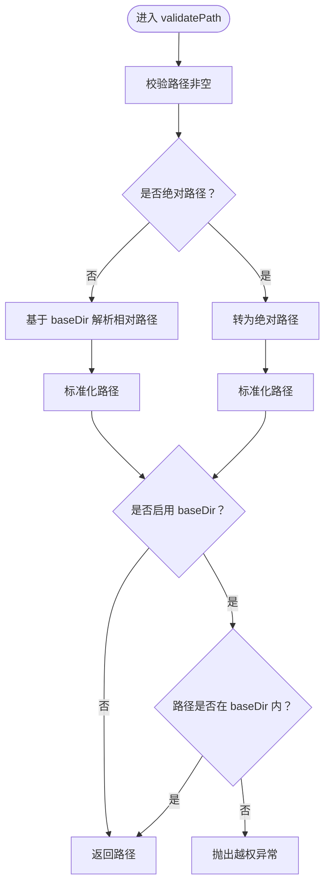
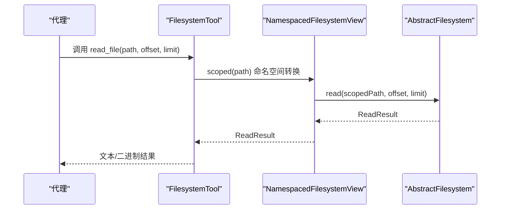
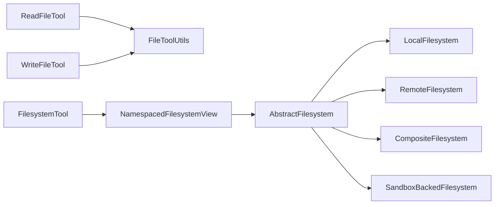

# 文件系统工具

<cite>
**本文引用的文件**
- [ReadFileTool.java](file://agentscope-core/src/main/java/io/agentscope/core/tool/file/ReadFileTool.java)
- [WriteFileTool.java](file://agentscope-core/src/main/java/io/agentscope/core/tool/file/WriteFileTool.java)
- [FileToolUtils.java](file://agentscope-core/src/main/java/io/agentscope/core/tool/file/FileToolUtils.java)
- [FilesystemTool.java](file://agentscope-harness/src/main/java/io/agentscope/harness/agent/tool/FilesystemTool.java)
- [filesystem.md](file://docs/v1/en/docs/harness/filesystem.md)
- [tool.md](file://docs/v1/en/docs/harness/tool.md)
- [NamespacedFilesystemView.java](file://agentscope-examples/agents/agentscope-builder/src/main/java/io/agentscope/builder/web/workspace/NamespacedFilesystemView.java)
- [tools.json（builder 模板）](file://agentscope-examples/agents/agentscope-builder/src/main/resources/scaffold/default/tools.json)
</cite>

## 目录
1. [简介](#简介)
2. [项目结构](#项目结构)
3. [核心组件](#核心组件)
4. [架构总览](#架构总览)
5. [详细组件分析](#详细组件分析)
6. [依赖关系分析](#依赖关系分析)
7. [性能考量](#性能考量)
8. [故障排查指南](#故障排查指南)
9. [结论](#结论)
10. [附录](#附录)

## 简介
本文件系统工具文档面向在代理中使用文件系统能力的开发者与使用者，聚焦以下能力的接口规范与最佳实践：
- 文件读取（read_file）
- 文件写入（write_file）
- 文件编辑（edit_file）
- 文件搜索（grep_files）
- 文件匹配（glob_files）
- 目录列表（list_files）

同时，文档覆盖参数说明、返回值格式、错误处理机制，并结合仓库中的工具实现与文档，给出路径规范化、权限控制与异常处理的最佳实践。

## 项目结构
围绕文件系统工具，相关代码分布在如下模块与文件：
- 核心工具实现（文本文件读写与范围视图）：ReadFileTool、WriteFileTool、FileToolUtils
- 外层工具封装（Harness FilesystemTool）：FilesystemTool
- 文档与示例：filesystem.md、tool.md、NamespacedFilesystemView、tools.json

**图表来源**
- [ReadFileTool.java:1-357](file://agentscope-core/src/main/java/io/agentscope/core/tool/file/ReadFileTool.java#L1-L357)
- [WriteFileTool.java:1-406](file://agentscope-core/src/main/java/io/agentscope/core/tool/file/WriteFileTool.java#L1-L406)
- [FileToolUtils.java:1-161](file://agentscope-core/src/main/java/io/agentscope/core/tool/file/FileToolUtils.java#L1-L161)
- [FilesystemTool.java](file://agentscope-harness/src/main/java/io/agentscope/harness/agent/tool/FilesystemTool.java)
- [filesystem.md:1-162](file://docs/v1/en/docs/harness/filesystem.md#L1-L162)
- [tool.md:23-51](file://docs/v1/en/docs/harness/tool.md#L23-L51)
- [NamespacedFilesystemView.java:63-132](file://agentscope-examples/agents/agentscope-builder/src/main/java/io/agentscope/builder/web/workspace/NamespacedFilesystemView.java#L63-L132)
- [tools.json（builder 模板）:1-13](file://agentscope-examples/agents/agentscope-builder/src/main/resources/scaffold/default/tools.json#L1-L13)

**章节来源**
- [ReadFileTool.java:1-357](file://agentscope-core/src/main/java/io/agentscope/core/tool/file/ReadFileTool.java#L1-L357)
- [WriteFileTool.java:1-406](file://agentscope-core/src/main/java/io/agentscope/core/tool/file/WriteFileTool.java#L1-L406)
- [FileToolUtils.java:1-161](file://agentscope-core/src/main/java/io/agentscope/core/tool/file/FileToolUtils.java#L1-L161)
- [FilesystemTool.java](file://agentscope-harness/src/main/java/io/agentscope/harness/agent/tool/FilesystemTool.java)
- [filesystem.md:1-162](file://docs/v1/en/docs/harness/filesystem.md#L1-L162)
- [tool.md:23-51](file://docs/v1/en/docs/harness/tool.md#L23-L51)
- [NamespacedFilesystemView.java:63-132](file://agentscope-examples/agents/agentscope-builder/src/main/java/io/agentscope/builder/web/workspace/NamespacedFilesystemView.java#L63-L132)
- [tools.json（builder 模板）:1-13](file://agentscope-examples/agents/agentscope-builder/src/main/resources/scaffold/default/tools.json#L1-L13)

## 核心组件
- ReadFileTool：提供文本文件查看、指定行范围查看、末尾行查看、目录列表等能力；支持基于 baseDir 的路径限制，防止越权访问。
- WriteFileTool：提供插入内容（按行号）、写入/覆盖（可指定行范围）能力；对新建文件自动创建父目录；提供修改前后视图片段。
- FileToolUtils：提供路径校验（防穿越）、范围解析、视图计算、小范围读取等通用方法。
- FilesystemTool（Harness）：对外统一的文件系统工具入口，封装底层抽象文件系统（AbstractFilesystem），暴露 read_file、write_file、edit_file、grep_files、glob_files、list_files 等工具。

**章节来源**
- [ReadFileTool.java:33-47](file://agentscope-core/src/main/java/io/agentscope/core/tool/file/ReadFileTool.java#L33-L47)
- [WriteFileTool.java:31-42](file://agentscope-core/src/main/java/io/agentscope/core/tool/file/WriteFileTool.java#L31-L42)
- [FileToolUtils.java:25-32](file://agentscope-core/src/main/java/io/agentscope/core/tool/file/FileToolUtils.java#L25-L32)
- [FilesystemTool.java](file://agentscope-harness/src/main/java/io/agentscope/harness/agent/tool/FilesystemTool.java)

## 架构总览
文件系统工具在系统中的位置与交互如下：

**图表来源**
- [filesystem.md:40-74](file://docs/v1/en/docs/harness/filesystem.md#L40-L74)
- [tool.md:23-51](file://docs/v1/en/docs/harness/tool.md#L23-L51)

**章节来源**
- [filesystem.md:1-162](file://docs/v1/en/docs/harness/filesystem.md#L1-L162)
- [tool.md:23-51](file://docs/v1/en/docs/harness/tool.md#L23-L51)

## 详细组件分析

### ReadFileTool（文件读取与目录列表）
- 能力概览
  - 视图文本文件：支持整文件、指定行范围、负索引（从末尾计数）。
  - 目录列表：列出指定目录下的文件与子目录，返回绝对路径。
- 关键参数
  - viewTextFile
    - file_path：目标文件路径
    - ranges：行范围，形如 "start,end" 或 "[start,end]"，支持负索引
  - listDirectory
    - dir_path：目标目录路径
- 返回值
  - 成功：文本结果块，包含格式化的文件内容或目录列表
  - 失败：错误结果块，包含错误信息
- 错误处理
  - 路径校验失败、文件不存在、路径不是文件、范围格式非法、范围越界、IO 异常等均返回错误结果
- 安全与权限
  - 支持 baseDir 限制，相对路径将基于 baseDir 解析，防止路径穿越

**图表来源**
- [ReadFileTool.java:89-215](file://agentscope-core/src/main/java/io/agentscope/core/tool/file/ReadFileTool.java#L89-L215)
- [FileToolUtils.java:49-79](file://agentscope-core/src/main/java/io/agentscope/core/tool/file/FileToolUtils.java#L49-L79)

**章节来源**
- [ReadFileTool.java:89-215](file://agentscope-core/src/main/java/io/agentscope/core/tool/file/ReadFileTool.java#L89-L215)
- [FileToolUtils.java:49-79](file://agentscope-core/src/main/java/io/agentscope/core/tool/file/FileToolUtils.java#L49-L79)

### WriteFileTool（文件写入与插入）
- 能力概览
  - 插入内容：在指定行号插入一行内容，超出文件长度则追加到末尾
  - 写入/覆盖：可选择性地替换指定行范围，或整文件覆盖；新建文件时自动创建父目录
- 关键参数
  - insertTextFile
    - file_path：目标文件路径
    - content：要插入的内容
    - line_number：插入行号（从 1 开始）
  - writeTextFile
    - file_path：目标文件路径
    - content：要写入的内容
    - ranges：可选，行范围 "[start,end]" 或 "start,end"
- 返回值
  - 成功：文本结果块，包含操作成功提示与视图片段
  - 失败：错误结果块，包含错误信息
- 错误处理
  - 行号非法、路径校验失败、文件不存在、范围格式非法、起始行越界、IO 异常等均返回错误结果
- 安全与权限
  - 支持 baseDir 限制，相对路径基于 baseDir 解析

**图表来源**
- [WriteFileTool.java:91-224](file://agentscope-core/src/main/java/io/agentscope/core/tool/file/WriteFileTool.java#L91-L224)
- [FileToolUtils.java:91-134](file://agentscope-core/src/main/java/io/agentscope/core/tool/file/FileToolUtils.java#L91-L134)

**章节来源**
- [WriteFileTool.java:91-224](file://agentscope-core/src/main/java/io/agentscope/core/tool/file/WriteFileTool.java#L91-L224)
- [FileToolUtils.java:91-134](file://agentscope-core/src/main/java/io/agentscope/core/tool/file/FileToolUtils.java#L91-L134)

### FileToolUtils（工具辅助）
- 路径校验 validatePath
  - 输入：文件路径、baseDir
  - 行为：相对路径基于 baseDir 解析；绝对路径或无 baseDir 时转为绝对路径；若启用 baseDir，确保最终路径位于 baseDir 内
  - 输出：标准化后的绝对路径
  - 异常：路径为空、越权访问时抛出 IO 异常
- 视图范围计算 calculateViewRanges
  - 输入：原始行数、新行数、修改起止行、额外展示行数
  - 输出：[viewStart, viewEnd]
- 小范围读取 viewTextFile
  - 输入：文件路径、起止行
  - 输出：带行号的片段文本
- 范围解析 parseRanges
  - 输入：形如 "[start,end]" 或 "start,end" 的字符串
  - 输出：[start, end] 数组或空

**图表来源**
- [FileToolUtils.java:49-79](file://agentscope-core/src/main/java/io/agentscope/core/tool/file/FileToolUtils.java#L49-L79)

**章节来源**
- [FileToolUtils.java:49-161](file://agentscope-core/src/main/java/io/agentscope/core/tool/file/FileToolUtils.java#L49-L161)

### FilesystemTool（Harness 统一封装）
- 能力映射
  - read_file → 读取文件内容（offset、limit 控制偏移与行数）
  - write_file → 创建新文件（若文件已存在则报错）
  - edit_file → 精确字符串替换（可选 replace_all）
  - grep_files → 在指定路径与模式下搜索（glob 过滤）
  - glob_files → 按 glob 模式查找文件
  - list_files → 列出目录
- 参数约定
  - read_file：path、offset（0 索引）、limit（0 表示读取全部）
  - write_file：path、content（已存在则报错）
  - edit_file：path、old_string（默认要求唯一）、new_string、replace_all（默认 false）
  - grep_files：pattern、path、glob
  - glob_files：pattern、path
  - list_files：path
- 安全边界
  - 通过 AbstractFilesystem 的实现（Local/Remote/Composite/SandboxBacked）与命名空间隔离（NamespaceFactory）实现多租户与沙箱隔离
  - 仅在沙箱后端时注册 ShellExecuteTool

**图表来源**
- [FilesystemTool.java](file://agentscope-harness/src/main/java/io/agentscope/harness/agent/tool/FilesystemTool.java)
- [NamespacedFilesystemView.java:80-83](file://agentscope-examples/agents/agentscope-builder/src/main/java/io/agentscope/builder/web/workspace/NamespacedFilesystemView.java#L80-L83)
- [filesystem.md:1-162](file://docs/v1/en/docs/harness/filesystem.md#L1-L162)

**章节来源**
- [tool.md:23-51](file://docs/v1/en/docs/harness/tool.md#L23-L51)
- [filesystem.md:1-162](file://docs/v1/en/docs/harness/filesystem.md#L1-L162)
- [NamespacedFilesystemView.java:80-83](file://agentscope-examples/agents/agentscope-builder/src/main/java/io/agentscope/builder/web/workspace/NamespacedFilesystemView.java#L80-L83)

## 依赖关系分析
- ReadFileTool 与 WriteFileTool 依赖 FileToolUtils 提供的路径校验、范围解析与视图计算
- FilesystemTool 作为上层封装，依赖 AbstractFilesystem 接口及其多种实现（Local/Remote/Composite/SandboxBacked）
- NamespacedFilesystemView 对 AbstractFilesystem 进行命名空间封装，保证多租户隔离

**图表来源**
- [ReadFileTool.java:1-357](file://agentscope-core/src/main/java/io/agentscope/core/tool/file/ReadFileTool.java#L1-L357)
- [WriteFileTool.java:1-406](file://agentscope-core/src/main/java/io/agentscope/core/tool/file/WriteFileTool.java#L1-L406)
- [FileToolUtils.java:1-161](file://agentscope-core/src/main/java/io/agentscope/core/tool/file/FileToolUtils.java#L1-L161)
- [FilesystemTool.java](file://agentscope-harness/src/main/java/io/agentscope/harness/agent/tool/FilesystemTool.java)
- [filesystem.md:40-74](file://docs/v1/en/docs/harness/filesystem.md#L40-L74)

**章节来源**
- [ReadFileTool.java:1-357](file://agentscope-core/src/main/java/io/agentscope/core/tool/file/ReadFileTool.java#L1-L357)
- [WriteFileTool.java:1-406](file://agentscope-core/src/main/java/io/agentscope/core/tool/file/WriteFileTool.java#L1-L406)
- [FileToolUtils.java:1-161](file://agentscope-core/src/main/java/io/agentscope/core/tool/file/FileToolUtils.java#L1-L161)
- [FilesystemTool.java](file://agentscope-harness/src/main/java/io/agentscope/harness/agent/tool/FilesystemTool.java)
- [filesystem.md:40-74](file://docs/v1/en/docs/harness/filesystem.md#L40-L74)

## 性能考量
- 小范围读取：优先使用 ranges 或 limit 控制读取行数，避免一次性加载大文件
- 视图片段：修改后通过 calculateViewRanges 与小范围读取减少输出体积
- 目录遍历：list_files 使用流式遍历并排序，注意目录规模较大时的延迟
- 路径解析：validatePath 会进行标准化与安全检查，建议在批量操作前预检路径合法性

[本节为通用指导，无需特定文件来源]

## 故障排查指南
- 路径相关错误
  - 现象：返回“路径为空”、“越权访问”等错误
  - 排查：确认 baseDir 设置、相对路径是否在 baseDir 内、路径是否被标准化
- 文件/目录不存在
  - 现象：返回“文件不存在”、“路径不是文件/目录”
  - 排查：确认路径拼接与大小写、是否存在软链接或符号链接
- 范围参数错误
  - 现象：返回“范围格式非法”、“起始行大于结束行”、“起始行越界”
  - 排查：确认 ranges 格式为 "[start,end]" 或 "start,end"，数值合法且在文件行范围内
- IO 异常
  - 现象：读写失败、权限不足
  - 排查：检查文件权限、磁盘空间、并发写入冲突
- 工具白名单
  - 现象：某些工具不可用
  - 排查：核对 tools.json 中的 allow 列表，确认工具名称与版本一致

**章节来源**
- [ReadFileTool.java:113-121](file://agentscope-core/src/main/java/io/agentscope/core/tool/file/ReadFileTool.java#L113-L121)
- [WriteFileTool.java:122-130](file://agentscope-core/src/main/java/io/agentscope/core/tool/file/WriteFileTool.java#L122-L130)
- [FileToolUtils.java:49-79](file://agentscope-core/src/main/java/io/agentscope/core/tool/file/FileToolUtils.java#L49-L79)
- [tools.json（builder 模板）:1-13](file://agentscope-examples/agents/agentscope-builder/src/main/resources/scaffold/default/tools.json#L1-L13)

## 结论
- 文本文件工具链（ReadFileTool、WriteFileTool、FileToolUtils）提供了安全、可控的文件读取与写入能力，支持范围视图与路径限制
- Harness 的 FilesystemTool 将底层抽象文件系统统一为一组标准工具，便于在不同后端（本地/远程/沙箱）间切换
- 最佳实践包括：严格设置 baseDir、合理使用 ranges/limit、在批量操作前进行路径与范围校验、在模板中明确工具白名单

[本节为总结，无需特定文件来源]

## 附录

### 工具接口规范对照
- read_file
  - 参数：path、offset（0 索引）、limit（0 表示读取全部）
  - 返回：文本/二进制结果
  - 来源：[tool.md](file://docs/v1/en/docs/harness/tool.md#L29)
- write_file
  - 参数：path、content（已存在则报错）
  - 返回：成功/错误结果
  - 来源：[tool.md](file://docs/v1/en/docs/harness/tool.md#L30)
- edit_file
  - 参数：path、old_string（默认唯一）、new_string、replace_all（默认 false）
  - 返回：成功/错误结果
  - 来源：[tool.md](file://docs/v1/en/docs/harness/tool.md#L31)
- grep_files
  - 参数：pattern、path、glob
  - 返回：匹配结果
  - 来源：[tool.md](file://docs/v1/en/docs/harness/tool.md#L32)
- glob_files
  - 参数：pattern、path
  - 返回：文件列表
  - 来源：[tool.md](file://docs/v1/en/docs/harness/tool.md#L33)
- list_files
  - 参数：path
  - 返回：目录项列表
  - 来源：[tool.md](file://docs/v1/en/docs/harness/tool.md#L34)

**章节来源**
- [tool.md:23-51](file://docs/v1/en/docs/harness/tool.md#L23-L51)

### 实际使用示例（路径、权限与异常处理最佳实践）
- 路径规范化
  - 使用 baseDir 限制工具访问范围，相对路径基于 baseDir 解析
  - 参考：[ReadFileTool.java:70-77](file://agentscope-core/src/main/java/io/agentscope/core/tool/file/ReadFileTool.java#L70-L77)、[WriteFileTool.java:65-72](file://agentscope-core/src/main/java/io/agentscope/core/tool/file/WriteFileTool.java#L65-L72)、[FileToolUtils.java:49-79](file://agentscope-core/src/main/java/io/agentscope/core/tool/file/FileToolUtils.java#L49-L79)
- 权限控制
  - 在模板 tools.json 中显式允许所需工具，避免默认全量开放
  - 参考：[tools.json（builder 模板）:4-12](file://agentscope-examples/agents/agentscope-builder/src/main/resources/scaffold/default/tools.json#L4-L12)
- 异常处理
  - 对 ranges、行号、路径合法性进行前置校验
  - 对 IO 异常进行捕获并返回统一错误结果
  - 参考：[ReadFileTool.java:109-215](file://agentscope-core/src/main/java/io/agentscope/core/tool/file/ReadFileTool.java#L109-L215)、[WriteFileTool.java:108-224](file://agentscope-core/src/main/java/io/agentscope/core/tool/file/WriteFileTool.java#L108-L224)

**章节来源**
- [ReadFileTool.java:70-77](file://agentscope-core/src/main/java/io/agentscope/core/tool/file/ReadFileTool.java#L70-L77)
- [WriteFileTool.java:65-72](file://agentscope-core/src/main/java/io/agentscope/core/tool/file/WriteFileTool.java#L65-L72)
- [FileToolUtils.java:49-79](file://agentscope-core/src/main/java/io/agentscope/core/tool/file/FileToolUtils.java#L49-L79)
- [tools.json（builder 模板）:4-12](file://agentscope-examples/agents/agentscope-builder/src/main/resources/scaffold/default/tools.json#L4-L12)
- [ReadFileTool.java:109-215](file://agentscope-core/src/main/java/io/agentscope/core/tool/file/ReadFileTool.java#L109-L215)
- [WriteFileTool.java:108-224](file://agentscope-core/src/main/java/io/agentscope/core/tool/file/WriteFileTool.java#L108-L224)