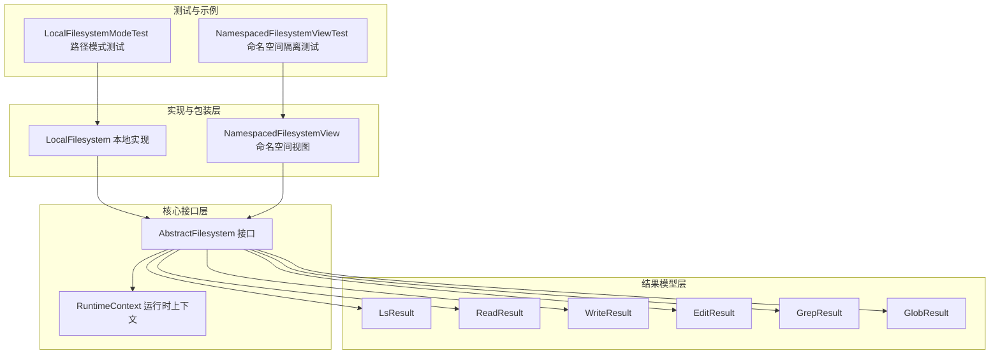
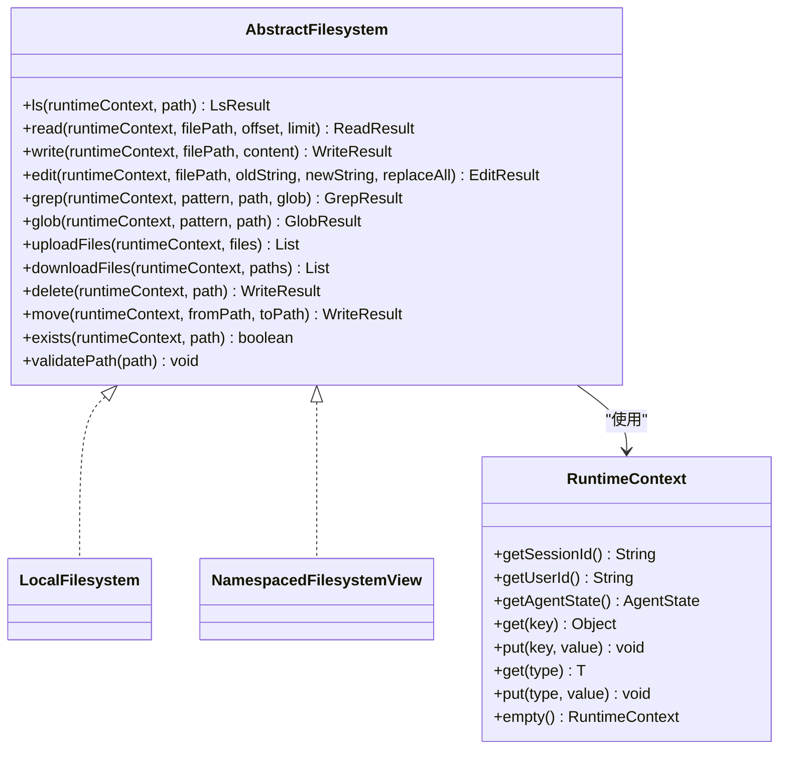
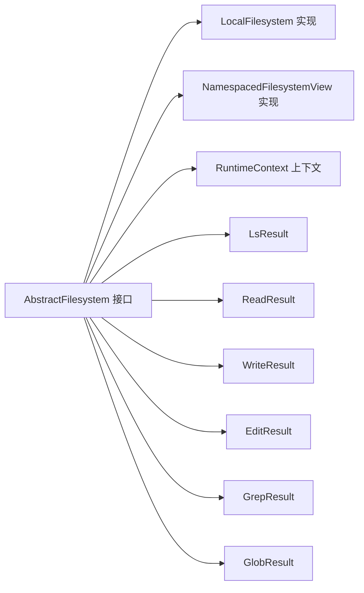
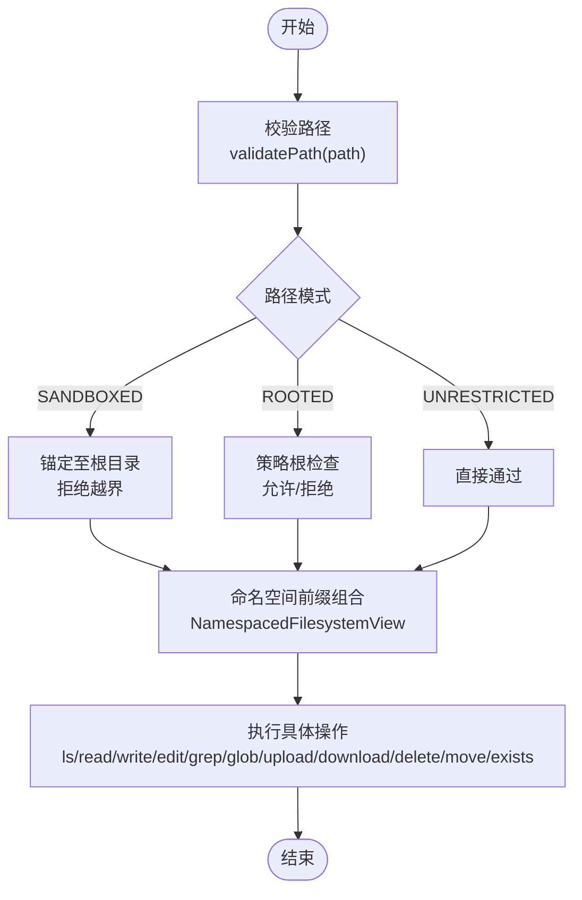

# 抽象文件系统接口

<cite>
**本文引用的文件**
- [AbstractFilesystem.java](file://agentscope-harness/src/main/java/io/agentscope/harness/agent/filesystem/AbstractFilesystem.java)
- [RuntimeContext.java](file://agentscope-core/src/main/java/io/agentscope/core/agent/RuntimeContext.java)
- [NamespacedFilesystemView.java](file://agentscope-examples/agents/agentscope-builder/src/main/java/io/agentscope/builder/web/workspace/NamespacedFilesystemView.java)
- [NamespacedFilesystemViewTest.java](file://agentscope-examples/agents/agentscope-builder/src/test/java/io/agentscope/builder/web/workspace/NamespacedFilesystemViewTest.java)
- [LocalFilesystem.java](file://agentscope-harness/src/main/java/io/agentscope/harness/agent/filesystem/local/LocalFilesystem.java)
- [LocalFilesystemModeTest.java](file://agentscope-harness/src/test/java/io/agentscope/harness/agent/filesystem/LocalFilesystemModeTest.java)
- [LsResult.java](file://agentscope-harness/src/main/java/io/agentscope/harness/agent/filesystem/model/LsResult.java)
- [ReadResult.java](file://agentscope-harness/src/main/java/io/agentscope/harness/agent/filesystem/model/ReadResult.java)
- [WriteResult.java](file://agentscope-harness/src/main/java/io/agentscope/harness/agent/filesystem/model/WriteResult.java)
- [EditResult.java](file://agentscope-harness/src/main/java/io/agentscope/harness/agent/filesystem/model/EditResult.java)
- [GrepResult.java](file://agentscope-harness/src/main/java/io/agentscope/harness/agent/filesystem/model/GrepResult.java)
- [GlobResult.java](file://agentscope-harness/src/main/java/io/agentscope/harness/agent/filesystem/model/GlobResult.java)
</cite>

## 目录
1. [简介](#简介)
2. [项目结构](#项目结构)
3. [核心组件](#核心组件)
4. [架构总览](#架构总览)
5. [详细组件分析](#详细组件分析)
6. [依赖关系分析](#依赖关系分析)
7. [性能考量](#性能考量)
8. [故障排查指南](#故障排查指南)
9. [结论](#结论)
10. [附录](#附录)

## 简介
本文件为 AbstractFilesystem 抽象接口的权威 API 文档与设计说明。该接口统一抽象了代理可执行的文件系统操作，涵盖目录列举、读取、写入、编辑、检索、通配符匹配、批量上传下载、删除、移动、存在性检查等能力，并通过 RuntimeContext 提供会话级作用域与运行时上下文支持。接口同时提供路径校验工具方法，确保安全性与一致性。

## 项目结构
围绕 AbstractFilesystem 的相关代码主要分布在以下模块与包中：
- 接口与结果模型：agentscope-harness 模块中的 harness.agent.filesystem 及其 model 子包
- 运行时上下文：agentscope-core 模块中的 core.agent 包
- 具体实现示例：agentscope-harness 中的 local 实现与示例工程中的命名空间视图包装器
- 测试用例：agentscope-harness 与 agentscope-builder 示例工程中的多类测试

图表来源
- [AbstractFilesystem.java:32-44](file://agentscope-harness/src/main/java/io/agentscope/harness/agent/filesystem/AbstractFilesystem.java#L32-L44)
- [RuntimeContext.java:26-33](file://agentscope-core/src/main/java/io/agentscope/core/agent/RuntimeContext.java#L26-L33)
- [LocalFilesystem.java:62-76](file://agentscope-harness/src/main/java/io/agentscope/harness/agent/filesystem/local/LocalFilesystem.java#L62-L76)
- [NamespacedFilesystemView.java:35-52](file://agentscope-examples/agents/agentscope-builder/src/main/java/io/agentscope/builder/web/workspace/NamespacedFilesystemView.java#L35-L52)
- [LocalFilesystemModeTest.java:38-43](file://agentscope-harness/src/test/java/io/agentscope/harness/agent/filesystem/LocalFilesystemModeTest.java#L38-L43)
- [NamespacedFilesystemViewTest.java:66-86](file://agentscope-examples/agents/agentscope-builder/src/test/java/io/agentscope/builder/web/workspace/NamespacedFilesystemViewTest.java#L66-L86)

章节来源
- [AbstractFilesystem.java:32-44](file://agentscope-harness/src/main/java/io/agentscope/harness/agent/filesystem/AbstractFilesystem.java#L32-L44)
- [RuntimeContext.java:26-33](file://agentscope-core/src/main/java/io/agentscope/core/agent/RuntimeContext.java#L26-L33)

## 核心组件
- 抽象接口 AbstractFilesystem：定义统一的文件系统操作契约，所有实现需遵循一致的参数语义与错误处理策略。
- 结果模型（Result Records）：对各操作返回值进行统一封装，提供 isSuccess() 判定与错误消息访问。
- 运行时上下文 RuntimeContext：承载会话 ID、用户 ID、调用期 AgentState、键值属性与工具执行上下文，贯穿所有操作。
- 路径校验工具：静态 validatePath() 方法用于拒绝空/空白与包含路径穿越片段的非法路径。
- 实现与包装：LocalFilesystem 提供本地磁盘实现；NamespacedFilesystemView 提供命名空间隔离与路径前缀组合。

章节来源
- [AbstractFilesystem.java:44-187](file://agentscope-harness/src/main/java/io/agentscope/harness/agent/filesystem/AbstractFilesystem.java#L44-L187)
- [RuntimeContext.java:33-143](file://agentscope-core/src/main/java/io/agentscope/core/agent/RuntimeContext.java#L33-L143)
- [LsResult.java:20-39](file://agentscope-harness/src/main/java/io/agentscope/harness/agent/filesystem/model/LsResult.java#L20-L39)
- [ReadResult.java:18-37](file://agentscope-harness/src/main/java/io/agentscope/harness/agent/filesystem/model/ReadResult.java#L18-L37)
- [WriteResult.java:18-37](file://agentscope-harness/src/main/java/io/agentscope/harness/agent/filesystem/model/WriteResult.java#L18-L37)
- [EditResult.java:18-38](file://agentscope-harness/src/main/java/io/agentscope/harness/agent/filesystem/model/EditResult.java#L18-L38)
- [GrepResult.java:20-39](file://agentscope-harness/src/main/java/io/agentscope/harness/agent/filesystem/model/GrepResult.java#L20-L39)
- [GlobResult.java:20-39](file://agentscope-harness/src/main/java/io/agentscope/harness/agent/filesystem/model/GlobResult.java#L20-L39)

## 架构总览
AbstractFilesystem 将“操作语义”与“存储后端”解耦：上层代理仅面向接口编程，下层可替换为本地文件系统、沙箱、远程存储或组合式存储。RuntimeContext 为每次调用提供会话与用户维度的上下文，命名空间包装器可在不修改调用点的情况下实现多租户隔离。

图表来源
- [AbstractFilesystem.java:44-187](file://agentscope-harness/src/main/java/io/agentscope/harness/agent/filesystem/AbstractFilesystem.java#L44-L187)
- [RuntimeContext.java:33-143](file://agentscope-core/src/main/java/io/agentscope/core/agent/RuntimeContext.java#L33-L143)
- [LocalFilesystem.java:76](file://agentscope-harness/src/main/java/io/agentscope/harness/agent/filesystem/local/LocalFilesystem.java#L76)
- [NamespacedFilesystemView.java:52](file://agentscope-examples/agents/agentscope-builder/src/main/java/io/agentscope/builder/web/workspace/NamespacedFilesystemView.java#L52)

## 详细组件分析

### 接口设计与核心方法定义
- ls(runtimeContext, path): 列举目录内容并返回条目列表或错误信息。适用于浏览工作区结构。
- read(runtimeContext, filePath, offset, limit): 支持分页读取（按行），避免大文件一次性加载。
- write(runtimeContext, filePath, content): 写入新文件，若目标已存在则失败。
- edit(runtimeContext, filePath, oldString, newString, replaceAll): 在现有文件内进行精确字符串替换，支持全部替换或唯一替换约束。
- grep(runtimeContext, pattern, path, glob): 在指定目录与可选通配符过滤下搜索字面量文本。
- glob(runtimeContext, pattern, path): 返回匹配通配符的文件列表。
- uploadFiles(runtimeContext, files): 批量上传二进制内容映射。
- downloadFiles(runtimeContext, paths): 批量下载文件路径列表。
- delete(runtimeContext, path): 递归删除文件或目录，不存在视为成功（幂等）。
- move(runtimeContext, fromPath, toPath): 移动/重命名，跨存储实现可能退化为读+写+删序列。
- exists(runtimeContext, path): 存在性检查，必要时采用轻量探测避免全量读取。
- validatePath(path): 静态校验，拒绝空/空白与包含路径穿越片段的路径。

章节来源
- [AbstractFilesystem.java:46-168](file://agentscope-harness/src/main/java/io/agentscope/harness/agent/filesystem/AbstractFilesystem.java#L46-L168)

### 参数与返回值规范
- 参数
  - runtimeContext：每次调用的运行时上下文，未处于工具/代理调用时传入空上下文。
  - path/filePath/fromPath/toPath：绝对路径，必须以根分隔符开头。
  - offset/limit：分页读取的起始行与最大行数，默认值见接口注释。
  - pattern/glob：字面量搜索串与通配符模式。
  - files/paths：批量操作的输入集合。
- 返回值
  - 除 exists 外均为封装型结果对象，包含错误消息与业务数据；均提供 isSuccess() 判定与错误访问。
  - exists 返回布尔值，true 表示存在。

章节来源
- [AbstractFilesystem.java:46-168](file://agentscope-harness/src/main/java/io/agentscope/harness/agent/filesystem/AbstractFilesystem.java#L46-L168)
- [LsResult.java:20-39](file://agentscope-harness/src/main/java/io/agentscope/harness/agent/filesystem/model/LsResult.java#L20-L39)
- [ReadResult.java:18-37](file://agentscope-harness/src/main/java/io/agentscope/harness/agent/filesystem/model/ReadResult.java#L18-L37)
- [WriteResult.java:18-37](file://agentscope-harness/src/main/java/io/agentscope/harness/agent/filesystem/model/WriteResult.java#L18-L37)
- [EditResult.java:18-38](file://agentscope-harness/src/main/java/io/agentscope/harness/agent/filesystem/model/EditResult.java#L18-L38)
- [GrepResult.java:20-39](file://agentscope-harness/src/main/java/io/agentscope/harness/agent/filesystem/model/GrepResult.java#L20-L39)
- [GlobResult.java:20-39](file://agentscope-harness/src/main/java/io/agentscope/harness/agent/filesystem/model/GlobResult.java#L20-L39)

### 异常处理机制
- 路径校验：validatePath 对空/空白与包含路径穿越片段的路径抛出非法参数异常。
- 存储错误：所有写/读/编辑/搜索/移动/删除等操作在失败时返回带错误消息的结果对象，调用方通过 isSuccess() 判定并获取错误详情。
- 安全边界：LocalFilesystem 的三种路径解析模式（沙箱、受限根、无限制）分别控制绝对路径与相对路径的行为，防止越权访问。
- 幂等删除：delete 对不存在路径视为成功，便于重试安全。

章节来源
- [AbstractFilesystem.java:172-185](file://agentscope-harness/src/main/java/io/agentscope/harness/agent/filesystem/AbstractFilesystem.java#L172-L185)
- [LocalFilesystemModeTest.java:46-103](file://agentscope-harness/src/test/java/io/agentscope/harness/agent/filesystem/LocalFilesystemModeTest.java#L46-L103)

### RuntimeContext 的作用与使用场景
- 作用
  - 提供会话级与用户级标识，使存储后端能够将操作限定在当前会话与用户范围内。
  - 携带调用期 AgentState 与通用键值属性，便于中间件与工具在一次调用内共享状态。
- 使用场景
  - 文件系统操作：通过 runtimeContext 传递会话与用户信息，配合命名空间包装器实现多租户隔离。
  - 工具与中间件：在工具链中读取/写入上下文属性，实现动态行为与状态管理。
- 空上下文
  - 非工具/代理调用或无会话时，使用空上下文以保证兼容性。

章节来源
- [RuntimeContext.java:26-33](file://agentscope-core/src/main/java/io/agentscope/core/agent/RuntimeContext.java#L26-L33)
- [RuntimeContext.java:86-91](file://agentscope-core/src/main/java/io/agentscope/core/agent/RuntimeContext.java#L86-L91)
- [AbstractFilesystem.java:40-43](file://agentscope-harness/src/main/java/io/agentscope/harness/agent/filesystem/AbstractFilesystem.java#L40-L43)

### 路径验证工具方法
- validatePath(path)
  - 功能：校验路径非空、非空白且不含路径穿越片段。
  - 触发：当路径无效时抛出非法参数异常，阻止后续操作。
  - 应用：在包装器与实现中作为前置校验，确保输入安全。

章节来源
- [AbstractFilesystem.java:172-185](file://agentscope-harness/src/main/java/io/agentscope/harness/agent/filesystem/AbstractFilesystem.java#L172-L185)

### 接口最佳实践与扩展建议
- 最佳实践
  - 统一使用绝对路径与分页读取，避免大文件一次性加载。
  - 在调用前显式校验路径，结合实现的路径模式策略选择合适的 LocalFsMode。
  - 使用 RuntimeContext 传递会话与用户信息，确保操作范围可控。
  - 对批量上传/下载使用有序响应列表，便于错误定位与重试。
- 扩展建议
  - 新增后端：实现 AbstractFilesystem 并在必要处复用 validatePath 与结果模型。
  - 多租户隔离：通过命名空间包装器组合任意后端，实现逻辑子树隔离。
  - 性能优化：在实现中缓存常用元数据、限制单次读取大小、对搜索设置合理上限。

章节来源
- [AbstractFilesystem.java:32-44](file://agentscope-harness/src/main/java/io/agentscope/harness/agent/filesystem/AbstractFilesystem.java#L32-L44)
- [NamespacedFilesystemView.java:35-51](file://agentscope-examples/agents/agentscope-builder/src/main/java/io/agentscope/builder/web/workspace/NamespacedFilesystemView.java#L35-L51)

## 依赖关系分析
- 接口到实现
  - LocalFilesystem 实现 AbstractFilesystem，负责本地磁盘操作与路径模式控制。
  - NamespacedFilesystemView 实现 AbstractFilesystem，通过命名空间工厂为所有路径添加前缀，实现多租户隔离。
- 上下文依赖
  - 所有操作均依赖 RuntimeContext 提供的会话与用户信息。
- 结果模型依赖
  - 各操作返回对应结果模型，统一错误处理与成功判定。

图表来源
- [AbstractFilesystem.java:44-187](file://agentscope-harness/src/main/java/io/agentscope/harness/agent/filesystem/AbstractFilesystem.java#L44-L187)
- [LocalFilesystem.java:76](file://agentscope-harness/src/main/java/io/agentscope/harness/agent/filesystem/local/LocalFilesystem.java#L76)
- [NamespacedFilesystemView.java:52](file://agentscope-examples/agents/agentscope-builder/src/main/java/io/agentscope/builder/web/workspace/NamespacedFilesystemView.java#L52)

章节来源
- [AbstractFilesystem.java:44-187](file://agentscope-harness/src/main/java/io/agentscope/harness/agent/filesystem/AbstractFilesystem.java#L44-L187)
- [LocalFilesystem.java:76](file://agentscope-harness/src/main/java/io/agentscope/harness/agent/filesystem/local/LocalFilesystem.java#L76)
- [NamespacedFilesystemView.java:52](file://agentscope-examples/agents/agentscope-builder/src/main/java/io/agentscope/builder/web/workspace/NamespacedFilesystemView.java#L52)

## 性能考量
- 分页读取：read 的 offset/limit 参数避免一次性加载大文件，降低内存占用。
- 轻量探测：exists 可通过轻量探测实现，避免读取完整内容。
- 锁与并发：编辑操作内部对同一文件路径使用互斥锁，保障读改写原子性。
- 搜索限制：LocalFilesystem 提供最大文件大小限制，避免在超大文件上进行昂贵搜索。
- 批量操作：uploadFiles/downloadFiles 保持输入顺序，便于并行处理与错误恢复。

章节来源
- [AbstractFilesystem.java:55-64](file://agentscope-harness/src/main/java/io/agentscope/harness/agent/filesystem/AbstractFilesystem.java#L55-L64)
- [AbstractFilesystem.java:93-102](file://agentscope-harness/src/main/java/io/agentscope/harness/agent/filesystem/AbstractFilesystem.java#L93-L102)
- [LocalFilesystem.java:88-93](file://agentscope-harness/src/main/java/io/agentscope/harness/agent/filesystem/local/LocalFilesystem.java#L88-L93)

## 故障排查指南
- 路径错误
  - 现象：调用抛出非法参数异常或返回失败结果。
  - 排查：确认路径非空、非空白且不包含路径穿越片段；必要时使用 validatePath 进行预检。
- 权限与越权
  - 现象：SANDBOXED 模式拒绝绝对路径；ROOTED 模式拒绝超出策略根的绝对路径；UNRESTRICTED 模式接受任何绝对路径。
  - 排查：根据 LocalFsMode 选择合适构造参数；在 ROOTED 模式下配置 PathPolicy。
- 多租户隔离
  - 现象：不同用户/租户间文件不可见或被拒绝。
  - 排查：确认 NamespacedFilesystemView 是否正确注入 NamespaceFactory；测试用例展示了隔离与路径穿越拒绝。
- 删除幂等性
  - 现象：删除不存在路径应视为成功。
  - 排查：检查实现是否遵循幂等语义。

章节来源
- [AbstractFilesystem.java:172-185](file://agentscope-harness/src/main/java/io/agentscope/harness/agent/filesystem/AbstractFilesystem.java#L172-L185)
- [LocalFilesystemModeTest.java:46-103](file://agentscope-harness/src/test/java/io/agentscope/harness/agent/filesystem/LocalFilesystemModeTest.java#L46-L103)
- [NamespacedFilesystemViewTest.java:66-93](file://agentscope-examples/agents/agentscope-builder/src/test/java/io/agentscope/builder/web/workspace/NamespacedFilesystemViewTest.java#L66-L93)

## 结论
AbstractFilesystem 通过清晰的操作契约、统一的结果模型与运行时上下文，实现了代理文件系统的抽象与可插拔性。结合路径校验、命名空间隔离与多种路径解析模式，既满足多租户隔离需求，又兼顾性能与易用性。推荐在实际项目中严格遵循参数与返回值规范，合理选择路径模式与命名空间策略，并利用分页与轻量探测提升稳定性与效率。

## 附录

### API 方法一览与要点
- ls：目录列举，返回条目列表或错误。
- read：分页读取，offset/limit 控制范围。
- write：写入新文件，已存在则失败。
- edit：精确字符串替换，支持全部替换或唯一替换。
- grep：字面量搜索，支持目录与通配符过滤。
- glob：通配符匹配，返回文件列表。
- uploadFiles：批量上传，返回每文件响应。
- downloadFiles：批量下载，返回每路径响应。
- delete：递归删除，不存在即成功。
- move：移动/重命名，跨存储可能退化为读+写+删。
- exists：存在性检查，必要时轻量探测。
- validatePath：静态校验，拒绝非法路径。

章节来源
- [AbstractFilesystem.java:46-168](file://agentscope-harness/src/main/java/io/agentscope/harness/agent/filesystem/AbstractFilesystem.java#L46-L168)

### 路径模式与隔离流程（概念流程）

图表来源
- [AbstractFilesystem.java:172-185](file://agentscope-harness/src/main/java/io/agentscope/harness/agent/filesystem/AbstractFilesystem.java#L172-L185)
- [NamespacedFilesystemView.java:35-51](file://agentscope-examples/agents/agentscope-builder/src/main/java/io/agentscope/builder/web/workspace/NamespacedFilesystemView.java#L35-L51)
- [LocalFilesystem.java:62-76](file://agentscope-harness/src/main/java/io/agentscope/harness/agent/filesystem/local/LocalFilesystem.java#L62-L76)