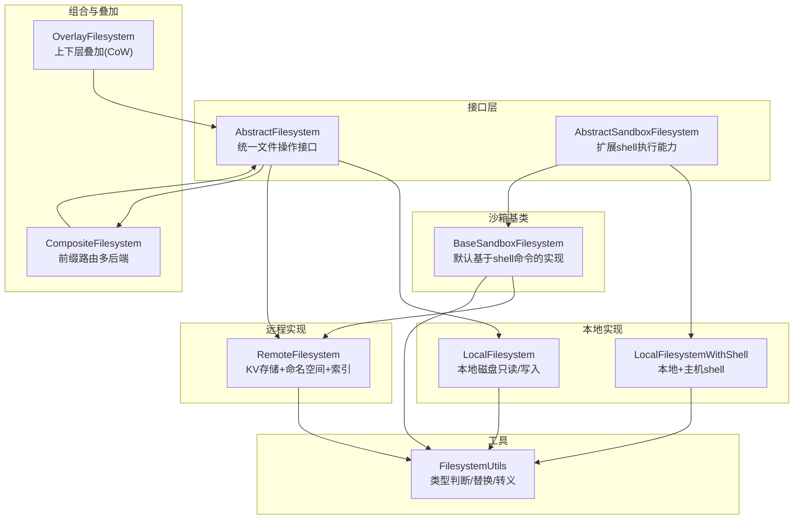
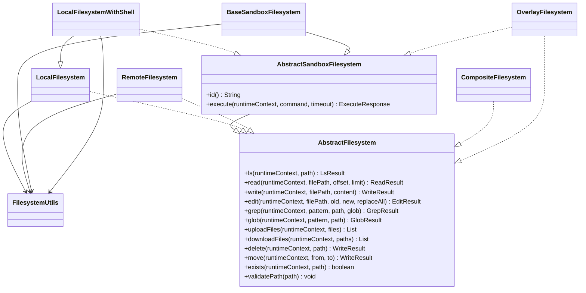
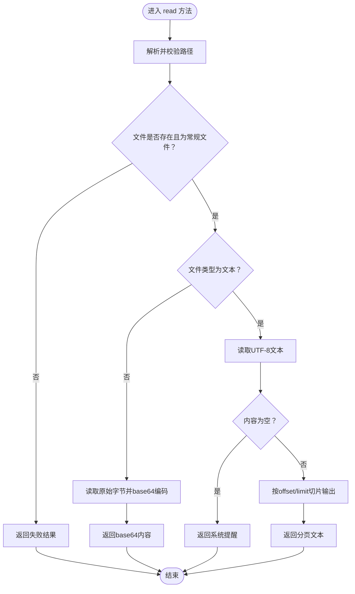
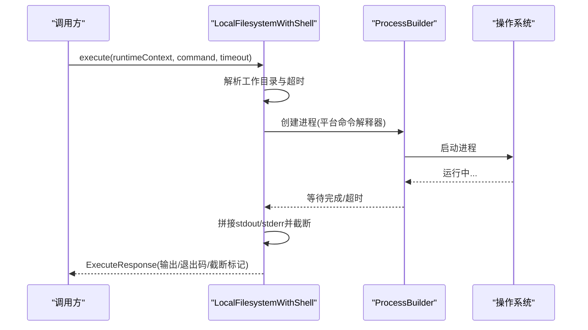
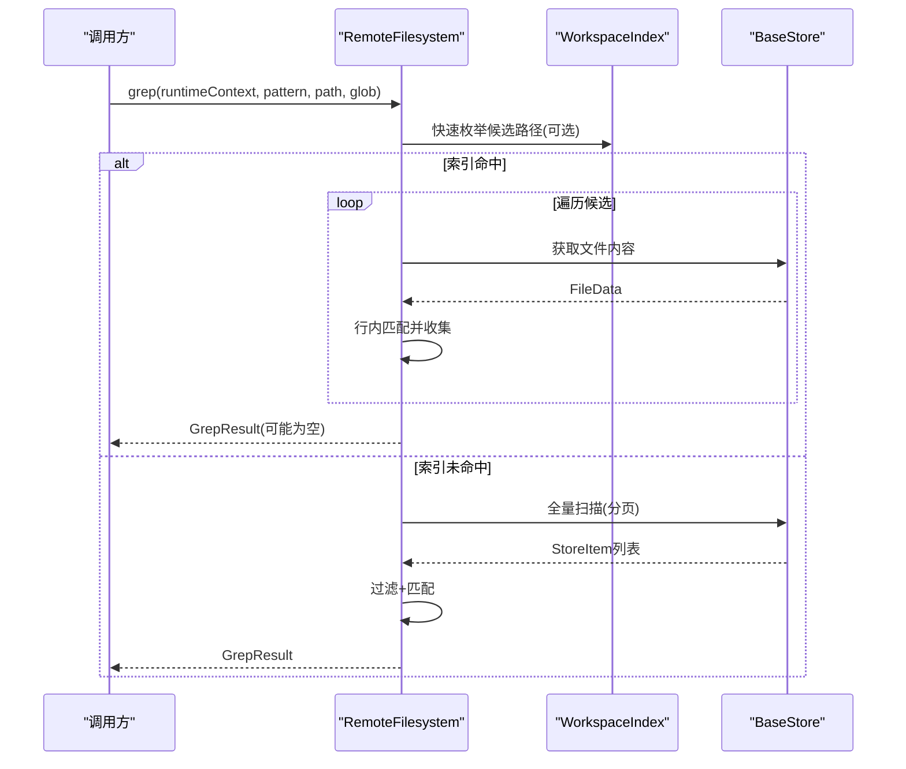
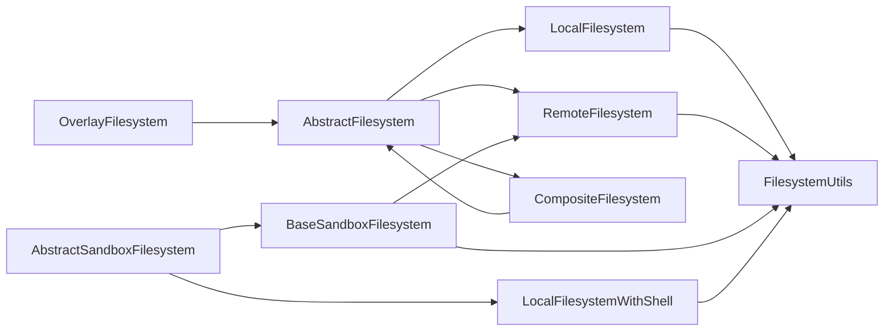

# 文件系统API

<cite>
**本文档引用的文件**
- [AbstractFilesystem.java](file://agentscope-harness/src/main/java/io/agentscope/harness/agent/filesystem/AbstractFilesystem.java)
- [AbstractSandboxFilesystem.java](file://agentscope-harness/src/main/java/io/agentscope/harness/agent/filesystem/sandbox/AbstractSandboxFilesystem.java)
- [LocalFilesystem.java](file://agentscope-harness/src/main/java/io/agentscope/harness/agent/filesystem/local/LocalFilesystem.java)
- [LocalFilesystemWithShell.java](file://agentscope-harness/src/main/java/io/agentscope/harness/agent/filesystem/local/LocalFilesystemWithShell.java)
- [RemoteFilesystem.java](file://agentscope-harness/src/main/java/io/agentscope/harness/agent/filesystem/remote/RemoteFilesystem.java)
- [BaseSandboxFilesystem.java](file://agentscope-harness/src/main/java/io/agentscope/harness/agent/filesystem/sandbox/BaseSandboxFilesystem.java)
- [CompositeFilesystem.java](file://agentscope-harness/src/main/java/io/agentscope/harness/agent/filesystem/CompositeFilesystem.java)
- [OverlayFilesystem.java](file://agentscope-harness/src/main/java/io/agentscope/harness/agent/filesystem/OverlayFilesystem.java)
- [FilesystemUtils.java](file://agentscope-harness/src/main/java/io/agentscope/harness/agent/filesystem/util/FilesystemUtils.java)
- [filesystem.md](file://docs/v1/en/docs/harness/filesystem.md)
</cite>

## 目录
1. [简介](#简介)
2. [项目结构](#项目结构)
3. [核心组件](#核心组件)
4. [架构总览](#架构总览)
5. [详细组件分析](#详细组件分析)
6. [依赖关系分析](#依赖关系分析)
7. [性能考虑](#性能考虑)
8. [故障排查指南](#故障排查指南)
9. [结论](#结论)
10. [附录](#附录)

## 简介
本文件系统抽象层旨在为智能体提供统一的文件操作接口，屏蔽底层存储差异（本地磁盘、远程KV存储、沙箱环境）。通过抽象接口与多种实现，用户可以在不同运行环境中无缝切换：本地开发、分布式会话隔离、跨节点协作等场景均可通过同一套API完成文件读写、检索、上传下载、路径管理与权限控制。

## 项目结构
文件系统模块位于 agentscope-harness 模块中，采用按职责分层的组织方式：
- 接口层：AbstractFilesystem、AbstractSandboxFilesystem 定义统一能力边界
- 本地实现：LocalFilesystem、LocalFilesystemWithShell 提供本地磁盘访问与可选的主机shell执行
- 远程实现：RemoteFilesystem 基于键值存储持久化，支持命名空间与索引加速
- 沙箱基类：BaseSandboxFilesystem 将通用文件操作映射到远程shell命令
- 组合与叠加：CompositeFilesystem 实现多后端路由；OverlayFilesystem 提供上下层叠加与copy-on-write语义
- 工具与模型：FilesystemUtils 提供类型判断、替换算法与安全转义；各实现依赖结果模型进行返回

图表来源
- [AbstractFilesystem.java:44-187](file://agentscope-harness/src/main/java/io/agentscope/harness/agent/filesystem/AbstractFilesystem.java#L44-L187)
- [AbstractSandboxFilesystem.java:27-47](file://agentscope-harness/src/main/java/io/agentscope/harness/agent/filesystem/sandbox/AbstractSandboxFilesystem.java#L27-L47)
- [LocalFilesystem.java:76-890](file://agentscope-harness/src/main/java/io/agentscope/harness/agent/filesystem/local/LocalFilesystem.java#L76-L890)
- [LocalFilesystemWithShell.java:46-434](file://agentscope-harness/src/main/java/io/agentscope/harness/agent/filesystem/local/LocalFilesystemWithShell.java#L46-L434)
- [RemoteFilesystem.java:63-718](file://agentscope-harness/src/main/java/io/agentscope/harness/agent/filesystem/remote/RemoteFilesystem.java#L63-L718)
- [BaseSandboxFilesystem.java:55-453](file://agentscope-harness/src/main/java/io/agentscope/harness/agent/filesystem/sandbox/BaseSandboxFilesystem.java#L55-L453)
- [CompositeFilesystem.java:64-519](file://agentscope-harness/src/main/java/io/agentscope/harness/agent/filesystem/CompositeFilesystem.java#L64-L519)
- [OverlayFilesystem.java:56-303](file://agentscope-harness/src/main/java/io/agentscope/harness/agent/filesystem/OverlayFilesystem.java#L56-L303)
- [FilesystemUtils.java:23-108](file://agentscope-harness/src/main/java/io/agentscope/harness/agent/filesystem/util/FilesystemUtils.java#L23-L108)

章节来源
- [filesystem.md:40-98](file://docs/v1/en/docs/harness/filesystem.md#L40-L98)

## 核心组件
本节对抽象接口与关键实现进行深入解析，涵盖API签名、行为语义、错误处理与性能特征。

- 抽象接口 AbstractFilesystem
  - 能力范围：列出目录、读取内容（支持行号分页）、写入新文件、编辑（字符串替换）、全文检索、通配符匹配、批量上传下载、删除、移动、存在性检查
  - 参数约定：所有路径必须以“/”开头的绝对路径；offset从0开始；limit<=0时使用实现定义的默认行数
  - 安全校验：提供静态方法对路径进行非空、非空白、禁止“..”遍历的校验
  - 返回模型：每个操作返回对应的结果对象（成功/失败），失败包含错误信息

- 抽象接口 AbstractSandboxFilesystem
  - 在AbstractFilesystem基础上增加：唯一标识id()与execute()执行shell命令的能力
  - 适用于需要在宿主或远端沙箱执行命令的场景

- 本地文件系统 LocalFilesystem
  - 路径解析策略：SANDBOXED（锚定根目录，禁止遍历）、ROOTED（仅允许白名单根目录或根目录下相对路径）、UNRESTRICTED（绝对路径透传）
  - 并发控制：针对edit操作使用文件级锁避免竞态
  - 搜索策略：优先使用ripgrep（若可用）进行高性能文本搜索，否则回退到纯Java扫描
  - 命名空间：支持NamespaceFactory动态前缀，实现多租户隔离
  - 读取策略：二进制文件自动base64编码返回；文本文件支持行号分页

- 本地+主机shell LocalFilesystemWithShell
  - 在LocalFilesystem基础上增加execute()，直接在宿主机执行命令
  - 支持自定义超时、输出截断、环境变量注入、工作目录分离
  - 危险提示：无任何沙箱或隔离限制，仅用于受控环境

- 远程文件系统 RemoteFilesystem
  - 基于BaseStore的KV存储，文件按命名空间组织，跨线程/会话持久化
  - 支持WorkspaceIndex索引加速ls/glob/exists/grep
  - 写入策略：CAS原子创建（create-if-absent）；编辑采用带版本号的CAS重试
  - 上传下载：uploadFiles采用最后写入获胜策略，适合快照推送；downloadFiles从权威源读取内容

- 沙箱基类 BaseSandboxFilesystem
  - 默认实现将ls/read/grep/glob/edit/write/delete/move/exists委托给shell命令
  - 使用Python3脚本执行字符串替换，确保原子性与一致性
  - 通过uploadFiles/downloadFiles进行内容传输

- 组合文件系统 CompositeFilesystem
  - 基于最长前缀匹配的路由，将不同路径分派到不同后端
  - 不支持shell执行（避免跨后端命令路由歧义）
  - move跨后端时采用read+write+delete序列

- 叠加文件系统 OverlayFilesystem
  - 上层（用户层）可写，下层（共享层）只读，提供copy-on-write语义
  - 读取优先上层，写入/编辑/删除均作用于上层
  - 支持自动感知上层是否具备shell能力，并保持该能力穿透

- 工具类 FilesystemUtils
  - 文件类型判断：根据扩展名判定text/binary
  - 字符串替换：统计出现次数、单次/全部替换、错误消息构造
  - shell转义：防止注入与特殊字符问题

章节来源
- [AbstractFilesystem.java:44-187](file://agentscope-harness/src/main/java/io/agentscope/harness/agent/filesystem/AbstractFilesystem.java#L44-L187)
- [AbstractSandboxFilesystem.java:27-47](file://agentscope-harness/src/main/java/io/agentscope/harness/agent/filesystem/sandbox/AbstractSandboxFilesystem.java#L27-L47)
- [LocalFilesystem.java:76-890](file://agentscope-harness/src/main/java/io/agentscope/harness/agent/filesystem/local/LocalFilesystem.java#L76-L890)
- [LocalFilesystemWithShell.java:46-434](file://agentscope-harness/src/main/java/io/agentscope/harness/agent/filesystem/local/LocalFilesystemWithShell.java#L46-L434)
- [RemoteFilesystem.java:63-718](file://agentscope-harness/src/main/java/io/agentscope/harness/agent/filesystem/remote/RemoteFilesystem.java#L63-L718)
- [BaseSandboxFilesystem.java:55-453](file://agentscope-harness/src/main/java/io/agentscope/harness/agent/filesystem/sandbox/BaseSandboxFilesystem.java#L55-L453)
- [CompositeFilesystem.java:64-519](file://agentscope-harness/src/main/java/io/agentscope/harness/agent/filesystem/CompositeFilesystem.java#L64-L519)
- [OverlayFilesystem.java:56-303](file://agentscope-harness/src/main/java/io/agentscope/harness/agent/filesystem/OverlayFilesystem.java#L56-L303)
- [FilesystemUtils.java:23-108](file://agentscope-harness/src/main/java/io/agentscope/harness/agent/filesystem/util/FilesystemUtils.java#L23-L108)

## 架构总览
下图展示了文件系统抽象层的整体架构与组件交互关系：

图表来源
- [AbstractFilesystem.java:44-187](file://agentscope-harness/src/main/java/io/agentscope/harness/agent/filesystem/AbstractFilesystem.java#L44-L187)
- [AbstractSandboxFilesystem.java:27-47](file://agentscope-harness/src/main/java/io/agentscope/harness/agent/filesystem/sandbox/AbstractSandboxFilesystem.java#L27-L47)
- [LocalFilesystem.java:76-890](file://agentscope-harness/src/main/java/io/agentscope/harness/agent/filesystem/local/LocalFilesystem.java#L76-L890)
- [LocalFilesystemWithShell.java:46-434](file://agentscope-harness/src/main/java/io/agentscope/harness/agent/filesystem/local/LocalFilesystemWithShell.java#L46-L434)
- [RemoteFilesystem.java:63-718](file://agentscope-harness/src/main/java/io/agentscope/harness/agent/filesystem/remote/RemoteFilesystem.java#L63-L718)
- [BaseSandboxFilesystem.java:55-453](file://agentscope-harness/src/main/java/io/agentscope/harness/agent/filesystem/sandbox/BaseSandboxFilesystem.java#L55-L453)
- [CompositeFilesystem.java:64-519](file://agentscope-harness/src/main/java/io/agentscope/harness/agent/filesystem/CompositeFilesystem.java#L64-L519)
- [OverlayFilesystem.java:56-303](file://agentscope-harness/src/main/java/io/agentscope/harness/agent/filesystem/OverlayFilesystem.java#L56-L303)
- [FilesystemUtils.java:23-108](file://agentscope-harness/src/main/java/io/agentscope/harness/agent/filesystem/util/FilesystemUtils.java#L23-L108)

## 详细组件分析

### 抽象接口与数据模型
- AbstractFilesystem
  - 关键方法：ls/read/write/edit/grep/glob/uploadFiles/downloadFiles/delete/move/exists
  - 行为约定：路径必须以“/”开头；offset从0计；limit<=0使用实现默认行数
  - 错误处理：所有失败返回包含错误信息的结果对象
  - 安全校验：validatePath对空值与“..”遍历进行拦截

- AbstractSandboxFilesystem
  - 扩展能力：id()唯一标识；execute()执行shell命令，支持超时与输出截断

章节来源
- [AbstractFilesystem.java:44-187](file://agentscope-harness/src/main/java/io/agentscope/harness/agent/filesystem/AbstractFilesystem.java#L44-L187)
- [AbstractSandboxFilesystem.java:27-47](file://agentscope-harness/src/main/java/io/agentscope/harness/agent/filesystem/sandbox/AbstractSandboxFilesystem.java#L27-L47)

### 本地文件系统 LocalFilesystem
- 路径解析模式
  - SANDBOXED：路径锚定到rootDir，禁止“..”与越界访问
  - ROOTED：仅允许rootDir或白名单根目录下的路径
  - UNRESTRICTED：绝对路径透传，相对路径锚定到rootDir
- 搜索与读取
  - 二进制文件自动base64编码；文本文件支持行号分页
  - 优先ripgrep，不可用则回退Java实现
- 并发与一致性
  - edit使用文件级锁避免并发修改丢失更新
- 命名空间
  - 通过NamespaceFactory在每次操作时附加命名空间前缀，实现多租户隔离

图表来源
- [LocalFilesystem.java:272-319](file://agentscope-harness/src/main/java/io/agentscope/harness/agent/filesystem/local/LocalFilesystem.java#L272-L319)

章节来源
- [LocalFilesystem.java:76-890](file://agentscope-harness/src/main/java/io/agentscope/harness/agent/filesystem/local/LocalFilesystem.java#L76-L890)

### 本地+主机shell LocalFilesystemWithShell
- 能力增强
  - execute()直接在宿主机执行命令，支持超时、输出截断、环境变量注入
  - shell工作目录可与文件系统根目录解耦，便于在overlay模式下暴露用户可见项目目录
- 安全风险
  - 无任何沙箱或隔离限制，仅限受控环境使用

图表来源
- [LocalFilesystemWithShell.java:307-408](file://agentscope-harness/src/main/java/io/agentscope/harness/agent/filesystem/local/LocalFilesystemWithShell.java#L307-L408)

章节来源
- [LocalFilesystemWithShell.java:46-434](file://agentscope-harness/src/main/java/io/agentscope/harness/agent/filesystem/local/LocalFilesystemWithShell.java#L46-L434)

### 远程文件系统 RemoteFilesystem
- 存储与命名空间
  - 基于BaseStore的KV存储，文件按命名空间组织
  - 支持动态NamespaceFactory与固定命名空间两种模式
- 索引加速
  - WorkspaceIndex提供ls/glob/exists/grep的快速路径，必要时回退权威扫描
- 写入与编辑
  - write采用CAS原子创建；edit采用带版本号的CAS重试，最多重试固定次数
- 上传下载
  - uploadFiles采用最后写入获胜策略，适合快照推送；downloadFiles从权威源读取

图表来源
- [RemoteFilesystem.java:330-414](file://agentscope-harness/src/main/java/io/agentscope/harness/agent/filesystem/remote/RemoteFilesystem.java#L330-L414)

章节来源
- [RemoteFilesystem.java:63-718](file://agentscope-harness/src/main/java/io/agentscope/harness/agent/filesystem/remote/RemoteFilesystem.java#L63-L718)

### 沙箱基类 BaseSandboxFilesystem
- 默认实现策略
  - 将ls/read/grep/glob/edit/write/delete/move/exists映射为shell命令
  - 使用Python3脚本执行字符串替换，确保原子性
- 上传下载
  - 通过uploadFiles/downloadFiles进行内容传输

章节来源
- [BaseSandboxFilesystem.java:55-453](file://agentscope-harness/src/main/java/io/agentscope/harness/agent/filesystem/sandbox/BaseSandboxFilesystem.java#L55-L453)

### 组合文件系统 CompositeFilesystem
- 路由规则
  - 最长前缀匹配；未匹配路径落到默认后端
  - 不支持shell执行（避免跨后端命令路由歧义）
- 跨后端移动
  - 采用read+write+delete序列保证一致性

章节来源
- [CompositeFilesystem.java:64-519](file://agentscope-harness/src/main/java/io/agentscope/harness/agent/filesystem/CompositeFilesystem.java#L64-L519)

### 叠加文件系统 OverlayFilesystem
- 层次结构
  - 上层（用户层）可写，下层（共享层）只读
  - 读取优先上层，写入/编辑/删除均作用于上层
- 能力穿透
  - 当上层具备shell能力时，Overlay自动暴露shell执行

章节来源
- [OverlayFilesystem.java:56-303](file://agentscope-harness/src/main/java/io/agentscope/harness/agent/filesystem/OverlayFilesystem.java#L56-L303)

### 工具类 FilesystemUtils
- 文件类型判断：根据扩展名集合判断text/binary
- 字符串替换：统计出现次数、单次/全部替换、错误消息构造
- shell转义：防止注入与特殊字符问题

章节来源
- [FilesystemUtils.java:23-108](file://agentscope-harness/src/main/java/io/agentscope/harness/agent/filesystem/util/FilesystemUtils.java#L23-L108)

## 依赖关系分析
- 组件耦合
  - 所有实现均依赖AbstractFilesystem接口，保证调用方与实现解耦
  - LocalFilesystemWithShell与BaseSandboxFilesystem共同依赖AbstractSandboxFilesystem
  - CompositeFilesystem与OverlayFilesystem作为组合器，依赖多个后端实现
- 外部依赖
  - LocalFilesystem对ripgrep的依赖用于高性能文本搜索
  - RemoteFilesystem依赖BaseStore与WorkspaceIndex进行持久化与加速
- 循环依赖
  - 未发现循环依赖；组合器仅持有后端引用，不反向依赖

图表来源
- [AbstractFilesystem.java:44-187](file://agentscope-harness/src/main/java/io/agentscope/harness/agent/filesystem/AbstractFilesystem.java#L44-L187)
- [AbstractSandboxFilesystem.java:27-47](file://agentscope-harness/src/main/java/io/agentscope/harness/agent/filesystem/sandbox/AbstractSandboxFilesystem.java#L27-L47)
- [LocalFilesystem.java:76-890](file://agentscope-harness/src/main/java/io/agentscope/harness/agent/filesystem/local/LocalFilesystem.java#L76-L890)
- [LocalFilesystemWithShell.java:46-434](file://agentscope-harness/src/main/java/io/agentscope/harness/agent/filesystem/local/LocalFilesystemWithShell.java#L46-L434)
- [RemoteFilesystem.java:63-718](file://agentscope-harness/src/main/java/io/agentscope/harness/agent/filesystem/remote/RemoteFilesystem.java#L63-L718)
- [BaseSandboxFilesystem.java:55-453](file://agentscope-harness/src/main/java/io/agentscope/harness/agent/filesystem/sandbox/BaseSandboxFilesystem.java#L55-L453)
- [CompositeFilesystem.java:64-519](file://agentscope-harness/src/main/java/io/agentscope/harness/agent/filesystem/CompositeFilesystem.java#L64-L519)
- [OverlayFilesystem.java:56-303](file://agentscope-harness/src/main/java/io/agentscope/harness/agent/filesystem/OverlayFilesystem.java#L56-L303)
- [FilesystemUtils.java:23-108](file://agentscope-harness/src/main/java/io/agentscope/harness/agent/filesystem/util/FilesystemUtils.java#L23-L108)

## 性能考虑
- 本地文件系统
  - 文本搜索优先使用ripgrep，显著提升grep性能；二进制文件直接base64编码，避免I/O开销
  - edit使用文件级锁，避免并发写入冲突
- 远程文件系统
  - WorkspaceIndex提供ls/glob/exists/grep的快速路径，减少网络往返
  - write采用CAS原子创建；edit采用带版本号的CAS重试，降低冲突概率
- 沙箱基类
  - 默认实现将所有操作映射为shell命令，适合标准Unix环境快速部署
- 组合与叠加
  - CompositeFilesystem通过最长前缀路由减少无效扫描
  - OverlayFilesystem在读取时优先上层，减少共享层访问

## 故障排查指南
- 路径相关错误
  - 使用AbstractFilesystem.validatePath进行显式校验，避免空值与“..”遍历
  - LocalFilesystem在SANDBOXED模式下严格限制路径越界，抛出安全异常
- 读取失败
  - LocalFilesystem：检查文件是否存在、是否为常规文件；二进制文件自动base64编码
  - RemoteFilesystem：确认命名空间正确、索引是否过期
- 编辑冲突
  - RemoteFilesystem：edit采用CAS重试，超过最大重试次数会返回冲突错误
- shell执行失败
  - LocalFilesystemWithShell：检查命令是否为空、超时设置是否合理、输出是否被截断
- 跨后端移动
  - CompositeFilesystem：跨后端移动采用read+write+delete序列，若任一步失败需检查目标后端权限与容量

章节来源
- [AbstractFilesystem.java:178-186](file://agentscope-harness/src/main/java/io/agentscope/harness/agent/filesystem/AbstractFilesystem.java#L178-L186)
- [LocalFilesystem.java:603-651](file://agentscope-harness/src/main/java/io/agentscope/harness/agent/filesystem/local/LocalFilesystem.java#L603-L651)
- [RemoteFilesystem.java:276-327](file://agentscope-harness/src/main/java/io/agentscope/harness/agent/filesystem/remote/RemoteFilesystem.java#L276-L327)
- [LocalFilesystemWithShell.java:307-408](file://agentscope-harness/src/main/java/io/agentscope/harness/agent/filesystem/local/LocalFilesystemWithShell.java#L307-L408)
- [CompositeFilesystem.java:483-500](file://agentscope-harness/src/main/java/io/agentscope/harness/agent/filesystem/CompositeFilesystem.java#L483-L500)

## 结论
文件系统抽象层通过清晰的接口设计与多样化的实现，为不同运行环境提供了统一而强大的文件操作能力。开发者可根据需求选择本地、远程或沙箱实现，或通过组合与叠加构建复杂的多层文件系统。配合命名空间、索引与并发控制机制，可在保证安全性的同时获得良好的性能与可维护性。

## 附录
- 选择与使用建议
  - 本地开发与受控环境：LocalFilesystemWithShell（注意安全风险）
  - 分布式会话与多租户：RemoteFilesystem + WorkspaceIndex
  - 跨节点协作与持久化：RemoteFilesystem（结合CAS策略）
  - 多后端混合：CompositeFilesystem（前缀路由）
  - 用户定制与共享内容：OverlayFilesystem（copy-on-write）

章节来源
- [filesystem.md:76-98](file://docs/v1/en/docs/harness/filesystem.md#L76-L98)