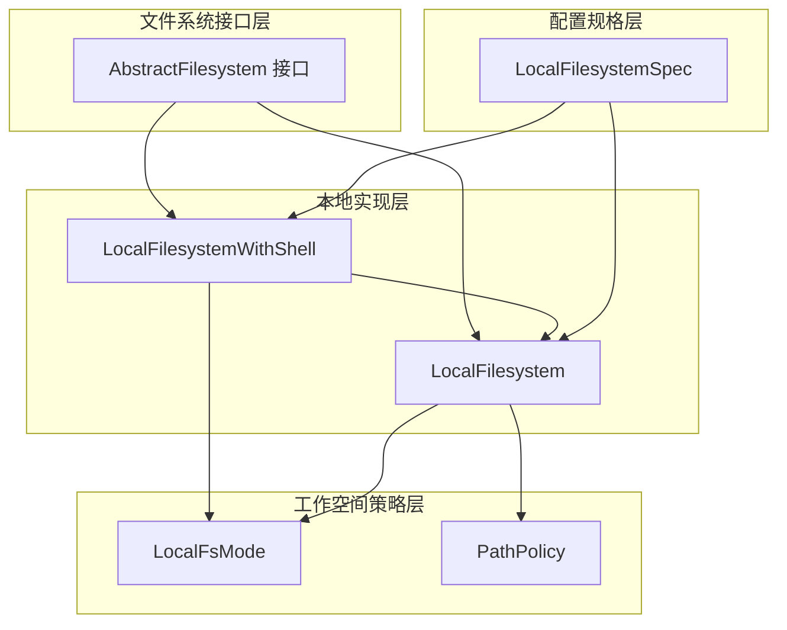
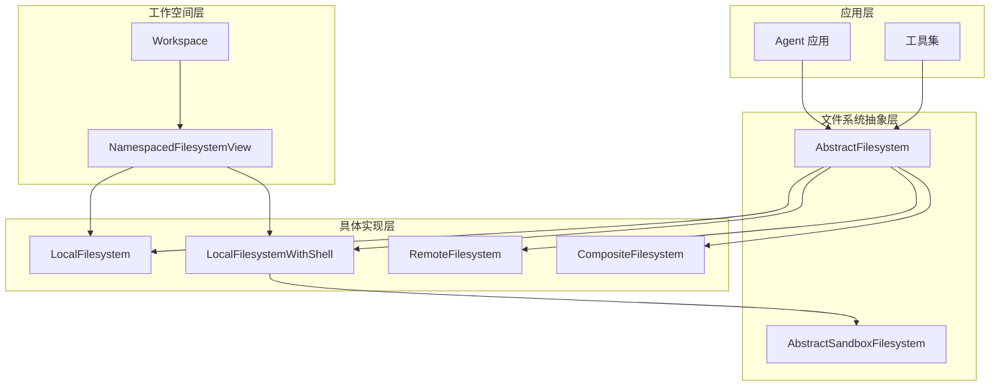
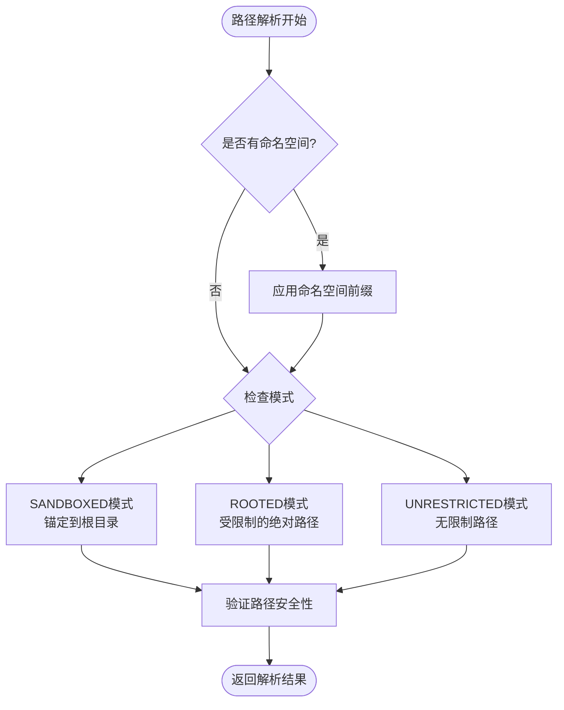
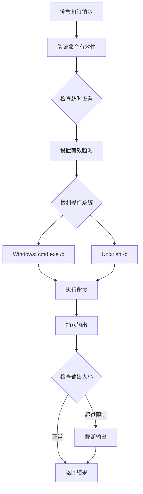
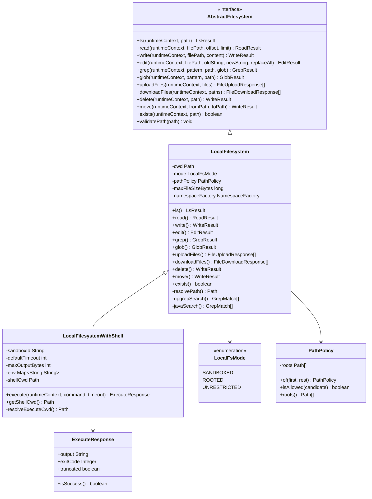

# 本地文件系统实现

<cite>
**本文档引用的文件**
- [LocalFilesystem.java](file://agentscope-harness/src/main/java/io/agentscope/harness/agent/filesystem/local/LocalFilesystem.java)
- [LocalFilesystemWithShell.java](file://agentscope-harness/src/main/java/io/agentscope/harness/agent/filesystem/local/LocalFilesystemWithShell.java)
- [AbstractFilesystem.java](file://agentscope-harness/src/main/java/io/agentscope/harness/agent/filesystem/AbstractFilesystem.java)
- [LocalFilesystemSpec.java](file://agentscope-harness/src/main/java/io/agentscope/harness/agent/filesystem/spec/LocalFilesystemSpec.java)
- [LocalFsMode.java](file://agentscope-harness/src/main/java/io/agentscope/harness/agent/workspace/LocalFsMode.java)
- [PathPolicy.java](file://agentscope-harness/src/main/java/io/agentscope/harness/agent/workspace/PathPolicy.java)
- [ExecuteResponse.java](file://agentscope-harness/src/main/java/io/agentscope/harness/agent/filesystem/model/ExecuteResponse.java)
- [filesystem.md](file://docs/v1/en/docs/harness/filesystem.md)
- [filesystem.md](file://docs/v2/zh/docs/harness/filesystem.md)
- [NamespacedFilesystemView.java](file://agentscope-examples/agents/agentscope-builder/src/main/java/io/agentscope/builder/web/workspace/NamespacedFilesystemView.java)
</cite>

## 目录
1. [简介](#简介)
2. [项目结构](#项目结构)
3. [核心组件](#核心组件)
4. [架构概览](#架构概览)
5. [详细组件分析](#详细组件分析)
6. [依赖关系分析](#依赖关系分析)
7. [性能考虑](#性能考虑)
8. [故障排除指南](#故障排除指南)
9. [结论](#结论)
10. [附录](#附录)

## 简介
本文档详细说明了Agentscope框架中本地文件系统实现的API规范，重点对比分析LocalFilesystem和LocalFilesystemWithShell两个实现类的功能差异、配置选项、路径映射机制和安全限制。同时解释Shell支持功能的启用方式、命令执行限制，以及与工作空间的集成配置方法。文档还提供了性能优化建议和常见问题解决方案。

## 项目结构
本地文件系统实现位于agentscope-harness模块中，采用分层设计：



**图表来源**
- [AbstractFilesystem.java:44-186](file://agentscope-harness/src/main/java/io/agentscope/harness/agent/filesystem/AbstractFilesystem.java#L44-L186)
- [LocalFilesystem.java:76-199](file://agentscope-harness/src/main/java/io/agentscope/harness/agent/filesystem/local/LocalFilesystem.java#L76-L199)
- [LocalFilesystemWithShell.java:46-268](file://agentscope-harness/src/main/java/io/agentscope/harness/agent/filesystem/local/LocalFilesystemWithShell.java#L46-L268)

**章节来源**
- [AbstractFilesystem.java:32-44](file://agentscope-harness/src/main/java/io/agentscope/harness/agent/filesystem/AbstractFilesystem.java#L32-L44)
- [LocalFilesystem.java:62-75](file://agentscope-harness/src/main/java/io/agentscope/harness/agent/filesystem/local/LocalFilesystem.java#L62-L75)

## 核心组件
本地文件系统实现包含以下核心组件：

### 接口定义
AbstractFilesystem定义了统一的文件系统操作接口，包括：
- 基础文件操作：ls、read、write、edit、delete、move
- 搜索功能：grep、glob
- 传输功能：uploadFiles、downloadFiles
- 路径验证：validatePath静态方法

### 实现类对比
LocalFilesystem提供基础的本地文件操作能力，而LocalFilesystemWithShell在此基础上增加了Shell命令执行功能。

**章节来源**
- [AbstractFilesystem.java:44-186](file://agentscope-harness/src/main/java/io/agentscope/harness/agent/filesystem/AbstractFilesystem.java#L44-L186)
- [LocalFilesystem.java:76-200](file://agentscope-harness/src/main/java/io/agentscope/harness/agent/filesystem/local/LocalFilesystem.java#L76-L200)
- [LocalFilesystemWithShell.java:46-268](file://agentscope-harness/src/main/java/io/agentscope/harness/agent/filesystem/local/LocalFilesystemWithShell.java#L46-L268)

## 架构概览
本地文件系统采用分层架构设计，支持多种部署模式：



**图表来源**
- [filesystem.md:42-71](file://docs/v1/en/docs/harness/filesystem.md#L42-L71)
- [NamespacedFilesystemView.java:52-71](file://agentscope-examples/agents/agentscope-builder/src/main/java/io/agentscope/builder/web/workspace/NamespacedFilesystemView.java#L52-L71)

## 详细组件分析

### LocalFilesystem 类分析

LocalFilesystem是本地文件系统的核心实现，提供完整的文件操作能力：

#### 主要特性
- **路径解析策略**：支持三种模式（SANDBOXED、ROOTED、UNRESTRICTED）
- **命名空间支持**：通过NamespaceFactory实现多租户隔离
- **并发安全**：使用ReentrantLock防止文件并发编辑冲突
- **搜索功能**：内置ripgrep和Java双重搜索机制

#### 路径解析机制


**图表来源**
- [LocalFilesystem.java:590-651](file://agentscope-harness/src/main/java/io/agentscope/harness/agent/filesystem/local/LocalFilesystem.java#L590-L651)

#### 关键配置选项
- **rootDir**：文件系统根目录
- **mode**：路径解析模式（LocalFsMode）
- **pathPolicy**：路径策略（PathPolicy）
- **maxFileSizeBytes**：最大文件大小限制
- **namespaceFactory**：命名空间工厂

**章节来源**
- [LocalFilesystem.java:185-199](file://agentscope-harness/src/main/java/io/agentscope/harness/agent/filesystem/local/LocalFilesystem.java#L185-L199)
- [LocalFsMode.java:37-41](file://agentscope-harness/src/main/java/io/agentscope/harness/agent/workspace/LocalFsMode.java#L37-L41)
- [PathPolicy.java:34-126](file://agentscope-harness/src/main/java/io/agentscope/harness/agent/workspace/PathPolicy.java#L34-L126)

### LocalFilesystemWithShell 类分析

LocalFilesystemWithShell扩展了LocalFilesystem，增加了Shell命令执行能力：

#### Shell执行特性
- **直接命令执行**：使用宿主机Shell执行命令
- **平台适配**：自动检测操作系统选择合适的Shell
- **超时控制**：可配置的命令执行超时时间
- **输出限制**：可配置的最大输出字节数

#### 安全限制


**图表来源**
- [LocalFilesystemWithShell.java:308-408](file://agentscope-harness/src/main/java/io/agentscope/harness/agent/filesystem/local/LocalFilesystemWithShell.java#L308-L408)

#### Shell配置选项
- **executeTimeoutSeconds**：默认命令执行超时时间（秒）
- **maxOutputBytes**：最大输出字节数
- **env**：环境变量映射
- **inheritEnv**：是否继承父进程环境
- **shellCwd**：Shell工作目录

**章节来源**
- [LocalFilesystemWithShell.java:50-268](file://agentscope-harness/src/main/java/io/agentscope/harness/agent/filesystem/local/LocalFilesystemWithShell.java#L50-L268)

### 配置规格类分析

LocalFilesystemSpec提供了声明式的配置方式：

#### 部署模式
根据文档描述，系统提供三种部署模式：

| 模式 | 配置 | 提供Shell？ | 适用场景 |
|------|------|-------------|---------|
| **1 · 共享存储** | `filesystem(new RemoteFilesystemSpec(store))` | ❌ | 多副本共享长期记忆，不希望在宿主运行Shell |
| **2 · 沙箱** | `filesystem(new DockerFilesystemSpec()...)` | ✅（在沙箱内） | 隔离执行、跨调用恢复工作区 |
| **3 · 本机 + shell**（默认） | `filesystem(new LocalFilesystemSpec()...)` | ✅（宿主sh -c） | 单进程、本机、信任环境 |

#### 高级配置选项
- **executeTimeoutSeconds**：命令执行超时时间
- **maxOutputBytes**：输出字节限制
- **env**：环境变量设置
- **inheritEnv**：环境变量继承
- **mode**：路径解析模式
- **additionalRoots**：额外允许的根目录
- **projectWritable**：项目可写模式

**章节来源**
- [filesystem.md:16-29](file://docs/v2/zh/docs/harness/filesystem.md#L16-L29)
- [LocalFilesystemSpec.java:49-48](file://agentscope-harness/src/main/java/io/agentscope/harness/agent/filesystem/spec/LocalFilesystemSpec.java#L49-L48)
- [LocalFilesystemSpec.java:288-316](file://agentscope-harness/src/main/java/io/agentscope/harness/agent/filesystem/spec/LocalFilesystemSpec.java#L288-L316)

## 依赖关系分析



**图表来源**
- [AbstractFilesystem.java:44-186](file://agentscope-harness/src/main/java/io/agentscope/harness/agent/filesystem/AbstractFilesystem.java#L44-L186)
- [LocalFilesystem.java:76-890](file://agentscope-harness/src/main/java/io/agentscope/harness/agent/filesystem/local/LocalFilesystem.java#L76-L890)
- [LocalFilesystemWithShell.java:46-434](file://agentscope-harness/src/main/java/io/agentscope/harness/agent/filesystem/local/LocalFilesystemWithShell.java#L46-L434)
- [LocalFsMode.java:37-41](file://agentscope-harness/src/main/java/io/agentscope/harness/agent/workspace/LocalFsMode.java#L37-L41)
- [PathPolicy.java:34-126](file://agentscope-harness/src/main/java/io/agentscope/harness/agent/workspace/PathPolicy.java#L34-L126)
- [ExecuteResponse.java:25-30](file://agentscope-harness/src/main/java/io/agentscope/harness/agent/filesystem/model/ExecuteResponse.java#L25-L30)

**章节来源**
- [filesystem.md:42-71](file://docs/v1/en/docs/harness/filesystem.md#L42-L71)

## 性能考虑

### 搜索性能优化
LocalFilesystem实现了双层搜索机制以优化性能：

1. **ripgrep优先**：当系统安装ripgrep时，优先使用其高性能JSON输出格式
2. **Java回退**：ripgrep不可用时使用纯Java实现
3. **文件大小限制**：通过maxFileSizeBytes避免大文件搜索开销

### 并发控制
- 使用ConcurrentHashMap管理文件锁
- 每个绝对路径对应一个ReentrantLock
- 防止并发编辑导致的数据竞争

### 输出截断
- 可配置的最大输出字节数
- 自动截断长输出，防止内存溢出
- 标记输出是否被截断

## 故障排除指南

### 常见问题及解决方案

#### 1. 路径访问被拒绝
**症状**：抛出SecurityException或IllegalArgumentException
**原因**：
- 路径包含".."遍历序列
- SANDBOXED模式下尝试访问根目录外
- ROOTED模式下绝对路径不在允许范围内

**解决方案**：
- 检查路径是否包含非法字符
- 在ROOTED模式下添加必要的根目录到PathPolicy
- 使用相对路径而非绝对路径

#### 2. Shell命令执行失败
**症状**：ExecuteResponse的isSuccess()返回false
**原因**：
- 命令超时
- 权限不足
- 环境变量配置错误

**解决方案**：
- 增加executeTimeoutSeconds配置
- 检查命令的执行权限
- 验证env配置的有效性

#### 3. 文件读取异常
**症状**：ReadResult失败
**可能原因**：
- 文件不存在
- 文件过大超出限制
- 编码格式不支持

**解决方案**：
- 确认文件路径正确
- 检查文件大小是否超过maxFileSizeBytes
- 验证文件编码格式

**章节来源**
- [LocalFilesystem.java:590-651](file://agentscope-harness/src/main/java/io/agentscope/harness/agent/filesystem/local/LocalFilesystem.java#L590-L651)
- [LocalFilesystemWithShell.java:308-408](file://agentscope-harness/src/main/java/io/agentscope/harness/agent/filesystem/local/LocalFilesystemWithShell.java#L308-L408)

## 结论
LocalFilesystem和LocalFilesystemWithShell提供了完整的本地文件系统解决方案，满足不同场景的需求：

- **LocalFilesystem**适用于需要严格安全控制的场景，提供基础的文件操作能力
- **LocalFilesystemWithShell**在LocalFilesystem基础上增加了Shell执行能力，适合需要脚本执行的开发环境

两种实现都支持灵活的路径解析策略、命名空间隔离和性能优化，能够适应从个人开发到企业级部署的各种应用场景。

## 附录

### API参考表

#### 基础文件操作
| 方法 | 参数 | 返回值 | 描述 |
|------|------|--------|------|
| ls | runtimeContext, path | LsResult | 列出目录内容 |
| read | runtimeContext, filePath, offset, limit | ReadResult | 读取文件内容 |
| write | runtimeContext, filePath, content | WriteResult | 写入新文件 |
| edit | runtimeContext, filePath, oldString, newString, replaceAll | EditResult | 编辑现有文件 |
| delete | runtimeContext, path | WriteResult | 删除文件或目录 |
| move | runtimeContext, fromPath, toPath | WriteResult | 移动/重命名文件 |

#### 搜索和传输
| 方法 | 参数 | 返回值 | 描述 |
|------|------|--------|------|
| grep | runtimeContext, pattern, path, glob | GrepResult | 搜索文本模式 |
| glob | runtimeContext, pattern, path | GlobResult | 匹配文件路径 |
| uploadFiles | runtimeContext, files | List<FileUploadResponse> | 批量上传文件 |
| downloadFiles | runtimeContext, paths | List<FileDownloadResponse> | 批量下载文件 |

### 配置最佳实践

#### 开发环境配置
```java
// 基础本地文件系统配置
LocalFilesystemSpec spec = new LocalFilesystemSpec()
    .executeTimeoutSeconds(120)
    .maxOutputBytes(100000)
    .mode(LocalFsMode.ROOTED)
    .additionalRoots(Arrays.asList(Paths.get("/opt/project")))
    .projectWritable(true);
```

#### 生产环境配置
```java
// 严格安全模式
LocalFilesystemSpec spec = new LocalFilesystemSpec()
    .mode(LocalFsMode.SANDBOXED)
    .isolationScope(IsolationScope.USER)
    .env("JAVA_OPTS", "-Xmx512m")
    .inheritEnv(false);
```

**章节来源**
- [LocalFilesystemSpec.java:288-316](file://agentscope-harness/src/main/java/io/agentscope/harness/agent/filesystem/spec/LocalFilesystemSpec.java#L288-L316)
- [filesystem.md:108-131](file://docs/v1/en/docs/harness/filesystem.md#L108-L131)