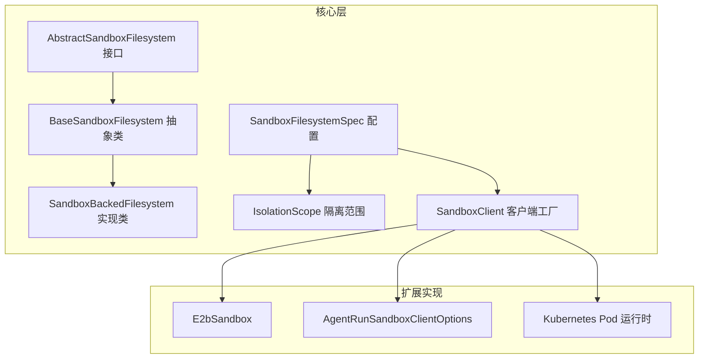
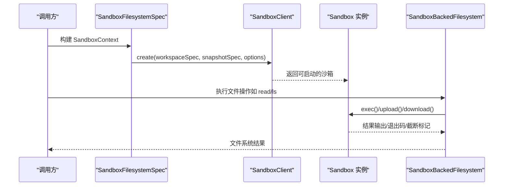
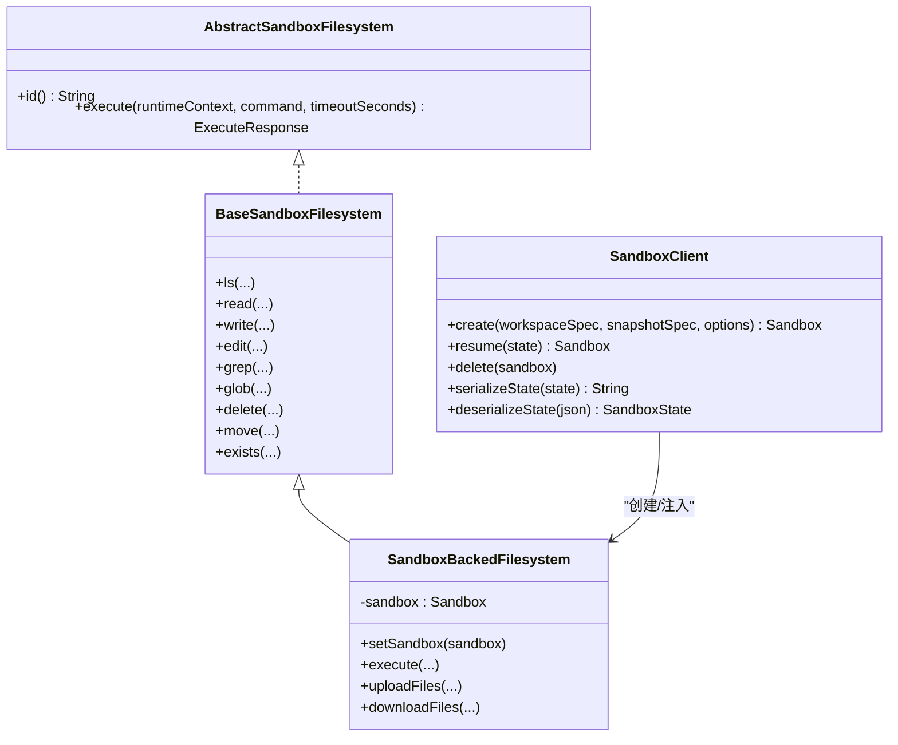
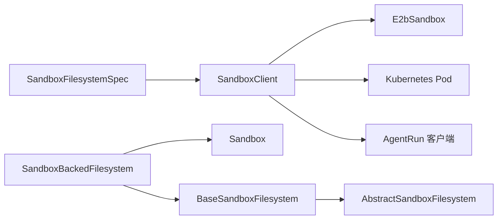

# 沙箱文件系统实现

<cite>
**本文引用的文件**
- [AbstractSandboxFilesystem.java](file://agentscope-harness/src/main/java/io/agentscope/harness/agent/filesystem/sandbox/AbstractSandboxFilesystem.java)
- [BaseSandboxFilesystem.java](file://agentscope-harness/src/main/java/io/agentscope/harness/agent/filesystem/sandbox/BaseSandboxFilesystem.java)
- [SandboxBackedFilesystem.java](file://agentscope-harness/src/main/java/io/agentscope/harness/agent/filesystem/sandbox/SandboxBackedFilesystem.java)
- [SandboxFilesystemSpec.java](file://agentscope-harness/src/main/java/io/agentscope/harness/agent/filesystem/spec/SandboxFilesystemSpec.java)
- [IsolationScope.java](file://agentscope-harness/src/main/java/io/agentscope/harness/agent/IsolationScope.java)
- [SandboxClient.java](file://agentscope-harness/src/main/java/io/agentscope/harness/agent/sandbox/SandboxClient.java)
- [E2bSandbox.java](file://agentscope-extensions/agentscope-extensions-sandbox/agentscope-extensions-sandbox-e2b/src/main/java/io/agentscope/extensions/sandbox/e2b/E2bSandbox.java)
- [E2bSandboxClientOptions.java](file://agentscope-extensions/agentscope-extensions-sandbox/agentscope-extensions-sandbox-e2b/src/main/java/io/agentscope/extensions/sandbox/e2b/E2bSandboxClientOptions.java)
- [E2bSandboxState.java](file://agentscope-extensions/agentscope-extensions-sandbox/agentscope-extensions-sandbox-e2b/src/main/java/io/agentscope/extensions/sandbox/e2b/E2bSandboxState.java)
- [E2bPersistenceMode.java](file://agentscope-extensions/agentscope-extensions-sandbox/agentscope-extensions-sandbox-e2b/src/main/java/io/agentscope/extensions/sandbox/e2b/E2bPersistenceMode.java)
- [AgentRunSandboxClientOptions.java](file://agentscope-extensions/agentscope-extensions-sandbox/agentscope-extensions-sandbox-agentrun/src/main/java/io/agentscope/extensions/sandbox/agentrun/AgentRunSandboxClientOptions.java)
- [AgentRunOptionsValidationTest.java](file://agentscope-extensions/agentscope-extensions-sandbox/agentscope-extensions-sandbox-agentrun/src/test/java/io/agentscope/extensions/sandbox/agentrun/AgentRunOptionsValidationTest.java)
- [Fabric8KubernetesPodRuntime.java](file://agentscope-extensions/agentscope-extensions-sandbox/agentscope-extensions-sandbox-kubernetes/src/main/java/io/agentscope/extensions/sandbox/kubernetes/Fabric8KubernetesPodRuntime.java)
- [filesystem.md](file://docs/v1/en/docs/harness/filesystem.md)
- [going-to-production.md](file://docs/v2/zh/docs/others/going-to-production.md)
</cite>

## 目录
1. [引言](#引言)
2. [项目结构](#项目结构)
3. [核心组件](#核心组件)
4. [架构总览](#架构总览)
5. [详细组件分析](#详细组件分析)
6. [依赖分析](#依赖分析)
7. [性能考虑](#性能考虑)
8. [故障排查指南](#故障排查指南)
9. [结论](#结论)
10. [附录](#附录)

## 引言
本文件面向“沙箱文件系统实现”的API与设计文档，聚焦以下目标：
- 解释沙箱文件系统的隔离机制与安全边界
- 说明 AbstractSandboxFilesystem 基类的设计与扩展点
- 说明沙箱文件系统的挂载策略、权限控制与资源限制
- 提供不同沙箱实现的配置方法与性能特性对比
- 包含沙箱逃逸防护、监控审计与故障恢复的实现细节

## 项目结构
围绕沙箱文件系统的相关模块主要分布在以下位置：
- 核心抽象与实现：agentscope-harness 中的 sandbox 与 filesystem 子包
- 具体沙箱实现：agentscope-extensions 下的 e2b、agentrun、kubernetes 等子模块
- 文档与示例：docs 目录下的用户文档与示例工程

图表来源
- [AbstractSandboxFilesystem.java:27-46](file://agentscope-harness/src/main/java/io/agentscope/harness/agent/filesystem/sandbox/AbstractSandboxFilesystem.java#L27-L46)
- [BaseSandboxFilesystem.java:55-55](file://agentscope-harness/src/main/java/io/agentscope/harness/agent/filesystem/sandbox/BaseSandboxFilesystem.java#L55-L55)
- [SandboxBackedFilesystem.java:41-41](file://agentscope-harness/src/main/java/io/agentscope/harness/agent/filesystem/sandbox/SandboxBackedFilesystem.java#L41-L41)
- [SandboxFilesystemSpec.java:39-142](file://agentscope-harness/src/main/java/io/agentscope/harness/agent/filesystem/spec/SandboxFilesystemSpec.java#L39-L142)
- [IsolationScope.java:53-87](file://agentscope-harness/src/main/java/io/agentscope/harness/agent/IsolationScope.java#L53-L87)
- [SandboxClient.java:25-44](file://agentscope-harness/src/main/java/io/agentscope/harness/agent/sandbox/SandboxClient.java#L25-L44)
- [E2bSandbox.java:40-57](file://agentscope-extensions/agentscope-extensions-sandbox/agentscope-extensions-sandbox-e2b/src/main/java/io/agentscope/extensions/sandbox/e2b/E2bSandbox.java#L40-L57)
- [AgentRunSandboxClientOptions.java:60-86](file://agentscope-extensions/agentscope-extensions-sandbox/agentscope-extensions-sandbox-agentrun/src/main/java/io/agentscope/extensions/sandbox/agentrun/AgentRunSandboxClientOptions.java#L60-L86)
- [Fabric8KubernetesPodRuntime.java:271-299](file://agentscope-extensions/agentscope-extensions-sandbox/agentscope-extensions-sandbox-kubernetes/src/main/java/io/agentscope/extensions/sandbox/kubernetes/Fabric8KubernetesPodRuntime.java#L271-L299)

章节来源
- [filesystem.md:40-98](file://docs/v1/en/docs/harness/filesystem.md#L40-L98)

## 核心组件
- AbstractSandboxFilesystem：在通用文件系统能力之上，增加唯一标识 id() 与命令执行 execute() 能力，作为所有沙箱文件系统的统一接口。
- BaseSandboxFilesystem：以 execute() 为核心抽象方法，提供 ls/read/grep/glob/edit/write/delete/move/exists 等默认实现，通过远程 shell 与上传下载完成文件操作。
- SandboxBackedFilesystem：基于运行中的 Sandbox 实例进行委托执行，适配 SandboxAware 生命周期注入，负责命令执行、文件上传下载与错误映射。
- SandboxFilesystemSpec：声明式配置，描述如何构建沙箱文件系统，包括隔离范围、快照策略、工作区投影等。
- IsolationScope：定义多级隔离范围（SESSION/USER/AGENT/GLOBAL），决定状态持久化键与命名空间前缀。
- SandboxClient：沙箱生命周期管理的工厂接口，负责创建、恢复、删除沙箱实例及序列化状态。

章节来源
- [AbstractSandboxFilesystem.java:27-46](file://agentscope-harness/src/main/java/io/agentscope/harness/agent/filesystem/sandbox/AbstractSandboxFilesystem.java#L27-L46)
- [BaseSandboxFilesystem.java:38-54](file://agentscope-harness/src/main/java/io/agentscope/harness/agent/filesystem/sandbox/BaseSandboxFilesystem.java#L38-L54)
- [SandboxBackedFilesystem.java:34-41](file://agentscope-harness/src/main/java/io/agentscope/harness/agent/filesystem/sandbox/SandboxBackedFilesystem.java#L34-L41)
- [SandboxFilesystemSpec.java:33-95](file://agentscope-harness/src/main/java/io/agentscope/harness/agent/filesystem/spec/SandboxFilesystemSpec.java#L33-L95)
- [IsolationScope.java:23-52](file://agentscope-harness/src/main/java/io/agentscope/harness/agent/IsolationScope.java#L23-L52)
- [SandboxClient.java:20-44](file://agentscope-harness/src/main/java/io/agentscope/harness/agent/sandbox/SandboxClient.java#L20-L44)

## 架构总览
沙箱文件系统通过“配置规范 + 客户端工厂 + 具体沙箱实现 + 文件系统代理”形成闭环：
- SandboxFilesystemSpec 描述如何创建 SandboxContext（含隔离范围、快照、工作区）
- SandboxClient 创建/恢复具体 Sandbox 实例（如 E2B、Kubernetes）
- SandboxBackedFilesystem 在每次调用中注入活跃 Sandbox，执行命令与文件传输
- BaseSandboxFilesystem 将高层文件操作转换为 shell 命令与二进制传输

图表来源
- [SandboxFilesystemSpec.java:110-121](file://agentscope-harness/src/main/java/io/agentscope/harness/agent/filesystem/spec/SandboxFilesystemSpec.java#L110-L121)
- [SandboxClient.java:25-44](file://agentscope-harness/src/main/java/io/agentscope/harness/agent/sandbox/SandboxClient.java#L25-L44)
- [SandboxBackedFilesystem.java:68-88](file://agentscope-harness/src/main/java/io/agentscope/harness/agent/filesystem/sandbox/SandboxBackedFilesystem.java#L68-L88)

## 详细组件分析

### AbstractSandboxFilesystem 设计与扩展点
- 角色定位：在通用文件系统能力之上，增加 id() 与 execute()，用于区分不同沙箱实例与执行宿主命令。
- 扩展点：
  - execute()：由具体沙箱实现命令执行（可为远程容器、K8s Pod 或云平台沙箱）
  - id()：返回稳定标识，便于日志追踪与审计
- 与上层的关系：BaseSandboxFilesystem 通过 delegate 到 execute() 实现 ls/read/grep/glob/edit/write 等高级操作。

章节来源
- [AbstractSandboxFilesystem.java:27-46](file://agentscope-harness/src/main/java/io/agentscope/harness/agent/filesystem/sandbox/AbstractSandboxFilesystem.java#L27-L46)

### BaseSandboxFilesystem 默认实现策略
- 核心思想：以 execute() 为核心，其他文件操作通过 shell 命令与上传下载实现。
- 关键方法族：
  - ls：遍历目录，解析 stat 输出生成 FileInfo 列表
  - read：文本文件按行切片读取；非文本文件采用 base64 编码
  - write：先校验路径不存在，再通过 uploadFiles 传输内容
  - edit：通过 Python3 在沙箱内执行字符串替换，支持单次/全部替换
  - grep/glob：使用标准工具在指定路径与模式下检索
  - delete/move：通过 rm/mv 命令执行
  - exists：通过 test -e 判断存在性
- 复杂度与性能：
  - ls/glob/grep 依赖远程 shell 与文件系统扫描，I/O 成本与路径规模、文件数量相关
  - read 对大文件建议分页读取（limit>0），避免一次性传输过多数据
  - write 通过 uploadFiles 传输，适合小文件；大文件建议分块或直接写入
- 错误处理：对 exitCode 非零、异常与截断进行统一封装，返回 ReadResult/WriteResult/EditResult/GrepResult/GlobResult 等结果对象

章节来源
- [BaseSandboxFilesystem.java:72-452](file://agentscope-harness/src/main/java/io/agentscope/harness/agent/filesystem/sandbox/BaseSandboxFilesystem.java#L72-L452)

### SandboxBackedFilesystem 代理与生命周期
- 代理职责：在每次调用中从 SandboxAware 注入的 volatile Sandbox 获取活跃实例，执行命令与文件传输。
- 命令执行：捕获超时与执行异常，映射为 ExecuteResponse，包含组合输出、退出码与截断标记。
- 文件传输：uploadFiles 使用 base64 写入；downloadFiles 使用 base64 读取并解码为字节流。
- 生命周期：依赖 SandboxLifecycleMiddleware 注入 Sandbox，确保每次调用均获得最新实例。

图表来源
- [AbstractSandboxFilesystem.java:27-46](file://agentscope-harness/src/main/java/io/agentscope/harness/agent/filesystem/sandbox/AbstractSandboxFilesystem.java#L27-L46)
- [BaseSandboxFilesystem.java:55-55](file://agentscope-harness/src/main/java/io/agentscope/harness/agent/filesystem/sandbox/BaseSandboxFilesystem.java#L55-L55)
- [SandboxBackedFilesystem.java:41-41](file://agentscope-harness/src/main/java/io/agentscope/harness/agent/filesystem/sandbox/SandboxBackedFilesystem.java#L41-L41)
- [SandboxClient.java:25-44](file://agentscope-harness/src/main/java/io/agentscope/harness/agent/sandbox/SandboxClient.java#L25-L44)

章节来源
- [SandboxBackedFilesystem.java:34-183](file://agentscope-harness/src/main/java/io/agentscope/harness/agent/filesystem/sandbox/SandboxBackedFilesystem.java#L34-L183)

### SandboxFilesystemSpec 配置与工作区投影
- 配置项：
  - isolationScope：隔离范围（SESSION/USER/AGENT/GLOBAL）
  - snapshotSpec：快照策略（持久化工作区）
  - executionGuard：并发执行串行化（仅在 AGENT/GLOBAL 有意义）
  - workspaceProjectionEnabled/workspaceProjectionRoots：启用工作区投影与包含根
- 工作区投影：将宿主机工作区的部分目录映射到沙箱，提升开发体验与一致性
- 快照策略：生产推荐使用分布式快照（如 OSS/Redis/JDBC），避免容器重启导致状态丢失

章节来源
- [SandboxFilesystemSpec.java:39-142](file://agentscope-harness/src/main/java/io/agentscope/harness/agent/filesystem/spec/SandboxFilesystemSpec.java#L39-L142)
- [going-to-production.md:279-292](file://docs/v2/zh/docs/others/going-to-production.md#L279-L292)

### IsolationScope 隔离机制与命名空间
- 隔离语义：同一作用域内的多次调用共享同一 sandbox 状态（顺序复用，非并发共享）
- 命名空间：针对远程文件系统，IsolationScope 决定 KV 存储的命名空间前缀
- 默认行为：USER 为默认隔离级别；当缺少 userId 时回退到 SESSION

章节来源
- [IsolationScope.java:23-52](file://agentscope-harness/src/main/java/io/agentscope/harness/agent/IsolationScope.java#L23-L52)
- [IsolationScope.java:102-126](file://agentscope-harness/src/main/java/io/agentscope/harness/agent/IsolationScope.java#L102-L126)

### 不同沙箱实现与配置要点

#### E2B 沙箱
- 特性：基于云平台沙箱，支持 tar 快照与原生快照两种持久化模式
- 关键选项：
  - apiKey、apiBaseUrl、domain、templateId、workspaceRoot
  - persistenceMode：TAR/NATIVE_SNAPSHOT
- 生命周期：通过 E2bPlatformHttp 与平台交互，Envd 进程执行命令，支持二进制 stdout 流式传输

章节来源
- [E2bSandbox.java:40-57](file://agentscope-extensions/agentscope-extensions-sandbox/agentscope-extensions-sandbox-e2b/src/main/java/io/agentscope/extensions/sandbox/e2b/E2bSandbox.java#L40-L57)
- [E2bSandboxClientOptions.java:23-34](file://agentscope-extensions/agentscope-extensions-sandbox/agentscope-extensions-sandbox-e2b/src/main/java/io/agentscope/extensions/sandbox/e2b/E2bSandboxClientOptions.java#L23-L34)
- [E2bSandboxState.java:21-43](file://agentscope-extensions/agentscope-extensions-sandbox/agentscope-extensions-sandbox-e2b/src/main/java/io/agentscope/extensions/sandbox/e2b/E2bSandboxState.java#L21-L43)
- [E2bPersistenceMode.java:19-27](file://agentscope-extensions/agentscope-extensions-sandbox/agentscope-extensions-sandbox-e2b/src/main/java/io/agentscope/extensions/sandbox/e2b/E2bPersistenceMode.java#L19-L27)

#### AgentRun 沙箱
- 配置要点：
  - apiKey、templateName、mcpServerUrl
  - NAS/OSS 挂载目录白名单校验，防止逃逸
- 校验逻辑：对挂载目录进行约束，仅允许预设的安全路径

章节来源
- [AgentRunSandboxClientOptions.java:60-86](file://agentscope-extensions/agentscope-extensions-sandbox/agentscope-extensions-sandbox-agentrun/src/main/java/io/agentscope/extensions/sandbox/agentrun/AgentRunSandboxClientOptions.java#L60-L86)
- [AgentRunOptionsValidationTest.java:66-89](file://agentscope-extensions/agentscope-extensions-sandbox/agentscope-extensions-sandbox-agentrun/src/test/java/io/agentscope/extensions/sandbox/agentrun/AgentRunOptionsValidationTest.java#L66-L89)

#### Kubernetes 沙箱
- 挂载策略：通过 HostPath/HostPath 类型将宿主机目录绑定到 Pod
- 绑定流程：统计 hostPath 类型（Directory/File），构造 Volume 并挂载到沙箱容器

章节来源
- [Fabric8KubernetesPodRuntime.java:271-299](file://agentscope-extensions/agentscope-extensions-sandbox/agentscope-extensions-sandbox-kubernetes/src/main/java/io/agentscope/extensions/sandbox/kubernetes/Fabric8KubernetesPodRuntime.java#L271-L299)

### 权限控制与资源限制
- 权限控制：
  - 命名空间前缀：IsolationScope 决定远程文件系统命名空间，避免跨用户/会话访问
  - 挂载白名单：AgentRun 对 NAS/OSS 挂载目录进行校验，防止逃逸至敏感路径
  - Shell 命令限制：BaseSandboxFilesystem 通过 shell 命令与 Python3 辅助脚本执行，需结合沙箱运行环境的用户权限
- 资源限制：
  - 命令超时：execute 支持超时参数，避免长时间阻塞
  - 并发串行化：executionGuard 在 AGENT/GLOBAL 范围内串行化执行，降低竞争风险
  - 快照策略：通过分布式快照减少容器重启带来的状态丢失与重建成本

章节来源
- [SandboxFilesystemSpec.java:76-95](file://agentscope-harness/src/main/java/io/agentscope/harness/agent/filesystem/spec/SandboxFilesystemSpec.java#L76-L95)
- [AgentRunSandboxClientOptions.java:78-86](file://agentscope-extensions/agentscope-extensions-sandbox/agentscope-extensions-sandbox-agentrun/src/main/java/io/agentscope/extensions/sandbox/agentrun/AgentRunSandboxClientOptions.java#L78-L86)
- [BaseSandboxFilesystem.java:114-161](file://agentscope-harness/src/main/java/io/agentscope/harness/agent/filesystem/sandbox/BaseSandboxFilesystem.java#L114-L161)

### 沙箱逃逸防护
- 路径与挂载限制：AgentRun 的挂载目录白名单校验，拒绝不被允许的挂载路径
- 命令执行隔离：SandboxBackedFilesystem 通过注入的 Sandbox 执行命令，避免直接暴露宿主机 shell
- 安全边界：IsolationScope 保证不同作用域间的状态与命名空间隔离

章节来源
- [AgentRunOptionsValidationTest.java:66-89](file://agentscope-extensions/agentscope-extensions-sandbox/agentscope-extensions-sandbox-agentrun/src/test/java/io/agentscope/extensions/sandbox/agentrun/AgentRunOptionsValidationTest.java#L66-L89)
- [SandboxBackedFilesystem.java:68-88](file://agentscope-harness/src/main/java/io/agentscope/harness/agent/filesystem/sandbox/SandboxBackedFilesystem.java#L68-L88)

### 监控审计与故障恢复
- 监控审计：
  - ExecuteResponse 包含组合输出与退出码，便于记录命令执行轨迹
  - 日志记录：SandboxBackedFilesystem 对异常进行日志记录，便于问题定位
- 故障恢复：
  - 快照恢复：SandboxFilesystemSpec 支持快照策略，容器重启后可从快照恢复工作区
  - 分布式快照：推荐使用 OSS/Redis/JDBC 等分布式存储，提高可用性与一致性

章节来源
- [SandboxBackedFilesystem.java:75-87](file://agentscope-harness/src/main/java/io/agentscope/harness/agent/filesystem/sandbox/SandboxBackedFilesystem.java#L75-L87)
- [going-to-production.md:279-292](file://docs/v2/zh/docs/others/going-to-production.md#L279-L292)

## 依赖分析
- 组件耦合：
  - SandboxBackedFilesystem 依赖 SandboxClient 与 Sandbox 接口，形成“配置 → 客户端 → 实例”的链路
  - BaseSandboxFilesystem 依赖 AbstractSandboxFilesystem 的 execute()，并通过 FilesystemUtils 进行 shell 转义与工具函数
- 外部依赖：
  - E2B：HTTP 客户端、JSON 序列化、Envd 进程通信
  - Kubernetes：Fabric8 客户端用于 Pod/Volume 构造与挂载
  - AgentRun：挂载目录白名单校验逻辑

图表来源
- [SandboxFilesystemSpec.java:110-121](file://agentscope-harness/src/main/java/io/agentscope/harness/agent/filesystem/spec/SandboxFilesystemSpec.java#L110-L121)
- [SandboxClient.java:25-44](file://agentscope-harness/src/main/java/io/agentscope/harness/agent/sandbox/SandboxClient.java#L25-L44)
- [SandboxBackedFilesystem.java:41-41](file://agentscope-harness/src/main/java/io/agentscope/harness/agent/filesystem/sandbox/SandboxBackedFilesystem.java#L41-L41)
- [BaseSandboxFilesystem.java:55-55](file://agentscope-harness/src/main/java/io/agentscope/harness/agent/filesystem/sandbox/BaseSandboxFilesystem.java#L55-L55)
- [AbstractSandboxFilesystem.java:27-46](file://agentscope-harness/src/main/java/io/agentscope/harness/agent/filesystem/sandbox/AbstractSandboxFilesystem.java#L27-L46)

## 性能考虑
- I/O 模式：
  - ls/glob/grep 依赖远程 shell 与文件系统扫描，建议限制搜索范围与深度
  - read 支持分页读取（limit>0），避免一次性传输大文件
- 传输效率：
  - write 通过 uploadFiles 传输，适合小文件；大文件建议分块或直接写入
  - downloadFiles 采用 base64 解码，注意内存占用
- 并发与隔离：
  - executionGuard 在 AGENT/GLOBAL 范围内串行化执行，避免状态竞争
- 快照策略：
  - 生产推荐分布式快照（OSS/Redis/JDBC），减少容器重启带来的重建成本

## 故障排查指南
- 常见问题与定位：
  - 命令超时：检查 timeout 参数与网络状况；查看 ExecuteResponse 的退出码与截断标记
  - 文件不存在：read 返回 file_not_found；确认路径与权限
  - 编辑冲突：edit 返回 multiple_occurrences，使用 replaceAll=true 替换全部
  - 挂载失败：AgentRun 挂载目录不在白名单，检查配置并修正
- 日志与审计：
  - SandboxBackedFilesystem 记录内部异常与错误输出，便于定位
  - 快照恢复失败：检查分布式快照存储连通性与权限

章节来源
- [SandboxBackedFilesystem.java:75-87](file://agentscope-harness/src/main/java/io/agentscope/harness/agent/filesystem/sandbox/SandboxBackedFilesystem.java#L75-L87)
- [BaseSandboxFilesystem.java:149-155](file://agentscope-harness/src/main/java/io/agentscope/harness/agent/filesystem/sandbox/BaseSandboxFilesystem.java#L149-L155)
- [BaseSandboxFilesystem.java:255-281](file://agentscope-harness/src/main/java/io/agentscope/harness/agent/filesystem/sandbox/BaseSandboxFilesystem.java#L255-L281)
- [AgentRunOptionsValidationTest.java:66-89](file://agentscope-extensions/agentscope-extensions-sandbox/agentscope-extensions-sandbox-agentrun/src/test/java/io/agentscope/extensions/sandbox/agentrun/AgentRunOptionsValidationTest.java#L66-L89)

## 结论
沙箱文件系统通过“声明式配置 + 客户端工厂 + 代理执行 + 默认实现策略”的架构，在保证隔离与安全的前提下，提供了统一的文件系统 API。不同沙箱实现（E2B/Kubernetes/AgentRun）在挂载策略、权限控制与资源限制方面各有侧重，结合快照与并发串行化策略，可在生产环境中实现高可用与可观测性。

## 附录
- 相关文档与示例：
  - 沙箱文件系统类层次与实现快速参考
  - 多租户命名空间工厂与隔离范围说明

章节来源
- [filesystem.md:40-98](file://docs/v1/en/docs/harness/filesystem.md#L40-L98)