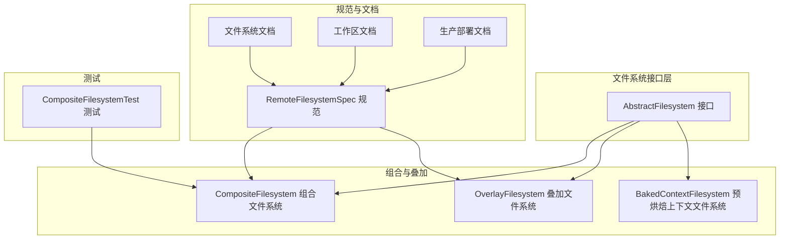
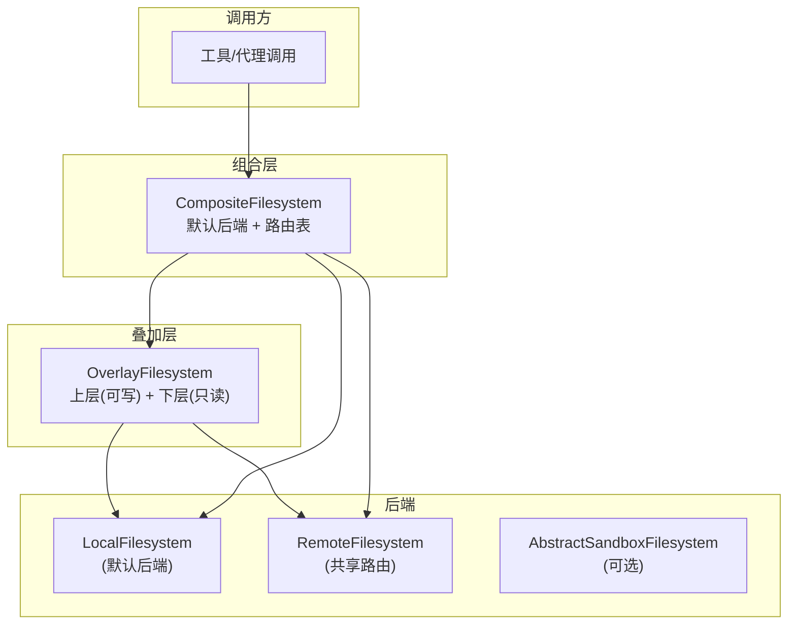
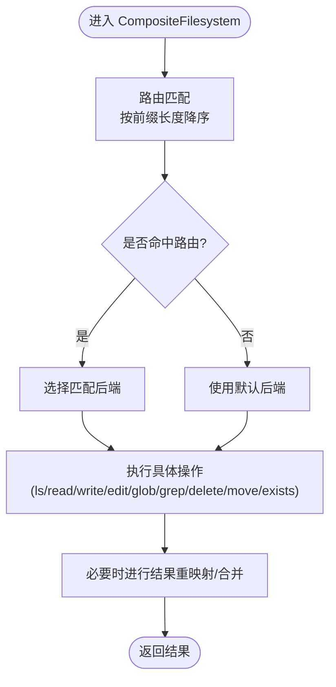
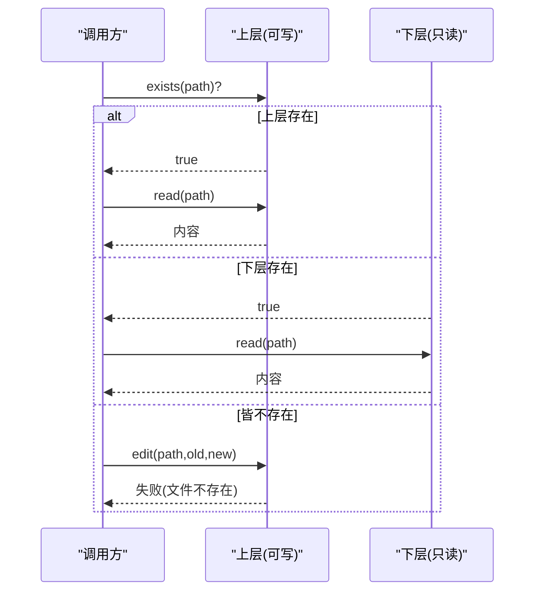
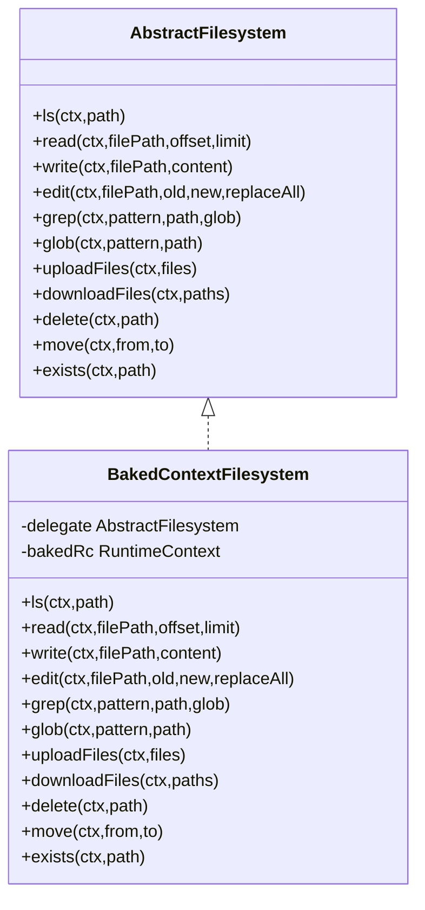
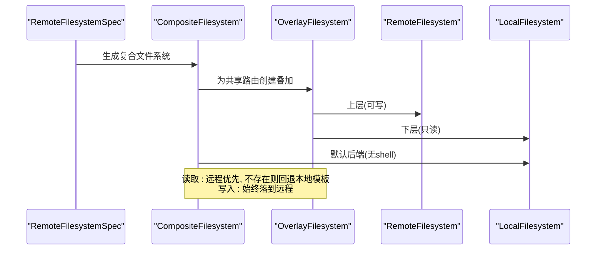
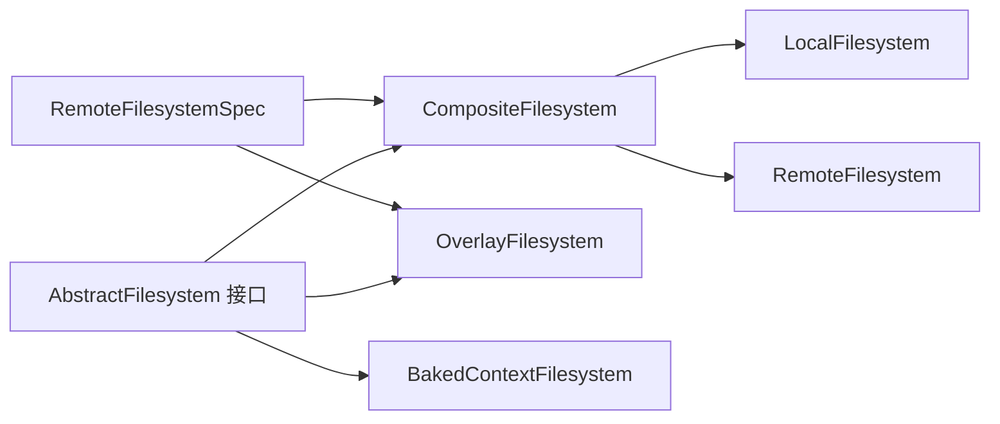

# 组合文件系统实现

<cite>
**本文引用的文件**
- [CompositeFilesystem.java](file://agentscope-harness/src/main/java/io/agentscope/harness/agent/filesystem/CompositeFilesystem.java)
- [OverlayFilesystem.java](file://agentscope-harness/src/main/java/io/agentscope/harness/agent/filesystem/OverlayFilesystem.java)
- [BakedContextFilesystem.java](file://agentscope-harness/src/main/java/io/agentscope/harness/agent/filesystem/BakedContextFilesystem.java)
- [AbstractFilesystem.java](file://agentscope-harness/src/main/java/io/agentscope/harness/agent/filesystem/AbstractFilesystem.java)
- [RemoteFilesystemSpec.java](file://agentscope-harness/src/main/java/io/agentscope/harness/agent/filesystem/spec/RemoteFilesystemSpec.java)
- [filesystem.md](file://docs/v2/zh/docs/harness/filesystem.md)
- [workspace.md](file://docs/v2/zh/docs/harness/workspace.md)
- [going-to-production.md](file://docs/v2/zh/docs/others/going-to-production.md)
- [CompositeFilesystemTest.java](file://agentscope-harness/src/test/java/io/agentscope/harness/agent/filesystem/CompositeFilesystemTest.java)
</cite>

## 目录
1. [简介](#简介)
2. [项目结构](#项目结构)
3. [核心组件](#核心组件)
4. [架构总览](#架构总览)
5. [详细组件分析](#详细组件分析)
6. [依赖关系分析](#依赖关系分析)
7. [性能考量](#性能考量)
8. [故障排查指南](#故障排查指南)
9. [结论](#结论)
10. [附录](#附录)

## 简介
本文件系统实现围绕“组合模式”构建，通过将多个文件系统后端进行路由与叠加，实现多文件系统协同工作。核心包括：
- CompositeFilesystem：基于前缀路由的组合文件系统，支持默认后端与多条路由，写操作总是穿透到对应后端，读操作遵循“命中即止”的优先级规则。
- OverlayFilesystem：上层（可写）与下层（只读）叠加，提供 copy-on-write 语义，读优先上层，写只在上层发生，删除共享层文件被禁止。
- BakedContextFilesystem：将调用方传入的 RuntimeContext“烘焙”固化到文件系统操作中，使所有操作均在固定上下文中执行，便于测试与一致性控制。

此外，RemoteFilesystemSpec 将上述组件整合为“远程模式”，形成“默认本地兜底 + 多路由叠加”的复合架构，并在文档中描述了“两层读取”与“覆盖文件系统”的设计思想。

## 项目结构
文件系统相关代码位于 agentscope-harness 模块的 filesystem 包中，配合 spec 子包与测试用例共同构成完整的实现与验证体系。

**图表来源**
- [AbstractFilesystem.java:44-186](file://agentscope-harness/src/main/java/io/agentscope/harness/agent/filesystem/AbstractFilesystem.java#L44-L186)
- [CompositeFilesystem.java:64-518](file://agentscope-harness/src/main/java/io/agentscope/harness/agent/filesystem/CompositeFilesystem.java#L64-L518)
- [OverlayFilesystem.java:56-302](file://agentscope-harness/src/main/java/io/agentscope/harness/agent/filesystem/OverlayFilesystem.java#L56-L302)
- [BakedContextFilesystem.java:41-113](file://agentscope-harness/src/main/java/io/agentscope/harness/agent/filesystem/BakedContextFilesystem.java#L41-L113)
- [RemoteFilesystemSpec.java:75-200](file://agentscope-harness/src/main/java/io/agentscope/harness/agent/filesystem/spec/RemoteFilesystemSpec.java#L75-L200)
- [filesystem.md:1-519](file://docs/v2/zh/docs/harness/filesystem.md#L1-L519)
- [workspace.md:222-270](file://docs/v2/zh/docs/harness/workspace.md#L222-L270)
- [going-to-production.md:199-222](file://docs/v2/zh/docs/others/going-to-production.md#L199-L222)
- [CompositeFilesystemTest.java:1-218](file://agentscope-harness/src/test/java/io/agentscope/harness/agent/filesystem/CompositeFilesystemTest.java#L1-L218)

**章节来源**
- [AbstractFilesystem.java:44-186](file://agentscope-harness/src/main/java/io/agentscope/harness/agent/filesystem/AbstractFilesystem.java#L44-L186)
- [CompositeFilesystem.java:64-518](file://agentscope-harness/src/main/java/io/agentscope/harness/agent/filesystem/CompositeFilesystem.java#L64-L518)
- [OverlayFilesystem.java:56-302](file://agentscope-harness/src/main/java/io/agentscope/harness/agent/filesystem/OverlayFilesystem.java#L56-L302)
- [BakedContextFilesystem.java:41-113](file://agentscope-harness/src/main/java/io/agentscope/harness/agent/filesystem/BakedContextFilesystem.java#L41-L113)
- [RemoteFilesystemSpec.java:75-200](file://agentscope-harness/src/main/java/io/agentscope/harness/agent/filesystem/spec/RemoteFilesystemSpec.java#L75-L200)
- [filesystem.md:1-519](file://docs/v2/zh/docs/harness/filesystem.md#L1-L519)
- [workspace.md:222-270](file://docs/v2/zh/docs/harness/workspace.md#L222-L270)
- [going-to-production.md:199-222](file://docs/v2/zh/docs/others/going-to-production.md#L199-L222)
- [CompositeFilesystemTest.java:1-218](file://agentscope-harness/src/test/java/io/agentscope/harness/agent/filesystem/CompositeFilesystemTest.java#L1-L218)

## 核心组件
- 组合文件系统（CompositeFilesystem）
  - 通过前缀路由将不同路径映射到不同的后端，写操作总是定向到匹配路由的后端；读操作按路由顺序匹配，命中即返回；默认后端用于兜底。
  - 支持 ls、read、write、edit、grep、glob、uploadFiles、downloadFiles、delete、move、exists 等完整文件系统操作。
  - 路由排序按前缀长度降序，确保更精确的前缀优先匹配。
- 叠加文件系统（OverlayFilesystem）
  - 上层为可写层，下层为只读层；读取优先上层，不存在则回退下层；写入与编辑始终发生在上层（必要时触发 copy-on-write）；删除共享层文件被拒绝；move 在上层存在时直接移动，否则复制到上层。
  - 提供 of 工厂方法，当上层具备沙箱能力时自动返回 ShellAwareOverlay，保持 instanceof 判断的有效性。
- 预烘焙上下文文件系统（BakedContextFilesystem）
  - 将外部传入的 RuntimeContext“烘焙”到内部，所有文件系统操作均使用该固定上下文，便于测试与一致性控制。
- 文件系统接口（AbstractFilesystem）
  - 定义统一的文件系统操作契约，所有实现均接受 RuntimeContext 以便按会话、用户或沙箱范围进行作用域限定。
- 远程文件系统规范（RemoteFilesystemSpec）
  - 生成“组合 + 叠加”的复合文件系统：默认后端为本地文件系统（无 shell），共享路径通过 OverlayFilesystem 路由到远程存储；支持多种隔离维度（按用户、会话、代理、全局）。

**章节来源**
- [CompositeFilesystem.java:64-518](file://agentscope-harness/src/main/java/io/agentscope/harness/agent/filesystem/CompositeFilesystem.java#L64-L518)
- [OverlayFilesystem.java:56-302](file://agentscope-harness/src/main/java/io/agentscope/harness/agent/filesystem/OverlayFilesystem.java#L56-L302)
- [BakedContextFilesystem.java:41-113](file://agentscope-harness/src/main/java/io/agentscope/harness/agent/filesystem/BakedContextFilesystem.java#L41-L113)
- [AbstractFilesystem.java:44-186](file://agentscope-harness/src/main/java/io/agentscope/harness/agent/filesystem/AbstractFilesystem.java#L44-L186)
- [RemoteFilesystemSpec.java:75-200](file://agentscope-harness/src/main/java/io/agentscope/harness/agent/filesystem/spec/RemoteFilesystemSpec.java#L75-L200)

## 架构总览
组合文件系统通过“默认后端 + 路由表”的方式，将不同路径空间映射到不同的后端（如本地、远程、沙箱等）。OverlayFilesystem 则在“用户层”与“共享层”之间提供 copy-on-write 的叠加语义，确保用户修改不影响共享模板。

**图表来源**
- [CompositeFilesystem.java:64-518](file://agentscope-harness/src/main/java/io/agentscope/harness/agent/filesystem/CompositeFilesystem.java#L64-L518)
- [OverlayFilesystem.java:56-302](file://agentscope-harness/src/main/java/io/agentscope/harness/agent/filesystem/OverlayFilesystem.java#L56-L302)
- [RemoteFilesystemSpec.java:75-200](file://agentscope-harness/src/main/java/io/agentscope/harness/agent/filesystem/spec/RemoteFilesystemSpec.java#L75-L200)

## 详细组件分析

### 组合文件系统（CompositeFilesystem）
- 路由机制
  - 路由表按前缀长度降序排列，确保更精确的匹配优先；支持“精确文件路由”（不含尾随斜杠）与“目录路由”（含尾随斜杠）两种形式。
  - 路径规范化：读写双方均可接受带/或不带/的路径，内部统一处理，避免因调用约定差异导致的路由不一致。
  - 路径重映射：对 ls/glob/grep 返回结果进行前缀重映射，使外部看到的路径与注册路由一致。
- 读写策略
  - read/write/edit/delete/move/exists：均委托给匹配路由的后端；move 在跨后端时采用“读-写-删”序列。
  - ls：若命中路由，返回该后端结果并重映射；若查询根目录“/”或当前目录“.”，则合并默认后端与所有路由的可见项。
  - glob：根目录递归匹配时，对“精确文件路由”采用“直接匹配”策略，确保根层文件也能被发现。
  - grep：支持按路径与 glob 过滤，命中路由时仅对该后端执行；未指定路径时对默认后端与所有路由执行并合并。
- 性能与一致性
  - 路由批处理：uploadFiles/downloadFiles 将同后端的请求聚合，减少跨后端调用次数。
  - 错误传播：上传/下载等批量操作中，后端返回的错误会按原始索引准确映射回调用者视角的路径。

**图表来源**
- [CompositeFilesystem.java:93-518](file://agentscope-harness/src/main/java/io/agentscope/harness/agent/filesystem/CompositeFilesystem.java#L93-L518)

**章节来源**
- [CompositeFilesystem.java:64-518](file://agentscope-harness/src/main/java/io/agentscope/harness/agent/filesystem/CompositeFilesystem.java#L64-L518)
- [CompositeFilesystemTest.java:1-218](file://agentscope-harness/src/test/java/io/agentscope/harness/agent/filesystem/CompositeFilesystemTest.java#L1-L218)

### 叠加文件系统（OverlayFilesystem）
- 读写语义
  - read：上层存在则读上层，否则读下层。
  - write：始终写上层；edit 若上层存在直接编辑，若下层存在则先 copy-on-write 再编辑。
  - delete：上层存在方可删除；下层文件不可删除。
  - move：上层存在则直接移动；下层存在则复制到上层。
  - exists：任一层存在即视为存在。
- 合并策略
  - ls/glob/grep：分别合并上层与下层结果，上层优先覆盖。
  - download：上层存在则从上层下载，否则从下层下载。
- 沙箱感知
  - of 工厂方法在上层具备沙箱能力时返回 ShellAwareOverlay，保持 instanceof 判断有效。

**图表来源**
- [OverlayFilesystem.java:161-193](file://agentscope-harness/src/main/java/io/agentscope/harness/agent/filesystem/OverlayFilesystem.java#L161-L193)

**章节来源**
- [OverlayFilesystem.java:56-302](file://agentscope-harness/src/main/java/io/agentscope/harness/agent/filesystem/OverlayFilesystem.java#L56-L302)

### 预烘焙上下文文件系统（BakedContextFilesystem）
- 设计目的
  - 将外部传入的 RuntimeContext 固化到内部，使所有文件系统操作均在该固定上下文中执行，便于测试与一致性控制。
- 行为特征
  - 所有操作均以 bakedRc 作为运行时上下文，忽略调用方传入的上下文。

**图表来源**
- [BakedContextFilesystem.java:41-113](file://agentscope-harness/src/main/java/io/agentscope/harness/agent/filesystem/BakedContextFilesystem.java#L41-L113)
- [AbstractFilesystem.java:44-186](file://agentscope-harness/src/main/java/io/agentscope/harness/agent/filesystem/AbstractFilesystem.java#L44-L186)

**章节来源**
- [BakedContextFilesystem.java:41-113](file://agentscope-harness/src/main/java/io/agentscope/harness/agent/filesystem/BakedContextFilesystem.java#L41-L113)
- [AbstractFilesystem.java:44-186](file://agentscope-harness/src/main/java/io/agentscope/harness/agent/filesystem/AbstractFilesystem.java#L44-L186)

### 远程文件系统规范（RemoteFilesystemSpec）
- 生成复合文件系统
  - 默认后端：LocalFilesystem（无 shell）。
  - 共享路由：memory/、skills/、subagents/、knowledge/、plans/、agents/<agentId>/sessions/、agents/<agentId>/tasks/ 等，均通过 OverlayFilesystem 将上层指向 RemoteFilesystem，下层指向本地模板。
  - 精确文件路由：AGENTS.md、MEMORY.md、tools.json 等，同样采用 OverlayFilesystem，上层为远程，下层为本地模板。
- 隔离维度
  - 支持按 SESSION、USER、AGENT、GLOBAL 控制命名空间，与沙箱隔离语义一致。
- 两层读取
  - 读取时优先远程，不存在则退回本地模板；写入始终落到远程。

**图表来源**
- [RemoteFilesystemSpec.java:75-200](file://agentscope-harness/src/main/java/io/agentscope/harness/agent/filesystem/spec/RemoteFilesystemSpec.java#L75-L200)
- [filesystem.md:327-335](file://docs/v2/zh/docs/harness/filesystem.md#L327-L335)
- [workspace.md:235-236](file://docs/v2/zh/docs/harness/workspace.md#L235-L236)

**章节来源**
- [RemoteFilesystemSpec.java:75-200](file://agentscope-harness/src/main/java/io/agentscope/harness/agent/filesystem/spec/RemoteFilesystemSpec.java#L75-L200)
- [filesystem.md:327-335](file://docs/v2/zh/docs/harness/filesystem.md#L327-L335)
- [workspace.md:235-236](file://docs/v2/zh/docs/harness/workspace.md#L235-L236)
- [going-to-production.md:199-204](file://docs/v2/zh/docs/others/going-to-production.md#L199-L204)

## 依赖关系分析
- 组合文件系统依赖于多个后端（LocalFilesystem、RemoteFilesystem 等），通过路由表进行解耦。
- 叠加文件系统依赖于上层与下层两个 AbstractFilesystem 实例，提供 copy-on-write 语义。
- 预烘焙上下文文件系统包装任意 AbstractFilesystem，统一注入固定的 RuntimeContext。
- RemoteFilesystemSpec 生成 CompositeFilesystem 并配置 OverlayFilesystem 路由，形成“远程模式”。

**图表来源**
- [AbstractFilesystem.java:44-186](file://agentscope-harness/src/main/java/io/agentscope/harness/agent/filesystem/AbstractFilesystem.java#L44-L186)
- [CompositeFilesystem.java:64-518](file://agentscope-harness/src/main/java/io/agentscope/harness/agent/filesystem/CompositeFilesystem.java#L64-L518)
- [OverlayFilesystem.java:56-302](file://agentscope-harness/src/main/java/io/agentscope/harness/agent/filesystem/OverlayFilesystem.java#L56-L302)
- [BakedContextFilesystem.java:41-113](file://agentscope-harness/src/main/java/io/agentscope/harness/agent/filesystem/BakedContextFilesystem.java#L41-L113)
- [RemoteFilesystemSpec.java:75-200](file://agentscope-harness/src/main/java/io/agentscope/harness/agent/filesystem/spec/RemoteFilesystemSpec.java#L75-L200)

**章节来源**
- [AbstractFilesystem.java:44-186](file://agentscope-harness/src/main/java/io/agentscope/harness/agent/filesystem/AbstractFilesystem.java#L44-L186)
- [CompositeFilesystem.java:64-518](file://agentscope-harness/src/main/java/io/agentscope/harness/agent/filesystem/CompositeFilesystem.java#L64-L518)
- [OverlayFilesystem.java:56-302](file://agentscope-harness/src/main/java/io/agentscope/harness/agent/filesystem/OverlayFilesystem.java#L56-L302)
- [BakedContextFilesystem.java:41-113](file://agentscope-harness/src/main/java/io/agentscope/harness/agent/filesystem/BakedContextFilesystem.java#L41-L113)
- [RemoteFilesystemSpec.java:75-200](file://agentscope-harness/src/main/java/io/agentscope/harness/agent/filesystem/spec/RemoteFilesystemSpec.java#L75-L200)

## 性能考量
- 路由批处理
  - CompositeFilesystem 在 uploadFiles/downloadFiles 中按后端聚合请求，减少跨后端调用次数，提升吞吐。
- 结果重映射与合并
  - ls/glob/grep 的结果重映射与合并逻辑避免重复扫描，提高响应速度。
- 精确文件路由的直接匹配
  - 在 glob 根目录递归匹配时，对“精确文件路由”采用直接匹配策略，确保根层文件被正确发现，避免 UI 树缺失。
- 索引加速
  - RemoteFilesystemSpec 支持 WorkspaceIndex，可显著加速 ls/glob/exists/grep 等操作；未启用时回退全表扫描。

**章节来源**
- [CompositeFilesystem.java:390-453](file://agentscope-harness/src/main/java/io/agentscope/harness/agent/filesystem/CompositeFilesystem.java#L390-L453)
- [CompositeFilesystemTest.java:164-200](file://agentscope-harness/src/test/java/io/agentscope/harness/agent/filesystem/CompositeFilesystemTest.java#L164-L200)
- [going-to-production.md:205-212](file://docs/v2/zh/docs/others/going-to-production.md#L205-L212)

## 故障排查指南
- 路由不一致问题
  - 确认写入与读取两端是否使用相同的路径约定（带/或不带/），CompositeFilesystem 已做路径规范化，但需确保调用方保持一致。
- 跨后端 move 失败
  - 当源与目标位于不同后端时，move 会退化为“读-写-删”序列；若读取失败或写入失败，将返回相应错误信息。
- 删除共享层文件失败
  - OverlayFilesystem 不允许删除下层共享文件；如需变更，请在上层进行 copy-on-write 后再删除。
- 精确文件路由未出现在树中
  - 确保 glob 递归根目录时采用“直接匹配”策略，使 AGENTS.md/MEMORY.md/tools.json 等根层文件被正确发现。

**章节来源**
- [CompositeFilesystem.java:466-500](file://agentscope-harness/src/main/java/io/agentscope/harness/agent/filesystem/CompositeFilesystem.java#L466-L500)
- [OverlayFilesystem.java:262-286](file://agentscope-harness/src/main/java/io/agentscope/harness/agent/filesystem/OverlayFilesystem.java#L262-L286)
- [CompositeFilesystemTest.java:164-200](file://agentscope-harness/src/test/java/io/agentscope/harness/agent/filesystem/CompositeFilesystemTest.java#L164-L200)

## 结论
本实现通过组合与叠加两大模式，实现了灵活且高性能的多文件系统协同：
- CompositeFilesystem 提供前缀路由与批处理能力，确保写操作精准穿透、读操作高效合并。
- OverlayFilesystem 提供 copy-on-write 的叠加语义，保障用户定制与共享模板的分离。
- BakedContextFilesystem 为测试与一致性提供稳定的上下文封装。
- RemoteFilesystemSpec 将上述能力整合为“远程模式”，形成“远程优先 + 本地模板兜底”的两层读取架构。

## 附录
- 使用场景与配置示例
  - 远程模式（两层读取 + 覆盖文件系统）：参考文档中的示例与说明，实现“远端为上层、本机模板为下层”的叠加。
  - 本机 + shell 模式：默认 LocalFilesystemSpec，支持 shell 执行；可通过 projectWritable 控制代码文件写入目标。
  - 沙箱模式：通过 Docker/K8s/E2B/AgentRun 等沙箱文件系统规范，实现文件与命令的隔离执行与跨调用恢复。

**章节来源**
- [filesystem.md:16-270](file://docs/v2/zh/docs/harness/filesystem.md#L16-L270)
- [workspace.md:222-270](file://docs/v2/zh/docs/harness/workspace.md#L222-L270)
- [going-to-production.md:199-222](file://docs/v2/zh/docs/others/going-to-production.md#L199-L222)