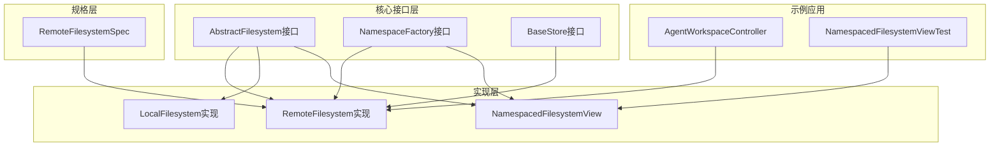
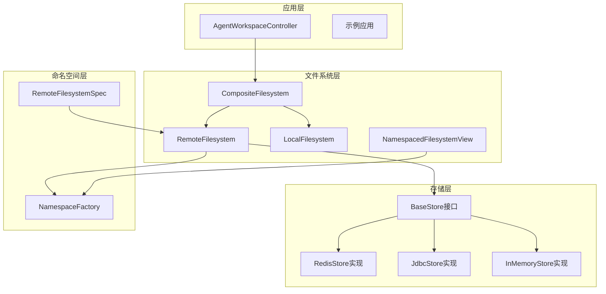
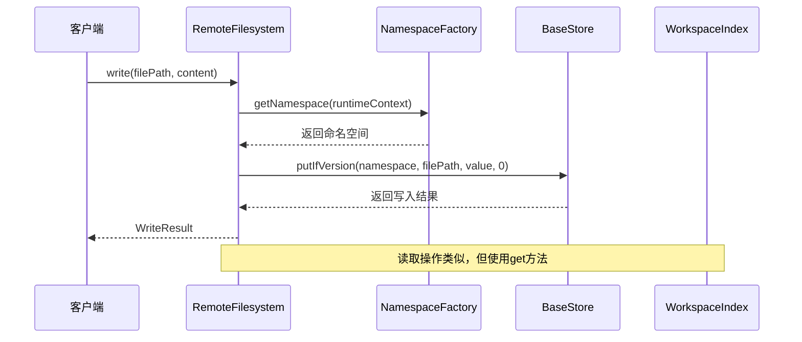
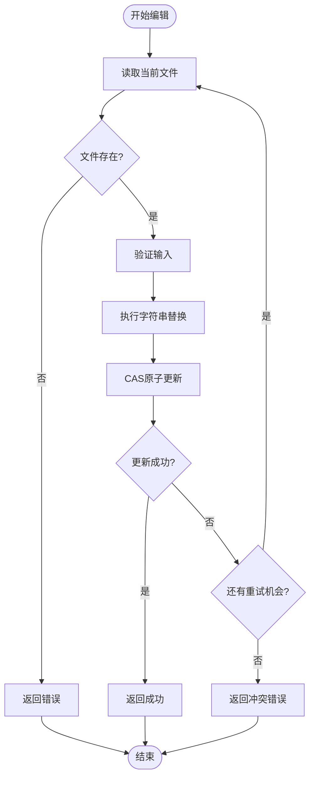
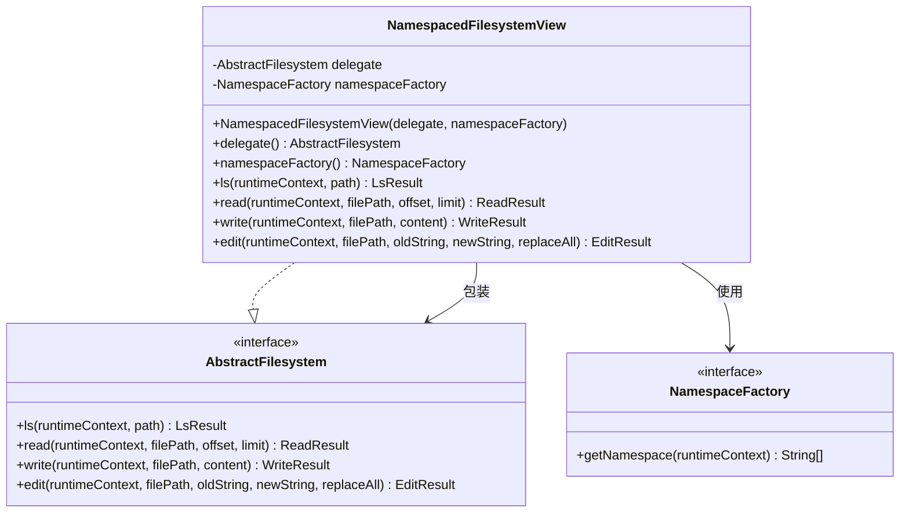
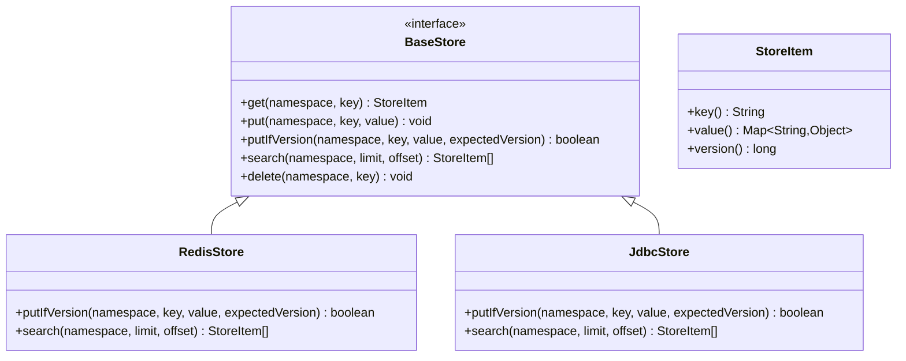
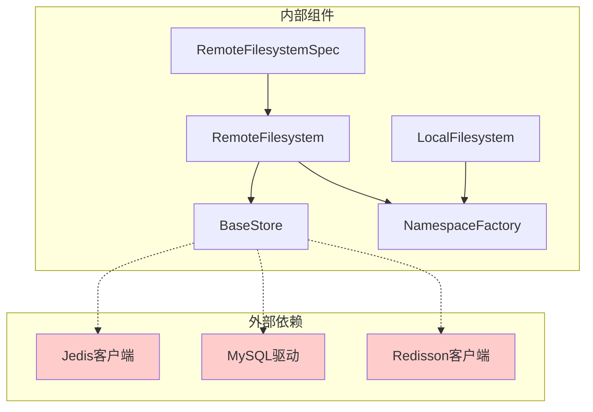
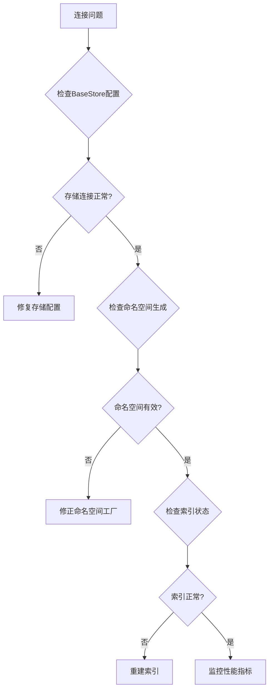

# 远程文件系统实现

<cite>
**本文档引用的文件**
- [AbstractFilesystem.java](file://agentscope-harness/src/main/java/io/agentscope/harness/agent/filesystem/AbstractFilesystem.java)
- [RemoteFilesystem.java](file://agentscope-harness/src/main/java/io/agentscope/harness/agent/filesystem/remote/RemoteFilesystem.java)
- [RemoteFilesystemSpec.java](file://agentscope-harness/src/main/java/io/agentscope/harness/agent/filesystem/spec/RemoteFilesystemSpec.java)
- [NamespaceFactory.java](file://agentscope-harness/src/main/java/io/agentscope/harness/agent/filesystem/remote/store/NamespaceFactory.java)
- [BaseStore.java](file://agentscope-harness/src/main/java/io/agentscope/harness/agent/filesystem/remote/store/BaseStore.java)
- [LocalFilesystem.java](file://agentscope-harness/src/main/java/io/agentscope/harness/agent/filesystem/local/LocalFilesystem.java)
- [NamespacedFilesystemView.java](file://agentscope-examples/agents/agentscope-builder/src/main/java/io/agentscope/builder/web/workspace/NamespacedFilesystemView.java)
- [NamespacedFilesystemViewTest.java](file://agentscope-examples/agents/agentscope-builder/src/test/java/io/agentscope/builder/web/workspace/NamespacedFilesystemViewTest.java)
- [AgentWorkspaceController.java](file://agentscope-examples/agents/agentscope-builder/src/main/java/io/agentscope/builder/web/api/AgentWorkspaceController.java)
- [going-to-production.md](file://docs/v2/zh/docs/others/going-to-production.md)
- [filesystem.md](file://docs/v1/en/docs/harness/filesystem.md)
- [DifyRAGClient.java](file://agentscope-extensions/agentscope-extensions-rag/agentscope-extensions-rag-dify/src/main/java/io/agentscope/core/rag/integration/dify/DifyRAGClient.java)
- [HayStackClient.java](file://agentscope-extensions/agentscope-extensions-rag/agentscope-extensions-rag-haystack/src/main/java/io/agentscope/core/rag/integration/haystack/HayStackClient.java)
</cite>

## 目录
1. [引言](#引言)
2. [项目结构](#项目结构)
3. [核心组件](#核心组件)
4. [架构概览](#架构概览)
5. [详细组件分析](#详细组件分析)
6. [依赖分析](#依赖分析)
7. [性能考虑](#性能考虑)
8. [故障排除指南](#故障排除指南)
9. [结论](#结论)
10. [附录](#附录)

## 引言

远程文件系统实现是Agentscope框架中的关键组件，它提供了统一的文件操作接口，支持多种存储后端和命名空间管理机制。该系统通过抽象接口和工厂模式实现了高度的可扩展性和灵活性，能够适应不同的部署场景和存储需求。

## 项目结构

远程文件系统实现主要分布在以下模块中：



**图表来源**
- [AbstractFilesystem.java:44-186](file://agentscope-harness/src/main/java/io/agentscope/harness/agent/filesystem/AbstractFilesystem.java#L44-L186)
- [RemoteFilesystem.java:63-110](file://agentscope-harness/src/main/java/io/agentscope/harness/agent/filesystem/remote/RemoteFilesystem.java#L63-L110)
- [RemoteFilesystemSpec.java:75-100](file://agentscope-harness/src/main/java/io/agentscope/harness/agent/filesystem/spec/RemoteFilesystemSpec.java#L75-L100)

**章节来源**
- [AbstractFilesystem.java:44-186](file://agentscope-harness/src/main/java/io/agentscope/harness/agent/filesystem/AbstractFilesystem.java#L44-L186)
- [RemoteFilesystemSpec.java:75-100](file://agentscope-harness/src/main/java/io/agentscope/harness/agent/filesystem/spec/RemoteFilesystemSpec.java#L75-L100)

## 核心组件

### 抽象文件系统接口

AbstractFilesystem定义了统一的文件操作接口，支持以下核心功能：

- 文件列表和目录浏览
- 文件读写操作
- 文本编辑和替换
- 搜索和匹配功能
- 批量文件上传下载
- 文件存在性检查和删除

### 远程文件系统实现

RemoteFilesystem是基于键值存储的文件系统实现，具有以下特性：

- 支持动态命名空间管理
- 提供并发安全的原子操作
- 实现最佳努力索引加速
- 支持批量操作优化

### 命名空间工厂

NamespaceFactory接口负责生成操作上下文相关的命名空间路径，支持：

- 动态命名空间生成
- 多租户隔离
- 会话级别的路径前缀

**章节来源**
- [RemoteFilesystem.java:63-110](file://agentscope-harness/src/main/java/io/agentscope/harness/agent/filesystem/remote/RemoteFilesystem.java#L63-L110)
- [NamespaceFactory.java:36-47](file://agentscope-harness/src/main/java/io/agentscope/harness/agent/filesystem/remote/store/NamespaceFactory.java#L36-L47)

## 架构概览

远程文件系统采用分层架构设计，通过抽象接口实现松耦合：



**图表来源**
- [RemoteFilesystemSpec.java:194-241](file://agentscope-harness/src/main/java/io/agentscope/harness/agent/filesystem/spec/RemoteFilesystemSpec.java#L194-L241)
- [RemoteFilesystem.java:63-110](file://agentscope-harness/src/main/java/io/agentscope/harness/agent/filesystem/remote/RemoteFilesystem.java#L63-L110)

## 详细组件分析

### 远程文件系统核心实现

RemoteFilesystem提供了完整的文件系统功能，包括：

#### 文件操作流程



**图表来源**
- [RemoteFilesystem.java:260-274](file://agentscope-harness/src/main/java/io/agentscope/harness/agent/filesystem/remote/RemoteFilesystem.java#L260-L274)
- [RemoteFilesystem.java:214-258](file://agentscope-harness/src/main/java/io/agentscope/harness/agent/filesystem/remote/RemoteFilesystem.java#L214-L258)

#### 编辑操作的并发控制

RemoteFilesystem实现了基于版本号的并发控制：



**图表来源**
- [RemoteFilesystem.java:279-327](file://agentscope-harness/src/main/java/io/agentscope/harness/agent/filesystem/remote/RemoteFilesystem.java#L279-L327)

**章节来源**
- [RemoteFilesystem.java:260-327](file://agentscope-harness/src/main/java/io/agentscope/harness/agent/filesystem/remote/RemoteFilesystem.java#L260-L327)

### 命名空间管理机制

#### NamespacedFilesystemView实现

NamespacedFilesystemView提供了透明的命名空间包装器：



**图表来源**
- [NamespacedFilesystemView.java:52-99](file://agentscope-examples/agents/agentscope-builder/src/main/java/io/agentscope/builder/web/workspace/NamespacedFilesystemView.java#L52-L99)

#### 命名空间工厂配置

命名空间工厂支持动态生成命名空间路径：

**章节来源**
- [NamespacedFilesystemView.java:35-99](file://agentscope-examples/agents/agentscope-builder/src/main/java/io/agentscope/builder/web/workspace/NamespacedFilesystemView.java#L35-L99)
- [NamespacedFilesystemViewTest.java:43-93](file://agentscope-examples/agents/agentscope-builder/src/test/java/io/agentscope/builder/web/workspace/NamespacedFilesystemViewTest.java#L43-L93)

### 存储后端集成

#### BaseStore接口设计

BaseStore定义了统一的键值存储接口：



**图表来源**
- [BaseStore.java:27-96](file://agentscope-harness/src/main/java/io/agentscope/harness/agent/filesystem/remote/store/BaseStore.java#L27-L96)

**章节来源**
- [BaseStore.java:27-96](file://agentscope-harness/src/main/java/io/agentscope/harness/agent/filesystem/remote/store/BaseStore.java#L27-L96)

### 远程文件系统规格配置

#### RemoteFilesystemSpec实现

RemoteFilesystemSpec提供了灵活的文件系统配置选项：

```mermaid
flowchart TD
Config[配置RemoteFilesystemSpec] --> Store{设置BaseStore}
Store --> Scope{设置IsolationScope}
Scope --> Prefixes{添加共享前缀}
Prefixes --> Routes[构建路由映射]
Routes --> Composite[创建CompositeFilesystem]
Composite --> Result[返回配置完成的文件系统]
subgraph "路由配置"
Root[根文件: AGENTS.md, MEMORY.md, tools.json]
Memory[memory/ 目录]
Skills[skills/ 目录]
Subagents[subagents/ 目录]
Knowledge[knowledge/ 目录]
Sessions[agents/{agentId}/sessions/]
Tasks[agents/{agentId}/tasks/]
end
```

**图表来源**
- [RemoteFilesystemSpec.java:194-241](file://agentscope-harness/src/main/java/io/agentscope/harness/agent/filesystem/spec/RemoteFilesystemSpec.java#L194-L241)

**章节来源**
- [RemoteFilesystemSpec.java:194-315](file://agentscope-harness/src/main/java/io/agentscope/harness/agent/filesystem/spec/RemoteFilesystemSpec.java#L194-L315)

## 依赖分析

### 组件耦合关系



**图表来源**
- [RemoteFilesystemSpec.java:145-151](file://agentscope-harness/src/main/java/io/agentscope/harness/agent/filesystem/spec/RemoteFilesystemSpec.java#L145-L151)

### 关键依赖关系

- **RemoteFilesystem** 依赖 **BaseStore** 接口进行持久化存储
- **RemoteFilesystemSpec** 管理 **RemoteFilesystem** 的配置和路由
- **NamespaceFactory** 提供动态命名空间生成能力
- **LocalFilesystem** 提供本地文件系统支持作为后备

**章节来源**
- [RemoteFilesystemSpec.java:145-170](file://agentscope-harness/src/main/java/io/agentscope/harness/agent/filesystem/spec/RemoteFilesystemSpec.java#L145-L170)

## 性能考虑

### 索引优化策略

RemoteFilesystem实现了最佳努力索引机制来提升性能：

- **ls/glob/exists** 操作优先使用本地索引
- **grep** 操作先使用索引缩小候选集，再从存储获取内容
- 索引失效时自动回退到全存储扫描

### 并发控制机制

- **CAS原子操作** 防止并发写入冲突
- **编辑操作重试** 最大重试次数限制为5次
- **版本号检查** 确保数据一致性

### 批量操作优化

- **uploadFiles** 使用批量写入减少网络往返
- **downloadFiles** 支持批量下载提高效率
- **分页搜索** 避免大量数据一次性传输

## 故障排除指南

### 常见问题诊断

#### 连接问题排查



#### 性能问题诊断

- **索引未命中**：检查索引是否过期或损坏
- **并发冲突**：调整编辑操作的重试策略
- **网络延迟**：优化存储后端配置和网络设置

**章节来源**
- [RemoteFilesystem.java:112-135](file://agentscope-harness/src/main/java/io/agentscope/harness/agent/filesystem/remote/RemoteFilesystem.java#L112-L135)

### 错误处理机制

系统实现了多层次的错误处理：

- **参数验证**：所有公共方法都进行输入参数验证
- **异常传播**：底层异常向上抛出便于定位问题
- **降级策略**：索引失效时自动回退到全存储扫描

## 结论

远程文件系统实现通过抽象接口、工厂模式和分层架构，提供了高度可扩展和灵活的文件系统解决方案。其核心优势包括：

1. **统一接口**：通过AbstractFilesystem接口实现多种存储后端的统一访问
2. **命名空间管理**：支持动态命名空间生成和多租户隔离
3. **性能优化**：索引机制和批量操作提升系统性能
4. **并发安全**：CAS操作和版本控制确保数据一致性
5. **易于集成**：清晰的接口设计便于与各种存储后端集成

该实现为Agentscope框架提供了强大的文件系统基础，支持从单机部署到分布式集群的各种应用场景。

## 附录

### API参考

#### 核心接口方法

| 方法 | 参数 | 返回值 | 描述 |
|------|------|--------|------|
| ls | runtimeContext, path | LsResult | 列出目录内容 |
| read | runtimeContext, filePath, offset, limit | ReadResult | 读取文件内容 |
| write | runtimeContext, filePath, content | WriteResult | 写入文件内容 |
| edit | runtimeContext, filePath, oldString, newString, replaceAll | EditResult | 编辑文件内容 |
| grep | runtimeContext, pattern, path, glob | GrepResult | 搜索文件内容 |
| glob | runtimeContext, pattern, path | GlobResult | 匹配文件路径 |
| uploadFiles | runtimeContext, files | List<FileUploadResponse> | 批量上传文件 |
| downloadFiles | runtimeContext, paths | List<FileDownloadResponse> | 批量下载文件 |

#### 配置选项

| 属性 | 类型 | 默认值 | 描述 |
|------|------|--------|------|
| isolationScope | IsolationScope | USER | 隔离级别 |
| anonymousUserId | String | "_default" | 匿名用户ID |
| workspaceIndex | WorkspaceIndex | null | 工作区索引 |
| extraSharedPrefixes | Set<String> | empty | 额外共享前缀 |