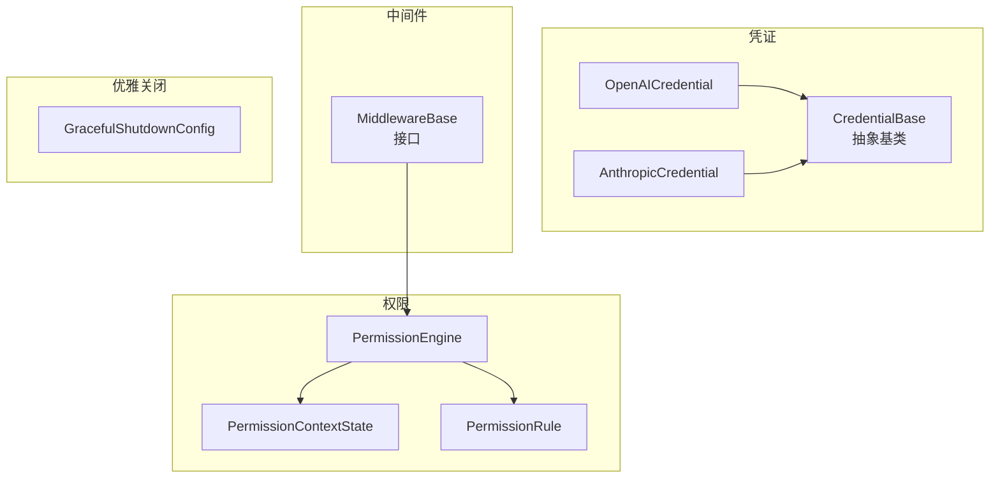
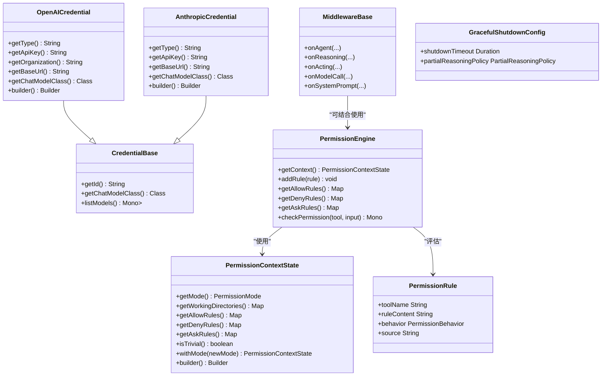
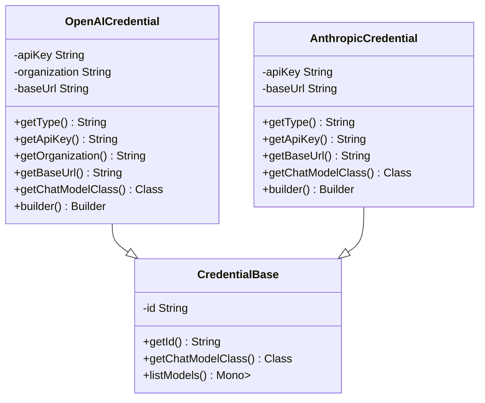
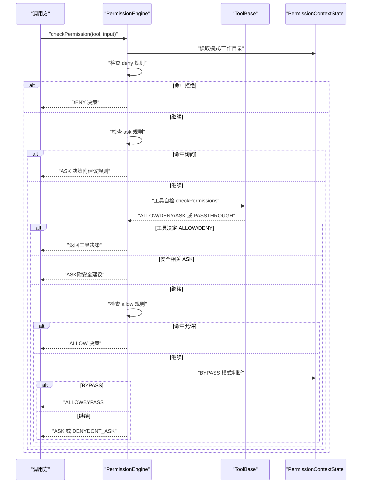
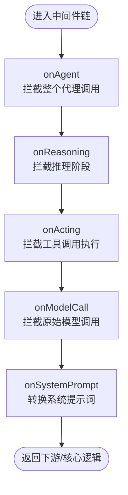
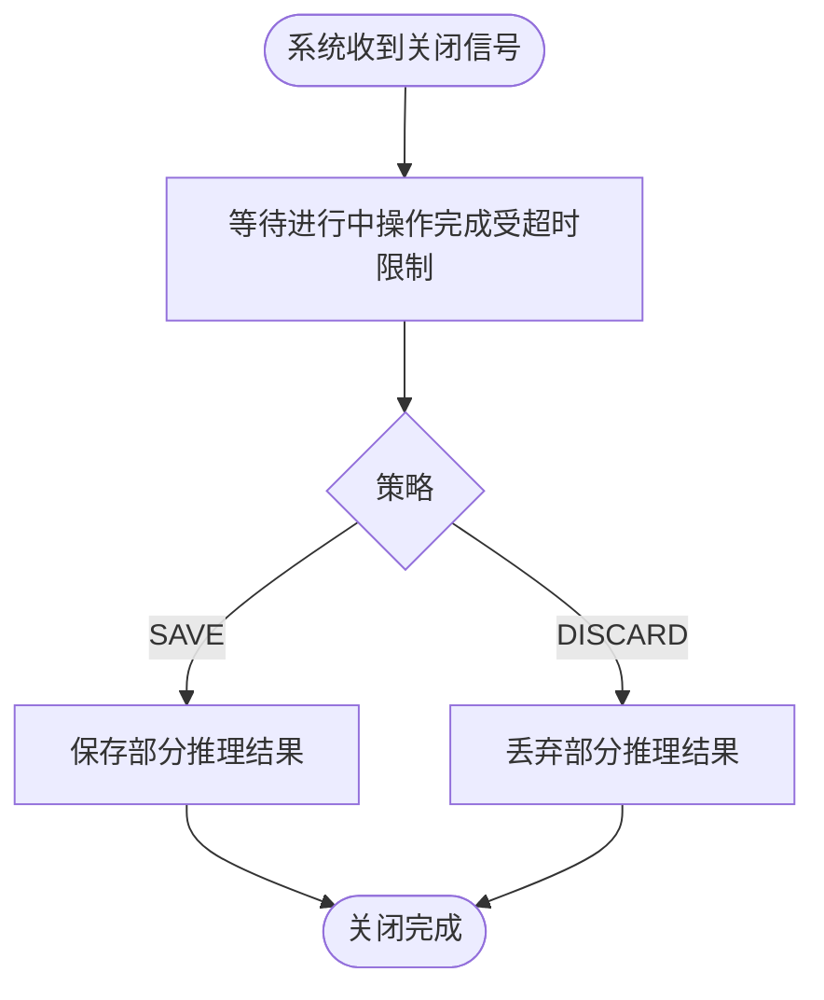
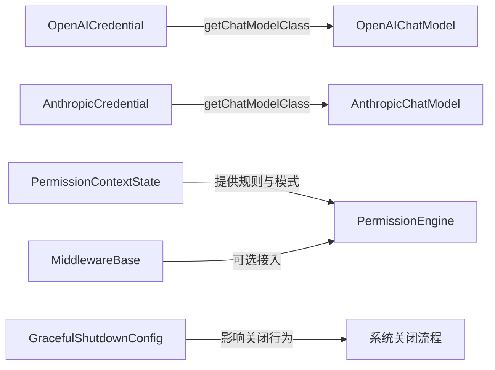

# 配置API

<cite>
**本文引用的文件**
- [CredentialBase.java](file://agentscope-core/src/main/java/io/agentscope/core/credential/CredentialBase.java)
- [OpenAICredential.java](file://agentscope-core/src/main/java/io/agentscope/core/credential/OpenAICredential.java)
- [AnthropicCredential.java](file://agentscope-core/src/main/java/io/agentscope/core/credential/AnthropicCredential.java)
- [package-info.java（凭证）](file://agentscope-core/src/main/java/io/agentscope/core/credential/package-info.java)
- [PermissionEngine.java](file://agentscope-core/src/main/java/io/agentscope/core/permission/PermissionEngine.java)
- [PermissionContextState.java](file://agentscope-core/src/main/java/io/agentscope/core/permission/PermissionContextState.java)
- [PermissionRule.java](file://agentscope-core/src/main/java/io/agentscope/core/permission/PermissionRule.java)
- [package-info.java（权限）](file://agentscope-core/src/main/java/io/agentscope/core/permission/package-info.java)
- [MiddlewareBase.java](file://agentscope-core/src/main/java/io/agentscope/core/middleware/MiddlewareBase.java)
- [GracefulShutdownConfig.java](file://agentscope-core/src/main/java/io/agentscope/core/shutdown/GracefulShutdownConfig.java)
</cite>

## 目录
1. [简介](#简介)
2. [项目结构](#项目结构)
3. [核心组件](#核心组件)
4. [架构总览](#架构总览)
5. [详细组件分析](#详细组件分析)
6. [依赖分析](#依赖分析)
7. [性能考虑](#性能考虑)
8. [故障排查指南](#故障排查指南)
9. [结论](#结论)
10. [附录](#附录)

## 简介
本文件为 AgentScope 配置系统的完整 API 参考，覆盖凭证管理、权限控制、中间件配置与优雅关闭等主题。内容以代码级事实为基础，提供清晰的接口定义、数据模型与调用流程说明，并辅以可视化图示帮助理解。

## 项目结构
围绕“配置”主题的关键模块如下：
- 凭证体系：CredentialBase 抽象基类及各厂商具体凭证类型（如 OpenAI、Anthropic）
- 权限体系：PermissionEngine 权限引擎、PermissionContextState 上下文状态、PermissionRule 规则模型
- 中间件体系：MiddlewareBase 接口及其生命周期钩子
- 优雅关闭：GracefulShutdownConfig 关闭策略配置

图表来源
- [CredentialBase.java:35-66](file://agentscope-core/src/main/java/io/agentscope/core/credential/CredentialBase.java#L35-L66)
- [OpenAICredential.java:29-76](file://agentscope-core/src/main/java/io/agentscope/core/credential/OpenAICredential.java#L29-L76)
- [AnthropicCredential.java:29-67](file://agentscope-core/src/main/java/io/agentscope/core/credential/AnthropicCredential.java#L29-L67)
- [PermissionEngine.java:47-121](file://agentscope-core/src/main/java/io/agentscope/core/permission/PermissionEngine.java#L47-L121)
- [PermissionContextState.java:37-52](file://agentscope-core/src/main/java/io/agentscope/core/permission/PermissionContextState.java#L37-L52)
- [PermissionRule.java:33-44](file://agentscope-core/src/main/java/io/agentscope/core/permission/PermissionRule.java#L33-L44)
- [MiddlewareBase.java:59-143](file://agentscope-core/src/main/java/io/agentscope/core/middleware/MiddlewareBase.java#L59-L143)
- [GracefulShutdownConfig.java:36-68](file://agentscope-core/src/main/java/io/agentscope/core/shutdown/GracefulShutdownConfig.java#L36-L68)

章节来源
- [package-info.java（凭证）:17-27](file://agentscope-core/src/main/java/io/agentscope/core/credential/package-info.java#L17-L27)
- [package-info.java（权限）:17-28](file://agentscope-core/src/main/java/io/agentscope/core/permission/package-info.java#L17-L28)

## 核心组件
- 凭证基类与具体实现：统一承载认证材料与消费模型类型；支持构建器模式与 JSON 序列化字段顺序控制
- 权限引擎与上下文：基于规则表的决策流水线，支持动态增删规则与模式切换
- 中间件接口：在代理生命周期的多个关键点提供拦截与转换能力
- 优雅关闭配置：定义关闭超时与部分推理结果处理策略

章节来源
- [CredentialBase.java:35-66](file://agentscope-core/src/main/java/io/agentscope/core/credential/CredentialBase.java#L35-L66)
- [OpenAICredential.java:29-124](file://agentscope-core/src/main/java/io/agentscope/core/credential/OpenAICredential.java#L29-L124)
- [AnthropicCredential.java:29-103](file://agentscope-core/src/main/java/io/agentscope/core/credential/AnthropicCredential.java#L29-L103)
- [PermissionEngine.java:47-202](file://agentscope-core/src/main/java/io/agentscope/core/permission/PermissionEngine.java#L47-L202)
- [PermissionContextState.java:37-159](file://agentscope-core/src/main/java/io/agentscope/core/permission/PermissionContextState.java#L37-L159)
- [PermissionRule.java:33-44](file://agentscope-core/src/main/java/io/agentscope/core/permission/PermissionRule.java#L33-L44)
- [MiddlewareBase.java:59-143](file://agentscope-core/src/main/java/io/agentscope/core/middleware/MiddlewareBase.java#L59-L143)
- [GracefulShutdownConfig.java:36-68](file://agentscope-core/src/main/java/io/agentscope/core/shutdown/GracefulShutdownConfig.java#L36-L68)

## 架构总览
下图展示配置相关组件之间的交互关系与职责边界。

图表来源
- [CredentialBase.java:35-66](file://agentscope-core/src/main/java/io/agentscope/core/credential/CredentialBase.java#L35-L66)
- [OpenAICredential.java:29-124](file://agentscope-core/src/main/java/io/agentscope/core/credential/OpenAICredential.java#L29-L124)
- [AnthropicCredential.java:29-103](file://agentscope-core/src/main/java/io/agentscope/core/credential/AnthropicCredential.java#L29-L103)
- [PermissionEngine.java:47-202](file://agentscope-core/src/main/java/io/agentscope/core/permission/PermissionEngine.java#L47-L202)
- [PermissionContextState.java:37-159](file://agentscope-core/src/main/java/io/agentscope/core/permission/PermissionContextState.java#L37-L159)
- [PermissionRule.java:33-44](file://agentscope-core/src/main/java/io/agentscope/core/permission/PermissionRule.java#L33-L44)
- [MiddlewareBase.java:59-143](file://agentscope-core/src/main/java/io/agentscope/core/middleware/MiddlewareBase.java#L59-L143)
- [GracefulShutdownConfig.java:36-68](file://agentscope-core/src/main/java/io/agentscope/core/shutdown/GracefulShutdownConfig.java#L36-L68)

## 详细组件分析

### 凭证管理 API
- 基类 CredentialBase
  - 职责：标识符生成、声明消费模型类型、模型列表枚举（默认不支持）
  - 关键方法：getId、getChatModelClass、listModels
  - 复杂度：getId O(1)，listModels 默认抛异常或返回错误信号
- 具体凭证
  - OpenAICredential
    - 字段：类型标识、API Key、组织、基础地址
    - 方法：getType、getApiKey、getOrganization、getBaseUrl、getChatModelClass、toString、builder
    - 构建器：支持 id、apiKey、organization、baseUrl 设置
  - AnthropicCredential
    - 字段：类型标识、API Key、基础地址
    - 方法：getType、getApiKey、getBaseUrl、getChatModelClass、toString、builder
    - 构建器：支持 id、apiKey、baseUrl 设置
- 设计要点
  - JSON 注解确保序列化字段顺序与忽略未知字段
  - 子类通过 getChatModelClass 指定消费该凭证的具体模型类

图表来源
- [CredentialBase.java:35-66](file://agentscope-core/src/main/java/io/agentscope/core/credential/CredentialBase.java#L35-L66)
- [OpenAICredential.java:29-124](file://agentscope-core/src/main/java/io/agentscope/core/credential/OpenAICredential.java#L29-L124)
- [AnthropicCredential.java:29-103](file://agentscope-core/src/main/java/io/agentscope/core/credential/AnthropicCredential.java#L29-L103)

章节来源
- [CredentialBase.java:35-66](file://agentscope-core/src/main/java/io/agentscope/core/credential/CredentialBase.java#L35-L66)
- [OpenAICredential.java:29-124](file://agentscope-core/src/main/java/io/agentscope/core/credential/OpenAICredential.java#L29-L124)
- [AnthropicCredential.java:29-103](file://agentscope-core/src/main/java/io/agentscope/core/credential/AnthropicCredential.java#L29-L103)
- [package-info.java（凭证）:17-27](file://agentscope-core/src/main/java/io/agentscope/core/credential/package-info.java#L17-L27)

### 权限控制 API
- 权限引擎 PermissionEngine
  - 输入：PermissionContextState（含模式、工作目录、三张规则表）
  - 决策流程：deny → ask → 工具自检 → allow → BYPASS → 默认 ASK（或 DONT_ASK 下 DENY）
  - 查询接口：getContext、getAllowRules、getDenyRules、getAskRules
  - 动态扩展：addRule
- 权限上下文 PermissionContextState
  - 字段：模式、工作目录映射、允许/拒绝/询问规则映射
  - 工具：builder、withMode（切换模式）、isTrivial（是否轻量路径）
- 权限规则 PermissionRule
  - 字段：目标工具名、规则内容（工具自匹配）、行为（ALLOW/DENY/ASK/PASSTHROUGH）、来源
- 决策流程序列图

图表来源
- [PermissionEngine.java:139-202](file://agentscope-core/src/main/java/io/agentscope/core/permission/PermissionEngine.java#L139-L202)
- [PermissionEngine.java:210-227](file://agentscope-core/src/main/java/io/agentscope/core/permission/PermissionEngine.java#L210-L227)
- [PermissionEngine.java:265-302](file://agentscope-core/src/main/java/io/agentscope/core/permission/PermissionEngine.java#L265-L302)
- [PermissionEngine.java:318-334](file://agentscope-core/src/main/java/io/agentscope/core/permission/PermissionEngine.java#L318-L334)

章节来源
- [PermissionEngine.java:47-202](file://agentscope-core/src/main/java/io/agentscope/core/permission/PermissionEngine.java#L47-L202)
- [PermissionContextState.java:37-159](file://agentscope-core/src/main/java/io/agentscope/core/permission/PermissionContextState.java#L37-L159)
- [PermissionRule.java:33-44](file://agentscope-core/src/main/java/io/agentscope/core/permission/PermissionRule.java#L33-L44)
- [package-info.java（权限）:17-28](file://agentscope-core/src/main/java/io/agentscope/core/permission/package-info.java#L17-L28)

### 中间件配置 API
- 接口 MiddlewareBase
  - 生命周期钩子（洋葱模式）：onAgent、onReasoning、onActing、onModelCall
  - 转换钩子（管道模式）：onSystemPrompt
  - 默认行为：每个钩子默认透传到 next，便于按需覆盖
- 使用方式
  - 实现接口并重写需要的钩子
  - 将中间件串联形成链路（MiddlewareChain）

图表来源
- [MiddlewareBase.java:59-143](file://agentscope-core/src/main/java/io/agentscope/core/middleware/MiddlewareBase.java#L59-L143)

章节来源
- [MiddlewareBase.java:59-143](file://agentscope-core/src/main/java/io/agentscope/core/middleware/MiddlewareBase.java#L59-L143)

### 优雅关闭配置 API
- 记录类 GracefulShutdownConfig
  - 字段：shutdownTimeout（最大等待时长，null 表示无限等待）、partialReasoningPolicy（部分推理处理策略）
  - 默认值：DEFAULT（shutdownTimeout=null，策略=SAVE）
  - 校验：partialReasoningPolicy 不可为空；若指定必须为正值
- 使用场景
  - 在系统收到关闭信号时，依据配置等待进行中操作完成或采取策略保存/丢弃部分推理结果

图表来源
- [GracefulShutdownConfig.java:36-68](file://agentscope-core/src/main/java/io/agentscope/core/shutdown/GracefulShutdownConfig.java#L36-L68)

章节来源
- [GracefulShutdownConfig.java:36-68](file://agentscope-core/src/main/java/io/agentscope/core/shutdown/GracefulShutdownConfig.java#L36-L68)

## 依赖分析
- 凭证与模型绑定：各具体凭证通过 getChatModelClass 返回对应 ChatModelBase 子类，用于运行时选择正确的模型实现
- 权限引擎对上下文的依赖：引擎在构造时复制规则表，后续仅读取，避免外部变更影响一致性
- 中间件与权限的协作：中间件可在推理/工具调用阶段接入权限检查，形成“拦截+决策”的组合
- 优雅关闭与运行时：关闭配置独立于业务逻辑，通过 JVM 关闭钩子或外部信号触发

图表来源
- [OpenAICredential.java:74-76](file://agentscope-core/src/main/java/io/agentscope/core/credential/OpenAICredential.java#L74-L76)
- [AnthropicCredential.java:65-67](file://agentscope-core/src/main/java/io/agentscope/core/credential/AnthropicCredential.java#L65-L67)
- [PermissionEngine.java:59-64](file://agentscope-core/src/main/java/io/agentscope/core/permission/PermissionEngine.java#L59-L64)
- [MiddlewareBase.java:59-143](file://agentscope-core/src/main/java/io/agentscope/core/middleware/MiddlewareBase.java#L59-L143)
- [GracefulShutdownConfig.java:36-68](file://agentscope-core/src/main/java/io/agentscope/core/shutdown/GracefulShutdownConfig.java#L36-L68)

章节来源
- [OpenAICredential.java:74-76](file://agentscope-core/src/main/java/io/agentscope/core/credential/OpenAICredential.java#L74-L76)
- [AnthropicCredential.java:65-67](file://agentscope-core/src/main/java/io/agentscope/core/credential/AnthropicCredential.java#L65-L67)
- [PermissionEngine.java:59-64](file://agentscope-core/src/main/java/io/agentscope/core/permission/PermissionEngine.java#L59-L64)
- [MiddlewareBase.java:59-143](file://agentscope-core/src/main/java/io/agentscope/core/middleware/MiddlewareBase.java#L59-L143)
- [GracefulShutdownConfig.java:36-68](file://agentscope-core/src/main/java/io/agentscope/core/shutdown/GracefulShutdownConfig.java#L36-L68)

## 性能考虑
- 权限决策：规则表为内存结构，建议在上下文构建阶段冻结并复用，避免频繁修改导致的额外拷贝
- 中间件链：尽量减少不必要的事件转换与阻塞操作，保持响应链路简洁
- 凭证枚举：listModels 默认不支持，建议在需要时通过模型层扩展实现，避免无效网络调用
- 优雅关闭：合理设置 shutdownTimeout，平衡关闭时间与资源回收

## 故障排查指南
- 凭证未匹配模型
  - 现象：getChatModelClass 返回不受支持的模型类
  - 处理：确认凭证类型与模型实现一致，或在模型层补充适配
- 权限规则不生效
  - 现象：规则命中但未产生预期行为
  - 处理：检查规则内容与工具自检逻辑，确认规则表已正确注入且未被覆盖
- 中间件未生效
  - 现象：onReasoning/onActing 等钩子未被调用
  - 处理：确认中间件已正确注册到链路，next 调用链完整
- 优雅关闭卡顿
  - 现象：系统长时间无法退出
  - 处理：调整 shutdownTimeout，检查是否存在阻塞任务；必要时调整 partialReasoningPolicy

章节来源
- [CredentialBase.java:59-65](file://agentscope-core/src/main/java/io/agentscope/core/credential/CredentialBase.java#L59-L65)
- [PermissionEngine.java:139-202](file://agentscope-core/src/main/java/io/agentscope/core/permission/PermissionEngine.java#L139-L202)
- [MiddlewareBase.java:59-143](file://agentscope-core/src/main/java/io/agentscope/core/middleware/MiddlewareBase.java#L59-L143)
- [GracefulShutdownConfig.java:63-68](file://agentscope-core/src/main/java/io/agentscope/core/shutdown/GracefulShutdownConfig.java#L63-L68)

## 结论
本文档从代码事实出发，系统梳理了 AgentScope 的配置相关 API：凭证基类与具体实现、权限引擎与上下文、中间件接口以及优雅关闭配置。通过清晰的接口定义、数据模型与流程图示，读者可以快速理解并正确使用这些配置能力。

## 附录
- 运行时参数与环境变量
  - 凭证与模型：通过具体凭证类的字段（如 API Key、基础地址）在运行时注入
  - 权限模式：通过 PermissionContextState 的 mode 字段控制（默认/探索/接受编辑/BYPASS/DONT_ASK）
  - 中间件：通过注册机制加入链路，按需覆盖钩子
  - 优雅关闭：通过 GracefulShutdownConfig 的字段控制等待时长与策略