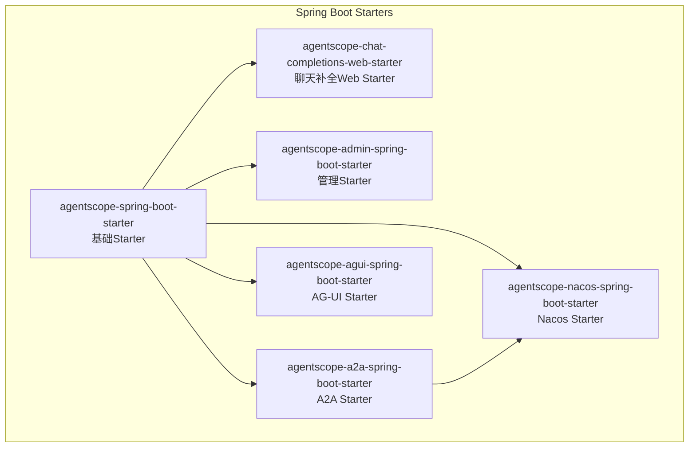
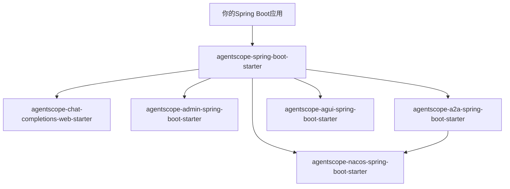
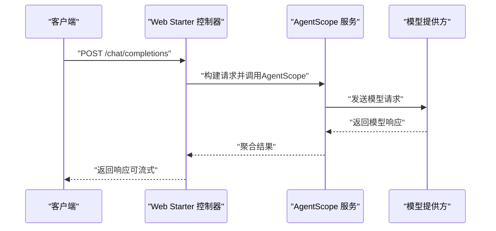
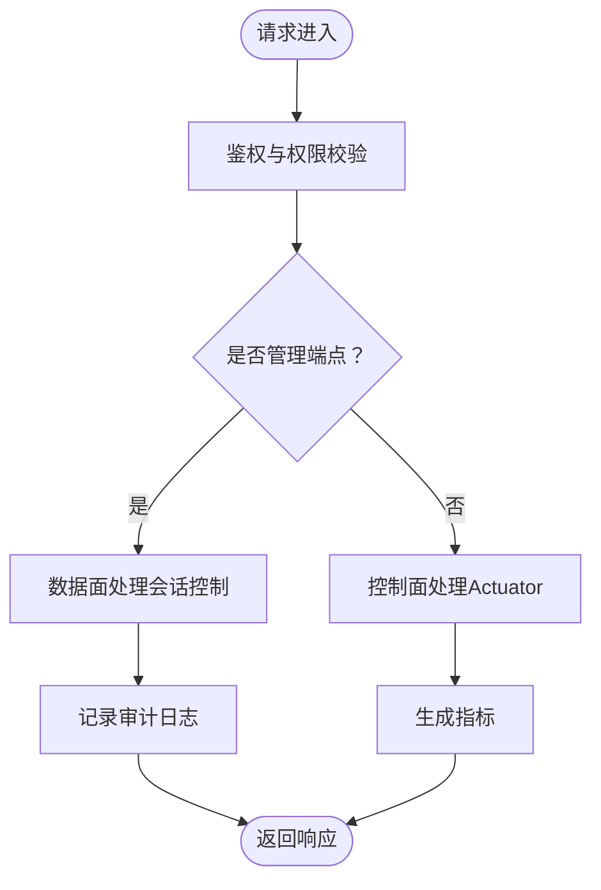
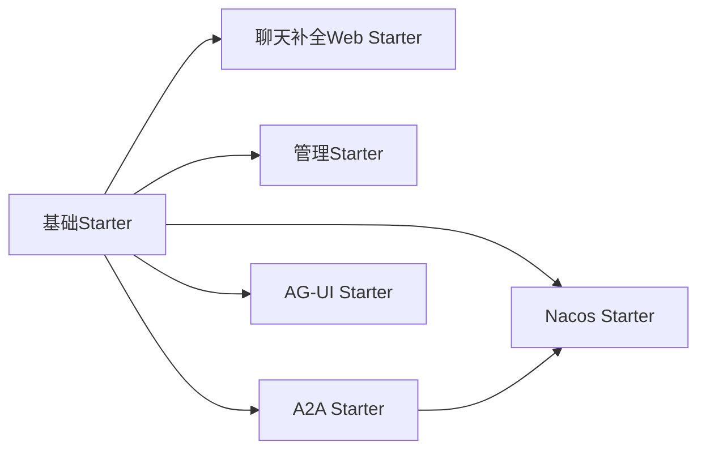

# Spring Boot集成

<cite>
**本文引用的文件**
- [agentscope-spring-boot-starter/pom.xml](file://agentscope-extensions/agentscope-spring-boot-starters/agentscope-spring-boot-starter/pom.xml)
- [agentscope-chat-completions-web-starter/pom.xml](file://agentscope-extensions/agentscope-spring-boot-starters/agentscope-chat-completions-web-starter/pom.xml)
- [agentscope-admin-spring-boot-starter/pom.xml](file://agentscope-extensions/agentscope-spring-boot-starters/agentscope-admin-spring-boot-starter/pom.xml)
- [agentscope-a2a-spring-boot-starter/pom.xml](file://agentscope-extensions/agentscope-spring-boot-starters/agentscope-a2a-spring-boot-starter/pom.xml)
- [agentscope-agui-spring-boot-starter/pom.xml](file://agentscope-extensions/agentscope-spring-boot-starters/agentscope-agui-spring-boot-starter/pom.xml)
- [agentscope-nacos-spring-boot-starter/pom.xml](file://agentscope-extensions/agentscope-spring-boot-starters/agentscope-nacos-spring-boot-starter/pom.xml)
</cite>

## 目录
1. [简介](#简介)
2. [项目结构](#项目结构)
3. [核心组件](#核心组件)
4. [架构总览](#架构总览)
5. [详细组件分析](#详细组件分析)
6. [依赖关系分析](#依赖关系分析)
7. [性能考虑](#性能考虑)
8. [故障排除指南](#故障排除指南)
9. [结论](#结论)
10. [附录](#附录)

## 简介
本指南面向希望在Spring Boot应用中集成AgentScope Java能力的开发者，系统讲解各类Spring Boot Starter的用途与配置方法，覆盖基础集成（自动配置与Bean注册）、聊天补全Web Starter（REST API与控制器实现）、管理Starter（健康检查、指标与管理接口），并提供完整配置示例、最佳实践、与安全/监控/配置中心等Spring生态的集成方式、部署运维建议以及故障排除与性能调优要点。

## 项目结构
AgentScope Java的Spring Boot集成以“模块化Starter”为核心，每个Starter聚焦特定能力域：
- 基础Starter：提供AgentScope核心能力的自动装配与Bean注册，作为其他Starter的公共依赖。
- 聊天补全Web Starter：在基础Starter之上，暴露标准HTTP聊天补全API，基于ReActAgent风格。
- 管理Starter：提供数据面（会话控制）REST接口与控制面（Actuator）端点，统一AdminCommand注册与审计。
- A2A Starter：集成AgentScope A2A客户端与服务端，复用基础Starter。
- AG-UI Starter：集成AgentScope AG-UI（支持MVC与WebFlux）。
- Nacos Starter：集成Nacos能力（提示词、A2A等），可选依赖于基础Starter与A2A Starter。

图表来源
- [agentscope-spring-boot-starter/pom.xml:38-73](file://agentscope-extensions/agentscope-spring-boot-starters/agentscope-spring-boot-starter/pom.xml#L38-L73)
- [agentscope-chat-completions-web-starter/pom.xml:40-87](file://agentscope-extensions/agentscope-spring-boot-starters/agentscope-chat-completions-web-starter/pom.xml#L40-L87)
- [agentscope-admin-spring-boot-starter/pom.xml:43-116](file://agentscope-extensions/agentscope-spring-boot-starters/agentscope-admin-spring-boot-starter/pom.xml#L43-L116)
- [agentscope-a2a-spring-boot-starter/pom.xml:36-90](file://agentscope-extensions/agentscope-spring-boot-starters/agentscope-a2a-spring-boot-starter/pom.xml#L36-L90)
- [agentscope-agui-spring-boot-starter/pom.xml:36-90](file://agentscope-extensions/agentscope-spring-boot-starters/agentscope-agui-spring-boot-starter/pom.xml#L36-L90)
- [agentscope-nacos-spring-boot-starter/pom.xml:36-90](file://agentscope-extensions/agentscope-spring-boot-starters/agentscope-nacos-spring-boot-starter/pom.xml#L36-L90)

章节来源
- [agentscope-spring-boot-starter/pom.xml:17-78](file://agentscope-extensions/agentscope-spring-boot-starters/agentscope-spring-boot-starter/pom.xml#L17-L78)
- [agentscope-chat-completions-web-starter/pom.xml:17-90](file://agentscope-extensions/agentscope-spring-boot-starters/agentscope-chat-completions-web-starter/pom.xml#L17-L90)
- [agentscope-admin-spring-boot-starter/pom.xml:17-119](file://agentscope-extensions/agentscope-spring-boot-starters/agentscope-admin-spring-boot-starter/pom.xml#L17-L119)
- [agentscope-a2a-spring-boot-starter/pom.xml:17-91](file://agentscope-extensions/agentscope-spring-boot-starters/agentscope-a2a-spring-boot-starter/pom.xml#L17-L91)
- [agentscope-agui-spring-boot-starter/pom.xml:17-90](file://agentscope-extensions/agentscope-spring-boot-starters/agentscope-agui-spring-boot-starter/pom.xml#L17-L90)
- [agentscope-nacos-spring-boot-starter/pom.xml:17-90](file://agentscope-extensions/agentscope-spring-boot-starters/agentscope-nacos-spring-boot-starter/pom.xml#L17-L90)

## 核心组件
- 基础Starter（agentscope-spring-boot-starter）
  - 作用：引入AgentScope核心库与Spring Boot自动配置SPI，作为其他Starter的公共依赖；负责自动装配与Bean注册。
  - 关键依赖：agentscope-core、agentscope、spring-boot-autoconfigure、spring-boot-configuration-processor。
  - 配置要点：通过配置处理器生成元数据，便于IDE智能提示与配置校验。

- 聊天补全Web Starter（agentscope-chat-completions-web-starter）
  - 作用：在基础Starter基础上，暴露标准化HTTP聊天补全API，基于ReActAgent风格。
  - 关键依赖：chat-completions-web扩展模块、spring-boot-starter-web、spring-boot-starter-validation。
  - 集成方式：直接引入即可启用Web层与参数校验。

- 管理Starter（agentscope-admin-spring-boot-starter）
  - 作用：提供数据面REST（会话控制）与控制面Actuator端点，统一AdminCommand注册与审计；可选集成springdoc-openapi。
  - 关键依赖：agentscope-harness、spring-boot-starter-web、spring-boot-starter-actuator、springdoc-openapi（可选）。
  - 功能特性：数据面命令（如会话压缩、中止）、控制面指标与健康检查、OpenAPI分组导出。

- A2A Starter（agentscope-a2a-spring-boot-starter）
  - 作用：集成AgentScope A2A客户端与服务端，复用基础Starter。
  - 关键依赖：a2a-client、a2a-server、spring-boot-starter-web（可选）。
  - 适用场景：跨服务代理编排与通信。

- AG-UI Starter（agentscope-agui-spring-boot-starter）
  - 作用：集成AgentScope AG-UI，同时支持MVC与WebFlux。
  - 关键依赖：agentscope-extensions-agui、spring-boot-starter-web、spring-boot-starter-webflux（可选）。
  - 适用场景：前后端分离或响应式应用中的可视化交互。

- Nacos Starter（agentscope-nacos-spring-boot-starter）
  - 作用：集成Nacos能力（提示词、A2A等），可选依赖基础Starter与A2A Starter。
  - 关键依赖：agentscope-extensions-nacos-a2a、agentscope-extensions-nacos-prompt。
  - 适用场景：动态配置与远程资源加载。

章节来源
- [agentscope-spring-boot-starter/pom.xml:33-73](file://agentscope-extensions/agentscope-spring-boot-starters/agentscope-spring-boot-starter/pom.xml#L33-L73)
- [agentscope-chat-completions-web-starter/pom.xml:36-87](file://agentscope-extensions/agentscope-spring-boot-starters/agentscope-chat-completions-web-starter/pom.xml#L36-L87)
- [agentscope-admin-spring-boot-starter/pom.xml:39-116](file://agentscope-extensions/agentscope-spring-boot-starters/agentscope-admin-spring-boot-starter/pom.xml#L39-L116)
- [agentscope-a2a-spring-boot-starter/pom.xml:32-90](file://agentscope-extensions/agentscope-spring-boot-starters/agentscope-a2a-spring-boot-starter/pom.xml#L32-L90)
- [agentscope-agui-spring-boot-starter/pom.xml:32-90](file://agentscope-extensions/agentscope-spring-boot-starters/agentscope-agui-spring-boot-starter/pom.xml#L32-L90)
- [agentscope-nacos-spring-boot-starter/pom.xml:32-90](file://agentscope-extensions/agentscope-spring-boot-starters/agentscope-nacos-spring-boot-starter/pom.xml#L32-L90)

## 架构总览
下图展示各Starter之间的依赖关系与典型使用场景：

图表来源
- [agentscope-spring-boot-starter/pom.xml:38-73](file://agentscope-extensions/agentscope-spring-boot-starters/agentscope-spring-boot-starter/pom.xml#L38-L73)
- [agentscope-chat-completions-web-starter/pom.xml:56-66](file://agentscope-extensions/agentscope-spring-boot-starters/agentscope-chat-completions-web-starter/pom.xml#L56-L66)
- [agentscope-admin-spring-boot-starter/pom.xml:52-70](file://agentscope-extensions/agentscope-spring-boot-starters/agentscope-admin-spring-boot-starter/pom.xml#L52-L70)
- [agentscope-a2a-spring-boot-starter/pom.xml:55-73](file://agentscope-extensions/agentscope-spring-boot-starters/agentscope-a2a-spring-boot-starter/pom.xml#L55-L73)
- [agentscope-agui-spring-boot-starter/pom.xml:53-71](file://agentscope-extensions/agentscope-spring-boot-starters/agentscope-agui-spring-boot-starter/pom.xml#L53-L71)
- [agentscope-nacos-spring-boot-starter/pom.xml:39-67](file://agentscope-extensions/agentscope-spring-boot-starters/agentscope-nacos-spring-boot-starter/pom.xml#L39-L67)

## 详细组件分析

### 基础Starter（agentscope-spring-boot-starter）
- 自动配置与Bean注册
  - 引入spring-boot-autoconfigure以启用自动配置SPI。
  - 通过spring-boot-configuration-processor生成配置元数据，提升IDE体验与配置校验。
  - 依赖agentscope与agentscope-core，作为所有Starter的基石。
- 配置建议
  - 在application.yml中设置AgentScope相关属性（如模型、凭证、工作空间等），由自动配置读取并注入Bean。
  - 若需扩展配置项，可在Starter中添加@ConfigurationProperties类并通过配置处理器生成元数据。

章节来源
- [agentscope-spring-boot-starter/pom.xml:33-73](file://agentscope-extensions/agentscope-spring-boot-starters/agentscope-spring-boot-starter/pom.xml#L33-L73)

### 聊天补全Web Starter（agentscope-chat-completions-web-starter）
- REST API与控制器
  - 基于spring-boot-starter-web提供HTTP端点，结合spring-boot-starter-validation进行请求参数校验。
  - 暴露标准聊天补全风格的API，内部委托AgentScope ReActAgent处理对话流程。
- 使用步骤
  - 引入starter后，确保已启用基础Starter与相关模型配置。
  - 通过POST /chat/completions（或对应路径）发起请求，传入消息历史与上下文，接收流式或非流式的回复。
- 最佳实践
  - 合理设置超时与并发限制，避免阻塞与资源耗尽。
  - 对外部模型调用进行熔断与重试策略设计。

图表来源
- [agentscope-chat-completions-web-starter/pom.xml:62-66](file://agentscope-extensions/agentscope-spring-boot-starters/agentscope-chat-completions-web-starter/pom.xml#L62-L66)

章节来源
- [agentscope-chat-completions-web-starter/pom.xml:36-87](file://agentscope-extensions/agentscope-spring-boot-starters/agentscope-chat-completions-web-starter/pom.xml#L36-L87)

### 管理Starter（agentscope-admin-spring-boot-starter）
- 数据面与控制面
  - 数据面：提供会话级操作（如压缩、中止等）REST端点，路径前缀/v1/admin/sessions/{id}。
  - 控制面：通过Spring Boot Actuator暴露/actuator/agentscope-*端点，用于健康检查与指标采集。
- AdminCommand注册与审计
  - 统一的AdminCommand注册机制，支持审计日志与OpenAPI自动生成（当springdoc存在时）。
- 集成建议
  - 结合Spring Security保护敏感端点。
  - 使用Micrometer+Prometheus/Grafana进行指标监控与告警。

图表来源
- [agentscope-admin-spring-boot-starter/pom.xml:58-70](file://agentscope-extensions/agentscope-spring-boot-starters/agentscope-admin-spring-boot-starter/pom.xml#L58-L70)
- [agentscope-admin-spring-boot-starter/pom.xml:65-70](file://agentscope-extensions/agentscope-spring-boot-starters/agentscope-admin-spring-boot-starter/pom.xml#L65-L70)
- [agentscope-admin-spring-boot-starter/pom.xml:98-103](file://agentscope-extensions/agentscope-spring-boot-starters/agentscope-admin-spring-boot-starter/pom.xml#L98-L103)

章节来源
- [agentscope-admin-spring-boot-starter/pom.xml:17-119](file://agentscope-extensions/agentscope-spring-boot-starters/agentscope-admin-spring-boot-starter/pom.xml#L17-L119)

### A2A Starter（agentscope-a2a-spring-boot-starter）
- 能力范围
  - 集成A2A客户端与服务端，复用基础Starter，按需启用Web层。
- 典型场景
  - 跨服务代理编排、多Agent协作、远程工具调用等。

章节来源
- [agentscope-a2a-spring-boot-starter/pom.xml:32-90](file://agentscope-extensions/agentscope-spring-boot-starters/agentscope-a2a-spring-boot-starter/pom.xml#L32-L90)

### AG-UI Starter（agentscope-agui-spring-boot-starter）
- 支持模式
  - 同时支持MVC与WebFlux，适配不同运行时需求。
- 集成方式
  - 引入后可快速接入AG-UI前端界面或API。

章节来源
- [agentscope-agui-spring-boot-starter/pom.xml:32-90](file://agentscope-extensions/agentscope-spring-boot-starters/agentscope-agui-spring-boot-starter/pom.xml#L32-L90)

### Nacos Starter（agentscope-nacos-spring-boot-starter）
- 能力范围
  - 集成Nacos提示词与A2A能力，可选依赖基础Starter与A2A Starter。
- 集成方式
  - 在应用中引入该Starter并配置Nacos连接信息，即可动态加载提示词与A2A配置。

章节来源
- [agentscope-nacos-spring-boot-starter/pom.xml:32-90](file://agentscope-extensions/agentscope-spring-boot-starters/agentscope-nacos-spring-boot-starter/pom.xml#L32-L90)

## 依赖关系分析
- 组件耦合
  - 所有Starter均依赖基础Starter，保证配置与Bean的一致性。
  - A2A Starter进一步依赖Nacos Starter，形成可选链路。
- 外部依赖
  - Web相关Starter依赖spring-boot-starter-web/webflux与validation。
  - 管理Starter依赖Actuator与可选的springdoc-openapi。
  - 性能与可观测性建议：结合Micrometer、Prometheus、Grafana与Zipkin/Jaeger。

图表来源
- [agentscope-spring-boot-starter/pom.xml:38-73](file://agentscope-extensions/agentscope-spring-boot-starters/agentscope-spring-boot-starter/pom.xml#L38-L73)
- [agentscope-chat-completions-web-starter/pom.xml:56-66](file://agentscope-extensions/agentscope-spring-boot-starters/agentscope-chat-completions-web-starter/pom.xml#L56-L66)
- [agentscope-admin-spring-boot-starter/pom.xml:52-70](file://agentscope-extensions/agentscope-spring-boot-starters/agentscope-admin-spring-boot-starter/pom.xml#L52-L70)
- [agentscope-a2a-spring-boot-starter/pom.xml:55-73](file://agentscope-extensions/agentscope-spring-boot-starters/agentscope-a2a-spring-boot-starter/pom.xml#L55-L73)
- [agentscope-agui-spring-boot-starter/pom.xml:53-71](file://agentscope-extensions/agentscope-spring-boot-starters/agentscope-agui-spring-boot-starter/pom.xml#L53-L71)
- [agentscope-nacos-spring-boot-starter/pom.xml:39-67](file://agentscope-extensions/agentscope-spring-boot-starters/agentscope-nacos-spring-boot-starter/pom.xml#L39-L67)

## 性能考虑
- 并发与限流
  - 对Web端点实施限流与熔断，避免突发流量导致系统过载。
- 资源池管理
  - 合理配置模型调用线程池与连接池大小，避免阻塞与抖动。
- 指标与追踪
  - 开启Micrometer指标与分布式追踪，定位慢调用与异常路径。
- 缓存与预热
  - 对热点提示词与常用工具进行缓存与预热，降低延迟。

## 故障排除指南
- 常见问题
  - Bean未注册：确认已引入基础Starter且版本兼容。
  - Web端点不可用：检查是否引入了spring-boot-starter-web或webflux。
  - 管理端点无响应：确认Actuator已启用且端点路径正确。
  - Nacos配置不生效：核对Nacos地址与命名空间配置。
- 排查步骤
  - 查看启动日志中的自动配置报告，确认Starter被激活。
  - 使用/actuator/health与/actuator/info验证运行状态。
  - 通过/actuator/metrics观察关键指标变化趋势。

章节来源
- [agentscope-admin-spring-boot-starter/pom.xml:65-70](file://agentscope-extensions/agentscope-spring-boot-starters/agentscope-admin-spring-boot-starter/pom.xml#L65-L70)

## 结论
通过模块化的Spring Boot Starter，AgentScope Java能够以最小侵入的方式融入现有Spring Boot应用。基础Starter提供统一的自动配置与Bean注册，Web/Starter满足业务API与管理需求，A2A/AG-UI/Nacos Starter拓展跨服务编排、可视化交互与动态配置能力。结合安全、监控与配置中心，可构建高可用、可观测、易维护的智能体平台。

## 附录
- 完整配置示例（步骤说明）
  - 引入基础Starter与所需功能Starter（如聊天补全Web、管理、A2A、AG-UI、Nacos）。
  - 在application.yml中配置AgentScope相关属性（模型、凭证、工作空间、会话存储等）。
  - 如需管理端点，启用Actuator并保护敏感端点。
  - 如需OpenAPI文档，引入springdoc并在管理Starter中启用分组导出。
- 最佳实践
  - 将Starter版本与Spring Boot版本保持一致，避免兼容性问题。
  - 对外部依赖（模型提供方、Nacos）设置合理的超时与重试策略。
  - 使用环境变量与配置中心集中管理敏感配置与动态参数。
- 部署与运维建议
  - 使用容器镜像与Kubernetes部署，开启健康检查与滚动更新。
  - 配置Prometheus+Grafana监控与日志聚合，建立告警规则。
  - 对生产环境启用SSL/TLS与访问控制，定期审计管理端点操作日志。