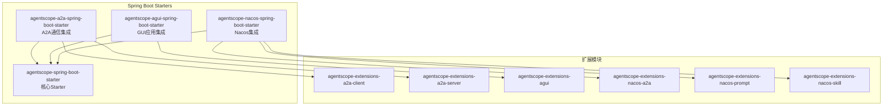
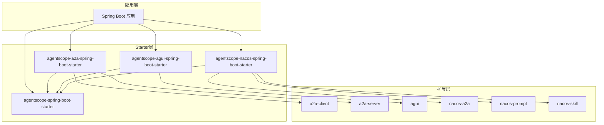
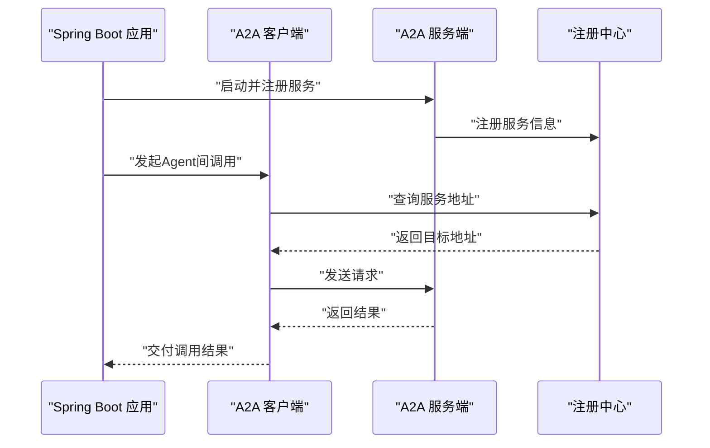
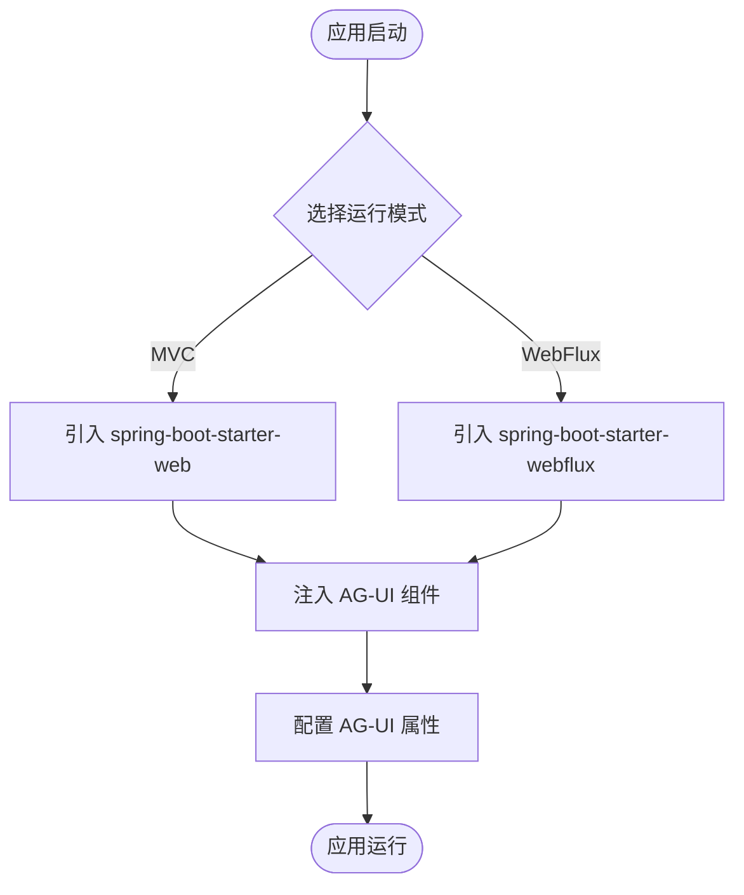
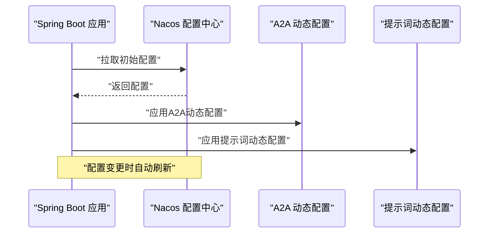
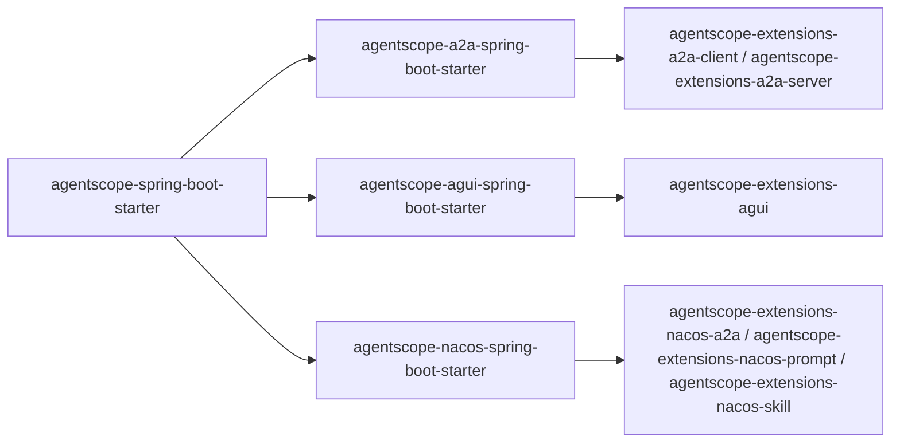

# 其他专用Starter

<cite>
**本文引用的文件**
- [agentscope-a2a-spring-boot-starter/pom.xml](file://agentscope-extensions/agentscope-spring-boot-starters/agentscope-a2a-spring-boot-starter/pom.xml)
- [agentscope-agui-spring-boot-starter/pom.xml](file://agentscope-extensions/agentscope-spring-boot-starters/agentscope-agui-spring-boot-starter/pom.xml)
- [agentscope-nacos-spring-boot-starter/pom.xml](file://agentscope-extensions/agentscope-spring-boot-starters/agentscope-nacos-spring-boot-starter/pom.xml)
- [agentscope-spring-boot-starter/pom.xml](file://agentscope-extensions/agentscope-spring-boot-starters/agentscope-spring-boot-starter/pom.xml)
- [agentscope-extensions-a2a-client/pom.xml](file://agentscope-extensions/agentscope-extensions-protocol/agentscope-extensions-a2a/agentscope-extensions-a2a-client/pom.xml)
- [agentscope-extensions-a2a-server/pom.xml](file://agentscope-extensions/agentscope-extensions-protocol/agentscope-extensions-a2a/agentscope-extensions-a2a-server/pom.xml)
- [agentscope-extensions-agui/pom.xml](file://agentscope-extensions/agentscope-extensions-protocol/agentscope-extensions-agui/pom.xml)
- [agentscope-extensions-nacos-a2a/pom.xml](file://agentscope-extensions/agentscope-extensions-nacos/agentscope-extensions-nacos-a2a/pom.xml)
- [agentscope-extensions-nacos-prompt/pom.xml](file://agentscope-extensions/agentscope-extensions-nacos/agentscope-extensions-nacos-prompt/pom.xml)
- [agentscope-extensions-nacos-skill/pom.xml](file://agentscope-extensions/agentscope-extensions-nacos/agentscope-extensions-nacos-skill/pom.xml)
- [pom.xml](file://pom.xml)
- [README_zh.md](file://README_zh.md)
</cite>

## 目录
1. [简介](#简介)
2. [项目结构](#项目结构)
3. [核心组件](#核心组件)
4. [架构总览](#架构总览)
5. [详细组件分析](#详细组件分析)
6. [依赖分析](#依赖分析)
7. [性能考虑](#性能考虑)
8. [故障排除指南](#故障排除指南)
9. [结论](#结论)
10. [附录](#附录)

## 简介
本指南面向需要在Spring Boot应用中快速集成AgentScope专用能力的开发者，重点覆盖以下三个Starter的使用方法与最佳实践：
- agentscope-a2a-spring-boot-starter：用于Agent-to-Agent（A2A）通信的集成，支持服务端与客户端能力自动装配。
- agentscope-agui-spring-boot-starter：用于GUI应用的集成，同时兼容MVC与WebFlux两种运行模式。
- agentscope-nacos-spring-boot-starter：与Nacos配置中心/服务发现的集成，提供A2A与提示词等能力的动态配置。

同时，文档还涵盖各Starter的适用场景、配置要点、与其他Spring Boot功能的协同方式、故障排除与调试建议，并给出实际项目中的应用案例与最佳实践。

## 项目结构
AgentScope的Spring Boot Starter位于agentscope-extensions/agentscope-spring-boot-starters目录下，分别对应上述三大能力。每个Starter均以独立的Maven模块存在，并通过父工程统一管理版本与依赖。

图表来源
- [agentscope-a2a-spring-boot-starter/pom.xml:36-59](file://agentscope-extensions/agentscope-spring-boot-starters/agentscope-a2a-spring-boot-starter/pom.xml#L36-L59)
- [agentscope-agui-spring-boot-starter/pom.xml:36-57](file://agentscope-extensions/agentscope-spring-boot-starters/agentscope-agui-spring-boot-starter/pom.xml#L36-L57)
- [agentscope-nacos-spring-boot-starter/pom.xml:36-49](file://agentscope-extensions/agentscope-spring-boot-starters/agentscope-nacos-spring-boot-starter/pom.xml#L36-L49)

章节来源
- [pom.xml:133-150](file://pom.xml#L133-L150)

## 核心组件
本节对三大Starter的核心职责与关键依赖进行概览，帮助读者快速定位适用场景与集成入口。

- agentscope-a2a-spring-boot-starter
  - 职责：提供A2A通信的自动装配，包括客户端与服务端能力，以及与核心Starter的组合使用。
  - 关键依赖：agentscope-extensions-a2a-client、agentscope-extensions-a2a-server、agentscope-spring-boot-starter。
  - 适用场景：需要在Spring Boot应用中启用Agent间的远程调用、服务注册与发现、消息路由等能力。

- agentscope-agui-spring-boot-starter
  - 职责：提供GUI应用的自动装配，支持MVC与WebFlux两种运行模式，便于在Spring Boot中集成AgentScope的前端界面能力。
  - 关键依赖：agentscope-extensions-agui、agentscope-spring-boot-starter，可选spring-boot-starter-web或spring-boot-starter-webflux。
  - 适用场景：需要在Spring Boot后端提供GUI界面或与前端交互的Agent应用。

- agentscope-nacos-spring-boot-starter
  - 职责：提供与Nacos的集成，包括A2A与提示词等能力的动态配置与服务发现。
  - 关键依赖：agentscope-extensions-nacos-a2a、agentscope-extensions-nacos-prompt、agentscope-extensions-nacos-skill，以及核心Starter。
  - 适用场景：需要将AgentScope能力与Nacos配置中心/服务发现结合，实现动态配置与服务治理。

章节来源
- [agentscope-a2a-spring-boot-starter/pom.xml:36-59](file://agentscope-extensions/agentscope-spring-boot-starters/agentscope-a2a-spring-boot-starter/pom.xml#L36-L59)
- [agentscope-agui-spring-boot-starter/pom.xml:36-57](file://agentscope-extensions/agentscope-spring-boot-starters/agentscope-agui-spring-boot-starter/pom.xml#L36-L57)
- [agentscope-nacos-spring-boot-starter/pom.xml:36-49](file://agentscope-extensions/agentscope-spring-boot-starters/agentscope-nacos-spring-boot-starter/pom.xml#L36-L49)

## 架构总览
下图展示了三大Starter与其扩展模块之间的关系，以及与核心Starter的组合使用方式：

图表来源
- [agentscope-a2a-spring-boot-starter/pom.xml:36-59](file://agentscope-extensions/agentscope-spring-boot-starters/agentscope-a2a-spring-boot-starter/pom.xml#L36-L59)
- [agentscope-agui-spring-boot-starter/pom.xml:36-57](file://agentscope-extensions/agentscope-spring-boot-starters/agentscope-agui-spring-boot-starter/pom.xml#L36-L57)
- [agentscope-nacos-spring-boot-starter/pom.xml:36-49](file://agentscope-extensions/agentscope-spring-boot-starters/agentscope-nacos-spring-boot-starter/pom.xml#L36-L49)

## 详细组件分析

### agentscope-a2a-spring-boot-starter 使用指南
- 适用场景
  - 分布式Agent协作：通过A2A协议实现Agent间的服务发现与远程调用。
  - 微服务风格的Agent架构：将Agent能力注册到Nacos或其他注册中心，实现跨进程/跨实例的调用。
- 依赖配置要点
  - 核心依赖：agentscope-extensions-a2a-client、agentscope-extensions-a2a-server。
  - 可选依赖：spring-boot-starter-web（若需要HTTP接口）、spring-boot-autoconfigure（自动装配SPI）。
  - 与核心Starter组合：agentscope-spring-boot-starter提供通用自动装配能力。
- 基本使用步骤
  - 在应用中引入agentscope-a2a-spring-boot-starter。
  - 配置A2A相关属性（如服务名、注册中心地址等），具体键值参考扩展模块的配置元数据。
  - 启动应用后，自动装配会注入A2A客户端与服务端组件，可在业务中直接使用Agent间通信能力。
- 与其他Spring Boot功能的协同
  - 与Web/MVC/WebFlux协同：根据应用类型选择合适的Starter，A2A通信通常作为后端服务的一部分。
  - 与配置中心/服务发现协同：结合Nacos Starter使用，实现动态配置与服务治理。
- 故障排除与调试
  - 检查自动装配是否生效：确认A2A客户端与服务端组件已注入。
  - 校验注册中心连通性：确保Agent能正确注册与发现服务。
  - 查看日志：关注A2A通信过程中的异常与超时信息。

图表来源
- [agentscope-a2a-spring-boot-starter/pom.xml:36-59](file://agentscope-extensions/agentscope-spring-boot-starters/agentscope-a2a-spring-boot-starter/pom.xml#L36-L59)
- [agentscope-extensions-a2a-client/pom.xml](file://agentscope-extensions/agentscope-extensions-protocol/agentscope-extensions-a2a/agentscope-extensions-a2a-client/pom.xml)
- [agentscope-extensions-a2a-server/pom.xml](file://agentscope-extensions/agentscope-extensions-protocol/agentscope-extensions-a2a/agentscope-extensions-a2a-server/pom.xml)

章节来源
- [agentscope-a2a-spring-boot-starter/pom.xml:36-59](file://agentscope-extensions/agentscope-spring-boot-starters/agentscope-a2a-spring-boot-starter/pom.xml#L36-L59)

### agentscope-agui-spring-boot-starter 使用指南
- 适用场景
  - 需要在Spring Boot应用中集成GUI界面，支持MVC或WebFlux两种运行模式。
  - 与AgentScope的前端界面能力结合，提供用户交互与可视化展示。
- 依赖配置要点
  - 核心依赖：agentscope-extensions-agui。
  - 运行模式：可选spring-boot-starter-web（MVC）或spring-boot-starter-webflux（响应式）。
  - 与核心Starter组合：agentscope-spring-boot-starter提供通用自动装配能力。
- 基本使用步骤
  - 在应用中引入agentscope-agui-spring-boot-starter。
  - 根据应用类型选择MVC或WebFlux依赖。
  - 配置AG-UI相关属性（如静态资源路径、界面主题等），具体键值参考扩展模块的配置元数据。
  - 启动应用后，自动装配会注入GUI相关的组件与控制器。
- 与其他Spring Boot功能的协同
  - 与Web/MVC/WebFlux协同：根据业务形态选择合适的运行模式。
  - 与静态资源处理协同：确保前端资源可被正确访问与缓存。
- 故障排除与调试
  - 检查自动装配是否生效：确认GUI相关组件已注入。
  - 校验静态资源路径：确保前端页面与资源可正常加载。
  - 查看日志：关注GUI初始化与路由过程中的异常信息。

图表来源
- [agentscope-agui-spring-boot-starter/pom.xml:36-71](file://agentscope-extensions/agentscope-spring-boot-starters/agentscope-agui-spring-boot-starter/pom.xml#L36-L71)
- [agentscope-extensions-agui/pom.xml](file://agentscope-extensions/agentscope-extensions-protocol/agentscope-extensions-agui/pom.xml)

章节来源
- [agentscope-agui-spring-boot-starter/pom.xml:36-71](file://agentscope-extensions/agentscope-spring-boot-starters/agentscope-agui-spring-boot-starter/pom.xml#L36-L71)

### agentscope-nacos-spring-boot-starter 使用指南
- 适用场景
  - 将AgentScope能力与Nacos配置中心/服务发现结合，实现动态配置与服务治理。
  - 支持A2A与提示词等能力的集中管理与动态更新。
- 依赖配置要点
  - 核心依赖：agentscope-extensions-nacos-a2a、agentscope-extensions-nacos-prompt、agentscope-extensions-nacos-skill。
  - 与核心Starter组合：agentscope-spring-boot-starter提供通用自动装配能力。
- 基本使用步骤
  - 在应用中引入agentscope-nacos-spring-boot-starter。
  - 配置Nacos连接参数（如服务器地址、命名空间、鉴权信息等）。
  - 配置A2A与提示词等能力的动态属性，具体键值参考扩展模块的配置元数据。
  - 启动应用后，自动装配会注入Nacos相关的配置监听与服务发现组件。
- 与其他Spring Boot功能的协同
  - 与Spring Cloud Alibaba/Nacos Starter协同：共享Nacos配置与服务发现能力。
  - 与配置中心协同：实现配置热更新与灰度发布。
- 故障排除与调试
  - 检查自动装配是否生效：确认Nacos相关组件已注入。
  - 校验Nacos连通性：确保配置拉取与服务发现正常。
  - 查看日志：关注配置监听与服务注册过程中的异常信息。

图表来源
- [agentscope-nacos-spring-boot-starter/pom.xml:36-67](file://agentscope-extensions/agentscope-spring-boot-starters/agentscope-nacos-spring-boot-starter/pom.xml#L36-L67)
- [agentscope-extensions-nacos-a2a/pom.xml](file://agentscope-extensions/agentscope-extensions-nacos/agentscope-extensions-nacos-a2a/pom.xml)
- [agentscope-extensions-nacos-prompt/pom.xml](file://agentscope-extensions/agentscope-extensions-nacos/agentscope-extensions-nacos-prompt/pom.xml)
- [agentscope-extensions-nacos-skill/pom.xml](file://agentscope-extensions/agentscope-extensions-nacos/agentscope-extensions-nacos-skill/pom.xml)

章节来源
- [agentscope-nacos-spring-boot-starter/pom.xml:36-67](file://agentscope-extensions/agentscope-spring-boot-starters/agentscope-nacos-spring-boot-starter/pom.xml#L36-L67)

## 依赖分析
三大Starter均以agentscope-spring-boot-starter为核心依赖，确保通用自动装配能力的一致性；同时各自引入对应的扩展模块以实现特定能力。

图表来源
- [agentscope-a2a-spring-boot-starter/pom.xml:36-59](file://agentscope-extensions/agentscope-spring-boot-starters/agentscope-a2a-spring-boot-starter/pom.xml#L36-L59)
- [agentscope-agui-spring-boot-starter/pom.xml:36-57](file://agentscope-extensions/agentscope-spring-boot-starters/agentscope-agui-spring-boot-starter/pom.xml#L36-L57)
- [agentscope-nacos-spring-boot-starter/pom.xml:36-49](file://agentscope-extensions/agentscope-spring-boot-starters/agentscope-nacos-spring-boot-starter/pom.xml#L36-L49)

章节来源
- [agentscope-spring-boot-starter/pom.xml](file://agentscope-extensions/agentscope-spring-boot-starters/agentscope-spring-boot-starter/pom.xml)
- [agentscope-a2a-spring-boot-starter/pom.xml:36-59](file://agentscope-extensions/agentscope-spring-boot-starters/agentscope-a2a-spring-boot-starter/pom.xml#L36-L59)
- [agentscope-agui-spring-boot-starter/pom.xml:36-57](file://agentscope-extensions/agentscope-spring-boot-starters/agentscope-agui-spring-boot-starter/pom.xml#L36-L57)
- [agentscope-nacos-spring-boot-starter/pom.xml:36-49](file://agentscope-extensions/agentscope-spring-boot-starters/agentscope-nacos-spring-boot-starter/pom.xml#L36-L49)

## 性能考虑
- 响应式优先：在高并发场景下，优先采用WebFlux与响应式模型，减少阻塞带来的资源消耗。
- 连接池与超时：合理配置A2A通信与Nacos连接的超时与重试策略，避免长连接导致的资源泄漏。
- 静态资源优化：在GUI应用中，合理设置静态资源缓存与压缩策略，提升页面加载速度。
- 配置热更新：利用Nacos的动态配置能力，避免频繁重启带来的性能损耗。

## 故障排除指南
- 自动装配未生效
  - 检查Starter依赖是否正确引入。
  - 确认spring.factories或条件注解满足自动装配触发条件。
- 注册中心/配置中心异常
  - 校验网络连通性与鉴权信息。
  - 查看配置拉取与服务注册的日志输出。
- A2A通信失败
  - 校验服务名与实例地址是否正确。
  - 检查防火墙与负载均衡配置。
- GUI页面无法加载
  - 校验静态资源路径与CORS配置。
  - 确认路由与控制器映射无冲突。

## 结论
agentscope-a2a-spring-boot-starter、agentscope-agui-spring-boot-starter与agentscope-nacos-spring-boot-starter为在Spring Boot中集成AgentScope专用能力提供了开箱即用的解决方案。通过合理的依赖配置与场景适配，开发者可以快速实现Agent间的通信、GUI界面集成以及与Nacos的动态配置与服务治理。建议在生产环境中结合响应式模型、连接池与超时控制、静态资源优化与配置热更新等最佳实践，以获得更稳定与高效的运行效果。

## 附录
- 实际项目中的应用案例与最佳实践
  - A2A通信：在微服务化的Agent架构中，将不同Agent能力封装为独立服务，通过A2A协议实现跨服务调用与编排。
  - GUI应用：在Spring Boot后端集成AG-UI，提供可视化界面与交互体验，适合演示与运营场景。
  - Nacos集成：将Agent的提示词模板、工具配置与A2A服务信息托管至Nacos，实现集中管理与动态更新。
- 参考资料
  - 项目整体介绍与生产就绪特性参见项目说明文档。

章节来源
- [README_zh.md:54-82](file://README_zh.md#L54-L82)