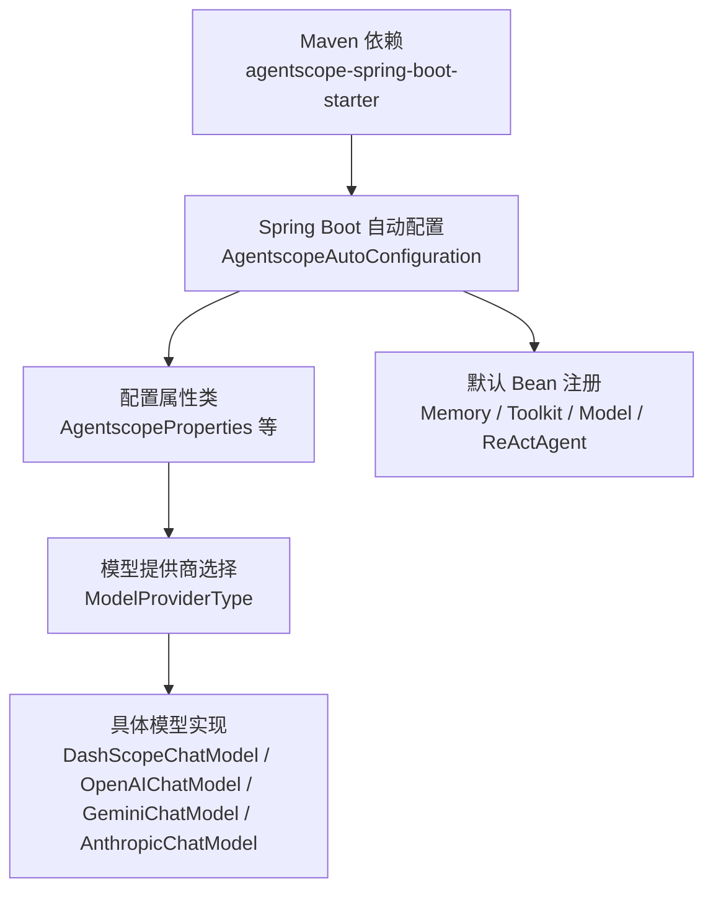
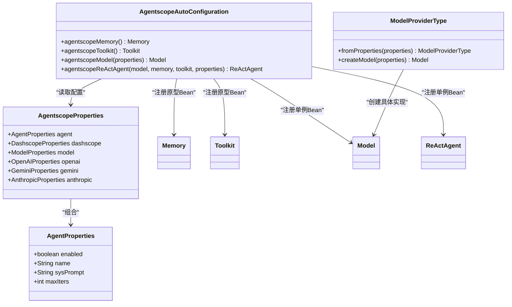
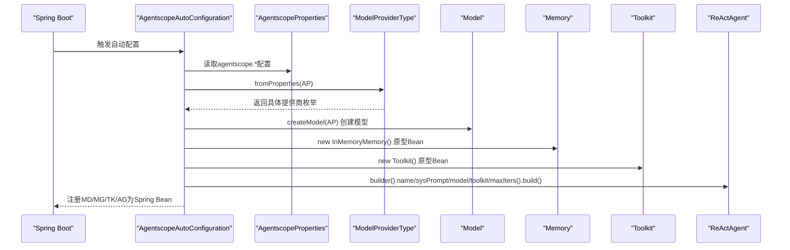
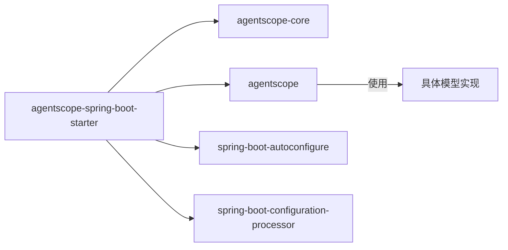

# 基础Starter

<cite>
**本文引用的文件**
- [pom.xml](file://agentscope-extensions/agentscope-spring-boot-starters/agentscope-spring-boot-starter/pom.xml)
- [AgentscopeAutoConfiguration.java](file://agentscope-extensions/agentscope-spring-boot-starters/agentscope-spring-boot-starter/src/main/java/io/agentscope/spring/boot/AgentscopeAutoConfiguration.java)
- [AgentscopeProperties.java](file://agentscope-extensions/agentscope-spring-boot-starters/agentscope-spring-boot-starter/src/main/java/io/agentscope/spring/boot/properties/AgentscopeProperties.java)
- [AgentProperties.java](file://agentscope-extensions/agentscope-spring-boot-starters/agentscope-spring-boot-starter/src/main/java/io/agentscope/spring/boot/properties/AgentProperties.java)
- [ModelProperties.java](file://agentscope-extensions/agentscope-spring-boot-starters/agentscope-spring-boot-starter/src/main/java/io/agentscope/spring/boot/properties/ModelProperties.java)
- [DashscopeProperties.java](file://agentscope-extensions/agentscope-spring-boot-starters/agentscope-spring-boot-starter/src/main/java/io/agentscope/spring/boot/properties/DashscopeProperties.java)
- [OpenAIProperties.java](file://agentscope-extensions/agentscope-spring-boot-starters/agentscope-spring-boot-starter/src/main/java/io/agentscope/spring/boot/properties/OpenAIProperties.java)
- [GeminiProperties.java](file://agentscope-extensions/agentscope-spring-boot-starters/agentscope-spring-boot-starter/src/main/java/io/agentscope/spring/boot/properties/GeminiProperties.java)
- [ModelProviderType.java](file://agentscope-extensions/agentscope-spring-boot-starters/agentscope-spring-boot-starter/src/main/java/io/agentscope/spring/boot/model/ModelProviderType.java)
</cite>

## 目录
1. [简介](#简介)
2. [项目结构](#项目结构)
3. [核心组件](#核心组件)
4. [架构总览](#架构总览)
5. [详细组件分析](#详细组件分析)
6. [依赖关系分析](#依赖关系分析)
7. [性能考虑](#性能考虑)
8. [故障排除指南](#故障排除指南)
9. [结论](#结论)
10. [附录](#附录)

## 简介
本指南面向在Spring Boot项目中引入并使用AgentScope基础Starter（agentscope-spring-boot-starter）的开发者，帮助您完成Maven依赖引入、配置项设置、自动装配原理与Bean注册机制的理解，并提供常见配置场景的最佳实践、故障排除与性能优化建议。通过该Starter，您可以快速在Spring容器中获得默认的AgentScope实例、模型工厂、工具注册器等核心能力，从而专注于业务逻辑开发。

## 项目结构
agentscope-spring-boot-starter位于agentscope-extensions模块下，作为Spring Boot Starter的核心入口，负责将AgentScope核心能力以自动配置的方式注入到Spring应用上下文中。其关键职责包括：
- 引入AgentScope核心库与Spring Boot自动配置SPI
- 提供配置属性类，支持多模型提供商（DashScope、OpenAI、Gemini、Anthropic）
- 在满足条件时自动注册默认的Memory、Toolkit、Model与ReActAgent Bean

图表来源
- [pom.xml:38-73](file://agentscope-extensions/agentscope-spring-boot-starters/agentscope-spring-boot-starter/pom.xml#L38-L73)
- [AgentscopeAutoConfiguration.java:125-203](file://agentscope-extensions/agentscope-spring-boot-starters/agentscope-spring-boot-starter/src/main/java/io/agentscope/spring/boot/AgentscopeAutoConfiguration.java#L125-L203)
- [ModelProviderType.java:34-184](file://agentscope-extensions/agentscope-spring-boot-starters/agentscope-spring-boot-starter/src/main/java/io/agentscope/spring/boot/model/ModelProviderType.java#L34-L184)

章节来源
- [pom.xml:17-78](file://agentscope-extensions/agentscope-spring-boot-starters/agentscope-spring-boot-starter/pom.xml#L17-L78)

## 核心组件
- 自动配置类：AgentscopeAutoConfiguration
  - 负责在满足条件时注册默认的Memory、Toolkit、Model与ReActAgent Bean
  - 通过条件注解控制启用范围与Bean作用域
- 配置属性类族：
  - AgentscopeProperties：根级命名空间agentscope
  - AgentProperties：agentscope.agent
  - ModelProperties：agentscope.model
  - DashscopeProperties：agentscope.dashscope
  - OpenAIProperties：agentscope.openai
  - GeminiProperties：agentscope.gemini
  - AnthropicProperties：agentscope.anthropic
- 模型提供商策略：ModelProviderType
  - 基于配置选择具体模型实现（DashScope、OpenAI、Gemini、Anthropic）

章节来源
- [AgentscopeAutoConfiguration.java:125-203](file://agentscope-extensions/agentscope-spring-boot-starters/agentscope-spring-boot-starter/src/main/java/io/agentscope/spring/boot/AgentscopeAutoConfiguration.java#L125-L203)
- [AgentscopeProperties.java:34-72](file://agentscope-extensions/agentscope-spring-boot-starters/agentscope-spring-boot-starter/src/main/java/io/agentscope/spring/boot/properties/AgentscopeProperties.java#L34-L72)
- [AgentProperties.java:32-85](file://agentscope-extensions/agentscope-spring-boot-starters/agentscope-spring-boot-starter/src/main/java/io/agentscope/spring/boot/properties/AgentProperties.java#L32-L85)
- [ModelProperties.java:29-52](file://agentscope-extensions/agentscope-spring-boot-starters/agentscope-spring-boot-starter/src/main/java/io/agentscope/spring/boot/properties/ModelProperties.java#L29-L52)
- [DashscopeProperties.java:33-99](file://agentscope-extensions/agentscope-spring-boot-starters/agentscope-spring-boot-starter/src/main/java/io/agentscope/spring/boot/properties/DashscopeProperties.java#L33-L99)
- [OpenAIProperties.java:36-117](file://agentscope-extensions/agentscope-spring-boot-starters/agentscope-spring-boot-starter/src/main/java/io/agentscope/spring/boot/properties/OpenAIProperties.java#L36-L117)
- [GeminiProperties.java:49-141](file://agentscope-extensions/agentscope-spring-boot-starters/agentscope-spring-boot-starter/src/main/java/io/agentscope/spring/boot/properties/GeminiProperties.java#L49-L141)
- [ModelProviderType.java:34-184](file://agentscope-extensions/agentscope-spring-boot-starters/agentscope-spring-boot-starter/src/main/java/io/agentscope/spring/boot/model/ModelProviderType.java#L34-L184)

## 架构总览
下图展示了Starter在Spring Boot中的装配流程与Bean交互关系：

图表来源
- [AgentscopeAutoConfiguration.java:125-203](file://agentscope-extensions/agentscope-spring-boot-starters/agentscope-spring-boot-starter/src/main/java/io/agentscope/spring/boot/AgentscopeAutoConfiguration.java#L125-L203)
- [AgentscopeProperties.java:34-72](file://agentscope-extensions/agentscope-spring-boot-starters/agentscope-spring-boot-starter/src/main/java/io/agentscope/spring/boot/properties/AgentscopeProperties.java#L34-L72)
- [AgentProperties.java:32-85](file://agentscope-extensions/agentscope-spring-boot-starters/agentscope-spring-boot-starter/src/main/java/io/agentscope/spring/boot/properties/AgentProperties.java#L32-L85)
- [ModelProviderType.java:34-184](file://agentscope-extensions/agentscope-spring-boot-starters/agentscope-spring-boot-starter/src/main/java/io/agentscope/spring/boot/model/ModelProviderType.java#L34-L184)

## 详细组件分析

### 自动配置类工作原理
- 条件启用
  - 仅当classpath存在ReActAgent类时才进行自动配置
  - 仅当agentscope.agent.enabled为true时才注册默认Bean
- Bean注册策略
  - Memory与Toolkit：原型作用域，适合在多线程/Web环境中按需获取
  - Model：根据agentscope.model.provider选择具体实现，单例注册
  - ReActAgent：单例注册，内部线程安全，便于全局共享
- 依赖注入与构建
  - Model由ModelProviderType根据配置动态创建
  - ReActAgent通过builder模式组装name、sysPrompt、model、toolkit、maxIters等参数

图表来源
- [AgentscopeAutoConfiguration.java:125-203](file://agentscope-extensions/agentscope-spring-boot-starters/agentscope-spring-boot-starter/src/main/java/io/agentscope/spring/boot/AgentscopeAutoConfiguration.java#L125-L203)
- [ModelProviderType.java:169-184](file://agentscope-extensions/agentscope-spring-boot-starters/agentscope-spring-boot-starter/src/main/java/io/agentscope/spring/boot/model/ModelProviderType.java#L169-L184)

章节来源
- [AgentscopeAutoConfiguration.java:125-203](file://agentscope-extensions/agentscope-spring-boot-starters/agentscope-spring-boot-starter/src/main/java/io/agentscope/spring/boot/AgentscopeAutoConfiguration.java#L125-L203)

### 配置属性与可选参数
- 根配置：agentscope.*
  - agentscope.agent：控制是否启用默认Agent及Agent行为参数
  - agentscope.model：选择模型提供商（dashscope/openai/gemini/anthropic）
  - 各提供商专属配置：agentscope.dashscope、agentscope.openai、agentscope.gemini、agentscope.anthropic
- 典型可配置项（节选）
  - AgentProperties：enabled、name、sysPrompt、maxIters
  - ModelProperties：provider
  - DashscopeProperties：enabled、apiKey、modelName、stream、enableThinking
  - OpenAIProperties：enabled、apiKey、modelName、baseUrl、endpointPath、stream
  - GeminiProperties：enabled、apiKey、modelName、stream、project、location、vertexAI
  - AnthropicProperties：enabled、apiKey、modelName、stream、baseUrl

章节来源
- [AgentscopeProperties.java:34-72](file://agentscope-extensions/agentscope-spring-boot-starters/agentscope-spring-boot-starter/src/main/java/io/agentscope/spring/boot/properties/AgentscopeProperties.java#L34-L72)
- [AgentProperties.java:32-85](file://agentscope-extensions/agentscope-spring-boot-starters/agentscope-spring-boot-starter/src/main/java/io/agentscope/spring/boot/properties/AgentProperties.java#L32-L85)
- [ModelProperties.java:29-52](file://agentscope-extensions/agentscope-spring-boot-starters/agentscope-spring-boot-starter/src/main/java/io/agentscope/spring/boot/properties/ModelProperties.java#L29-L52)
- [DashscopeProperties.java:33-99](file://agentscope-extensions/agentscope-spring-boot-starters/agentscope-spring-boot-starter/src/main/java/io/agentscope/spring/boot/properties/DashscopeProperties.java#L33-L99)
- [OpenAIProperties.java:36-117](file://agentscope-extensions/agentscope-spring-boot-starters/agentscope-spring-boot-starter/src/main/java/io/agentscope/spring/boot/properties/OpenAIProperties.java#L36-L117)
- [GeminiProperties.java:49-141](file://agentscope-extensions/agentscope-spring-boot-starters/agentscope-spring-boot-starter/src/main/java/io/agentscope/spring/boot/properties/GeminiProperties.java#L49-L141)

### 核心Bean的自动注册机制
- Memory（原型作用域）
  - 适用场景：会话/请求级别的状态存储
  - 获取方式：推荐通过ObjectProvider<Memory>或方法注入按需获取
- Toolkit（原型作用域）
  - 适用场景：运行时动态注册工具函数
  - 获取方式：推荐通过ObjectProvider<Toolkit>或方法注入按需获取
- Model（单例作用域）
  - 依据agentscope.model.provider选择具体实现
  - 支持DashScope、OpenAI、Gemini、Anthropic
- ReActAgent（单例作用域）
  - 内部线程安全，适合全局共享
  - 可通过AgentProperties定制名称、系统提示词、最大迭代次数

章节来源
- [AgentscopeAutoConfiguration.java:140-202](file://agentscope-extensions/agentscope-spring-boot-starters/agentscope-spring-boot-starter/src/main/java/io/agentscope/spring/boot/AgentscopeAutoConfiguration.java#L140-L202)

### 与Spring容器的集成与生命周期
- 自动装配触发：当classpath包含ReActAgent且配置开启时生效
- Bean作用域：
  - Memory/Toolkit：prototype，避免跨请求/线程的状态污染
  - Model/ReActAgent：singleton，减少重复初始化开销
- 生命周期管理：
  - 默认Bean由Spring容器托管；如需自定义，可通过声明同名Bean覆盖
  - 关闭/重启时，ReActAgent与Model保持单例不变，Memory/Toolkit需按请求/会话重建

章节来源
- [AgentscopeAutoConfiguration.java:125-203](file://agentscope-extensions/agentscope-spring-boot-starters/agentscope-spring-boot-starter/src/main/java/io/agentscope/spring/boot/AgentscopeAutoConfiguration.java#L125-L203)

### 常见配置场景与最佳实践
- 使用DashScope作为默认提供商（无额外配置时默认值）
  - 设置agentscope.model.provider=dashscope
  - 配置agentscope.dashscope.api-key与agentscope.dashscope.model-name
- 使用OpenAI提供商
  - 设置agentscope.model.provider=openai
  - 配置agentscope.openai.api-key与agentscope.openai.model-name
  - 如使用兼容端点，可配置agentscope.openai.base-url与agentscope.openai.endpoint-path
- 使用Gemini提供商（直接API或Vertex AI）
  - 直接API：配置agentscope.gemini.api-key与agentscope.gemini.model-name
  - Vertex AI：配置agentscope.gemini.project、agentscope.gemini.location，并开启agentscope.gemini.vertex-ai
- 使用Anthropic提供商
  - 设置agentscope.model.provider=anthropic
  - 配置agentscope.anthropic.api-key与agentscope.anthropic.model-name
- 自定义Agent行为
  - 通过agentscope.agent.name、agentscope.agent.sys-prompt、agentscope.agent.max-iters调整默认ReActAgent

章节来源
- [AgentscopeAutoConfiguration.java:43-123](file://agentscope-extensions/agentscope-spring-boot-starters/agentscope-spring-boot-starter/src/main/java/io/agentscope/spring/boot/AgentscopeAutoConfiguration.java#L43-L123)
- [ModelProviderType.java:34-149](file://agentscope-extensions/agentscope-spring-boot-starters/agentscope-spring-boot-starter/src/main/java/io/agentscope/spring/boot/model/ModelProviderType.java#L34-L149)

## 依赖关系分析
- Maven依赖要点
  - 引入AgentScope核心库与agentscope包
  - spring-boot-autoconfigure用于自动配置SPI
  - spring-boot-configuration-processor生成配置元数据，增强IDE体验
- 运行时依赖链
  - ModelProviderType根据配置选择具体模型实现
  - ReActAgent依赖Model、Memory、Toolkit

图表来源
- [pom.xml:38-73](file://agentscope-extensions/agentscope-spring-boot-starters/agentscope-spring-boot-starter/pom.xml#L38-L73)

章节来源
- [pom.xml:38-73](file://agentscope-extensions/agentscope-spring-boot-starters/agentscope-spring-boot-starter/pom.xml#L38-L73)

## 性能考虑
- 单例Bean复用
  - Model与ReActAgent为单例，减少对象创建与初始化成本
- 原型Bean按需获取
  - Memory与Toolkit为原型，避免不必要的状态共享与锁竞争
- 流式响应
  - 多数提供商支持流式输出，建议在需要实时反馈的场景启用stream
- 最大迭代限制
  - 通过agentscope.agent.max-iters限制单次请求的迭代次数，防止长耗时或死循环

## 故障排除指南
- 启用异常：未配置提供商或禁用对应提供商
  - 现象：抛出非法状态异常，提示提供商被禁用或缺少必要配置
  - 排查：确认agentscope.model.provider与对应提供商的enabled、apiKey等配置齐全
- 未检测到ReActAgent类
  - 现象：自动配置不生效
  - 排查：确保已引入AgentScope核心库或相关依赖
- 配置项缺失
  - 现象：启动时报错或默认值不符合预期
  - 排查：对照各提供商属性类检查必填字段（如apiKey、modelName等）

章节来源
- [ModelProviderType.java:36-149](file://agentscope-extensions/agentscope-spring-boot-starters/agentscope-spring-boot-starter/src/main/java/io/agentscope/spring/boot/model/ModelProviderType.java#L36-L149)
- [AgentscopeAutoConfiguration.java:125-203](file://agentscope-extensions/agentscope-spring-boot-starters/agentscope-spring-boot-starter/src/main/java/io/agentscope/spring/boot/AgentscopeAutoConfiguration.java#L125-L203)

## 结论
agentscope-spring-boot-starter通过简洁的配置与自动装配，将AgentScope的核心能力无缝集成到Spring Boot应用中。借助默认的Memory、Toolkit、Model与ReActAgent Bean，开发者可以快速搭建智能体应用。建议结合自身需求选择合适的模型提供商，合理设置Agent行为参数，并遵循原型/单例的作用域约定，以获得更佳的性能与可维护性。

## 附录

### Maven依赖引入步骤
- 在项目的pom.xml中添加对agentscope-spring-boot-starter的依赖
- 确保父工程或BOM已正确引入相关版本管理

章节来源
- [pom.xml:22-28](file://agentscope-extensions/agentscope-spring-boot-starters/agentscope-spring-boot-starter/pom.xml#L22-L28)

### application.yml 配置示例路径
- DashScope默认配置示例：[AgentscopeAutoConfiguration.java:43-61](file://agentscope-extensions/agentscope-spring-boot-starters/agentscope-spring-boot-starter/src/main/java/io/agentscope/spring/boot/AgentscopeAutoConfiguration.java#L43-L61)
- OpenAI提供商配置示例：[AgentscopeAutoConfiguration.java:66-76](file://agentscope-extensions/agentscope-spring-boot-starters/agentscope-spring-boot-starter/src/main/java/io/agentscope/spring/boot/AgentscopeAutoConfiguration.java#L66-L76)
- Gemini直接API配置示例：[AgentscopeAutoConfiguration.java:79-108](file://agentscope-extensions/agentscope-spring-boot-starters/agentscope-spring-boot-starter/src/main/java/io/agentscope/spring/boot/AgentscopeAutoConfiguration.java#L79-L108)
- Gemini Vertex AI配置示例：[AgentscopeAutoConfiguration.java:94-123](file://agentscope-extensions/agentscope-spring-boot-starters/agentscope-spring-boot-starter/src/main/java/io/agentscope/spring/boot/AgentscopeAutoConfiguration.java#L94-L123)