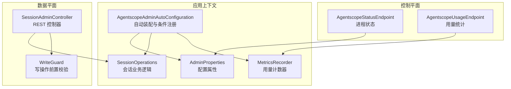
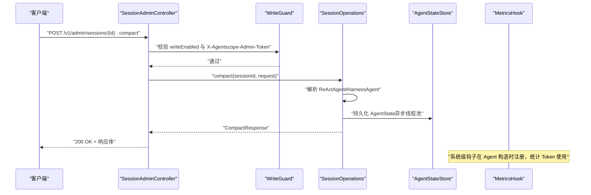
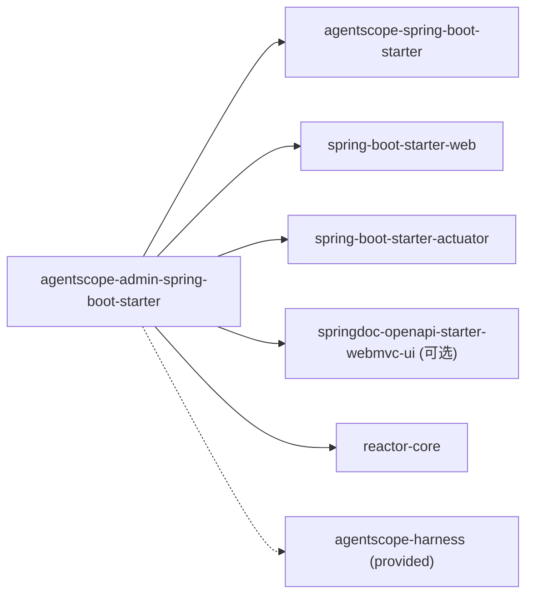

# 管理Starter

<cite>
**本文引用的文件**
- [AgentscopeAdminAutoConfiguration.java](file://agentscope-extensions/agentscope-spring-boot-starters/agentscope-admin-spring-boot-starter/src/main/java/io/agentscope/spring/boot/admin/AgentscopeAdminAutoConfiguration.java)
- [AdminProperties.java](file://agentscope-extensions/agentscope-spring-boot-starters/agentscope-admin-spring-boot-starter/src/main/java/io/agentscope/spring/boot/admin/properties/AdminProperties.java)
- [SessionAdminController.java](file://agentscope-extensions/agentscope-spring-boot-starters/agentscope-admin-spring-boot-starter/src/main/java/io/agentscope/spring/boot/admin/controller/SessionAdminController.java)
- [SessionOperations.java](file://agentscope-extensions/agentscope-spring-boot-starters/agentscope-admin-spring-boot-starter/src/main/java/io/agentscope/spring/boot/admin/service/SessionOperations.java)
- [AgentscopeStatusEndpoint.java](file://agentscope-extensions/agentscope-spring-boot-starters/agentscope-admin-spring-boot-starter/src/main/java/io/agentscope/spring/boot/admin/endpoint/AgentscopeStatusEndpoint.java)
- [AgentscopeUsageEndpoint.java](file://agentscope-extensions/agentscope-spring-boot-starters/agentscope-admin-spring-boot-starter/src/main/java/io/agentscope/spring/boot/admin/endpoint/AgentscopeUsageEndpoint.java)
- [MetricsRecorder.java](file://agentscope-extensions/agentscope-spring-boot-starters/agentscope-admin-spring-boot-starter/src/main/java/io/agentscope/spring/boot/admin/metrics/MetricsRecorder.java)
- [WriteGuard.java](file://agentscope-extensions/agentscope-spring-boot-starters/agentscope-admin-spring-boot-starter/src/main/java/io/agentscope/spring/boot/admin/controller/WriteGuard.java)
- [CompactResponse.java](file://agentscope-extensions/agentscope-spring-boot-starters/agentscope-admin-spring-boot-starter/src/main/java/io/agentscope/spring/boot/admin/dto/CompactResponse.java)
- [pom.xml](file://agentscope-extensions/agentscope-spring-boot-starters/agentscope-admin-spring-boot-starter/pom.xml)
</cite>

## 目录
1. [简介](#简介)
2. [项目结构](#项目结构)
3. [核心组件](#核心组件)
4. [架构总览](#架构总览)
5. [详细组件分析](#详细组件分析)
6. [依赖分析](#依赖分析)
7. [性能考虑](#性能考虑)
8. [故障排查指南](#故障排查指南)
9. [结论](#结论)
10. [附录](#附录)

## 简介
本指南面向使用 AgentScope 的 Spring Boot 应用开发者，聚焦于 agentscope-admin-spring-boot-starter 的启用与使用。该 Starter 提供两类管理面能力：
- 数据平面（REST）：通过 /v1/admin 基础路径暴露会话级管理操作，如列出会话、导出对话、压缩上下文、中止执行、撤销/重做、计划模式开关等。
- 控制平面（Actuator）：通过 /actuator 下的一系列自定义端点提供进程级状态、资源清单、用量统计、权限与排空/关闭等运维能力。

默认情况下，Starter 不会自动注册任何管理 Bean、控制器或端点；需显式开启开关并按需配置安全参数，以确保生产环境的安全性与可控性。

## 项目结构
管理 Starter 的核心由以下层次构成：
- 自动装配与条件加载：根据开关与运行时类路径动态注册 Bean、控制器与 Actuator 端点。
- 配置属性：集中管理开关、写入令牌、基础路径、审计事件发布等。
- 数据平面控制器：提供会话级管理 API，统一校验写操作安全。
- 业务服务层：封装会话读写、压缩、撤销/重做、计划模式切换、任务列表等逻辑。
- 控制平面端点：基于 Actuator 暴露进程级状态、资源清单、用量统计等。
- 指标与审计：全局 Token 使用计数与审计事件广播。

图表来源
- [AgentscopeAdminAutoConfiguration.java:94-347](file://agentscope-extensions/agentscope-spring-boot-starters/agentscope-admin-spring-boot-starter/src/main/java/io/agentscope/spring/boot/admin/AgentscopeAdminAutoConfiguration.java#L94-L347)
- [AdminProperties.java:27-106](file://agentscope-extensions/agentscope-spring-boot-starters/agentscope-admin-spring-boot-starter/src/main/java/io/agentscope/spring/boot/admin/properties/AdminProperties.java#L27-L106)
- [SessionOperations.java:50-451](file://agentscope-extensions/agentscope-spring-boot-starters/agentscope-admin-spring-boot-starter/src/main/java/io/agentscope/spring/boot/admin/service/SessionOperations.java#L50-L451)
- [SessionAdminController.java:50-299](file://agentscope-extensions/agentscope-spring-boot-starters/agentscope-admin-spring-boot-starter/src/main/java/io/agentscope/spring/boot/admin/controller/SessionAdminController.java#L50-L299)
- [AgentscopeStatusEndpoint.java:25-46](file://agentscope-extensions/agentscope-spring-boot-starters/agentscope-admin-spring-boot-starter/src/main/java/io/agentscope/spring/boot/admin/endpoint/AgentscopeStatusEndpoint.java#L25-L46)
- [AgentscopeUsageEndpoint.java:25-58](file://agentscope-extensions/agentscope-spring-boot-starters/agentscope-admin-spring-boot-starter/src/main/java/io/agentscope/spring/boot/admin/endpoint/AgentscopeUsageEndpoint.java#L25-L58)
- [MetricsRecorder.java:24-101](file://agentscope-extensions/agentscope-spring-boot-starters/agentscope-admin-spring-boot-starter/src/main/java/io/agentscope/spring/boot/admin/metrics/MetricsRecorder.java#L24-L101)

章节来源
- [AgentscopeAdminAutoConfiguration.java:94-347](file://agentscope-extensions/agentscope-spring-boot-starters/agentscope-admin-spring-boot-starter/src/main/java/io/agentscope/spring/boot/admin/AgentscopeAdminAutoConfiguration.java#L94-L347)
- [pom.xml:43-116](file://agentscope-extensions/agentscope-spring-boot-starters/agentscope-admin-spring-boot-starter/pom.xml#L43-L116)

## 核心组件
- 自动装配与条件注册
  - 仅当 agentscope.admin.enabled=true 且 classpath 中存在 Agent 类型时才激活。
  - 条件注册包括：Agent 注册表、命令注册表、内置命令注册器、审计日志器、摘要策略、快照存储、会话操作、代理库存、子代理库存、子代理任务操作、指标记录器与指标钩子生命周期等。
- 配置属性 AdminProperties
  - 开关与安全：enabled、writeEnabled、writeToken。
  - 路径与行为：basePath、compactKeepLastMessages、publishAuditEvents。
- 数据平面控制器 SessionAdminController
  - 基础路径来自 agentscope.admin.base-path，默认 /v1/admin。
  - 写操作均受 X-Agentscope-Admin-Token 头部校验，且受 agentscope.admin.write-enabled 控制。
- 业务服务 SessionOperations
  - 列表、消息、状态导出、Markdown 导出、中止、压缩、撤销/重做、计划模式切换、任务列表等。
- 控制平面端点
  - /actuator/agentscope-status：进程级状态与资源概览。
  - /actuator/agentscope-usage：全局与按代理/模型维度的用量统计。

章节来源
- [AgentscopeAdminAutoConfiguration.java:94-347](file://agentscope-extensions/agentscope-spring-boot-starters/agentscope-admin-spring-boot-starter/src/main/java/io/agentscope/spring/boot/admin/AgentscopeAdminAutoConfiguration.java#L94-L347)
- [AdminProperties.java:27-106](file://agentscope-extensions/agentscope-spring-boot-starters/agentscope-admin-spring-boot-starter/src/main/java/io/agentscope/spring/boot/admin/properties/AdminProperties.java#L27-L106)
- [SessionAdminController.java:50-299](file://agentscope-extensions/agentscope-spring-boot-starters/agentscope-admin-spring-boot-starter/src/main/java/io/agentscope/spring/boot/admin/controller/SessionAdminController.java#L50-L299)
- [SessionOperations.java:50-451](file://agentscope-extensions/agentscope-spring-boot-starters/agentscope-admin-spring-boot-starter/src/main/java/io/agentscope/spring/boot/admin/service/SessionOperations.java#L50-L451)
- [AgentscopeStatusEndpoint.java:25-46](file://agentscope-extensions/agentscope-spring-boot-starters/agentscope-admin-spring-boot-starter/src/main/java/io/agentscope/spring/boot/admin/endpoint/AgentscopeStatusEndpoint.java#L25-L46)
- [AgentscopeUsageEndpoint.java:25-58](file://agentscope-extensions/agentscope-spring-boot-starters/agentscope-admin-spring-boot-starter/src/main/java/io/agentscope/spring/boot/admin/endpoint/AgentscopeUsageEndpoint.java#L25-L58)

## 架构总览
下图展示从客户端到数据平面控制器、业务服务以及底层状态存储与指标钩子的整体调用链路。

图表来源
- [SessionAdminController.java:146-163](file://agentscope-extensions/agentscope-spring-boot-starters/agentscope-admin-spring-boot-starter/src/main/java/io/agentscope/spring/boot/admin/controller/SessionAdminController.java#L146-L163)
- [SessionOperations.java:155-215](file://agentscope-extensions/agentscope-spring-boot-starters/agentscope-admin-spring-boot-starter/src/main/java/io/agentscope/spring/boot/admin/service/SessionOperations.java#L155-L215)
- [AgentscopeAdminAutoConfiguration.java:202-235](file://agentscope-extensions/agentscope-spring-boot-starters/agentscope-admin-spring-boot-starter/src/main/java/io/agentscope/spring/boot/admin/AgentscopeAdminAutoConfiguration.java#L202-L235)

## 详细组件分析

### 自动装配与条件注册（AgentscopeAdminAutoConfiguration）
- 触发条件
  - agentscope.admin.enabled=true
  - classpath 存在 Agent 类型
- 条件注册
  - AgentRegistry、AdminCommandRegistry、BuiltinCommandRegistrar、AdminAuditLogger、SummarizationStrategy、SnapshotStore、SessionOperations、AgentInventory、SubagentInventory、SubagentTaskOperations、MetricsRecorder、MetricsHookLifecycle（系统钩子生命周期）
- 数据平面（Servlet Web MVC）
  - 在检测到 Servlet Web 应用时注册 SessionAdminController 与 SubagentTaskController
- 控制平面（Actuator）
  - 在检测到 Actuator Endpoint 类型时注册 AgentscopeStatusEndpoint、AgentscopeAgentsEndpoint、AgentscopeToolsEndpoint、AgentscopeModelsEndpoint、AgentscopeCommandsEndpoint、AgentscopeDoctorEndpoint、AgentscopeUsageEndpoint、AgentscopePermissionsEndpoint、AgentscopeDrainEndpoint、AgentscopeShutdownEndpoint、AgentscopeSubagentsEndpoint

章节来源
- [AgentscopeAdminAutoConfiguration.java:94-347](file://agentscope-extensions/agentscope-spring-boot-starters/agentscope-admin-spring-boot-starter/src/main/java/io/agentscope/spring/boot/admin/AgentscopeAdminAutoConfiguration.java#L94-L347)

### 配置属性（AdminProperties）
- 关键项
  - enabled：是否启用管理 Starter（默认 false）
  - writeEnabled：是否允许写操作（默认 false）
  - basePath：数据平面基础路径（默认 /v1/admin）
  - writeToken：写操作必需的共享密钥头（默认空）
  - compactKeepLastMessages：压缩时保留最后消息条数（默认 2）
  - publishAuditEvents：是否发布审计事件（默认 true）

章节来源
- [AdminProperties.java:27-106](file://agentscope-extensions/agentscope-spring-boot-starters/agentscope-admin-spring-boot-starter/src/main/java/io/agentscope/spring/boot/admin/properties/AdminProperties.java#L27-L106)

### 数据平面控制器（SessionAdminController）
- 路由前缀
  - 由 agentscope.admin.base-path 决定，默认 /v1/admin
- 安全头
  - X-Agentscope-Admin-Operator：可选的操作者标识
  - X-Agentscope-Admin-Token：写操作必需，值需匹配 AdminProperties.writeToken
- 主要接口
  - GET /sessions：列出所有会话 ID
  - GET /sessions/{id}/messages：列出会话消息
  - GET /sessions/{id}/state：导出 AgentState JSON
  - GET /sessions/{id}:export：导出 Markdown 报告
  - POST /sessions/{id}:compact：压缩上下文（可选请求体指定保留条数与替换摘要）
  - POST /sessions/{id}:abort：中止当前执行
  - POST /sessions/{id}:undo / :redo：撤销/重做最近一次变更
  - GET /sessions/{id}/plan：查询计划模式状态
  - POST /sessions/{id}:enter-plan-mode / :exit-plan-mode：进入/退出计划模式
  - GET /sessions/{id}/tasks：列出会话内任务

章节来源
- [SessionAdminController.java:50-299](file://agentscope-extensions/agentscope-spring-boot-starters/agentscope-admin-spring-boot-starter/src/main/java/io/agentscope/spring/boot/admin/controller/SessionAdminController.java#L50-L299)
- [WriteGuard.java:29-52](file://agentscope-extensions/agentscope-spring-boot-starters/agentscope-admin-spring-boot-starter/src/main/java/io/agentscope/spring/boot/admin/controller/WriteGuard.java#L29-L52)

### 业务服务（SessionOperations）
- 读操作
  - listSessions：从 AgentStateStore 列出会话 ID
  - listMessages：返回消息视图列表
  - dumpStateJson：导出完整 AgentState JSON
  - exportMarkdown：生成 Markdown 报告
  - planState：查询计划模式状态
  - listAgentTasks：列出会话内任务
- 写操作
  - abort：中断执行
  - compact：摘要旧上下文、截断至保留条数、可选择合并摘要、持久化
  - undo/redo：基于快照恢复/反向恢复，并持久化
  - enterPlanMode/exitPlanMode：仅支持 HarnessAgent，且要求存在计划模式中间件
- 异步与持久化
  - 所有阻塞 I/O（读取状态、JSON 序列化、持久化）在 boundedElastic 线程池执行
- 错误处理
  - 未找到会话/代理时抛出 NoSuchElementException
  - 计划模式仅对 HarnessAgent 支持，否则抛出非法状态异常

章节来源
- [SessionOperations.java:50-451](file://agentscope-extensions/agentscope-spring-boot-starters/agentscope-admin-spring-boot-starter/src/main/java/io/agentscope/spring/boot/admin/service/SessionOperations.java#L50-L451)

### 控制平面端点（Actuator）
- /actuator/agentscope-status
  - 返回 admin_enabled、admin_write_enabled、base_path 与进程级资源状态
- /actuator/agentscope-usage
  - 返回全局用量与按代理/模型维度的用量快照
  - 支持按代理名查询单个代理用量

章节来源
- [AgentscopeStatusEndpoint.java:25-46](file://agentscope-extensions/agentscope-spring-boot-starters/agentscope-admin-spring-boot-starter/src/main/java/io/agentscope/spring/boot/admin/endpoint/AgentscopeStatusEndpoint.java#L25-L46)
- [AgentscopeUsageEndpoint.java:25-58](file://agentscope-extensions/agentscope-spring-boot-starters/agentscope-admin-spring-boot-starter/src/main/java/io/agentscope/spring/boot/admin/endpoint/AgentscopeUsageEndpoint.java#L25-L58)
- [MetricsRecorder.java:24-101](file://agentscope-extensions/agentscope-spring-boot-starters/agentscope-admin-spring-boot-starter/src/main/java/io/agentscope/spring/boot/admin/metrics/MetricsRecorder.java#L24-L101)

### 指标与审计
- 指标钩子生命周期
  - 在应用启动时将 MetricsHook 注册为系统钩子，关闭时移除，避免重复计数
- 指标记录器
  - 全局、按代理、按模型三类计数桶，使用 LongAdder 降低高并发竞争
- 审计事件
  - 控制器在每次操作后记录 AdminAuditEvent（可配置是否发布）

章节来源
- [AgentscopeAdminAutoConfiguration.java:202-235](file://agentscope-extensions/agentscope-spring-boot-starters/agentscope-admin-spring-boot-starter/src/main/java/io/agentscope/spring/boot/admin/AgentscopeAdminAutoConfiguration.java#L202-L235)
- [MetricsRecorder.java:24-101](file://agentscope-extensions/agentscope-spring-boot-starters/agentscope-admin-spring-boot-starter/src/main/java/io/agentscope/spring/boot/admin/metrics/MetricsRecorder.java#L24-L101)

## 依赖分析
- 运行时依赖
  - agentscope-spring-boot-starter：复用共享 Bean 定义
  - spring-boot-starter-web：提供 Web MVC
  - spring-boot-starter-actuator：提供 Actuator 端点能力
  - springdoc-openapi-starter-webmvc-ui（可选）：用于生成 OpenAPI 文档
  - reactor-core：响应式编程支撑
- 可选依赖
  - agentscope-harness（provided）：若应用使用 HarnessAgent，则可获得计划模式等功能

图表来源
- [pom.xml:43-116](file://agentscope-extensions/agentscope-spring-boot-starters/agentscope-admin-spring-boot-starter/pom.xml#L43-L116)

章节来源
- [pom.xml:43-116](file://agentscope-extensions/agentscope-spring-boot-starters/agentscope-admin-spring-boot-starter/pom.xml#L43-L116)

## 性能考虑
- I/O 非阻塞
  - 会话操作中的读取、序列化与持久化均在 boundedElastic 线程池执行，避免阻塞请求线程
- 并发计数
  - 指标计数采用 LongAdder，降低高并发场景下的锁竞争
- 压缩策略
  - 建议合理设置 compactKeepLastMessages，平衡上下文长度与摘要成本
- 审计事件
  - 审计事件发布可能带来额外开销，可根据需要关闭 publishAuditEvents

章节来源
- [SessionOperations.java:47-49](file://agentscope-extensions/agentscope-spring-boot-starters/agentscope-admin-spring-boot-starter/src/main/java/io/agentscope/spring/boot/admin/service/SessionOperations.java#L47-L49)
- [MetricsRecorder.java:27-28](file://agentscope-extensions/agentscope-spring-boot-starters/agentscope-admin-spring-boot-starter/src/main/java/io/agentscope/spring/boot/admin/metrics/MetricsRecorder.java#L27-L28)
- [AdminProperties.java:52-53](file://agentscope-extensions/agentscope-spring-boot-starters/agentscope-admin-spring-boot-starter/src/main/java/io/agentscope/spring/boot/admin/properties/AdminProperties.java#L52-L53)

## 故障排查指南
- 启用失败
  - 确认已设置 agentscope.admin.enabled=true，且 classpath 中存在 Agent 类型
- 写操作被拒绝
  - 检查 agentscope.admin.write-enabled 是否为 true
  - 确认请求头 X-Agentscope-Admin-Token 与 agentscope.admin.write-token 匹配
- 404 或路由不生效
  - 确认 agentscope.admin.base-path 设置正确，且与客户端一致
- 计划模式不可用
  - 仅 HarnessAgent 支持计划模式，且需存在相应中间件
- 用量统计为空
  - 指标计数为进程内内存计数，JVM 重启后清零；如需长期统计，请订阅审计事件并落库

章节来源
- [AgentscopeAdminAutoConfiguration.java:90-93](file://agentscope-extensions/agentscope-spring-boot-starters/agentscope-admin-spring-boot-starter/src/main/java/io/agentscope/spring/boot/admin/AgentscopeAdminAutoConfiguration.java#L90-L93)
- [WriteGuard.java:40-51](file://agentscope-extensions/agentscope-spring-boot-starters/agentscope-admin-spring-boot-starter/src/main/java/io/agentscope/spring/boot/admin/controller/WriteGuard.java#L40-L51)
- [SessionOperations.java:301-341](file://agentscope-extensions/agentscope-spring-boot-starters/agentscope-admin-spring-boot-starter/src/main/java/io/agentscope/spring/boot/admin/service/SessionOperations.java#L301-L341)
- [AgentscopeUsageEndpoint.java:29-32](file://agentscope-extensions/agentscope-spring-boot-starters/agentscope-admin-spring-boot-starter/src/main/java/io/agentscope/spring/boot/admin/endpoint/AgentscopeUsageEndpoint.java#L29-L32)

## 结论
agentscope-admin-spring-boot-starter 通过“数据平面 + 控制平面”的双通道设计，为 AgentScope 应用提供了安全、可观测、可扩展的运维能力。通过合理的配置与安全策略，可在开发与生产环境中实现高效、可靠的会话管理与系统监控。

## 附录

### 启用步骤与配置要点
- 添加依赖
  - 引入 agentscope-admin-spring-boot-starter
- 启用开关
  - 设置 agentscope.admin.enabled=true
- 安全加固
  - 设置 agentscope.admin.write-enabled=true 仅在确需写操作时开启
  - 设置 agentscope.admin.write-token 并在写请求中携带 X-Agentscope-Admin-Token
- 路径定制
  - 如需修改数据平面基础路径，设置 agentscope.admin.base-path

章节来源
- [pom.xml:43-116](file://agentscope-extensions/agentscope-spring-boot-starters/agentscope-admin-spring-boot-starter/pom.xml#L43-L116)
- [AdminProperties.java:30-47](file://agentscope-extensions/agentscope-spring-boot-starters/agentscope-admin-spring-boot-starter/src/main/java/io/agentscope/spring/boot/admin/properties/AdminProperties.java#L30-L47)

### 管理 API 使用示例与响应格式
- 列出会话
  - 方法与路径：GET /v1/admin/sessions
  - 响应：字符串数组（会话 ID 列表）
- 导出 Markdown
  - 方法与路径：GET /v1/admin/sessions/{id}:export
  - 响应：text/markdown，带附件下载头
- 压缩上下文
  - 方法与路径：POST /v1/admin/sessions/{id}:compact
  - 请求体（可选）：保留的消息条数、是否替换摘要
  - 响应：CompactResponse（包含压缩前后消息数与摘要长度）
- 中止执行
  - 方法与路径：POST /v1/admin/sessions/{id}:abort
  - 响应：202 Accepted
- 撤销/重做
  - 方法与路径：POST /v1/admin/sessions/{id}:undo | :redo
  - 响应：包含会话 ID、是否恢复、撤销/重做深度的对象
- 计划模式
  - 查询：GET /v1/admin/sessions/{id}/plan
  - 进入：POST /v1/admin/sessions/{id}:enter-plan-mode
  - 退出：POST /v1/admin/sessions/{id}:exit-plan-mode
- 任务列表
  - 方法与路径：GET /v1/admin/sessions/{id}/tasks
  - 响应：任务视图列表

章节来源
- [SessionAdminController.java:72-298](file://agentscope-extensions/agentscope-spring-boot-starters/agentscope-admin-spring-boot-starter/src/main/java/io/agentscope/spring/boot/admin/controller/SessionAdminController.java#L72-L298)
- [CompactResponse.java:18-32](file://agentscope-extensions/agentscope-spring-boot-starters/agentscope-admin-spring-boot-starter/src/main/java/io/agentscope/spring/boot/admin/dto/CompactResponse.java#L18-L32)

### 与 Spring Boot Actuator 的集成与监控指标
- 启用 Actuator
  - 引入 spring-boot-starter-actuator
- 可用端点
  - /actuator/agentscope-status：进程级状态与资源概览
  - /actuator/agentscope-usage：全局与按代理/模型维度的用量统计
- 暴露策略
  - 遵循标准 management.endpoint.<id>.enabled 与 management.endpoints.web.exposure.* 策略

章节来源
- [AgentscopeStatusEndpoint.java:25-46](file://agentscope-extensions/agentscope-spring-boot-starters/agentscope-admin-spring-boot-starter/src/main/java/io/agentscope/spring/boot/admin/endpoint/AgentscopeStatusEndpoint.java#L25-L46)
- [AgentscopeUsageEndpoint.java:25-58](file://agentscope-extensions/agentscope-spring-boot-starters/agentscope-admin-spring-boot-starter/src/main/java/io/agentscope/spring/boot/admin/endpoint/AgentscopeUsageEndpoint.java#L25-L58)

### 安全管理与访问控制
- 写操作安全
  - 通过 agentscope.admin.write-enabled 与 X-Agentscope-Admin-Token 双重控制
- 审计事件
  - 可配置是否发布 AdminAuditEvent 至 ApplicationEventPublisher，便于外部审计系统接入
- 生产建议
  - 默认关闭 write-enabled，仅在必要时开启
  - 强制设置 write-token 并通过网关/反向代理进行传输加密与限流

章节来源
- [AdminProperties.java:33-53](file://agentscope-extensions/agentscope-spring-boot-starters/agentscope-admin-spring-boot-starter/src/main/java/io/agentscope/spring/boot/admin/properties/AdminProperties.java#L33-L53)
- [WriteGuard.java:40-51](file://agentscope-extensions/agentscope-spring-boot-starters/agentscope-admin-spring-boot-starter/src/main/java/io/agentscope/spring/boot/admin/controller/WriteGuard.java#L40-L51)

### 生产环境部署建议与最佳实践
- 配置建议
  - 将 agentscope.admin.enabled=false 作为默认值，按环境覆盖
  - 在预生产与生产环境强制开启 agentscope.admin.write-enabled=false，并配置 agentscope.admin.write-token
  - 合理设置 agentscope.admin.base-path，避免与业务 API 冲突
- 性能建议
  - 对高并发场景，结合限流与熔断策略
  - 审计事件发布可根据负载调整 publishAuditEvents
- 可观测性
  - 结合 /actuator/agentscope-usage 与审计事件，构建长期用量与行为画像
  - 若需跨 JVM 统计，建议将审计事件转发至数据仓库

章节来源
- [AdminProperties.java:30-84](file://agentscope-extensions/agentscope-spring-boot-starters/agentscope-admin-spring-boot-starter/src/main/java/io/agentscope/spring/boot/admin/properties/AdminProperties.java#L30-L84)
- [AgentscopeUsageEndpoint.java:29-32](file://agentscope-extensions/agentscope-spring-boot-starters/agentscope-admin-spring-boot-starter/src/main/java/io/agentscope/spring/boot/admin/endpoint/AgentscopeUsageEndpoint.java#L29-L32)