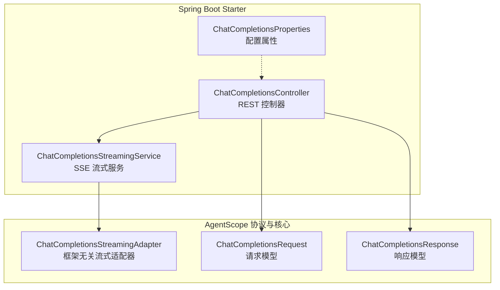
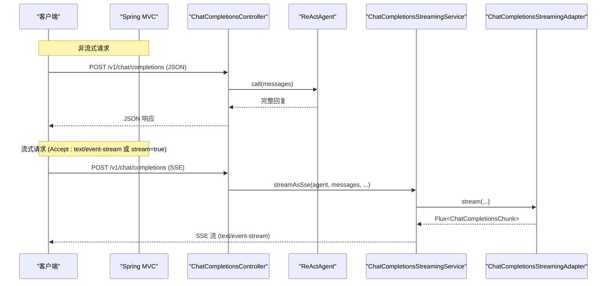
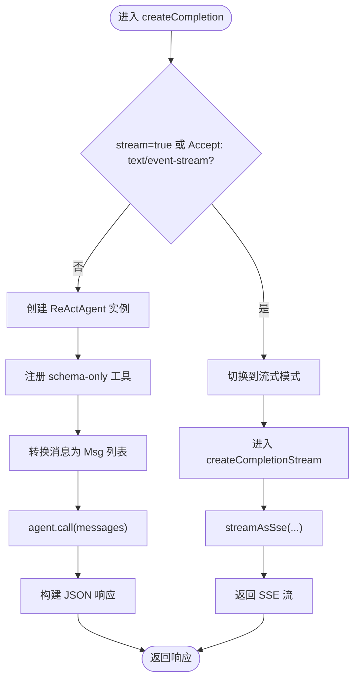
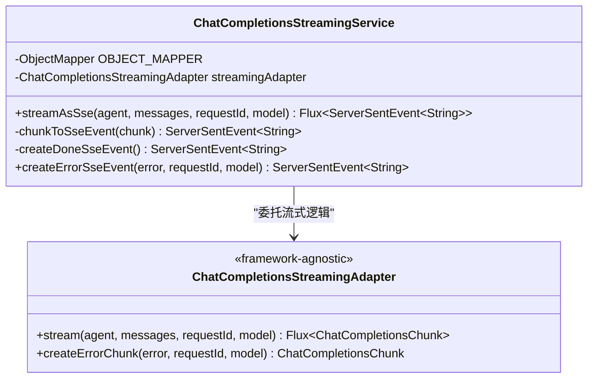
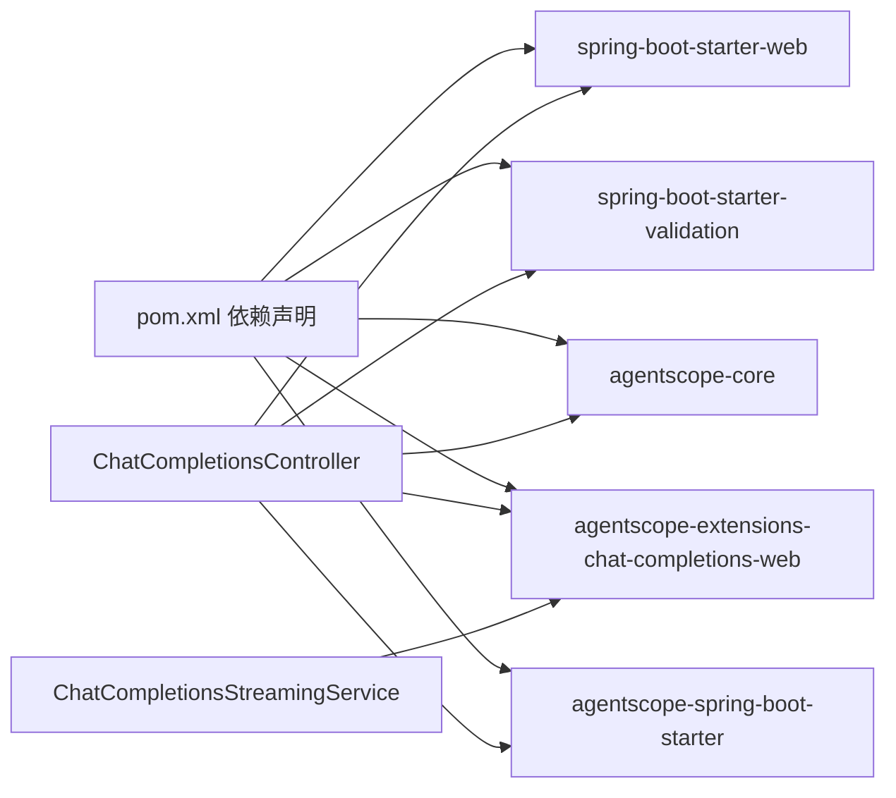

# 聊天补全Web Starter

<cite>
**本文档引用的文件**
- [ChatCompletionsController.java](file://agentscope-extensions/agentscope-spring-boot-starters/agentscope-chat-completions-web-starter/src/main/java/io/agentscope/spring/boot/chat/web/ChatCompletionsController.java)
- [ChatCompletionsProperties.java](file://agentscope-extensions/agentscope-spring-boot-starters/agentscope-chat-completions-web-starter/src/main/java/io/agentscope/spring/boot/chat/config/ChatCompletionsProperties.java)
- [ChatCompletionsStreamingService.java](file://agentscope-extensions/agentscope-spring-boot-starters/agentscope-chat-completions-web-starter/src/main/java/io/agentscope/spring/boot/chat/service/ChatCompletionsStreamingService.java)
- [pom.xml](file://agentscope-extensions/agentscope-spring-boot-starters/agentscope-chat-completions-web-starter/pom.xml)
- [ChatCompletionsStreamingAdapter.java](file://agentscope-extensions/agentscope-extensions-protocol/agentscope-extensions-chat-completions-web/src/main/java/io/agentscope/core/chat/completions/streaming/ChatCompletionsStreamingAdapter.java)
- [ChatCompletionsRequest.java](file://agentscope-extensions/agentscope-extensions-protocol/agentscope-extensions-chat-completions-web/src/main/java/io/agentscope/core/chat/completions/model/ChatCompletionsRequest.java)
- [ChatCompletionsResponse.java](file://agentscope-extensions/agentscope-extensions-protocol/agentscope-extensions-chat-completions-web/src/main/java/io/agentscope/core/chat/completions/model/ChatCompletionsResponse.java)
</cite>

## 目录
1. [简介](#简介)
2. [项目结构](#项目结构)
3. [核心组件](#核心组件)
4. [架构总览](#架构总览)
5. [详细组件分析](#详细组件分析)
6. [依赖关系分析](#依赖关系分析)
7. [性能考虑](#性能考虑)
8. [故障排除指南](#故障排除指南)
9. [结论](#结论)
10. [附录](#附录)

## 简介
本文件为 AgentScope 聊天补全 Web Spring Boot Starter 的完整使用文档，目标是帮助开发者快速集成并使用基于 Spring Boot 的聊天补全 REST API 服务。该 Starter 提供与 OpenAI 标准兼容的 Chat Completions 接口，支持非流式 JSON 响应与 Server-Sent Events（SSE）流式响应两种模式，适用于构建对话型 AI 应用。

## 项目结构
该 Starter 模块位于 agentscope-extensions/agentscope-spring-boot-starters/agentscope-chat-completions-web-starter，主要包含以下关键部分：
- 控制器层：暴露 REST API 端点，处理请求与响应
- 配置属性：定义启用开关与基础路径等配置项
- 流式服务：将框架无关的流式适配器转换为 Spring SSE 响应
- 依赖声明：聚合 Spring Web、验证、AgentScope 核心与协议模块

图表来源
- [ChatCompletionsController.java:1-294](file://agentscope-extensions/agentscope-spring-boot-starters/agentscope-chat-completions-web-starter/src/main/java/io/agentscope/spring/boot/chat/web/ChatCompletionsController.java#L1-L294)
- [ChatCompletionsProperties.java:1-59](file://agentscope-extensions/agentscope-spring-boot-starters/agentscope-chat-completions-web-starter/src/main/java/io/agentscope/spring/boot/chat/config/ChatCompletionsProperties.java#L1-L59)
- [ChatCompletionsStreamingService.java:1-127](file://agentscope-extensions/agentscope-spring-boot-starters/agentscope-chat-completions-web-starter/src/main/java/io/agentscope/spring/boot/chat/service/ChatCompletionsStreamingService.java#L1-L127)
- [ChatCompletionsStreamingAdapter.java](file://agentscope-extensions/agentscope-extensions-protocol/agentscope-extensions-chat-completions-web/src/main/java/io/agentscope/core/chat/completions/streaming/ChatCompletionsStreamingAdapter.java)
- [ChatCompletionsRequest.java](file://agentscope-extensions/agentscope-extensions-protocol/agentscope-extensions-chat-completions-web/src/main/java/io/agentscope/core/chat/completions/model/ChatCompletionsRequest.java)
- [ChatCompletionsResponse.java](file://agentscope-extensions/agentscope-extensions-protocol/agentscope-extensions-chat-completions-web/src/main/java/io/agentscope/core/chat/completions/model/ChatCompletionsResponse.java)

章节来源
- [pom.xml:1-90](file://agentscope-extensions/agentscope-spring-boot-starters/agentscope-chat-completions-web-starter/pom.xml#L1-L90)

## 核心组件
- ChatCompletionsController：提供 /v1/chat/completions 端点，支持非流式与流式两种响应模式；自动根据请求参数或头部选择合适模式；负责工具注册、消息转换与错误处理。
- ChatCompletionsProperties：通过 agentscope.chat-completions.* 前缀的配置项控制是否启用以及基础路径。
- ChatCompletionsStreamingService：将框架无关的 ChatCompletionsStreamingAdapter 输出转换为 Spring ServerSentEvent 流，统一序列化与结束事件处理。
- ChatCompletionsStreamingAdapter：框架无关的流式适配器，负责从 Agent 事件生成 ChatCompletionsChunk 并转为 SSE 数据。
- ChatCompletionsRequest/Response：OpenAI 兼容的请求与响应数据模型。

章节来源
- [ChatCompletionsController.java:42-76](file://agentscope-extensions/agentscope-spring-boot-starters/agentscope-chat-completions-web-starter/src/main/java/io/agentscope/spring/boot/chat/web/ChatCompletionsController.java#L42-L76)
- [ChatCompletionsProperties.java:20-33](file://agentscope-extensions/agentscope-spring-boot-starters/agentscope-chat-completions-web-starter/src/main/java/io/agentscope/spring/boot/chat/config/ChatCompletionsProperties.java#L20-L33)
- [ChatCompletionsStreamingService.java:28-51](file://agentscope-extensions/agentscope-spring-boot-starters/agentscope-chat-completions-web-starter/src/main/java/io/agentscope/spring/boot/chat/service/ChatCompletionsStreamingService.java#L28-L51)

## 架构总览
下图展示了从客户端到 AgentScope 内核的完整调用链路，以及 Spring MVC 如何将框架无关的流式事件转换为 SSE：

图表来源
- [ChatCompletionsController.java:123-202](file://agentscope-extensions/agentscope-spring-boot-starters/agentscope-chat-completions-web-starter/src/main/java/io/agentscope/spring/boot/chat/web/ChatCompletionsController.java#L123-L202)
- [ChatCompletionsController.java:213-292](file://agentscope-extensions/agentscope-spring-boot-starters/agentscope-chat-completions-web-starter/src/main/java/io/agentscope/spring/boot/chat/web/ChatCompletionsController.java#L213-L292)
- [ChatCompletionsStreamingService.java:79-84](file://agentscope-extensions/agentscope-spring-boot-starters/agentscope-chat-completions-web-starter/src/main/java/io/agentscope/spring/boot/chat/service/ChatCompletionsStreamingService.java#L79-L84)
- [ChatCompletionsStreamingAdapter.java](file://agentscope-extensions/agentscope-extensions-protocol/agentscope-extensions-chat-completions-web/src/main/java/io/agentscope/core/chat/completions/streaming/ChatCompletionsStreamingAdapter.java)

## 详细组件分析

### ChatCompletionsController 组件
- 端点设计
  - POST /v1/chat/completions：默认返回 JSON 响应；当 stream=true 或 Accept: text/event-stream 存在时切换为 SSE 流式响应。
  - 自动模式切换：即使未设置 Accept: text/event-stream，只要 stream=true，也会以流式方式返回。
- 请求处理流程
  - 工具注册：若请求包含 tools，则将其转换为 ToolSchema 并注册到 Agent 的工具箱。
  - 消息转换：将 HTTP 层的消息转换为框架内部 Msg 列表。
  - 执行与响应：调用 ReActAgent 执行并构建响应；错误时构建错误响应。
- 错误处理
  - 参数校验失败、Agent 创建失败、空消息列表等情况均会返回相应错误。
  - 流式场景中，错误会被转换为 SSE 错误事件发送给客户端。

图表来源
- [ChatCompletionsController.java:123-202](file://agentscope-extensions/agentscope-spring-boot-starters/agentscope-chat-completions-web-starter/src/main/java/io/agentscope/spring/boot/chat/web/ChatCompletionsController.java#L123-L202)
- [ChatCompletionsController.java:213-292](file://agentscope-extensions/agentscope-spring-boot-starters/agentscope-chat-completions-web-starter/src/main/java/io/agentscope/spring/boot/chat/web/ChatCompletionsController.java#L213-L292)

章节来源
- [ChatCompletionsController.java:111-202](file://agentscope-extensions/agentscope-spring-boot-starters/agentscope-chat-completions-web-starter/src/main/java/io/agentscope/spring/boot/chat/web/ChatCompletionsController.java#L111-L202)
- [ChatCompletionsController.java:204-292](file://agentscope-extensions/agentscope-spring-boot-starters/agentscope-chat-completions-web-starter/src/main/java/io/agentscope/spring/boot/chat/web/ChatCompletionsController.java#L204-L292)

### ChatCompletionsStreamingService 组件
- 职责
  - 将 ChatCompletionsStreamingAdapter 的 Flux<ChatCompletionsChunk> 转换为 Spring 的 Flux<ServerSentEvent<String>>。
  - 对每个数据块进行 JSON 序列化，作为 SSE 的 data 字段。
  - 在流结束时发送 "[DONE]" 事件。
- 错误处理
  - 当适配器抛错时，构造错误块并转换为 SSE 错误事件返回。

图表来源
- [ChatCompletionsStreamingService.java:52-126](file://agentscope-extensions/agentscope-spring-boot-starters/agentscope-chat-completions-web-starter/src/main/java/io/agentscope/spring/boot/chat/service/ChatCompletionsStreamingService.java#L52-L126)
- [ChatCompletionsStreamingAdapter.java](file://agentscope-extensions/agentscope-extensions-protocol/agentscope-extensions-chat-completions-web/src/main/java/io/agentscope/core/chat/completions/streaming/ChatCompletionsStreamingAdapter.java)

章节来源
- [ChatCompletionsStreamingService.java:67-126](file://agentscope-extensions/agentscope-spring-boot-starters/agentscope-chat-completions-web-starter/src/main/java/io/agentscope/spring/boot/chat/service/ChatCompletionsStreamingService.java#L67-L126)

### 配置属性组件
- 启用开关：agentscope.chat-completions.enabled，默认开启
- 基础路径：agentscope.chat-completions.base-path，默认 /v1/chat/completions
- 其他可扩展配置：如会话管理类型（预留）

章节来源
- [ChatCompletionsProperties.java:20-58](file://agentscope-extensions/agentscope-spring-boot-starters/agentscope-chat-completions-web-starter/src/main/java/io/agentscope/spring/boot/chat/config/ChatCompletionsProperties.java#L20-L58)

## 依赖关系分析
- Maven 依赖
  - spring-boot-starter-web：提供 Web MVC 与嵌入式服务器
  - spring-boot-starter-validation：提供请求参数校验
  - agentscope-spring-boot-starter：复用 AgentScope 的通用配置与 Bean 注册
  - agentscope-extensions-chat-completions-web：提供协议模型与流式适配器
  - agentscope-core：提供 ReActAgent 等核心能力（可选依赖）
- 运行时依赖链
  - 控制器依赖 Spring Web 与验证；通过 ObjectProvider 获取 ReActAgent 实例
  - 流式服务依赖 ChatCompletionsStreamingAdapter，实现与框架解耦

图表来源
- [pom.xml:40-86](file://agentscope-extensions/agentscope-spring-boot-starters/agentscope-chat-completions-web-starter/pom.xml#L40-L86)
- [ChatCompletionsController.java:18-40](file://agentscope-extensions/agentscope-spring-boot-starters/agentscope-chat-completions-web-starter/src/main/java/io/agentscope/spring/boot/chat/web/ChatCompletionsController.java#L18-L40)
- [ChatCompletionsStreamingService.java:18-26](file://agentscope-extensions/agentscope-spring-boot-starters/agentscope-chat-completions-web-starter/src/main/java/io/agentscope/spring/boot/chat/service/ChatCompletionsStreamingService.java#L18-L26)

章节来源
- [pom.xml:40-86](file://agentscope-extensions/agentscope-spring-boot-starters/agentscope-chat-completions-web-starter/pom.xml#L40-L86)

## 性能考虑
- 状态无状态设计：每次请求都创建新的 ReActAgent 实例，避免跨请求状态污染，但会带来实例创建开销。
- 流式传输：SSE 流式响应适合长文本生成与实时反馈，但需注意网络与客户端缓冲区的处理。
- 工具注册：schema-only 工具仅在当前请求有效，避免全局状态影响。
- 日志与追踪：控制器记录请求 ID、耗时与错误，便于性能分析与问题定位。

## 故障排除指南
- 常见错误与处理
  - 空消息列表：当 messages 为空时返回参数错误；请确保至少包含一条消息。
  - Agent 创建失败：当 ObjectProvider 返回 null 时，返回初始化异常；检查 ReActAgent Bean 是否正确注册。
  - 非法参数：参数校验失败时抛出异常；请检查请求体格式与字段完整性。
  - 流式端点误用：在流式端点上使用 stream=false 会返回参数错误；请改用非流式端点。
- 调试建议
  - 开启 DEBUG 日志级别，观察请求 ID 与处理耗时。
  - 使用 curl 或浏览器开发者工具验证 SSE 连接与事件分隔符。
  - 分别测试非流式与流式两种模式，确认客户端对两种响应的兼容性。

章节来源
- [ChatCompletionsController.java:169-201](file://agentscope-extensions/agentscope-spring-boot-starters/agentscope-chat-completions-web-starter/src/main/java/io/agentscope/spring/boot/chat/web/ChatCompletionsController.java#L169-L201)
- [ChatCompletionsController.java:264-291](file://agentscope-extensions/agentscope-spring-boot-starters/agentscope-chat-completions-web-starter/src/main/java/io/agentscope/spring/boot/chat/web/ChatCompletionsController.java#L264-L291)

## 结论
AgentScope 聊天补全 Web Starter 通过简洁的控制器与可插拔的流式服务，提供了与 OpenAI 兼容的聊天补全接口。其无状态设计与流式能力使其易于集成到各类前端应用中，同时保持了良好的可维护性与扩展性。

## 附录

### REST API 使用示例
- 端点
  - POST /v1/chat/completions
- 请求头
  - Content-Type: application/json
  - 可选：Accept: text/event-stream（用于流式响应）
- 请求体（简化）
  - messages: 数组，每项包含 role 与 content
  - model: 字符串（可选）
  - tools: 数组（可选，schema-only 工具定义）
  - stream: 布尔值（可选，true 时强制流式）
- 非流式响应
  - 返回标准 ChatCompletionsResponse 结构，包含 choices、usage 等字段。
- 流式响应
  - 返回多个 SSE 事件，每个事件的数据为 ChatCompletionsChunk 的 JSON 序列化结果，最后以 [DONE] 结束。

章节来源
- [ChatCompletionsController.java:123-202](file://agentscope-extensions/agentscope-spring-boot-starters/agentscope-chat-completions-web-starter/src/main/java/io/agentscope/spring/boot/chat/web/ChatCompletionsController.java#L123-L202)
- [ChatCompletionsController.java:213-292](file://agentscope-extensions/agentscope-spring-boot-starters/agentscope-chat-completions-web-starter/src/main/java/io/agentscope/spring/boot/chat/web/ChatCompletionsController.java#L213-L292)
- [ChatCompletionsRequest.java](file://agentscope-extensions/agentscope-extensions-protocol/agentscope-extensions-chat-completions-web/src/main/java/io/agentscope/core/chat/completions/model/ChatCompletionsRequest.java)
- [ChatCompletionsResponse.java](file://agentscope-extensions/agentscope-extensions-protocol/agentscope-extensions-chat-completions-web/src/main/java/io/agentscope/core/chat/completions/model/ChatCompletionsResponse.java)

### 流式响应与 SSE 连接管理
- 客户端连接
  - 设置 Accept: text/event-stream 头部以启用流式响应。
  - 使用浏览器原生 EventSource 或支持 SSE 的 HTTP 库进行消费。
- 事件格式
  - 每个事件的 data 字段为 ChatCompletionsChunk 的 JSON 表示。
  - 最后一个事件为 data: [DONE]，表示流结束。
- 断线重连
  - 建议客户端实现断线重连与历史消息追加策略，确保上下文连续性。

章节来源
- [ChatCompletionsStreamingService.java:79-110](file://agentscope-extensions/agentscope-spring-boot-starters/agentscope-chat-completions-web-starter/src/main/java/io/agentscope/spring/boot/chat/service/ChatCompletionsStreamingService.java#L79-L110)

### 配置选项
- agentscope.chat-completions.enabled：是否启用 HTTP API，默认 true
- agentscope.chat-completions.base-path：HTTP 基础路径，默认 /v1/chat/completions
- 其他：预留会话管理类型等扩展项

章节来源
- [ChatCompletionsProperties.java:34-58](file://agentscope-extensions/agentscope-spring-boot-starters/agentscope-chat-completions-web-starter/src/main/java/io/agentscope/spring/boot/chat/config/ChatCompletionsProperties.java#L34-L58)

### 与其他 Spring Web 功能的集成
- Spring MVC
  - 控制器已内置 @RestController 与 @RequestMapping，可直接通过 Spring Boot 自动装配。
- Spring Validation
  - 使用 @Valid 对请求体进行参数校验，结合 @ConfigurationProperties 提供的配置项。
- Spring WebFlux
  - 控制器返回 Mono/Flux，天然支持响应式编程风格。
- Actuator 与监控
  - 可结合 Spring Boot Actuator 暴露健康检查与指标，便于生产环境运维。

章节来源
- [ChatCompletionsController.java:35-40](file://agentscope-extensions/agentscope-spring-boot-starters/agentscope-chat-completions-web-starter/src/main/java/io/agentscope/spring/boot/chat/web/ChatCompletionsController.java#L35-L40)
- [pom.xml:62-72](file://agentscope-extensions/agentscope-spring-boot-starters/agentscope-chat-completions-web-starter/pom.xml#L62-L72)