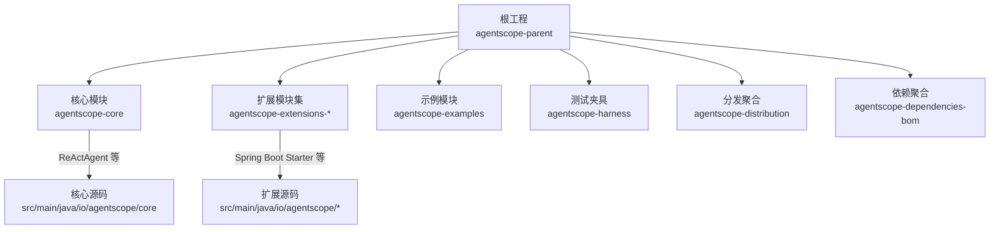
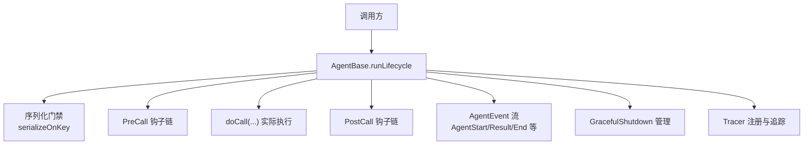
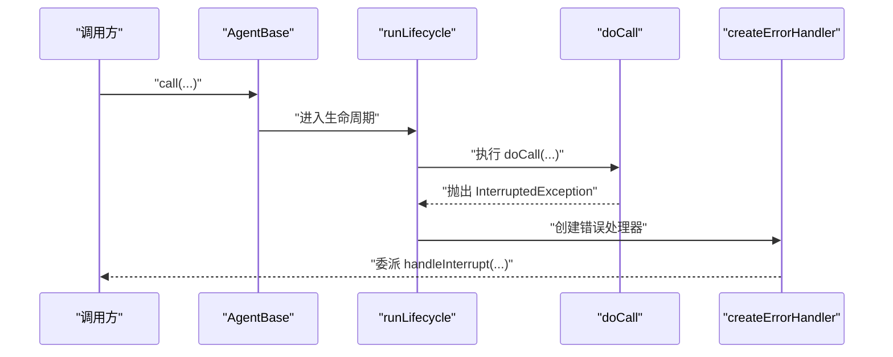
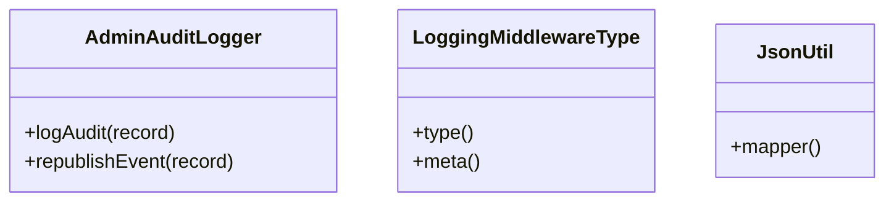
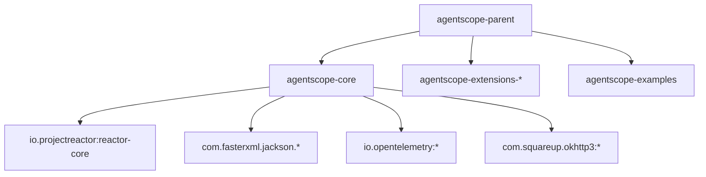
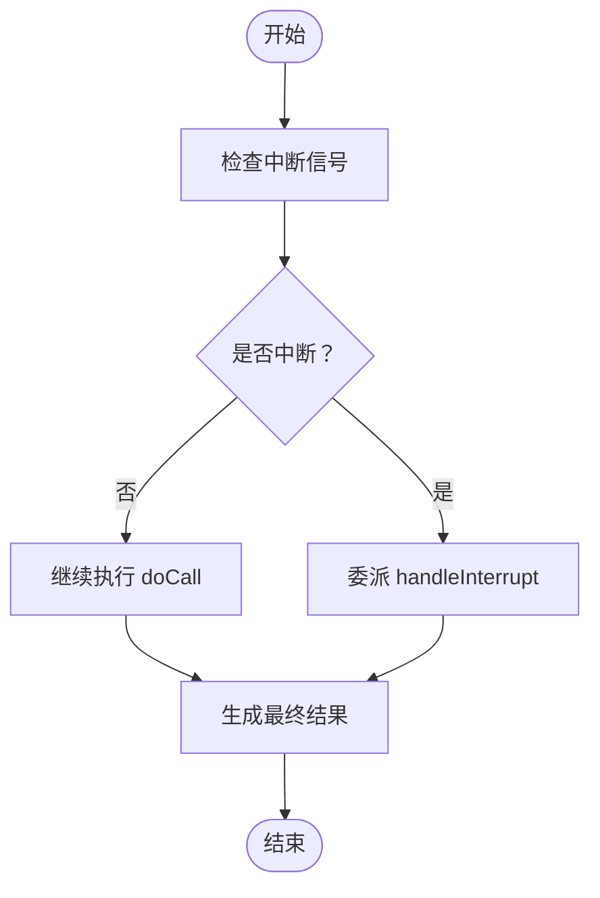

# 代码规范与最佳实践

<cite>
**本文引用的文件**
- [README.md](file://README.md)
- [CONTRIBUTING.md](file://CONTRIBUTING.md)
- [pom.xml](file://pom.xml)
- [agentscope-core/pom.xml](file://agentscope-core/pom.xml)
- [ReActAgent.java](file://agentscope-core/src/main/java/io/agentscope/core/ReActAgent.java)
- [Agent.java](file://agentscope-core/src/main/java/io/agentscope/core/agent/Agent.java)
- [AgentBase.java](file://agentscope-core/src/main/java/io/agentscope/core/agent/AgentBase.java)
- [AdminAuditLogger.java](file://agentscope-extensions/agentscope-spring-boot-starters/agentscope-admin-spring-boot-starter/src/main/java/io/agentscope/spring/boot/admin/audit/AdminAuditLogger.java)
- [LoggingMiddlewareType.java](file://agentscope-builder-saton/src/main/java/io/agentscope/builder/saton/factory/middleware/impl/LoggingMiddlewareType.java)
- [JsonUtil.java](file://agentscope-builder-saton/src/main/java/io/agentscope/builder/saton/common/json/JsonUtil.java)
</cite>

## 目录
1. [引言](#引言)
2. [项目结构](#项目结构)
3. [核心组件](#核心组件)
4. [架构总览](#架构总览)
5. [详细组件分析](#详细组件分析)
6. [依赖关系分析](#依赖关系分析)
7. [性能考虑](#性能考虑)
8. [故障排查指南](#故障排查指南)
9. [结论](#结论)
10. [附录](#附录)

## 引言
本指南面向 AgentScope Java 项目的开发者，系统性地定义代码规范与最佳实践，覆盖命名约定、代码格式化、注释标准、设计原则应用、代码审查与质量要求、异常处理与日志记录、性能优化建议，并提供可操作的重构指导与遗留代码处理策略。内容以现有仓库中的配置与实现为依据，确保可落地、可执行。

## 项目结构
AgentScope Java 采用多模块 Maven 结构，核心模块包括 agentscope-core、agentscope-extensions、agentscope-examples 等。根 pom.xml 统一管理 Java 版本、插件版本与构建流程；agentscope-core 定义框架内核能力（ReActAgent、消息模型、中间件、工具、状态、内存、事件钩子等）。

图表来源
- [pom.xml:57-64](file://pom.xml#L57-L64)
- [agentscope-core/pom.xml:22-31](file://agentscope-core/pom.xml#L22-L31)

章节来源
- [README.md: 72-100:72-100](file://README.md#L72-L100)
- [pom.xml: 29-55:29-55](file://pom.xml#L29-L55)
- [agentscope-core/pom.xml: 33-49:33-49](file://agentscope-core/pom.xml#L33-L49)

## 核心组件
- 接口与抽象基类
  - Agent：统一的代理接口，组合可调用、可流式、可观测能力。
  - AgentBase：代理基础设施抽象，提供钩子、订阅、中断、追踪、状态绑定等通用能力。
- 具体实现
  - ReActAgent：遵循 ReAct（推理-行动）范式的智能体实现，支持流式事件、结构化输出、权限控制、长时记忆、RAG、优雅关停等。
- 工具与中间件
  - 中间件链：在调用前后注入逻辑，如系统提示词处理、执行配置、任务提醒等。
  - 工具体系：反射函数工具、内置工具、MCP 客户端、文件/编码/多模态等工具族。
- 状态与内存
  - AgentState、AgentStateStore、InMemoryAgentStateStore、JsonFileAgentStateStore 等，支持会话级状态持久化与并发安全。
- 事件与钩子
  - Hook 机制贯穿生命周期，支持预/后置调用、推理、行动、摘要等阶段的拦截与扩展。
- 模型与格式化
  - 多模型适配器（DashScope、OpenAI、Gemini、Anthropic、Ollama），响应格式化与结构化输出。

章节来源
- [Agent.java: 21-47:21-47](file://agentscope-core/src/main/java/io/agentscope/core/agent/Agent.java#L21-L47)
- [AgentBase.java: 47-90:47-90](file://agentscope-core/src/main/java/io/agentscope/core/agent/AgentBase.java#L47-L90)
- [ReActAgent.java: 148-199:148-199](file://agentscope-core/src/main/java/io/agentscope/core/ReActAgent.java#L148-L199)

## 架构总览
AgentScope Java 的运行时采用响应式（Project Reactor）非阻塞模型，结合钩子系统与中间件链实现高扩展性与可观测性。ReActAgent 在每次调用中通过生命周期编排（序列化门禁、优雅关停、钩子通知、事件流）完成推理-行动循环。

图表来源
- [AgentBase.java: 252-322:252-322](file://agentscope-core/src/main/java/io/agentscope/core/agent/AgentBase.java#L252-L322)
- [ReActAgent.java: 795-800:795-800](file://agentscope-core/src/main/java/io/agentscope/core/ReActAgent.java#L795-L800)

## 详细组件分析

### 命名约定与代码风格
- 包与类名
  - 包名使用小写，采用领域分层（如 io.agentscope.core.agent、io.agentscope.core.message）。
  - 类名采用大驼峰，接口以名词或抽象概念命名（如 Agent、CallableAgent、StreamableAgent）。
- 方法与字段
  - 方法名采用动词短语，参数名清晰表达意图；私有字段以下划线前缀或直接小写（参考现有实现）。
  - 常量使用全大写+下划线分隔（如 STRUCTURED_OUTPUT_TOOL_NAME）。
- 注释与文档
  - 类与公共 API 使用 Javadoc，说明用途、关键特性、线程安全与使用示例。
  - 关键算法与并发点添加注释说明（如 ReActAgent 的事件流、序列化门禁）。

章节来源
- [ReActAgent.java: 206-207:206-207](file://agentscope-core/src/main/java/io/agentscope/core/ReActAgent.java#L206-L207)
- [AgentBase.java: 47-90:47-90](file://agentscope-core/src/main/java/io/agentscope/core/agent/AgentBase.java#L47-L90)

### 设计原则应用
- 单一职责
  - AgentBase 负责基础设施（钩子、订阅、中断、追踪、状态绑定），具体智能体（ReActAgent）负责领域逻辑与状态管理。
- 开闭原则
  - 通过 Hook 与中间件扩展行为，无需修改核心类；工具注册与动态技能加载体现对扩展开放。
- 里氏替换
  - 所有 Agent 实现均满足 Agent 接口契约（单次终端响应、可中断、可观察），保证互换性。
- 依赖倒置
  - 模型、工具、状态存储通过接口解耦，便于替换与测试。

章节来源
- [Agent.java: 21-47:21-47](file://agentscope-core/src/main/java/io/agentscope/core/agent/Agent.java#L21-L47)
- [AgentBase.java: 47-90:47-90](file://agentscope-core/src/main/java/io/agentscope/core/agent/AgentBase.java#L47-L90)
- [ReActAgent.java: 148-199:148-199](file://agentscope-core/src/main/java/io/agentscope/core/ReActAgent.java#L148-L199)

### 代码格式化与注释标准
- 格式化工具
  - 使用 Maven Spotless 插件，基于 AOSP 风格的 google-java-format，自动检查与修复格式。
  - 通过 Maven 编译期强制校验，IDE 可配置保存即格式化。
- 注释规范
  - 类与公共 API 提供 Javadoc；复杂方法与关键边界条件补充行内注释。
  - 配置与依赖版本在根 pom.xml 中集中管理，避免分散配置。

章节来源
- [CONTRIBUTING.md: 59-74:59-74](file://CONTRIBUTING.md#L59-L74)
- [pom.xml: 166-212:166-212](file://pom.xml#L166-L212)

### 代码审查与质量要求
- 提交信息
  - 遵循 Conventional Commits，明确类型（feat/fix/docs/style/refactor/perf/ci/chore）与作用域。
- 测试
  - 新功能必须配套单元测试；使用 JUnit 5、Mockito、Reactor Test；覆盖率报告由 JaCoCo 生成。
- 文档
  - 更新相关文档与 README 示例；新增功能需包含使用说明与示例路径。

章节来源
- [CONTRIBUTING.md: 28-56:28-56](file://CONTRIBUTING.md#L28-L56)
- [CONTRIBUTING.md: 75-95:75-95](file://CONTRIBUTING.md#L75-L95)
- [pom.xml: 300-320:300-320](file://pom.xml#L300-L320)

### 异常处理模式
- 生命周期错误处理
  - AgentBase 在 runLifecycle 中捕获 InterruptedException 并委派到 handleInterrupt，确保可中断与可恢复。
- 钩子与中间件
  - 钩子链与中间件链采用响应式链路，异常向上冒泡并统一由生命周期处理器接管。
- 工具与模型
  - 工具输入验证与模型异常封装为统一异常类型，便于上层统一处理。

图表来源
- [AgentBase.java: 494-502:494-502](file://agentscope-core/src/main/java/io/agentscope/core/agent/AgentBase.java#L494-L502)
- [AgentBase.java: 252-322:252-322](file://agentscope-core/src/main/java/io/agentscope/core/agent/AgentBase.java#L252-L322)

章节来源
- [AgentBase.java: 494-502:494-502](file://agentscope-core/src/main/java/io/agentscope/core/agent/AgentBase.java#L494-L502)

### 日志记录规范
- 日志框架
  - 使用 SLF4J API，避免硬编码实现；扩展模块可按需引入具体实现。
- 审计与事件
  - AdminAuditLogger 将审计记录以 INFO 级别输出至 SLF4J，并可选发布为 Spring ApplicationEvent。
  - Builder-Saton 提供 LoggingMiddlewareType，用于在代理执行期间输出 AgentStart/AgentResult 等事件日志。
- JSON 序列化
  - JsonUtil 提供进程级 ObjectMapper 单例，注意包名与 Jackson 版本差异。

图表来源
- [AdminAuditLogger.java: 24-36:24-36](file://agentscope-extensions/agentscope-spring-boot-starters/agentscope-admin-spring-boot-starter/src/main/java/io/agentscope/spring/boot/admin/audit/AdminAuditLogger.java#L24-L36)
- [LoggingMiddlewareType.java: 21-40:21-40](file://agentscope-builder-saton/src/main/java/io/agentscope/builder/saton/factory/middleware/impl/LoggingMiddlewareType.java#L21-L40)
- [JsonUtil.java: 6-19:6-19](file://agentscope-builder-saton/src/main/java/io/agentscope/builder/saton/common/json/JsonUtil.java#L6-L19)

章节来源
- [AdminAuditLogger.java: 24-36:24-36](file://agentscope-extensions/agentscope-spring-boot-starters/agentscope-admin-spring-boot-starter/src/main/java/io/agentscope/spring/boot/admin/audit/AdminAuditLogger.java#L24-L36)
- [LoggingMiddlewareType.java: 21-40:21-40](file://agentscope-builder-saton/src/main/java/io/agentscope/builder/saton/factory/middleware/impl/LoggingMiddlewareType.java#L21-L40)
- [JsonUtil.java: 6-19:6-19](file://agentscope-builder-saton/src/main/java/io/agentscope/builder/saton/common/json/JsonUtil.java#L6-L19)

### 性能优化建议
- 响应式与背压
  - 使用 Reactor Flux/Mono 非阻塞模型，合理设置调度器与背压策略，避免阻塞调用。
- 并发与序列化
  - 利用 callSerializationKey 对同一会话调用进行串行化，避免共享状态竞争；不同会话并发执行。
- 内存与状态
  - 使用 AgentStateStore 持久化会话状态，减少重复加载；InMemoryAgentStateStore 仅适用于本地或测试场景。
- I/O 与网络
  - 工具与模型调用尽量异步化，避免同步阻塞；合理设置超时与重试策略。

章节来源
- [AgentBase.java: 334-336:334-336](file://agentscope-core/src/main/java/io/agentscope/core/agent/AgentBase.java#L334-L336)
- [AgentBase.java: 344-365:344-365](file://agentscope-core/src/main/java/io/agentscope/core/agent/AgentBase.java#L344-L365)
- [ReActAgent.java: 412-422:412-422](file://agentscope-core/src/main/java/io/agentscope/core/ReActAgent.java#L412-L422)

### 代码示例与反例对比
- 正例：使用 ReActAgent 的结构化输出工具
  - 通过 call(...) 重载传入结构化输出类或 JSON Schema，ReActAgent 内部构建 per-call 工具并返回类型安全的结果。
- 反例：在钩子中注入 SYSTEM 角色消息
  - ReActAgent 在 PreCall 阶段会校验尾部消息角色，禁止注入 SYSTEM 消息，避免污染记忆快照。

章节来源
- [ReActAgent.java: 627-637:627-637](file://agentscope-core/src/main/java/io/agentscope/core/ReActAgent.java#L627-L637)
- [AgentBase.java: 781-791:781-791](file://agentscope-core/src/main/java/io/agentscope/core/agent/AgentBase.java#L781-L791)

### 重构指导与遗留代码处理
- 重构策略
  - 优先拆分职责，将领域逻辑从 AgentBase 抽离至具体实现；保持接口稳定，逐步替换内部实现。
  - 渐进式替换：对已废弃 API 添加 @Deprecated 并提供迁移指引；保留过渡期兼容。
- 遗留代码处理
  - 识别过时常量与方法（如 CONFIRM_SINK_KEY），在不影响功能的前提下逐步移除。
  - 对历史注释与 TODO，补充到问题跟踪系统并设定清理时间线。

章节来源
- [ReActAgent.java: 215-216:215-216](file://agentscope-core/src/main/java/io/agentscope/core/ReActAgent.java#L215-L216)

## 依赖关系分析
- 根工程统一管理 Java 版本、插件版本与构建流程；模块间通过 BOM 与依赖聚合进行版本约束。
- agentscope-core 依赖 Reactor、Jackson、OpenTelemetry、OkHttp 等核心库；扩展模块按需引入。

图表来源
- [pom.xml: 133-150:133-150](file://pom.xml#L133-L150)
- [agentscope-core/pom.xml: 51-231:51-231](file://agentscope-core/pom.xml#L51-L231)

章节来源
- [pom.xml: 133-150:133-150](file://pom.xml#L133-L150)
- [agentscope-core/pom.xml: 51-231:51-231](file://agentscope-core/pom.xml#L51-L231)

## 性能考虑
- 非阻塞执行：ReActor 链路避免阻塞调用，配合 boundedElastic 调度器处理 IO 密集型任务。
- 事件驱动：通过事件流与中间件链实现低耦合扩展，减少同步等待。
- 状态持久化：按需持久化 AgentState，避免频繁磁盘 IO；并发访问通过会话级序列化门禁保障一致性。

章节来源
- [AgentBase.java: 252-322:252-322](file://agentscope-core/src/main/java/io/agentscope/core/agent/AgentBase.java#L252-L322)
- [ReActAgent.java: 412-422:412-422](file://agentscope-core/src/main/java/io/agentscope/core/ReActAgent.java#L412-L422)

## 故障排查指南
- 中断与恢复
  - 使用 ReActAgent.interrupt(...) 指定用户标识与会话标识触发中断；AgentBase 在生命周期中捕获并委派到 handleInterrupt。
- 事件流定位
  - 通过 LoggingMiddlewareType 输出 AgentStart/AgentResult 等事件日志，辅助调试执行路径。
- 审计与合规
  - 使用 AdminAuditLogger 记录审计事件，必要时将记录发布为 Spring 事件以便外部系统消费。

图表来源
- [AgentBase.java: 494-502:494-502](file://agentscope-core/src/main/java/io/agentscope/core/agent/AgentBase.java#L494-L502)
- [AgentBase.java: 551](file://agentscope-core/src/main/java/io/agentscope/core/agent/AgentBase.java#L551)

章节来源
- [AgentBase.java: 494-502:494-502](file://agentscope-core/src/main/java/io/agentscope/core/agent/AgentBase.java#L494-L502)
- [AgentBase.java: 551](file://agentscope-core/src/main/java/io/agentscope/core/agent/AgentBase.java#L551)
- [LoggingMiddlewareType.java: 21-40:21-40](file://agentscope-builder-saton/src/main/java/io/agentscope/builder/saton/factory/middleware/impl/LoggingMiddlewareType.java#L21-L40)
- [AdminAuditLogger.java: 24-36:24-36](file://agentscope-extensions/agentscope-spring-boot-starters/agentscope-admin-spring-boot-starter/src/main/java/io/agentscope/spring/boot/admin/audit/AdminAuditLogger.java#L24-L36)

## 结论
本指南基于 AgentScope Java 的实际实现，总结了命名、格式、注释、设计原则、代码审查、异常与日志、性能与重构等方面的规范与最佳实践。建议团队在开发过程中严格遵循，持续改进，确保代码质量与可维护性。

## 附录
- 快速开始与示例
  - 参考 README 的快速开始与示例片段，了解 ReActAgent 的基本用法与依赖声明。
- 提交流程
  - 遵循 Conventional Commits，提交前执行格式检查与测试，确保 CI 通过。

章节来源
- [README.md: 72-100:72-100](file://README.md#L72-L100)
- [CONTRIBUTING.md: 28-56:28-56](file://CONTRIBUTING.md#L28-L56)
- [CONTRIBUTING.md: 75-95:75-95](file://CONTRIBUTING.md#L75-L95)