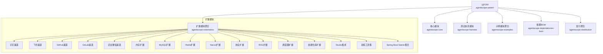
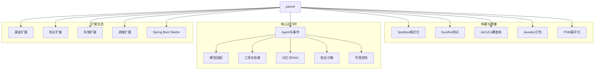
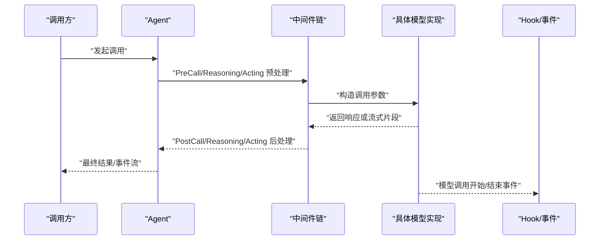
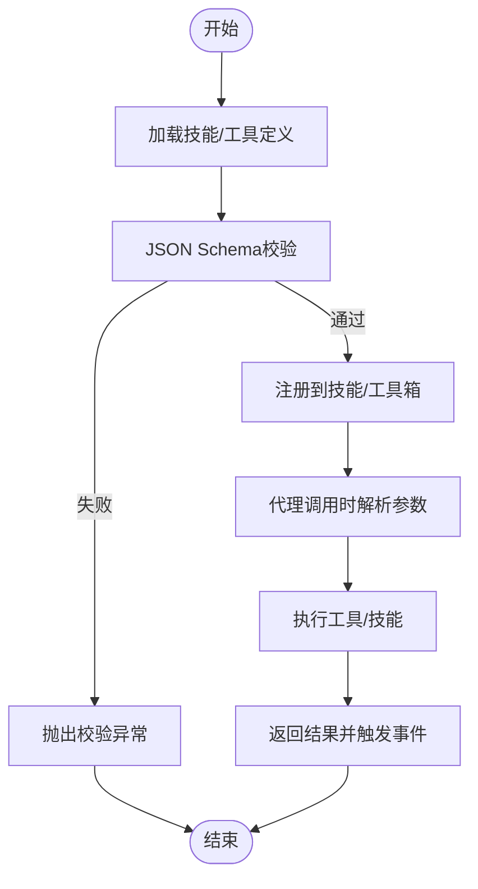
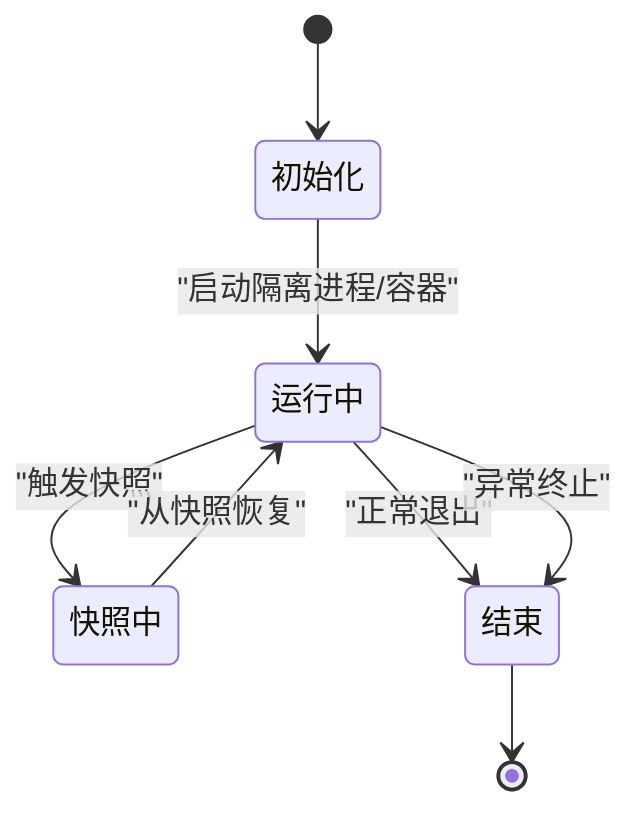
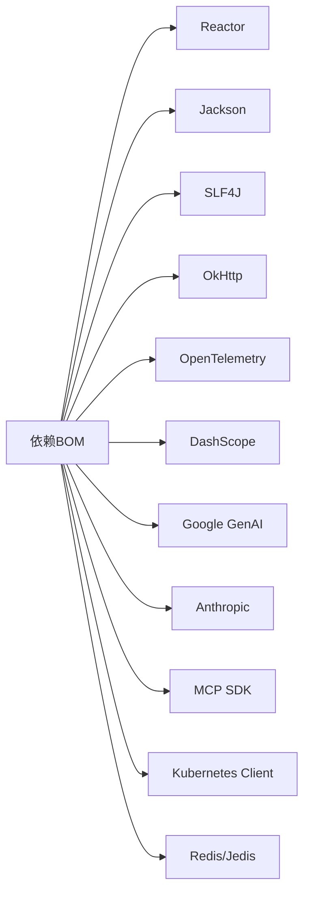

# 开发指南

<cite>
**本文引用的文件**   
- [根POM（父工程）](file://pom.xml)
- [核心模块POM](file://agentscope-core/pom.xml)
- [依赖BOM](file://agentscope-dependencies-bom/pom.xml)
- [贡献指南](file://CONTRIBUTING.md)
- [自述文件](file://README.md)
- [拉取请求模板](file://.github/PULL_REQUEST_TEMPLATE.md)
- [依赖更新配置（Dependabot）](file://.github/dependabot.yaml)
- [覆盖率配置](file://codecov.yml)
</cite>

## 目录
1. [简介](#简介)
2. [项目结构](#项目结构)
3. [核心组件](#核心组件)
4. [架构总览](#架构总览)
5. [详细组件分析](#详细组件分析)
6. [依赖关系分析](#依赖关系分析)
7. [性能与可维护性建议](#性能与可维护性建议)
8. [测试策略与框架使用](#测试策略与框架使用)
9. [CI/CD与自动化测试](#cicd与自动化测试)
10. [开发环境搭建与IDE配置](#开发环境搭建与ide配置)
11. [代码规范与最佳实践](#代码规范与最佳实践)
12. [调试技巧与开发工具推荐](#调试技巧与开发工具推荐)
13. [贡献流程与PR规范](#贡献流程与pr规范)
14. [扩展开发指南（新增模块与扩展现有模块）](#扩展开发指南新增模块与扩展现有模块)
15. [故障排查指南](#故障排查指南)
16. [结语](#结语)

## 简介
本指南面向AgentScope Java的新老贡献者与使用者，系统化阐述开发环境搭建、依赖与构建流程、代码规范、测试策略、CI/CD、调试技巧以及扩展开发方法。目标是帮助你在最短时间内上手并高质量地参与AgentScope Java的开发与演进。

## 项目结构
AgentScope Java采用多模块Maven聚合工程组织，核心模块与扩展模块清晰分层，便于独立演进与复用。父POM统一版本、插件与发布配置；核心模块提供Agent运行时、消息模型、工具与技能体系；扩展模块提供渠道、协议、存储、调度等能力；示例模块演示典型用法；BOM模块集中管理第三方依赖版本。

图示来源
- [根POM（父工程）:57-64](file://pom.xml#L57-L64)
- [依赖BOM:129-508](file://agentscope-dependencies-bom/pom.xml#L129-L508)

章节来源
- [根POM（父工程）:57-64](file://pom.xml#L57-L64)
- [核心模块POM:22-31](file://agentscope-core/pom.xml#L22-L31)
- [依赖BOM:129-508](file://agentscope-dependencies-bom/pom.xml#L129-L508)

## 核心组件
- 运行时与Agent：ReAct推理、事件总线、可观测性、中断控制、状态与会话管理。
- 模型适配：OpenAI、DashScope、Gemini、Anthropic、Ollama等，统一抽象与注册机制。
- 工具与技能：内置工具、反射函数工具、MCP工具、技能注册与中间件链。
- 记忆与RAG：长期记忆、状态持久化、知识检索与召回。
- 安全沙箱：隔离执行、快照与恢复、文件系统与容器能力。
- 分布式与协议：A2A服务发现、MCP协议、WebFlux UI支持。
- 测试夹具：共享测试资源、Mock模型与工具、端到端测试基座。

章节来源
- [核心模块POM:51-231](file://agentscope-core/pom.xml#L51-L231)

## 架构总览
AgentScope Java以“模块化+可插拔”为核心设计，通过BOM统一依赖版本，通过插件实现格式化、测试覆盖率、文档与发布自动化。核心模块提供运行时能力，扩展模块按需引入，示例模块展示最佳实践。

图示来源
- [根POM（父工程）:165-344](file://pom.xml#L165-L344)
- [核心模块POM:233-261](file://agentscope-core/pom.xml#L233-L261)
- [依赖BOM:523-604](file://agentscope-dependencies-bom/pom.xml#L523-L604)

## 详细组件分析

### 组件A：模型适配与调用链
模型适配层负责统一输入输出、参数校验、流式回调与错误处理，并通过中间件链实现可插拔的预处理与后处理。

图示来源
- [核心模块POM:51-231](file://agentscope-core/pom.xml#L51-L231)

章节来源
- [核心模块POM:51-231](file://agentscope-core/pom.xml#L51-L231)

### 组件B：工具与技能体系
工具与技能通过注册中心统一管理，支持动态加载、Schema校验与中间件增强，形成“声明即可用”的能力扩展模式。

图示来源
- [核心模块POM:51-231](file://agentscope-core/pom.xml#L51-L231)

章节来源
- [核心模块POM:51-231](file://agentscope-core/pom.xml#L51-L231)

### 组件C：安全沙箱与快照
沙箱提供隔离执行环境，支持快照与恢复，保障不可信代码的安全运行。

图示来源
- [核心模块POM:199-224](file://agentscope-core/pom.xml#L199-L224)

章节来源
- [核心模块POM:199-224](file://agentscope-core/pom.xml#L199-L224)

## 依赖关系分析
- 版本与依赖管理：通过BOM集中管理第三方库版本，确保一致性与可升级性。
- 运行时依赖：Reactor、Jackson、SLF4J、OkHttp、OpenTelemetry等。
- 可选依赖：DashScope、Gemini、Anthropic、MCP、Kubernetes客户端、Redis/Jedis等，按需启用。
- 测试依赖：JUnit 5、Mockito、Reactor Test、MockWebServer等。

图示来源
- [依赖BOM:129-508](file://agentscope-dependencies-bom/pom.xml#L129-L508)
- [核心模块POM:51-231](file://agentscope-core/pom.xml#L51-L231)

章节来源
- [依赖BOM:129-508](file://agentscope-dependencies-bom/pom.xml#L129-L508)
- [核心模块POM:51-231](file://agentscope-core/pom.xml#L51-L231)

## 性能与可维护性建议
- 使用Reactive与非阻塞I/O提升吞吐与延迟表现。
- 合理拆分模块，避免循环依赖，保持高内聚低耦合。
- 对长耗时操作使用超时与重试策略，结合可观测性定位瓶颈。
- 优先使用BOM锁定版本，减少冲突与升级成本。
- 通过中间件链实现横切关注点（鉴权、限流、日志），降低侵入性。

## 测试策略与框架使用
- 单元测试：基于JUnit 5与Mockito，覆盖核心类与算法逻辑。
- 集成/端到端测试：使用Reactor Test与MockWebServer模拟外部依赖。
- 覆盖率：通过JaCoCo生成报告，结合CI阈值保证质量。
- 测试夹具：核心模块提供test-jar供其他模块复用公共测试资源。

章节来源
- [根POM（父工程）:272-320](file://pom.xml#L272-L320)
- [核心模块POM:233-261](file://agentscope-core/pom.xml#L233-L261)

## CI/CD与自动化测试
- 自动化检查：Spotless格式化、Javadoc校验、POM扁平化。
- 测试与覆盖率：Surefire执行单元测试，JaCoCo生成覆盖率报告。
- 发布：GPG签名与Sonatype中央仓库发布（按需启用release profile）。
- 依赖更新：Dependabot定期扫描并创建拉取请求，降低维护成本。
- 覆盖率上报：Codecov配置要求CI通过且忽略示例模块。

章节来源
- [根POM（父工程）:165-409](file://pom.xml#L165-L409)
- [拉取请求模板:1-18](file://.github/PULL_REQUEST_TEMPLATE.md#L1-L18)
- [依赖更新配置（Dependabot）:1-11](file://.github/dependabot.yaml#L1-L11)
- [覆盖率配置:15-34](file://codecov.yml#L15-L34)

## 开发环境搭建与IDE配置
- JDK版本：17+（父POM统一指定）
- 构建工具：Maven（推荐使用最新稳定版）
- IDE建议：IntelliJ IDEA 或 Eclipse
  - 安装Spotless插件或在IDE中配置Google Java Format风格
  - 在IDE中启用“保存时格式化”，确保符合AOSP风格
  - Maven视图中启用“Use plugin execution metadata”以正确识别生命周期阶段
- 本地运行：在示例模块中选择合适的示例进行快速验证

章节来源
- [根POM（父工程）:29-55](file://pom.xml#L29-L55)
- [贡献指南:57-96](file://CONTRIBUTING.md#L57-L96)

## 代码规范与最佳实践
- 命名约定：类名使用帕斯卡命名，包名小写；常量全大写；方法与字段采用驼峰。
- 注释标准：遵循Javadoc规范，接口与公共API必须包含完整注释；复杂逻辑补充行内注释。
- 设计原则：单一职责、开闭原则、依赖倒置；优先使用不可变对象与函数式风格。
- 格式化：使用Spotless+AOSP风格，提交前务必执行格式化检查与修复。
- 日志：统一使用SLF4J API，避免直接打印堆栈；在Hook与事件中记录关键上下文。
- 异常：区分业务异常与系统异常，提供有意义的错误码与提示信息。

章节来源
- [根POM（父工程）:179-211](file://pom.xml#L179-L211)
- [贡献指南:57-96](file://CONTRIBUTING.md#L57-L96)

## 调试技巧与开发工具推荐
- 调试Agent执行：利用Hook事件（Pre/Post Reasoning/Acting/Call）观察状态变化。
- 观测性：接入OpenTelemetry，追踪跨服务链路；结合AgentScope Studio可视化调试。
- 单元测试：使用Reactor Test编写背压与流式场景测试；Mock外部HTTP服务。
- 本地Mock：使用MockWebServer拦截SDK调用，固定响应便于复现问题。
- IDE断点：在中间件链与工具执行前后设置断点，定位参数与返回值。

章节来源
- [核心模块POM:162-175](file://agentscope-core/pom.xml#L162-L175)
- [根POM（父工程）:272-320](file://pom.xml#L272-L320)

## 贡献流程与PR规范
- 提交流程
  - 查看现有计划与Issue，避免重复劳动
  - 新功能先开Issue讨论，再提交PR
  - 严格遵守Conventional Commits规范
- 提交前检查
  - 执行格式化：mvn spotless:check 或 mvn spotless:apply
  - 运行测试：mvn test 或 mvn verify（含覆盖率）
  - 补充/更新文档与示例
- PR模板要点
  - 明确版本、背景、变更内容与测试方法
  - 确保格式化、测试通过、注释完整、文档更新

章节来源
- [贡献指南:10-145](file://CONTRIBUTING.md#L10-L145)
- [拉取请求模板:1-18](file://.github/PULL_REQUEST_TEMPLATE.md#L1-L18)

## 扩展开发指南（新增模块与扩展现有模块）
- 新增模块步骤
  - 在父POM中注册新模块（agentscope-extensions、agentscope-examples等）
  - 在新模块POM中继承父POM，引入所需依赖
  - 使用BOM锁定第三方版本，避免冲突
  - 如需对外发布，参考release profile与GPG签名配置
- 扩展现有模块
  - 在对应扩展包下新增子模块或子包
  - 保持与核心模块解耦，通过SPI或注册表对接
  - 提供最小可运行示例与测试用例
- 最佳实践
  - 可选依赖：通过<optional>true</optional>声明，避免对核心模块产生强制依赖
  - 配置分离：将外部服务凭据与连接参数放入application.yml或环境变量
  - 文档与示例：每个新能力配套README与示例模块

章节来源
- [根POM（父工程）:57-64](file://pom.xml#L57-L64)
- [依赖BOM:129-508](file://agentscope-dependencies-bom/pom.xml#L129-L508)

## 故障排查指南
- 构建失败
  - Spotless不通过：执行mvn spotless:apply并重新提交
  - 依赖冲突：检查BOM版本与模块POM是否一致
  - 测试失败：查看Surefire报告与系统属性agentscope.state.home指向的测试状态目录
- 运行时异常
  - Hook/事件异常：检查事件类型与处理器注册顺序
  - 工具/技能校验失败：核对JSON Schema与输入参数
  - 沙箱执行失败：确认快照路径与权限、容器/进程隔离策略
- CI失败
  - JaCoCo阈值未达标：补充测试用例或调整阈值
  - 依赖更新冲突：根据Dependabot PR逐一验证兼容性

章节来源
- [根POM（父工程）:272-320](file://pom.xml#L272-L320)
- [覆盖率配置:15-34](file://codecov.yml#L15-L34)

## 结语
AgentScope Java致力于提供生产级的智能体开发体验。遵循本指南，你可以在统一的工程化体系下高效迭代、稳定交付，并与社区共同推动Agent技术的标准化与规模化应用。