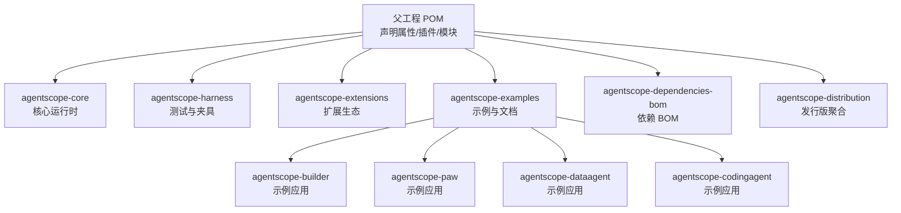
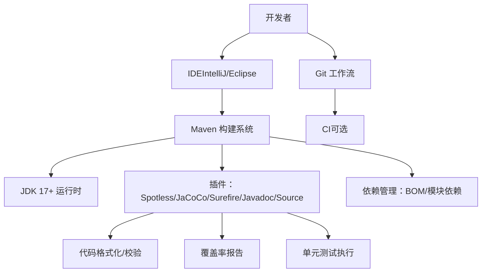
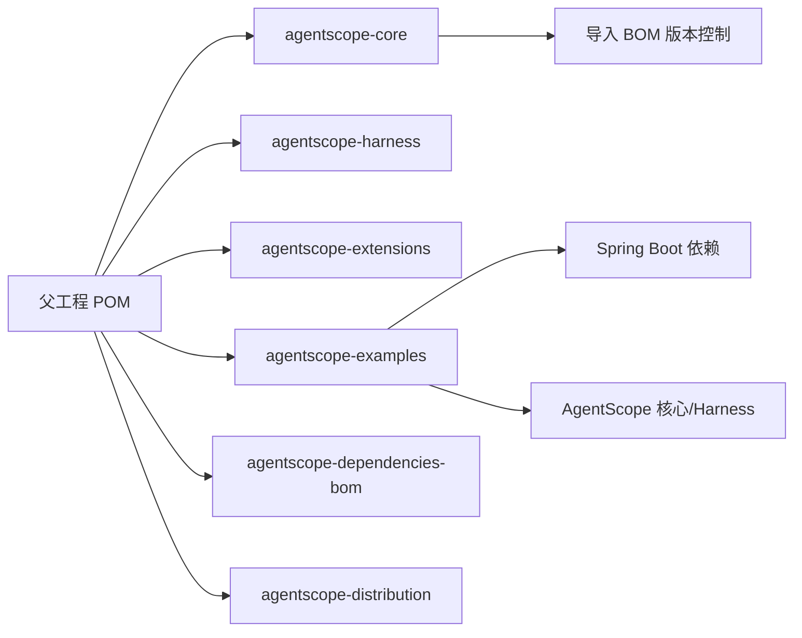

# 开发环境搭建

<cite>
**本文引用的文件**
- [根 POM（父工程）](file://pom.xml)
- [核心模块 POM（agentscope-core）](file://agentscope-core/pom.xml)
- [依赖 BOM 模块 POM（agentscope-dependencies-bom）](file://agentscope-dependencies-bom/pom.xml)
- [发行版聚合 POM（agentscope-distribution）](file://agentscope-distribution/pom.xml)
- [示例模块聚合 POM（agentscope-examples）](file://agentscope-examples/pom.xml)
- [贡献指南（英文）](file://CONTRIBUTING.md)
- [示例应用配置（agentscope-builder-saton）](file://agentscope-builder-saton/src/main/resources/application.yml)
- [示例应用 POM（agentscope-builder-saton）](file://agentscope-builder-saton/pom.xml)
</cite>

## 目录
1. [简介](#简介)
2. [项目结构](#项目结构)
3. [核心组件](#核心组件)
4. [架构总览](#架构总览)
5. [详细组件分析](#详细组件分析)
6. [依赖关系分析](#依赖关系分析)
7. [性能与构建建议](#性能与构建建议)
8. [故障排除指南](#故障排除指南)
9. [结论](#结论)
10. [附录：工具与流程清单](#附录工具与流程清单)

## 简介
本指南面向 AgentScope Java 的开发者，提供从零到一的开发环境搭建步骤，覆盖 JDK 版本与环境变量、IDE 配置（IntelliJ IDEA 与 Eclipse）、Maven 构建与依赖管理、Git 工作流与分支策略、以及代码质量工具（Spotless、JaCoCo、JUnit、Surefire）的使用方法，并给出常见问题排查思路与最佳实践。

## 项目结构
AgentScope Java 采用多模块 Maven 聚合工程组织，顶层父 POM 声明统一属性、插件与模块列表；核心模块包含运行时抽象与能力实现；扩展模块提供各类适配器与外部集成；示例模块演示典型用法；BOM 模块集中管理第三方依赖版本；发行版模块负责打包与发布。

图表来源
- [根 POM（父工程）:57-64](file://pom.xml#L57-L64)
- [发行版聚合 POM（agentscope-distribution）:34-37](file://agentscope-distribution/pom.xml#L34-L37)
- [示例模块聚合 POM（agentscope-examples）:34-40](file://agentscope-examples/pom.xml#L34-L40)

章节来源
- [根 POM（父工程）:57-64](file://pom.xml#L57-L64)
- [发行版聚合 POM（agentscope-distribution）:34-37](file://agentscope-distribution/pom.xml#L34-L37)
- [示例模块聚合 POM（agentscope-examples）:34-40](file://agentscope-examples/pom.xml#L34-L40)

## 核心组件
- 父工程 POM：统一 Java 版本（17）、编码、插件版本与模块清单；内置 Spotless、JaCoCo、Surefire、Javadoc、Source/Jar 插件；定义 Sonatype 发布配置。
- 核心模块 POM：声明核心依赖（Reactor、Jackson、OpenTelemetry、OkHttp、MCP SDK、JSON Schema Validator、SnakeYAML、Tree-Sitter 等），生成测试 Jar 以供夹具复用。
- 依赖 BOM 模块 POM：集中管理大量第三方库版本，通过 import 导入到子模块，确保一致性。
- 示例模块 POM：示例应用可独立构建与运行，部分示例模块使用更高版本 JDK（如 21）。
- 贡献指南：约定提交规范（Conventional Commits）、代码格式（Spotless）、测试执行与覆盖率报告。

章节来源
- [根 POM（父工程）:29-55](file://pom.xml#L29-L55)
- [根 POM（父工程）:165-344](file://pom.xml#L165-L344)
- [核心模块 POM（agentscope-core）:33-49](file://agentscope-core/pom.xml#L33-L49)
- [核心模块 POM（agentscope-core）:51-231](file://agentscope-core/pom.xml#L51-L231)
- [依赖 BOM 模块 POM（agentscope-dependencies-bom）:62-127](file://agentscope-dependencies-bom/pom.xml#L62-L127)
- [示例应用 POM（agentscope-builder-saton）:15-25](file://agentscope-builder-saton/pom.xml#L15-L25)
- [贡献指南（英文）:28-95](file://CONTRIBUTING.md#L28-L95)

## 架构总览
下图展示开发环境的关键要素与交互：JDK 与 Maven、IDE、Git、代码质量工具与测试框架之间的关系。

图表来源
- [根 POM（父工程）:165-344](file://pom.xml#L165-L344)
- [核心模块 POM（agentscope-core）:233-261](file://agentscope-core/pom.xml#L233-L261)
- [依赖 BOM 模块 POM（agentscope-dependencies-bom）:129-508](file://agentscope-dependencies-bom/pom.xml#L129-L508)
- [贡献指南（英文）:57-95](file://CONTRIBUTING.md#L57-L95)

## 详细组件分析

### JDK 与环境变量
- 统一 JDK 版本：父工程与核心模块均将 Java 版本设为 17，保证跨模块一致性。
- 其他示例模块可能使用更高版本（如 21），但本地开发建议优先使用 17 以减少兼容性问题。
- 环境变量建议：
  - JAVA_HOME 指向 JDK 17 安装目录
  - PATH 包含 %JAVA_HOME%/bin
  - 可选：MAVEN_OPTS 设置 JVM 参数（如内存）
- 验证方式：在终端执行 java -version 与 mvn -v

章节来源
- [根 POM（父工程）:33-35](file://pom.xml#L33-L35)
- [核心模块 POM（agentscope-core）:34-36](file://agentscope-core/pom.xml#L34-L36)
- [示例应用 POM（agentscope-builder-saton）:18-20](file://agentscope-builder-saton/pom.xml#L18-L20)

### IDE 配置（IntelliJ IDEA）
- 导入项目
  - 使用 IntelliJ IDEA 打开根目录的 pom.xml，自动识别多模块结构
  - 在 Project Settings 中设置 Project SDK 为 JDK 17
  - Maven Settings 指向本地仓库，勾选 Import Maven projects automatically
- 代码风格与格式化
  - 使用内置 Maven Spotless 插件进行格式化与校验
  - 在 IDE 中可配置保存时触发格式化（结合项目代码风格）
- 插件推荐
  - Lombok（用于注解简化）
  - EditorConfig（统一缩进与换行）
  - .ignore（忽略文件处理）
- 运行与调试
  - 通过 Maven Lifecycle 或直接运行主类（示例应用）
  - 配置 VM Options（如 -Dfile.encoding=UTF-8）

章节来源
- [根 POM（父工程）:165-212](file://pom.xml#L165-L212)
- [贡献指南（英文）:59-73](file://CONTRIBUTING.md#L59-L73)

### IDE 配置（Eclipse）
- 导入项目
  - 选择 File → Import → Maven → Existing Maven Projects，选择根目录
  - 设置 JDK 17 为项目 JDK
- 代码风格与格式化
  - 使用 Maven Spotless 插件进行格式化与校验
  - 可在 Eclipse 中配置 Save Actions 触发格式化
- 插件推荐
  - Buildship（Maven 支持）
  - Lombok（需要启用 annotation processing）
  - EditorConfig 插件
- 运行与调试
  - 通过 Maven Goals 运行 test/package 等生命周期
  - 示例应用可通过 Spring Boot Maven Plugin 运行

章节来源
- [根 POM（父工程）:165-212](file://pom.xml#L165-L212)
- [贡献指南（英文）:59-73](file://CONTRIBUTING.md#L59-L73)

### Maven 构建与依赖管理
- 多模块构建
  - 在根目录执行 mvn clean install 完整构建所有模块
  - 指定模块：mvn -pl agentscope-core clean install
- 依赖管理
  - 通过 agentscope-dependencies-bom 导入统一版本控制
  - 子模块在 dependencyManagement 中 import BOM，避免版本漂移
- 关键插件
  - Spotless：代码格式化与校验（check/apply）
  - JaCoCo：覆盖率收集与报告
  - Surefire：测试执行与报告
  - Javadoc/Source：生成 API 文档与源码包
- 发布配置
  - 父工程已配置 Sonatype 发布仓库（Staging/Snapshots）
  - 发布配置位于 profiles/release 中

章节来源
- [根 POM（父工程）:57-64](file://pom.xml#L57-L64)
- [根 POM（父工程）:133-150](file://pom.xml#L133-L150)
- [根 POM（父工程）:165-344](file://pom.xml#L165-L344)
- [依赖 BOM 模块 POM（agentscope-dependencies-bom）:129-508](file://agentscope-dependencies-bom/pom.xml#L129-L508)

### Git 工作流程与分支管理
- 提交规范
  - 遵循 Conventional Commits，类型包括 feat、fix、docs、style、refactor、perf、ci、chore 等
- 分支策略
  - 主分支：稳定版本与发布
  - 功能分支：feature/*、hotfix/*、chore/*
  - 合并与审查：Pull Request，确保 CI 通过与代码评审
- 日志与变更
  - 通过规范化的提交信息自动生成变更日志

章节来源
- [贡献指南（英文）:28-56](file://CONTRIBUTING.md#L28-L56)

### 代码质量工具
- Spotless
  - 校验：mvn spotless:check
  - 自动修复：mvn spotless:apply
  - 配置包含 Java 格式（AOSP 风格）、导入排序、无用导入清理、注释格式等
- JaCoCo
  - 测试阶段生成覆盖率报告，便于评估测试完整性
- 单元测试与报告
  - mvn test 执行测试
  - mvn verify 生成覆盖率与测试报告
- SonarQube（建议）
  - 可在 CI 中集成 SonarQube 进行静态扫描与质量门禁
  - 结合 Spotless、JaCoCo 报告提升质量度量

章节来源
- [根 POM（父工程）:165-344](file://pom.xml#L165-L344)
- [核心模块 POM（agentscope-core）:233-261](file://agentscope-core/pom.xml#L233-L261)
- [贡献指南（英文）:57-95](file://CONTRIBUTING.md#L57-L95)

### 示例应用与运行
- agentscope-builder-saton
  - 使用 Spring Boot WebFlux + sa-token
  - 默认端口 8080，数据库为 H2（文件型），会话与工作区目录在 data 下
  - 通过 Spring Boot Maven Plugin 运行或打包后启动
- 其他示例模块（如 agentscope-codingagent、agentscope-dataagent）提供不同场景的示例与运行参数

章节来源
- [示例应用配置（agentscope-builder-saton）:1-40](file://agentscope-builder-saton/src/main/resources/application.yml#L1-L40)
- [示例应用 POM（agentscope-builder-saton）:123-145](file://agentscope-builder-saton/pom.xml#L123-L145)

## 依赖关系分析

图表来源
- [根 POM（父工程）:57-64](file://pom.xml#L57-L64)
- [核心模块 POM（agentscope-core）:51-231](file://agentscope-core/pom.xml#L51-L231)
- [示例模块聚合 POM（agentscope-examples）:34-40](file://agentscope-examples/pom.xml#L34-L40)
- [示例应用 POM（agentscope-builder-saton）:27-45](file://agentscope-builder-saton/pom.xml#L27-L45)
- [依赖 BOM 模块 POM（agentscope-dependencies-bom）:129-508](file://agentscope-dependencies-bom/pom.xml#L129-L508)

章节来源
- [根 POM（父工程）:57-64](file://pom.xml#L57-L64)
- [核心模块 POM（agentscope-core）:51-231](file://agentscope-core/pom.xml#L51-L231)
- [示例模块聚合 POM（agentscope-examples）:34-40](file://agentscope-examples/pom.xml#L34-L40)
- [示例应用 POM（agentscope-builder-saton）:27-45](file://agentscope-builder-saton/pom.xml#L27-L45)
- [依赖 BOM 模块 POM（agentscope-dependencies-bom）:129-508](file://agentscope-dependencies-bom/pom.xml#L129-L508)

## 性能与构建建议
- 并行构建：使用 mvn -T 1C（按 CPU 核数）加速多模块编译
- 仅构建指定模块：mvn -pl 模块名 clean install 减少无关改动的影响
- 内存调优：在 MAVEN_OPTS 中设置 -Xms/-Xmx，避免大项目编译 OOM
- 依赖精简：遵循“按需引入”原则，避免不必要的传递依赖
- 编译参数：启用 -parameters 以便运行时保留参数名（已在父工程配置）

章节来源
- [根 POM（父工程）:54-55](file://pom.xml#L54-L55)
- [根 POM（父工程）:264-270](file://pom.xml#L264-L270)

## 故障排除指南
- JDK 版本不匹配
  - 症状：编译报错或运行时报错
  - 处理：确认 JAVA_HOME 指向 JDK 17；IDE 项目 SDK 也应为 17
- Spotless 格式冲突
  - 症状：mvn spotless:check 失败
  - 处理：执行 mvn spotless:apply；或在 IDE 中配置保存时格式化
- 依赖解析失败
  - 症状：Could not resolve dependencies
  - 处理：检查网络与代理；更新本地仓库索引；确认 BOM 导入正确
- 测试失败或覆盖率异常
  - 症状：测试中断或 JaCoCo 报告缺失
  - 处理：先单独运行 mvn test 排查；再执行 mvn verify 生成报告
- 示例应用无法启动
  - 症状：端口占用、数据库初始化失败
  - 处理：修改 application.yml 中的端口与数据源；清理 data 目录后重试

章节来源
- [根 POM（父工程）:165-212](file://pom.xml#L165-L212)
- [根 POM（父工程）:300-320](file://pom.xml#L300-L320)
- [示例应用配置（agentscope-builder-saton）:1-40](file://agentscope-builder-saton/src/main/resources/application.yml#L1-L40)
- [贡献指南（英文）:57-95](file://CONTRIBUTING.md#L57-L95)

## 结论
按照本指南完成 JDK 与 Maven 环境准备、IDE 配置、代码风格与质量工具设置，并遵循 Git 工作流与模块化构建策略，即可高效开展 AgentScope Java 的开发与协作。遇到问题时，优先使用 Maven 插件与日志定位，结合本文提供的排障建议快速恢复。

## 附录：工具与流程清单
- 必备工具
  - JDK 17（建议 17.0.x）
  - Maven 3.8+
  - IntelliJ IDEA 或 Eclipse
  - Git
- 常用命令
  - 清理并安装全部模块：mvn clean install
  - 仅安装某模块：mvn -pl agentscope-core clean install
  - 格式化检查：mvn spotless:check
  - 应用格式化：mvn spotless:apply
  - 运行测试：mvn test
  - 生成报告：mvn verify
- 代码风格与质量
  - Spotless（AOSP 风格、导入排序、无用导入清理）
  - JaCoCo（覆盖率）
  - JUnit 5（测试框架）
  - SonarQube（建议在 CI 集成）