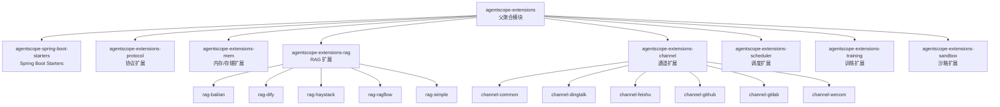
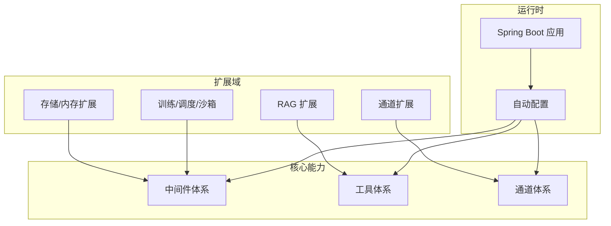
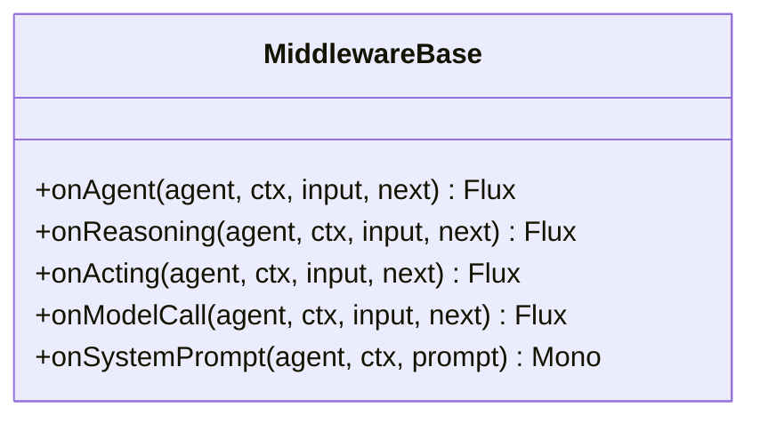
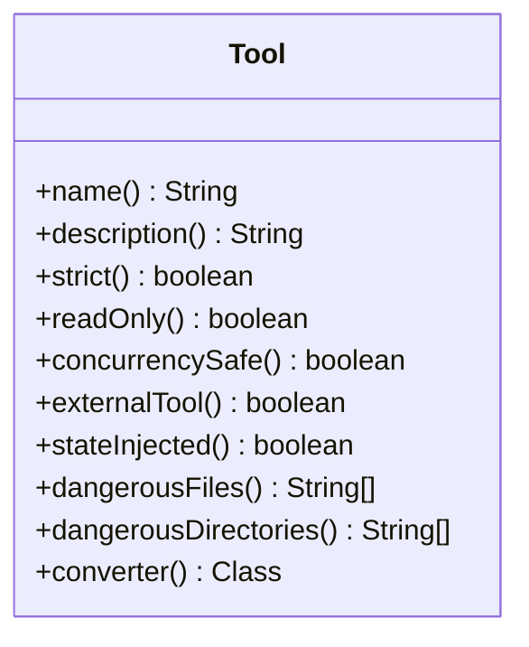
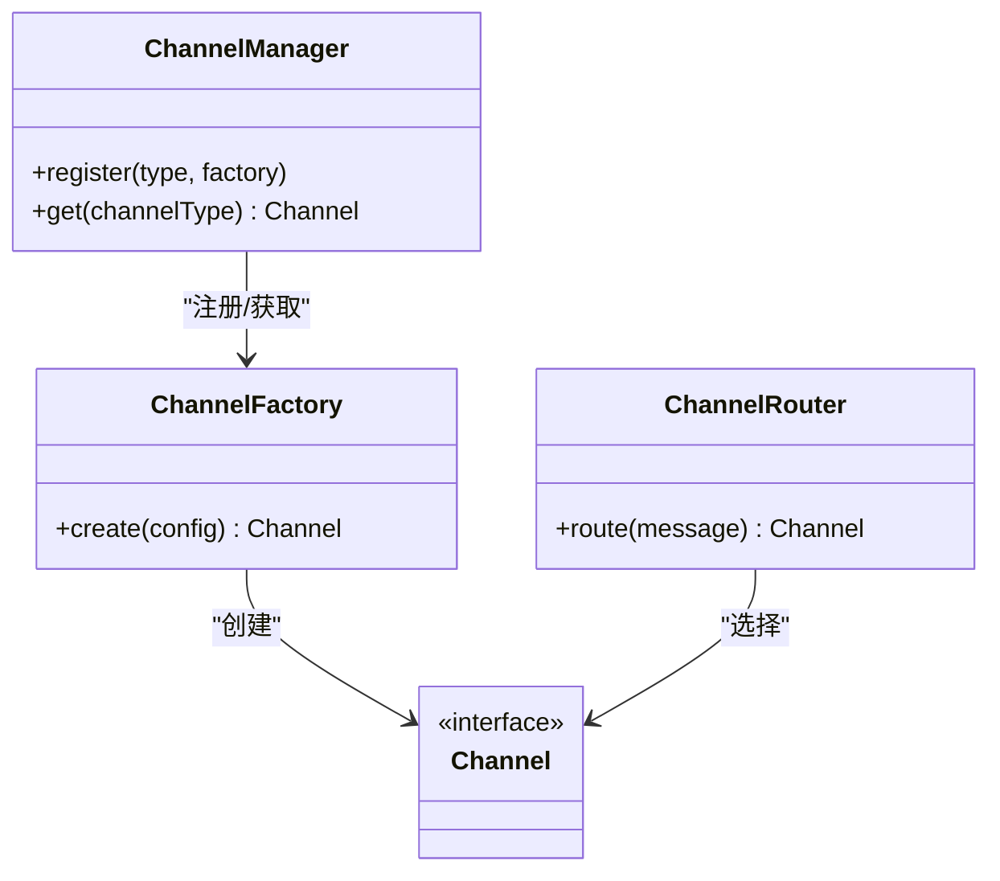
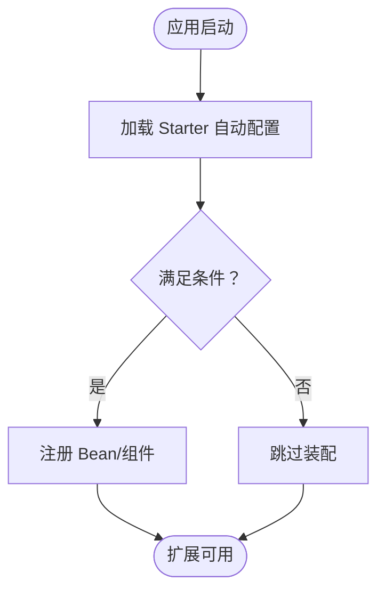
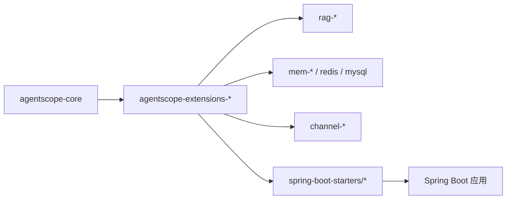

# 扩展开发指南

<cite>
**本文引用的文件**
- [agentscope-extensions/pom.xml](file://agentscope-extensions/pom.xml)
- [agentscope-extensions/agentscope-extensions-rag/pom.xml](file://agentscope-extensions/agentscope-extensions-rag/pom.xml)
- [agentscope-extensions/agentscope-extensions-channel/pom.xml](file://agentscope-extensions/agentscope-extensions-channel/pom.xml)
- [agentscope-extensions/agentscope-spring-boot-starters/pom.xml](file://agentscope-extensions/agentscope-spring-boot-starters/pom.xml)
- [agentscope-extensions/agentscope-extensions-rag/agentscope-extensions-rag-bailian/pom.xml](file://agentscope-extensions/agentscope-extensions-rag/agentscope-extensions-rag-bailian/pom.xml)
- [agentscope-core/src/main/java/io/agentscope/core/middleware/MiddlewareBase.java](file://agentscope-core/src/main/java/io/agentscope/core/middleware/MiddlewareBase.java)
- [agentscope-core/src/main/java/io/agentscope/core/tool/Tool.java](file://agentscope-core/src/main/java/io/agentscope/core/tool/Tool.java)
- [agentscope-harness/src/main/java/io/agentscope/harness/agent/gateway/channel/Channel.java](file://agentscope-harness/src/main/java/io/agentscope/harness/agent/gateway/channel/Channel.java)
- [agentscope-harness/src/main/java/io/agentscope/harness/agent/gateway/channel/ChannelFactory.java](file://agentscope-harness/src/main/java/io/agentscope/harness/agent/gateway/channel/ChannelFactory.java)
- [agentscope-harness/src/main/java/io/agentscope/harness/agent/gateway/channel/ChannelRouter.java](file://agentscope-harness/src/main/java/io/agentscope/harness/agent/gateway/channel/ChannelRouter.java)
- [agentscope-harness/src/main/java/io/agentscope/harness/agent/gateway/ChannelManager.java](file://agentscope-harness/src/main/java/io/agentscope/harness/agent/gateway/ChannelManager.java)
</cite>

## 目录
1. [引言](#引言)
2. [项目结构](#项目结构)
3. [核心组件](#核心组件)
4. [架构总览](#架构总览)
5. [详细组件分析](#详细组件分析)
6. [依赖分析](#依赖分析)
7. [性能考虑](#性能考虑)
8. [故障排查指南](#故障排查指南)
9. [结论](#结论)
10. [附录](#附录)

## 引言
本指南面向希望在 AgentScope Java 生态中开发“扩展模块”的工程师与架构师。内容覆盖模块结构设计、依赖管理、SPI 接口实现、典型扩展（存储、RAG、通道集成）的开发范式、Spring Boot Starter 的开发与自动配置机制、自定义中间件/钩子/工具的开发示例、测试策略与发布流程、扩展兼容性与版本管理策略，以及最佳实践与常见陷阱。

## 项目结构
AgentScope Java 将扩展按功能域拆分为多个 Maven 模块，采用“父模块聚合 + 子模块分组”的层次化组织方式：
- 父模块：agentscope-extensions 聚合所有扩展域
- 分组模块：协议、内存/存储、RAG、通道、调度、训练、沙箱、Spring Boot Starters 等
- 典型子模块：例如 agentscope-extensions-rag 下再细分子供应商实现（如 bailian、dify、haystack、ragflow、simple）

图表来源
- [agentscope-extensions/pom.xml:33-49](file://agentscope-extensions/pom.xml#L33-L49)
- [agentscope-extensions/agentscope-extensions-rag/pom.xml:34-40](file://agentscope-extensions/agentscope-extensions-rag/pom.xml#L34-L40)
- [agentscope-extensions/agentscope-extensions-channel/pom.xml:33-40](file://agentscope-extensions/agentscope-extensions-channel/pom.xml#L33-L40)

章节来源
- [agentscope-extensions/pom.xml:29-49](file://agentscope-extensions/pom.xml#L29-L49)
- [agentscope-extensions/agentscope-extensions-rag/pom.xml:28-42](file://agentscope-extensions/agentscope-extensions-rag/pom.xml#L28-L42)
- [agentscope-extensions/agentscope-extensions-channel/pom.xml:27-42](file://agentscope-extensions/agentscope-extensions-channel/pom.xml#L27-L42)

## 核心组件
- 中间件体系（MiddlewareBase）
  - 提供代理生命周期的五处拦截点：onAgent、onReasoning、onActing、onModelCall、onSystemPrompt
  - 支持洋葱模型（拦截前后逻辑）与流水线模型（系统提示串行变换）
  - 默认实现透传到 next，便于按需覆盖
- 工具体系（@Tool 注解）
  - 通过注解标记可被代理调用的方法，框架反射生成 JSON Schema 并注册到工具包
  - 支持严格模式、只读工具、并发安全、外部工具、状态注入、危险路径限制、自定义结果转换器等特性
- 通道体系（Channel/ChannelFactory/ChannelRouter/ChannelManager）
  - Channel 定义通道抽象；ChannelFactory 负责实例化；ChannelRouter 路由消息；ChannelManager 统一管理

章节来源
- [agentscope-core/src/main/java/io/agentscope/core/middleware/MiddlewareBase.java:25-143](file://agentscope-core/src/main/java/io/agentscope/core/middleware/MiddlewareBase.java#L25-L143)
- [agentscope-core/src/main/java/io/agentscope/core/tool/Tool.java:24-193](file://agentscope-core/src/main/java/io/agentscope/core/tool/Tool.java#L24-L193)
- [agentscope-harness/src/main/java/io/agentscope/harness/agent/gateway/channel/Channel.java](file://agentscope-harness/src/main/java/io/agentscope/harness/agent/gateway/channel/Channel.java)
- [agentscope-harness/src/main/java/io/agentscope/harness/agent/gateway/channel/ChannelFactory.java](file://agentscope-harness/src/main/java/io/agentscope/harness/agent/gateway/channel/ChannelFactory.java)
- [agentscope-harness/src/main/java/io/agentscope/harness/agent/gateway/channel/ChannelRouter.java](file://agentscope-harness/src/main/java/io/agentscope/harness/agent/gateway/channel/ChannelRouter.java)
- [agentscope-harness/src/main/java/io/agentscope/harness/agent/gateway/ChannelManager.java](file://agentscope-harness/src/main/java/io/agentscope/harness/agent/gateway/ChannelManager.java)

## 架构总览
AgentScope Java 的扩展开发遵循“模块化 + SPI + 自动装配”的架构模式：
- 模块化：每个扩展独立为 Maven 模块，按域拆分，便于单独维护与发布
- SPI：通过接口/抽象类（如 Channel、MiddlewareBase、Tool）定义扩展契约
- 自动装配：Spring Boot Starters 提供自动配置与条件装配，简化接入

## 详细组件分析

### 中间件开发范式
- 设计要点
  - 基于 MiddlewareBase 接口，仅覆盖需要的拦截点，其余默认透传
  - 在 onReasoning/onActing/onModelCall 中进行日志、限流、鉴权、指标采集等横切关注点
  - 使用 onSystemPrompt 实现系统提示的链式变换
- 开发步骤
  - 新建 Maven 模块并引入 agentscope-core 依赖
  - 实现 MiddlewareBase 接口或继承基类，重写目标拦截点
  - 在 Spring Boot Starter 中通过 @ConditionalOnProperty/@AutoConfigureAfter 等条件装配中间件
  - 编写单元测试验证事件流与副作用
- 示例参考
  - 参考中间件接口定义与默认行为：[MiddlewareBase.java:25-143](file://agentscope-core/src/main/java/io/agentscope/core/middleware/MiddlewareBase.java#L25-L143)

图表来源
- [agentscope-core/src/main/java/io/agentscope/core/middleware/MiddlewareBase.java:59-143](file://agentscope-core/src/main/java/io/agentscope/core/middleware/MiddlewareBase.java#L59-L143)

章节来源
- [agentscope-core/src/main/java/io/agentscope/core/middleware/MiddlewareBase.java:25-143](file://agentscope-core/src/main/java/io/agentscope/core/middleware/MiddlewareBase.java#L25-L143)

### 工具开发范式
- 设计要点
  - 使用 @Tool 注解标注方法，并为参数添加 @ToolParam
  - 返回类型支持字符串与响应式类型；必要时提供自定义 ToolResultConverter
  - 合理设置 readOnly、strict、concurrencySafe、externalTool、dangerousFiles/dangerousDirectories 等属性
- 开发步骤
  - 在独立模块中声明工具类，避免对核心模块产生编译期耦合
  - 通过工具注册机制（如工具包扫描）完成自动注册
  - 提供最小可运行示例与集成测试
- 示例参考
  - 工具注解与约束说明：[Tool.java:24-193](file://agentscope-core/src/main/java/io/agentscope/core/tool/Tool.java#L24-L193)

图表来源
- [agentscope-core/src/main/java/io/agentscope/core/tool/Tool.java:60-193](file://agentscope-core/src/main/java/io/agentscope/core/tool/Tool.java#L60-L193)

章节来源
- [agentscope-core/src/main/java/io/agentscope/core/tool/Tool.java:24-193](file://agentscope-core/src/main/java/io/agentscope/core/tool/Tool.java#L24-L193)

### 通道集成开发范式
- 设计要点
  - 通道适配器需实现 Channel 抽象，定义消息收发、会话绑定、路由规则
  - 通过 ChannelFactory 创建实例，ChannelRouter 进行路由决策，ChannelManager 统一管理
  - 针对不同平台（钉钉、飞书、企业微信、GitHub、GitLab）实现差异化适配
- 开发步骤
  - 新建通道模块，声明对 agentscope-harness 的依赖
  - 实现 Channel 接口与工厂类，提供配置项与初始化逻辑
  - 在 Spring Boot Starter 中注册 ChannelFactory 与 ChannelRouter
  - 编写端到端测试，覆盖消息发送、接收、会话生命周期
- 示例参考
  - 通道抽象与管理入口：[Channel.java](file://agentscope-harness/src/main/java/io/agentscope/harness/agent/gateway/channel/Channel.java)，[ChannelFactory.java](file://agentscope-harness/src/main/java/io/agentscope/harness/agent/gateway/channel/ChannelFactory.java)，[ChannelRouter.java](file://agentscope-harness/src/main/java/io/agentscope/harness/agent/gateway/channel/ChannelRouter.java)，[ChannelManager.java](file://agentscope-harness/src/main/java/io/agentscope/harness/agent/gateway/ChannelManager.java)

图表来源
- [agentscope-harness/src/main/java/io/agentscope/harness/agent/gateway/channel/Channel.java](file://agentscope-harness/src/main/java/io/agentscope/harness/agent/gateway/channel/Channel.java)
- [agentscope-harness/src/main/java/io/agentscope/harness/agent/gateway/channel/ChannelFactory.java](file://agentscope-harness/src/main/java/io/agentscope/harness/agent/gateway/channel/ChannelFactory.java)
- [agentscope-harness/src/main/java/io/agentscope/harness/agent/gateway/channel/ChannelRouter.java](file://agentscope-harness/src/main/java/io/agentscope/harness/agent/gateway/channel/ChannelRouter.java)
- [agentscope-harness/src/main/java/io/agentscope/harness/agent/gateway/ChannelManager.java](file://agentscope-harness/src/main/java/io/agentscope/harness/agent/gateway/ChannelManager.java)

章节来源
- [agentscope-harness/src/main/java/io/agentscope/harness/agent/gateway/channel/Channel.java](file://agentscope-harness/src/main/java/io/agentscope/harness/agent/gateway/channel/Channel.java)
- [agentscope-harness/src/main/java/io/agentscope/harness/agent/gateway/channel/ChannelFactory.java](file://agentscope-harness/src/main/java/io/agentscope/harness/agent/gateway/channel/ChannelFactory.java)
- [agentscope-harness/src/main/java/io/agentscope/harness/agent/gateway/channel/ChannelRouter.java](file://agentscope-harness/src/main/java/io/agentscope/harness/agent/gateway/channel/ChannelRouter.java)
- [agentscope-harness/src/main/java/io/agentscope/harness/agent/gateway/ChannelManager.java](file://agentscope-harness/src/main/java/io/agentscope/harness/agent/gateway/ChannelManager.java)

### Spring Boot Starter 开发与自动配置
- 设计要点
  - 以 agentscope-spring-boot-starters 为父模块，统一管理 Spring Boot 版本与编译插件
  - 每个具体 Starter 模块负责自身自动配置与条件装配
  - 通过 @EnableConfigurationProperties、@Import、@Bean 定义与注册扩展组件
- 开发步骤
  - 在 Starter 模块中定义配置属性类，使用 @ConfigurationProperties 或 @ConstructorBinding
  - 在 AutoConfiguration 中根据条件装配中间件、工具、通道等组件
  - 提供示例应用与集成测试，验证自动装配生效
- 示例参考
  - Starter 父模块与依赖管理：[agentscope-spring-boot-starters/pom.xml:33-58](file://agentscope-spring-boot-starters/pom.xml#L33-L58)

图表来源
- [agentscope-extensions/agentscope-spring-boot-starters/pom.xml:33-58](file://agentscope-extensions/agentscope-spring-boot-starters/pom.xml#L33-L58)

章节来源
- [agentscope-extensions/agentscope-spring-boot-starters/pom.xml:28-58](file://agentscope-extensions/agentscope-spring-boot-starters/pom.xml#L28-L58)

### RAG 扩展开发范式
- 设计要点
  - RAG 扩展通常封装第三方知识库/检索服务（如 Bailian、Dify、Haystack、RAGFlow）
  - 对接统一的检索接口，提供检索、向量化、索引构建等能力
- 开发步骤
  - 新建子模块，声明对 agentscope-core 的可选依赖
  - 封装第三方 SDK，暴露统一的检索 API
  - 在 Starter 中注册检索器与钩子（如 GenericRAGHook），实现与代理的集成
- 示例参考
  - RAG 父模块与子模块组织：[agentscope-extensions/agentscope-extensions-rag/pom.xml:34-40](file://agentscope-extensions/agentscope-extensions-rag/pom.xml#L34-L40)
  - Bailian RAG 子模块依赖示例：[agentscope-extensions/agentscope-extensions-rag/agentscope-extensions-rag-bailian/pom.xml:33-46](file://agentscope-extensions/agentscope-extensions-rag/agentscope-extensions-rag-bailian/pom.xml#L33-L46)

章节来源
- [agentscope-extensions/agentscope-extensions-rag/pom.xml:28-42](file://agentscope-extensions/agentscope-extensions-rag/pom.xml#L28-L42)
- [agentscope-extensions/agentscope-extensions-rag/agentscope-extensions-rag-bailian/pom.xml:33-46](file://agentscope-extensions/agentscope-extensions-rag/agentscope-extensions-rag-bailian/pom.xml#L33-L46)

### 存储/内存扩展开发范式
- 设计要点
  - 提供分布式存储实现（如 Redis、MySQL）与本地内存实现
  - 对接统一的状态/会话/记忆接口，确保一致性与可替换性
- 开发步骤
  - 定义存储接口与实现类，提供序列化/反序列化策略
  - 在 Starter 中根据配置选择实现并注册
  - 编写压力测试与一致性测试

### 训练/调度/沙箱扩展开发范式
- 设计要点
  - 训练扩展：提供数据集、评估、微调等能力
  - 调度扩展：对接 Quartz、XXL-Job 等任务调度引擎
  - 沙箱扩展：提供受控执行环境（如 Daytona、E2B、Kubernetes）
- 开发步骤
  - 按需引入第三方依赖，封装统一接口
  - 在 Starter 中按条件装配，提供默认配置与可覆盖选项
  - 编写集成测试与安全边界测试

## 依赖分析
- 模块间依赖
  - 扩展模块通常以 agentscope-core 为可选依赖，避免强耦合
  - Spring Boot Starters 导入 spring-boot-dependencies，统一版本
- 外部依赖
  - 第三方 SDK（如阿里 Bailian）在对应子模块中声明
- 典型依赖关系图

图表来源
- [agentscope-extensions/agentscope-extensions-rag/agentscope-extensions-rag-bailian/pom.xml:33-46](file://agentscope-extensions/agentscope-extensions-rag/agentscope-extensions-rag-bailian/pom.xml#L33-L46)
- [agentscope-extensions/agentscope-spring-boot-starters/pom.xml:48-58](file://agentscope-extensions/agentscope-spring-boot-starters/pom.xml#L48-L58)

章节来源
- [agentscope-extensions/agentscope-extensions-rag/agentscope-extensions-rag-bailian/pom.xml:33-46](file://agentscope-extensions/agentscope-extensions-rag/agentscope-extensions-rag-bailian/pom.xml#L33-L46)
- [agentscope-extensions/agentscope-spring-boot-starters/pom.xml:48-58](file://agentscope-extensions/agentscope-spring-boot-starters/pom.xml#L48-L58)

## 性能考虑
- 中间件链路
  - 控制中间件数量与深度，避免事件流过度包装导致延迟增加
  - 对 onReasoning/onActing/onModelCall 的处理逻辑尽量轻量，必要时异步化
- 工具调用
  - 对外部工具（externalTool=true）采用流式返回，减少阻塞
  - 合理设置 concurrencySafe，提升并行度
- 通道与网络
  - 通道适配器应具备连接池、超时与重试策略
  - 对高频消息进行批处理与压缩
- 存储与缓存
  - 使用本地缓存与分布式缓存结合，降低热点查询延迟
  - 对写操作进行批量提交与幂等控制

## 故障排查指南
- 中间件问题
  - 症状：事件流中断、无输出、异常未传播
  - 排查：检查 next 是否正确调用、异常是否被捕获并转换为错误事件
- 工具问题
  - 症状：工具不可见、参数校验失败、返回值格式不正确
  - 排查：确认 @Tool 注解与 @ToolParam 使用正确、返回类型与转换器匹配
- 通道问题
  - 症状：消息丢失、重复投递、路由错误
  - 排查：核对 ChannelFactory 配置、ChannelRouter 规则、ChannelManager 注册情况
- Spring Boot 自动装配问题
  - 症状：组件未生效、配置不生效
  - 排查：检查 @ConditionalOnProperty、@AutoConfigureAfter、依赖顺序与 Starter 引入

章节来源
- [agentscope-core/src/main/java/io/agentscope/core/middleware/MiddlewareBase.java:25-143](file://agentscope-core/src/main/java/io/agentscope/core/middleware/MiddlewareBase.java#L25-L143)
- [agentscope-core/src/main/java/io/agentscope/core/tool/Tool.java:24-193](file://agentscope-core/src/main/java/io/agentscope/core/tool/Tool.java#L24-L193)
- [agentscope-harness/src/main/java/io/agentscope/harness/agent/gateway/channel/Channel.java](file://agentscope-harness/src/main/java/io/agentscope/harness/agent/gateway/channel/Channel.java)
- [agentscope-harness/src/main/java/io/agentscope/harness/agent/gateway/channel/ChannelFactory.java](file://agentscope-harness/src/main/java/io/agentscope/harness/agent/gateway/channel/ChannelFactory.java)
- [agentscope-harness/src/main/java/io/agentscope/harness/agent/gateway/channel/ChannelRouter.java](file://agentscope-harness/src/main/java/io/agentscope/harness/agent/gateway/channel/ChannelRouter.java)
- [agentscope-harness/src/main/java/io/agentscope/harness/agent/gateway/ChannelManager.java](file://agentscope-harness/src/main/java/io/agentscope/harness/agent/gateway/ChannelManager.java)

## 结论
通过模块化、SPI 与自动装配的组合，AgentScope Java 为扩展开发提供了清晰的路径：先定义契约（接口/注解），再实现与装配（中间件/工具/通道），最后以 Starter 形式交付给用户。遵循本文档的结构设计、依赖管理、测试与发布策略，可高效构建高质量扩展并保持长期兼容性。

## 附录
- 测试策略
  - 单元测试：针对中间件、工具、通道的输入输出与边界条件
  - 集成测试：覆盖 Spring Boot 自动装配与端到端流程
  - 压力测试：评估高并发下的延迟与吞吐
- 发布流程
  - 使用 Maven Release Plugin 或 GitHub Actions 完成版本打标与构件上传
  - 为每个扩展模块维护独立 CHANGELOG，明确破坏性变更
- 兼容性与版本管理
  - 遵循语义化版本，破坏性变更升级主版本
  - 对第三方 SDK 采用可替换实现，避免硬编码依赖
  - 通过 BOM/Parent POM 统一版本，减少冲突