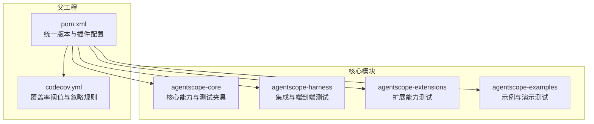
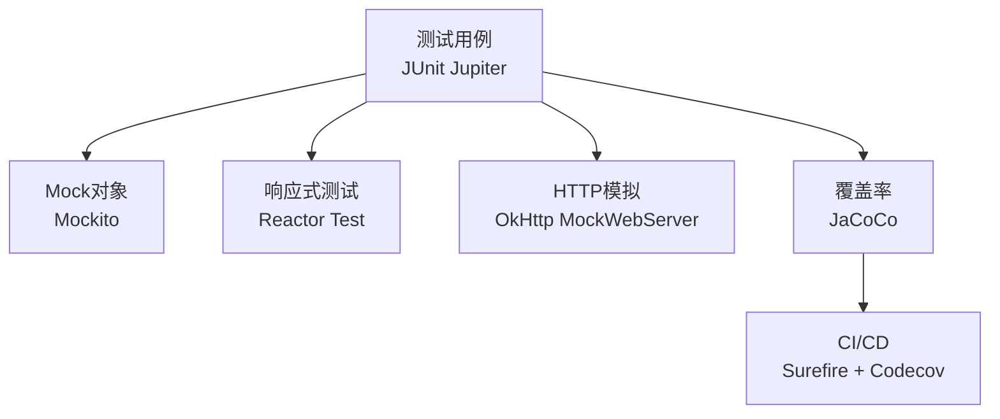
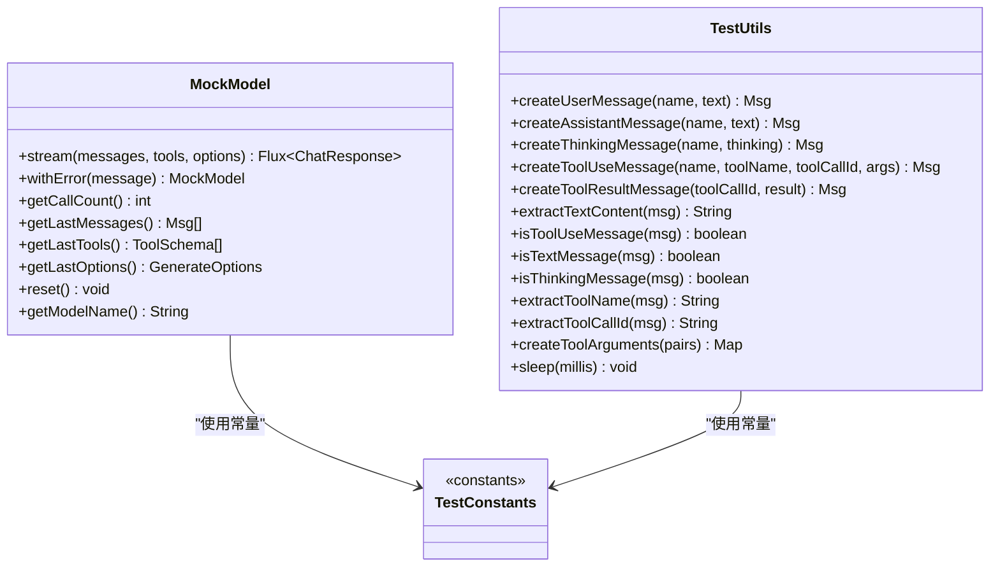
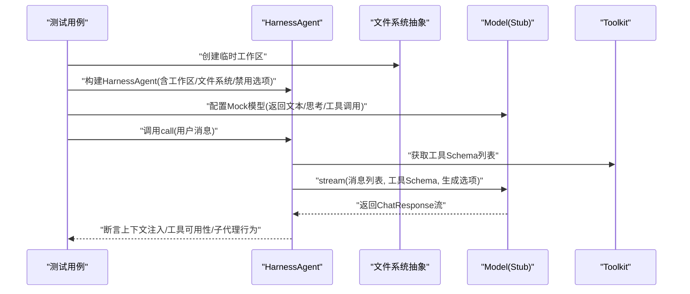
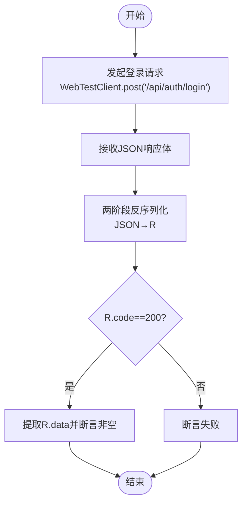
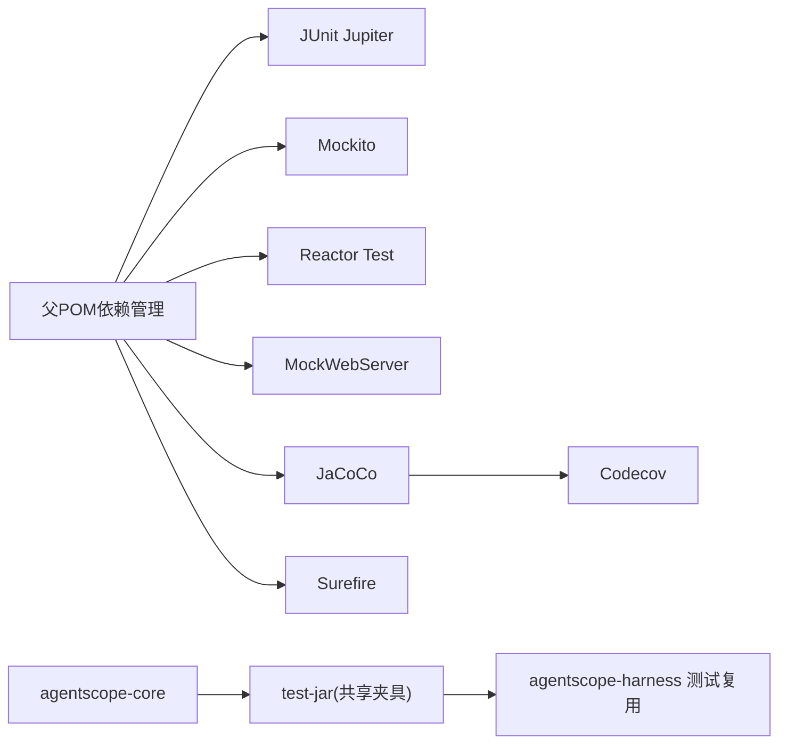

# 测试策略与实践

<cite>
**本文引用的文件**   
- [pom.xml](file://pom.xml)
- [agentscope-core/pom.xml](file://agentscope-core/pom.xml)
- [codecov.yml](file://codecov.yml)
- [agentscope-harness/src/test/java/io/agentscope/harness/agent/HarnessAgentTest.java](file://agentscope-harness/src/test/java/io/agentscope/harness/agent/HarnessAgentTest.java)
- [agentscope-core/src/test/java/io/agentscope/core/agent/test/TestConstants.java](file://agentscope-core/src/test/java/io/agentscope/core/agent/test/TestConstants.java)
- [agentscope-core/src/test/java/io/agentscope/core/agent/test/TestUtils.java](file://agentscope-core/src/test/java/io/agentscope/core/agent/test/TestUtils.java)
- [agentscope-core/src/test/java/io/agentscope/core/agent/test/MockModel.java](file://agentscope-core/src/test/java/io/agentscope/core/agent/test/MockModel.java)
- [agentscope-builder-saton/src/test/java/io/agentscope/builder/saton/common/TestR.java](file://agentscope-builder-saton/src/test/java/io/agentscope/builder/saton/common/TestR.java)
</cite>

## 目录
1. [引言](#引言)
2. [项目结构](#项目结构)
3. [核心组件](#核心组件)
4. [架构总览](#架构总览)
5. [详细组件分析](#详细组件分析)
6. [依赖关系分析](#依赖关系分析)
7. [性能考量](#性能考量)
8. [故障排查指南](#故障排查指南)
9. [结论](#结论)
10. [附录](#附录)

## 引言
本指南面向AgentScope Java项目的测试体系，系统阐述单元测试、集成测试与端到端测试的设计原则与实施方法；详解JUnit测试框架在本项目中的使用方式（测试用例编写、Mock对象、测试数据准备）；明确覆盖率目标与测试报告生成流程；给出异步测试、并发测试与性能测试的最佳实践；介绍测试驱动开发（TDD）在本项目中的落地路径；并提供测试环境搭建与持续集成中的测试配置要点，以及测试用例设计模式与测试数据管理策略。

## 项目结构
AgentScope Java采用多模块Maven聚合工程组织，核心模块包括agentscope-core、agentscope-harness、agentscope-extensions、agentscope-examples等。测试覆盖贯穿各模块，统一通过父POM配置测试插件与覆盖率工具，并在子模块中按功能域划分测试包。

**图表来源**
- [pom.xml:165-344](file://pom.xml#L165-L344)
- [codecov.yml:15-34](file://codecov.yml#L15-L34)

**章节来源**
- [pom.xml:57-64](file://pom.xml#L57-L64)
- [pom.xml:272-320](file://pom.xml#L272-L320)
- [codecov.yml:15-34](file://codecov.yml#L15-L34)

## 核心组件
- 测试框架与工具
  - JUnit Jupiter：用于编写与运行测试用例
  - Mockito：用于构建Mock对象与桩函数
  - Reactor Test：用于响应式流测试
  - OkHttp MockWebServer：用于HTTP服务模拟
  - Surefire/JUnit平台：用于测试执行与报告
  - JaCoCo：用于覆盖率统计与报告
- 测试夹具与共享工具
  - agentscope-core提供test-jar，供下游模块复用测试夹具（如MockModel、TestUtils、TestConstants）
  - 共享常量与工具类确保测试一致性与可维护性

**章节来源**
- [pom.xml:98-131](file://pom.xml#L98-L131)
- [agentscope-core/pom.xml:233-247](file://agentscope-core/pom.xml#L233-L247)
- [agentscope-core/src/test/java/io/agentscope/core/agent/test/TestConstants.java:24-64](file://agentscope-core/src/test/java/io/agentscope/core/agent/test/TestConstants.java#L24-L64)
- [agentscope-core/src/test/java/io/agentscope/core/agent/test/TestUtils.java:33-194](file://agentscope-core/src/test/java/io/agentscope/core/agent/test/TestUtils.java#L33-L194)
- [agentscope-core/src/test/java/io/agentscope/core/agent/test/MockModel.java:42-233](file://agentscope-core/src/test/java/io/agentscope/core/agent/test/MockModel.java#L42-L233)

## 架构总览
下图展示了测试层在整体架构中的位置与交互关系：测试通过JUnit与Mockito对核心组件进行隔离验证；对响应式流使用Reactor Test；对外部HTTP接口使用MockWebServer；覆盖率由JaCoCo收集并在CI中与Codecov集成。

**图表来源**
- [pom.xml:272-320](file://pom.xml#L272-L320)
- [pom.xml:98-131](file://pom.xml#L98-L131)

## 详细组件分析

### 单元测试设计与实现
- 设计原则
  - 隔离性：使用Mockito隔离外部依赖，确保被测单元职责单一
  - 可重复性：通过共享常量与工具类保证测试稳定性
  - 可读性：以Given-When-Then风格组织测试步骤，断言清晰
- 实施要点
  - 使用MockModel模拟模型调用，验证消息流与工具调用序列
  - 使用TestUtils/TestConstants构造标准输入与期望输出
  - 对异常场景使用withError配置MockModel抛出异常，验证错误处理
- 示例参考
  - Mock模型与工具调用：[MockModel.java:42-233](file://agentscope-core/src/test/java/io/agentscope/core/agent/test/MockModel.java#L42-L233)
  - 测试常量与工具：[TestConstants.java:24-64](file://agentscope-core/src/test/java/io/agentscope/core/agent/test/TestConstants.java#L24-L64)，[TestUtils.java:33-194](file://agentscope-core/src/test/java/io/agentscope/core/agent/test/TestUtils.java#L33-L194)

**图表来源**
- [agentscope-core/src/test/java/io/agentscope/core/agent/test/MockModel.java:42-233](file://agentscope-core/src/test/java/io/agentscope/core/agent/test/MockModel.java#L42-L233)
- [agentscope-core/src/test/java/io/agentscope/core/agent/test/TestUtils.java:33-194](file://agentscope-core/src/test/java/io/agentscope/core/agent/test/TestUtils.java#L33-L194)
- [agentscope-core/src/test/java/io/agentscope/core/agent/test/TestConstants.java:24-64](file://agentscope-core/src/test/java/io/agentscope/core/agent/test/TestConstants.java#L24-L64)

**章节来源**
- [agentscope-core/src/test/java/io/agentscope/core/agent/test/MockModel.java:42-233](file://agentscope-core/src/test/java/io/agentscope/core/agent/test/MockModel.java#L42-L233)
- [agentscope-core/src/test/java/io/agentscope/core/agent/test/TestUtils.java:33-194](file://agentscope-core/src/test/java/io/agentscope/core/agent/test/TestUtils.java#L33-L194)
- [agentscope-core/src/test/java/io/agentscope/core/agent/test/TestConstants.java:24-64](file://agentscope-core/src/test/java/io/agentscope/core/agent/test/TestConstants.java#L24-L64)

### 集成测试设计与实现
- 设计原则
  - 模块间协作验证：通过HarnessAgentTest验证工作区、子代理、工具集与文件系统的集成行为
  - 环境隔离：使用@TempDir与系统属性隔离状态目录，避免跨测试污染
  - 行为契约：验证禁用选项（禁用内存/文件/子代理/Shell）对工具注册的影响
- 实施要点
  - 工作区上下文注入：验证AGENTS.md是否按预期注入到模型输入
  - 子代理声明解析：从Markdown解析子代理声明并校验工具注册
  - 远程文件系统共享：在非沙箱模式下验证MEMORY.md共享
- 示例参考
  - 工作区上下文注入与禁用行为：[HarnessAgentTest.java:66-231](file://agentscope-harness/src/test/java/io/agentscope/harness/agent/HarnessAgentTest.java#L66-L231)
  - 子代理Markdown声明解析：[HarnessAgentTest.java:233-320](file://agentscope-harness/src/test/java/io/agentscope/harness/agent/HarnessAgentTest.java#L233-L320)
  - 远程文件系统共享：[HarnessAgentTest.java:322-347](file://agentscope-harness/src/test/java/io/agentscope/harness/agent/HarnessAgentTest.java#L322-L347)

**图表来源**
- [agentscope-harness/src/test/java/io/agentscope/harness/agent/HarnessAgentTest.java:66-347](file://agentscope-harness/src/test/java/io/agentscope/harness/agent/HarnessAgentTest.java#L66-L347)

**章节来源**
- [agentscope-harness/src/test/java/io/agentscope/harness/agent/HarnessAgentTest.java:66-347](file://agentscope-harness/src/test/java/io/agentscope/harness/agent/HarnessAgentTest.java#L66-L347)

### 端到端测试设计与实现
- 设计原则
  - 场景驱动：围绕真实业务场景（如认证登录、API响应包装）设计端到端流程
  - 响应式与异步：结合Reactor Test与WebTestClient验证异步响应
  - 类型安全：通过两阶段反序列化（原始JSON→Jackson）规避泛型类型擦除问题
- 实施要点
  - 登录流程：使用WebTestClient发起POST请求，提取R响应中的data字段
  - 泛型类型保留：借助TestR工具类完成R<T>的正确解析
- 示例参考
  - R响应封装与登录流程：[TestR.java:22-36](file://agentscope-builder-saton/src/test/java/io/agentscope/builder/saton/common/TestR.java#L22-L36)
  - 数据提取与断言：[TestR.java:42-49](file://agentscope-builder-saton/src/test/java/io/agentscope/builder/saton/common/TestR.java#L42-L49)

**图表来源**
- [agentscope-builder-saton/src/test/java/io/agentscope/builder/saton/common/TestR.java:22-49](file://agentscope-builder-saton/src/test/java/io/agentscope/builder/saton/common/TestR.java#L22-L49)

**章节来源**
- [agentscope-builder-saton/src/test/java/io/agentscope/builder/saton/common/TestR.java:22-49](file://agentscope-builder-saton/src/test/java/io/agentscope/builder/saton/common/TestR.java#L22-L49)

### 异步测试与并发测试最佳实践
- 异步测试
  - 使用Reactor Test与Flux/StepVerifier验证响应式流的背压、顺序与终止条件
  - 在HarnessAgentTest中通过ArgumentCaptor捕获模型stream调用参数，验证消息拼接与上下文注入
- 并发测试
  - 使用线程安全的数据结构与无共享状态的Mock对象
  - 通过TestUtils.sleep进行可控等待，避免竞态条件
- 示例参考
  - 流式调用与参数捕获：[HarnessAgentTest.java:188-198](file://agentscope-harness/src/test/java/io/agentscope/harness/agent/HarnessAgentTest.java#L188-L198)
  - 工具方法sleep：[TestUtils.java:183-189](file://agentscope-core/src/test/java/io/agentscope/core/agent/test/TestUtils.java#L183-L189)

**章节来源**
- [agentscope-harness/src/test/java/io/agentscope/harness/agent/HarnessAgentTest.java:188-198](file://agentscope-harness/src/test/java/io/agentscope/harness/agent/HarnessAgentTest.java#L188-L198)
- [agentscope-core/src/test/java/io/agentscope/core/agent/test/TestUtils.java:183-189](file://agentscope-core/src/test/java/io/agentscope/core/agent/test/TestUtils.java#L183-L189)

### 性能测试与基准测试建议
- 建议采用JMH或自定义微基准，测量关键路径（模型调用、工具执行、消息序列化）的吞吐与延迟
- 在CI中引入性能回归告警，结合覆盖率与测试时长监控
- 本节为通用指导，不直接分析具体文件

## 依赖关系分析
- 测试依赖管理
  - 父POM集中声明JUnit、Mockito、Reactor Test、MockWebServer等测试依赖
  - agentscope-core通过test-jar暴露共享测试夹具，便于其他模块复用
- 插件与报告
  - Surefire负责测试执行与日志输出
  - JaCoCo在test阶段生成覆盖率报告
  - Codecov根据codecov.yml配置进行覆盖率阈值检查

**图表来源**
- [pom.xml:98-131](file://pom.xml#L98-L131)
- [agentscope-core/pom.xml:233-247](file://agentscope-core/pom.xml#L233-L247)
- [pom.xml:272-320](file://pom.xml#L272-L320)
- [codecov.yml:15-34](file://codecov.yml#L15-L34)

**章节来源**
- [pom.xml:98-131](file://pom.xml#L98-L131)
- [agentscope-core/pom.xml:233-247](file://agentscope-core/pom.xml#L233-L247)
- [pom.xml:272-320](file://pom.xml#L272-L320)
- [codecov.yml:15-34](file://codecov.yml#L15-L34)

## 性能考量
- 覆盖率目标
  - 项目目标：整体覆盖率不低于60%，补丁覆盖率不低于60%
  - 忽略示例模块，聚焦核心与扩展模块
- 报告生成
  - JaCoCo在test阶段生成报告，可在本地查看与CI中上传至Codecov
- 建议
  - 将关键路径纳入单元测试，减少对集成测试的过度依赖
  - 使用Mock对象替代真实外部依赖，降低测试执行时间

**章节来源**
- [codecov.yml:18-31](file://codecov.yml#L18-L31)
- [pom.xml:302-320](file://pom.xml#L302-L320)

## 故障排查指南
- 常见问题
  - 测试间状态污染：确认使用@TempDir与系统属性隔离状态目录
  - 泛型类型擦除导致的反序列化失败：参考R<T>的两阶段反序列化方案
  - 响应式流未触发：检查Mock模型是否正确返回Flux
- 定位手段
  - 启用详细日志与测试时序输出
  - 使用ArgumentCaptor捕获关键调用参数，核对消息内容与工具Schema
- 参考实现
  - 状态隔离与系统属性设置：[pom.xml:296-298](file://pom.xml#L296-L298)
  - R<T>反序列化工具：[TestR.java:51-57](file://agentscope-builder-saton/src/test/java/io/agentscope/builder/saton/common/TestR.java#L51-L57)
  - 参数捕获与断言：[HarnessAgentTest.java:188-198](file://agentscope-harness/src/test/java/io/agentscope/harness/agent/HarnessAgentTest.java#L188-L198)

**章节来源**
- [pom.xml:296-298](file://pom.xml#L296-L298)
- [agentscope-builder-saton/src/test/java/io/agentscope/builder/saton/common/TestR.java:51-57](file://agentscope-builder-saton/src/test/java/io/agentscope/builder/saton/common/TestR.java#L51-L57)
- [agentscope-harness/src/test/java/io/agentscope/harness/agent/HarnessAgentTest.java:188-198](file://agentscope-harness/src/test/java/io/agentscope/harness/agent/HarnessAgentTest.java#L188-L198)

## 结论
本测试策略以JUnit为核心，结合Mockito、Reactor Test与MockWebServer，覆盖单元、集成与端到端场景；通过共享夹具与统一插件配置提升可维护性；以JaCoCo与Codecov保障覆盖率与质量门槛。建议在后续迭代中进一步完善性能基准与并发测试，强化TDD流程以提升代码质量与可测试性。

## 附录

### 测试用例设计模式
- 经典模式
  - Given-When-Then：清晰分层测试步骤
  - Parameterized Test：对多组输入进行批量验证
  - Factory Method：通过TestUtils/TestConstants快速构造测试数据
- 参考实现
  - 工具方法与常量：[TestUtils.java:33-194](file://agentscope-core/src/test/java/io/agentscope/core/agent/test/TestUtils.java#L33-L194)，[TestConstants.java:24-64](file://agentscope-core/src/test/java/io/agentscope/core/agent/test/TestConstants.java#L24-L64)

**章节来源**
- [agentscope-core/src/test/java/io/agentscope/core/agent/test/TestUtils.java:33-194](file://agentscope-core/src/test/java/io/agentscope/core/agent/test/TestUtils.java#L33-L194)
- [agentscope-core/src/test/java/io/agentscope/core/agent/test/TestConstants.java:24-64](file://agentscope-core/src/test/java/io/agentscope/core/agent/test/TestConstants.java#L24-L64)

### 测试数据管理策略
- 统一常量与工具：集中于TestConstants与TestUtils，避免分散硬编码
- 夹具复用：agentscope-core导出test-jar，下游模块直接复用
- 环境隔离：通过系统属性与临时目录隔离测试状态
- 参考实现
  - 夹具发布与排除：[agentscope-core/pom.xml:233-259](file://agentscope-core/pom.xml#L233-L259)
  - 系统属性隔离：[pom.xml:296-298](file://pom.xml#L296-L298)

**章节来源**
- [agentscope-core/pom.xml:233-259](file://agentscope-core/pom.xml#L233-L259)
- [pom.xml:296-298](file://pom.xml#L296-L298)