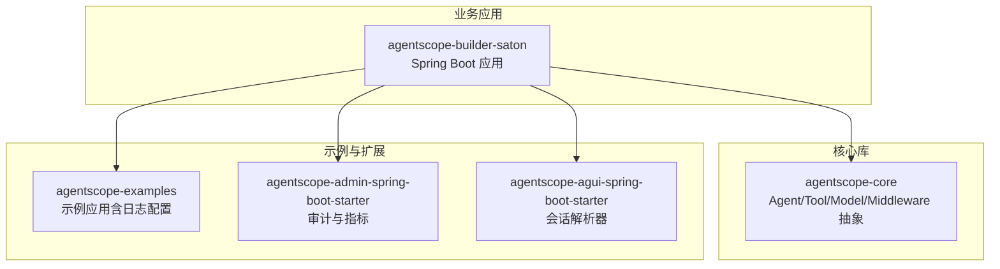
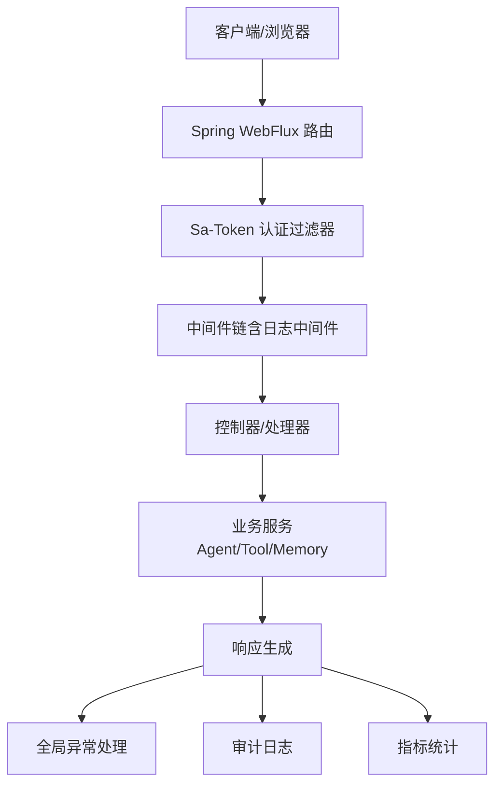
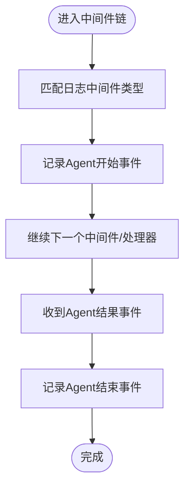
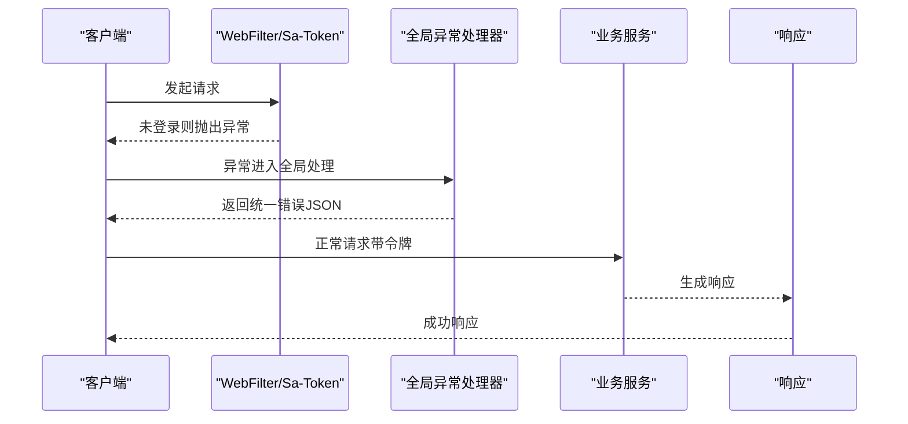
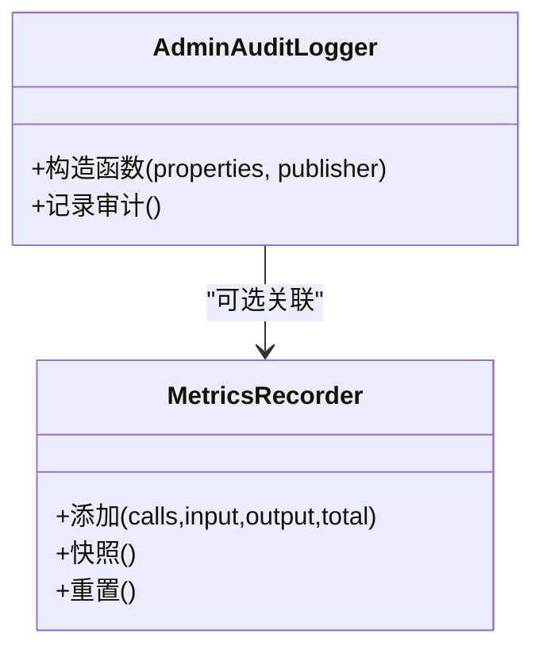
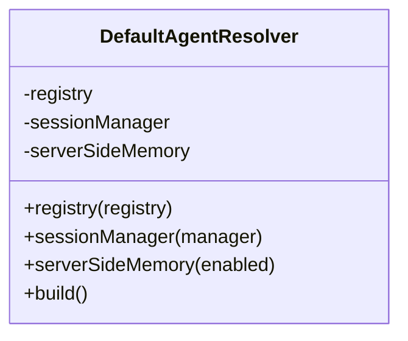
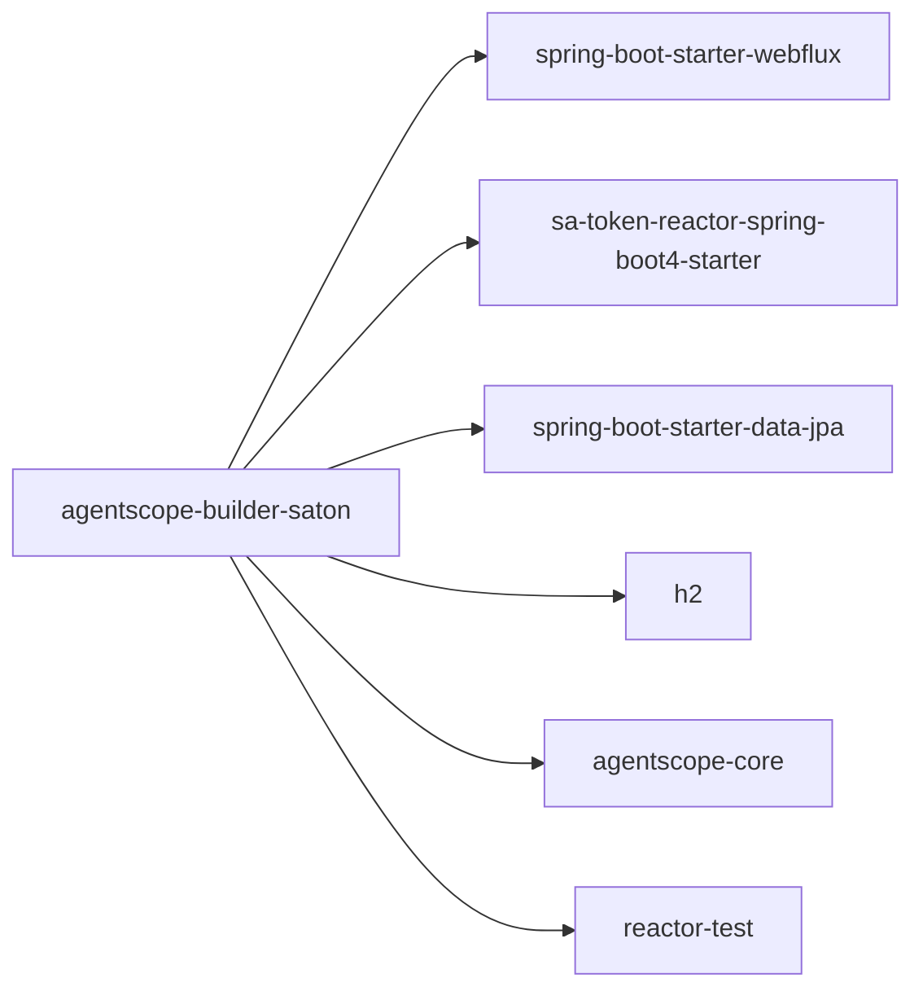

# 调试技巧与工具

<cite>
**本文引用的文件**
- [application.yml](file://agentscope-builder-saton/src/main/resources/application.yml)
- [pom.xml（构建与依赖）](file://agentscope-builder-saton/pom.xml)
- [pom.xml（核心模块）](file://agentscope-core/pom.xml)
- [logback-spring.xml（示例）](file://agentscope-examples/agents/agentscope-builder/src/main/resources/logback-spring.xml)
- [LoggingMiddlewareType.java](file://agentscope-builder-saton/src/main/java/io/agentscope/builder/saton/factory/middleware/impl/LoggingMiddlewareType.java)
- [GlobalErrorWebExceptionHandler.java](file://agentscope-builder-saton/src/main/java/io/agentscope/builder/saton/common/GlobalErrorWebExceptionHandler.java)
- [AdminAuditLogger.java](file://agentscope-extensions/agentscope-spring-boot-starters/agentscope-admin-spring-boot-starter/src/main/java/io/agentscope/spring/boot/admin/audit/AdminAuditLogger.java)
- [MetricsRecorder.java](file://agentscope-extensions/agentscope-spring-boot-starters/agentscope-admin-spring-boot-starter/src/main/java/io/agentscope/spring/boot/admin/metrics/MetricsRecorder.java)
- [DefaultAgentResolver.java](file://agentscope-extensions/agentscope-spring-boot-starters/agentscope-agui-spring-boot-starter/src/main/java/io/agentscope/spring/boot/agui/common/DefaultAgentResolver.java)
- [SessionFlowTest.java](file://agentscope-builder-saton/src/test/java/io/agentscope/builder/saton/session/SessionFlowTest.java)
- [WorkspaceFlowTest.java](file://agentscope-builder-saton/src/test/java/io/agentscope/builder/saton/workspace/WorkspaceFlowTest.java)
- [AgentFlowTest.java](file://agentscope-builder-saton/src/test/java/io/agentscope/builder/saton/agent/AgentFlowTest.java)
- [build-local-docker-image.sh](file://z_demo/ppt-agent-ui/scripts/deploy/build-local-docker-image.sh)
</cite>

## 目录
1. [简介](#简介)
2. [项目结构](#项目结构)
3. [核心组件](#核心组件)
4. [架构总览](#架构总览)
5. [详细组件分析](#详细组件分析)
6. [依赖分析](#依赖分析)
7. [性能考虑](#性能考虑)
8. [故障排查指南](#故障排查指南)
9. [结论](#结论)
10. [附录](#附录)

## 简介
本文件面向AgentScope Java项目的开发者与运维人员，系统性地总结了调试技巧与开发工具推荐，覆盖IDE调试器、日志系统、性能分析、网络与API测试、容器化与微服务调试、常见问题诊断以及开发效率提升建议。内容基于仓库中实际存在的配置与代码片段进行提炼，并提供可操作的实践步骤与可视化图示。

## 项目结构
AgentScope Java采用多模块结构，核心能力由agentscope-core提供，业务样例与集成在examples与extensions中，构建与依赖通过Maven管理。以下图示展示与调试相关的关键模块与文件：

图表来源
- [pom.xml（构建与依赖）:1-154](file://agentscope-builder-saton/pom.xml#L1-L154)
- [pom.xml（核心模块）:1-263](file://agentscope-core/pom.xml#L1-L263)

章节来源
- [pom.xml（构建与依赖）:1-154](file://agentscope-builder-saton/pom.xml#L1-L154)
- [pom.xml（核心模块）:1-263](file://agentscope-core/pom.xml#L1-L263)

## 核心组件
- 日志系统：基于SLF4J与Logback，示例应用提供默认日志配置模板，便于统一级别与输出格式。
- 中间件日志：内置Agent执行链路的日志中间件类型，用于记录Agent开始与结果事件，辅助定位执行路径。
- 全局异常处理：针对WebFlux链路中的未登录等异常进行统一捕获与响应，避免错误被吞没。
- 审计与指标：提供审计日志记录器与指标统计器，支持运行时行为追踪与用量统计。
- 测试客户端：使用WebTestClient进行端到端流程测试，便于快速验证API行为与状态码。

章节来源
- [logback-spring.xml（示例）:1-14](file://agentscope-examples/agents/agentscope-builder/src/main/resources/logback-spring.xml#L1-L14)
- [LoggingMiddlewareType.java:1-40](file://agentscope-builder-saton/src/main/java/io/agentscope/builder/saton/factory/middleware/impl/LoggingMiddlewareType.java#L1-L40)
- [GlobalErrorWebExceptionHandler.java:1-70](file://agentscope-builder-saton/src/main/java/io/agentscope/builder/saton/common/GlobalErrorWebExceptionHandler.java#L1-L70)
- [AdminAuditLogger.java:1-36](file://agentscope-extensions/agentscope-spring-boot-starters/agentscope-admin-spring-boot-starter/src/main/java/io/agentscope/spring/boot/admin/audit/AdminAuditLogger.java#L1-L36)
- [MetricsRecorder.java:76-100](file://agentscope-extensions/agentscope-spring-boot-starters/agentscope-admin-spring-boot-starter/src/main/java/io/agentscope/spring/boot/admin/metrics/MetricsRecorder.java#L76-L100)
- [SessionFlowTest.java:31-64](file://agentscope-builder-saton/src/test/java/io/agentscope/builder/saton/session/SessionFlowTest.java#L31-L64)
- [WorkspaceFlowTest.java:31-59](file://agentscope-builder-saton/src/test/java/io/agentscope/builder/saton/workspace/WorkspaceFlowTest.java#L31-L59)
- [AgentFlowTest.java:116-144](file://agentscope-builder-saton/src/test/java/io/agentscope/builder/saton/agent/AgentFlowTest.java#L116-L144)

## 架构总览
下图展示了从请求进入、认证、路由、中间件、业务处理到响应返回的整体链路，以及与调试相关的关键节点（日志、异常、指标、审计）：

图表来源
- [GlobalErrorWebExceptionHandler.java:1-70](file://agentscope-builder-saton/src/main/java/io/agentscope/builder/saton/common/GlobalErrorWebExceptionHandler.java#L1-L70)
- [LoggingMiddlewareType.java:1-40](file://agentscope-builder-saton/src/main/java/io/agentscope/builder/saton/factory/middleware/impl/LoggingMiddlewareType.java#L1-L40)
- [AdminAuditLogger.java:1-36](file://agentscope-extensions/agentscope-spring-boot-starters/agentscope-admin-spring-boot-starter/src/main/java/io/agentscope/spring/boot/admin/audit/AdminAuditLogger.java#L1-L36)
- [MetricsRecorder.java:76-100](file://agentscope-extensions/agentscope-spring-boot-starters/agentscope-admin-spring-boot-starter/src/main/java/io/agentscope/spring/boot/admin/metrics/MetricsRecorder.java#L76-L100)

## 详细组件分析

### 组件A：日志系统与中间件日志
- 配置要点
  - 使用Logback作为底层实现，根日志级别与命名空间日志级别可按需调整。
  - 示例配置中对io.agentscope、Spring安全与Web包设置了合理级别，便于开发期观察。
- 实践建议
  - 开发阶段可将根级别临时调整为DEBUG，聚焦关键包（如io.agentscope.builder.saton.agent）以减少噪声。
  - 对外部SDK或第三方依赖，建议单独降级至WARN，避免污染控制台。
- 中间件日志
  - 内置日志中间件类型用于记录Agent开始与结果事件，适合在Agent执行链路中插入调试信息。
  - 可结合运行上下文（如会话ID、Agent ID）增强可追溯性。

图表来源
- [LoggingMiddlewareType.java:1-40](file://agentscope-builder-saton/src/main/java/io/agentscope/builder/saton/factory/middleware/impl/LoggingMiddlewareType.java#L1-L40)

章节来源
- [logback-spring.xml（示例）:1-14](file://agentscope-examples/agents/agentscope-builder/src/main/resources/logback-spring.xml#L1-L14)
- [LoggingMiddlewareType.java:1-40](file://agentscope-builder-saton/src/main/java/io/agentscope/builder/saton/factory/middleware/impl/LoggingMiddlewareType.java#L1-L40)

### 组件B：全局异常处理与API测试
- 全局异常处理
  - 捕获WebFlux链路中的未登录异常，统一返回JSON错误体，避免异常被上层忽略。
  - 支持对异常链进行浅层遍历以识别特定异常类型。
- API测试
  - 使用WebTestClient进行端到端测试，包含登录、创建模型与Agent、发起会话与工作区交互等流程。
  - 通过断言状态码与响应体结构，快速定位接口问题。

图表来源
- [GlobalErrorWebExceptionHandler.java:1-70](file://agentscope-builder-saton/src/main/java/io/agentscope/builder/saton/common/GlobalErrorWebExceptionHandler.java#L1-L70)
- [SessionFlowTest.java:31-64](file://agentscope-builder-saton/src/test/java/io/agentscope/builder/saton/session/SessionFlowTest.java#L31-L64)
- [WorkspaceFlowTest.java:31-59](file://agentscope-builder-saton/src/test/java/io/agentscope/builder/saton/workspace/WorkspaceFlowTest.java#L31-L59)
- [AgentFlowTest.java:116-144](file://agentscope-builder-saton/src/test/java/io/agentscope/builder/saton/agent/AgentFlowTest.java#L116-L144)

章节来源
- [GlobalErrorWebExceptionHandler.java:1-70](file://agentscope-builder-saton/src/main/java/io/agentscope/builder/saton/common/GlobalErrorWebExceptionHandler.java#L1-L70)
- [SessionFlowTest.java:31-64](file://agentscope-builder-saton/src/test/java/io/agentscope/builder/saton/session/SessionFlowTest.java#L31-L64)
- [WorkspaceFlowTest.java:31-59](file://agentscope-builder-saton/src/test/java/io/agentscope/builder/saton/workspace/WorkspaceFlowTest.java#L31-L59)
- [AgentFlowTest.java:116-144](file://agentscope-builder-saton/src/test/java/io/agentscope/builder/saton/agent/AgentFlowTest.java#L116-L144)

### 组件C：审计与指标
- 审计日志
  - 默认以INFO级别输出审计记录，可选将记录发布为Spring事件供其他组件订阅。
  - 建议在生产环境开启审计并接入集中式日志系统（如Loki、ES）。
- 指标统计
  - 提供桶式统计与快照导出能力，可用于评估Agent调用次数、输入输出字节与总耗时。

图表来源
- [AdminAuditLogger.java:1-36](file://agentscope-extensions/agentscope-spring-boot-starters/agentscope-admin-spring-boot-starter/src/main/java/io/agentscope/spring/boot/admin/audit/AdminAuditLogger.java#L1-L36)
- [MetricsRecorder.java:76-100](file://agentscope-extensions/agentscope-spring-boot-starters/agentscope-admin-spring-boot-starter/src/main/java/io/agentscope/spring/boot/admin/metrics/MetricsRecorder.java#L76-L100)

章节来源
- [AdminAuditLogger.java:1-36](file://agentscope-extensions/agentscope-spring-boot-starters/agentscope-admin-spring-boot-starter/src/main/java/io/agentscope/spring/boot/admin/audit/AdminAuditLogger.java#L1-L36)
- [MetricsRecorder.java:76-100](file://agentscope-extensions/agentscope-spring-boot-starters/agentscope-admin-spring-boot-starter/src/main/java/io/agentscope/spring/boot/admin/metrics/MetricsRecorder.java#L76-L100)

### 组件D：会话解析器与线程内存
- 会话解析器
  - 支持注册表、会话管理器与服务端内存开关，便于在多Agent场景下共享状态。
- 调试建议
  - 在本地启用serverSideMemory以便复现状态一致性问题；生产环境谨慎开启以避免内存压力。

图表来源
- [DefaultAgentResolver.java:101-151](file://agentscope-extensions/agentscope-spring-boot-starters/agentscope-agui-spring-boot-starter/src/main/java/io/agentscope/spring/boot/agui/common/DefaultAgentResolver.java#L101-L151)

章节来源
- [DefaultAgentResolver.java:101-151](file://agentscope-extensions/agentscope-spring-boot-starters/agentscope-agui-spring-boot-starter/src/main/java/io/agentscope/spring/boot/agui/common/DefaultAgentResolver.java#L101-L151)

## 依赖分析
- 运行时与调试相关的关键依赖
  - Spring Boot Starter WebFlux：响应式Web框架，便于流式处理与高并发。
  - Sa-Token：认证与会话管理，配合全局异常处理统一拦截未登录。
  - JPA/H2：数据访问与本地开发数据库，便于快速搭建与回滚。
  - SLF4J/Logback：日志门面与实现，统一输出与级别控制。
  - Reactor Test：响应式测试支持，便于编写非阻塞测试。
- 依赖关系示意

图表来源
- [pom.xml（构建与依赖）:1-154](file://agentscope-builder-saton/pom.xml#L1-L154)
- [pom.xml（核心模块）:1-263](file://agentscope-core/pom.xml#L1-L263)

章节来源
- [pom.xml（构建与依赖）:1-154](file://agentscope-builder-saton/pom.xml#L1-L154)
- [pom.xml（核心模块）:1-263](file://agentscope-core/pom.xml#L1-L263)

## 性能考虑
- 日志级别与噪声控制
  - 将根级别设为INFO，对io.agentscope与Spring Web/Security分别设置合适级别，避免大量DEBUG噪声影响性能。
- 中间件与事件链
  - 合理使用日志中间件，仅在关键路径开启，避免过度记录导致I/O瓶颈。
- 指标与审计
  - 审计与指标统计应异步化或批量上报，避免阻塞主业务链路。
- 数据库与连接池
  - H2在开发环境足够，生产建议使用MySQL并优化连接池参数与DDL策略。

## 故障排查指南
- 认证失败与未登录
  - 现象：接口直接返回401且提示未登录。
  - 排查：确认请求头是否携带正确的令牌；检查Sa-Token配置与过期时间；查看全局异常处理器是否正确捕获异常。
- 状态码与响应体不一致
  - 现象：接口返回409/404等非预期状态。
  - 排查：参考端到端测试用例，逐条比对请求路径、参数与期望状态码；关注重复ID、不存在资源等边界条件。
- 日志缺失或级别过高
  - 现象：无法看到关键日志。
  - 排查：调整Logback配置，降低根级别或针对命名空间提升级别；确认日志中间件已注入到执行链。
- 审计与指标未生效
  - 现象：缺少审计记录或指标统计为空。
  - 排查：确认审计日志Bean是否生效；检查指标记录调用点与快照导出逻辑。

章节来源
- [GlobalErrorWebExceptionHandler.java:1-70](file://agentscope-builder-saton/src/main/java/io/agentscope/builder/saton/common/GlobalErrorWebExceptionHandler.java#L1-L70)
- [AgentFlowTest.java:116-144](file://agentscope-builder-saton/src/test/java/io/agentscope/builder/saton/agent/AgentFlowTest.java#L116-L144)
- [logback-spring.xml（示例）:1-14](file://agentscope-examples/agents/agentscope-builder/src/main/resources/logback-spring.xml#L1-L14)
- [AdminAuditLogger.java:1-36](file://agentscope-extensions/agentscope-spring-boot-starters/agentscope-admin-spring-boot-starter/src/main/java/io/agentscope/spring/boot/admin/audit/AdminAuditLogger.java#L1-L36)
- [MetricsRecorder.java:76-100](file://agentscope-extensions/agentscope-spring-boot-starters/agentscope-admin-spring-boot-starter/src/main/java/io/agentscope/spring/boot/admin/metrics/MetricsRecorder.java#L76-L100)

## 结论
通过合理的日志配置、中间件日志、全局异常处理与审计/指标体系，AgentScope Java项目具备了完善的可观测性基础。结合WebTestClient端到端测试与容器化脚本，可在本地与CI环境中高效定位问题并验证修复。建议在开发阶段适度放宽日志级别，在生产阶段严格控制噪声并通过集中式日志与监控平台进行聚合与告警。

## 附录
- IDE调试器使用建议
  - 断点设置：在控制器入口、中间件关键节点、业务服务方法处设置断点；对异常处理分支设置条件断点以捕捉特定异常。
  - 变量监控：关注运行上下文（如会话ID、Agent ID）、请求头令牌、响应状态码与错误消息。
  - 调用栈分析：结合全局异常处理器与中间件日志，定位异常抛出位置与传播路径。
- 日志系统配置与使用
  - 使用示例配置模板，按需调整根级别与命名空间级别；在生产环境接入集中式日志收集。
- 性能分析工具
  - JProfiler/VisualVM：用于CPU、内存与线程分析；注意在容器内映射JMX端口或使用Java Mission Control。
- 网络调试与API测试
  - Postman/curl：结合示例测试用例的请求路径与参数，快速验证接口行为；对401/404等状态进行回归测试。
- 容器化调试与微服务
  - 使用本地Docker镜像构建脚本快速打包与运行；在Kubernetes中启用探针与日志采集；对跨服务调用增加分布式追踪。
- 开发效率提升
  - 使用Maven Surefire插件确保JUnit 5测试发现；在IDE中配置自动格式化与静态检查；利用WebTestClient编写可维护的端到端测试。

章节来源
- [build-local-docker-image.sh:1-55](file://z_demo/ppt-agent-ui/scripts/deploy/build-local-docker-image.sh#L1-L55)