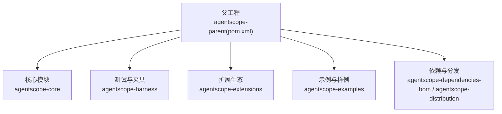
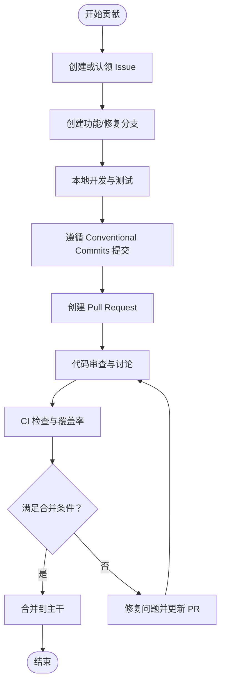
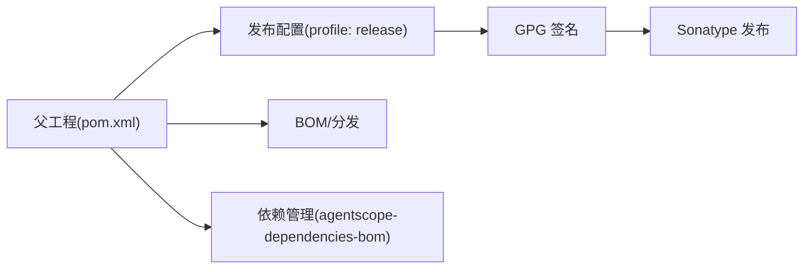

# 贡献流程与协作

<cite>
**本文引用的文件**
- [CONTRIBUTING.md](file://CONTRIBUTING.md)
- [CONTRIBUTING_zh.md](file://CONTRIBUTING_zh.md)
- [.github/PULL_REQUEST_TEMPLATE.md](file://.github/PULL_REQUEST_TEMPLATE.md)
- [README.md](file://README.md)
- [pom.xml](file://pom.xml)
- [.github/dependabot.yaml](file://.github/dependabot.yaml)
- [codecov.yml](file://codecov.yml)
</cite>

## 目录
1. [简介](#简介)
2. [项目结构](#项目结构)
3. [核心组件](#核心组件)
4. [架构总览](#架构总览)
5. [详细组件分析](#详细组件分析)
6. [依赖分析](#依赖分析)
7. [性能考虑](#性能考虑)
8. [故障排查指南](#故障排查指南)
9. [结论](#结论)
10. [附录](#附录)

## 简介
本指南面向AgentScope Java的贡献者，提供从问题发现到PR合并的标准化协作流程，覆盖Issue创建、任务认领、分支管理、PR标准流程、代码审查与CI检查、Conventional Commits提交规范、沟通渠道与社区参与、贡献者协议与知识产权、以及常见协作问题与冲突处理机制。目标是帮助贡献者高效、高质量地参与项目迭代。

## 项目结构
AgentScope Java采用多模块Maven父工程组织，核心模块包括核心能力模块、扩展模块、示例模块、分发与BOM等。父POM统一管理版本、插件与发布配置；根目录提供贡献指南、依赖更新策略与覆盖率配置。

图表来源
- [pom.xml:57-64](file://pom.xml#L57-L64)

章节来源
- [pom.xml:57-64](file://pom.xml#L57-L64)

## 核心组件
- 贡献指南与规范
  - 英文与中文贡献指南明确贡献入口、Issue认领、提交信息格式、代码规范、测试与文档要求、Do’s/Dont’s、帮助渠道等。
- Pull Request模板
  - 统一PR描述、版本信息、检查清单，确保审查效率与质量。
- 依赖自动更新
  - 依赖机器人按周扫描并开启拉取请求，减少安全与兼容风险。
- 覆盖率与CI
  - 覆盖率阈值与CI强制策略，保障变更质量。

章节来源
- [CONTRIBUTING.md:10-145](file://CONTRIBUTING.md#L10-L145)
- [CONTRIBUTING_zh.md:9-144](file://CONTRIBUTING_zh.md#L9-L144)
- [.github/PULL_REQUEST_TEMPLATE.md:1-18](file://.github/PULL_REQUEST_TEMPLATE.md#L1-L18)
- [.github/dependabot.yaml:1-11](file://.github/dependabot.yaml#L1-L11)
- [codecov.yml:15-34](file://codecov.yml#L15-L34)

## 架构总览
协作流程围绕“问题-分支-提交-评审-合并”闭环展开，结合Conventional Commits与CI检查，确保变更可追溯、可审查、可发布。

## 详细组件分析

### 问题发现与任务认领
- 已有计划/问题
  - 若存在相关Open/未分配的Issue，可在Issue下留言表明意向，避免重复劳动并便于协调。
- 新问题
  - 若无对应Issue，先创建Issue描述变更或特性，等待维护者反馈与指导，确保与项目路线图一致。
- 快速定位
  - good first issue与help wanted标签用于区分新手友好与高价值任务。

章节来源
- [CONTRIBUTING.md:14-26](file://CONTRIBUTING.md#L14-L26)
- [CONTRIBUTING_zh.md:13-25](file://CONTRIBUTING_zh.md#L13-L25)
- [README.md:102-104](file://README.md#L102-L104)

### 分支管理策略
- 主分支保护
  - 仓库未提供分支保护规则文件，建议在GitHub仓库侧启用保护分支策略（如禁止直接推送、要求PR审查与CI通过），以保证主干稳定。
- 功能分支命名
  - 建议采用清晰语义的前缀与路径组合，例如：
    - feat/模块/简要描述
    - fix/模块/简要描述
    - docs/模块/简要描述
    - refactor/模块/简要描述
  - 与Conventional Commits类型保持一致，便于自动化与可读性。
- 合并策略
  - 强烈建议使用squash合并保留线性历史，或rebase变基以消除无关提交噪音；merge提交建议开启“Require linear history”。

章节来源
- [CONTRIBUTING.md:28-55](file://CONTRIBUTING.md#L28-L55)
- [CONTRIBUTING_zh.md:27-53](file://CONTRIBUTING_zh.md#L27-L53)

### Pull Request 标准流程
- PR模板字段
  - 版本信息、背景目的、变更内容、测试方法等，确保审查者快速理解上下文。
- 检查清单
  - 代码格式化、测试通过、Javadoc完整、文档同步更新、准备就绪。
- 审查与沟通
  - 保持开放态度，按审查意见迭代；复杂变更建议先行开Issue讨论。

章节来源
- [.github/PULL_REQUEST_TEMPLATE.md:1-18](file://.github/PULL_REQUEST_TEMPLATE.md#L1-L18)
- [CONTRIBUTING.md:112-131](file://CONTRIBUTING.md#L112-L131)
- [CONTRIBUTING_zh.md:110-129](file://CONTRIBUTING_zh.md#L110-L129)

### Conventional Commits 提交规范
- 规范依据
  - 严格遵循Conventional Commits，形成可读性强的提交历史并支持自动生成变更日志。
- 类型与范围
  - 类型涵盖feat、fix、docs、style、refactor、perf、ci、chore等；scope用于限定变更影响范围。
- 示例与检查
  - 提供示例与格式校验命令，建议在IDE中配置自动格式化与提交前检查。

章节来源
- [CONTRIBUTING.md:28-55](file://CONTRIBUTING.md#L28-L55)
- [CONTRIBUTING_zh.md:27-53](file://CONTRIBUTING_zh.md#L27-L53)

### 代码开发与质量门禁
- 代码格式化
  - 使用Spotless进行AOSP风格格式化与导入排序，提交前执行检查与自动修复。
- 单元测试
  - 新增功能需配套测试；提交前确保全部测试通过；可选生成覆盖率报告。
- 文档更新
  - 新功能需更新相关文档与示例，必要时更新README。

章节来源
- [CONTRIBUTING.md:57-96](file://CONTRIBUTING.md#L57-L96)
- [CONTRIBUTING_zh.md:55-94](file://CONTRIBUTING_zh.md#L55-L94)

### CI与覆盖率
- CI检查
  - PR需通过构建、测试与覆盖率检查；失败需及时修复。
- 覆盖率阈值
  - 项目设置覆盖率目标与阈值，示例模块默认忽略，核心模块需达标。
- 依赖更新
  - 依赖机器人按周扫描并开启PR，降低供应链风险。

章节来源
- [codecov.yml:15-34](file://codecov.yml#L15-L34)
- [.github/dependabot.yaml:1-11](file://.github/dependabot.yaml#L1-11)

### 协作沟通与社区参与
- 沟通渠道
  - Discussion用于探讨；Issue用于报告缺陷与需求；维护者联系方式见README。
- 社区参与
  - 优先选择good first issue与help wanted任务入门；复杂改动先开Issue讨论。

章节来源
- [CONTRIBUTING.md:133-139](file://CONTRIBUTING.md#L133-L139)
- [CONTRIBUTING_zh.md:131-137](file://CONTRIBUTING_zh.md#L131-L137)
- [README.md:106-110](file://README.md#L106-L110)

### 贡献者协议与知识产权
- 许可证
  - 项目采用Apache 2.0许可证，贡献即默认同意许可条款。
- 开发者信息
  - 父POM中包含开发者信息与SCM元数据，便于追溯与合规。

章节来源
- [README.md:112-114](file://README.md#L112-L114)
- [pom.xml:80-96](file://pom.xml#L80-L96)

### 常见协作问题与冲突处理
- 大型PR难以审查
  - 建议拆分为小PR，先开Issue讨论再实施。
- 忽略CI失败
  - 必须修复CI失败后再提交审查。
- 混合关注点
  - 保持PR聚焦单一功能或修复，避免同时处理多个不相关问题。
- 破坏性变更
  - 尽可能保持向后兼容；若必须破坏，需在PR中明确说明并评估影响。
- 依赖膨胀
  - 避免引入不必要的依赖，保持核心库轻量化。

章节来源
- [CONTRIBUTING.md:124-131](file://CONTRIBUTING.md#L124-L131)
- [CONTRIBUTING_zh.md:122-129](file://CONTRIBUTING_zh.md#L122-L129)

## 依赖分析
- Maven模块关系
  - 父POM声明核心、夹具、扩展、示例、BOM与分发模块，统一版本与插件配置。
- 发布与签名
  - 通过GPG签名与Sonatype发布配置，配合排除列表控制发布制品范围。
- 依赖更新
  - 依赖机器人按周扫描，限制同时打开的PR数量，平衡更新频率与审查负担。

图表来源
- [pom.xml:346-409](file://pom.xml#L346-L409)
- [pom.xml:133-150](file://pom.xml#L133-L150)

章节来源
- [pom.xml:57-64](file://pom.xml#L57-L64)
- [pom.xml:346-409](file://pom.xml#L346-L409)
- [.github/dependabot.yaml:1-11](file://.github/dependabot.yaml#L1-L11)

## 性能考虑
- 构建与测试
  - 使用现代JDK与优化的Maven插件配置，合理设置JVM内存参数，避免长时间构建卡顿。
- 覆盖率与测试
  - 在保证覆盖率的前提下，优先运行关键模块测试，缩短反馈周期。
- 依赖更新
  - 依赖机器人定期更新可降低长期维护成本，但需控制批量更新带来的回归风险。

## 故障排查指南
- 提交信息不符合规范
  - 使用Conventional Commits格式重写提交，参考示例与类型定义。
- Spotless格式化失败
  - 先执行检查，再应用自动修复，最后重新提交。
- 测试失败
  - 逐个定位失败用例，补充或修正测试；必要时在PR中说明环境差异。
- CI未通过
  - 查看CI日志中的具体失败步骤，修复后重新触发检查。
- 依赖冲突
  - 使用依赖树与BOM管理工具排查，避免版本漂移。

章节来源
- [CONTRIBUTING.md:28-55](file://CONTRIBUTING.md#L28-L55)
- [CONTRIBUTING.md:57-96](file://CONTRIBUTING.md#L57-L96)
- [codecov.yml:15-34](file://codecov.yml#L15-L34)

## 结论
通过标准化的Issue认领、分支命名、PR模板、Conventional Commits与CI门禁，AgentScope Java可以实现高效、透明、可追溯的协作。建议在仓库侧补充分支保护策略与模板化Issue模板，进一步提升协作质量与一致性。

## 附录
- 贡献入口与帮助
  - 贡献指南与中文版、PR模板、依赖更新策略、覆盖率配置均已在根目录提供，贡献者可直接参考。

章节来源
- [README.md:102-104](file://README.md#L102-L104)
- [.github/PULL_REQUEST_TEMPLATE.md:1-18](file://.github/PULL_REQUEST_TEMPLATE.md#L1-L18)
- [.github/dependabot.yaml:1-11](file://.github/dependabot.yaml#L1-L11)
- [codecov.yml:15-34](file://codecov.yml#L15-L34)