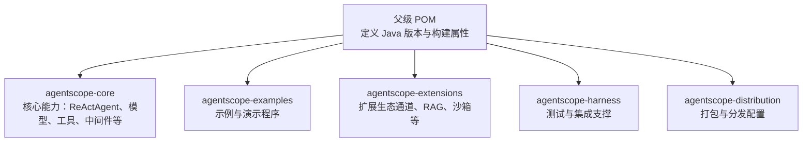
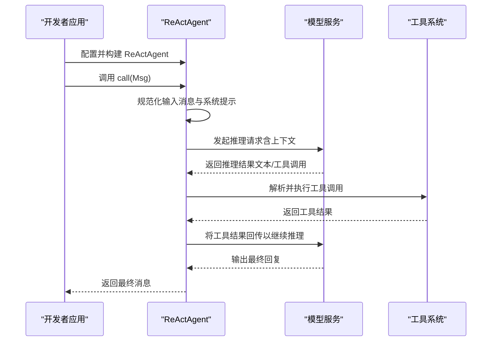
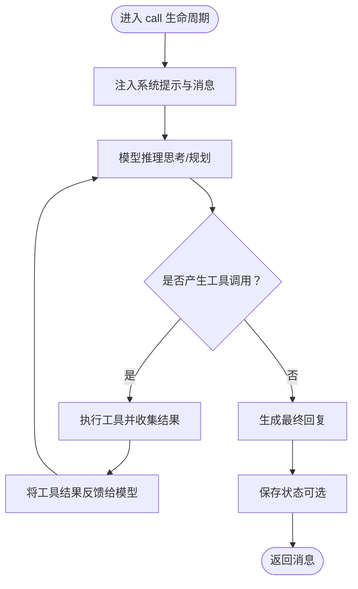
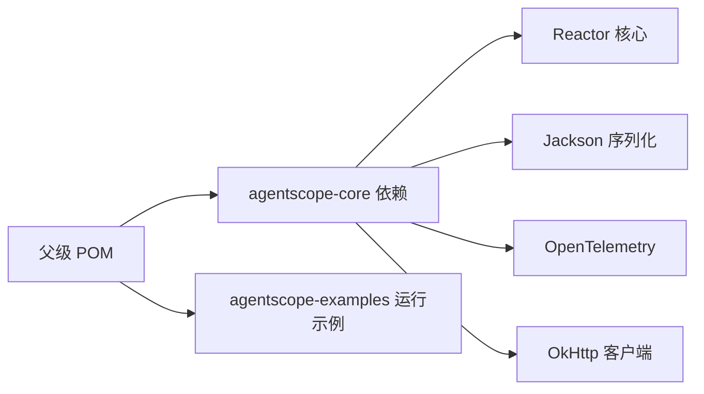

# 快速开始

<cite>
**本文引用的文件**
- [README.md](file://README.md)
- [pom.xml](file://pom.xml)
- [agentscope-core/pom.xml](file://agentscope-core/pom.xml)
- [ReActAgent.java](file://agentscope-core/src/main/java/io/agentscope/core/ReActAgent.java)
- [Version.java](file://agentscope-core/src/main/java/io/agentscope/core/Version.java)
- [agentscope-examples/README.md](file://agentscope-examples/README.md)
</cite>

## 目录
1. [简介](#简介)
2. [项目结构](#项目结构)
3. [核心组件](#核心组件)
4. [架构总览](#架构总览)
5. [详细组件分析](#详细组件分析)
6. [依赖分析](#依赖分析)
7. [性能考虑](#性能考虑)
8. [故障排除指南](#故障排除指南)
9. [结论](#结论)
10. [附录](#附录)

## 简介
本指南面向首次接触 AgentScope Java 的开发者，帮助你在最短时间内完成环境准备、引入依赖、运行第一个 Hello World 示例，并理解关键配置项与常见问题排查方法。你将使用 ReActAgent 创建一个具备推理与工具调用能力的基础智能体，并通过一次对话体验框架的核心特性。

## 项目结构
AgentScope Java 采用多模块 Maven 结构组织，核心能力集中在 agentscope-core 模块中；示例与扩展位于独立模块下。父级 pom 统一管理版本、编译参数与插件配置。

图表来源
- [pom.xml:18-64](file://pom.xml#L18-L64)
- [agentscope-core/pom.xml:22-31](file://agentscope-core/pom.xml#L22-L31)

章节来源
- [pom.xml:18-64](file://pom.xml#L18-L64)
- [agentscope-core/pom.xml:22-31](file://agentscope-core/pom.xml#L22-L31)

## 核心组件
- ReActAgent：遵循 ReAct（推理-行动）范式，支持与模型交互、工具调用、内存与状态持久化、流式事件监听等。
- 模型适配：内置对多家大模型服务的支持（如 DashScope、Anthropic、Google Gemini 等），可通过统一接口接入。
- 工具系统：通过 Toolkit 注册工具，实现自动化的外部能力调用。
- 中间件与钩子：提供生命周期拦截、可观测性与可扩展性。
- 版本与用户代理：统一注入 User-Agent，便于追踪与统计。

章节来源
- [ReActAgent.java:148-198](file://agentscope-core/src/main/java/io/agentscope/core/ReActAgent.java#L148-L198)
- [Version.java:24-45](file://agentscope-core/src/main/java/io/agentscope/core/Version.java#L24-L45)

## 架构总览
下面的时序图展示了从创建 ReActAgent 到发起一次对话请求的完整流程。

图表来源
- [ReActAgent.java:627-637](file://agentscope-core/src/main/java/io/agentscope/core/ReActAgent.java#L627-L637)
- [ReActAgent.java:795-805](file://agentscope-core/src/main/java/io/agentscope/core/ReActAgent.java#L795-L805)

## 详细组件分析

### 安装与环境要求
- JDK 要求：JDK 17 或以上。
- Maven 依赖：引入 agentscope 核心依赖后即可使用 ReActAgent 等能力。
- API 密钥：示例中使用 DashScope 模型需要设置 API Key 环境变量。

章节来源
- [README.md:72-82](file://README.md#L72-L82)
- [README.md:74](file://README.md#L74)
- [agentscope-examples/README.md:7-11](file://agentscope-examples/README.md#L7-L11)

### 最简单的 Hello World 示例
以下为最小可用示例的步骤说明（请按顺序执行）：

1) 在你的 Maven 工程中添加依赖（参考父级 POM 的依赖管理与版本信息）。
2) 准备模型配置：以 DashScope 为例，设置 API Key 并选择模型名称。
3) 构建 ReActAgent：指定名称、系统提示与模型。
4) 发起一次对话：构造一条用户消息并调用 agent 的 call 方法。
5) 打印响应文本并结束。

提示：示例工程提供了可直接运行的命令与交互方式，便于验证环境是否正确。

章节来源
- [README.md:84-98](file://README.md#L84-L98)
- [agentscope-examples/README.md:13-23](file://agentscope-examples/README.md#L13-L23)
- [agentscope-examples/README.md:324-328](file://agentscope-examples/README.md#L324-L328)

### 常见配置选项与参数说明
- ReActAgent 构建器关键参数
  - 名称与描述：用于标识与日志输出。
  - 系统提示（sysPrompt）：定义角色与行为约束。
  - 模型（Model）：接入不同大模型服务的统一入口。
  - 工具包（Toolkit）：注册业务工具，支持自动调用。
  - 最大迭代次数（maxIters）：限制推理-行动循环次数。
  - 执行配置（modelExecutionConfig/toolExecutionConfig）：控制重试与超时策略。
  - 生成选项（generateOptions）：控制输出格式与结构化能力。
  - 运行时上下文（RuntimeContext）：会话、用户标识与工具执行上下文。
- 模型与工具
  - 模型注册与切换：通过 ModelRegistry 或具体模型实现类进行配置。
  - 工具注册：使用 Toolkit 注册对象或函数式工具，支持参数校验与结果转换。
- 中间件与钩子
  - 中间件链：在推理与行动前后插入自定义逻辑。
  - 钩子系统：捕获事件流，实现监控、审计与调试。

章节来源
- [ReActAgent.java:288-330](file://agentscope-core/src/main/java/io/agentscope/core/ReActAgent.java#L288-L330)
- [ReActAgent.java:482-493](file://agentscope-core/src/main/java/io/agentscope/core/ReActAgent.java#L482-L493)
- [ReActAgent.java:627-637](file://agentscope-core/src/main/java/io/agentscope/core/ReActAgent.java#L627-L637)

### 数据流与处理逻辑
ReActAgent 的核心流程由“推理-行动”循环构成，结合工具调用与状态持久化，形成闭环的数据处理链路。

图表来源
- [ReActAgent.java:511-536](file://agentscope-core/src/main/java/io/agentscope/core/ReActAgent.java#L511-L536)
- [ReActAgent.java:795-805](file://agentscope-core/src/main/java/io/agentscope/core/ReActAgent.java#L795-L805)

## 依赖分析
- 父级 POM 统一声明 Java 版本（17）、编译插件与测试框架。
- agentscope-core 模块引入 Reactor、Jackson、OpenTelemetry、OkHttp 等核心依赖，支撑非阻塞执行、序列化、可观测性与网络通信。
- 示例模块提供运行命令与 API Key 配置指引，便于快速验证。

图表来源
- [pom.xml:29-55](file://pom.xml#L29-L55)
- [agentscope-core/pom.xml:51-231](file://agentscope-core/pom.xml#L51-L231)

章节来源
- [pom.xml:29-55](file://pom.xml#L29-L55)
- [agentscope-core/pom.xml:51-231](file://agentscope-core/pom.xml#L51-L231)

## 性能考虑
- 非阻塞执行：基于 Project Reactor 的 Flux/Mono 提供异步与背压支持，适合高并发场景。
- 冷启动优化：支持 GraalVM 原生镜像，缩短冷启动时间，适用于无服务器与弹性扩缩容环境。
- 可观测性：原生集成 OpenTelemetry，便于分布式追踪与性能分析。

章节来源
- [README.md:66](file://README.md#L66)
- [README.md:70](file://README.md#L70)

## 故障排除指南
- 环境变量缺失
  - 症状：示例提示找不到 API Key。
  - 处理：设置环境变量或按示例交互式输入。
- 编译失败
  - 症状：找不到 agentscope 核心类。
  - 处理：先在根目录执行安装命令，确保本地仓库包含核心模块。
- MCP 服务器连接失败
  - 症状：MCP 示例无法连接外部工具服务器。
  - 处理：安装对应 MCP 服务器（如文件系统或 Git 服务器）后再运行示例。
- 日志与调试
  - 建议：通过示例提供的调试参数开启更详细的日志输出，定位问题。

章节来源
- [agentscope-examples/README.md:357-386](file://agentscope-examples/README.md#L357-L386)

## 结论
通过本指南，你已完成了 AgentScope Java 的环境准备、依赖引入与首个 Hello World 对话示例。建议进一步探索示例模块中的工具调用、结构化输出、会话持久化与中断机制等高级主题，逐步掌握框架的全貌与最佳实践。

## 附录
- 快速命令参考
  - 运行示例：使用示例模块提供的 mvn exec 命令直接启动。
  - 设置 API Key：导出环境变量或按提示交互输入。
- 版本与用户代理
  - 框架会在模型请求中统一注入 User-Agent，便于识别客户端版本与平台信息。

章节来源
- [agentscope-examples/README.md:324-356](file://agentscope-examples/README.md#L324-L356)
- [Version.java:33-44](file://agentscope-core/src/main/java/io/agentscope/core/Version.java#L33-L44)