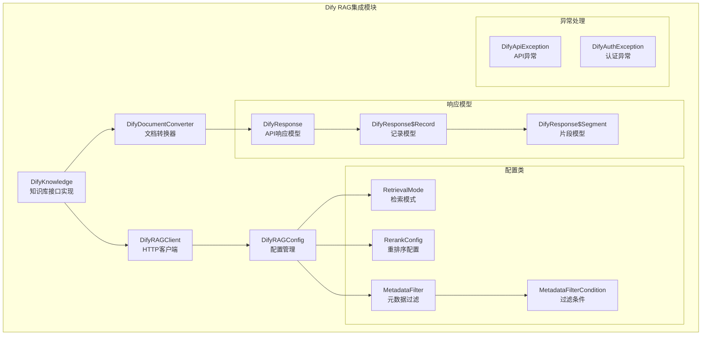
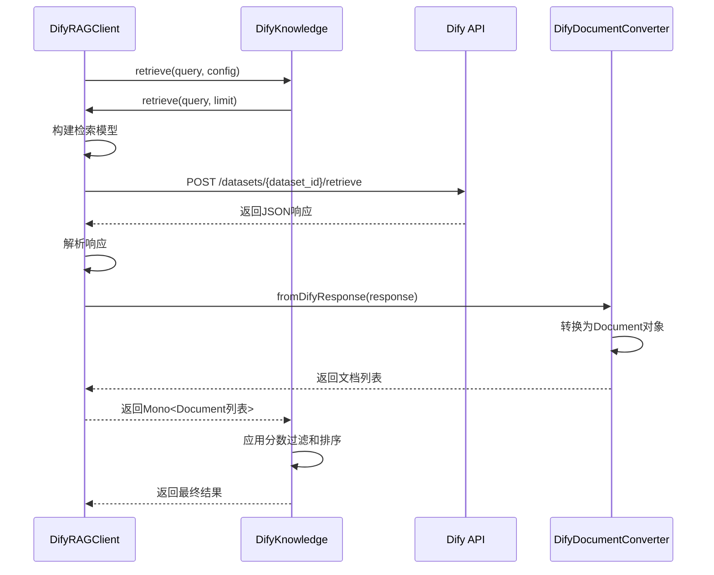
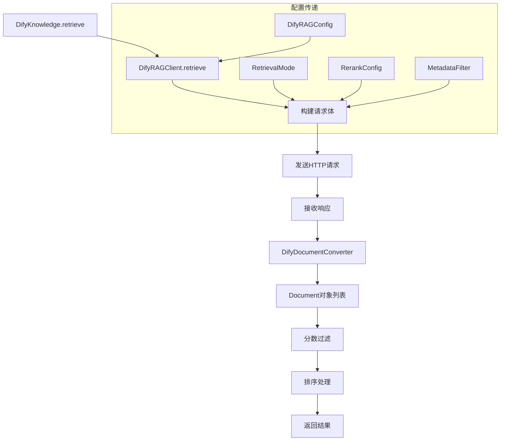
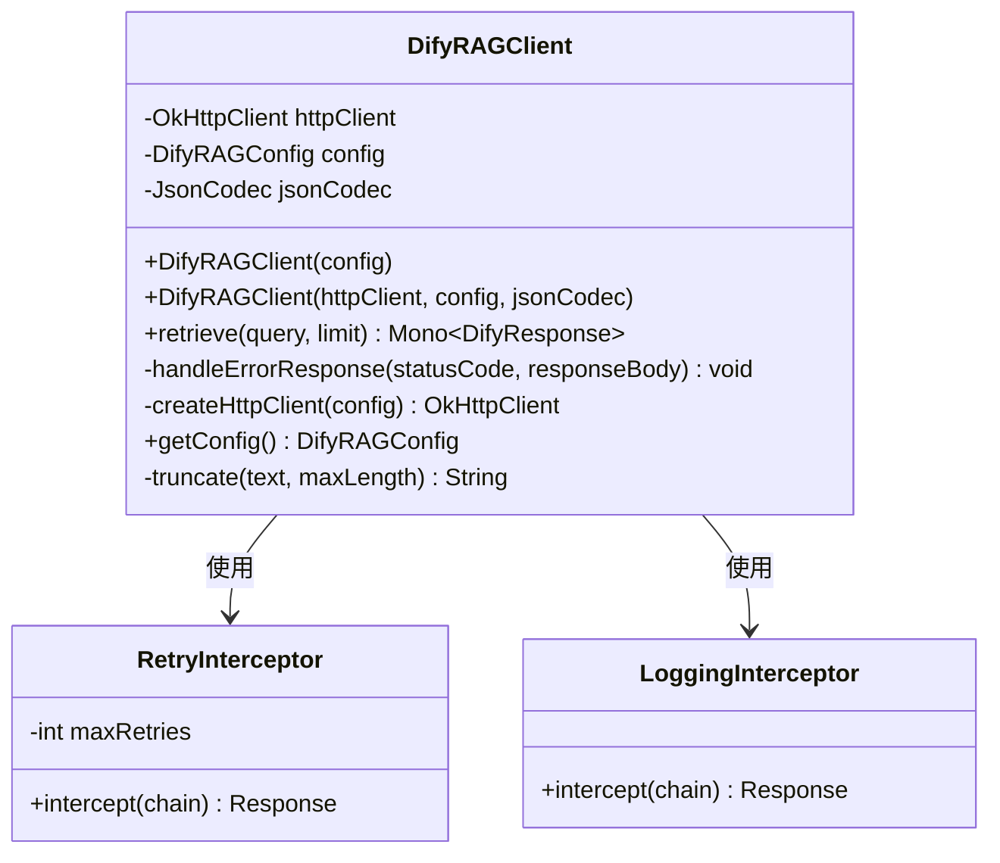
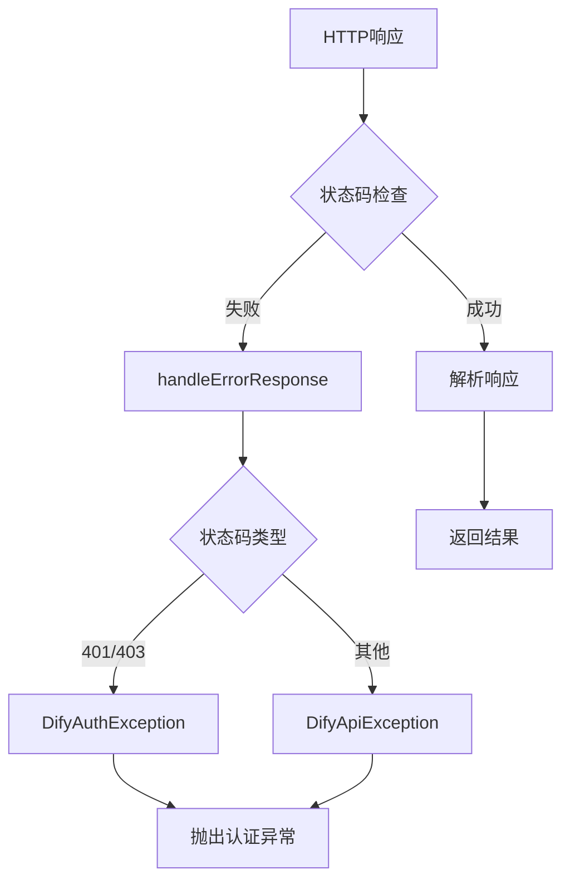
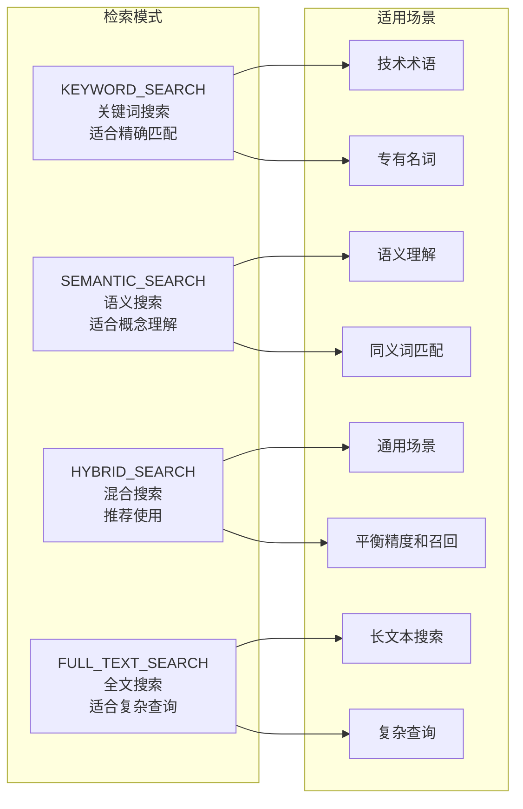
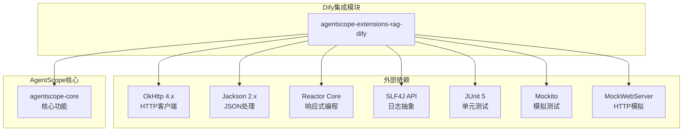
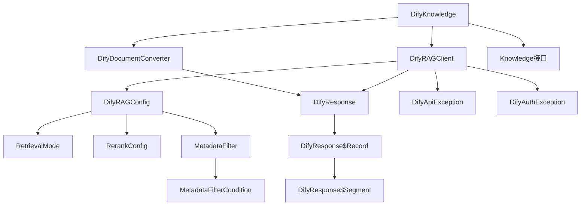

# Dify RAG集成

<cite>
**本文档引用的文件**
- [DifyRAGClient.java](file://agentscope-extensions/agentscope-extensions-rag/agentscope-extensions-rag-dify/src/main/java/io/agentscope/core/rag/integration/dify/DifyRAGClient.java)
- [DifyRAGConfig.java](file://agentscope-extensions/agentscope-extensions-rag/agentscope-extensions-rag-dify/src/main/java/io/agentscope/core/rag/integration/dify/DifyRAGConfig.java)
- [DifyKnowledge.java](file://agentscope-extensions/agentscope-extensions-rag/agentscope-extensions-rag-dify/src/main/java/io/agentscope/core/rag/integration/dify/DifyKnowledge.java)
- [MetadataFilter.java](file://agentscope-extensions/agentscope-extensions-rag/agentscope-extensions-rag-dify/src/main/java/io/agentscope/core/rag/integration/dify/MetadataFilter.java)
- [MetadataFilterCondition.java](file://agentscope-extensions/agentscope-extensions-rag/agentscope-extensions-rag-dify/src/main/java/io/agentscope/core/rag/integration/dify/MetadataFilterCondition.java)
- [RerankConfig.java](file://agentscope-extensions/agentscope-extensions-rag/agentscope-extensions-rag-dify/src/main/java/io/agentscope/core/rag/integration/dify/RerankConfig.java)
- [RetrievalMode.java](file://agentscope-extensions/agentscope-extensions-rag/agentscope-extensions-rag-dify/src/main/java/io/agentscope/core/rag/integration/dify/RetrievalMode.java)
- [DifyDocumentConverter.java](file://agentscope-extensions/agentscope-extensions-rag/agentscope-extensions-rag-dify/src/main/java/io/agentscope/core/rag/integration/dify/DifyDocumentConverter.java)
- [DifyResponse.java](file://agentscope-extensions/agentscope-extensions-rag/agentscope-extensions-rag-dify/src/main/java/io/agentscope/core/rag/integration/dify/model/DifyResponse.java)
- [DifyApiException.java](file://agentscope-extensions/agentscope-extensions-rag/agentscope-extensions-rag-dify/src/main/java/io/agentscope/core/rag/integration/dify/exception/DifyApiException.java)
- [DifyAuthException.java](file://agentscope-extensions/agentscope-extensions-rag/agentscope-extensions-rag-dify/src/main/java/io/agentscope/core/rag/integration/dify/exception/DifyAuthException.java)
- [pom.xml](file://agentscope-extensions/agentscope-extensions-rag/agentscope-extensions-rag-dify/pom.xml)
- [dify.md](file://docs/v2/zh/integration/rag/dify.md)
- [DifyRAGClientTest.java](file://agentscope-extensions/agentscope-extensions-rag/agentscope-extensions-rag-dify/src/test/java/io/agentscope/core/rag/integration/dify/DifyRAGClientTest.java)
</cite>

## 目录
1. [简介](#简介)
2. [项目结构](#项目结构)
3. [核心组件](#核心组件)
4. [架构概览](#架构概览)
5. [详细组件分析](#详细组件分析)
6. [依赖关系分析](#依赖关系分析)
7. [性能考虑](#性能考虑)
8. [故障排除指南](#故障排除指南)
9. [结论](#结论)
10. [附录](#附录)

## 简介

AgentScope Java与Dify RAG服务的集成提供了完整的检索增强生成(RAG)解决方案，专门针对Dify知识库服务进行优化。该集成实现了从Dify API的完整数据获取到AgentScope内部文档对象的转换，支持多种检索模式、元数据过滤和重排序功能。

本集成主要包含以下关键特性：
- 多种检索模式支持：关键词搜索、语义搜索、混合搜索和全文搜索
- 高级检索配置：重排序、分数阈值过滤、元数据过滤
- 响应式编程模型：基于Reactor的异步处理
- 完整的错误处理机制：认证错误、API错误和网络异常
- 自托管Dify支持：支持云版和自托管版本的Dify实例

## 项目结构



**图表来源**
- [DifyRAGClient.java:1-462](file://agentscope-extensions/agentscope-extensions-rag/agentscope-extensions-rag-dify/src/main/java/io/agentscope/core/rag/integration/dify/DifyRAGClient.java#L1-L462)
- [DifyKnowledge.java:1-316](file://agentscope-extensions/agentscope-extensions-rag/agentscope-extensions-rag-dify/src/main/java/io/agentscope/core/rag/integration/dify/DifyKnowledge.java#L1-L316)

**章节来源**
- [pom.xml:1-98](file://agentscope-extensions/agentscope-extensions-rag/agentscope-extensions-rag-dify/pom.xml#L1-L98)
- [dify.md:1-102](file://docs/v2/zh/integration/rag/dify.md#L1-L102)

## 核心组件

### DifyRAGClient - 主要客户端

DifyRAGClient是整个集成的核心HTTP客户端，负责与Dify知识库API进行通信。它封装了OkHttp客户端并提供了响应式的API方法。

**主要功能**：
- HTTP请求构建和发送
- 认证头管理（Bearer Token）
- 错误响应处理
- 响应解析和转换
- 重试机制和超时配置

**关键特性**：
- 支持指数退避重试（最多3次重试）
- 调试模式下的HTTP日志记录
- 线程安全的OkHttp客户端配置
- 完整的请求体构建逻辑

### DifyKnowledge - 知识库接口实现

DifyKnowledge实现了AgentScope的Knowledge接口，为AgentScope系统提供统一的知识库访问能力。

**核心职责**：
- 实现Knowledge接口的retrieve方法
- 文档管理操作（当前不支持）
- 与DifyRAGClient的集成
- 结果后处理和过滤

**设计特点**：
- Builder模式构建，支持配置和客户端两种方式
- 与AgentScope文档系统的无缝集成
- 支持查询历史和上下文感知检索

### DifyRAGConfig - 配置管理

DifyRAGConfig提供了完整的Dify集成配置管理，包含了所有必要的连接参数和检索配置。

**配置分类**：
- **连接配置**：API密钥、基础URL、数据集ID
- **检索配置**：检索模式、Top-K数量、分数阈值
- **重排序配置**：启用开关、提供者名称、模型名称
- **高级配置**：连接超时、读取超时、最大重试次数、自定义头部

**默认值设置**：
- 默认API基础URL：https://api.dify.ai/v1
- 默认检索模式：HYBRID_SEARCH（混合搜索）
- 默认Top-K：10
- 默认分数阈值：0.0
- 默认连接超时：30秒
- 默认读取超时：60秒
- 默认最大重试：3次

**章节来源**
- [DifyRAGClient.java:62-109](file://agentscope-extensions/agentscope-extensions-rag/agentscope-extensions-rag-dify/src/main/java/io/agentscope/core/rag/integration/dify/DifyRAGClient.java#L62-L109)
- [DifyKnowledge.java:84-106](file://agentscope-extensions/agentscope-extensions-rag/agentscope-extensions-rag-dify/src/main/java/io/agentscope/core/rag/integration/dify/DifyKnowledge.java#L84-L106)
- [DifyRAGConfig.java:47-128](file://agentscope-extensions/agentscope-extensions-rag/agentscope-extensions-rag-dify/src/main/java/io/agentscope/core/rag/integration/dify/DifyRAGConfig.java#L47-L128)

## 架构概览



**图表来源**
- [DifyKnowledge.java:164-206](file://agentscope-extensions/agentscope-extensions-rag/agentscope-extensions-rag-dify/src/main/java/io/agentscope/core/rag/integration/dify/DifyKnowledge.java#L164-L206)
- [DifyRAGClient.java:124-274](file://agentscope-extensions/agentscope-extensions-rag/agentscope-extensions-rag-dify/src/main/java/io/agentscope/core/rag/integration/dify/DifyRAGClient.java#L124-L274)
- [DifyDocumentConverter.java:78-104](file://agentscope-extensions/agentscope-extensions-rag/agentscope-extensions-rag-dify/src/main/java/io/agentscope/core/rag/integration/dify/DifyDocumentConverter.java#L78-L104)

### 工作流编排

系统采用响应式编程模型，通过Reactor框架实现非阻塞的数据流处理：

1. **请求接收**：DifyKnowledge接收查询请求和检索配置
2. **参数验证**：验证查询文本和配置参数的有效性
3. **客户端调用**：委托给DifyRAGClient执行实际的API调用
4. **HTTP请求构建**：构建符合Dify API规范的请求体
5. **异步处理**：使用Mono包装异步响应处理
6. **数据转换**：将Dify响应转换为AgentScope内部文档格式
7. **结果过滤**：应用分数阈值和限制条件
8. **排序输出**：按相似度分数降序排列

### 节点连接和数据传递机制



**图表来源**
- [DifyKnowledge.java:164-206](file://agentscope-extensions/agentscope-extensions-rag/agentscope-extensions-rag-dify/src/main/java/io/agentscope/core/rag/integration/dify/DifyKnowledge.java#L164-L206)
- [DifyRAGClient.java:124-274](file://agentscope-extensions/agentscope-extensions-rag/agentscope-extensions-rag-dify/src/main/java/io/agentscope/core/rag/integration/dify/DifyRAGClient.java#L124-L274)
- [DifyDocumentConverter.java:78-104](file://agentscope-extensions/agentscope-extensions-rag/agentscope-extensions-rag-dify/src/main/java/io/agentscope/core/rag/integration/dify/DifyDocumentConverter.java#L78-L104)

## 详细组件分析

### DifyRAGClient 详细分析

#### 类结构图



**图表来源**
- [DifyRAGClient.java:57-462](file://agentscope-extensions/agentscope-extensions-rag/agentscope-extensions-rag-dify/src/main/java/io/agentscope/core/rag/integration/dify/DifyRAGClient.java#L57-L462)

#### 请求构建流程

DifyRAGClient在retrieve方法中构建完整的检索请求：

1. **查询参数验证**：确保查询文本非空
2. **检索模型构建**：
   - 设置检索方法（keyword/semantic/hybrid/fulltext）
   - 配置Top-K数量
   - 设置分数阈值（可选）
   - 配置重排序（可选）
   - 添加元数据过滤条件（可选）
3. **请求体构造**：将查询文本和检索模型组合
4. **HTTP头部设置**：添加认证头和内容类型
5. **请求发送**：使用OkHttp客户端执行请求

#### 错误处理机制

系统实现了多层次的错误处理：



**图表来源**
- [DifyRAGClient.java:283-312](file://agentscope-extensions/agentscope-extensions-rag/agentscope-extensions-rag-dify/src/main/java/io/agentscope/core/rag/integration/dify/DifyRAGClient.java#L283-L312)

**章节来源**
- [DifyRAGClient.java:124-274](file://agentscope-extensions/agentscope-extensions-rag/agentscope-extensions-rag-dify/src/main/java/io/agentscope/core/rag/integration/dify/DifyRAGClient.java#L124-L274)
- [DifyRAGClient.java:283-312](file://agentscope-extensions/agentscope-extensions-rag/agentscope-extensions-rag-dify/src/main/java/io/agentscope/core/rag/integration/dify/DifyRAGClient.java#L283-L312)

### DifyRAGConfig 配置系统

#### 配置参数详解

| 配置类别 | 参数名 | 类型 | 默认值 | 描述 |
|---------|--------|------|--------|------|
| 连接配置 | apiKey | String | 必填 | Dify数据集API密钥 |
| 连接配置 | apiBaseUrl | String | https://api.dify.ai/v1 | Dify API基础URL |
| 连接配置 | datasetId | String | 必填 | 知识库数据集ID |
| 检索配置 | retrievalMode | RetrievalMode | HYBRID_SEARCH | 检索模式 |
| 检索配置 | topK | Integer | 10 | 返回文档数量 |
| 检索配置 | scoreThreshold | Double | 0.0 | 分数阈值 |
| 重排序配置 | enableRerank | Boolean | false | 是否启用重排序 |
| 重排序配置 | rerankConfig | RerankConfig | null | 重排序配置 |
| 高级配置 | connectTimeout | Duration | 30s | 连接超时时间 |
| 高级配置 | readTimeout | Duration | 60s | 读取超时时间 |
| 高级配置 | maxRetries | Integer | 3 | 最大重试次数 |
| 高级配置 | customHeaders | Map<String,String> | 空 | 自定义HTTP头部 |

#### 配置验证规则

系统对配置参数进行了严格的验证：

- API密钥和数据集ID必须非空
- Top-K必须大于等于1
- 分数阈值必须在0.0-1.0范围内
- 权重值必须在0.0-1.0范围内
- 最大重试次数不能为负数

**章节来源**
- [DifyRAGConfig.java:83-128](file://agentscope-extensions/agentscope-extensions-rag/agentscope-extensions-rag-dify/src/main/java/io/agentscope/core/rag/integration/dify/DifyRAGConfig.java#L83-L128)
- [DifyRAGConfig.java:376-400](file://agentscope-extensions/agentscope-extensions-rag/agentscope-extensions-rag-dify/src/main/java/io/agentscope/core/rag/integration/dify/DifyRAGConfig.java#L376-L400)

### 检索增强配置详解

#### 重排序配置 (RerankConfig)

重排序功能通过专用的重排序模型对初始检索结果进行重新评分和排序：

**配置选项**：
- **providerName**：重排序提供者名称（如"cohere"、"jina"、"local"）
- **modelName**：重排序模型名称（如"rerank-english-v2.0"）

**支持的提供者和模型**：
- Cohere：rerank-english-v2.0、rerank-multilingual-v2.0
- Jina：jina-reranker-v1-base-en
- 本地模型：bge-reranker-base、bge-reranker-large

#### 元数据过滤器 (MetadataFilter)

元数据过滤器允许根据文档的元数据字段进行精确过滤：

**过滤条件**：
- **name**：元数据字段名称
- **comparisonOperator**：比较操作符（equals、contains、not_equals等）
- **value**：比较值

**逻辑运算符**：
- AND：所有条件都必须满足
- OR：任一条件满足即可

**支持的操作符**：
- equals：完全相等
- not_equals：不相等
- contains：包含子字符串
- not_contains：不包含子字符串
- starts_with：以指定前缀开始
- ends_with：以指定后缀结束

**章节来源**
- [RerankConfig.java:38-148](file://agentscope-extensions/agentscope-extensions-rag/agentscope-extensions-rag-dify/src/main/java/io/agentscope/core/rag/integration/dify/RerankConfig.java#L38-L148)
- [MetadataFilter.java:44-152](file://agentscope-extensions/agentscope-extensions-rag/agentscope-extensions-rag-dify/src/main/java/io/agentscope/core/rag/integration/dify/MetadataFilter.java#L44-L152)
- [MetadataFilterCondition.java:32-158](file://agentscope-extensions/agentscope-extensions-rag/agentscope-extensions-rag-dify/src/main/java/io/agentscope/core/rag/integration/dify/MetadataFilterCondition.java#L32-L158)

### 检索模式分析

系统支持四种不同的检索模式，每种模式都有其特定的应用场景：



**图表来源**
- [RetrievalMode.java:36-119](file://agentscope-extensions/agentscope-extensions-rag/agentscope-extensions-rag-dify/src/main/java/io/agentscope/core/rag/integration/dify/RetrievalMode.java#L36-L119)

#### 模式对比

| 检索模式 | 优点 | 缺点 | 适用场景 |
|---------|------|------|----------|
| KEYWORD_SEARCH | 响应速度快、精确匹配 | 无法理解语义、同义词处理差 | 技术术语、专有名词 |
| SEMANTIC_SEARCH | 语义理解能力强 | 需要向量嵌入、计算开销大 | 概念查询、问答系统 |
| HYBRID_SEARCH | 平衡性能和准确性 | 配置复杂、成本较高 | 一般应用场景 |
| FULL_TEXT_SEARCH | 适合复杂查询 | 精确度相对较低 | 长文本内容检索 |

**章节来源**
- [RetrievalMode.java:36-119](file://agentscope-extensions/agentscope-extensions-rag/agentscope-extensions-rag-dify/src/main/java/io/agentscope/core/rag/integration/dify/RetrievalMode.java#L36-L119)

### 文档转换器 (DifyDocumentConverter)

DifyDocumentConverter负责将Dify API的响应转换为AgentScope内部的Document对象：

**转换流程**：
1. **响应验证**：检查DifyResponse的有效性
2. **记录遍历**：逐个处理每个检索记录
3. **字段提取**：从Segment对象中提取必要信息
4. **元数据构建**：构建DocumentMetadata对象
5. **文档创建**：创建Document对象并设置相似度分数

**元数据映射**：
- 文档ID：优先使用document_id，回退到segment id
- 文档名称：从嵌套的document对象获取
- 片段ID：使用segment id
- 内容：从content字段获取
- 相似度：从score字段获取

**章节来源**
- [DifyDocumentConverter.java:78-183](file://agentscope-extensions/agentscope-extensions-rag/agentscope-extensions-rag-dify/src/main/java/io/agentscope/core/rag/integration/dify/DifyDocumentConverter.java#L78-L183)

## 依赖关系分析

### 外部依赖



**图表来源**
- [pom.xml:34-96](file://agentscope-extensions/agentscope-extensions-rag/agentscope-extensions-rag-dify/pom.xml#L34-L96)

### 内部依赖关系



**图表来源**
- [DifyRAGClient.java:18-37](file://agentscope-extensions/agentscope-extensions-rag/agentscope-extensions-rag-dify/src/main/java/io/agentscope/core/rag/integration/dify/DifyRAGClient.java#L18-L37)
- [DifyKnowledge.java:18-26](file://agentscope-extensions/agentscope-extensions-rag/agentscope-extensions-rag-dify/src/main/java/io/agentscope/core/rag/integration/dify/DifyKnowledge.java#L18-L26)

**章节来源**
- [pom.xml:34-96](file://agentscope-extensions/agentscope-extensions-rag/agentscope-extensions-rag-dify/pom.xml#L34-L96)

## 性能考虑

### 网络性能优化

1. **连接池管理**：OkHttp自动管理连接池，减少连接建立开销
2. **重试机制**：实现指数退避重试，避免雪崩效应
3. **超时配置**：合理的连接和读取超时设置
4. **压缩支持**：HTTP压缩减少传输数据量

### 内存使用优化

1. **流式处理**：使用Reactor进行流式数据处理
2. **延迟加载**：文档内容按需加载
3. **对象复用**：合理复用OkHttp客户端实例
4. **内存监控**：避免大对象的频繁创建

### 缓存策略

虽然当前实现没有内置缓存，但可以考虑以下优化：

1. **查询结果缓存**：对相同查询结果进行短期缓存
2. **元数据缓存**：缓存常用的元数据信息
3. **令牌缓存**：缓存认证令牌（如果支持）

### 监控和指标

1. **请求计数**：统计成功和失败的请求数量
2. **响应时间**：监控API响应时间分布
3. **错误率**：跟踪不同类型的错误发生频率
4. **资源使用**：监控内存和CPU使用情况

## 故障排除指南

### 常见问题诊断

#### 认证失败 (401/403)

**症状**：
- DifyAuthException异常
- 提示API密钥无效或权限不足

**排查步骤**：
1. 验证API密钥格式是否正确
2. 检查数据集ID是否有效
3. 确认API密钥具有足够的权限
4. 验证Dify账户状态

#### 网络连接问题

**症状**：
- SocketTimeoutException或ConnectTimeoutException
- 请求超时或连接被拒绝

**排查步骤**：
1. 检查网络连通性
2. 验证API基础URL配置
3. 确认防火墙设置
4. 测试代理服务器配置

#### API错误 (4xx/5xx)

**症状**：
- DifyApiException异常
- 具体的错误消息和状态码

**排查步骤**：
1. 检查请求参数格式
2. 验证检索配置的有效性
3. 查看Dify控制台的错误日志
4. 确认Dify服务状态

### 调试技巧

#### 启用详细日志

```java
// 设置日志级别为DEBUG
LoggerFactory.getLogger("io.agentscope.core.rag.integration.dify").setLevel(Level.DEBUG);
```

#### 请求追踪

1. **HTTP拦截器**：使用LoggingInterceptor记录完整的请求和响应
2. **参数验证**：在关键位置添加参数验证日志
3. **性能监控**：记录关键操作的执行时间

#### 单元测试最佳实践

```java
@Test
public void testDifyIntegration() {
    // 使用MockWebServer模拟Dify API
    MockWebServer server = new MockWebServer();
    server.enqueue(createSuccessResponse());
    
    // 配置客户端使用模拟服务器
    DifyRAGConfig config = DifyRAGConfig.builder()
        .apiKey("test-key")
        .apiBaseUrl(server.url("/v1").toString())
        .datasetId("test-dataset")
        .build();
        
    // 执行测试并验证结果
}
```

**章节来源**
- [DifyRAGClientTest.java:42-587](file://agentscope-extensions/agentscope-extensions-rag/agentscope-extensions-rag-dify/src/test/java/io/agentscope/core/rag/integration/dify/DifyRAGClientTest.java#L42-L587)
- [DifyApiException.java:34-159](file://agentscope-extensions/agentscope-extensions-rag/agentscope-extensions-rag-dify/src/main/java/io/agentscope/core/rag/integration/dify/exception/DifyApiException.java#L34-L159)
- [DifyAuthException.java:40-78](file://agentscope-extensions/agentscope-extensions-rag/agentscope-extensions-rag-dify/src/main/java/io/agentscope/core/rag/integration/dify/exception/DifyAuthException.java#L40-L78)

## 结论

AgentScope Java与Dify RAG服务的集成提供了一个功能完整、性能优异的检索增强生成解决方案。该集成的主要优势包括：

**技术优势**：
- 完整的Dify API支持，涵盖所有核心功能
- 响应式编程模型，提供优秀的并发性能
- 丰富的配置选项，满足各种使用场景
- 完善的错误处理和监控机制

**架构优势**：
- 清晰的分层设计，便于维护和扩展
- 灵活的配置系统，支持多种部署环境
- 标准化的接口设计，易于与其他组件集成

**使用建议**：
1. 根据具体需求选择合适的检索模式
2. 合理配置重排序和过滤参数
3. 建立完善的监控和日志体系
4. 制定合理的缓存策略
5. 定期评估和优化性能表现

该集成为企业级应用提供了可靠的RAG能力，能够有效提升智能问答和内容检索的准确性和效率。

## 附录

### API调用示例

#### 基础检索示例

```java
// 创建Dify配置
DifyRAGConfig config = DifyRAGConfig.builder()
    .apiKey(System.getenv("DIFY_RAG_API_KEY"))
    .datasetId("your-dataset-id")
    .retrievalMode(RetrievalMode.HYBRID_SEARCH)
    .enableRerank(true)
    .build();

// 创建知识库实例
DifyKnowledge knowledge = DifyKnowledge.builder()
    .config(config)
    .build();

// 执行检索
List<Document> results = knowledge.retrieve(
    "查询文本",
    RetrieveConfig.builder()
        .limit(5)
        .scoreThreshold(0.5)
        .build()
).block();
```

#### 高级配置示例

```java
// 配置元数据过滤
MetadataFilter metadataFilter = MetadataFilter.builder()
    .logicalOperator("and")
    .addCondition(MetadataFilterCondition.builder()
        .name("category")
        .comparisonOperator("equals")
        .value("technical")
        .build())
    .build();

// 配置重排序
RerankConfig rerankConfig = RerankConfig.builder()
    .providerName("cohere")
    .modelName("rerank-english-v2.0")
    .build();

// 组合高级配置
DifyRAGConfig advancedConfig = DifyRAGConfig.builder()
    .apiKey(apiKey)
    .datasetId(datasetId)
    .retrievalMode(RetrievalMode.HYBRID_SEARCH)
    .metadataFilter(metadataFilter)
    .enableRerank(true)
    .rerankConfig(rerankConfig)
    .build();
```

### 部署配置

#### Maven依赖

```xml
<dependency>
    <groupId>io.agentscope</groupId>
    <artifactId>agentscope-extensions-rag-dify</artifactId>
    <version>${agentscope.version}</version>
</dependency>
```

#### 环境变量配置

```bash
export DIFY_RAG_API_KEY="dataset-xxxxxxxxxxxxxxxx"
export DIFY_RAG_DATASET_ID="your-dataset-id"
export DIFY_RAG_BASE_URL="https://api.dify.ai/v1"
```

### 性能基准测试

建议在生产环境中进行以下性能测试：

1. **响应时间测试**：测量不同查询类型的平均响应时间
2. **并发性能测试**：评估高并发场景下的系统表现
3. **内存使用测试**：监控长时间运行的内存泄漏
4. **错误恢复测试**：验证系统在异常情况下的恢复能力