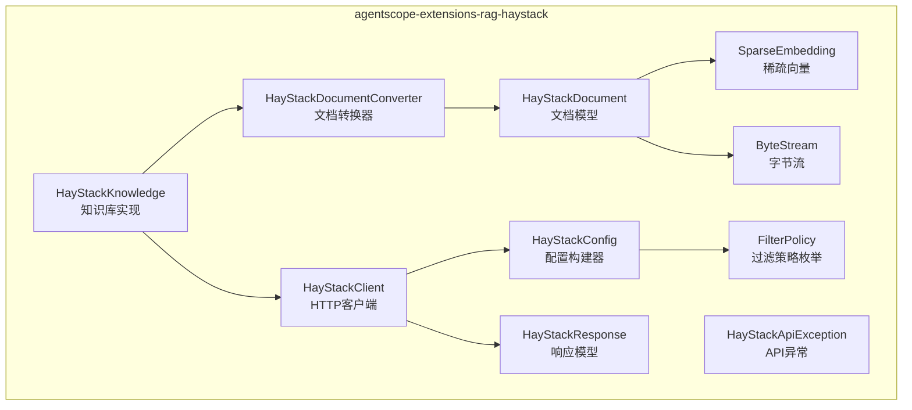
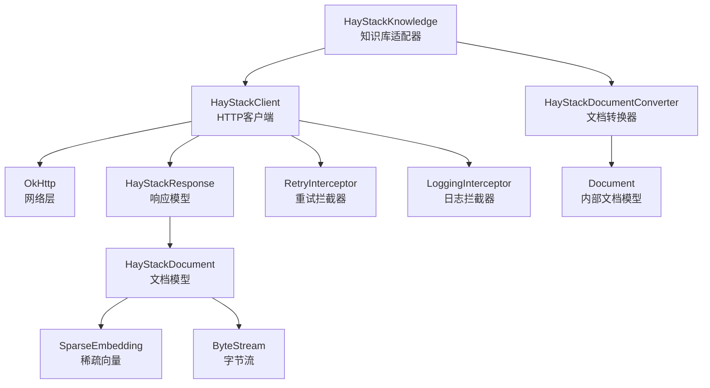
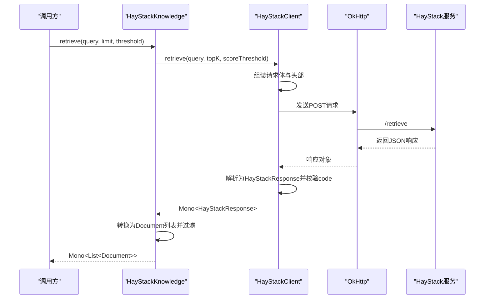
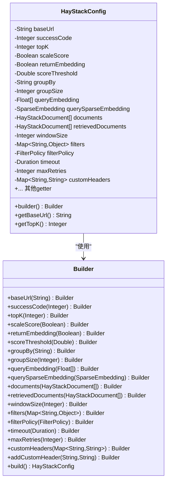
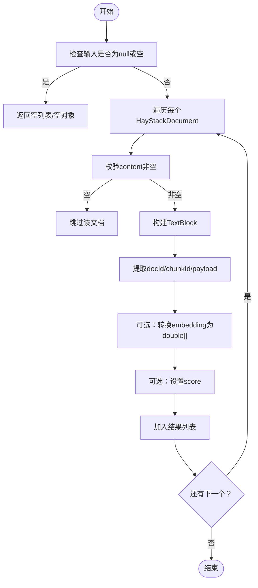
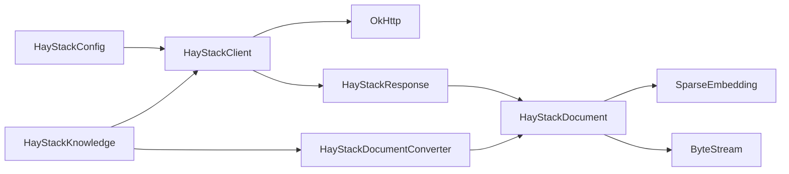

# Haystack RAG集成

<cite>
**本文档引用的文件**   
- [HayStackClient.java](file://agentscope-extensions/agentscope-extensions-rag/agentscope-extensions-rag-haystack/src/main/java/io/agentscope/core/rag/integration/haystack/HayStackClient.java)
- [HayStackConfig.java](file://agentscope-extensions/agentscope-extensions-rag/agentscope-extensions-rag-haystack/src/main/java/io/agentscope/core/rag/integration/haystack/HayStackConfig.java)
- [FilterPolicy.java](file://agentscope-extensions/agentscope-extensions-rag/agentscope-extensions-rag-haystack/src/main/java/io/agentscope/core/rag/integration/haystack/FilterPolicy.java)
- [HayStackDocumentConverter.java](file://agentscope-extensions/agentscope-extensions-rag/agentscope-extensions-rag-haystack/src/main/java/io/agentscope/core/rag/integration/haystack/HayStackDocumentConverter.java)
- [HayStackKnowledge.java](file://agentscope-extensions/agentscope-extensions-rag/agentscope-extensions-rag-haystack/src/main/java/io/agentscope/core/rag/integration/haystack/HayStackKnowledge.java)
- [HayStackDocument.java](file://agentscope-extensions/agentscope-extensions-rag/agentscope-extensions-rag-haystack/src/main/java/io/agentscope/core/rag/integration/haystack/model/HayStackDocument.java)
- [HayStackResponse.java](file://agentscope-extensions/agentscope-extensions-rag/agentscope-extensions-rag-haystack/src/main/java/io/agentscope/core/rag/integration/haystack/model/HayStackResponse.java)
- [SparseEmbedding.java](file://agentscope-extensions/agentscope-extensions-rag/agentscope-extensions-rag-haystack/src/main/java/io/agentscope/core/rag/integration/haystack/model/SparseEmbedding.java)
- [ByteStream.java](file://agentscope-extensions/agentscope-extensions-rag/agentscope-extensions-rag-haystack/src/main/java/io/agentscope/core/rag/integration/haystack/model/ByteStream.java)
- [HayStackApiException.java](file://agentscope-extensions/agentscope-extensions-rag/agentscope-extensions-rag-haystack/src/main/java/io/agentscope/core/rag/integration/haystack/exception/HayStackApiException.java)
- [haystack.md](file://docs/v2/zh/integration/rag/haystack.md)
- [HayStackClientTest.java](file://agentscope-extensions/agentscope-extensions-rag/agentscope-extensions-rag-haystack/src/test/java/io/agentscope/core/rag/integration/haystack/HayStackClientTest.java)
- [HayStackConfigTest.java](file://agentscope-extensions/agentscope-extensions-rag/agentscope-extensions-rag-haystack/src/test/java/io/agentscope/core/rag/integration/haystack/HayStackConfigTest.java)
- [HayStackDocumentConverterTest.java](file://agentscope-extensions/agentscope-extensions-rag/agentscope-extensions-rag-haystack/src/test/java/io/agentscope/core/rag/integration/haystack/HayStackDocumentConverterTest.java)
</cite>

## 目录
1. [简介](#简介)
2. [项目结构](#项目结构)
3. [核心组件](#核心组件)
4. [架构总览](#架构总览)
5. [详细组件分析](#详细组件分析)
6. [依赖关系分析](#依赖关系分析)
7. [性能考虑](#性能考虑)
8. [故障排查指南](#故障排查指南)
9. [结论](#结论)
10. [附录](#附录)

## 简介
本文件面向AgentScope Java与Haystack RAG框架的集成，系统性阐述HayStackClient的架构设计与组件交互，涵盖文档转换器、过滤策略与检索器配置方法；详解Haystack的管道式处理机制与节点连接方式；梳理文档预处理流程（格式转换、内容提取与元数据管理）；说明过滤策略的实现与自定义方法；提供完整配置示例与集成测试用例，并总结Haystack生态的最佳实践与性能优化建议。

## 项目结构
该集成模块位于agentscope-extensions-rag子模块中，核心代码集中在io.agentscope.core.rag.integration.haystack包下，配套模型类位于model子包，异常类型位于exception子包。测试覆盖了客户端、配置、文档转换器等关键组件。

**图表来源**
- [HayStackClient.java:54-370](file://agentscope-extensions/agentscope-extensions-rag/agentscope-extensions-rag-haystack/src/main/java/io/agentscope/core/rag/integration/haystack/HayStackClient.java#L54-L370)
- [HayStackConfig.java:33-461](file://agentscope-extensions/agentscope-extensions-rag/agentscope-extensions-rag-haystack/src/main/java/io/agentscope/core/rag/integration/haystack/HayStackConfig.java#L33-L461)
- [FilterPolicy.java:21-43](file://agentscope-extensions/agentscope-extensions-rag/agentscope-extensions-rag-haystack/src/main/java/io/agentscope/core/rag/integration/haystack/FilterPolicy.java#L21-L43)
- [HayStackDocumentConverter.java:38-167](file://agentscope-extensions/agentscope-extensions-rag/agentscope-extensions-rag-haystack/src/main/java/io/agentscope/core/rag/integration/haystack/HayStackDocumentConverter.java#L38-L167)
- [HayStackKnowledge.java:71-239](file://agentscope-extensions/agentscope-extensions-rag/agentscope-extensions-rag-haystack/src/main/java/io/agentscope/core/rag/integration/haystack/HayStackKnowledge.java#L71-L239)
- [HayStackDocument.java:24-127](file://agentscope-extensions/agentscope-extensions-rag/agentscope-extensions-rag-haystack/src/main/java/io/agentscope/core/rag/integration/haystack/model/HayStackDocument.java#L24-L127)
- [HayStackResponse.java:131-207](file://agentscope-extensions/agentscope-extensions-rag/agentscope-extensions-rag-haystack/src/main/java/io/agentscope/core/rag/integration/haystack/model/HayStackResponse.java#L131-L207)
- [SparseEmbedding.java:23-82](file://agentscope-extensions/agentscope-extensions-rag/agentscope-extensions-rag-haystack/src/main/java/io/agentscope/core/rag/integration/haystack/model/SparseEmbedding.java#L23-L82)
- [ByteStream.java:24-74](file://agentscope-extensions/agentscope-extensions-rag/agentscope-extensions-rag-haystack/src/main/java/io/agentscope/core/rag/integration/haystack/model/ByteStream.java#L24-L74)
- [HayStackApiException.java:21-79](file://agentscope-extensions/agentscope-extensions-rag/agentscope-extensions-rag-haystack/src/main/java/io/agentscope/core/rag/integration/haystack/exception/HayStackApiException.java#L21-L79)

**章节来源**
- [haystack.md:1-70](file://docs/v2/zh/integration/rag/haystack.md#L1-L70)

## 核心组件
- HayStackClient：基于OkHttp的HTTP客户端，封装请求构造、重试与日志拦截、响应解析与错误处理，提供reactive API用于检索调用。
- HayStackConfig：配置构建器，支持基础URL、成功码、topK、评分缩放、嵌入返回、阈值、分组、窗口大小、过滤器、查询嵌入、文档列表、自定义头、超时与最大重试等参数。
- FilterPolicy：过滤策略枚举，支持REPLACE与MERGE两种策略，决定运行时过滤器与初始化过滤器的合并行为。
- HayStackDocumentConverter：将Haystack响应文档转换为AgentScope内部Document对象，处理内容、嵌入、分数与元数据映射。
- HayStackKnowledge：实现Knowledge接口的知识库适配器，负责检索调用、结果过滤与异常处理。
- 模型类：HayStackDocument、HayStackResponse、SparseEmbedding、ByteStream，承载API响应与嵌入数据结构。
- 异常类：HayStackApiException，统一包装API错误信息。

**章节来源**
- [HayStackClient.java:54-370](file://agentscope-extensions/agentscope-extensions-rag/agentscope-extensions-rag-haystack/src/main/java/io/agentscope/core/rag/integration/haystack/HayStackClient.java#L54-L370)
- [HayStackConfig.java:33-461](file://agentscope-extensions/agentscope-extensions-rag/agentscope-extensions-rag-haystack/src/main/java/io/agentscope/core/rag/integration/haystack/HayStackConfig.java#L33-L461)
- [FilterPolicy.java:21-43](file://agentscope-extensions/agentscope-extensions-rag/agentscope-extensions-rag-haystack/src/main/java/io/agentscope/core/rag/integration/haystack/FilterPolicy.java#L21-L43)
- [HayStackDocumentConverter.java:38-167](file://agentscope-extensions/agentscope-extensions-rag/agentscope-extensions-rag-haystack/src/main/java/io/agentscope/core/rag/integration/haystack/HayStackDocumentConverter.java#L38-L167)
- [HayStackKnowledge.java:71-239](file://agentscope-extensions/agentscope-extensions-rag/agentscope-extensions-rag-haystack/src/main/java/io/agentscope/core/rag/integration/haystack/HayStackKnowledge.java#L71-L239)
- [HayStackDocument.java:24-127](file://agentscope-extensions/agentscope-extensions-rag/agentscope-extensions-rag-haystack/src/main/java/io/agentscope/core/rag/integration/haystack/model/HayStackDocument.java#L24-L127)
- [HayStackResponse.java:131-207](file://agentscope-extensions/agentscope-extensions-rag/agentscope-extensions-rag-haystack/src/main/java/io/agentscope/core/rag/integration/haystack/model/HayStackResponse.java#L131-L207)
- [SparseEmbedding.java:23-82](file://agentscope-extensions/agentscope-extensions-rag/agentscope-extensions-rag-haystack/src/main/java/io/agentscope/core/rag/integration/haystack/model/SparseEmbedding.java#L23-L82)
- [ByteStream.java:24-74](file://agentscope-extensions/agentscope-extensions-rag/agentscope-extensions-rag-haystack/src/main/java/io/agentscope/core/rag/integration/haystack/model/ByteStream.java#L24-L74)
- [HayStackApiException.java:21-79](file://agentscope-extensions/agentscope-extensions-rag/agentscope-extensions-rag-haystack/src/main/java/io/agentscope/core/rag/integration/haystack/exception/HayStackApiException.java#L21-L79)

## 架构总览
整体采用“配置驱动 + 客户端调用 + 转换器适配”的分层架构。HayStackKnowledge作为门面，委托HayStackClient进行HTTP检索，再通过HayStackDocumentConverter将外部响应转换为内部文档对象，最终供上层Agent或工具使用。

**图表来源**
- [HayStackKnowledge.java:71-239](file://agentscope-extensions/agentscope-extensions-rag/agentscope-extensions-rag-haystack/src/main/java/io/agentscope/core/rag/integration/haystack/HayStackKnowledge.java#L71-L239)
- [HayStackClient.java:54-370](file://agentscope-extensions/agentscope-extensions-rag/agentscope-extensions-rag-haystack/src/main/java/io/agentscope/core/rag/integration/haystack/HayStackClient.java#L54-L370)
- [HayStackDocumentConverter.java:38-167](file://agentscope-extensions/agentscope-extensions-rag/agentscope-extensions-rag-haystack/src/main/java/io/agentscope/core/rag/integration/haystack/HayStackDocumentConverter.java#L38-L167)
- [HayStackResponse.java:131-207](file://agentscope-extensions/agentscope-extensions-rag/agentscope-extensions-rag-haystack/src/main/java/io/agentscope/core/rag/integration/haystack/model/HayStackResponse.java#L131-L207)
- [HayStackDocument.java:24-127](file://agentscope-extensions/agentscope-extensions-rag/agentscope-extensions-rag-haystack/src/main/java/io/agentscope/core/rag/integration/haystack/model/HayStackDocument.java#L24-L127)
- [SparseEmbedding.java:23-82](file://agentscope-extensions/agentscope-extensions-rag/agentscope-extensions-rag-haystack/src/main/java/io/agentscope/core/rag/integration/haystack/model/SparseEmbedding.java#L23-L82)
- [ByteStream.java:24-74](file://agentscope-extensions/agentscope-extensions-rag/agentscope-extensions-rag-haystack/src/main/java/io/agentscope/core/rag/integration/haystack/model/ByteStream.java#L24-L74)

## 详细组件分析

### HayStackClient：HTTP客户端与重试机制
- 请求构造：根据配置动态拼装JSON请求体，支持query、top_k、scale_score、return_embedding、score_threshold、group_by、group_size、filters、query_embedding、query_sparse_embedding、documents、retrieved_documents、window_size等字段。
- 响应解析：使用统一的JSON编解码器解析为HayStackResponse；若响应code非成功码则抛出HayStackApiException。
- 重试与日志：内置RetryInterceptor与LoggingInterceptor，支持指数退避重试与调试日志输出；可配置超时与最大重试次数。
- 错误处理：对非成功HTTP状态与业务错误进行区分记录与抛出。

**图表来源**
- [HayStackKnowledge.java:144-214](file://agentscope-extensions/agentscope-extensions-rag/agentscope-extensions-rag-haystack/src/main/java/io/agentscope/core/rag/integration/haystack/HayStackKnowledge.java#L144-L214)
- [HayStackClient.java:129-257](file://agentscope-extensions/agentscope-extensions-rag/agentscope-extensions-rag-haystack/src/main/java/io/agentscope/core/rag/integration/haystack/HayStackClient.java#L129-L257)
- [HayStackResponse.java:131-207](file://agentscope-extensions/agentscope-extensions-rag/agentscope-extensions-rag-haystack/src/main/java/io/agentscope/core/rag/integration/haystack/model/HayStackResponse.java#L131-L207)

**章节来源**
- [HayStackClient.java:54-370](file://agentscope-extensions/agentscope-extensions-rag/agentscope-extensions-rag-haystack/src/main/java/io/agentscope/core/rag/integration/haystack/HayStackClient.java#L54-L370)

### HayStackConfig：配置与参数体系
- 基础参数：baseUrl、successCode、topK、timeout、maxRetries、customHeaders。
- 检索参数：scaleScore、returnEmbedding、scoreThreshold、groupBy、groupSize、windowSize。
- 高级参数：filters、filterPolicy、queryEmbedding、querySparseEmbedding、documents、retrievedDocuments。
- 参数验证：对topK>0、maxRetries≥0进行约束；baseUrl必填。

**图表来源**
- [HayStackConfig.java:33-461](file://agentscope-extensions/agentscope-extensions-rag/agentscope-extensions-rag-haystack/src/main/java/io/agentscope/core/rag/integration/haystack/HayStackConfig.java#L33-L461)

**章节来源**
- [HayStackConfig.java:33-461](file://agentscope-extensions/agentscope-extensions-rag/agentscope-extensions-rag-haystack/src/main/java/io/agentscope/core/rag/integration/haystack/HayStackConfig.java#L33-L461)

### FilterPolicy：过滤策略
- REPLACE：运行时filters替换初始化filters。
- MERGE：运行时filters与初始化filters合并，运行时覆盖同名键值。
- 作用于检索阶段，影响最终查询条件的生成与应用。

**章节来源**
- [FilterPolicy.java:21-43](file://agentscope-extensions/agentscope-extensions-rag/agentscope-extensions-rag-haystack/src/main/java/io/agentscope/core/rag/integration/haystack/FilterPolicy.java#L21-L43)

### HayStackDocumentConverter：文档转换器
- 输入：HayStackDocument列表或单个对象。
- 输出：AgentScope内部Document列表或单个对象。
- 转换逻辑：
  - 内容：非空校验，空内容跳过。
  - 嵌入：将Double列表转为double数组（如存在）。
  - 分数：保留原始score（SentenceWindowRetriever可能为空）。
  - 元数据：优先使用meta.file_path作为docId，否则回退至meta.source；chunkId默认使用id或"0"；payload复制所有meta字段。
- 异常：转换失败时记录警告并返回null，保证健壮性。

**图表来源**
- [HayStackDocumentConverter.java:52-167](file://agentscope-extensions/agentscope-extensions-rag/agentscope-extensions-rag-haystack/src/main/java/io/agentscope/core/rag/integration/haystack/HayStackDocumentConverter.java#L52-L167)
- [HayStackDocument.java:24-127](file://agentscope-extensions/agentscope-extensions-rag/agentscope-extensions-rag-haystack/src/main/java/io/agentscope/core/rag/integration/haystack/model/HayStackDocument.java#L24-L127)

**章节来源**
- [HayStackDocumentConverter.java:38-167](file://agentscope-extensions/agentscope-extensions-rag/agentscope-extensions-rag-haystack/src/main/java/io/agentscope/core/rag/integration/haystack/HayStackDocumentConverter.java#L38-L167)

### HayStackKnowledge：知识库适配器
- 功能职责：实现Knowledge接口，提供检索入口；不支持文档上传/删除/更新（保持与Bailian/Dify插件一致性）。
- 检索流程：校验参数 → 提取limit/scoreThreshold → 调用client.retrieve → 解析响应 → 转换为Document → 过滤score阈值 → 返回Mono<List<Document>>。
- 异常处理：对空查询返回空列表；对异常进行记录并向上抛出。

**章节来源**
- [HayStackKnowledge.java:71-239](file://agentscope-extensions/agentscope-extensions-rag/agentscope-extensions-rag-haystack/src/main/java/io/agentscope/core/rag/integration/haystack/HayStackKnowledge.java#L71-L239)

### 模型与异常：数据结构与错误处理
- HayStackDocument：承载id、content、blob、meta、score、embedding、sparse_embedding等字段。
- HayStackResponse：承载code、documents、context_windows、context_documents、error等字段。
- SparseEmbedding：稀疏向量的indices与values。
- ByteStream：二进制数据与MIME类型。
- HayStackApiException：携带statusCode与errorCode的API异常。

**章节来源**
- [HayStackDocument.java:24-127](file://agentscope-extensions/agentscope-extensions-rag/agentscope-extensions-rag-haystack/src/main/java/io/agentscope/core/rag/integration/haystack/model/HayStackDocument.java#L24-L127)
- [HayStackResponse.java:131-207](file://agentscope-extensions/agentscope-extensions-rag/agentscope-extensions-rag-haystack/src/main/java/io/agentscope/core/rag/integration/haystack/model/HayStackResponse.java#L131-L207)
- [SparseEmbedding.java:23-82](file://agentscope-extensions/agentscope-extensions-rag/agentscope-extensions-rag-haystack/src/main/java/io/agentscope/core/rag/integration/haystack/model/SparseEmbedding.java#L23-L82)
- [ByteStream.java:24-74](file://agentscope-extensions/agentscope-extensions-rag/agentscope-extensions-rag-haystack/src/main/java/io/agentscope/core/rag/integration/haystack/model/ByteStream.java#L24-L74)
- [HayStackApiException.java:21-79](file://agentscope-extensions/agentscope-extensions-rag/agentscope-extensions-rag-haystack/src/main/java/io/agentscope/core/rag/integration/haystack/exception/HayStackApiException.java#L21-L79)

## 依赖关系分析
- 组件耦合：
  - HayStackKnowledge依赖HayStackClient与HayStackDocumentConverter，形成清晰的职责边界。
  - HayStackClient依赖OkHttp与JsonUtils，负责网络与序列化。
  - HayStackConfig贯穿客户端与知识库，作为唯一配置源。
- 外部依赖：
  - OkHttp：HTTP传输层。
  - Jackson/JsonUtils：JSON编解码。
  - SLF4J：日志记录。
  - Reactor：响应式编程模型。

**图表来源**
- [HayStackConfig.java:33-461](file://agentscope-extensions/agentscope-extensions-rag/agentscope-extensions-rag-haystack/src/main/java/io/agentscope/core/rag/integration/haystack/HayStackConfig.java#L33-L461)
- [HayStackClient.java:54-370](file://agentscope-extensions/agentscope-extensions-rag/agentscope-extensions-rag-haystack/src/main/java/io/agentscope/core/rag/integration/haystack/HayStackClient.java#L54-L370)
- [HayStackKnowledge.java:71-239](file://agentscope-extensions/agentscope-extensions-rag/agentscope-extensions-rag-haystack/src/main/java/io/agentscope/core/rag/integration/haystack/HayStackKnowledge.java#L71-L239)
- [HayStackDocumentConverter.java:38-167](file://agentscope-extensions/agentscope-extensions-rag/agentscope-extensions-rag-haystack/src/main/java/io/agentscope/core/rag/integration/haystack/HayStackDocumentConverter.java#L38-L167)
- [HayStackResponse.java:131-207](file://agentscope-extensions/agentscope-extensions-rag/agentscope-extensions-rag-haystack/src/main/java/io/agentscope/core/rag/integration/haystack/model/HayStackResponse.java#L131-L207)
- [HayStackDocument.java:24-127](file://agentscope-extensions/agentscope-extensions-rag/agentscope-extensions-rag-haystack/src/main/java/io/agentscope/core/rag/integration/haystack/model/HayStackDocument.java#L24-L127)
- [SparseEmbedding.java:23-82](file://agentscope-extensions/agentscope-extensions-rag/agentscope-extensions-rag-haystack/src/main/java/io/agentscope/core/rag/integration/haystack/model/SparseEmbedding.java#L23-L82)
- [ByteStream.java:24-74](file://agentscope-extensions/agentscope-extensions-rag/agentscope-extensions-rag-haystack/src/main/java/io/agentscope/core/rag/integration/haystack/model/ByteStream.java#L24-L74)

## 性能考虑
- 超时与重试：合理设置timeout与maxRetries，结合指数退避降低抖动；仅对5xx类错误自动重试，避免对4xx客户端错误重复尝试。
- 批量与分页：topK控制返回数量，结合group_by/group_size实现分组检索，减少下游处理压力。
- 嵌入与评分：按需开启return_embedding与scale_score，避免不必要的向量计算与归一化开销。
- 日志级别：生产环境建议关闭调试日志，仅在问题定位时开启。
- 连接池：OkHttp默认具备连接复用能力，避免频繁创建连接带来的延迟。

## 故障排查指南
- 常见错误与定位：
  - 查询为空：抛出IllegalArgumentException；确保传入非空query。
  - API返回非零code：抛出HayStackApiException，检查服务端响应与filters配置。
  - 空响应：记录warn并返回空列表；确认检索服务可用与filters正确。
  - 文档转换失败：记录warn并跳过无效chunk；检查content与meta字段完整性。
- 排查步骤：
  - 启用LoggingInterceptor日志，观察请求路径、状态码与耗时。
  - 使用MockWebServer模拟服务端，验证请求体字段与响应格式。
  - 对比配置中的filters与filterPolicy，确认运行时filters是否被正确应用。

**章节来源**
- [HayStackClientTest.java:104-286](file://agentscope-extensions/agentscope-extensions-rag/agentscope-extensions-rag-haystack/src/test/java/io/agentscope/core/rag/integration/haystack/HayStackClientTest.java#L104-L286)
- [HayStackConfigTest.java:35-321](file://agentscope-extensions/agentscope-extensions-rag/agentscope-extensions-rag-haystack/src/test/java/io/agentscope/core/rag/integration/haystack/HayStackConfigTest.java#L35-L321)
- [HayStackDocumentConverterTest.java:35-333](file://agentscope-extensions/agentscope-extensions-rag/agentscope-extensions-rag-haystack/src/test/java/io/agentscope/core/rag/integration/haystack/HayStackDocumentConverterTest.java#L35-L333)

## 结论
本集成以简洁的配置驱动与清晰的分层架构实现了AgentScope与Haystack RAG的无缝对接。通过HayStackClient的HTTP抽象、HayStackConfig的参数化配置、FilterPolicy的灵活策略以及HayStackDocumentConverter的稳健转换，满足从检索到文档对象的全链路需求。配合完善的测试用例与异常处理，能够在复杂场景下保持稳定性与可维护性。

## 附录

### 配置示例与集成测试用例
- 快速上手与Agent集成参考文档示例：
  - [haystack.md:20-49](file://docs/v2/zh/integration/rag/haystack.md#L20-L49)
- 单元测试覆盖要点：
  - HayStackClient：请求体字段、自定义头、错误码处理、端点路径与方法。
    - [HayStackClientTest.java:104-286](file://agentscope-extensions/agentscope-extensions-rag/agentscope-extensions-rag-haystack/src/test/java/io/agentscope/core/rag/integration/haystack/HayStackClientTest.java#L104-L286)
  - HayStackConfig：默认值、参数合法性、filters与filterPolicy、HTTP配置。
    - [HayStackConfigTest.java:35-321](file://agentscope-extensions/agentscope-extensions-rag/agentscope-extensions-rag-haystack/src/test/java/io/agentscope/core/rag/integration/haystack/HayStackConfigTest.java#L35-L321)
  - HayStackDocumentConverter：空输入、空内容、元数据映射、payload保留。
    - [HayStackDocumentConverterTest.java:35-333](file://agentscope-extensions/agentscope-extensions-rag/agentscope-extensions-rag-haystack/src/test/java/io/agentscope/core/rag/integration/haystack/HayStackDocumentConverterTest.java#L35-L333)

### Haystack管道式处理与节点连接（概念说明）
- 管道与节点：Haystack通过管道串联组件（如Reader、Cleaner、Splitter、Embedder、Retriever、Ranker等），节点间通过标准接口传递数据块。
- 连接方式：上游节点输出的文档块作为下游节点输入；可通过filters限定检索范围；SentenceWindowRetriever可围绕命中片段生成上下文窗口。
- 与本集成的关系：本插件专注于检索阶段的统一调用与结果转换，不涉及管道构建细节；但可与SentenceWindowRetriever等节点配合，获取上下文窗口与上下文文档。

[本节为概念性说明，不直接对应具体源码文件]