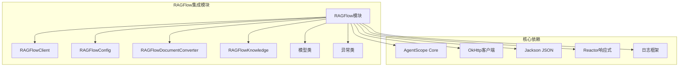
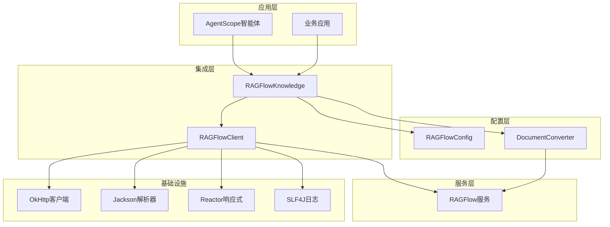
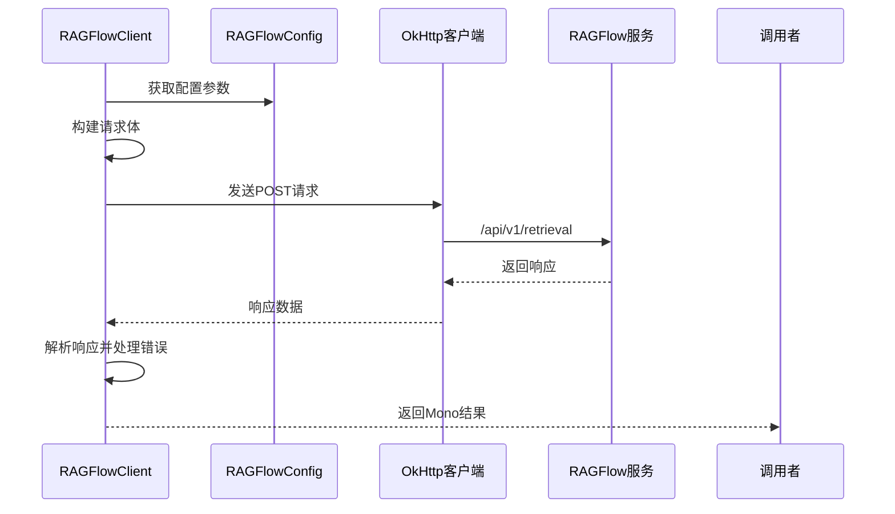
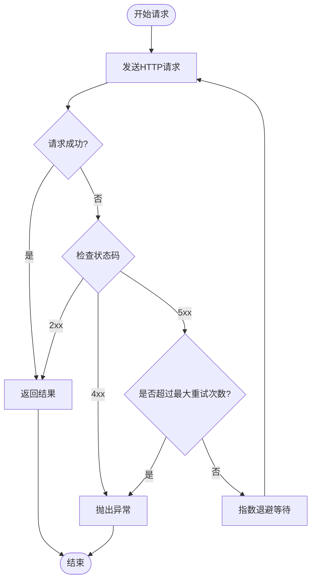
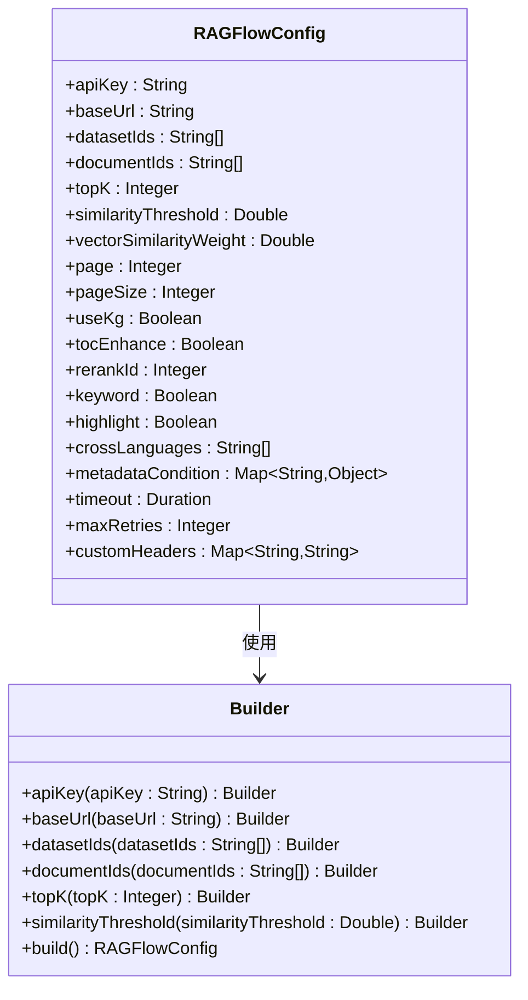
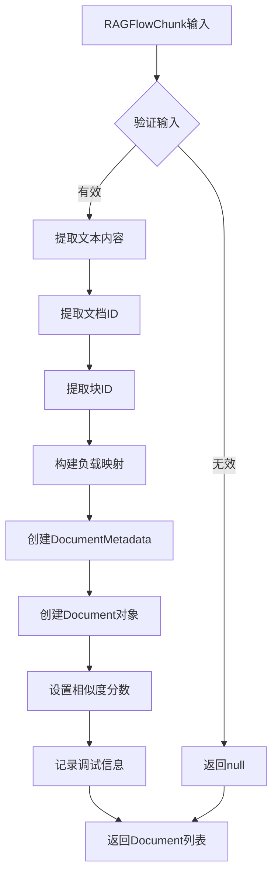
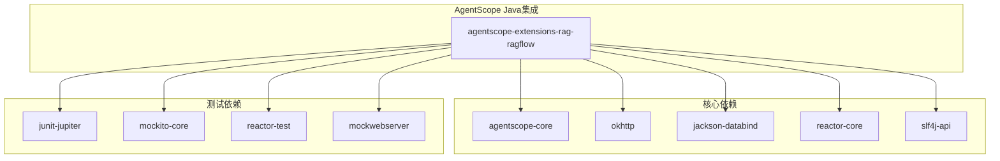

# RAGFlow RAG集成

<cite>
**本文档引用的文件**
- [RAGFlowClient.java](file://agentscope-extensions/agentscope-extensions-rag/agentscope-extensions-rag-ragflow/src/main/java/io/agentscope/core/rag/integration/ragflow/RAGFlowClient.java)
- [RAGFlowConfig.java](file://agentscope-extensions/agentscope-extensions-rag/agentscope-extensions-rag-ragflow/src/main/java/io/agentscope/core/rag/integration/ragflow/RAGFlowConfig.java)
- [RAGFlowDocumentConverter.java](file://agentscope-extensions/agentscope-extensions-rag/agentscope-extensions-rag-ragflow/src/main/java/io/agentscope/core/rag/integration/ragflow/RAGFlowDocumentConverter.java)
- [RAGFlowKnowledge.java](file://agentscope-extensions/agentscope-extensions-rag/agentscope-extensions-rag-ragflow/src/main/java/io/agentscope/core/rag/integration/ragflow/RAGFlowKnowledge.java)
- [RAGFlowChunk.java](file://agentscope-extensions/agentscope-extensions-rag/agentscope-extensions-rag-ragflow/src/main/java/io/agentscope/core/rag/integration/ragflow/model/RAGFlowChunk.java)
- [RAGFlowResponse.java](file://agentscope-extensions/agentscope-extensions-rag/agentscope-extensions-rag-ragflow/src/main/java/io/agentscope/core/rag/integration/ragflow/model/RAGFlowResponse.java)
- [ResponseDataDeserializer.java](file://agentscope-extensions/agentscope-extensions-rag/agentscope-extensions-rag-ragflow/src/main/java/io/agentscope/core/rag/integration/ragflow/model/ResponseDataDeserializer.java)
- [RAGFlowApiException.java](file://agentscope-extensions/agentscope-extensions-rag/agentscope-extensions-rag-ragflow/src/main/java/io/agentscope/core/rag/integration/ragflow/exception/RAGFlowApiException.java)
- [RAGFlowAuthException.java](file://agentscope-extensions/agentscope-extensions-rag/agentscope-extensions-rag-ragflow/src/main/java/io/agentscope/core/rag/integration/ragflow/exception/RAGFlowAuthException.java)
- [ragflow.md](file://docs/v2/zh/integration/rag/ragflow.md)
- [pom.xml](file://agentscope-extensions/agentscope-extensions-rag/agentscope-extensions-rag-ragflow/pom.xml)
- [RAGFlowClientTest.java](file://agentscope-extensions/agentscope-extensions-rag/agentscope-extensions-rag-ragflow/src/test/java/io/agentscope/core/rag/integration/ragflow/RAGFlowClientTest.java)
- [RAGFlowConfigTest.java](file://agentscope-extensions/agentscope-extensions-rag/agentscope-extensions-rag-ragflow/src/test/java/io/agentscope/core/rag/integration/ragflow/RAGFlowConfigTest.java)
</cite>

## 目录
1. [简介](#简介)
2. [项目结构](#项目结构)
3. [核心组件](#核心组件)
4. [架构概览](#架构概览)
5. [详细组件分析](#详细组件分析)
6. [依赖分析](#依赖分析)
7. [性能考虑](#性能考虑)
8. [故障排除指南](#故障排除指南)
9. [结论](#结论)
10. [附录](#附录)

## 简介

AgentScope Java与RAGFlow RAG服务的集成提供了企业级的检索增强生成(RAG)解决方案。该集成基于AgentScope的扩展架构，实现了对RAGFlow服务的完整支持，包括文档检索、向量存储和智能增强等功能。

RAGFlow作为开源的RAG引擎，在文档解析方面具有深度优化（OCR、表格识别、知识图谱增强），特别适合处理扫描件、复杂排版PDF和包含图片表格的文档场景。该集成通过标准化的API接口，将RAGFlow的强大功能无缝集成到AgentScope的智能体生态系统中。

## 项目结构

该项目位于AgentScope Java项目的扩展模块中，采用标准的Maven多模块结构：



**图表来源**
- [RAGFlowClient.java:1-399](file://agentscope-extensions/agentscope-extensions-rag/agentscope-extensions-rag-ragflow/src/main/java/io/agentscope/core/rag/integration/ragflow/RAGFlowClient.java#L1-L399)
- [RAGFlowConfig.java:1-702](file://agentscope-extensions/agentscope-extensions-rag/agentscope-extensions-rag-ragflow/src/main/java/io/agentscope/core/rag/integration/ragflow/RAGFlowConfig.java#L1-L702)

**章节来源**
- [pom.xml:1-98](file://agentscope-extensions/agentscope-extensions-rag/agentscope-extensions-rag-ragflow/pom.xml#L1-L98)

## 核心组件

### RAGFlowClient - HTTP客户端

RAGFlowClient是整个集成的核心HTTP客户端，负责与RAGFlow服务进行所有通信。它实现了以下关键功能：

- **HTTP请求管理**：基于OkHttp实现，支持连接超时、读写超时和连接池管理
- **自动重试机制**：支持可配置的最大重试次数，采用指数退避策略
- **认证处理**：自动添加Bearer Token认证头
- **响应处理**：统一的JSON响应解析和错误处理
- **日志记录**：详细的请求/响应日志记录

### RAGFlowConfig - 配置管理

RAGFlowConfig提供了完整的配置管理功能，支持以下配置项：

- **认证配置**：API Key和基础URL
- **检索参数**：Top-K、相似度阈值、向量权重等
- **高级功能**：知识图谱、TOC增强、关键词匹配等
- **网络配置**：超时时间、最大重试次数、自定义头部
- **过滤条件**：元数据过滤和语言支持

### RAGFlowDocumentConverter - 文档转换器

文档转换器负责将RAGFlow的API响应转换为AgentScope内部的Document对象格式，确保数据的一致性和兼容性。

### RAGFlowKnowledge - 知识库接口实现

RAGFlowKnowledge实现了AgentScope的Knowledge接口，提供标准化的知识检索能力，与AgentScope的智能体系统完全兼容。

**章节来源**
- [RAGFlowClient.java:48-399](file://agentscope-extensions/agentscope-extensions-rag/agentscope-extensions-rag-ragflow/src/main/java/io/agentscope/core/rag/integration/ragflow/RAGFlowClient.java#L48-L399)
- [RAGFlowConfig.java:33-702](file://agentscope-extensions/agentscope-extensions-rag/agentscope-extensions-rag-ragflow/src/main/java/io/agentscope/core/rag/integration/ragflow/RAGFlowConfig.java#L33-L702)

## 架构概览

该集成采用了分层架构设计，确保了良好的可维护性和扩展性：



**图表来源**
- [RAGFlowKnowledge.java:79-216](file://agentscope-extensions/agentscope-extensions-rag/agentscope-extensions-rag-ragflow/src/main/java/io/agentscope/core/rag/integration/ragflow/RAGFlowKnowledge.java#L79-L216)
- [RAGFlowClient.java:48-399](file://agentscope-extensions/agentscope-extensions-rag/agentscope-extensions-rag-ragflow/src/main/java/io/agentscope/core/rag/integration/ragflow/RAGFlowClient.java#L48-L399)

## 详细组件分析

### RAGFlowClient 详细分析

RAGFlowClient实现了完整的HTTP客户端功能，具有以下特点：

#### 请求构建流程



**图表来源**
- [RAGFlowClient.java:99-263](file://agentscope-extensions/agentscope-extensions-rag/agentscope-extensions-rag-ragflow/src/main/java/io/agentscope/core/rag/integration/ragflow/RAGFlowClient.java#L99-L263)

#### 错误处理机制

RAGFlowClient实现了多层次的错误处理：

| HTTP状态码 | 异常类型 | 处理逻辑 |
|-----------|----------|----------|
| 401/403 | RAGFlowAuthException | 认证失败，需要检查API Key |
| 404 | RAGFlowApiException | 资源不存在，通常是数据集ID错误 |
| 429 | RAGFlowApiException | 请求频率过高，触发限流 |
| 500+ | RAGFlowApiException | 服务器内部错误 |
| 其他 | RAGFlowApiException | 其他HTTP错误 |

#### 重试机制



**图表来源**
- [RAGFlowClient.java:306-376](file://agentscope-extensions/agentscope-extensions-rag/agentscope-extensions-rag-ragflow/src/main/java/io/agentscope/core/rag/integration/ragflow/RAGFlowClient.java#L306-L376)

**章节来源**
- [RAGFlowClient.java:265-281](file://agentscope-extensions/agentscope-extensions-rag/agentscope-extensions-rag-ragflow/src/main/java/io/agentscope/core/rag/integration/ragflow/RAGFlowClient.java#L265-L281)
- [RAGFlowClient.java:306-376](file://agentscope-extensions/agentscope-extensions-rag/agentscope-extensions-rag-ragflow/src/main/java/io/agentscope/core/rag/integration/ragflow/RAGFlowClient.java#L306-L376)

### RAGFlowConfig 配置分析

RAGFlowConfig采用了Builder模式，提供了灵活的配置选项：

#### 核心配置参数

| 参数名称 | 类型 | 默认值 | 描述 |
|---------|------|--------|------|
| apiKey | String | 必填 | RAGFlow API密钥 |
| baseUrl | String | 必填 | RAGFlow服务基础URL |
| datasetIds | List<String> | 必填 | 数据集ID列表 |
| documentIds | List<String> | 可选 | 文档ID过滤列表 |
| topK | Integer | 1024 | 返回文档数量 |
| similarityThreshold | Double | 0.2 | 相似度阈值 |
| vectorSimilarityWeight | Double | 0.3 | 向量相似度权重 |

#### 高级配置选项



**图表来源**
- [RAGFlowConfig.java:33-702](file://agentscope-extensions/agentscope-extensions-rag/agentscope-extensions-rag-ragflow/src/main/java/io/agentscope/core/rag/integration/ragflow/RAGFlowConfig.java#L33-L702)

**章节来源**
- [RAGFlowConfig.java:299-700](file://agentscope-extensions/agentscope-extensions-rag/agentscope-extensions-rag-ragflow/src/main/java/io/agentscope/core/rag/integration/ragflow/RAGFlowConfig.java#L299-L700)

### RAGFlowDocumentConverter 转换器

文档转换器负责将RAGFlow的原始响应转换为AgentScope的内部表示：

#### 转换流程



**图表来源**
- [RAGFlowDocumentConverter.java:50-125](file://agentscope-extensions/agentscope-extensions-rag/agentscope-extensions-rag-ragflow/src/main/java/io/agentscope/core/rag/integration/ragflow/RAGFlowDocumentConverter.java#L50-L125)

**章节来源**
- [RAGFlowDocumentConverter.java:36-199](file://agentscope-extensions/agentscope-extensions-rag/agentscope-extensions-rag-ragflow/src/main/java/io/agentscope/core/rag/integration/ragflow/RAGFlowDocumentConverter.java#L36-L199)

### RAGFlowKnowledge 知识库实现

RAGFlowKnowledge实现了AgentScope的Knowledge接口，提供标准化的知识检索能力：

#### 功能特性

- **检索能力**：基于RAGFlow的向量相似度搜索
- **配置支持**：支持RetrieveConfig中的limit和scoreThreshold
- **错误处理**：统一的异常处理和日志记录
- **兼容性**：与AgentScope的其他RAG插件保持一致的接口

**章节来源**
- [RAGFlowKnowledge.java:79-216](file://agentscope-extensions/agentscope-extensions-rag/agentscope-extensions-rag-ragflow/src/main/java/io/agentscope/core/rag/integration/ragflow/RAGFlowKnowledge.java#L79-L216)

## 依赖分析

### 外部依赖关系



**图表来源**
- [pom.xml:33-95](file://agentscope-extensions/agentscope-extensions-rag/agentscope-extensions-rag-ragflow/pom.xml#L33-L95)

### 内部模块依赖

该模块主要依赖AgentScope的核心功能，包括：

- **消息系统**：用于文档内容的文本块表示
- **RAG框架**：提供知识库接口和检索配置
- **工具类**：JSON序列化和响应式编程支持

**章节来源**
- [pom.xml:18-98](file://agentscope-extensions/agentscope-extensions-rag/agentscope-extensions-rag-ragflow/pom.xml#L18-L98)

## 性能考虑

### 网络性能优化

1. **连接池管理**：OkHttp自动管理连接池，减少连接建立开销
2. **超时配置**：支持可配置的连接、读取和写入超时
3. **重试策略**：指数退避避免雪崩效应
4. **响应式编程**：使用Reactor实现非阻塞I/O

### 内存管理

1. **流式处理**：使用响应式流处理大量文档
2. **对象复用**：合理使用OkHttp的连接和请求对象
3. **内存监控**：通过日志监控内存使用情况

### 缓存策略

虽然RAGFlow本身不提供客户端缓存，但可以通过以下方式优化：

1. **应用层缓存**：在业务层实现查询结果缓存
2. **批量处理**：合并多个查询请求
3. **预加载策略**：对高频查询进行预加载

## 故障排除指南

### 常见问题诊断

#### 认证问题

**症状**：401或403错误
**原因**：API Key无效或过期
**解决方法**：
1. 验证API Key格式正确
2. 检查API Key权限范围
3. 确认服务URL配置正确

#### 网络连接问题

**症状**：连接超时或无法连接
**原因**：网络配置或防火墙限制
**解决方法**：
1. 检查baseUrl配置
2. 验证网络连通性
3. 配置代理设置（如需要）

#### 数据集配置问题

**症状**：404错误或空结果
**原因**：数据集ID配置错误
**解决方法**：
1. 验证数据集ID存在且有效
2. 检查数据集状态是否正常
3. 确认文档已成功索引

### 日志分析

#### 启用详细日志

```properties
# application.properties
logging.level.io.agentscope.core.rag.integration.ragflow=DEBUG
logging.level.okhttp3=DEBUG
```

#### 关键日志字段

| 日志级别 | 关键字段 | 用途 |
|---------|----------|------|
| DEBUG | URL, body | 请求详情分析 |
| DEBUG | status, duration | 响应性能监控 |
| ERROR | status, body | 错误原因定位 |
| WARN | retry attempts | 重试策略验证 |

### 单元测试参考

项目包含完整的单元测试覆盖：

#### 配置测试要点

- 必填参数验证（apiKey、baseUrl、datasetIds）
- 参数边界值测试（topK>0、阈值0.0-1.0）
- 组合配置测试（多种参数组合）

#### 客户端测试要点

- 成功响应处理
- 错误响应处理
- 重试机制验证
- 超时处理
- 认证头验证

**章节来源**
- [RAGFlowClientTest.java:1-800](file://agentscope-extensions/agentscope-extensions-rag/agentscope-extensions-rag-ragflow/src/test/java/io/agentscope/core/rag/integration/ragflow/RAGFlowClientTest.java#L1-L800)
- [RAGFlowConfigTest.java:1-530](file://agentscope-extensions/agentscope-extensions-rag/agentscope-extensions-rag-ragflow/src/test/java/io/agentscope/core/rag/integration/ragflow/RAGFlowConfigTest.java#L1-L530)

## 结论

AgentScope Java与RAGFlow的集成提供了企业级的RAG解决方案，具有以下优势：

1. **完整的功能支持**：涵盖文档检索、向量存储和智能增强
2. **企业级可靠性**：完善的错误处理、重试机制和监控
3. **灵活的配置选项**：支持丰富的检索参数和过滤条件
4. **良好的性能表现**：基于响应式编程和连接池优化
5. **易于集成**：遵循AgentScope的标准接口规范

该集成特别适合处理复杂的非结构化文档场景，能够有效提升智能体的文档理解和信息检索能力。

## 附录

### 集成示例

#### 基本配置示例

```java
// 创建RAGFlow配置
RAGFlowConfig config = RAGFlowConfig.builder()
    .apiKey("ragflow-xxxxxxxx")
    .baseUrl("http://localhost:9380")
    .addDatasetId("dataset-xxxxx")
    .topK(10)
    .similarityThreshold(0.5)
    .build();

// 创建知识库实例
RAGFlowKnowledge knowledge = RAGFlowKnowledge.builder()
    .config(config)
    .build();

// 执行检索
List<Document> results = knowledge.retrieve(
    "查询问题",
    RetrieveConfig.builder().limit(5).build()
).block();
```

#### 高级配置示例

```java
// 配置高级检索参数
RAGFlowConfig advancedConfig = RAGFlowConfig.builder()
    .apiKey(System.getenv("RAGFLOW_API_KEY"))
    .baseUrl("https://ragflow.example.com")
    .datasetIds(Arrays.asList("kb-1", "kb-2"))
    .topK(50)
    .similarityThreshold(0.7)
    .vectorSimilarityWeight(0.5)
    .useKg(true)
    .tocEnhance(true)
    .keyword(true)
    .highlight(true)
    .crossLanguages(Arrays.asList("en", "zh"))
    .metadataCondition(buildMetadataCondition())
    .timeout(Duration.ofSeconds(60))
    .maxRetries(3)
    .customHeaders(buildCustomHeaders())
    .build();
```

### 监控和维护建议

#### 性能监控指标

1. **响应时间**：平均响应时间和95分位响应时间
2. **错误率**：HTTP状态码分布和错误类型统计
3. **吞吐量**：每秒查询数和并发请求数
4. **资源使用**：CPU、内存和网络带宽使用情况

#### 维护最佳实践

1. **定期健康检查**：监控RAGFlow服务可用性
2. **配置审计**：定期审查配置参数的有效性
3. **日志轮转**：配置适当的日志轮转策略
4. **版本升级**：跟踪AgentScope和RAGFlow的版本更新