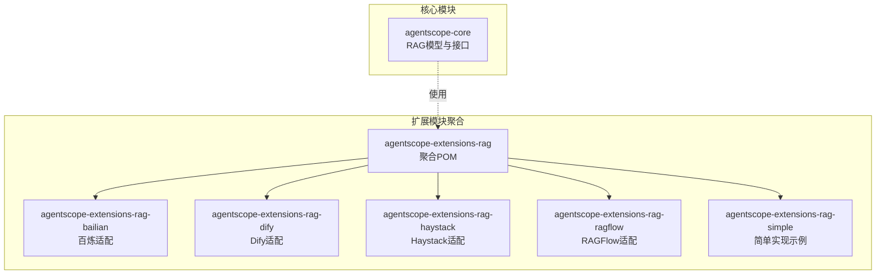
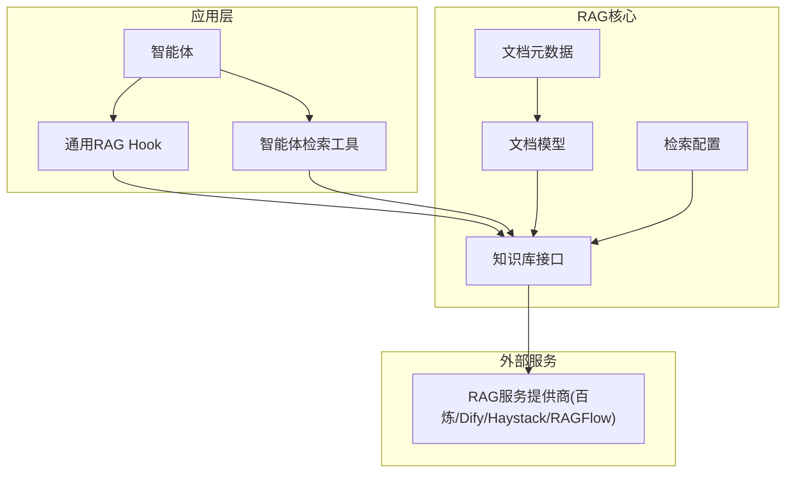
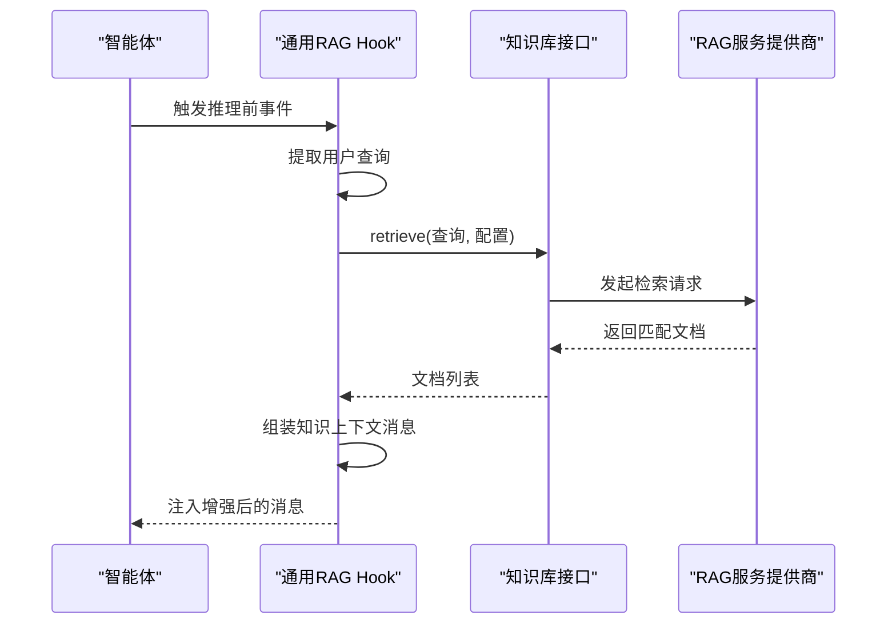
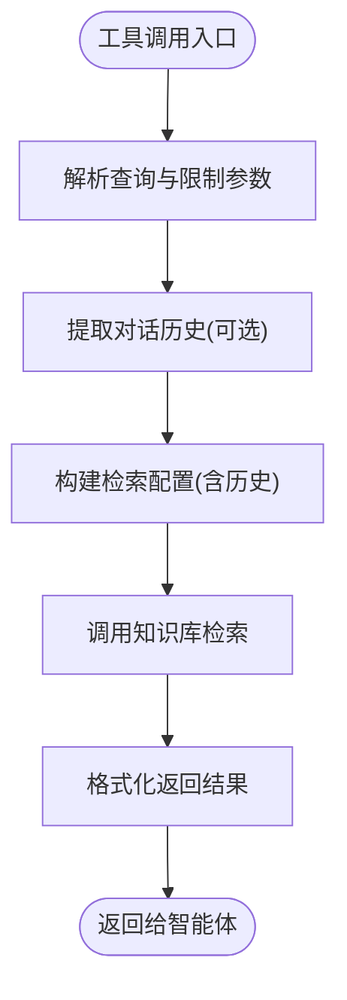
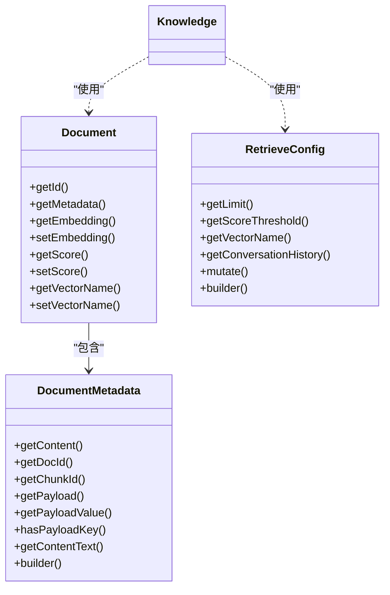
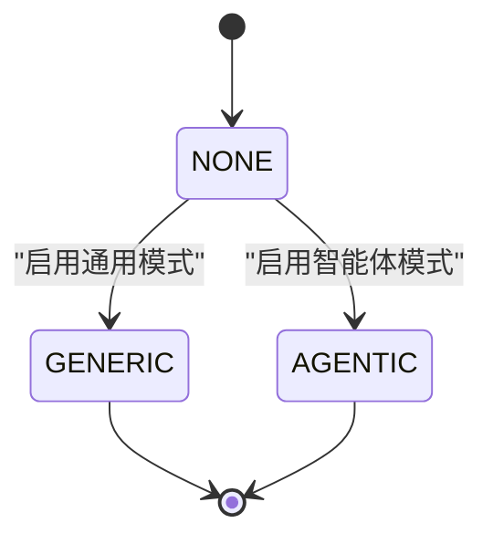
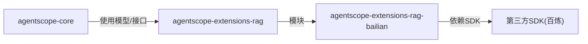

# RAG扩展

<cite>
**本文引用的文件**
- [agentscope-core/src/main/java/io/agentscope/core/rag/Knowledge.java](file://agentscope-core/src/main/java/io/agentscope/core/rag/Knowledge.java)
- [agentscope-core/src/main/java/io/agentscope/core/rag/RAGMode.java](file://agentscope-core/src/main/java/io/agentscope/core/rag/RAGMode.java)
- [agentscope-core/src/main/java/io/agentscope/core/rag/GenericRAGHook.java](file://agentscope-core/src/main/java/io/agentscope/core/rag/GenericRAGHook.java)
- [agentscope-core/src/main/java/io/agentscope/core/rag/KnowledgeRetrievalTools.java](file://agentscope-core/src/main/java/io/agentscope/core/rag/KnowledgeRetrievalTools.java)
- [agentscope-core/src/main/java/io/agentscope/core/rag/model/Document.java](file://agentscope-core/src/main/java/io/agentscope/core/rag/model/Document.java)
- [agentscope-core/src/main/java/io/agentscope/core/rag/model/DocumentMetadata.java](file://agentscope-core/src/main/java/io/agentscope/core/rag/model/DocumentMetadata.java)
- [agentscope-core/src/main/java/io/agentscope/core/rag/model/RetrieveConfig.java](file://agentscope-core/src/main/java/io/agentscope/core/rag/model/RetrieveConfig.java)
- [agentscope-extensions/agentscope-extensions-rag/pom.xml](file://agentscope-extensions/agentscope-extensions-rag/pom.xml)
- [agentscope-extensions/agentscope-extensions-rag/agentscope-extensions-rag-bailian/pom.xml](file://agentscope-extensions/agentscope-extensions-rag/agentscope-extensions-rag-bailian/pom.xml)
</cite>

## 目录
1. [引言](#引言)
2. [项目结构](#项目结构)
3. [核心组件](#核心组件)
4. [架构总览](#架构总览)
5. [详细组件分析](#详细组件分析)
6. [依赖关系分析](#依赖关系分析)
7. [性能考虑](#性能考虑)
8. [故障排查指南](#故障排查指南)
9. [结论](#结论)
10. [附录](#附录)

## 引言
本技术文档面向AgentScope Java的RAG（检索增强生成）扩展模块，系统性阐述其设计架构与实现原理，覆盖文档预处理、向量嵌入、相似度检索与生成融合等关键环节，并对与百炼、Dify、Haystack、RAGFlow等平台的集成思路进行说明。同时给出知识库管理、检索策略优化、生成质量控制、部署配置、性能调优与监控建议，以及可复用的最佳实践。

需要特别说明的是：当前仓库中RAG相关的核心类与模型已标注为废弃（since 2.0.0），官方已不再维护该包。本文在不臆造信息的前提下，基于现有源码进行严谨解读，帮助读者理解历史设计与迁移路径，指导如何在应用层自行集成检索能力。

## 项目结构
RAG扩展采用多模块聚合结构，父工程统一管理各提供商适配模块。核心RAG模型与接口位于agentscope-core中，扩展模块位于agentscope-extensions/agentscope-extensions-rag下，按提供商拆分。

图表来源
- [agentscope-extensions/agentscope-extensions-rag/pom.xml:34-40](file://agentscope-extensions/agentscope-extensions-rag/pom.xml#L34-L40)
- [agentscope-extensions/agentscope-extensions-rag/agentscope-extensions-rag-bailian/pom.xml:33-46](file://agentscope-extensions/agentscope-extensions-rag/agentscope-extensions-rag-bailian/pom.xml#L33-L46)

章节来源
- [agentscope-extensions/agentscope-extensions-rag/pom.xml:34-40](file://agentscope-extensions/agentscope-extensions-rag/pom.xml#L34-L40)
- [agentscope-extensions/agentscope-extensions-rag/agentscope-extensions-rag-bailian/pom.xml:33-46](file://agentscope-extensions/agentscope-extensions-rag/agentscope-extensions-rag-bailian/pom.xml#L33-L46)

## 核心组件
- 知识库接口：抽象知识库的增删查改能力，支持文档入库与相似度检索。
- 检索配置：封装检索参数（数量上限、分数阈值、向量集名、对话上下文等）。
- 文档模型：承载内容块、元数据、向量与相似度分数。
- 文档元数据：支持文本/多媒体内容块与自定义负载字段。
- 通用RAG Hook：在推理前自动检索并注入知识上下文。
- 智能体检索工具：在智能体工具集中暴露检索能力，由智能体自主决策触发。

章节来源
- [Knowledge.java:34-58](file://agentscope-core/src/main/java/io/agentscope/core/rag/Knowledge.java#L34-L58)
- [RAGMode.java:32-56](file://agentscope-core/src/main/java/io/agentscope/core/rag/RAGMode.java#L32-L56)
- [GenericRAGHook.java:69-108](file://agentscope-core/src/main/java/io/agentscope/core/rag/GenericRAGHook.java#L69-L108)
- [KnowledgeRetrievalTools.java:57-95](file://agentscope-core/src/main/java/io/agentscope/core/rag/KnowledgeRetrievalTools.java#L57-L95)
- [Document.java:38-60](file://agentscope-core/src/main/java/io/agentscope/core/rag/model/Document.java#L38-L60)
- [DocumentMetadata.java:56-109](file://agentscope-core/src/main/java/io/agentscope/core/rag/model/DocumentMetadata.java#L56-L109)
- [RetrieveConfig.java:32-44](file://agentscope-core/src/main/java/io/agentscope/core/rag/model/RetrieveConfig.java#L32-L44)

## 架构总览
RAG系统围绕“文档入库—向量嵌入—相似度检索—生成融合”闭环构建。核心流程如下：

图表来源
- [GenericRAGHook.java:111-166](file://agentscope-core/src/main/java/io/agentscope/core/rag/GenericRAGHook.java#L111-L166)
- [KnowledgeRetrievalTools.java:119-167](file://agentscope-core/src/main/java/io/agentscope/core/rag/KnowledgeRetrievalTools.java#L119-L167)
- [Knowledge.java:34-58](file://agentscope-core/src/main/java/io/agentscope/core/rag/Knowledge.java#L34-L58)
- [Document.java:38-60](file://agentscope-core/src/main/java/io/agentscope/core/rag/model/Document.java#L38-L60)
- [DocumentMetadata.java:56-109](file://agentscope-core/src/main/java/io/agentscope/core/rag/model/DocumentMetadata.java#L56-L109)
- [RetrieveConfig.java:32-44](file://agentscope-core/src/main/java/io/agentscope/core/rag/model/RetrieveConfig.java#L32-L44)

## 详细组件分析

### 组件一：通用RAG Hook（自动检索注入）
职责与行为
- 在推理前拦截事件，提取用户查询，调用知识库检索，将结果作为用户消息注入到输入消息列表。
- 默认配置包含检索条数与分数阈值；失败时记录告警但不中断流程。
- 优先级较高，确保在推理链路早期完成上下文增强。

图表来源
- [GenericRAGHook.java:111-166](file://agentscope-core/src/main/java/io/agentscope/core/rag/GenericRAGHook.java#L111-L166)
- [Knowledge.java:44-57](file://agentscope-core/src/main/java/io/agentscope/core/rag/Knowledge.java#L44-L57)

章节来源
- [GenericRAGHook.java:69-108](file://agentscope-core/src/main/java/io/agentscope/core/rag/GenericRAGHook.java#L69-L108)
- [GenericRAGHook.java:111-166](file://agentscope-core/src/main/java/io/agentscope/core/rag/GenericRAGHook.java#L111-L166)
- [GenericRAGHook.java:177-191](file://agentscope-core/src/main/java/io/agentscope/core/rag/GenericRAGHook.java#L177-L191)
- [GenericRAGHook.java:201-233](file://agentscope-core/src/main/java/io/agentscope/core/rag/GenericRAGHook.java#L201-L233)

### 组件二：智能体检索工具（主动检索）
职责与行为
- 将检索能力注册为智能体工具，允许智能体在需要时主动触发检索。
- 支持从运行态上下文中提取对话历史，用于上下文感知检索。
- 工具返回格式化后的检索结果字符串，便于后续推理使用。

图表来源
- [KnowledgeRetrievalTools.java:119-167](file://agentscope-core/src/main/java/io/agentscope/core/rag/KnowledgeRetrievalTools.java#L119-L167)

章节来源
- [KnowledgeRetrievalTools.java:57-95](file://agentscope-core/src/main/java/io/agentscope/core/rag/KnowledgeRetrievalTools.java#L57-L95)
- [KnowledgeRetrievalTools.java:119-167](file://agentscope-core/src/main/java/io/agentscope/core/rag/KnowledgeRetrievalTools.java#L119-L167)
- [KnowledgeRetrievalTools.java:178-197](file://agentscope-core/src/main/java/io/agentscope/core/rag/KnowledgeRetrievalTools.java#L178-L197)

### 组件三：文档与元数据模型
职责与行为
- 文档模型：承载内容、向量、相似度分数与向量集名；ID通过元数据确定性生成。
- 文档元数据：支持多种内容块类型与自定义负载字段；提供Builder模式构造与安全访问。
- 检索配置：限制返回条数、设置分数阈值、指定向量集名、携带对话历史。

图表来源
- [Document.java:38-60](file://agentscope-core/src/main/java/io/agentscope/core/rag/model/Document.java#L38-L60)
- [DocumentMetadata.java:56-109](file://agentscope-core/src/main/java/io/agentscope/core/rag/model/DocumentMetadata.java#L56-L109)
- [RetrieveConfig.java:32-44](file://agentscope-core/src/main/java/io/agentscope/core/rag/model/RetrieveConfig.java#L32-L44)

章节来源
- [Document.java:38-60](file://agentscope-core/src/main/java/io/agentscope/core/rag/model/Document.java#L38-L60)
- [DocumentMetadata.java:56-109](file://agentscope-core/src/main/java/io/agentscope/core/rag/model/DocumentMetadata.java#L56-L109)
- [RetrieveConfig.java:32-44](file://agentscope-core/src/main/java/io/agentscope/core/rag/model/RetrieveConfig.java#L32-L44)

### 组件四：知识库接口与检索模式
职责与行为
- 知识库接口：定义添加文档与检索文档的标准能力。
- 检索模式：GENERIC（Hook自动注入）、AGENTIC（工具主动触发）、NONE（禁用）。

图表来源
- [RAGMode.java:32-56](file://agentscope-core/src/main/java/io/agentscope/core/rag/RAGMode.java#L32-L56)
- [Knowledge.java:34-58](file://agentscope-core/src/main/java/io/agentscope/core/rag/Knowledge.java#L34-L58)

章节来源
- [RAGMode.java:32-56](file://agentscope-core/src/main/java/io/agentscope/core/rag/RAGMode.java#L32-L56)
- [Knowledge.java:34-58](file://agentscope-core/src/main/java/io/agentscope/core/rag/Knowledge.java#L34-L58)

## 依赖关系分析
- 扩展聚合模块依赖核心RAG模型与接口，具体实现由各提供商模块提供。
- 百炼适配模块引入第三方SDK依赖，用于对接百炼知识库能力。

图表来源
- [agentscope-extensions/agentscope-extensions-rag/pom.xml:34-40](file://agentscope-extensions/agentscope-extensions-rag/pom.xml#L34-L40)
- [agentscope-extensions/agentscope-extensions-rag/agentscope-extensions-rag-bailian/pom.xml:33-46](file://agentscope-extensions/agentscope-extensions-rag/agentscope-extensions-rag-bailian/pom.xml#L33-L46)

章节来源
- [agentscope-extensions/agentscope-extensions-rag/pom.xml:34-40](file://agentscope-extensions/agentscope-extensions-rag/pom.xml#L34-L40)
- [agentscope-extensions/agentscope-extensions-rag/agentscope-extensions-rag-bailian/pom.xml:33-46](file://agentscope-extensions/agentscope-extensions-rag/agentscope-extensions-rag-bailian/pom.xml#L33-L46)

## 性能考虑
- 检索参数调优
  - 限制条数：根据上下文窗口与成本预算设定合理上限。
  - 分数阈值：结合向量质量与业务召回率动态调整。
  - 向量集名：针对不同领域/主题划分向量集合，提升相关性。
- 上下文注入策略
  - 仅在必要时注入知识，避免冗余信息影响推理效率。
  - 对长文档进行分段与截断，保留高相关片段。
- 错误与降级
  - Hook在检索失败时记录告警并保持流程继续，保障稳定性。
- 并发与缓存
  - 对热点查询结果进行缓存，减少重复检索开销。
- 向量化与存储
  - 选择合适的向量维度与索引算法，平衡精度与速度。
  - 定期维护向量索引，清理无效/过期数据。

## 故障排查指南
常见问题与定位要点
- 检索无结果
  - 检查知识库是否已正确入库文档。
  - 调整分数阈值或增加检索条数。
  - 校验查询文本与向量表示一致性。
- 上下文注入异常
  - 确认Hook优先级与事件拦截逻辑。
  - 校验消息序列中是否存在有效用户查询。
- 工具调用失败
  - 查看工具返回的错误提示，确认参数合法性。
  - 检查运行态上下文是否包含预期的历史消息。
- 第三方服务异常
  - 关注SDK日志与网络连通性。
  - 设置合理的超时与重试策略。

章节来源
- [GenericRAGHook.java:160-165](file://agentscope-core/src/main/java/io/agentscope/core/rag/GenericRAGHook.java#L160-L165)
- [KnowledgeRetrievalTools.java:162-166](file://agentscope-core/src/main/java/io/agentscope/core/rag/KnowledgeRetrievalTools.java#L162-L166)

## 结论
AgentScope Java的RAG扩展提供了清晰的抽象与可插拔的实现方式。尽管核心RAG包已标记废弃，但其设计理念仍可直接迁移到应用层：在Hook或工具中集成检索逻辑，结合文档模型与检索配置，实现从知识库到生成器的平滑衔接。对于不同提供商，可在各自适配模块中封装HTTP/SDK调用细节，统一对外接口，从而获得一致的开发体验与运维收益。

## 附录

### 实施路线图（迁移与集成建议）
- 应用层集成检索
  - 在Hook中调用知识库检索并将结果注入消息流。
  - 在智能体工具集中注册检索工具，允许智能体按需触发。
- 文档与元数据
  - 使用文档模型承载内容与元数据，利用Builder模式规范化构造。
  - 自定义负载字段用于业务标签与溯源。
- 检索配置
  - 基于业务场景设置限制条数、分数阈值与向量集名。
  - 支持携带对话历史，提升多轮检索准确性。
- 与提供商对接
  - 百炼：引入对应SDK，封装知识库增删查改与检索API。
  - Dify/Haystack/RAGFlow：参考百炼适配模式，对接其检索端点与鉴权机制。
- 部署与监控
  - 将检索服务容器化，配合限流与熔断策略。
  - 记录检索延迟、命中率、错误率等指标，持续优化阈值与参数。