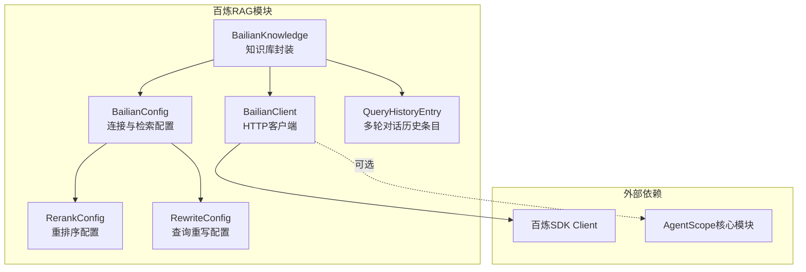
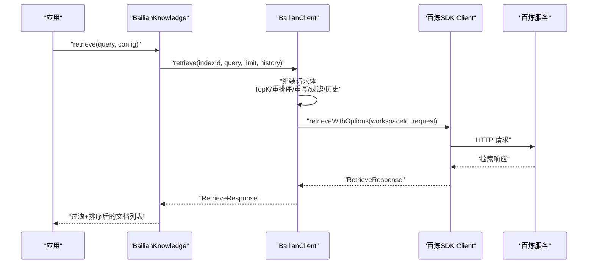
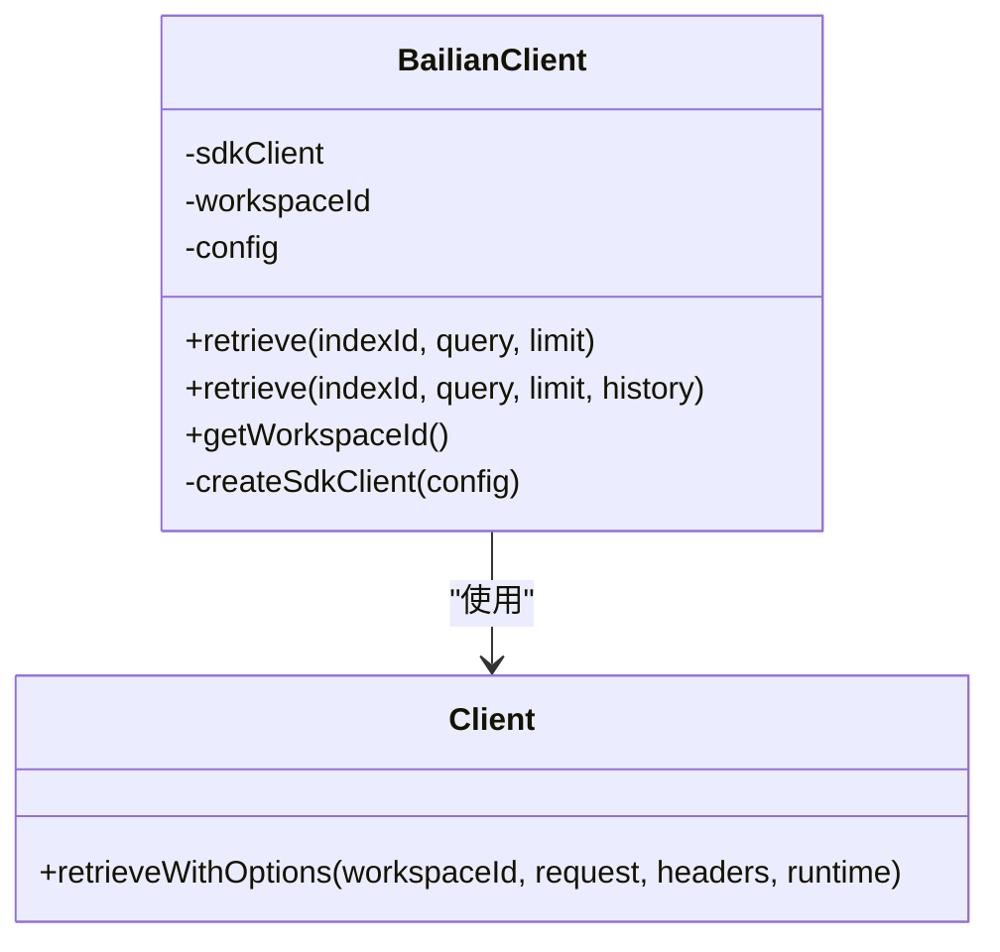
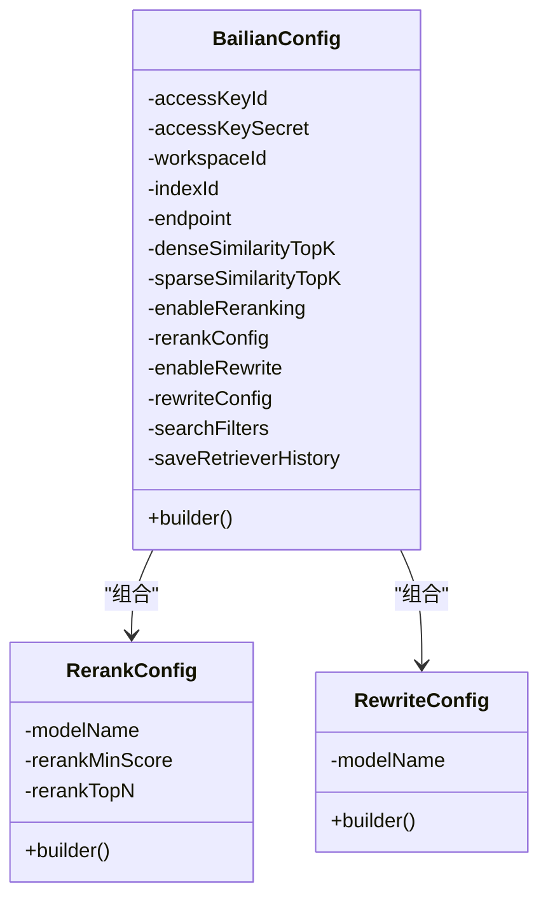
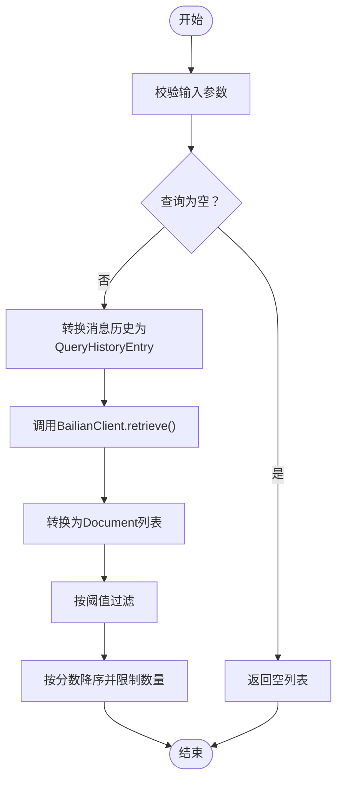
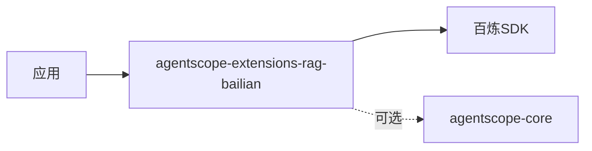

# 百炼RAG集成

<cite>
**本文引用的文件**
- [BailianClient.java](file://agentscope-extensions/agentscope-extensions-rag/agentscope-extensions-rag-bailian/src/main/java/io/agentscope/core/rag/integration/bailian/BailianClient.java)
- [BailianConfig.java](file://agentscope-extensions/agentscope-extensions-rag/agentscope-extensions-rag-bailian/src/main/java/io/agentscope/core/rag/integration/bailian/BailianConfig.java)
- [BailianKnowledge.java](file://agentscope-extensions/agentscope-extensions-rag/agentscope-extensions-rag-bailian/src/main/java/io/agentscope/core/rag/integration/bailian/BailianKnowledge.java)
- [RerankConfig.java](file://agentscope-extensions/agentscope-extensions-rag/agentscope-extensions-rag-bailian/src/main/java/io/agentscope/core/rag/integration/bailian/RerankConfig.java)
- [RewriteConfig.java](file://agentscope-extensions/agentscope-extensions-rag/agentscope-extensions-rag-bailian/src/main/java/io/agentscope/core/rag/integration/bailian/RewriteConfig.java)
- [QueryHistoryEntry.java](file://agentscope-extensions/agentscope-extensions-rag/agentscope-extensions-rag-bailian/src/main/java/io/agentscope/core/rag/integration/bailian/QueryHistoryEntry.java)
- [pom.xml](file://agentscope-extensions/agentscope-extensions-rag/agentscope-extensions-rag-bailian/pom.xml)
- [快速开始与高级配置（中文）](file://docs/v1/zh/docs/task/rag.md)
- [快速开始与完整配置（英文）](file://docs/v1/en/docs/task/rag.md)
</cite>

## 目录
1. [简介](#简介)
2. [项目结构](#项目结构)
3. [核心组件](#核心组件)
4. [架构总览](#架构总览)
5. [详细组件分析](#详细组件分析)
6. [依赖关系分析](#依赖关系分析)
7. [性能考量](#性能考量)
8. [故障排查指南](#故障排查指南)
9. [结论](#结论)
10. [附录](#附录)

## 简介
本文件面向在 AgentScope Java 中集成阿里云百炼（Bailian）RAG 能力的开发者，系统化地说明如何通过 BailianClient 与 BailianKnowledge 实现知识库检索、查询重写与重排序等增强功能，并给出配置参数、使用流程、错误处理与性能优化建议。当前版本提供云端知识库检索能力，文档上传与索引构建等管理操作需通过百炼控制台或未来版本提供的 API 支持。

## 项目结构
百炼 RAG 扩展位于 agentscope-extensions-rag-bailian 模块中，核心代码围绕以下文件组织：
- 客户端与配置：BailianClient、BailianConfig、RerankConfig、RewriteConfig、QueryHistoryEntry
- 知识库封装：BailianKnowledge（实现通用 Knowledge 接口）
- 依赖声明：pom.xml 引入百炼 SDK 与 AgentScope 核心模块

图表来源
- [BailianKnowledge.java:87-391](file://agentscope-extensions/agentscope-extensions-rag/agentscope-extensions-rag-bailian/src/main/java/io/agentscope/core/rag/integration/bailian/BailianKnowledge.java#L87-L391)
- [BailianClient.java:51-306](file://agentscope-extensions/agentscope-extensions-rag/agentscope-extensions-rag-bailian/src/main/java/io/agentscope/core/rag/integration/bailian/BailianClient.java#L51-L306)
- [BailianConfig.java:50-448](file://agentscope-extensions/agentscope-extensions-rag/agentscope-extensions-rag-bailian/src/main/java/io/agentscope/core/rag/integration/bailian/BailianConfig.java#L50-L448)
- [RerankConfig.java:24-142](file://agentscope-extensions/agentscope-extensions-rag/agentscope-extensions-rag-bailian/src/main/java/io/agentscope/core/rag/integration/bailian/RerankConfig.java#L24-L142)
- [RewriteConfig.java:24-84](file://agentscope-extensions/agentscope-extensions-rag/agentscope-extensions-rag-bailian/src/main/java/io/agentscope/core/rag/integration/bailian/RewriteConfig.java#L24-L84)
- [QueryHistoryEntry.java:24-81](file://agentscope-extensions/agentscope-extensions-rag/agentscope-extensions-rag-bailian/src/main/java/io/agentscope/core/rag/integration/bailian/QueryHistoryEntry.java#L24-L81)

章节来源
- [pom.xml:33-46](file://agentscope-extensions/agentscope-extensions-rag/agentscope-extensions-rag-bailian/pom.xml#L33-L46)

## 核心组件
- BailianClient：封装百炼 SDK 的检索请求构造与执行，负责将配置转换为 RetrieveRequest 并调用 SDK 客户端发起检索。
- BailianConfig：集中管理连接参数（AK/SK、工作空间、索引、端点）与检索参数（向量/关键词 TopK、重排序、查询重写、过滤器、历史保存）。
- BailianKnowledge：实现通用 Knowledge 接口，提供检索入口；内部将消息历史转换为 QueryHistoryEntry 并调用 BailianClient。
- RerankConfig：重排序模型与阈值、返回条数等配置。
- RewriteConfig：多轮对话查询重写模型配置。
- QueryHistoryEntry：单轮对话历史条目（角色与文本），用于多轮重写。

章节来源
- [BailianClient.java:51-306](file://agentscope-extensions/agentscope-extensions-rag/agentscope-extensions-rag-bailian/src/main/java/io/agentscope/core/rag/integration/bailian/BailianClient.java#L51-L306)
- [BailianConfig.java:50-448](file://agentscope-extensions/agentscope-extensions-rag/agentscope-extensions-rag-bailian/src/main/java/io/agentscope/core/rag/integration/bailian/BailianConfig.java#L50-L448)
- [BailianKnowledge.java:87-391](file://agentscope-extensions/agentscope-extensions-rag/agentscope-extensions-rag-bailian/src/main/java/io/agentscope/core/rag/integration/bailian/BailianKnowledge.java#L87-L391)
- [RerankConfig.java:24-142](file://agentscope-extensions/agentscope-extensions-rag/agentscope-extensions-rag-bailian/src/main/java/io/agentscope/core/rag/integration/bailian/RerankConfig.java#L24-L142)
- [RewriteConfig.java:24-84](file://agentscope-extensions/agentscope-extensions-rag/agentscope-extensions-rag-bailian/src/main/java/io/agentscope/core/rag/integration/bailian/RewriteConfig.java#L24-L84)
- [QueryHistoryEntry.java:24-81](file://agentscope-extensions/agentscope-extensions-rag/agentscope-extensions-rag-bailian/src/main/java/io/agentscope/core/rag/integration/bailian/QueryHistoryEntry.java#L24-L81)

## 架构总览
下图展示从应用到百炼服务的调用链路，以及检索参数如何从配置传递到 SDK 请求体。

图表来源
- [BailianKnowledge.java:162-215](file://agentscope-extensions/agentscope-extensions-rag/agentscope-extensions-rag-bailian/src/main/java/io/agentscope/core/rag/integration/bailian/BailianKnowledge.java#L162-L215)
- [BailianClient.java:117-277](file://agentscope-extensions/agentscope-extensions-rag/agentscope-extensions-rag-bailian/src/main/java/io/agentscope/core/rag/integration/bailian/BailianClient.java#L117-L277)

## 详细组件分析

### BailianClient 组件
- 职责
  - 初始化百炼 SDK 客户端（AK/SK/端点）
  - 将检索配置映射为 RetrieveRequest
  - 发起检索并处理空响应与日志
- 关键行为
  - 参数校验：indexId、query、workspaceId
  - TopK 设置优先级：config 中的 dense/sparseTopK 优先于 limit
  - 重排序开关与模型参数、最小分数、返回条数
  - 查询重写开关与模型
  - 多轮对话历史转换为 QueryHistory 列表
  - 搜索过滤器透传
  - 历史保存开关
- 错误处理
  - 非法参数抛出异常
  - 空响应体抛出运行时异常
  - 无数据时记录警告日志

图表来源
- [BailianClient.java:51-306](file://agentscope-extensions/agentscope-extensions-rag/agentscope-extensions-rag-bailian/src/main/java/io/agentscope/core/rag/integration/bailian/BailianClient.java#L51-L306)

章节来源
- [BailianClient.java:65-103](file://agentscope-extensions/agentscope-extensions-rag/agentscope-extensions-rag-bailian/src/main/java/io/agentscope/core/rag/integration/bailian/BailianClient.java#L65-L103)
- [BailianClient.java:117-277](file://agentscope-extensions/agentscope-extensions-rag/agentscope-extensions-rag-bailian/src/main/java/io/agentscope/core/rag/integration/bailian/BailianClient.java#L117-L277)
- [BailianClient.java:297-304](file://agentscope-extensions/agentscope-extensions-rag/agentscope-extensions-rag-bailian/src/main/java/io/agentscope/core/rag/integration/bailian/BailianClient.java#L297-L304)

### BailianConfig 组件
- 连接配置
  - accessKeyId/accessKeySecret：认证凭据
  - workspaceId/indexId：工作空间与知识库索引标识
  - endpoint：服务端点（默认、金融云、VPC 可选）
- 检索配置
  - denseSimilarityTopK/sparseSimilarityTopK：向量与关键词 TopK（合计不超过 200）
  - enableReranking/rerankConfig：重排序开关与模型、阈值、返回条数
  - enableRewrite/rewriteConfig：查询重写开关与模型
  - searchFilters：搜索过滤条件
  - saveRetrieverHistory：是否保存检索历史
- 校验规则
  - 必填项校验
  - TopK 合法性与合计限制
- 使用建议
  - 在高召回场景提高 TopK，在高精度场景启用重排序
  - 多轮对话开启重写以提升上下文相关性

图表来源
- [BailianConfig.java:50-448](file://agentscope-extensions/agentscope-extensions-rag/agentscope-extensions-rag-bailian/src/main/java/io/agentscope/core/rag/integration/bailian/BailianConfig.java#L50-L448)
- [RerankConfig.java:24-142](file://agentscope-extensions/agentscope-extensions-rag/agentscope-extensions-rag-bailian/src/main/java/io/agentscope/core/rag/integration/bailian/RerankConfig.java#L24-L142)
- [RewriteConfig.java:24-84](file://agentscope-extensions/agentscope-extensions-rag/agentscope-extensions-rag-bailian/src/main/java/io/agentscope/core/rag/integration/bailian/RewriteConfig.java#L24-L84)

章节来源
- [BailianConfig.java:71-107](file://agentscope-extensions/agentscope-extensions-rag/agentscope-extensions-rag-bailian/src/main/java/io/agentscope/core/rag/integration/bailian/BailianConfig.java#L71-L107)
- [BailianConfig.java:324-360](file://agentscope-extensions/agentscope-extensions-rag/agentscope-extensions-rag-bailian/src/main/java/io/agentscope/core/rag/integration/bailian/BailianConfig.java#L324-L360)
- [BailianConfig.java:362-408](file://agentscope-extensions/agentscope-extensions-rag/agentscope-extensions-rag-bailian/src/main/java/io/agentscope/core/rag/integration/bailian/BailianConfig.java#L362-L408)

### BailianKnowledge 组件
- 职责
  - 实现通用 Knowledge 接口，提供检索能力
  - 将消息历史转换为 QueryHistoryEntry 列表
  - 对检索结果按阈值过滤、按分数降序、限制数量
- 不支持的操作
  - 文档上传与索引构建（通过控制台或后续 API 支持）

图表来源
- [BailianKnowledge.java:162-215](file://agentscope-extensions/agentscope-extensions-rag/agentscope-extensions-rag-bailian/src/main/java/io/agentscope/core/rag/integration/bailian/BailianKnowledge.java#L162-L215)
- [BailianKnowledge.java:227-243](file://agentscope-extensions/agentscope-extensions-rag/agentscope-extensions-rag-bailian/src/main/java/io/agentscope/core/rag/integration/bailian/BailianKnowledge.java#L227-L243)

章节来源
- [BailianKnowledge.java:102-118](file://agentscope-extensions/agentscope-extensions-rag/agentscope-extensions-rag-bailian/src/main/java/io/agentscope/core/rag/integration/bailian/BailianKnowledge.java#L102-L118)
- [BailianKnowledge.java:130-137](file://agentscope-extensions/agentscope-extensions-rag/agentscope-extensions-rag-bailian/src/main/java/io/agentscope/core/rag/integration/bailian/BailianKnowledge.java#L130-L137)
- [BailianKnowledge.java:162-215](file://agentscope-extensions/agentscope-extensions-rag/agentscope-extensions-rag-bailian/src/main/java/io/agentscope/core/rag/integration/bailian/BailianKnowledge.java#L162-L215)

### 查询重写与多轮对话
- QueryHistoryEntry：封装角色（user/assistant）与内容
- 多轮对话支持：当启用重写且提供历史时，客户端会将历史转换为请求体中的 queryHistory 字段
- 适用场景：长对话、指代消解、上下文延续

章节来源
- [QueryHistoryEntry.java:24-81](file://agentscope-extensions/agentscope-extensions-rag/agentscope-extensions-rag-bailian/src/main/java/io/agentscope/core/rag/integration/bailian/QueryHistoryEntry.java#L24-L81)
- [BailianClient.java:220-232](file://agentscope-extensions/agentscope-extensions-rag/agentscope-extensions-rag-bailian/src/main/java/io/agentscope/core/rag/integration/bailian/BailianClient.java#L220-L232)
- [BailianConfig.java:386-408](file://agentscope-extensions/agentscope-extensions-rag/agentscope-extensions-rag-bailian/src/main/java/io/agentscope/core/rag/integration/bailian/BailianConfig.java#L386-L408)

### 重排序与过滤
- 重排序：通过 rerankConfig 指定模型、最小分数与返回条数
- 过滤：searchFilters 支持基于标签等元数据过滤
- 历史保存：saveRetrieverHistory 控制是否保存检索历史

章节来源
- [BailianClient.java:175-244](file://agentscope-extensions/agentscope-extensions-rag/agentscope-extensions-rag-bailian/src/main/java/io/agentscope/core/rag/integration/bailian/BailianClient.java#L175-L244)
- [RerankConfig.java:98-130](file://agentscope-extensions/agentscope-extensions-rag/agentscope-extensions-rag-bailian/src/main/java/io/agentscope/core/rag/integration/bailian/RerankConfig.java#L98-L130)
- [BailianConfig.java:410-422](file://agentscope-extensions/agentscope-extensions-rag/agentscope-extensions-rag-bailian/src/main/java/io/agentscope/core/rag/integration/bailian/BailianConfig.java#L410-L422)

## 依赖关系分析
- 模块依赖
  - 百炼 SDK：com.aliyun:bailian20231229
  - AgentScope 核心模块（可选，提供通用 RAG 接口与消息类型）
- 版本与坐标
  - artifactId: agentscope-extensions-rag-bailian
  - 依赖引入位置见模块 pom

图表来源
- [pom.xml:33-46](file://agentscope-extensions/agentscope-extensions-rag/agentscope-extensions-rag-bailian/pom.xml#L33-L46)

章节来源
- [pom.xml:33-46](file://agentscope-extensions/agentscope-extensions-rag/agentscope-extensions-rag-bailian/pom.xml#L33-L46)

## 性能考量
- TopK 与召回/精度平衡
  - 提高 denseSimilarityTopK 与 sparseSimilarityTopK 可提升召回，但会增加重排序与网络开销
  - 密钥检索与向量检索之和不超过 200
- 重排序成本
  - 启用重排序会引入额外计算与延迟，建议在关键场景使用
- 过滤与阈值
  - 使用 searchFilters 减少无关结果，降低下游处理压力
  - 合理设置 scoreThreshold 与 limit，避免返回过多低质量结果
- 多轮对话
  - 启用查询重写可提升相关性，但会增加一次模型推理
- 端点选择
  - 根据部署区域选择合适端点，减少网络时延

## 故障排查指南
- 常见错误与定位
  - 缺少必要参数：检查 accessKeyId、accessKeySecret、workspaceId、indexId 是否设置
  - 索引为空或无数据：确认知识库已建立并完成解析
  - TopK 合法性：确保 dense + sparse 不超过 200
  - 重写/重排序配置：确认模型名称与阈值范围符合要求
- 日志与监控
  - 客户端会在无数据时输出警告日志，便于定位问题
  - 建议在应用层捕获异常并记录请求 ID 以便回溯
- 重试与降级
  - 对于网络波动或服务限流，可在应用层实现指数退避重试
  - 当服务不可用时，考虑降级为本地缓存或兜底回答

章节来源
- [BailianClient.java:143-148](file://agentscope-extensions/agentscope-extensions-rag/agentscope-extensions-rag-bailian/src/main/java/io/agentscope/core/rag/integration/bailian/BailianClient.java#L143-L148)
- [BailianClient.java:252-265](file://agentscope-extensions/agentscope-extensions-rag/agentscope-extensions-rag-bailian/src/main/java/io/agentscope/core/rag/integration/bailian/BailianClient.java#L252-L265)
- [BailianConfig.java:100-106](file://agentscope-extensions/agentscope-extensions-rag/agentscope-extensions-rag-bailian/src/main/java/io/agentscope/core/rag/integration/bailian/BailianConfig.java#L100-L106)

## 结论
通过 BailianClient 与 BailianConfig 的组合，AgentScope Java 能够便捷地接入百炼云端知识库，实现向量与关键词混合检索、重排序与查询重写等增强能力。建议在生产环境中结合业务场景合理配置 TopK、重排序与过滤策略，并关注多轮对话带来的推理成本。对于文档上传与索引构建等管理操作，请通过百炼控制台或等待后续 API 支持。

## 附录

### 快速开始与完整配置示例
- 快速开始（中文）
  - 创建配置、构建知识库实例、执行检索
- 高级配置（中文）
  - 启用重排序、设置重排模型与阈值、启用查询重写
- 多轮对话检索（中文）
  - 通过 RetrieveConfig 的 conversationHistory 触发自动重写
- 完整配置示例（英文）
  - 连接配置（AK/SK、工作空间、索引）、端点配置（默认/金融云/VPC）、检索配置（TopK）、重排序配置（模型/阈值/返回条数）、查询重写配置（模型）、其他配置（过滤、历史保存）

章节来源
- [快速开始与高级配置（中文）:157-239](file://docs/v1/zh/docs/task/rag.md#L157-L239)
- [快速开始与完整配置（英文）:199-239](file://docs/v1/en/docs/task/rag.md#L199-L239)