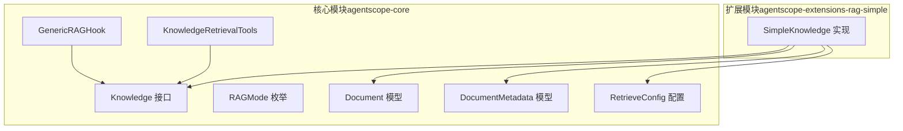
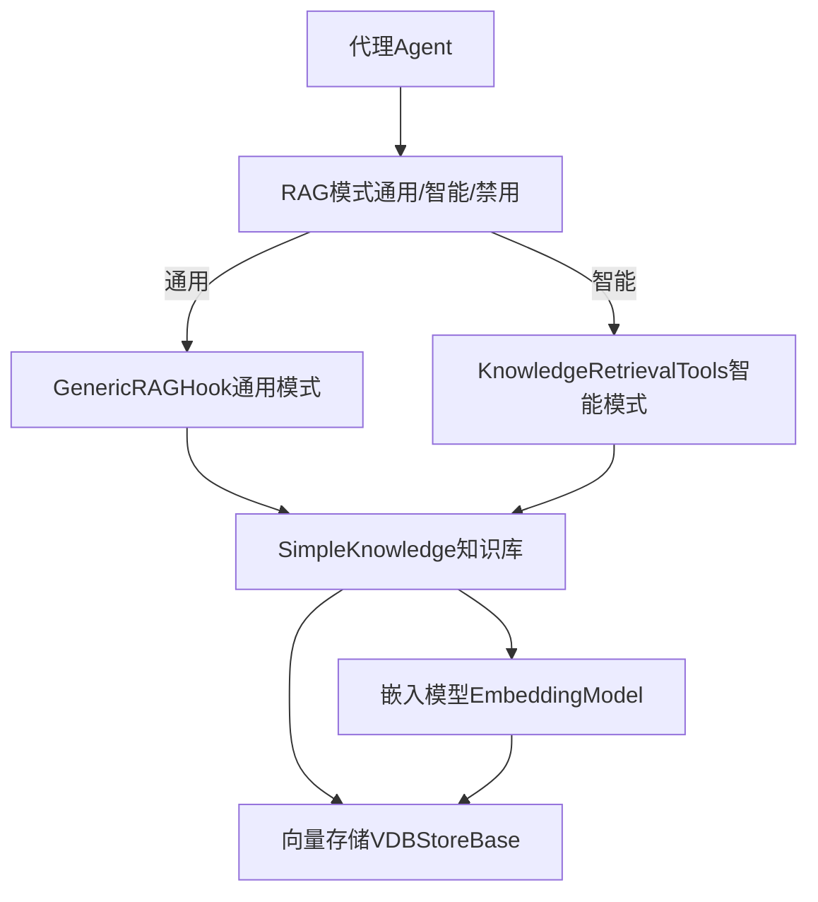
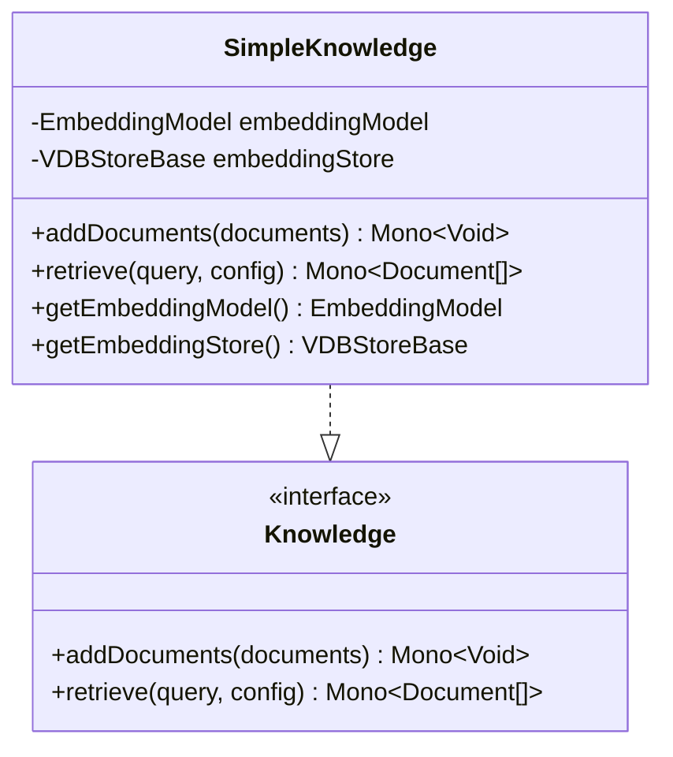
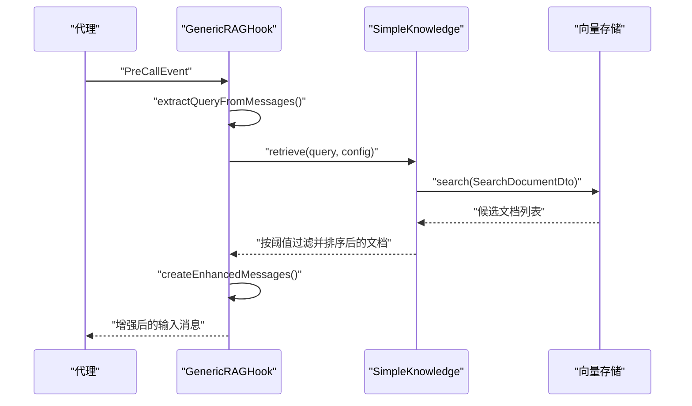
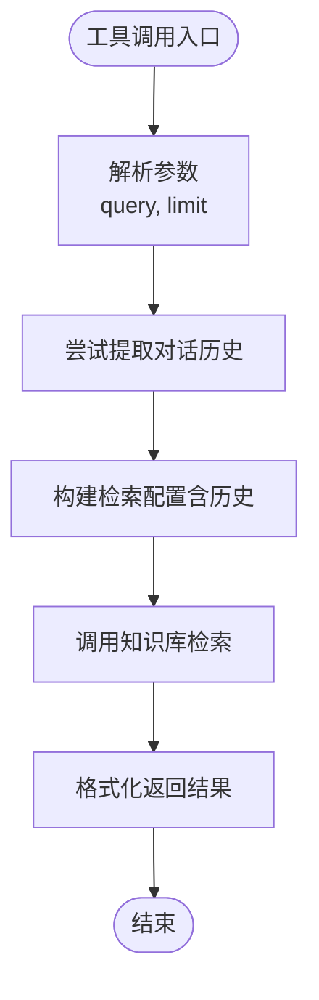
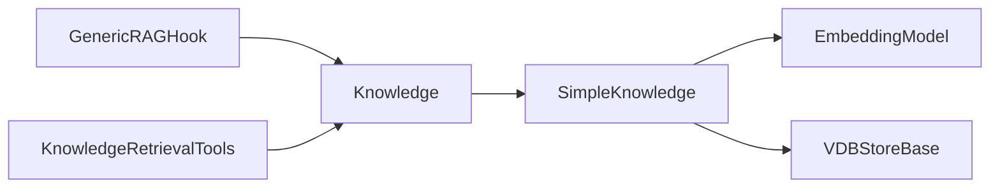

# 简单RAG实现

<cite>
**本文引用的文件**
- [Knowledge.java](file://agentscope-core/src/main/java/io/agentscope/core/rag/Knowledge.java)
- [RAGMode.java](file://agentscope-core/src/main/java/io/agentscope/core/rag/RAGMode.java)
- [GenericRAGHook.java](file://agentscope-core/src/main/java/io/agentscope/core/rag/GenericRAGHook.java)
- [KnowledgeRetrievalTools.java](file://agentscope-core/src/main/java/io/agentscope/core/rag/KnowledgeRetrievalTools.java)
- [SimpleKnowledge.java](file://agentscope-extensions/agentscope-extensions-rag/agentscope-extensions-rag-simple/src/main/java/io/agentscope/core/rag/knowledge/SimpleKnowledge.java)
- [Document.java](file://agentscope-core/src/main/java/io/agentscope/core/rag/model/Document.java)
- [DocumentMetadata.java](file://agentscope-core/src/main/java/io/agentscope/core/rag/model/DocumentMetadata.java)
- [RetrieveConfig.java](file://agentscope-core/src/main/java/io/agentscope/core/rag/model/RetrieveConfig.java)
</cite>

## 目录
1. [简介](#简介)
2. [项目结构](#项目结构)
3. [核心组件](#核心组件)
4. [架构总览](#架构总览)
5. [详细组件分析](#详细组件分析)
6. [依赖分析](#依赖分析)
7. [性能考虑](#性能考虑)
8. [故障排除指南](#故障排除指南)
9. [结论](#结论)
10. [附录](#附录)

## 简介
本文件面向AgentScope Java的“简单RAG实现”，系统性梳理本地RAG客户端的设计与实现要点，覆盖文档解析、向量化处理、向量存储与相似度搜索等关键环节；说明嵌入模型选择与配置、知识库构建与维护流程、检索策略优化方法；阐述RAG模式（通用/智能/禁用）的配置与适用场景；并提供从文档上传到查询处理再到结果返回的完整使用路径与最佳实践。

## 项目结构
围绕RAG功能的相关代码主要分布在两个模块中：
- 核心模块（agentscope-core）：定义RAG接口、模式枚举、通用Hook与工具类，以及文档与检索配置的数据模型。
- 扩展模块（agentscope-extensions-rag-simple）：提供SimpleKnowledge的完整实现，集成嵌入模型与向量数据库，完成端到端的RAG工作流。

图示来源
- [Knowledge.java:34-58](file://agentscope-core/src/main/java/io/agentscope/core/rag/Knowledge.java#L34-L58)
- [RAGMode.java:32-56](file://agentscope-core/src/main/java/io/agentscope/core/rag/RAGMode.java#L32-L56)
- [GenericRAGHook.java:69-108](file://agentscope-core/src/main/java/io/agentscope/core/rag/GenericRAGHook.java#L69-L108)
- [KnowledgeRetrievalTools.java:57-95](file://agentscope-core/src/main/java/io/agentscope/core/rag/KnowledgeRetrievalTools.java#L57-L95)
- [SimpleKnowledge.java:71-94](file://agentscope-extensions/agentscope-extensions-rag/agentscope-extensions-rag-simple/src/main/java/io/agentscope/core/rag/knowledge/SimpleKnowledge.java#L71-L94)

章节来源
- [Knowledge.java:1-59](file://agentscope-core/src/main/java/io/agentscope/core/rag/Knowledge.java#L1-L59)
- [RAGMode.java:1-57](file://agentscope-core/src/main/java/io/agentscope/core/rag/RAGMode.java#L1-L57)
- [GenericRAGHook.java:1-253](file://agentscope-core/src/main/java/io/agentscope/core/rag/GenericRAGHook.java#L1-L253)
- [KnowledgeRetrievalTools.java:1-217](file://agentscope-core/src/main/java/io/agentscope/core/rag/KnowledgeRetrievalTools.java#L1-L217)
- [SimpleKnowledge.java:1-266](file://agentscope-extensions/agentscope-extensions-rag/agentscope-extensions-rag-simple/src/main/java/io/agentscope/core/rag/knowledge/SimpleKnowledge.java#L1-L266)

## 核心组件
- Knowledge 接口：统一的知识库增删改查API，定义添加文档与基于查询的检索能力。
- RAGMode 枚举：定义三种RAG模式（通用、智能、禁用），用于控制检索注入时机与方式。
- GenericRAGHook：通用模式Hook，在推理前自动提取用户问题、检索相关文档并注入上下文。
- KnowledgeRetrievalTools：智能模式工具集，允许代理在需要时主动调用检索工具。
- SimpleKnowledge：简单知识库实现，串联嵌入模型与向量存储，完成文档入库与查询检索。
- 文档与检索配置模型：Document、DocumentMetadata、RetrieveConfig，承载文档内容、元数据与检索参数。

章节来源
- [Knowledge.java:23-58](file://agentscope-core/src/main/java/io/agentscope/core/rag/Knowledge.java#L23-L58)
- [RAGMode.java:18-56](file://agentscope-core/src/main/java/io/agentscope/core/rag/RAGMode.java#L18-L56)
- [GenericRAGHook.java:33-67](file://agentscope-core/src/main/java/io/agentscope/core/rag/GenericRAGHook.java#L33-L67)
- [KnowledgeRetrievalTools.java:28-56](file://agentscope-core/src/main/java/io/agentscope/core/rag/KnowledgeRetrievalTools.java#L28-L56)
- [SimpleKnowledge.java:35-70](file://agentscope-extensions/agentscope-extensions-rag/agentscope-extensions-rag-simple/src/main/java/io/agentscope/core/rag/knowledge/SimpleKnowledge.java#L35-L70)
- [Document.java](file://agentscope-core/src/main/java/io/agentscope/core/rag/model/Document.java)
- [DocumentMetadata.java](file://agentscope-core/src/main/java/io/agentscope/core/rag/model/DocumentMetadata.java)
- [RetrieveConfig.java](file://agentscope-core/src/main/java/io/agentscope/core/rag/model/RetrieveConfig.java)

## 架构总览
下图展示RAG客户端的整体架构与数据流：代理通过不同模式触发检索；通用模式由Hook自动注入，智能模式由工具显式调用；检索链路统一走嵌入模型生成向量，再由向量存储执行相似度搜索与过滤。

图示来源
- [GenericRAGHook.java:110-166](file://agentscope-core/src/main/java/io/agentscope/core/rag/GenericRAGHook.java#L110-L166)
- [KnowledgeRetrievalTools.java:119-167](file://agentscope-core/src/main/java/io/agentscope/core/rag/KnowledgeRetrievalTools.java#L119-L167)
- [SimpleKnowledge.java:96-174](file://agentscope-extensions/agentscope-extensions-rag/agentscope-extensions-rag-simple/src/main/java/io/agentscope/core/rag/knowledge/SimpleKnowledge.java#L96-L174)

## 详细组件分析

### 组件一：SimpleKnowledge（知识库实现）
- 职责与流程
  - 添加文档：从文档元数据提取内容块，调用嵌入模型生成向量，批量写入向量存储。
  - 检索文档：对查询文本生成向量，调用向量存储进行相似度搜索，按阈值过滤并排序返回。
- 关键点
  - 使用Flux/Mono保证异步非阻塞处理。
  - Builder模式便于装配嵌入模型与向量存储。
  - 对空输入与异常进行防御式处理。
- 复杂度
  - 添加文档：O(n)生成向量+批量写入。
  - 检索：O(k)搜索+O(m log m)按分数排序（k为候选数，m为命中数）。

图示来源
- [SimpleKnowledge.java:71-192](file://agentscope-extensions/agentscope-extensions-rag/agentscope-extensions-rag-simple/src/main/java/io/agentscope/core/rag/knowledge/SimpleKnowledge.java#L71-L192)
- [Knowledge.java:34-58](file://agentscope-core/src/main/java/io/agentscope/core/rag/Knowledge.java#L34-L58)

章节来源
- [SimpleKnowledge.java:35-266](file://agentscope-extensions/agentscope-extensions-rag/agentscope-extensions-rag-simple/src/main/java/io/agentscope/core/rag/knowledge/SimpleKnowledge.java#L35-L266)

### 组件二：GenericRAGHook（通用模式Hook）
- 触发时机：拦截推理前事件，自动注入检索上下文。
- 行为流程
  - 从消息列表中提取最后一条用户消息作为查询。
  - 调用知识库检索，将结果拼接为用户消息注入到输入消息末尾。
  - 发生错误时记录告警但不中断流程。
- 优先级：较高优先级，确保在推理前完成上下文增强。

图示来源
- [GenericRAGHook.java:110-166](file://agentscope-core/src/main/java/io/agentscope/core/rag/GenericRAGHook.java#L110-L166)
- [SimpleKnowledge.java:134-174](file://agentscope-extensions/agentscope-extensions-rag/agentscope-extensions-rag-simple/src/main/java/io/agentscope/core/rag/knowledge/SimpleKnowledge.java#L134-L174)

章节来源
- [GenericRAGHook.java:33-253](file://agentscope-core/src/main/java/io/agentscope/core/rag/GenericRAGHook.java#L33-L253)

### 组件三：KnowledgeRetrievalTools（智能模式工具）
- 触发方式：代理通过工具显式调用检索。
- 行为流程
  - 支持指定查询词与最大返回数量，默认值可配置。
  - 可选地从代理状态中提取对话历史，增强检索上下文。
  - 将检索结果格式化为人类可读字符串返回。
- 适用场景：代理自主判断何时需要外部知识，适合复杂问答或需要多轮对话语境的场景。

图示来源
- [KnowledgeRetrievalTools.java:119-167](file://agentscope-core/src/main/java/io/agentscope/core/rag/KnowledgeRetrievalTools.java#L119-L167)

章节来源
- [KnowledgeRetrievalTools.java:28-217](file://agentscope-core/src/main/java/io/agentscope/core/rag/KnowledgeRetrievalTools.java#L28-L217)

### 组件四：RAG模式与配置
- 模式说明
  - 通用（GENERIC）：每次推理前自动检索并注入上下文，适合“始终带上下文”的问答场景。
  - 智能（AGENTIC）：代理自行决定是否检索，适合需要灵活控制检索时机的复杂任务。
  - 禁用（NONE）：关闭RAG功能，仅使用模型自身知识。
- 配置要点
  - 限制条数（limit）、相似度阈值（scoreThreshold）、向量库名称（vectorName）等在检索配置中体现。
  - 默认配置可通过构造函数传入，支持后续按需覆盖。

章节来源
- [RAGMode.java:18-56](file://agentscope-core/src/main/java/io/agentscope/core/rag/RAGMode.java#L18-L56)
- [RetrieveConfig.java](file://agentscope-core/src/main/java/io/agentscope/core/rag/model/RetrieveConfig.java)

## 依赖分析
- 组件耦合
  - SimpleKnowledge依赖嵌入模型与向量存储，二者通过接口解耦，便于替换实现。
  - Hook与工具均依赖Knowledge接口，保持检索逻辑与业务层解耦。
- 外部依赖
  - 嵌入模型负责文本向量化；向量存储负责高维向量的索引与近似最近邻搜索。
  - 日志框架用于错误记录与运行时诊断。

图示来源
- [SimpleKnowledge.java:75-94](file://agentscope-extensions/agentscope-extensions-rag/agentscope-extensions-rag-simple/src/main/java/io/agentscope/core/rag/knowledge/SimpleKnowledge.java#L75-L94)
- [GenericRAGHook.java:69-108](file://agentscope-core/src/main/java/io/agentscope/core/rag/GenericRAGHook.java#L69-L108)
- [KnowledgeRetrievalTools.java:57-95](file://agentscope-core/src/main/java/io/agentscope/core/rag/KnowledgeRetrievalTools.java#L57-L95)

章节来源
- [SimpleKnowledge.java:71-266](file://agentscope-extensions/agentscope-extensions-rag/agentscope-extensions-rag-simple/src/main/java/io/agentscope/core/rag/knowledge/SimpleKnowledge.java#L71-L266)
- [GenericRAGHook.java:69-253](file://agentscope-core/src/main/java/io/agentscope/core/rag/GenericRAGHook.java#L69-L253)
- [KnowledgeRetrievalTools.java:57-217](file://agentscope-core/src/main/java/io/agentscope/core/rag/KnowledgeRetrievalTools.java#L57-L217)

## 性能考虑
- 向量维度与存储
  - 降低维度可减少内存占用与计算开销，但可能影响检索精度；应结合业务权衡。
  - 向量存储的索引类型与参数直接影响召回质量与延迟，需根据数据规模与QPS调优。
- 批量入库
  - addDocuments采用Flux批处理，建议合理设置批次大小以平衡吞吐与内存占用。
- 检索参数
  - limit过大会增加上下文长度与推理成本；阈值过低会引入噪声；建议通过A/B测试确定最优组合。
- 异步与背压
  - 利用Reactor的背压与线程模型避免阻塞；在高并发场景下评估嵌入模型与向量存储的限流策略。
- 缓存与预热
  - 对热点查询结果与常用文档可做缓存；首次加载时预热向量索引以降低冷启动延迟。

## 故障排除指南
- 常见问题与定位
  - 查询为空：检索直接返回空结果，检查消息提取逻辑与输入内容。
  - 嵌入失败：确认嵌入模型配置正确且网络可达；关注日志中的错误堆栈。
  - 存储异常：检查向量维度与索引参数一致性；核对写入批次与存储容量。
  - Hook注入失败：GenericRAGHook会在失败时记录告警但仍继续流程，建议开启更详细的日志级别排查。
- 建议操作
  - 开启调试日志，观察检索前后消息变化。
  - 对小样本数据先验证端到端流程，再逐步扩大规模。
  - 在生产环境前进行压力测试，评估延迟与准确率的平衡。

章节来源
- [GenericRAGHook.java:160-165](file://agentscope-core/src/main/java/io/agentscope/core/rag/GenericRAGHook.java#L160-L165)
- [SimpleKnowledge.java:134-134](file://agentscope-extensions/agentscope-extensions-rag/agentscope-extensions-rag-simple/src/main/java/io/agentscope/core/rag/knowledge/SimpleKnowledge.java#L134-L134)

## 结论
该简单RAG实现以接口抽象为核心，将“文档解析—向量化—存储—相似度搜索”完整串联，既支持通用模式的自动化上下文注入，也支持智能模式的代理自决策。通过可插拔的嵌入模型与向量存储，具备良好的扩展性与工程落地价值。建议在实际部署中结合业务场景优化检索参数、索引策略与缓存机制，持续监控召回与延迟指标，以获得稳定高效的检索体验。

## 附录

### 使用指南（从零到一）
- 准备嵌入模型与向量存储
  - 选择合适的嵌入模型并完成初始化；准备向量存储实例（如内存或持久化实现）。
- 构建知识库
  - 使用SimpleKnowledge.Builder装配嵌入模型与向量存储，完成实例化。
- 文档上传
  - 准备文档集合，调用addDocuments进行批量入库；入库后即可进行检索。
- 查询处理
  - 通用模式：在代理构建时挂载GenericRAGHook，推理前自动注入上下文。
  - 智能模式：注册KnowledgeRetrievalTools至代理工具箱，由代理在合适时机调用。
- 结果返回
  - 通用模式：Hook将检索结果拼接到消息末尾，供后续推理使用。
  - 智能模式：工具返回格式化的检索结果字符串，代理据此进行下一步动作。

章节来源
- [SimpleKnowledge.java:214-264](file://agentscope-extensions/agentscope-extensions-rag/agentscope-extensions-rag-simple/src/main/java/io/agentscope/core/rag/knowledge/SimpleKnowledge.java#L214-L264)
- [GenericRAGHook.java:48-67](file://agentscope-core/src/main/java/io/agentscope/core/rag/GenericRAGHook.java#L48-L67)
- [KnowledgeRetrievalTools.java:38-52](file://agentscope-core/src/main/java/io/agentscope/core/rag/KnowledgeRetrievalTools.java#L38-L52)

### 数据模型与配置项
- 文档模型
  - Document：封装文档ID、嵌入向量、元数据与相似度分数。
  - DocumentMetadata：封装内容块与附加元信息。
- 检索配置
  - RetrieveConfig：包含向量库名、限制条数、相似度阈值、对话历史等。

章节来源
- [Document.java](file://agentscope-core/src/main/java/io/agentscope/core/rag/model/Document.java)
- [DocumentMetadata.java](file://agentscope-core/src/main/java/io/agentscope/core/rag/model/DocumentMetadata.java)
- [RetrieveConfig.java](file://agentscope-core/src/main/java/io/agentscope/core/rag/model/RetrieveConfig.java)