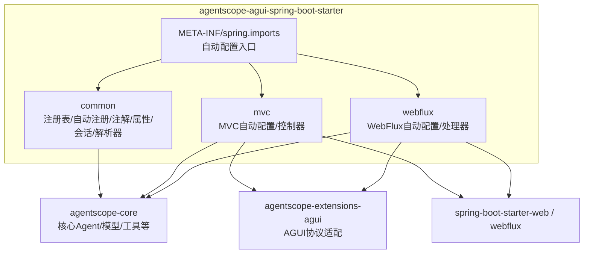
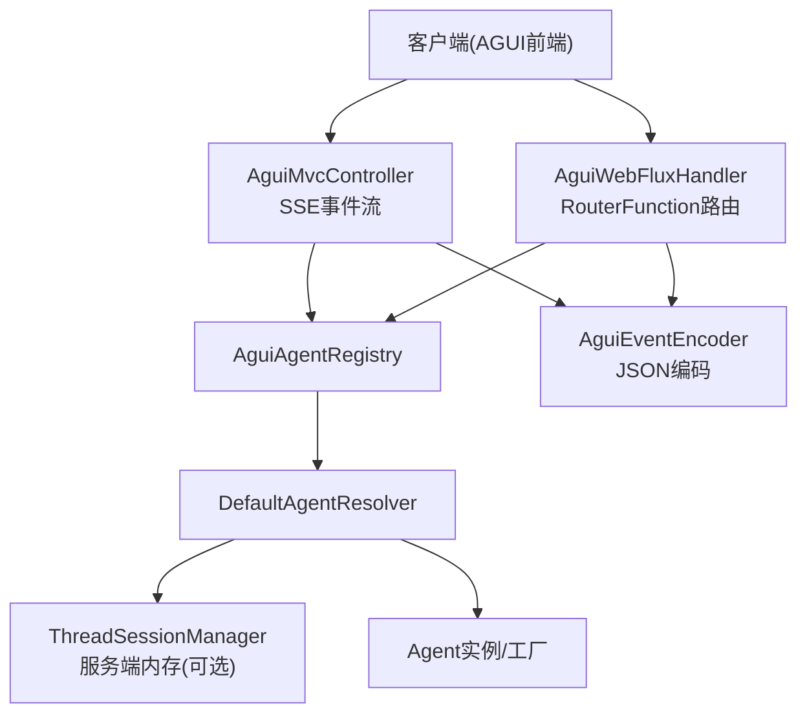
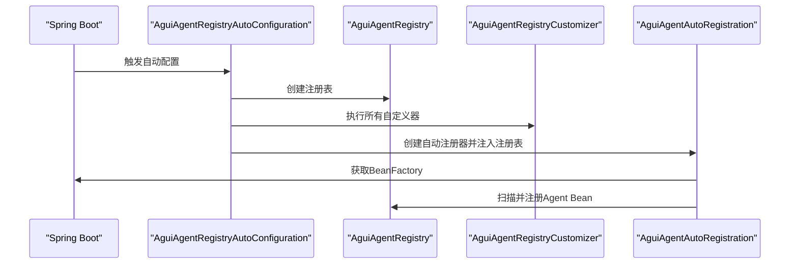
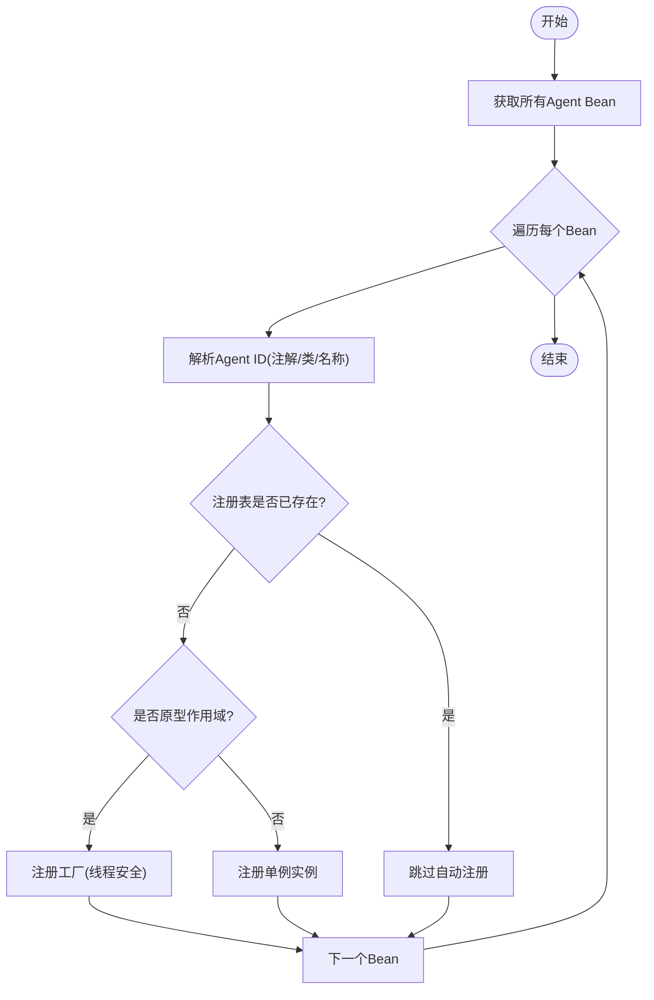
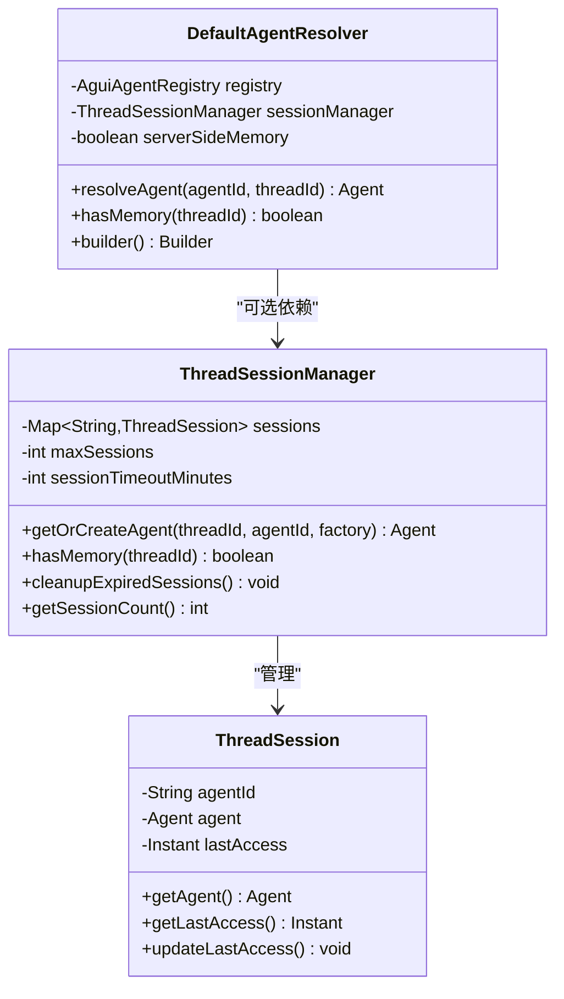
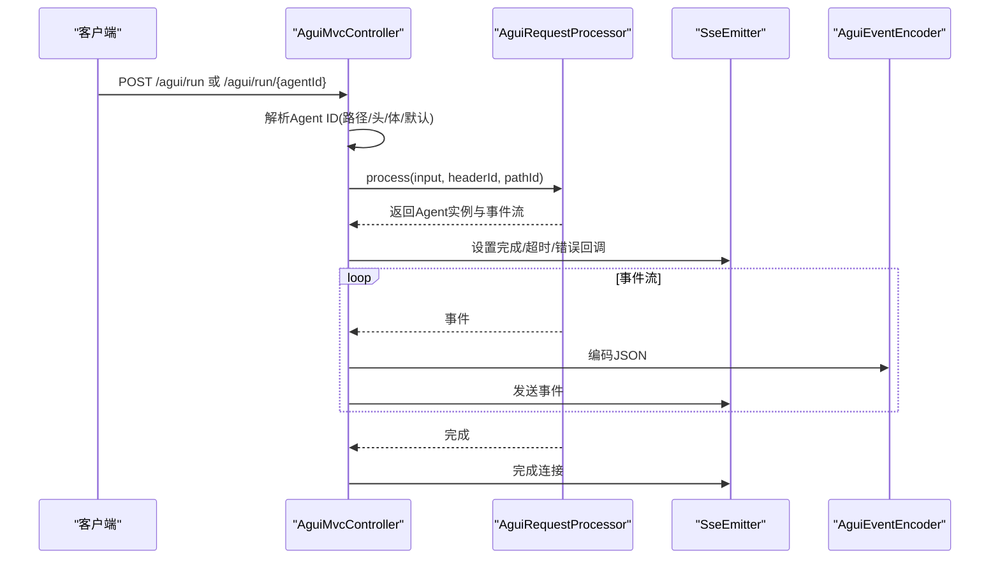
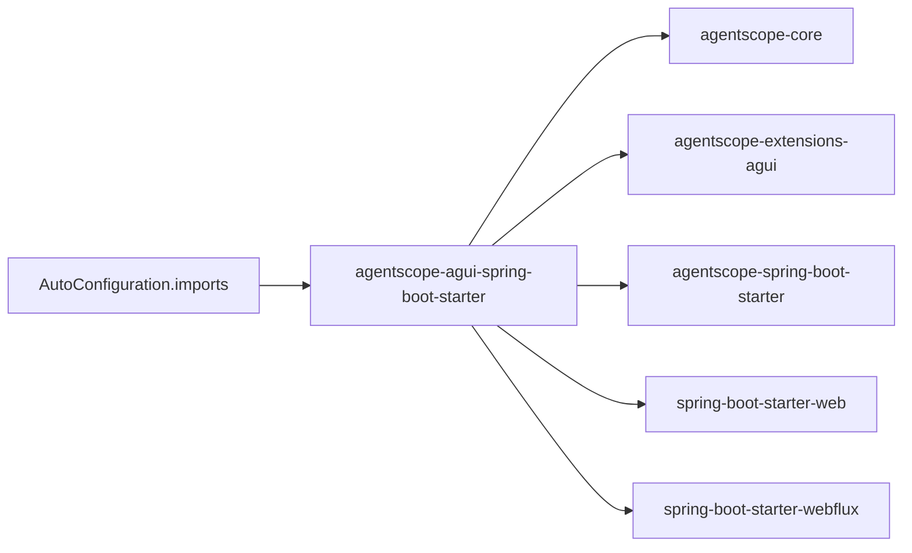

# AGUI集成Starter

<cite>
**本文档引用的文件**
- [AguiAgentRegistryAutoConfiguration.java](file://agentscope-extensions/agentscope-spring-boot-starters/agentscope-agui-spring-boot-starter/src/main/java/io/agentscope/spring/boot/agui/common/AguiAgentRegistryAutoConfiguration.java)
- [AguiAgentRegistryCustomizer.java](file://agentscope-extensions/agentscope-spring-boot-starters/agentscope-agui-spring-boot-starter/src/main/java/io/agentscope/spring/boot/agui/common/AguiAgentRegistryCustomizer.java)
- [AguiAgentAutoRegistration.java](file://agentscope-extensions/agentscope-spring-boot-starters/agentscope-agui-spring-boot-starter/src/main/java/io/agentscope/spring/boot/agui/common/AguiAgentAutoRegistration.java)
- [AguiAgentId.java](file://agentscope-extensions/agentscope-spring-boot-starters/agentscope-agui-spring-boot-starter/src/main/java/io/agentscope/spring/boot/agui/common/AguiAgentId.java)
- [AguiProperties.java](file://agentscope-extensions/agentscope-spring-boot-starters/agentscope-agui-spring-boot-starter/src/main/java/io/agentscope/spring/boot/agui/common/AguiProperties.java)
- [DefaultAgentResolver.java](file://agentscope-extensions/agentscope-spring-boot-starters/agentscope-agui-spring-boot-starter/src/main/java/io/agentscope/spring/boot/agui/common/DefaultAgentResolver.java)
- [ThreadSessionManager.java](file://agentscope-extensions/agentscope-spring-boot-starters/agentscope-agui-spring-boot-starter/src/main/java/io/agentscope/spring/boot/agui/common/ThreadSessionManager.java)
- [AgentscopeAguiMvcAutoConfiguration.java](file://agentscope-extensions/agentscope-spring-boot-starters/agentscope-agui-spring-boot-starter/src/main/java/io/agentscope/spring/boot/agui/mvc/AgentscopeAguiMvcAutoConfiguration.java)
- [AguiMvcController.java](file://agentscope-extensions/agentscope-spring-boot-starters/agentscope-agui-spring-boot-starter/src/main/java/io/agentscope/spring/boot/agui/mvc/AguiMvcController.java)
- [AgentscopeAguiWebFluxAutoConfiguration.java](file://agentscope-extensions/agentscope-spring-boot-starters/agentscope-agui-spring-boot-starter/src/main/java/io/agentscope/spring/boot/agui/webflux/AgentscopeAguiWebFluxAutoConfiguration.java)
- [AguiWebFluxHandler.java](file://agentscope-extensions/agentscope-spring-boot-starters/agentscope-agui-spring-boot-starter/src/main/java/io/agentscope/spring/boot/agui/webflux/AguiWebFluxHandler.java)
- [org.springframework.boot.autoconfigure.AutoConfiguration.imports](file://agentscope-extensions/agentscope-spring-boot-starters/agentscope-agui-spring-boot-starter/src/main/resources/META-INF/spring/org.springframework.boot.autoconfigure.AutoConfiguration.imports)
- [pom.xml](file://agentscope-extensions/agentscope-spring-boot-starters/agentscope-agui-spring-boot-starter/pom.xml)
- [AguiAgentRegistryAutoConfigurationTest.java](file://agentscope-extensions/agentscope-spring-boot-starters/agentscope-agui-spring-boot-starter/src/test/java/io/agentscope/spring/boot/agui/common/AguiAgentRegistryAutoConfigurationTest.java)
</cite>

## 目录
1. [简介](#简介)
2. [项目结构](#项目结构)
3. [核心组件](#核心组件)
4. [架构总览](#架构总览)
5. [详细组件分析](#详细组件分析)
6. [依赖关系分析](#依赖关系分析)
7. [性能考虑](#性能考虑)
8. [故障排除指南](#故障排除指南)
9. [结论](#结论)
10. [附录](#附录)

## 简介
本文件面向希望在Spring Boot应用中快速集成AgentScope AGUI协议的开发者，系统性阐述agentscope-agui-spring-boot-starter的自动配置机制与运行时行为。重点覆盖以下方面：
- 自动配置入口与条件装配：如何通过AutoConfiguration自动暴露Agent注册表、自动注册Agent Bean、以及根据Web类型（Servlet/WebFlux）选择对应的控制器或路由。
- AGUI代理注册表初始化流程：从注册表创建到自定义器执行，再到自动扫描注册Agent Bean的完整链路。
- 注册表管理与生命周期控制：支持单例与原型两种作用域的Agent注册；结合线程会话管理实现服务端内存（会话级状态保留）。
- 协议适配与消息转换：基于SSE事件编码器将内部事件序列化为JSON并推送；WebFlux模式下的RouterFunction路由。
- 集成示例与最佳实践：代理注册配置、自定义注册器实现、客户端连接参数设置。
- 错误处理策略与调试技巧：异常捕获、中断控制、超时处理、日志定位。

## 项目结构
该Starter位于agentscope-extensions子模块下，采用按功能分层的包组织方式：
- common：通用组件（注册表、自动注册、注解、属性、会话管理、默认解析器）
- mvc：基于Spring MVC的控制器与自动配置
- webflux：基于Spring WebFlux的处理器与路由
- resources/META-INF/spring：Spring Boot自动配置导入清单

**图表来源**
- [org.springframework.boot.autoconfigure.AutoConfiguration.imports:1-4](file://agentscope-extensions/agentscope-spring-boot-starters/agentscope-agui-spring-boot-starter/src/main/resources/META-INF/spring/org.springframework.boot.autoconfigure.AutoConfiguration.imports#L1-L4)
- [pom.xml:36-92](file://agentscope-extensions/agentscope-spring-boot-starters/agentscope-agui-spring-boot-starter/pom.xml#L36-L92)

**章节来源**
- [org.springframework.boot.autoconfigure.AutoConfiguration.imports:1-4](file://agentscope-extensions/agentscope-spring-boot-starters/agentscope-agui-spring-boot-starter/src/main/resources/META-INF/spring/org.springframework.boot.autoconfigure.AutoConfiguration.imports#L1-L4)
- [pom.xml:36-92](file://agentscope-extensions/agentscope-spring-boot-starters/agentscope-agui-spring-boot-starter/pom.xml#L36-L92)

## 核心组件
- 自动配置入口
  - AguiAgentRegistryAutoConfiguration：创建AguiAgentRegistry与AguiAgentAutoRegistration Bean，并通过ObjectProvider执行自定义器。
  - AgentscopeAguiMvcAutoConfiguration：在Servlet Web环境中创建ThreadSessionManager、AguiMvcController与AguiRestController。
  - AgentscopeAguiWebFluxAutoConfiguration：在Reactive Web环境中创建ThreadSessionManager、AguiWebFluxHandler与RouterFunction。
- 注册表与自动注册
  - AguiAgentRegistry：集中管理Agent实例或工厂。
  - AguiAgentAutoRegistration：扫描上下文中的Agent Bean，按优先级解析Agent ID并注册；支持单例与原型作用域。
  - AguiAgentRegistryCustomizer：允许外部扩展注册工厂或自定义注册表。
  - AguiAgentId：用于在@Bean方法或类上指定自定义Agent ID。
- 会话与解析
  - ThreadSessionManager：按threadId维护Agent会话池，支持容量上限与超时清理，配合服务端内存模式。
  - DefaultAgentResolver：封装Agent解析逻辑，支持简单模式与服务端内存模式。
- 控制器与处理器
  - AguiMvcController：接收RunAgentInput，解析Agent ID，启动请求处理并通过SseEmitter推送事件。
  - AguiWebFluxHandler：接收ServerRequest，解析Agent ID，返回ServerResponse流式响应。
- 配置属性
  - AguiProperties：统一管理路径前缀、CORS、运行超时、工具合并策略、推理输出开关、默认Agent ID、会话内存、SSE超时等。

**章节来源**
- [AguiAgentRegistryAutoConfiguration.java:37-72](file://agentscope-extensions/agentscope-spring-boot-starters/agentscope-agui-spring-boot-starter/src/main/java/io/agentscope/spring/boot/agui/common/AguiAgentRegistryAutoConfiguration.java#L37-L72)
- [AguiAgentRegistryCustomizer.java:21-56](file://agentscope-extensions/agentscope-spring-boot-starters/agentscope-agui-spring-boot-starter/src/main/java/io/agentscope/spring/boot/agui/common/AguiAgentRegistryCustomizer.java#L21-L56)
- [AguiAgentAutoRegistration.java:32-74](file://agentscope-extensions/agentscope-spring-boot-starters/agentscope-agui-spring-boot-starter/src/main/java/io/agentscope/spring/boot/agui/common/AguiAgentAutoRegistration.java#L32-L74)
- [AguiAgentId.java:24-58](file://agentscope-extensions/agentscope-spring-boot-starters/agentscope-agui-spring-boot-starter/src/main/java/io/agentscope/spring/boot/agui/common/AguiAgentId.java#L24-L58)
- [ThreadSessionManager.java:29-50](file://agentscope-extensions/agentscope-spring-boot-starters/agentscope-agui-spring-boot-starter/src/main/java/io/agentscope/spring/boot/agui/common/ThreadSessionManager.java#L29-L50)
- [DefaultAgentResolver.java:24-32](file://agentscope-extensions/agentscope-spring-boot-starters/agentscope-agui-spring-boot-starter/src/main/java/io/agentscope/spring/boot/agui/common/DefaultAgentResolver.java#L24-L32)
- [AgentscopeAguiMvcAutoConfiguration.java:32-44](file://agentscope-extensions/agentscope-spring-boot-starters/agentscope-agui-spring-boot-starter/src/main/java/io/agentscope/spring/boot/agui/mvc/AgentscopeAguiMvcAutoConfiguration.java#L32-L44)
- [AgentscopeAguiWebFluxAutoConfiguration.java:34-47](file://agentscope-extensions/agentscope-spring-boot-starters/agentscope-agui-spring-boot-starter/src/main/java/io/agentscope/spring/boot/agui/webflux/AgentscopeAguiWebFluxAutoConfiguration.java#L34-L47)
- [AguiMvcController.java:37-60](file://agentscope-extensions/agentscope-spring-boot-starters/agentscope-agui-spring-boot-starter/src/main/java/io/agentscope/spring/boot/agui/mvc/AguiMvcController.java#L37-L60)
- [AguiProperties.java:23-42](file://agentscope-extensions/agentscope-spring-boot-starters/agentscope-agui-spring-boot-starter/src/main/java/io/agentscope/spring/boot/agui/common/AguiProperties.java#L23-L42)

## 架构总览
Starter通过Spring Boot的条件装配，在存在相应类与Web环境时自动暴露控制器或处理器，并将Agent注册表与会话管理注入其中。整体交互如下：

**图表来源**
- [AgentscopeAguiMvcAutoConfiguration.java:58-95](file://agentscope-extensions/agentscope-spring-boot-starters/agentscope-agui-spring-boot-starter/src/main/java/io/agentscope/spring/boot/agui/mvc/AgentscopeAguiMvcAutoConfiguration.java#L58-L95)
- [AgentscopeAguiWebFluxAutoConfiguration.java:76-97](file://agentscope-extensions/agentscope-spring-boot-starters/agentscope-agui-spring-boot-starter/src/main/java/io/agentscope/spring/boot/agui/webflux/AgentscopeAguiWebFluxAutoConfiguration.java#L76-L97)
- [AguiMvcController.java:73-92](file://agentscope-extensions/agentscope-spring-boot-starters/agentscope-agui-spring-boot-starter/src/main/java/io/agentscope/spring/boot/agui/mvc/AguiMvcController.java#L73-L92)
- [DefaultAgentResolver.java:33-62](file://agentscope-extensions/agentscope-spring-boot-starters/agentscope-agui-spring-boot-starter/src/main/java/io/agentscope/spring/boot/agui/common/DefaultAgentResolver.java#L33-L62)
- [ThreadSessionManager.java:51-68](file://agentscope-extensions/agentscope-spring-boot-starters/agentscope-agui-spring-boot-starter/src/main/java/io/agentscope/spring/boot/agui/common/ThreadSessionManager.java#L51-L68)

## 详细组件分析

### 自动配置机制与注册表初始化
- 条件装配
  - 使用@ConditionalOnClass确保仅当核心类存在时才启用。
  - 使用@ConditionalOnMissingBean避免与用户自定义Bean冲突。
- 注册表创建
  - 通过ObjectProvider收集所有AguiAgentRegistryCustomizer，逐个执行customize(registry)，实现外部扩展点。
- 自动注册Agent
  - AguiAgentAutoRegistration在afterPropertiesSet阶段扫描Agent Bean，解析Agent ID优先级（注解 > Bean名称），按作用域注册（单例直接注册，原型注册工厂）。

**图表来源**
- [AguiAgentRegistryAutoConfiguration.java:52-71](file://agentscope-extensions/agentscope-spring-boot-starters/agentscope-agui-spring-boot-starter/src/main/java/io/agentscope/spring/boot/agui/common/AguiAgentRegistryAutoConfiguration.java#L52-L71)
- [AguiAgentAutoRegistration.java:104-141](file://agentscope-extensions/agentscope-spring-boot-starters/agentscope-agui-spring-boot-starter/src/main/java/io/agentscope/spring/boot/agui/common/AguiAgentAutoRegistration.java#L104-L141)

**章节来源**
- [AguiAgentRegistryAutoConfiguration.java:37-72](file://agentscope-extensions/agentscope-spring-boot-starters/agentscope-agui-spring-boot-starter/src/main/java/io/agentscope/spring/boot/agui/common/AguiAgentRegistryAutoConfiguration.java#L37-L72)
- [AguiAgentAutoRegistration.java:32-74](file://agentscope-extensions/agentscope-spring-boot-starters/agentscope-agui-spring-boot-starter/src/main/java/io/agentscope/spring/boot/agui/common/AguiAgentAutoRegistration.java#L32-L74)

### 代理发现机制与注册表管理
- Agent ID解析优先级
  - 方法级@AguiAgentId注解 > 类级@AguiAgentId注解 > Bean名称（默认）。
- 作用域处理
  - 单例：直接注册Agent实例。
  - 原型：注册工厂，保证线程安全与按需创建。
- 冲突处理
  - 若注册表已存在同名Agent ID，则跳过自动注册（手动注册优先级更高）。

**图表来源**
- [AguiAgentAutoRegistration.java:104-141](file://agentscope-extensions/agentscope-spring-boot-starters/agentscope-agui-spring-boot-starter/src/main/java/io/agentscope/spring/boot/agui/common/AguiAgentAutoRegistration.java#L104-L141)
- [AguiAgentId.java:24-58](file://agentscope-extensions/agentscope-spring-boot-starters/agentscope-agui-spring-boot-starter/src/main/java/io/agentscope/spring/boot/agui/common/AguiAgentId.java#L24-L58)

**章节来源**
- [AguiAgentAutoRegistration.java:149-188](file://agentscope-extensions/agentscope-spring-boot-starters/agentscope-agui-spring-boot-starter/src/main/java/io/agentscope/spring/boot/agui/common/AguiAgentAutoRegistration.java#L149-L188)
- [AguiAgentId.java:24-58](file://agentscope-extensions/agentscope-spring-boot-starters/agentscope-agui-spring-boot-starter/src/main/java/io/agentscope/spring/boot/agui/common/AguiAgentId.java#L24-L58)

### 生命周期控制与服务端内存
- 默认解析器
  - 支持两种模式：简单模式（每次请求新建Agent）与服务端内存模式（按threadId复用Agent实例并保留历史）。
- 会话管理
  - 维护并发安全的会话映射，支持最大会话数与超时清理；当容量满时清理过期或移除最旧会话。
- 解析器构建
  - 提供Builder以注入注册表、会话管理器与服务端内存开关。

**图表来源**
- [DefaultAgentResolver.java:33-99](file://agentscope-extensions/agentscope-spring-boot-starters/agentscope-agui-spring-boot-starter/src/main/java/io/agentscope/spring/boot/agui/common/DefaultAgentResolver.java#L33-L99)
- [ThreadSessionManager.java:51-116](file://agentscope-extensions/agentscope-spring-boot-starters/agentscope-agui-spring-boot-starter/src/main/java/io/agentscope/spring/boot/agui/common/ThreadSessionManager.java#L51-L116)

**章节来源**
- [DefaultAgentResolver.java:24-91](file://agentscope-extensions/agentscope-spring-boot-starters/agentscope-agui-spring-boot-starter/src/main/java/io/agentscope/spring/boot/agui/common/DefaultAgentResolver.java#L24-L91)
- [ThreadSessionManager.java:29-116](file://agentscope-extensions/agentscope-spring-boot-starters/agentscope-agui-spring-boot-starter/src/main/java/io/agentscope/spring/boot/agui/common/ThreadSessionManager.java#L29-L116)

### MVC与WebFlux集成
- MVC
  - 在Servlet环境下创建ThreadSessionManager、AguiMvcController与AguiRestController，使用SseEmitter推送事件。
  - 支持路径变量路由（可选），Agent ID解析顺序：路径变量 > 请求头 > 请求体转发字段 > 默认值。
- WebFlux
  - 在Reactive环境下创建ThreadSessionManager、AguiWebFluxHandler与RouterFunction，提供POST /agui/run与可选的POST /agui/run/{agentId}路由。
- 配置属性
  - 通过@EnableConfigurationProperties启用AguiProperties，统一管理路径前缀、CORS、超时、工具合并策略、推理输出等。

**图表来源**
- [AgentscopeAguiMvcAutoConfiguration.java:73-95](file://agentscope-extensions/agentscope-spring-boot-starters/agentscope-agui-spring-boot-starter/src/main/java/io/agentscope/spring/boot/agui/mvc/AgentscopeAguiMvcAutoConfiguration.java#L73-L95)
- [AguiMvcController.java:118-189](file://agentscope-extensions/agentscope-spring-boot-starters/agentscope-agui-spring-boot-starter/src/main/java/io/agentscope/spring/boot/agui/mvc/AguiMvcController.java#L118-L189)

**章节来源**
- [AgentscopeAguiMvcAutoConfiguration.java:32-112](file://agentscope-extensions/agentscope-spring-boot-starters/agentscope-agui-spring-boot-starter/src/main/java/io/agentscope/spring/boot/agui/mvc/AgentscopeAguiMvcAutoConfiguration.java#L32-L112)
- [AgentscopeAguiWebFluxAutoConfiguration.java:34-128](file://agentscope-extensions/agentscope-spring-boot-starters/agentscope-agui-spring-boot-starter/src/main/java/io/agentscope/spring/boot/agui/webflux/AgentscopeAguiWebFluxAutoConfiguration.java#L34-L128)
- [AguiMvcController.java:37-116](file://agentscope-extensions/agentscope-spring-boot-starters/agentscope-agui-spring-boot-starter/src/main/java/io/agentscope/spring/boot/agui/mvc/AguiMvcController.java#L37-L116)

### 协议适配、消息转换器与错误处理
- 协议适配
  - 通过AguiAdapterConfig传递工具合并策略、运行超时、事件发射开关、推理输出开关、默认Agent ID等。
- 消息转换
  - 使用AguiEventEncoder将事件对象编码为JSON字符串，通过SseEmitter发送。
- 错误处理
  - 捕获Agent未找到与通用异常，发送包含错误信息的Raw事件与RunFinished事件后完成连接。
  - 超时/错误时调用Agent.interrupt()中断正在运行的任务，避免资源泄漏。

**章节来源**
- [AgentscopeAguiMvcAutoConfiguration.java:77-85](file://agentscope-extensions/agentscope-spring-boot-starters/agentscope-agui-spring-boot-starter/src/main/java/io/agentscope/spring/boot/agui/mvc/AgentscopeAguiMvcAutoConfiguration.java#L77-L85)
- [AguiMvcController.java:191-218](file://agentscope-extensions/agentscope-spring-boot-starters/agentscope-agui-spring-boot-starter/src/main/java/io/agentscope/spring/boot/agui/mvc/AguiMvcController.java#L191-L218)

## 依赖关系分析
- 运行时依赖
  - agentscope-core：提供Agent、模型、工具等核心能力。
  - agentscope-extensions-agui：提供AGUI协议适配与事件模型。
  - agentscope-spring-boot-starter：提供Spring Boot集成基础能力。
  - spring-boot-starter-web/webflux：提供Web运行时（可选）。
- 自动配置导入
  - 通过META-INF/spring.imports声明三个自动配置类，由Spring Boot在启动时加载。

**图表来源**
- [pom.xml:36-92](file://agentscope-extensions/agentscope-spring-boot-starters/agentscope-agui-spring-boot-starter/pom.xml#L36-L92)
- [org.springframework.boot.autoconfigure.AutoConfiguration.imports:1-4](file://agentscope-extensions/agentscope-spring-boot-starters/agentscope-agui-spring-boot-starter/src/main/resources/META-INF/spring/org.springframework.boot.autoconfigure.AutoConfiguration.imports#L1-L4)

**章节来源**
- [pom.xml:36-92](file://agentscope-extensions/agentscope-spring-boot-starters/agentscope-agui-spring-boot-starter/pom.xml#L36-L92)
- [org.springframework.boot.autoconfigure.AutoConfiguration.imports:1-4](file://agentscope-extensions/agentscope-spring-boot-starters/agentscope-agui-spring-boot-starter/src/main/resources/META-INF/spring/org.springframework.boot.autoconfigure.AutoConfiguration.imports#L1-L4)

## 性能考虑
- 会话池容量与超时
  - 合理设置最大会话数与超时分钟数，避免内存占用过高；容量满时优先清理过期会话，必要时移除最旧会话。
- 线程模型
  - MVC模式使用缓存线程池执行请求处理，建议根据并发量调整线程池大小与SSE超时时间。
- 事件编码
  - JSON编码开销较小，注意避免在事件中传输超大负载数据块。
- 作用域选择
  - 对于高并发且无状态的Agent，优先使用原型作用域并通过工厂注册，减少共享状态带来的锁竞争。

[本节为通用指导，不直接分析具体文件]

## 故障排除指南
- 无法找到Agent
  - 检查是否正确注册了Agent（手动注册或自动注册），确认Agent ID解析顺序与传入的Agent ID一致。
  - 若启用服务端内存，确认threadId是否正确传递且会话池未被清理。
- SSE连接异常
  - 查看超时与错误回调日志，确认SSE超时配置合理；检查Agent运行超时与中断逻辑。
- 事件未到达前端
  - 确认CORS配置与路径前缀设置；检查事件编码与媒体类型。
- 并发问题
  - 原型作用域注册工厂应保证线程安全；服务端内存模式下避免在多线程间共享可变状态。

**章节来源**
- [AguiMvcController.java:134-152](file://agentscope-extensions/agentscope-spring-boot-starters/agentscope-agui-spring-boot-starter/src/main/java/io/agentscope/spring/boot/agui/mvc/AguiMvcController.java#L134-L152)
- [ThreadSessionManager.java:161-181](file://agentscope-extensions/agentscope-spring-boot-starters/agentscope-agui-spring-boot-starter/src/main/java/io/agentscope/spring/boot/agui/common/ThreadSessionManager.java#L161-L181)

## 结论
agentscope-agui-spring-boot-starter通过清晰的自动配置与职责分离，提供了从注册表初始化、代理自动发现、会话管理到协议适配与事件推送的一体化解决方案。开发者可通过自定义注册器扩展Agent注册，通过注解灵活命名Agent ID，并在MVC或WebFlux环境中以SSE或RouterFunction方式提供AGUI运行接口。配合合理的会话池配置与错误处理策略，可在生产环境中获得稳定、可观测且高性能的体验。

[本节为总结性内容，不直接分析具体文件]

## 附录

### 集成示例与最佳实践
- 添加Starter依赖
  - 引入agentscope-agui-spring-boot-starter，确保agentscope-core与agentscope-extensions-agui可用。
- 配置属性
  - 在application.yml中设置agentscope.agui.*相关属性，如路径前缀、CORS、运行超时、工具合并策略、推理输出开关、默认Agent ID、会话内存开关与SSE超时等。
- 注册Agent
  - 方式一：使用AguiAgentRegistryCustomizer在注册表中注册工厂或实例。
  - 方式二：在@Configuration中定义@Bean，必要时添加@AguiAgentId指定ID。
- 选择Web框架
  - Servlet：自动装配AguiMvcController与AguiRestController。
  - WebFlux：自动装配AguiWebFluxHandler与RouterFunction。
- 客户端连接
  - MVC：向POST /{pathPrefix}/run或可选的/{pathPrefix}/run/{agentId}发起请求。
  - WebFlux：向相同路径发起请求，接收Server-Sent Events流。

**章节来源**
- [AguiAgentRegistryCustomizer.java:21-36](file://agentscope-extensions/agentscope-spring-boot-starters/agentscope-agui-spring-boot-starter/src/main/java/io/agentscope/spring/boot/agui/common/AguiAgentRegistryCustomizer.java#L21-L36)
- [AguiAgentId.java:31-44](file://agentscope-extensions/agentscope-spring-boot-starters/agentscope-agui-spring-boot-starter/src/main/java/io/agentscope/spring/boot/agui/common/AguiAgentId.java#L31-L44)
- [AgentscopeAguiMvcAutoConfiguration.java:97-110](file://agentscope-extensions/agentscope-spring-boot-starters/agentscope-agui-spring-boot-starter/src/main/java/io/agentscope/spring/boot/agui/mvc/AgentscopeAguiMvcAutoConfiguration.java#L97-L110)
- [AgentscopeAguiWebFluxAutoConfiguration.java:113-126](file://agentscope-extensions/agentscope-spring-boot-starters/agentscope-agui-spring-boot-starter/src/main/java/io/agentscope/spring/boot/agui/webflux/AgentscopeAguiWebFluxAutoConfiguration.java#L113-L126)
- [AguiProperties.java:23-42](file://agentscope-extensions/agentscope-spring-boot-starters/agentscope-agui-spring-boot-starter/src/main/java/io/agentscope/spring/boot/agui/common/AguiProperties.java#L23-L42)

### 测试参考
- 单元测试验证
  - 自动配置是否创建注册表与自动注册器。
  - 自定义注册器是否生效。
  - @AguiAgentId注解是否影响Agent ID解析。

**章节来源**
- [AguiAgentRegistryAutoConfigurationTest.java:41-79](file://agentscope-extensions/agentscope-spring-boot-starters/agentscope-agui-spring-boot-starter/src/test/java/io/agentscope/spring/boot/agui/common/AguiAgentRegistryAutoConfigurationTest.java#L41-L79)