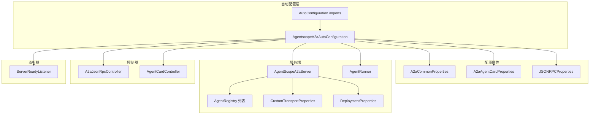
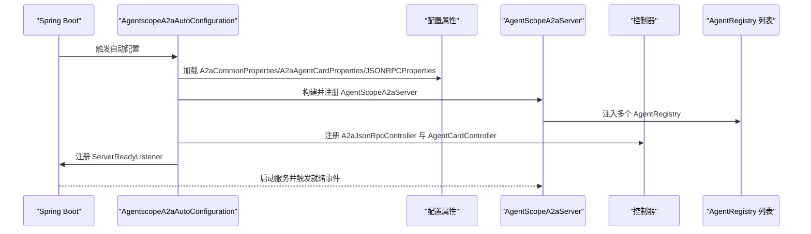
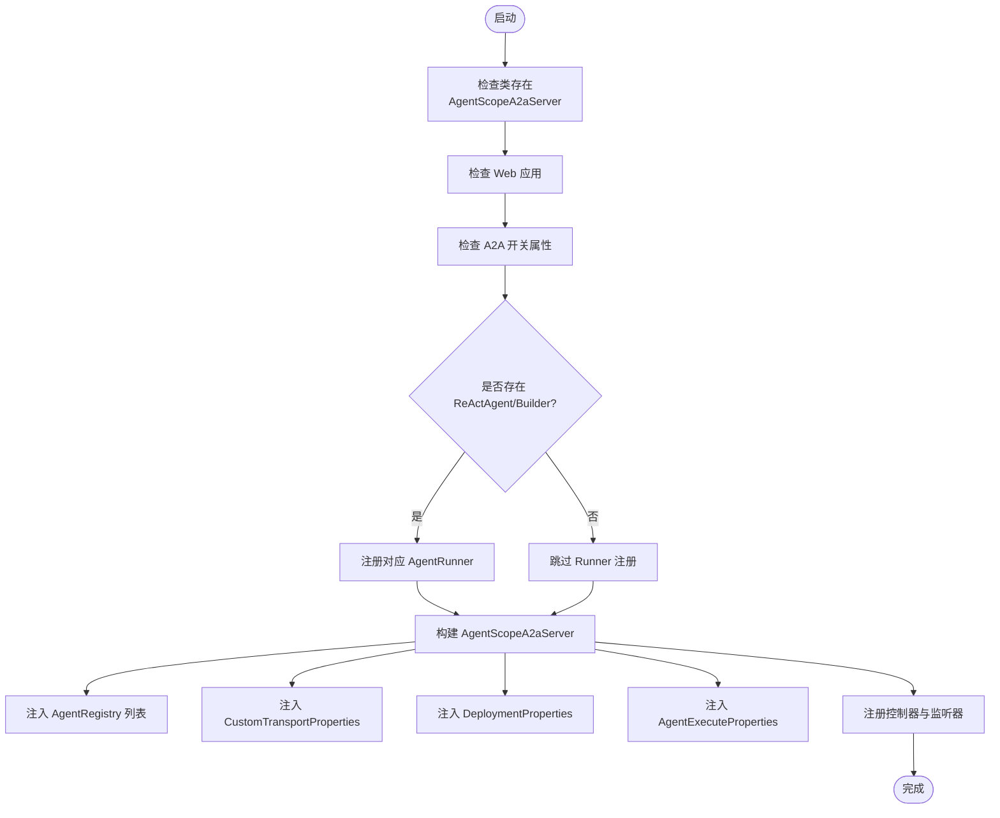
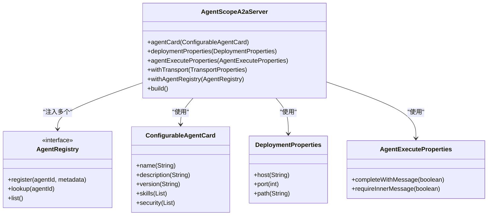
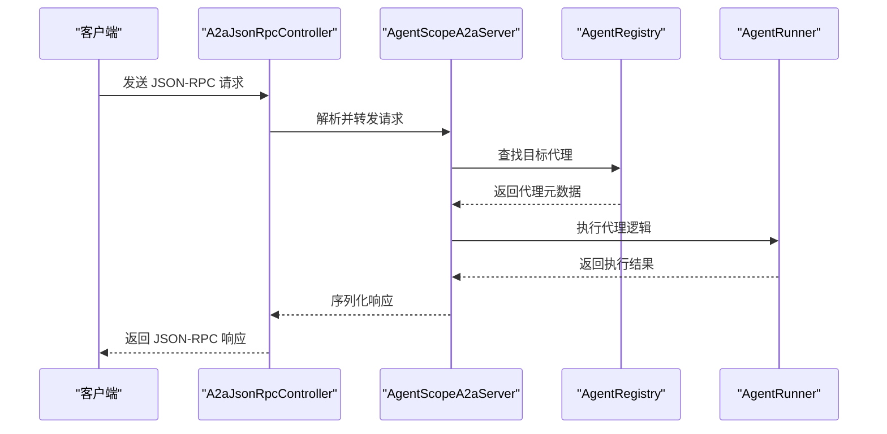
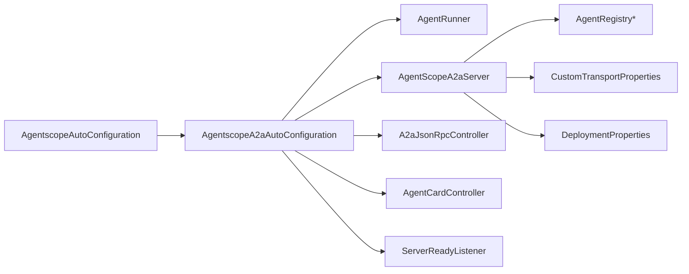

# Agent-to-Agent通信Starter

<cite>
**本文档引用的文件**
- [AgentscopeA2aAutoConfiguration.java](file://agentscope-extensions/agentscope-spring-boot-starters/agentscope-a2a-spring-boot-starter/src/main/java/io/agentscope/spring/boot/a2a/AgentscopeA2aAutoConfiguration.java)
- [AutoConfiguration.imports](file://agentscope-extensions/agentscope-spring-boot-starters/agentscope-a2a-spring-boot-starter/src/main/resources/META-INF/spring/org.springframework.boot.autoconfigure.AutoConfiguration.imports)
- [AgentscopeAutoConfiguration.java](file://agentscope-core/src/main/java/io/agentscope/core/AgentscopeAutoConfiguration.java)
- [AgentScopeA2aServer.java](file://agentscope-core/src/main/java/io/agentscope/core/a2a/server/AgentScopeA2aServer.java)
- [AgentRegistry.java](file://agentscope-core/src/main/java/io/agentscope/core/a2a/server/registry/AgentRegistry.java)
- [AgentRunner.java](file://agentscope-core/src/main/java/io/agentscope/core/a2a/server/executor/runner/AgentRunner.java)
- [ReActAgentWithStarterRunner.java](file://agentscope-extensions/agentscope-extensions-protocol/agentscope-extensions-agent-protocol/src/main/java/io/agentscope/extensions/agentprotocol/ReActAgentWithStarterRunner.java)
- [ReActAgentWithBuilderRunner.java](file://agentscope-extensions/agentscope-extensions-protocol/agentscope-extensions-agent-protocol/src/main/java/io/agentscope/extensions/agentprotocol/ReActAgentWithBuilderRunner.java)
- [A2aJsonRpcController.java](file://agentscope-extensions/agentscope-extensions-protocol/agentscope-extensions-a2a/src/main/java/io/agentscope/extensions/a2a/A2aJsonRpcController.java)
- [AgentCardController.java](file://agentscope-extensions/agentscope-extensions-protocol/agentscope-extensions-a2a/src/main/java/io/agentscope/extensions/a2a/AgentCardController.java)
- [ServerReadyListener.java](file://agentscope-extensions/agentscope-extensions-protocol/agentscope-extensions-a2a/src/main/java/io/agentscope/extensions/a2a/ServerReadyListener.java)
- [A2aAgentCardProperties.java](file://agentscope-extensions/agentscope-spring-boot-starters/agentscope-a2a-spring-boot-starter/src/main/java/io/agentscope/spring/boot/a2a/properties/A2aAgentCardProperties.java)
- [A2aCommonProperties.java](file://agentscope-extensions/agentscope-spring-boot-starters/agentscope-a2a-spring-boot-starter/src/main/java/io/agentscope/spring/boot/a2a/properties/A2aCommonProperties.java)
- [JSONRPCProperties.java](file://agentscope-extensions/agentscope-spring-boot-starters/agentscope-a2a-spring-boot-starter/src/main/java/io/agentscope/spring/boot/a2a/properties/JSONRPCProperties.java)
- [Constants.java](file://agentscope-extensions/agentscope-spring-boot-starters/agentscope-a2a-spring-boot-starter/src/main/java/io/agentscope/spring/boot/a2a/properties/Constants.java)
- [CustomTransportProperties.java](file://agentscope-core/src/main/java/io/agentscope/core/a2a/server/transport/CustomTransportProperties.java)
- [DeploymentProperties.java](file://agentscope-core/src/main/java/io/agentscope/core/a2a/server/transport/DeploymentProperties.java)
- [AgentExecuteProperties.java](file://agentscope-core/src/main/java/io/agentscope/core/a2a/server/executor/AgentExecuteProperties.java)
- [ConfigurableAgentCard.java](file://agentscope-core/src/main/java/io/agentscope/core/a2a/server/card/ConfigurableAgentCard.java)
- [ReActAgent.java](file://agentscope-core/src/main/java/io/agentscope/core/ReActAgent.java)
</cite>

## 目录
1. [简介](#简介)
2. [项目结构](#项目结构)
3. [核心组件](#核心组件)
4. [架构总览](#架构总览)
5. [详细组件分析](#详细组件分析)
6. [依赖关系分析](#依赖关系分析)
7. [性能考虑](#性能考虑)
8. [故障排查指南](#故障排查指南)
9. [结论](#结论)
10. [附录](#附录)

## 简介
本文件面向使用 AgentScope 的开发者，系统性阐述 Agent-to-Agent（A2A）通信 Spring Boot Starter 的自动配置机制与运行时行为。重点覆盖以下方面：
- 自动配置流程：从条件注解到 Bean 注册的完整链路
- 代理发现与注册表管理：如何在启动期构建可被外部调用的代理卡片与注册中心
- 核心通信能力：消息路由、状态同步与执行控制
- 通信 API 使用指南：代理注册接口、消息发送方法与回调处理
- 协议与传输：JSON-RPC 接口、消息序列化与网络传输优化
- 可靠性与安全：负载均衡、故障转移与安全通信配置
- 调试与监控：调试工具与关键性能指标

## 项目结构
A2A Starter 将自动配置逻辑集中在独立模块中，并通过 Spring Boot 的自动配置 SPI 进行装配。其核心文件组织如下：
- 自动配置入口：AgentscopeA2aAutoConfiguration
- 配置元数据：A2aCommonProperties、A2aAgentCardProperties、JSONRPCProperties
- 控制器层：A2aJsonRpcController、AgentCardController
- 事件监听：ServerReadyListener
- 传输与部署：CustomTransportProperties、DeploymentProperties
- 执行与注册：AgentRunner、AgentRegistry、AgentScopeA2aServer

图表来源
- [AgentscopeA2aAutoConfiguration.java:49-182](file://agentscope-extensions/agentscope-spring-boot-starters/agentscope-a2a-spring-boot-starter/src/main/java/io/agentscope/spring/boot/a2a/AgentscopeA2aAutoConfiguration.java#L49-L182)
- [AutoConfiguration.imports:16-16](file://agentscope-extensions/agentscope-spring-boot-starters/agentscope-a2a-spring-boot-starter/src/main/resources/META-INF/spring/org.springframework.boot.autoconfigure.AutoConfiguration.imports#L16-L16)

章节来源
- [AgentscopeA2aAutoConfiguration.java:49-182](file://agentscope-extensions/agentscope-spring-boot-starters/agentscope-a2a-spring-boot-starter/src/main/java/io/agentscope/spring/boot/a2a/AgentscopeA2aAutoConfiguration.java#L49-L182)
- [AutoConfiguration.imports:16-16](file://agentscope-extensions/agentscope-spring-boot-starters/agentscope-a2a-spring-boot-starter/src/main/resources/META-INF/spring/org.springframework.boot.autoconfigure.AutoConfiguration.imports#L16-L16)

## 核心组件
- 自动配置类：负责按条件加载 A2A 服务器、注册控制器与监听器，并基于属性构建传输与部署参数。
- 代理执行器：根据是否由 Starter 提供 ReActAgent 或由 Builder 构建，选择对应的 AgentRunner 实现。
- A2A 服务器：封装代理卡片、部署信息、执行策略与传输层，统一对外提供服务。
- 控制器层：暴露 JSON-RPC 与代理卡片查询等 HTTP 接口。
- 注册表与监听：支持多注册中心注入与服务就绪监听。

章节来源
- [AgentscopeA2aAutoConfiguration.java:68-135](file://agentscope-extensions/agentscope-spring-boot-starters/agentscope-a2a-spring-boot-starter/src/main/java/io/agentscope/spring/boot/a2a/AgentscopeA2aAutoConfiguration.java#L68-L135)
- [AgentScopeA2aServer.java](file://agentscope-core/src/main/java/io/agentscope/core/a2a/server/AgentScopeA2aServer.java)
- [AgentRunner.java](file://agentscope-core/src/main/java/io/agentscope/core/a2a/server/executor/runner/AgentRunner.java)

## 架构总览
下图展示 A2A Starter 在 Spring 上下文中的装配与运行时交互：

图表来源
- [AgentscopeA2aAutoConfiguration.java:84-135](file://agentscope-extensions/agentscope-spring-boot-starters/agentscope-a2a-spring-boot-starter/src/main/java/io/agentscope/spring/boot/a2a/AgentscopeA2aAutoConfiguration.java#L84-L135)
- [AgentScopeA2aServer.java](file://agentscope-core/src/main/java/io/agentscope/core/a2a/server/AgentScopeA2aServer.java)

## 详细组件分析

### 自动配置机制与初始化流程
- 条件装配
  - 仅当存在 AgentScopeA2aServer 类且 Web 应用生效时启用
  - 通过 A2A 开关属性进行启用/禁用控制
  - 当存在 ReActAgent 或其 Builder 时，分别注册对应的 AgentRunner
- 服务器构建
  - 基于 AgentRunner 构造 AgentScopeA2aServer
  - 组装 ConfigurableAgentCard、DeploymentProperties、AgentExecuteProperties
  - 收集 CustomTransportProperties 并应用到服务器
  - 注入所有 AgentRegistry 实例
- 控制器与监听
  - 注册 JSON-RPC 控制器与代理卡片控制器
  - 注册服务就绪监听器以执行后续动作

图表来源
- [AgentscopeA2aAutoConfiguration.java:61-135](file://agentscope-extensions/agentscope-spring-boot-starters/agentscope-a2a-spring-boot-starter/src/main/java/io/agentscope/spring/boot/a2a/AgentscopeA2aAutoConfiguration.java#L61-L135)

章节来源
- [AgentscopeA2aAutoConfiguration.java:61-135](file://agentscope-extensions/agentscope-spring-boot-starters/agentscope-a2a-spring-boot-starter/src/main/java/io/agentscope/spring/boot/a2a/AgentscopeA2aAutoConfiguration.java#L61-L135)

### 代理发现与注册表管理
- 多注册中心支持：通过注入 AgentRegistry 列表，实现跨注册中心的代理发现与聚合
- 代理卡片：ConfigurableAgentCard 提供名称、描述、版本、技能清单、安全方案等元数据
- 部署信息：DeploymentProperties 从环境变量读取主机、端口、上下文路径等
- 执行策略：AgentExecuteProperties 控制消息完成与内部消息要求等行为

图表来源
- [AgentScopeA2aServer.java](file://agentscope-core/src/main/java/io/agentscope/core/a2a/server/AgentScopeA2aServer.java)
- [AgentRegistry.java](file://agentscope-core/src/main/java/io/agentscope/core/a2a/server/registry/AgentRegistry.java)
- [ConfigurableAgentCard.java](file://agentscope-core/src/main/java/io/agentscope/core/a2a/server/card/ConfigurableAgentCard.java)
- [DeploymentProperties.java](file://agentscope-core/src/main/java/io/agentscope/core/a2a/server/transport/DeploymentProperties.java)
- [AgentExecuteProperties.java](file://agentscope-core/src/main/java/io/agentscope/core/a2a/server/executor/AgentExecuteProperties.java)

章节来源
- [AgentscopeA2aAutoConfiguration.java:84-109](file://agentscope-extensions/agentscope-spring-boot-starters/agentscope-a2a-spring-boot-starter/src/main/java/io/agentscope/spring/boot/a2a/AgentscopeA2aAutoConfiguration.java#L84-L109)

### 通信API使用指南
- 代理注册接口
  - 通过 AgentRegistry 注册代理元数据；注册后可通过代理卡片与 JSON-RPC 接口访问
- 消息发送方法
  - JSON-RPC 控制器提供远程调用入口，客户端通过标准 JSON-RPC 2.0 方法名调用
- 回调处理机制
  - 服务器就绪监听器在服务启动完成后触发，可用于初始化或通知下游

图表来源
- [A2aJsonRpcController.java](file://agentscope-extensions/agentscope-extensions-protocol/agentscope-extensions-a2a/src/main/java/io/agentscope/extensions/a2a/A2aJsonRpcController.java)
- [AgentScopeA2aServer.java](file://agentscope-core/src/main/java/io/agentscope/core/a2a/server/AgentScopeA2aServer.java)
- [AgentRegistry.java](file://agentscope-core/src/main/java/io/agentscope/core/a2a/server/registry/AgentRegistry.java)
- [AgentRunner.java](file://agentscope-core/src/main/java/io/agentscope/core/a2a/server/executor/runner/AgentRunner.java)

章节来源
- [A2aJsonRpcController.java](file://agentscope-extensions/agentscope-extensions-protocol/agentscope-extensions-a2a/src/main/java/io/agentscope/extensions/a2a/A2aJsonRpcController.java)
- [ServerReadyListener.java](file://agentscope-extensions/agentscope-extensions-protocol/agentscope-extensions-a2a/src/main/java/io/agentscope/extensions/a2a/ServerReadyListener.java)

### 通信协议设计、消息序列化与传输优化
- 协议设计
  - 采用 JSON-RPC 2.0 作为统一通信协议，便于跨语言与跨平台互操作
- 消息序列化
  - 基于通用 JSON 序列化框架，确保消息格式稳定与兼容
- 传输优化
  - 通过 CustomTransportProperties 动态配置传输参数，结合 DeploymentProperties 定义的服务地址与上下文路径，减少不必要的网络往返
  - 支持多注册中心与多传输实例，提升可用性与扩展性

章节来源
- [AgentscopeA2aAutoConfiguration.java:100-107](file://agentscope-extensions/agentscope-spring-boot-starters/agentscope-a2a-spring-boot-starter/src/main/java/io/agentscope/spring/boot/a2a/AgentscopeA2aAutoConfiguration.java#L100-L107)
- [CustomTransportProperties.java](file://agentscope-core/src/main/java/io/agentscope/core/a2a/server/transport/CustomTransportProperties.java)
- [DeploymentProperties.java](file://agentscope-core/src/main/java/io/agentscope/core/a2a/server/transport/DeploymentProperties.java)

### 负载均衡策略、故障转移机制与安全通信配置
- 负载均衡
  - 结合多注册中心与多传输实例，可在不同传输层之间分发请求
- 故障转移
  - 通过注册中心的健康检查与降级策略，实现故障节点的快速剔除与流量切换
- 安全通信
  - 代理卡片的安全方案字段用于声明支持的安全机制；结合传输层配置可启用 TLS/认证等

章节来源
- [ConfigurableAgentCard.java](file://agentscope-core/src/main/java/io/agentscope/core/a2a/server/card/ConfigurableAgentCard.java)
- [CustomTransportProperties.java](file://agentscope-core/src/main/java/io/agentscope/core/a2a/server/transport/CustomTransportProperties.java)

## 依赖关系分析
- 自动配置依赖
  - 依赖核心自动配置类以确保 AgentScope 基础设施已准备就绪
  - 依赖 A2A 服务器类与 Web 应用类型
- Bean 依赖
  - AgentRunner 依赖 ReActAgent 或其 Builder
  - AgentScopeA2aServer 依赖 AgentRunner、AgentRegistry 列表、传输与部署属性
  - 控制器依赖 AgentScopeA2aServer
  - 监听器依赖 AgentScopeA2aServer

图表来源
- [AgentscopeAutoConfiguration.java](file://agentscope-core/src/main/java/io/agentscope/core/AgentscopeAutoConfiguration.java)
- [AgentscopeA2aAutoConfiguration.java:55-67](file://agentscope-extensions/agentscope-spring-boot-starters/agentscope-a2a-spring-boot-starter/src/main/java/io/agentscope/spring/boot/a2a/AgentscopeA2aAutoConfiguration.java#L55-L67)

章节来源
- [AgentscopeA2aAutoConfiguration.java:55-67](file://agentscope-extensions/agentscope-spring-boot-starters/agentscope-a2a-spring-boot-starter/src/main/java/io/agentscope/spring/boot/a2a/AgentscopeA2aAutoConfiguration.java#L55-L67)

## 性能考虑
- 启动阶段
  - 仅在满足条件时创建 Bean，避免无谓的资源占用
  - 通过环境变量与属性配置延迟初始化传输与注册中心
- 运行阶段
  - 复用 AgentRunner 与注册中心实例，减少对象创建开销
  - 合理设置执行策略与传输参数，降低序列化与网络传输成本
- 可观测性
  - 通过就绪监听器输出服务状态，便于集成监控系统

## 故障排查指南
- 无法启动 A2A 服务
  - 检查 A2A 开关属性是否启用
  - 确认已引入 A2A 服务器类与 Web 应用类型
- 代理不可见或无法调用
  - 检查代理卡片配置与注册中心是否正确注册
  - 确认 JSON-RPC 控制器已注册并可访问
- 传输异常
  - 检查传输属性与部署信息是否匹配实际网络环境
  - 关注就绪监听器日志，确认服务已成功启动

章节来源
- [AgentscopeA2aAutoConfiguration.java:61-67](file://agentscope-extensions/agentscope-spring-boot-starters/agentscope-a2a-spring-boot-starter/src/main/java/io/agentscope/spring/boot/a2a/AgentscopeA2aAutoConfiguration.java#L61-L67)
- [ServerReadyListener.java](file://agentscope-extensions/agentscope-extensions-protocol/agentscope-extensions-a2a/src/main/java/io/agentscope/extensions/a2a/ServerReadyListener.java)

## 结论
A2A Starter 通过精简而明确的自动配置机制，将代理发现、消息路由与状态同步等能力无缝集成到 Spring Boot 应用中。借助可插拔的注册中心、灵活的传输配置与标准的 JSON-RPC 协议，开发者可以快速构建高可用、易扩展的代理间通信体系。

## 附录
- 配置属性参考
  - A2aCommonProperties：通用执行策略与行为开关
  - A2aAgentCardProperties：代理卡片元数据与安全方案
  - JSONRPCProperties：JSON-RPC 传输相关配置
- 关键类与职责
  - AgentScopeA2aServer：A2A 服务核心容器
  - AgentRunner：代理执行器抽象
  - AgentRegistry：代理注册与发现接口
  - A2aJsonRpcController：JSON-RPC 入口控制器
  - AgentCardController：代理卡片查询控制器
  - ServerReadyListener：服务就绪监听器

章节来源
- [A2aCommonProperties.java](file://agentscope-extensions/agentscope-spring-boot-starters/agentscope-a2a-spring-boot-starter/src/main/java/io/agentscope/spring/boot/a2a/properties/A2aCommonProperties.java)
- [A2aAgentCardProperties.java](file://agentscope-extensions/agentscope-spring-boot-starters/agentscope-a2a-spring-boot-starter/src/main/java/io/agentscope/spring/boot/a2a/properties/A2aAgentCardProperties.java)
- [JSONRPCProperties.java](file://agentscope-extensions/agentscope-spring-boot-starters/agentscope-a2a-spring-boot-starter/src/main/java/io/agentscope/spring/boot/a2a/properties/JSONRPCProperties.java)
- [Constants.java](file://agentscope-extensions/agentscope-spring-boot-starters/agentscope-a2a-spring-boot-starter/src/main/java/io/agentscope/spring/boot/a2a/properties/Constants.java)