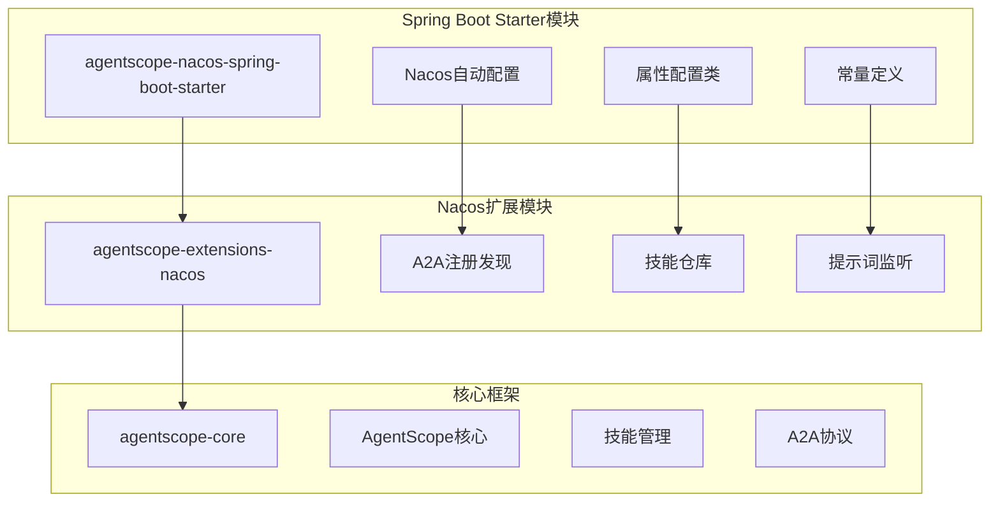
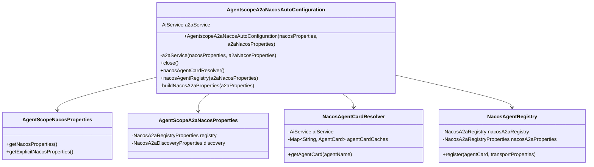
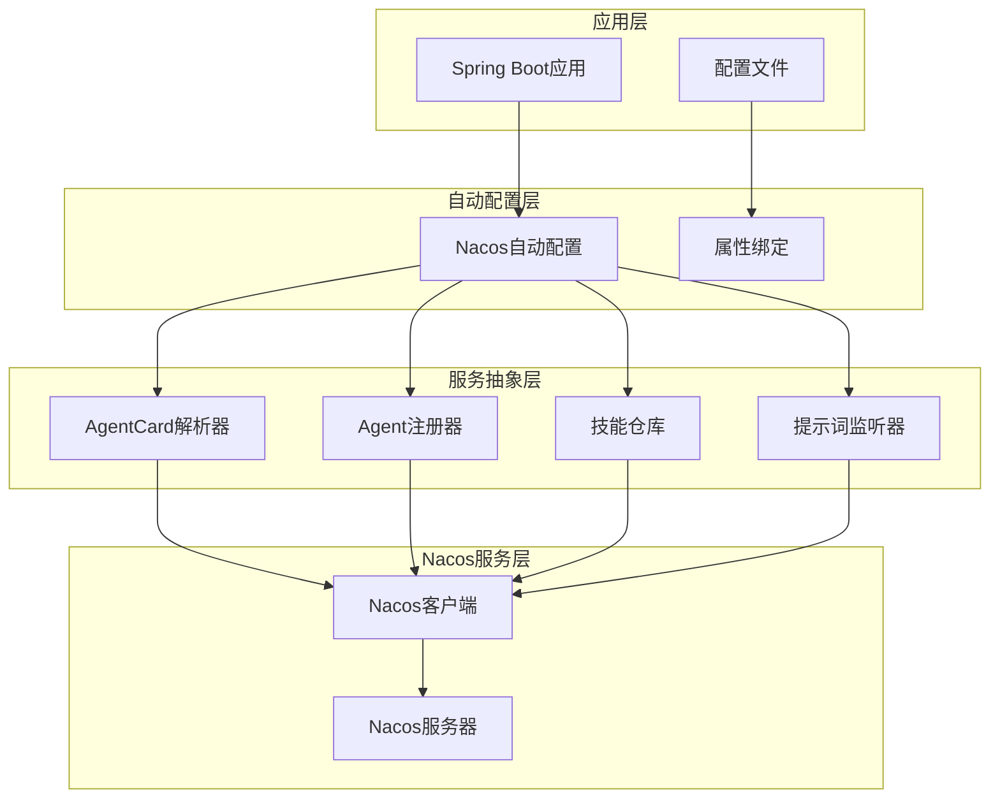
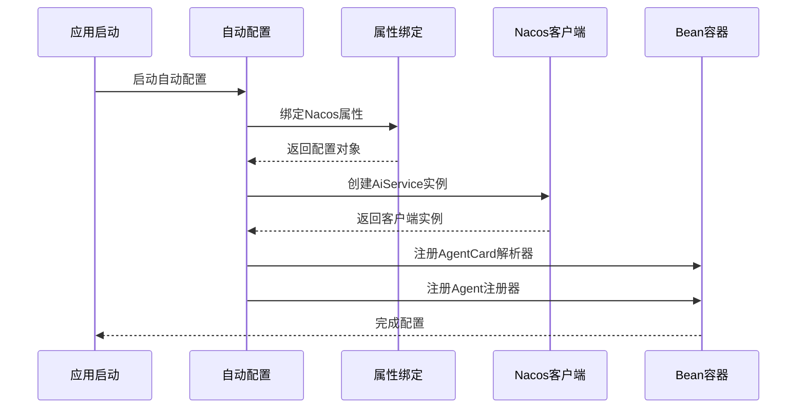
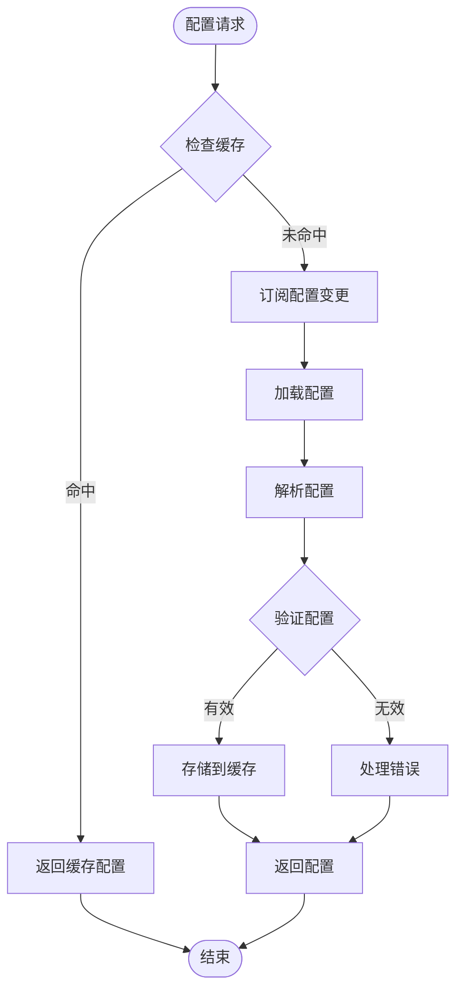
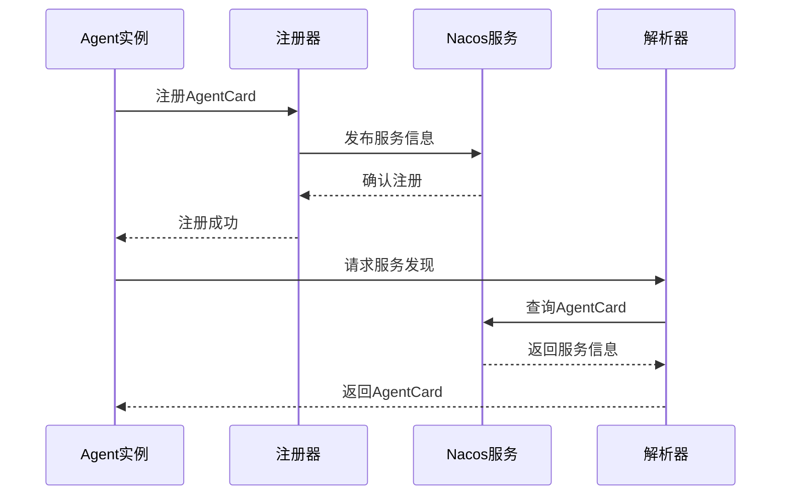
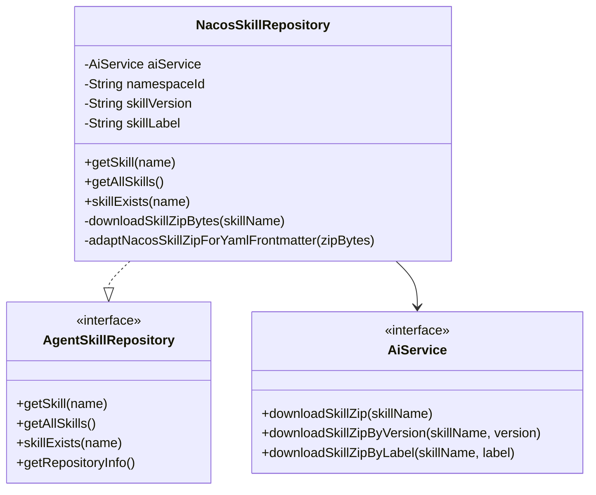

# Nacos集成Starter

<cite>
**本文档引用的文件**
- [AgentscopeA2aNacosAutoConfiguration.java](file://agentscope-extensions/agentscope-spring-boot-starters/agentscope-nacos-spring-boot-starter/src/main/java/io/agentscope/spring/boot/nacos/AgentscopeA2aNacosAutoConfiguration.java)
- [AgentScopeNacosProperties.java](file://agentscope-extensions/agentscope-spring-boot-starters/agentscope-nacos-spring-boot-starter/src/main/java/io/agentscope/spring/boot/nacos/properties/AgentScopeNacosProperties.java)
- [BaseNacosProperties.java](file://agentscope-extensions/agentscope-spring-boot-starters/agentscope-nacos-spring-boot-starter/src/main/java/io/agentscope/spring/boot/nacos/properties/BaseNacosProperties.java)
- [AgentScopeA2aNacosProperties.java](file://agentscope-extensions/agentscope-spring-boot-starters/agentscope-nacos-spring-boot-starter/src/main/java/io/agentscope/spring/boot/nacos/properties/a2a/AgentScopeA2aNacosProperties.java)
- [NacosConstants.java](file://agentscope-extensions/agentscope-spring-boot-starters/agentscope-nacos-spring-boot-starter/src/main/java/io/agentscope/spring/boot/nacos/constants/NacosConstants.java)
- [NacosSkillRepository.java](file://agentscope-extensions/agentscope-extensions-nacos/agentscope-extensions-nacos-skill/src/main/java/io/agentscope/core/nacos/skill/NacosSkillRepository.java)
- [NacosPromptListener.java](file://agentscope-extensions/agentscope-extensions-nacos/agentscope-extensions-nacos-prompt/src/main/java/io/agentscope/core/nacos/prompt/NacosPromptListener.java)
- [NacosAgentRegistry.java](file://agentscope-extensions/agentscope-extensions-nacos/agentscope-extensions-nacos-a2a/src/main/java/io/agentscope/core/nacos/a2a/registry/NacosAgentRegistry.java)
- [NacosAgentCardResolver.java](file://agentscope-extensions/agentscope-extensions-nacos/agentscope-extensions-nacos-a2a/src/main/java/io/agentscope/core/nacos/a2a/discovery/NacosAgentCardResolver.java)
- [NacosA2aRegistryProperties.java](file://agentscope-extensions/agentscope-extensions-nacos/agentscope-extensions-nacos-a2a/src/main/java/io/agentscope/core/nacos/a2a/registry/NacosA2aRegistryProperties.java)
</cite>

## 目录
1. [简介](#简介)
2. [项目结构](#项目结构)
3. [核心组件](#核心组件)
4. [架构概览](#架构概览)
5. [详细组件分析](#详细组件分析)
6. [依赖关系分析](#依赖关系分析)
7. [性能考虑](#性能考虑)
8. [故障排除指南](#故障排除指南)
9. [结论](#结论)

## 简介

AgentScope Nacos集成Spring Boot Starter是一个专门为AgentScope框架设计的Nacos集成解决方案。该starter提供了完整的Nacos客户端初始化、配置中心集成和注册中心配置功能，支持动态配置管理、服务发现和技能仓库管理。

本项目的核心目标是通过Spring Boot自动配置机制，简化Nacos在AgentScope中的集成过程，提供开箱即用的A2A（Agent-to-Agent）通信能力，同时保持与现有AgentScope生态系统的无缝兼容。

## 项目结构

AgentScope Nacos集成采用模块化设计，主要包含以下核心模块：



**图表来源**
- [AgentscopeA2aNacosAutoConfiguration.java:1-148](file://agentscope-extensions/agentscope-spring-boot-starters/agentscope-nacos-spring-boot-starter/src/main/java/io/agentscope/spring/boot/nacos/AgentscopeA2aNacosAutoConfiguration.java#L1-L148)
- [NacosSkillRepository.java:1-550](file://agentscope-extensions/agentscope-extensions-nacos/agentscope-extensions-nacos-skill/src/main/java/io/agentscope/core/nacos/skill/NacosSkillRepository.java#L1-L550)

**章节来源**
- [AgentscopeA2aNacosAutoConfiguration.java:1-148](file://agentscope-extensions/agentscope-spring-boot-starters/agentscope-nacos-spring-boot-starter/src/main/java/io/agentscope/spring/boot/nacos/AgentscopeA2aNacosAutoConfiguration.java#L1-L148)
- [NacosSkillRepository.java:1-550](file://agentscope-extensions/agentscope-extensions-nacos/agentscope-extensions-nacos-skill/src/main/java/io/agentscope/core/nacos/skill/NacosSkillRepository.java#L1-L550)

## 核心组件

### Nacos自动配置组件

Nacos自动配置是整个集成系统的核心，负责初始化Nacos客户端并暴露必要的Bean供应用使用。



**图表来源**
- [AgentscopeA2aNacosAutoConfiguration.java:58-147](file://agentscope-extensions/agentscope-spring-boot-starters/agentscope-nacos-spring-boot-starter/src/main/java/io/agentscope/spring/boot/nacos/AgentscopeA2aNacosAutoConfiguration.java#L58-L147)
- [NacosAgentCardResolver.java:59-123](file://agentscope-extensions/agentscope-extensions-nacos/agentscope-extensions-nacos-a2a/src/main/java/io/agentscope/core/nacos/a2a/discovery/NacosAgentCardResolver.java#L59-L123)
- [NacosAgentRegistry.java:42-310](file://agentscope-extensions/agentscope-extensions-nacos/agentscope-extensions-nacos-a2a/src/main/java/io/agentscope/core/nacos/a2a/registry/NacosAgentRegistry.java#L42-L310)

### 属性配置系统

系统提供了两层属性配置机制，确保灵活性和可扩展性：

1. **基础Nacos属性**：包含服务器地址、命名空间、认证信息等基本配置
2. **A2A专用属性**：针对Agent-to-Agent通信的特定配置选项

**章节来源**
- [AgentScopeNacosProperties.java:22-43](file://agentscope-extensions/agentscope-spring-boot-starters/agentscope-nacos-spring-boot-starter/src/main/java/io/agentscope/spring/boot/nacos/properties/AgentScopeNacosProperties.java#L22-L43)
- [BaseNacosProperties.java:22-219](file://agentscope-extensions/agentscope-spring-boot-starters/agentscope-nacos-spring-boot-starter/src/main/java/io/agentscope/spring/boot/nacos/properties/BaseNacosProperties.java#L22-L219)
- [AgentScopeA2aNacosProperties.java:24-95](file://agentscope-extensions/agentscope-spring-boot-starters/agentscope-nacos-spring-boot-starter/src/main/java/io/agentscope/spring/boot/nacos/properties/a2a/AgentScopeA2aNacosProperties.java#L24-L95)

## 架构概览

AgentScope Nacos集成采用分层架构设计，确保各组件职责清晰、耦合度低：



**图表来源**
- [AgentscopeA2aNacosAutoConfiguration.java:48-147](file://agentscope-extensions/agentscope-spring-boot-starters/agentscope-nacos-spring-boot-starter/src/main/java/io/agentscope/spring/boot/nacos/AgentscopeA2aNacosAutoConfiguration.java#L48-L147)
- [NacosAgentCardResolver.java:59-123](file://agentscope-extensions/agentscope-extensions-nacos/agentscope-extensions-nacos-a2a/src/main/java/io/agentscope/core/nacos/a2a/discovery/NacosAgentCardResolver.java#L59-L123)

## 详细组件分析

### Nacos自动配置逻辑

Nacos自动配置通过Spring Boot的条件注解实现智能启用，只有当配置中启用相关功能时才会创建相应的Bean。



**图表来源**
- [AgentscopeA2aNacosAutoConfiguration.java:72-136](file://agentscope-extensions/agentscope-spring-boot-starters/agentscope-nacos-spring-boot-starter/src/main/java/io/agentscope/spring/boot/nacos/AgentscopeA2aNacosAutoConfiguration.java#L72-L136)

#### 条件配置机制

自动配置使用`@ConditionalOnProperty`注解实现按需启用：

- **全局启用**：通过`agentscope.a2a.nacos.enabled=true`控制整体功能
- **发现功能**：通过`agentscope.a2a.nacos.discovery.enabled=true`控制服务发现
- **注册功能**：通过`agentscope.a2a.nacos.registry.enabled=true`控制服务注册

**章节来源**
- [AgentscopeA2aNacosAutoConfiguration.java:53-57](file://agentscope-extensions/agentscope-spring-boot-starters/agentscope-nacos-spring-boot-starter/src/main/java/io/agentscope/spring/boot/nacos/AgentscopeA2aNacosAutoConfiguration.java#L53-L57)
- [AgentscopeA2aNacosAutoConfiguration.java:111-115](file://agentscope-extensions/agentscope-spring-boot-starters/agentscope-nacos-spring-boot-starter/src/main/java/io/agentscope/spring/boot/nacos/AgentscopeA2aNacosAutoConfiguration.java#L111-L115)
- [AgentscopeA2aNacosAutoConfiguration.java:127-131](file://agentscope-extensions/agentscope-spring-boot-starters/agentscope-nacos-spring-boot-starter/src/main/java/io/agentscope/spring/boot/nacos/AgentscopeA2aNacosAutoConfiguration.java#L127-L131)

### 动态配置管理

系统提供完整的动态配置管理能力，支持配置的实时更新和热部署。



**图表来源**
- [NacosPromptListener.java:71-139](file://agentscope-extensions/agentscope-extensions-nacos/agentscope-extensions-nacos-prompt/src/main/java/io/agentscope/core/nacos/prompt/NacosPromptListener.java#L71-L139)

#### 提示词配置管理

提示词监听器提供完整的提示词生命周期管理：

- **实时订阅**：自动订阅Nacos中的提示词变更
- **版本控制**：支持基于版本和标签的提示词管理
- **默认值回退**：配置不存在时提供默认值支持
- **模板渲染**：支持变量替换和模板渲染

**章节来源**
- [NacosPromptListener.java:29-160](file://agentscope-extensions/agentscope-extensions-nacos/agentscope-extensions-nacos-prompt/src/main/java/io/agentscope/core/nacos/prompt/NacosPromptListener.java#L29-L160)

### 服务发现与注册

A2A服务发现和注册是AgentScope的核心功能之一，通过Nacos实现去中心化的服务管理。



**图表来源**
- [NacosAgentRegistry.java:64-70](file://agentscope-extensions/agentscope-extensions-nacos/agentscope-extensions-nacos-a2a/src/main/java/io/agentscope/core/nacos/a2a/registry/NacosAgentRegistry.java#L64-L70)
- [NacosAgentCardResolver.java:91-111](file://agentscope-extensions/agentscope-extensions-nacos/agentscope-extensions-nacos-a2a/src/main/java/io/agentscope/core/nacos/a2a/discovery/NacosAgentCardResolver.java#L91-L111)

#### AgentCard解析流程

AgentCard解析器提供智能的服务发现能力：

- **缓存机制**：避免重复查询，提高响应速度
- **事件驱动**：监听Nacos中的AgentCard变更
- **转换适配**：将Nacos格式转换为AgentScope内部格式

**章节来源**
- [NacosAgentCardResolver.java:59-123](file://agentscope-extensions/agentscope-extensions-nacos/agentscope-extensions-nacos-a2a/src/main/java/io/agentscope/core/nacos/a2a/discovery/NacosAgentCardResolver.java#L59-L123)

### 技能仓库管理

技能仓库的Nacos实现提供了完整的技能包管理能力，支持版本控制和热更新。



**图表来源**
- [NacosSkillRepository.java:74-550](file://agentscope-extensions/agentscope-extensions-nacos/agentscope-extensions-nacos-skill/src/main/java/io/agentscope/core/nacos/skill/NacosSkillRepository.java#L74-L550)

#### 技能包版本管理

技能仓库支持多种版本管理策略：

- **版本优先**：优先使用指定版本的技能包
- **标签选择**：支持基于标签的技能包选择
- **默认下载**：无指定版本或标签时使用最新版本
- **前端言适配**：自动适配Nacos导出的YAML前端言格式

**章节来源**
- [NacosSkillRepository.java:126-168](file://agentscope-extensions/agentscope-extensions-nacos/agentscope-extensions-nacos-skill/src/main/java/io/agentscope/core/nacos/skill/NacosSkillRepository.java#L126-L168)
- [NacosSkillRepository.java:295-304](file://agentscope-extensions/agentscope-extensions-nacos/agentscope-extensions-nacos-skill/src/main/java/io/agentscope/core/nacos/skill/NacosSkillRepository.java#L295-L304)

## 依赖关系分析

### 外部依赖

系统依赖于多个关键组件来实现完整的Nacos集成功能：

```mermaid
graph LR
subgraph "核心依赖"
A[com.alibaba.nacos.api] --> B[AiService接口]
C[io.agentscope.core] --> D[AgentScope核心]
E[io.a2a.spec] --> F[AgentCard规范]
end
subgraph "Spring Boot集成"
G[org.springframework.boot] --> H[自动配置]
I[jakarta.annotation] --> J[@PreDestroy注解]
end
subgraph "日志系统"
K[org.slf4j] --> L[日志记录]
end
A --> G
C --> I
E --> K
```

**图表来源**
- [AgentscopeA2aNacosAutoConfiguration.java:19-35](file://agentscope-extensions/agentscope-spring-boot-starters/agentscope-nacos-spring-boot-starter/src/main/java/io/agentscope/spring/boot/nacos/AgentscopeA2aNacosAutoConfiguration.java#L19-L35)

### 内部模块依赖

各模块之间的依赖关系清晰明确，遵循单一职责原则：

- **自动配置模块**依赖于**属性配置模块**和**Nacos扩展模块**
- **Nacos扩展模块**依赖于**核心框架**和**外部Nacos客户端**
- **技能仓库模块**独立运行，不依赖其他Nacos模块

**章节来源**
- [NacosAgentRegistry.java:19-37](file://agentscope-extensions/agentscope-extensions-nacos/agentscope-extensions-nacos-a2a/src/main/java/io/agentscope/core/nacos/a2a/registry/NacosAgentRegistry.java#L19-L37)
- [NacosSkillRepository.java:18-42](file://agentscope-extensions/agentscope-extensions-nacos/agentscope-extensions-nacos-skill/src/main/java/io/agentscope/core/nacos/skill/NacosSkillRepository.java#L18-L42)

## 性能考虑

### 缓存策略

系统实现了多层次的缓存机制来优化性能：

1. **AgentCard缓存**：避免重复查询Nacos服务
2. **提示词缓存**：减少网络请求频率
3. **技能包缓存**：提升技能加载速度

### 连接池管理

Nacos客户端连接采用智能管理策略：

- **单实例模式**：避免重复创建客户端实例
- **优雅关闭**：确保应用关闭时正确释放资源
- **异常处理**：提供完善的错误恢复机制

### 网络优化

系统在网络层面进行了多项优化：

- **异步处理**：使用异步方式处理配置变更
- **批量操作**：支持批量注册和发现操作
- **重试机制**：在网络异常时自动重试

## 故障排除指南

### 常见问题诊断

#### Nacos连接失败

**症状**：应用启动时报Nacos连接错误

**可能原因**：
- 服务器地址配置错误
- 认证信息不正确
- 网络连接问题

**解决方法**：
1. 检查`server-addr`配置是否正确
2. 验证用户名密码或密钥配置
3. 确认网络连通性

#### 服务发现异常

**症状**：Agent无法发现其他Agent

**可能原因**：
- AgentCard未正确注册
- 命名空间配置错误
- 权限不足

**解决方法**：
1. 检查Agent注册状态
2. 验证命名空间配置
3. 确认Nacos权限设置

#### 技能加载失败

**症状**：技能包无法加载

**可能原因**：
- 技能名称错误
- 版本或标签配置问题
- 网络下载超时

**解决方法**：
1. 验证技能名称拼写
2. 检查版本和标签配置
3. 确认网络连接稳定

**章节来源**
- [NacosAgentCardResolver.java:108-110](file://agentscope-extensions/agentscope-extensions-nacos/agentscope-extensions-nacos-a2a/src/main/java/io/agentscope/core/nacos/a2a/discovery/NacosAgentCardResolver.java#L108-L110)
- [NacosSkillRepository.java:182-187](file://agentscope-extensions/agentscope-extensions-nacos/agentscope-extensions-nacos-skill/src/main/java/io/agentscope/core/nacos/skill/NacosSkillRepository.java#L182-L187)

### 日志分析

系统提供了详细的日志输出，便于问题诊断：

- **INFO级别**：正常操作和状态信息
- **WARN级别**：潜在问题和警告信息  
- **ERROR级别**：严重错误和异常情况

建议在调试模式下开启详细日志，以便更好地理解系统行为。

## 结论

AgentScope Nacos集成Spring Boot Starter提供了一个完整、灵活且高性能的Nacos集成解决方案。通过模块化设计和智能自动配置，系统能够满足各种复杂的分布式Agent应用场景需求。

### 主要优势

1. **开箱即用**：通过Spring Boot自动配置实现零样板代码
2. **高度可配置**：支持丰富的配置选项和自定义扩展
3. **性能优化**：内置多级缓存和连接池管理
4. **故障恢复**：完善的错误处理和重试机制
5. **监控友好**：详细的日志输出和状态信息

### 适用场景

- 分布式Agent系统
- 微服务架构中的Agent通信
- 动态配置管理场景
- 技能包分发和管理
- 实时提示词更新

该集成方案为AgentScope生态系统提供了强大的基础设施支持，是构建现代AI应用的重要基石。