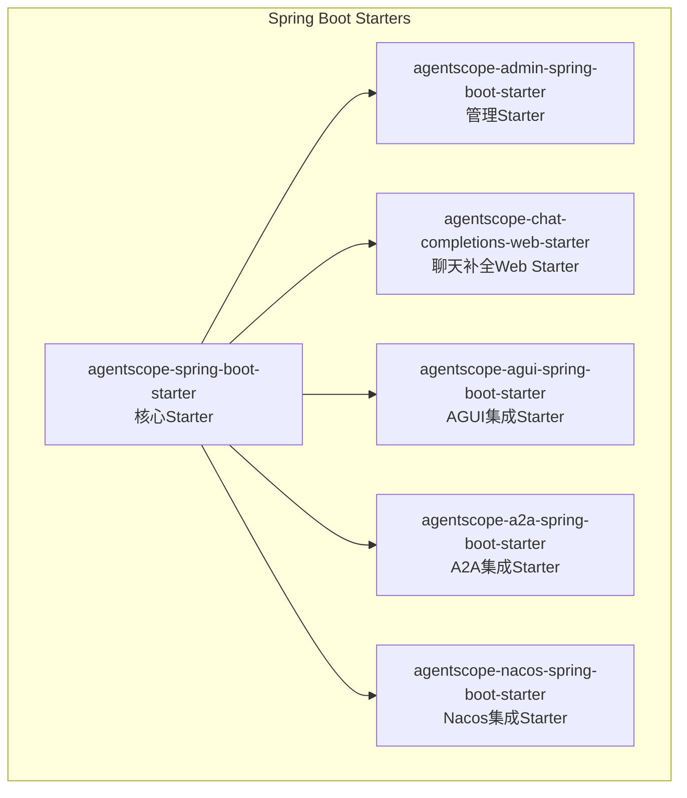
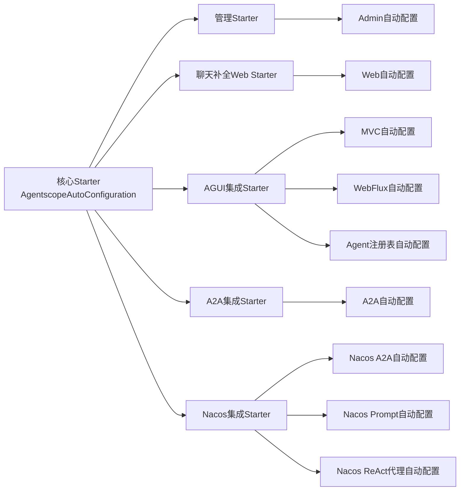
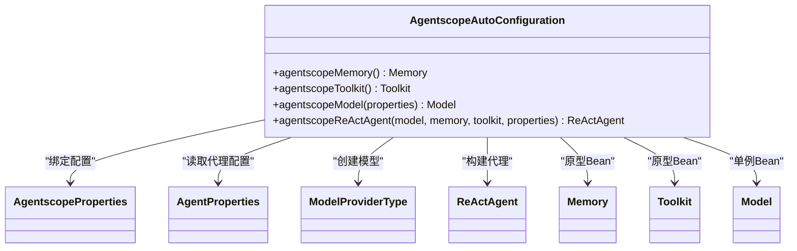
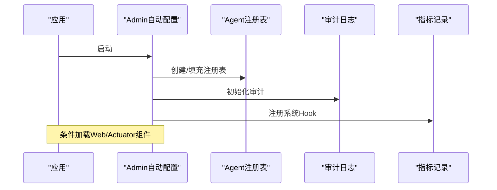
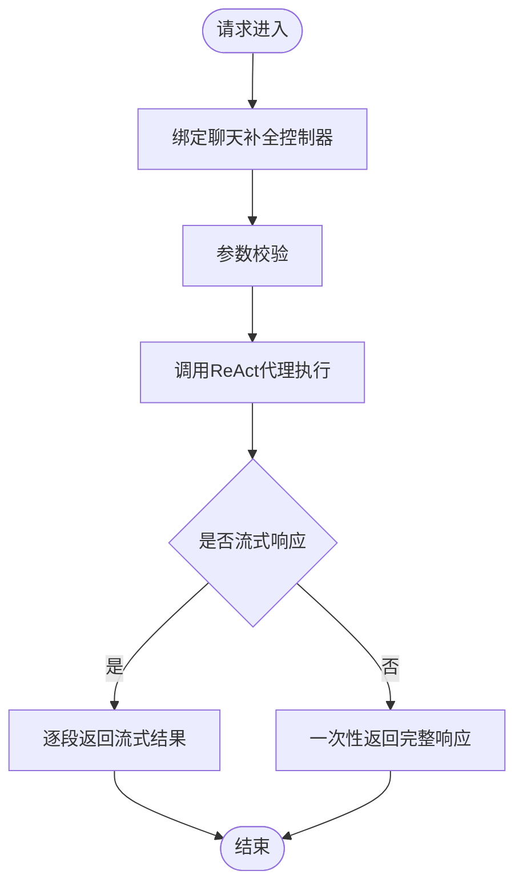
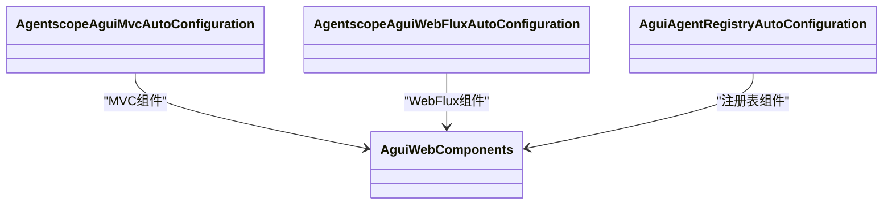
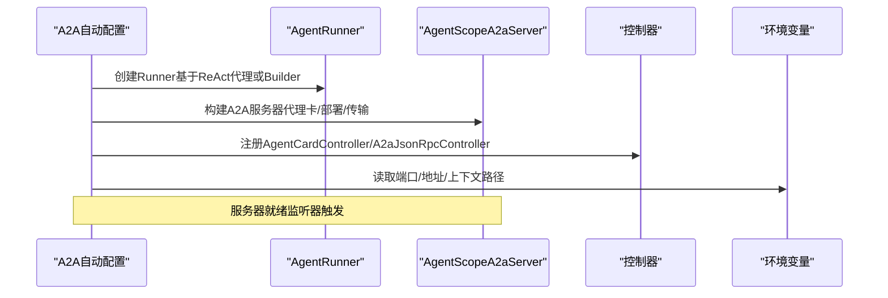
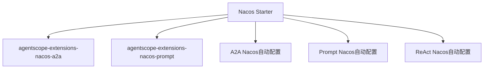
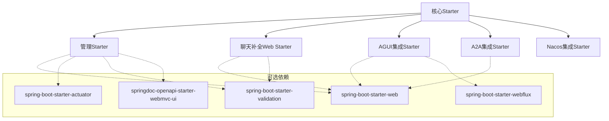

# Spring Boot集成

<cite>
**本文引用的文件**
- [agentscope-spring-boot-starter/pom.xml](file://agentscope-extensions/agentscope-spring-boot-starters/agentscope-spring-boot-starter/pom.xml)
- [AgentscopeAutoConfiguration.java](file://agentscope-extensions/agentscope-spring-boot-starters/agentscope-spring-boot-starter/src/main/java/io/agentscope/spring/boot/AgentscopeAutoConfiguration.java)
- [agentscope-admin-spring-boot-starter/pom.xml](file://agentscope-extensions/agentscope-spring-boot-starters/agentscope-admin-spring-boot-starter/pom.xml)
- [AgentscopeAdminAutoConfiguration.java](file://agentscope-extensions/agentscope-spring-boot-starters/agentscope-admin-spring-boot-starter/src/main/java/io/agentscope/spring/boot/admin/AgentscopeAdminAutoConfiguration.java)
- [agentscope-chat-completions-web-starter/pom.xml](file://agentscope-extensions/agentscope-spring-boot-starters/agentscope-chat-completions-web-starter/pom.xml)
- [ChatCompletionsWebAutoConfiguration.java](file://agentscope-extensions/agentscope-spring-boot-starters/agentscope-chat-completions-web-starter/src/main/java/io/agentscope/spring/boot/chat/config/ChatCompletionsWebAutoConfiguration.java)
- [agentscope-agui-spring-boot-starter/pom.xml](file://agentscope-extensions/agentscope-spring-boot-starters/agentscope-agui-spring-boot-starter/pom.xml)
- [AgentscopeAguiMvcAutoConfiguration.java](file://agentscope-extensions/agentscope-spring-boot-starters/agentscope-agui-spring-boot-starter/src/main/java/io/agentscope/spring/boot/agui/mvc/AgentscopeAguiMvcAutoConfiguration.java)
- [AgentscopeAguiWebFluxAutoConfiguration.java](file://agentscope-extensions/agentscope-spring-boot-starters/agentscope-agui-spring-boot-starter/src/main/java/io/agentscope/spring/boot/agui/webflux/AgentscopeAguiWebFluxAutoConfiguration.java)
- [AgentscopeAguiAgentRegistryAutoConfiguration.java](file://agentscope-extensions/agentscope-spring-boot-starters/agentscope-agui-spring-boot-starter/src/main/java/io/agentscope/spring/boot/agui/common/AguiAgentRegistryAutoConfiguration.java)
- [agentscope-a2a-spring-boot-starter/pom.xml](file://agentscope-extensions/agentscope-spring-boot-starters/agentscope-a2a-spring-boot-starter/pom.xml)
- [AgentscopeA2aAutoConfiguration.java](file://agentscope-extensions/agentscope-spring-boot-starters/agentscope-a2a-spring-boot-starter/src/main/java/io/agentscope/spring/boot/a2a/AgentscopeA2aAutoConfiguration.java)
- [agentscope-nacos-spring-boot-starter/pom.xml](file://agentscope-extensions/agentscope-spring-boot-starters/agentscope-nacos-spring-boot-starter/pom.xml)
- [AgentscopeA2aNacosAutoConfiguration.java](file://agentscope-extensions/agentscope-spring-boot-starters/agentscope-nacos-spring-boot-starter/src/main/java/io/agentscope/spring/boot/nacos/AgentscopeA2aNacosAutoConfiguration.java)
- [AgentscopeNacosPromptAutoConfiguration.java](file://agentscope-extensions/agentscope-spring-boot-starters/agentscope-nacos-spring-boot-starter/src/main/java/io/agentscope/spring/boot/nacos/AgentscopeNacosPromptAutoConfiguration.java)
- [AgentscopeNacosReActAgentAutoConfiguration.java](file://agentscope-extensions/agentscope-spring-boot-starters/agentscope-nacos-spring-boot-starter/src/main/java/io/agentscope/spring/boot/nacos/AgentscopeNacosReActAgentAutoConfiguration.java)
</cite>

## 目录
1. [引言](#引言)
2. [项目结构](#项目结构)
3. [核心组件](#核心组件)
4. [架构总览](#架构总览)
5. [详细组件分析](#详细组件分析)
6. [依赖关系分析](#依赖关系分析)
7. [性能与并发特性](#性能与并发特性)
8. [使用示例与最佳实践](#使用示例与最佳实践)
9. [版本兼容性与依赖管理](#版本兼容性与依赖管理)
10. [故障排除指南](#故障排除指南)
11. [结论](#结论)

## 引言
本文件面向需要在Spring Boot应用中集成AgentScope Java能力的开发者，系统化介绍并行启动器（Starter）体系：核心Starter、管理Starter、聊天补全Web Starter、AGUI集成Starter以及Nacos集成Starter。文档从自动配置机制入手，解析条件注解、Bean定义与依赖注入策略，覆盖各Starter的功能特性、配置项、使用流程与排障建议，并给出版本兼容性与依赖管理的最佳实践。

## 项目结构
AgentScope Java的Spring Boot集成位于“agentscope-extensions/agentscope-spring-boot-starters”模块下，按功能拆分为多个子Starter，每个Starter独立声明依赖、暴露自动配置与可选Web/Actuator能力，避免对使用者造成不必要的侵入。

图表来源
- [agentscope-spring-boot-starter/pom.xml:38-73](file://agentscope-extensions/agentscope-spring-boot-starters/agentscope-spring-boot-starter/pom.xml#L38-L73)
- [agentscope-admin-spring-boot-starter/pom.xml:52-56](file://agentscope-extensions/agentscope-spring-boot-starters/agentscope-admin-spring-boot-starter/pom.xml#L52-L56)
- [agentscope-chat-completions-web-starter/pom.xml:56-60](file://agentscope-extensions/agentscope-spring-boot-starters/agentscope-chat-completions-web-starter/pom.xml#L56-L60)
- [agentscope-agui-spring-boot-starter/pom.xml:53-57](file://agentscope-extensions/agentscope-spring-boot-starters/agentscope-agui-spring-boot-starter/pom.xml#L53-L57)
- [agentscope-a2a-spring-boot-starter/pom.xml:55-59](file://agentscope-extensions/agentscope-spring-boot-starters/agentscope-a2a-spring-boot-starter/pom.xml#L55-L59)
- [agentscope-nacos-spring-boot-starter/pom.xml:39-49](file://agentscope-extensions/agentscope-spring-boot-starters/agentscope-nacos-spring-boot-starter/pom.xml#L39-L49)

章节来源
- [agentscope-spring-boot-starter/pom.xml:17-78](file://agentscope-extensions/agentscope-spring-boot-starters/agentscope-spring-boot-starter/pom.xml#L17-78)
- [agentscope-admin-spring-boot-starter/pom.xml:24-119](file://agentscope-extensions/agentscope-spring-boot-starters/agentscope-admin-spring-boot-starter/pom.xml#L24-119)
- [agentscope-chat-completions-web-starter/pom.xml:21-90](file://agentscope-extensions/agentscope-spring-boot-starters/agentscope-chat-completions-web-starter/pom.xml#L21-90)
- [agentscope-agui-spring-boot-starter/pom.xml:18-90](file://agentscope-extensions/agentscope-spring-boot-starters/agentscope-agui-spring-boot-starter/pom.xml#L18-90)
- [agentscope-a2a-spring-boot-starter/pom.xml:18-91](file://agentscope-extensions/agentscope-spring-boot-starters/agentscope-a2a-spring-boot-starter/pom.xml#L18-91)
- [agentscope-nacos-spring-boot-starter/pom.xml:18-90](file://agentscope-extensions/agentscope-spring-boot-starters/agentscope-nacos-spring-boot-starter/pom.xml#L18-90)

## 核心组件
本节聚焦核心Starter的自动配置与Bean装配，涵盖模型、内存、工具箱与ReAct代理的默认Bean定义及启用条件。

- 自动配置入口
  - 使用标准的自动配置注解，基于类存在性与属性开关进行条件装配。
- 条件注解
  - 基于类存在性（如ReActAgent）与属性开关（如agentscope.agent.enabled）决定是否创建Bean。
- Bean作用域
  - 内存与工具箱为原型作用域，以避免多线程/多会话下的状态共享问题；ReAct代理为单例且线程安全。
- 配置绑定
  - 通过@EnableConfigurationProperties绑定全局配置对象，支持多提供商模型选择与参数透传。

章节来源
- [AgentscopeAutoConfiguration.java:125-204](file://agentscope-extensions/agentscope-spring-boot-starters/agentscope-spring-boot-starter/src/main/java/io/agentscope/spring/boot/AgentscopeAutoConfiguration.java#L125-L204)

## 架构总览
下图展示Starter之间的继承与复用关系：除核心Starter外，其他Starter均显式依赖核心Starter，从而复用其自动配置与Bean定义，确保一致的AgentScope初始化流程。

图表来源
- [agentscope-admin-spring-boot-starter/pom.xml:52-56](file://agentscope-extensions/agentscope-spring-boot-starters/agentscope-admin-spring-boot-starter/pom.xml#L52-L56)
- [agentscope-chat-completions-web-starter/pom.xml:56-60](file://agentscope-extensions/agentscope-spring-boot-starters/agentscope-chat-completions-web-starter/pom.xml#L56-L60)
- [agentscope-agui-spring-boot-starter/pom.xml:53-57](file://agentscope-extensions/agentscope-spring-boot-starters/agentscope-agui-spring-boot-starter/pom.xml#L53-L57)
- [agentscope-a2a-spring-boot-starter/pom.xml:55-59](file://agentscope-extensions/agentscope-spring-boot-starters/agentscope-a2a-spring-boot-starter/pom.xml#L55-L59)
- [agentscope-nacos-spring-boot-starter/pom.xml:39-49](file://agentscope-extensions/agentscope-spring-boot-starters/agentscope-nacos-spring-boot-starter/pom.xml#L39-L49)

## 详细组件分析

### 核心Starter（agentscope-spring-boot-starter）
- 功能定位
  - 提供AgentScope运行所需的默认模型、内存、工具箱与ReAct代理Bean，作为其他Starter的基础。
- 自动配置要点
  - 条件装配：仅当ReActAgent类存在且agentscope.agent.enabled为true时创建Bean。
  - 模型选择：依据配置选择不同提供商（DashScope/OpenAI/Gemini/Anthropic），并通过ModelProviderType工厂化创建。
  - Bean作用域：内存与工具箱为原型，ReAct代理为单例。
- 典型配置
  - 模型提供商、API密钥、模型名称、流式输出、最大迭代次数等。

图表来源
- [AgentscopeAutoConfiguration.java:125-204](file://agentscope-extensions/agentscope-spring-boot-starters/agentscope-spring-boot-starter/src/main/java/io/agentscope/spring/boot/AgentscopeAutoConfiguration.java#L125-L204)

章节来源
- [AgentscopeAutoConfiguration.java:125-204](file://agentscope-extensions/agentscope-spring-boot-starters/agentscope-spring-boot-starter/src/main/java/io/agentscope/spring/boot/AgentscopeAutoConfiguration.java#L125-L204)
- [agentscope-spring-boot-starter/pom.xml:38-73](file://agentscope-extensions/agentscope-spring-boot-starters/agentscope-spring-boot-starter/pom.xml#L38-L73)

### 管理Starter（agentscope-admin-spring-boot-starter）
- 功能特性
  - 提供两类接口面：
    - 数据平面：基于Servlet的REST控制器，用于会话压缩、终止等操作。
    - 控制平面：基于Actuator的端点，用于状态查询、用量统计、权限管理等。
  - 统一命令注册表与审计日志，支持OpenAPI生成。
- 自动配置要点
  - 主开关：agentscope.admin.enabled，默认关闭，避免误暴露。
  - 条件装配：仅在存在Agent类、Web应用或Actuator类时加载对应配置。
  - 生命周期钩子：注册全局指标钩子，上下文销毁时自动注销。
- 依赖关系
  - 复用核心Starter；可选引入Web、Actuator、验证、OpenAPI等依赖。

图表来源
- [AgentscopeAdminAutoConfiguration.java:89-347](file://agentscope-extensions/agentscope-spring-boot-starters/agentscope-admin-spring-boot-starter/src/main/java/io/agentscope/spring/boot/admin/AgentscopeAdminAutoConfiguration.java#L89-L347)

章节来源
- [AgentscopeAdminAutoConfiguration.java:89-347](file://agentscope-extensions/agentscope-spring-boot-starters/agentscope-admin-spring-boot-starter/src/main/java/io/agentscope/spring/boot/admin/AgentscopeAdminAutoConfiguration.java#L89-L347)
- [agentscope-admin-spring-boot-starter/pom.xml:43-116](file://agentscope-extensions/agentscope-spring-boot-starters/agentscope-admin-spring-boot-starter/pom.xml#L43-L116)

### 聊天补全Web Starter（agentscope-chat-completions-web-starter）
- 功能特性
  - 基于ReAct代理提供标准化HTTP聊天补全API，适配常见大模型调用协议。
- 自动配置要点
  - 复用核心Starter；引入Web与校验依赖；暴露聊天补全相关控制器与配置。
- 适用场景
  - 快速搭建对外聊天服务，屏蔽底层AgentScope细节。

图表来源
- [ChatCompletionsWebAutoConfiguration.java](file://agentscope-extensions/agentscope-spring-boot-starters/agentscope-chat-completions-web-starter/src/main/java/io/agentscope/spring/boot/chat/config/ChatCompletionsWebAutoConfiguration.java)

章节来源
- [agentscope-chat-completions-web-starter/pom.xml:40-87](file://agentscope-extensions/agentscope-spring-boot-starters/agentscope-chat-completions-web-starter/pom.xml#L40-L87)

### AGUI集成Starter（agentscope-agui-spring-boot-starter）
- 功能特性
  - 支持MVC与WebFlux两种运行模式，提供Agent交互界面与会话管理能力。
- 自动配置要点
  - MVC与WebFlux分别由独立自动配置类加载，互斥但可共存于同一应用（取决于所选运行模式）。
  - 提供Agent注册表自动配置，便于统一管理Agent生命周期。
- 依赖关系
  - 可选引入Web与WebFlux依赖，按需启用。

图表来源
- [AgentscopeAguiMvcAutoConfiguration.java](file://agentscope-extensions/agentscope-spring-boot-starters/agentscope-agui-spring-boot-starter/src/main/java/io/agentscope/spring/boot/agui/mvc/AgentscopeAguiMvcAutoConfiguration.java)
- [AgentscopeAguiWebFluxAutoConfiguration.java](file://agentscope-extensions/agentscope-spring-boot-starters/agentscope-agui-spring-boot-starter/src/main/java/io/agentscope/spring/boot/agui/webflux/AgentscopeAguiWebFluxAutoConfiguration.java)
- [AgentscopeAguiAgentRegistryAutoConfiguration.java](file://agentscope-extensions/agentscope-spring-boot-starters/agentscope-agui-spring-boot-starter/src/main/java/io/agentscope/spring/boot/agui/common/AguiAgentRegistryAutoConfiguration.java)

章节来源
- [agentscope-agui-spring-boot-starter/pom.xml:36-87](file://agentscope-extensions/agentscope-spring-boot-starters/agentscope-agui-spring-boot-starter/pom.xml#L36-L87)

### A2A集成Starter（agentscope-a2a-spring-boot-starter）
- 功能特性
  - 将AgentScope代理暴露为可被外部客户端调用的服务，支持JSON-RPC等传输方式。
- 自动配置要点
  - 依赖核心Starter完成ReAct代理装配；根据属性构建A2A服务器、代理卡、部署参数与传输属性。
  - 条件装配：仅在存在AgentScopeA2aServer类、Web应用且主开关开启时加载。
- 关键Bean
  - AgentRunner（支持Starter Runner与Builder Runner）、AgentScopeA2aServer、AgentCardController、A2aJsonRpcController、ServerReadyListener。

图表来源
- [AgentscopeA2aAutoConfiguration.java:55-183](file://agentscope-extensions/agentscope-spring-boot-starters/agentscope-a2a-spring-boot-starter/src/main/java/io/agentscope/spring/boot/a2a/AgentscopeA2aAutoConfiguration.java#L55-L183)

章节来源
- [AgentscopeA2aAutoConfiguration.java:55-183](file://agentscope-extensions/agentscope-spring-boot-starters/agentscope-a2a-spring-boot-starter/src/main/java/io/agentscope/spring/boot/a2a/AgentscopeA2aAutoConfiguration.java#L55-L183)
- [agentscope-a2a-spring-boot-starter/pom.xml:36-88](file://agentscope-extensions/agentscope-spring-boot-starters/agentscope-a2a-spring-boot-starter/pom.xml#L36-L88)

### Nacos集成Starter（agentscope-nacos-spring-boot-starter）
- 功能特性
  - 将AgentScope与Nacos能力结合，支持A2A与Prompt等扩展能力的自动装配。
- 自动配置要点
  - 依赖A2A与Prompt扩展模块；通过条件注解控制装配范围。
  - 提供A2A、Prompt与ReAct代理的Nacos相关自动配置类。
- 依赖关系
  - 显式引入Nacos扩展模块，同时保留对核心Starter与A2A Starter的可选依赖。

图表来源
- [agentscope-nacos-spring-boot-starter/pom.xml:58-67](file://agentscope-extensions/agentscope-spring-boot-starters/agentscope-nacos-spring-boot-starter/pom.xml#L58-L67)
- [AgentscopeA2aNacosAutoConfiguration.java](file://agentscope-extensions/agentscope-spring-boot-starters/agentscope-nacos-spring-boot-starter/src/main/java/io/agentscope/spring/boot/nacos/AgentscopeA2aNacosAutoConfiguration.java)
- [AgentscopeNacosPromptAutoConfiguration.java](file://agentscope-extensions/agentscope-spring-boot-starters/agentscope-nacos-spring-boot-starter/src/main/java/io/agentscope/spring/boot/nacos/AgentscopeNacosPromptAutoConfiguration.java)
- [AgentscopeNacosReActAgentAutoConfiguration.java](file://agentscope-extensions/agentscope-spring-boot-starters/agentscope-nacos-spring-boot-starter/src/main/java/io/agentscope/spring/boot/nacos/AgentscopeNacosReActAgentAutoConfiguration.java)

章节来源
- [agentscope-nacos-spring-boot-starter/pom.xml:36-88](file://agentscope-extensions/agentscope-spring-boot-starters/agentscope-nacos-spring-boot-starter/pom.xml#L36-L88)

## 依赖关系分析
- 继承与复用
  - 管理、聊天补全Web、AGUI、A2A、Nacos Starter均依赖核心Starter，确保统一的AgentScope初始化与配置绑定。
- 运行时可选依赖
  - Web、Actuator、验证、OpenAPI、MVC/WebFlux等依赖均为可选，避免对非Web或非管理场景造成额外负担。
- 条件装配策略
  - 通过类存在性与属性开关组合，保证Starter仅在满足前提条件时生效，降低误装配风险。

图表来源
- [agentscope-admin-spring-boot-starter/pom.xml:58-103](file://agentscope-extensions/agentscope-spring-boot-starters/agentscope-admin-spring-boot-starter/pom.xml#L58-L103)
- [agentscope-chat-completions-web-starter/pom.xml:62-72](file://agentscope-extensions/agentscope-spring-boot-starters/agentscope-chat-completions-web-starter/pom.xml#L62-L72)
- [agentscope-agui-spring-boot-starter/pom.xml:59-71](file://agentscope-extensions/agentscope-spring-boot-starters/agentscope-agui-spring-boot-starter/pom.xml#L59-L71)
- [agentscope-a2a-spring-boot-starter/pom.xml:68-73](file://agentscope-extensions/agentscope-spring-boot-starters/agentscope-a2a-spring-boot-starter/pom.xml#L68-L73)

章节来源
- [agentscope-admin-spring-boot-starter/pom.xml:43-116](file://agentscope-extensions/agentscope-spring-boot-starters/agentscope-admin-spring-boot-starter/pom.xml#L43-L116)
- [agentscope-chat-completions-web-starter/pom.xml:40-87](file://agentscope-extensions/agentscope-spring-boot-starters/agentscope-chat-completions-web-starter/pom.xml#L40-L87)
- [agentscope-agui-spring-boot-starter/pom.xml:36-87](file://agentscope-extensions/agentscope-spring-boot-starters/agentscope-agui-spring-boot-starter/pom.xml#L36-L87)
- [agentscope-a2a-spring-boot-starter/pom.xml:36-88](file://agentscope-extensions/agentscope-spring-boot-starters/agentscope-a2a-spring-boot-starter/pom.xml#L36-L88)

## 性能与并发特性
- Bean作用域设计
  - 内存与工具箱采用原型作用域，避免跨线程共享状态引发竞态；ReAct代理为单例且线程安全，适合高并发场景。
- 流式输出
  - 核心Starter支持模型流式输出，配合Web Starter可实现低延迟的增量响应。
- 指标与审计
  - 管理Starter注册系统级Hook，自动采集Token用量等指标；审计日志记录关键操作，便于性能分析与合规追踪。

## 使用示例与最佳实践
- 快速接入核心Starter
  - 在应用中引入核心Starter后，即可通过配置agentscope.agent.*与agentscope.model.*启用默认代理与模型。
- 开启管理能力
  - 设置agentscope.admin.enabled=true，并引入Actuator与Web依赖，即可获得数据平面与控制平面的管理接口。
- 对外提供聊天补全服务
  - 引入聊天补全Web Starter，即可直接使用标准HTTP接口进行对话调用。
- 集成AGUI界面
  - 根据运行模式选择MVC或WebFlux，引入对应Starter后即可访问内置交互界面。
- A2A服务导出
  - 引入A2A Starter并在属性中开启，系统将自动装配服务器与控制器，支持外部客户端调用。
- Nacos集成
  - 引入Nacos Starter并配置相关属性，即可启用Nacos驱动的A2A与Prompt能力。

最佳实践
- 明确启用顺序：先引入核心Starter，再按需引入其他Starter，避免重复装配。
- 严格区分Web与非Web场景：仅在需要时引入Web或WebFlux依赖，减少运行时开销。
- 使用原型作用域的内存与工具箱时，优先通过ObjectProvider或方法注入获取实例，避免共享状态导致的问题。

## 版本兼容性与依赖管理
- Spring Boot版本
  - 核心Starter声明了spring-boot.version属性，确保与Spring Boot 4.x生态兼容。
- 依赖传递
  - 各Starter通过pom.xml明确声明对AgentScope核心库与扩展模块的依赖，消费者可按需替换版本。
- 可选依赖策略
  - Web、Actuator、验证、OpenAPI、MVC/WebFlux等依赖均标记为可选，避免强制引入不必要依赖。

章节来源
- [agentscope-spring-boot-starter/pom.xml:33-36](file://agentscope-extensions/agentscope-spring-boot-starters/agentscope-spring-boot-starter/pom.xml#L33-L36)
- [agentscope-admin-spring-boot-starter/pom.xml:39-41](file://agentscope-extensions/agentscope-spring-boot-starters/agentscope-admin-spring-boot-starter/pom.xml#L39-L41)
- [agentscope-chat-completions-web-starter/pom.xml:36-38](file://agentscope-extensions/agentscope-spring-boot-starters/agentscope-chat-completions-web-starter/pom.xml#L36-L38)
- [agentscope-agui-spring-boot-starter/pom.xml:32-34](file://agentscope-extensions/agentscope-spring-boot-starters/agentscope-agui-spring-boot-starter/pom.xml#L32-L34)
- [agentscope-a2a-spring-boot-starter/pom.xml:32-34](file://agentscope-extensions/agentscope-spring-boot-starters/agentscope-a2a-spring-boot-starter/pom.xml#L32-L34)
- [agentscope-nacos-spring-boot-starter/pom.xml:32-34](file://agentscope-extensions/agentscope-spring-boot-starters/agentscope-nacos-spring-boot-starter/pom.xml#L32-L34)

## 故障排除指南
- 未加载任何Starter
  - 症状：无Agent、模型或Web接口。
  - 排查：确认已引入至少一个Starter；检查agentscope.agent.enabled或agentscope.admin.enabled等主开关。
- Web接口不可用
  - 症状：管理Starter或聊天补全Starter未暴露REST端点。
  - 排查：确认引入了spring-boot-starter-web；对于管理Starter，还需Actuator依赖。
- A2A服务未启动
  - 症状：A2A控制器与服务器未装配。
  - 排查：确认引入了A2A Starter；检查agentscope.a2a.server.enabled；确保ReAct代理Bean已存在。
- AGUI界面空白或404
  - 症状：访问AGUI页面失败。
  - 排查：确认选择了MVC或WebFlux之一；检查运行模式与静态资源映射。
- 指标未统计
  - 症状：/actuator/agentscope-usage无数据。
  - 排查：确认管理Starter已启用；检查Actuator端点暴露配置；确保Agent已实际执行过调用。

章节来源
- [AgentscopeAdminAutoConfiguration.java:208-235](file://agentscope-extensions/agentscope-spring-boot-starters/agentscope-admin-spring-boot-starter/src/main/java/io/agentscope/spring/boot/admin/AgentscopeAdminAutoConfiguration.java#L208-L235)
- [AgentscopeA2aAutoConfiguration.java:61-68](file://agentscope-extensions/agentscope-spring-boot-starters/agentscope-a2a-spring-boot-starter/src/main/java/io/agentscope/spring/boot/a2a/AgentscopeA2aAutoConfiguration.java#L61-L68)

## 结论
AgentScope Java的Spring Boot集成通过模块化的Starter体系实现了“按需装配、最小侵入”的设计理念：核心Starter提供统一的AgentScope初始化，其他Starter在各自领域内提供便捷的自动化配置与可选能力。借助条件注解、可选依赖与清晰的Bean作用域设计，用户可在不同场景下灵活组合使用，快速构建从本地开发到生产部署的Agent应用。