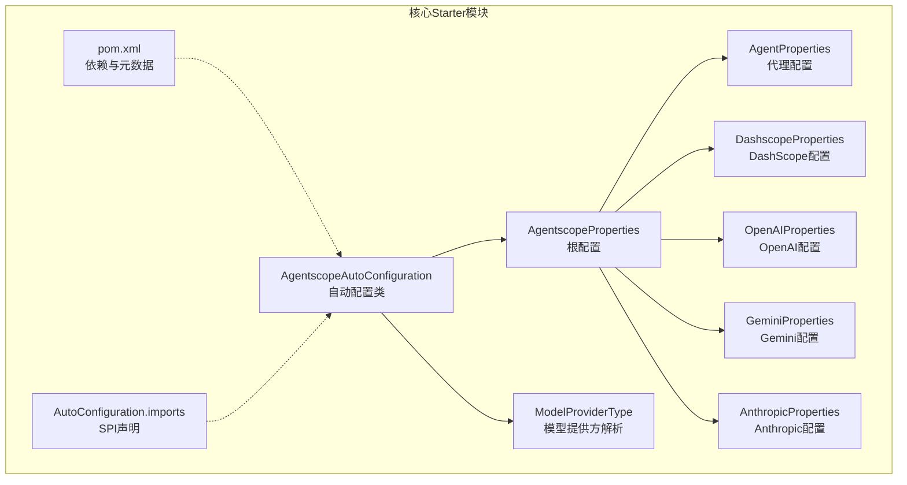
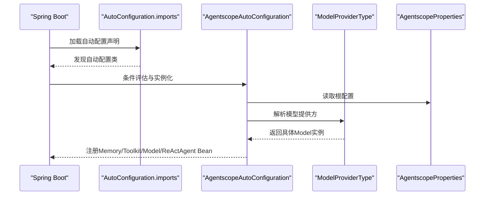
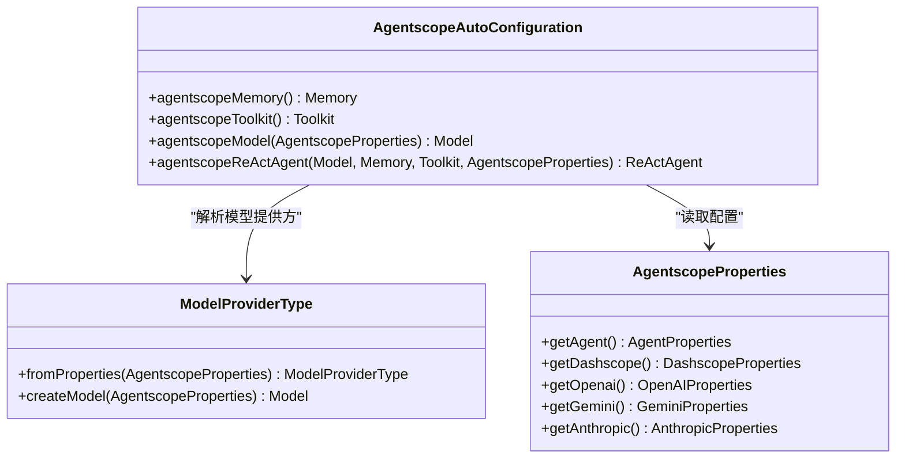
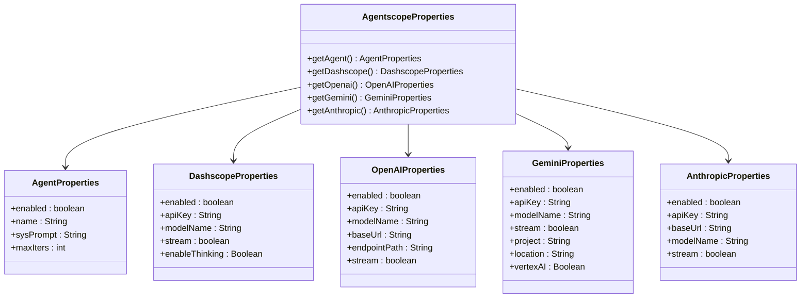
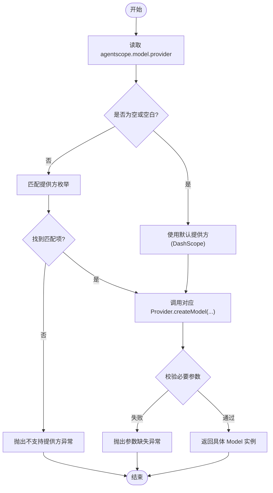
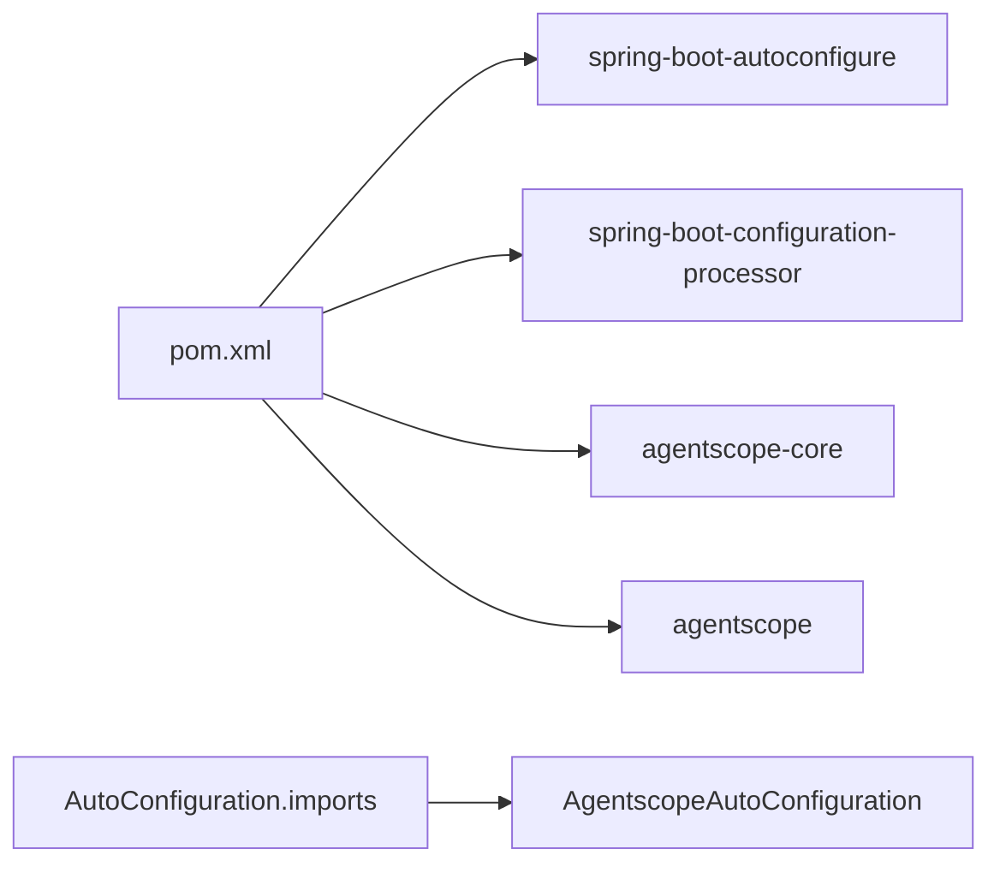

# 核心Starter

<cite>
**本文引用的文件**
- [AgentscopeAutoConfiguration.java](file://agentscope-extensions/agentscope-spring-boot-starters/agentscope-spring-boot-starter/src/main/java/io/agentscope/spring/boot/AgentscopeAutoConfiguration.java)
- [AgentscopeProperties.java](file://agentscope-extensions/agentscope-spring-boot-starters/agentscope-spring-boot-starter/src/main/java/io/agentscope/spring/boot/properties/AgentscopeProperties.java)
- [AgentProperties.java](file://agentscope-extensions/agentscope-spring-boot-starters/agentscope-spring-boot-starter/src/main/java/io/agentscope/spring/boot/properties/AgentProperties.java)
- [DashscopeProperties.java](file://agentscope-extensions/agentscope-spring-boot-starters/agentscope-spring-boot-starter/src/main/java/io/agentscope/spring/boot/properties/DashscopeProperties.java)
- [OpenAIProperties.java](file://agentscope-extensions/agentscope-spring-boot-starters/agentscope-spring-boot-starter/src/main/java/io/agentscope/spring/boot/properties/OpenAIProperties.java)
- [GeminiProperties.java](file://agentscope-extensions/agentscope-spring-boot-starters/agentscope-spring-boot-starter/src/main/java/io/agentscope/spring/boot/properties/GeminiProperties.java)
- [AnthropicProperties.java](file://agentscope-extensions/agentscope-spring-boot-starters/agentscope-spring-boot-starter/src/main/java/io/agentscope/spring/boot/properties/AnthropicProperties.java)
- [ModelProviderType.java](file://agentscope-extensions/agentscope-spring-boot-starters/agentscope-spring-boot-starter/src/main/java/io/agentscope/spring/boot/model/ModelProviderType.java)
- [pom.xml（核心Starter）](file://agentscope-extensions/agentscope-spring-boot-starters/agentscope-spring-boot-starter/pom.xml)
- [AutoConfiguration.imports](file://agentscope-extensions/agentscope-spring-boot-starters/agentscope-spring-boot-starter/src/main/resources/META-INF/spring/org.springframework.boot.autoconfigure.AutoConfiguration.imports)
</cite>

## 目录
1. [简介](#简介)
2. [项目结构](#项目结构)
3. [核心组件](#核心组件)
4. [架构总览](#架构总览)
5. [组件详解](#组件详解)
6. [依赖关系分析](#依赖关系分析)
7. [性能与可扩展性](#性能与可扩展性)
8. [故障排查指南](#故障排查指南)
9. [结论](#结论)
10. [附录：集成与配置清单](#附录集成与配置清单)

## 简介
本文件面向希望在Spring Boot应用中快速集成AgentScope能力的开发者，系统化讲解“核心Spring Boot Starter”的自动配置机制与使用方法。内容覆盖：
- 自动配置类的职责与条件装配策略
- 配置属性模型与默认值
- Bean注册流程与作用域设计
- 基础功能（上下文初始化、模型选择、工具箱与记忆体、ReAct代理）
- 完整集成步骤（Maven依赖、配置文件、基本用法）
- 常见问题与性能优化建议

## 项目结构
核心Starter位于 agentscope-extensions/agentscope-spring-boot-starters/agentscope-spring-boot-starter 模块，关键文件包括：
- 自动配置类：AgentscopeAutoConfiguration
- 配置属性根对象与各提供商属性：AgentscopeProperties 及其子属性类
- 模型提供方解析器：ModelProviderType
- Maven依赖与SPI声明：pom.xml 与 META-INF/spring/org.springframework.boot.autoconfigure.AutoConfiguration.imports

图表来源
- [AgentscopeAutoConfiguration.java:125-203](file://agentscope-extensions/agentscope-spring-boot-starters/agentscope-spring-boot-starter/src/main/java/io/agentscope/spring/boot/AgentscopeAutoConfiguration.java#L125-L203)
- [AgentscopeProperties.java:34-72](file://agentscope-extensions/agentscope-spring-boot-starters/agentscope-spring-boot-starter/src/main/java/io/agentscope/spring/boot/properties/AgentscopeProperties.java#L34-L72)
- [AgentProperties.java:32-84](file://agentscope-extensions/agentscope-spring-boot-starters/agentscope-spring-boot-starter/src/main/java/io/agentscope/spring/boot/properties/AgentProperties.java#L32-L84)
- [DashscopeProperties.java:33-98](file://agentscope-extensions/agentscope-spring-boot-starters/agentscope-spring-boot-starter/src/main/java/io/agentscope/spring/boot/properties/DashscopeProperties.java#L33-L98)
- [OpenAIProperties.java:36-116](file://agentscope-extensions/agentscope-spring-boot-starters/agentscope-spring-boot-starter/src/main/java/io/agentscope/spring/boot/properties/OpenAIProperties.java#L36-L116)
- [GeminiProperties.java:49-140](file://agentscope-extensions/agentscope-spring-boot-starters/agentscope-spring-boot-starter/src/main/java/io/agentscope/spring/boot/properties/GeminiProperties.java#L49-L140)
- [AnthropicProperties.java:35-100](file://agentscope-extensions/agentscope-spring-boot-starters/agentscope-spring-boot-starter/src/main/java/io/agentscope/spring/boot/properties/AnthropicProperties.java#L35-L100)
- [ModelProviderType.java:34-184](file://agentscope-extensions/agentscope-spring-boot-starters/agentscope-spring-boot-starter/src/main/java/io/agentscope/spring/boot/model/ModelProviderType.java#L34-L184)
- [pom.xml（核心Starter）:38-73](file://agentscope-extensions/agentscope-spring-boot-starters/agentscope-spring-boot-starter/pom.xml#L38-L73)
- [AutoConfiguration.imports:16-16](file://agentscope-extensions/agentscope-spring-boot-starters/agentscope-spring-boot-starter/src/main/resources/META-INF/spring/org.springframework.boot.autoconfigure.AutoConfiguration.imports#L16-L16)

章节来源
- [pom.xml（核心Starter）:17-78](file://agentscope-extensions/agentscope-spring-boot-starters/agentscope-spring-boot-starter/pom.xml#L17-L78)
- [AutoConfiguration.imports:1-17](file://agentscope-extensions/agentscope-spring-boot-starters/agentscope-spring-boot-starter/src/main/resources/META-INF/spring/org.springframework.boot.autoconfigure.AutoConfiguration.imports#L1-L17)

## 核心组件
- 自动配置类：负责在满足条件时注册默认的 Model、Memory、Toolkit、ReActAgent Bean，并支持多提供商模型选择。
- 配置属性体系：以 AgentscopeProperties 为根，分组管理各提供商配置；同时提供 AgentProperties 控制默认代理实例。
- 模型提供方解析器：根据配置选择具体模型实现并校验必要参数。

章节来源
- [AgentscopeAutoConfiguration.java:125-203](file://agentscope-extensions/agentscope-spring-boot-starters/agentscope-spring-boot-starter/src/main/java/io/agentscope/spring/boot/AgentscopeAutoConfiguration.java#L125-L203)
- [AgentscopeProperties.java:34-72](file://agentscope-extensions/agentscope-spring-boot-starters/agentscope-spring-boot-starter/src/main/java/io/agentscope/spring/boot/properties/AgentscopeProperties.java#L34-L72)
- [ModelProviderType.java:34-184](file://agentscope-extensions/agentscope-spring-boot-starters/agentscope-spring-boot-starter/src/main/java/io/agentscope/spring/boot/model/ModelProviderType.java#L34-L184)

## 架构总览
自动配置通过Spring Boot的条件注解与SPI发现机制，在classpath存在目标类且配置启用时，按需创建并注入AgentScope所需的核心Bean。

图表来源
- [AutoConfiguration.imports:16-16](file://agentscope-extensions/agentscope-spring-boot-starters/agentscope-spring-boot-starter/src/main/resources/META-INF/spring/org.springframework.boot.autoconfigure.AutoConfiguration.imports#L16-L16)
- [AgentscopeAutoConfiguration.java:125-203](file://agentscope-extensions/agentscope-spring-boot-starters/agentscope-spring-boot-starter/src/main/java/io/agentscope/spring/boot/AgentscopeAutoConfiguration.java#L125-L203)
- [ModelProviderType.java:169-184](file://agentscope-extensions/agentscope-spring-boot-starters/agentscope-spring-boot-starter/src/main/java/io/agentscope/spring/boot/model/ModelProviderType.java#L169-L184)
- [AgentscopeProperties.java:34-72](file://agentscope-extensions/agentscope-spring-boot-starters/agentscope-spring-boot-starter/src/main/java/io/agentscope/spring/boot/properties/AgentscopeProperties.java#L34-L72)

## 组件详解

### 自动配置类：AgentscopeAutoConfiguration
- 职责
  - 在检测到目标类存在且代理启用时，注册默认的 Memory、Toolkit、Model 与 ReActAgent Bean。
  - 通过条件注解控制Bean创建时机与优先级。
- 关键条件
  - @ConditionalOnClass(ReActAgent.class)：确保AgentScope核心类可用。
  - @ConditionalOnProperty(prefix = "agentscope.agent", name = "enabled", havingValue = "true")：仅当代理启用时才创建Bean。
  - @ConditionalOnMissingBean：避免用户自定义Bean被覆盖。
- Bean作用域
  - Memory 与 Toolkit 使用原型作用域，强调非线程安全与按需获取。
  - Model 与 ReActAgent 使用单例作用域，保证线程安全与复用。
- Bean创建逻辑
  - Memory：默认基于内存实现。
  - Toolkit：空工具集，便于后续注入工具。
  - Model：依据 ModelProviderType 从配置构建具体模型。
  - ReActAgent：从配置与已注入的 Model/Toolkit/Memory 构建代理实例。

图表来源
- [AgentscopeAutoConfiguration.java:125-203](file://agentscope-extensions/agentscope-spring-boot-starters/agentscope-spring-boot-starter/src/main/java/io/agentscope/spring/boot/AgentscopeAutoConfiguration.java#L125-L203)
- [ModelProviderType.java:34-184](file://agentscope-extensions/agentscope-spring-boot-starters/agentscope-spring-boot-starter/src/main/java/io/agentscope/spring/boot/model/ModelProviderType.java#L34-L184)
- [AgentscopeProperties.java:34-72](file://agentscope-extensions/agentscope-spring-boot-starters/agentscope-spring-boot-starter/src/main/java/io/agentscope/spring/boot/properties/AgentscopeProperties.java#L34-L72)

章节来源
- [AgentscopeAutoConfiguration.java:125-203](file://agentscope-extensions/agentscope-spring-boot-starters/agentscope-spring-boot-starter/src/main/java/io/agentscope/spring/boot/AgentscopeAutoConfiguration.java#L125-L203)

### 配置属性体系：AgentscopeProperties 与子属性
- 根配置对象
  - 作为 @ConfigurationProperties(prefix = "agentscope") 的根，聚合各子模块配置。
- 子属性类
  - AgentProperties：控制默认 ReActAgent 的启用、名称、系统提示词与最大迭代次数。
  - DashscopeProperties：DashScope 提供商的启用、API Key、模型名、流式与思考模式等。
  - OpenAIProperties：OpenAI 提供商的启用、API Key、模型名、可选兼容服务的baseUrl与endpointPath、流式等。
  - GeminiProperties：Gemini 提供商的启用、API Key、模型名、流式、以及 Vertex AI 的 project/location 与开关。
  - AnthropicProperties：Anthropic 提供商的启用、API Key、可选baseUrl、模型名、流式等。

图表来源
- [AgentscopeProperties.java:34-72](file://agentscope-extensions/agentscope-spring-boot-starters/agentscope-spring-boot-starter/src/main/java/io/agentscope/spring/boot/properties/AgentscopeProperties.java#L34-L72)
- [AgentProperties.java:32-84](file://agentscope-extensions/agentscope-spring-boot-starters/agentscope-spring-boot-starter/src/main/java/io/agentscope/spring/boot/properties/AgentProperties.java#L32-L84)
- [DashscopeProperties.java:33-98](file://agentscope-extensions/agentscope-spring-boot-starters/agentscope-spring-boot-starter/src/main/java/io/agentscope/spring/boot/properties/DashscopeProperties.java#L33-L98)
- [OpenAIProperties.java:36-116](file://agentscope-extensions/agentscope-spring-boot-starters/agentscope-spring-boot-starter/src/main/java/io/agentscope/spring/boot/properties/OpenAIProperties.java#L36-L116)
- [GeminiProperties.java:49-140](file://agentscope-extensions/agentscope-spring-boot-starters/agentscope-spring-boot-starter/src/main/java/io/agentscope/spring/boot/properties/GeminiProperties.java#L49-L140)
- [AnthropicProperties.java:35-100](file://agentscope-extensions/agentscope-spring-boot-starters/agentscope-spring-boot-starter/src/main/java/io/agentscope/spring/boot/properties/AnthropicProperties.java#L35-L100)

章节来源
- [AgentscopeProperties.java:20-72](file://agentscope-extensions/agentscope-spring-boot-starters/agentscope-spring-boot-starter/src/main/java/io/agentscope/spring/boot/properties/AgentscopeProperties.java#L20-L72)
- [AgentProperties.java:18-84](file://agentscope-extensions/agentscope-spring-boot-starters/agentscope-spring-boot-starter/src/main/java/io/agentscope/spring/boot/properties/AgentProperties.java#L18-L84)
- [DashscopeProperties.java:18-98](file://agentscope-extensions/agentscope-spring-boot-starters/agentscope-spring-boot-starter/src/main/java/io/agentscope/spring/boot/properties/DashscopeProperties.java#L18-L98)
- [OpenAIProperties.java:18-116](file://agentscope-extensions/agentscope-spring-boot-starters/agentscope-spring-boot-starter/src/main/java/io/agentscope/spring/boot/properties/OpenAIProperties.java#L18-L116)
- [GeminiProperties.java:18-140](file://agentscope-extensions/agentscope-spring-boot-starters/agentscope-spring-boot-starter/src/main/java/io/agentscope/spring/boot/properties/GeminiProperties.java#L18-L140)
- [AnthropicProperties.java:18-100](file://agentscope-extensions/agentscope-spring-boot-starters/agentscope-spring-boot-starter/src/main/java/io/agentscope/spring/boot/properties/AnthropicProperties.java#L18-L100)

### 模型提供方解析：ModelProviderType
- 功能
  - 将配置中的 provider 映射到具体模型实现（DashScope、OpenAI、Gemini、Anthropic）。
  - 校验必要参数（如API Key或项目信息），并在不合法时抛出异常。
- 默认行为
  - 当未显式配置 provider 时，默认使用 DashScope。
- 创建流程
  - 依据配置构造对应模型的 Builder 并设置参数后 build 返回。

图表来源
- [ModelProviderType.java:169-184](file://agentscope-extensions/agentscope-spring-boot-starters/agentscope-spring-boot-starter/src/main/java/io/agentscope/spring/boot/model/ModelProviderType.java#L169-L184)
- [ModelProviderType.java:34-149](file://agentscope-extensions/agentscope-spring-boot-starters/agentscope-spring-boot-starter/src/main/java/io/agentscope/spring/boot/model/ModelProviderType.java#L34-L149)

章节来源
- [ModelProviderType.java:31-184](file://agentscope-extensions/agentscope-spring-boot-starters/agentscope-spring-boot-starter/src/main/java/io/agentscope/spring/boot/model/ModelProviderType.java#L31-L184)

## 依赖关系分析
- Maven依赖
  - 引入 spring-boot-autoconfigure 与 spring-boot-configuration-processor，用于自动配置与配置元数据生成。
  - 依赖 agentscope 与 agentscope-core（核心库），并将其标记为可选/provided，避免强制传递依赖。
- SPI发现
  - 通过 AutoConfiguration.imports 声明自动配置类，使Spring Boot在启动时加载。

图表来源
- [pom.xml（核心Starter）:38-73](file://agentscope-extensions/agentscope-spring-boot-starters/agentscope-spring-boot-starter/pom.xml#L38-L73)
- [AutoConfiguration.imports:16-16](file://agentscope-extensions/agentscope-spring-boot-starters/agentscope-spring-boot-starter/src/main/resources/META-INF/spring/org.springframework.boot.autoconfigure.AutoConfiguration.imports#L16-L16)

章节来源
- [pom.xml（核心Starter）:38-73](file://agentscope-extensions/agentscope-spring-boot-starters/agentscope-spring-boot-starter/pom.xml#L38-L73)
- [AutoConfiguration.imports:16-16](file://agentscope-extensions/agentscope-spring-boot-starters/agentscope-spring-boot-starter/src/main/resources/META-INF/spring/org.springframework.boot.autoconfigure.AutoConfiguration.imports#L16-L16)

## 性能与可扩展性
- Bean作用域
  - Memory 与 Toolkit 使用原型作用域，适合按需获取与避免共享状态引发的并发问题。
  - Model 与 ReActAgent 使用单例作用域，减少重复创建开销。
- 流式响应
  - 各提供商均支持流式输出，建议在需要实时交互的场景开启，以提升用户体验。
- 工具与记忆体
  - 默认 Toolkit 为空，建议按需注册工具；Memory 为内存实现，适合短期会话；若需跨会话持久化，请替换为持久化实现并配合作用域与生命周期管理。
- 多提供商切换
  - 通过 ModelProviderType 与配置即可切换模型提供方，便于灰度与成本优化。

[本节为通用指导，无需列出章节来源]

## 故障排查指南
- 启用代理但未创建Bean
  - 检查 agentscope.agent.enabled 是否为 true。
  - 确认已引入核心Starter并满足 @ConditionalOnClass 条件。
- 模型创建失败
  - 检查 agentscope.model.provider 是否正确配置。
  - 对应提供商的必填参数（如 API Key 或项目信息）是否完整。
- 不支持的提供方
  - 确认 providers 值有效，否则将抛出异常。
- 参数缺失
  - 各提供商均对必要字段进行校验，缺失时会抛出异常，按提示补齐配置。

章节来源
- [AgentscopeAutoConfiguration.java:127-128](file://agentscope-extensions/agentscope-spring-boot-starters/agentscope-spring-boot-starter/src/main/java/io/agentscope/spring/boot/AgentscopeAutoConfiguration.java#L127-L128)
- [ModelProviderType.java:35-60](file://agentscope-extensions/agentscope-spring-boot-starters/agentscope-spring-boot-starter/src/main/java/io/agentscope/spring/boot/model/ModelProviderType.java#L35-L60)
- [ModelProviderType.java:62-91](file://agentscope-extensions/agentscope-spring-boot-starters/agentscope-spring-boot-starter/src/main/java/io/agentscope/spring/boot/model/ModelProviderType.java#L62-L91)
- [ModelProviderType.java:93-121](file://agentscope-extensions/agentscope-spring-boot-starters/agentscope-spring-boot-starter/src/main/java/io/agentscope/spring/boot/model/ModelProviderType.java#L93-L121)
- [ModelProviderType.java:123-148](file://agentscope-extensions/agentscope-spring-boot-starters/agentscope-spring-boot-starter/src/main/java/io/agentscope/spring/boot/model/ModelProviderType.java#L123-L148)

## 结论
核心Starter通过清晰的条件装配、完善的配置属性体系与可插拔的模型提供方解析，实现了AgentScope在Spring Boot环境下的即插即用。开发者只需引入依赖、完成基础配置，即可获得默认的模型、记忆体、工具箱与ReAct代理实例，并可根据业务需求灵活扩展。

[本节为总结性内容，无需列出章节来源]

## 附录：集成与配置清单

### Maven依赖
- 在项目的 pom.xml 中添加对核心Starter的依赖，并确保版本与Spring Boot版本兼容。

章节来源
- [pom.xml（核心Starter）:38-51](file://agentscope-extensions/agentscope-spring-boot-starters/agentscope-spring-boot-starter/pom.xml#L38-L51)

### 配置文件示例
- application.yml（示例片段，展示关键键位与默认值）
  - agentscope.agent.enabled：默认 true
  - agentscope.agent.name：默认 "Assistant"
  - agentscope.agent.sysPrompt：默认 "You are a helpful AI assistant."
  - agentscope.agent.max-iters：默认 10
  - agentscope.model.provider：默认 "dashscope"
  - agentscope.dashscope.enabled：默认 true
  - agentscope.dashscope.api-key：必填
  - agentscope.dashscope.model-name：默认 "qwen-plus"
  - agentscope.dashscope.stream：默认 true
  - agentscope.openai.enabled：默认 true
  - agentscope.openai.api-key：必填
  - agentscope.openai.model-name：默认 "gpt-4.1-mini"
  - agentscope.gemini.enabled：默认 true
  - agentscope.gemini.api-key 或 agentscope.gemini.project：二选一必填
  - agentscope.gemini.model-name：默认 "gemini-2.0-flash"
  - agentscope.anthropic.enabled：默认 true
  - agentscope.anthropic.api-key：必填

章节来源
- [AgentProperties.java:32-84](file://agentscope-extensions/agentscope-spring-boot-starters/agentscope-spring-boot-starter/src/main/java/io/agentscope/spring/boot/properties/AgentProperties.java#L32-L84)
- [DashscopeProperties.java:33-98](file://agentscope-extensions/agentscope-spring-boot-starters/agentscope-spring-boot-starter/src/main/java/io/agentscope/spring/boot/properties/DashscopeProperties.java#L33-L98)
- [OpenAIProperties.java:36-116](file://agentscope-extensions/agentscope-spring-boot-starters/agentscope-spring-boot-starter/src/main/java/io/agentscope/spring/boot/properties/OpenAIProperties.java#L36-L116)
- [GeminiProperties.java:49-140](file://agentscope-extensions/agentscope-spring-boot-starters/agentscope-spring-boot-starter/src/main/java/io/agentscope/spring/boot/properties/GeminiProperties.java#L49-L140)
- [AnthropicProperties.java:35-100](file://agentscope-extensions/agentscope-spring-boot-starters/agentscope-spring-boot-starter/src/main/java/io/agentscope/spring/boot/properties/AnthropicProperties.java#L35-L100)

### 基本使用步骤
- 引入Starter依赖
- 在配置文件中启用代理并配置模型提供方与必要参数
- 在业务代码中注入 ReActAgent、Memory、Toolkit 或 Model 即可开始使用

章节来源
- [AgentscopeAutoConfiguration.java:189-202](file://agentscope-extensions/agentscope-spring-boot-starters/agentscope-spring-boot-starter/src/main/java/io/agentscope/spring/boot/AgentscopeAutoConfiguration.java#L189-L202)