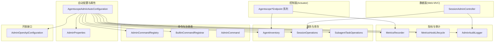
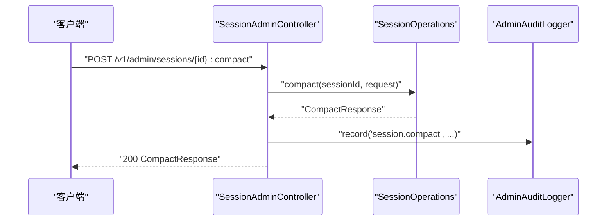
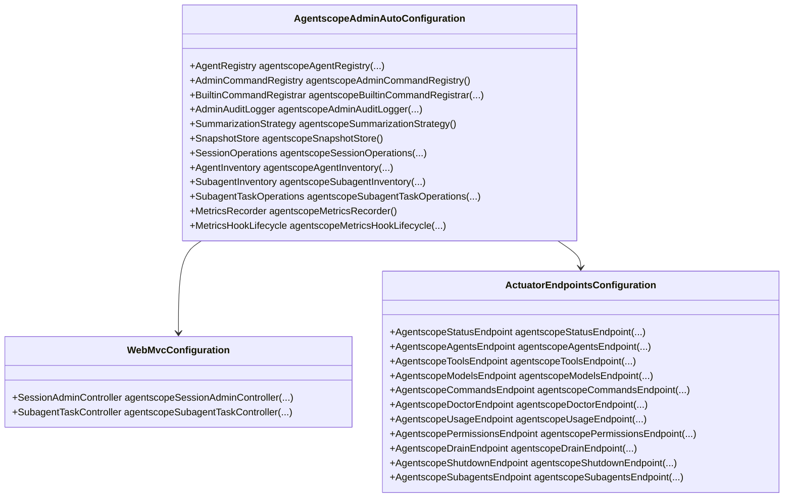
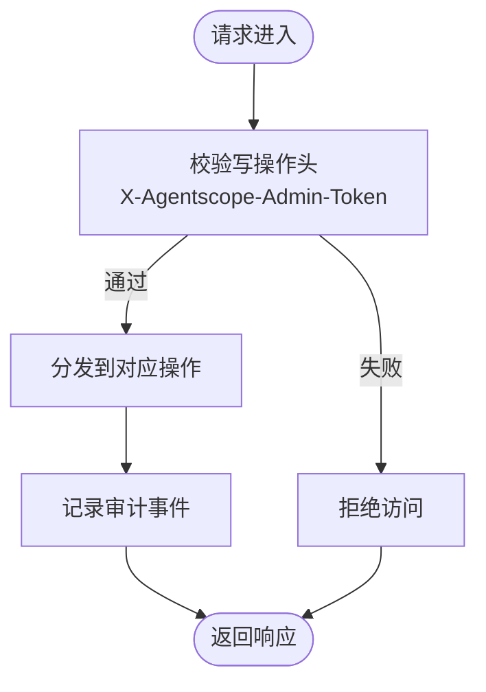
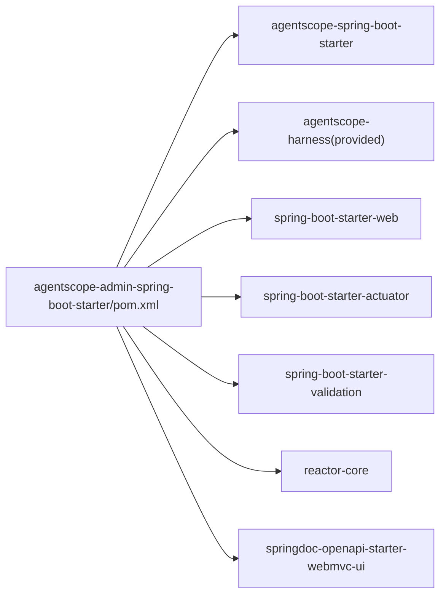

# 管理Starter

<cite>
**本文引用的文件**   
- [AgentscopeAdminAutoConfiguration.java](file://agentscope-extensions/agentscope-spring-boot-starters/agentscope-admin-spring-boot-starter/src/main/java/io/agentscope/spring/boot/admin/AgentscopeAdminAutoConfiguration.java)
- [pom.xml](file://agentscope-extensions/agentscope-spring-boot-starters/agentscope-admin-spring-boot-starter/pom.xml)
- [AdminProperties.java](file://agentscope-extensions/agentscope-spring-boot-starters/agentscope-admin-spring-boot-starter/src/main/java/io/agentscope/spring/boot/admin/properties/AdminProperties.java)
- [AgentInventory.java](file://agentscope-extensions/agentscope-spring-boot-starters/agentscope-admin-spring-boot-starter/src/main/java/io/agentscope/spring/boot/admin/service/AgentInventory.java)
- [SessionAdminController.java](file://agentscope-extensions/agentscope-spring-boot-starters/agentscope-admin-spring-boot-starter/src/main/java/io/agentscope/spring/boot/admin/controller/SessionAdminController.java)
- [MetricsRecorder.java](file://agentscope-extensions/agentscope-spring-boot-starters/agentscope-admin-spring-boot-starter/src/main/java/io/agentscope/spring/boot/admin/metrics/MetricsRecorder.java)
- [AdminOpenApiConfiguration.java](file://agentscope-extensions/agentscope-spring-boot-starters/agentscope-admin-spring-boot-starter/src/main/java/io/agentscope/spring/boot/admin/openapi/AdminOpenApiConfiguration.java)
- [CompactRequest.java](file://agentscope-extensions/agentscope-spring-boot-starters/agentscope-admin-spring-boot-starter/src/main/java/io/agentscope/spring/boot/admin/dto/CompactRequest.java)
- [AdminCommand.java](file://agentscope-extensions/agentscope-spring-boot-starters/agentscope-admin-spring-boot-starter/src/main/java/io/agentscope/spring/boot/admin/command/AdminCommand.java)
- [AgentscopeAgentsEndpoint.java](file://agentscope-extensions/agentscope-spring-boot-starters/agentscope-admin-spring-boot-starter/src/main/java/io/agentscope/spring/boot/admin/endpoint/AgentscopeAgentsEndpoint.java)
- [AgentscopeCommandsEndpoint.java](file://agentscope-extensions/agentscope-spring-boot-starters/agentscope-admin-spring-boot-starter/src/main/java/io/agentscope/spring/boot/admin/endpoint/AgentscopeCommandsEndpoint.java)
- [AgentscopeDoctorEndpoint.java](file://agentscope-extensions/agentscope-spring-boot-starters/agentscope-admin-spring-boot-starter/src/main/java/io/agentscope/spring/boot/admin/endpoint/AgentscopeDoctorEndpoint.java)
- [AgentscopeUsageEndpoint.java](file://agentscope-extensions/agentscope-spring-boot-starters/agentscope-admin-spring-boot-starter/src/main/java/io/agentscope/spring/boot/admin/endpoint/AgentscopeUsageEndpoint.java)
- [AgentscopeStatusEndpoint.java](file://agentscope-extensions/agentscope-spring-boot-starters/agentscope-admin-spring-boot-starter/src/main/java/io/agentscope/spring/boot/admin/endpoint/AgentscopeStatusEndpoint.java)
- [AgentscopeAdminAutoConfigurationTest.java](file://agentscope-extensions/agentscope-spring-boot-starters/agentscope-admin-spring-boot-starter/src/test/java/io/agentscope/spring/boot/admin/AgentscopeAdminAutoConfigurationTest.java)
</cite>

## 目录
1. [简介](#简介)
2. [项目结构](#项目结构)
3. [核心组件](#核心组件)
4. [架构总览](#架构总览)
5. [详细组件分析](#详细组件分析)
6. [依赖关系分析](#依赖关系分析)
7. [性能考虑](#性能考虑)
8. [故障排除指南](#故障排除指南)
9. [结论](#结论)
10. [附录](#附录)

## 简介
本文件面向使用 AgentScope 的 Spring Boot 应用，系统化阐述“管理Starter”的自动配置与管理能力，重点覆盖：
- AdminAutoConfiguration 的自动配置规则与 Bean 注册机制
- 管理功能：会话状态监控、运行时配置管理、系统健康检查与诊断
- 管理接口使用指南：REST API 端点、请求参数与响应结构
- 管理界面集成、安全配置与监控最佳实践
- 故障排除与性能调优建议

## 项目结构
管理Starter位于 agentscope-extensions/agentscope-spring-boot-starters/agentscope-admin-spring-boot-starter，核心模块按职责分层：
- 自动配置与属性：AgentscopeAdminAutoConfiguration、AdminProperties
- 控制面（Actuator）端点：Agentscope*Endpoint 系列
- 数据面（Web MVC）控制器：SessionAdminController
- 命令与注册表：AdminCommand、AdminCommandRegistry、BuiltinCommandRegistrar
- 服务与库存：AgentInventory、SessionOperations、SubagentTaskOperations
- 指标与审计：MetricsRecorder、MetricsHookLifecycle、AdminAuditLogger
- 文档与开放接口：AdminOpenApiConfiguration
- DTO：CompactRequest 等
- 测试：AgentscopeAdminAutoConfigurationTest

图表来源
- [AgentscopeAdminAutoConfiguration.java:94-347](file://agentscope-extensions/agentscope-spring-boot-starters/agentscope-admin-spring-boot-starter/src/main/java/io/agentscope/spring/boot/admin/AgentscopeAdminAutoConfiguration.java#L94-L347)
- [AdminProperties.java:27-106](file://agentscope-extensions/agentscope-spring-boot-starters/agentscope-admin-spring-boot-starter/src/main/java/io/agentscope/spring/boot/admin/properties/AdminProperties.java#L27-L106)
- [AdminOpenApiConfiguration.java:55-108](file://agentscope-extensions/agentscope-spring-boot-starters/agentscope-admin-spring-boot-starter/src/main/java/io/agentscope/spring/boot/admin/openapi/AdminOpenApiConfiguration.java#L55-L108)

章节来源
- [AgentscopeAdminAutoConfiguration.java:94-347](file://agentscope-extensions/agentscope-spring-boot-starters/agentscope-admin-spring-boot-starter/src/main/java/io/agentscope/spring/boot/admin/AgentscopeAdminAutoConfiguration.java#L94-L347)
- [pom.xml:43-116](file://agentscope-extensions/agentscope-spring-boot-starters/agentscope-admin-spring-boot-starter/pom.xml#L43-L116)

## 核心组件
- 自动配置与启用条件
  - 主开关 agentscope.admin.enabled=true
  - 类路径存在 Agent 类型
  - 可选启用 Actuator 端点（当 Actuator 类在类路径）
  - 可选启用 Web MVC 控制器（当 Servlet Web 应用存在）
- 关键 Bean
  - AgentRegistry、AdminCommandRegistry、AdminAuditLogger
  - SummarizationStrategy、SnapshotStore、SessionOperations
  - AgentInventory、SubagentInventory、SubagentTaskOperations
  - MetricsRecorder、MetricsHookLifecycle
  - OpenAPI 分组（可选）

章节来源
- [AgentscopeAdminAutoConfiguration.java:94-347](file://agentscope-extensions/agentscope-spring-boot-starters/agentscope-admin-spring-boot-starter/src/main/java/io/agentscope/spring/boot/admin/AgentscopeAdminAutoConfiguration.java#L94-L347)
- [AdminProperties.java:27-106](file://agentscope-extensions/agentscope-spring-boot-starters/agentscope-admin-spring-boot-starter/src/main/java/io/agentscope/spring/boot/admin/properties/AdminProperties.java#L27-L106)

## 架构总览
管理Starter采用“双平面”设计：
- 数据面（Web MVC）：面向会话级运维操作，如会话列表、消息查询、压缩、中止、撤销/重做、计划模式切换、任务列表等
- 控制面（Actuator）：面向系统级运维与诊断，如状态、命令目录、医生检查、用量统计、权限、排空、关闭、子代理清单等

图表来源
- [SessionAdminController.java:146-163](file://agentscope-extensions/agentscope-spring-boot-starters/agentscope-admin-spring-boot-starter/src/main/java/io/agentscope/spring/boot/admin/controller/SessionAdminController.java#L146-L163)
- [CompactRequest.java:27-32](file://agentscope-extensions/agentscope-spring-boot-starters/agentscope-admin-spring-boot-starter/src/main/java/io/agentscope/spring/boot/admin/dto/CompactRequest.java#L27-L32)

章节来源
- [AgentscopeAdminAutoConfiguration.java:240-346](file://agentscope-extensions/agentscope-spring-boot-starters/agentscope-admin-spring-boot-starter/src/main/java/io/agentscope/spring/boot/admin/AgentscopeAdminAutoConfiguration.java#L240-L346)

## 详细组件分析

### 自动配置与Bean注册（AdminAutoConfiguration）
- 启用条件
  - @ConditionalOnClass(Agent.class)：确保类路径包含 Agent
  - @ConditionalOnProperty(prefix="agentscope.admin", name="enabled", havingValue="true")：主开关
  - Web MVC 配置仅在 Servlet Web 应用存在时加载
  - Actuator 端点仅在 Actuator 类在类路径时加载
- Bean 注册要点
  - AgentRegistry：默认内存注册表，自动从上下文种子化单例 Agent
  - AdminCommandRegistry 与 BuiltinCommandRegistrar：内置命令注册
  - AdminAuditLogger：审计日志器
  - SummarizationStrategy、SnapshotStore、SessionOperations、AgentInventory、SubagentInventory、SubagentTaskOperations
  - MetricsRecorder 与 MetricsHookLifecycle：全局令牌用量统计钩子
  - WebMvcConfiguration：注册 SessionAdminController、SubagentTaskController
  - ActuatorEndpointsConfiguration：注册各类 Agentscope*Endpoint

图表来源
- [AgentscopeAdminAutoConfiguration.java:94-347](file://agentscope-extensions/agentscope-spring-boot-starters/agentscope-admin-spring-boot-starter/src/main/java/io/agentscope/spring/boot/admin/AgentscopeAdminAutoConfiguration.java#L94-L347)

章节来源
- [AgentscopeAdminAutoConfiguration.java:94-347](file://agentscope-extensions/agentscope-spring-boot-starters/agentscope-admin-spring-boot-starter/src/main/java/io/agentscope/spring/boot/admin/AgentscopeAdminAutoConfiguration.java#L94-L347)

### 属性与安全（AdminProperties）
- 主开关 enabled=false（默认禁用），避免误暴露
- writeEnabled=false（默认禁用写操作），生产环境建议开启并设置 write-token
- basePath="/v1/admin"（支持去除尾斜杠与空白）
- compactKeepLastMessages=2（压缩保留最后消息数）
- publishAuditEvents=true（是否发布审计事件到应用事件发布器）

章节来源
- [AdminProperties.java:27-106](file://agentscope-extensions/agentscope-spring-boot-starters/agentscope-admin-spring-boot-starter/src/main/java/io/agentscope/spring/boot/admin/properties/AdminProperties.java#L27-L106)

### 数据面：会话管理控制器（SessionAdminController）
- 路由前缀来自 agentscope.admin.base-path，默认 /v1/admin
- 支持的会话级操作（示例）
  - GET /sessions 列出会话
  - GET /sessions/{id}/messages 获取消息
  - GET /sessions/{id}/state 导出现状JSON
  - GET /sessions/{id}:export 导出Markdown
  - POST /sessions/{id}:compact 压缩会话（请求体 CompactRequest）
  - POST /sessions/{id}:abort 中止会话
  - POST /sessions/{id}:undo / :redo 撤销/重做
  - GET /sessions/{id}/plan 计划模式状态
  - POST /sessions/{id}:enter-plan-mode / :exit-plan-mode 进入/退出计划模式
  - GET /sessions/{id}/tasks 获取会话内任务列表
- 安全头
  - X-Agentscope-Admin-Operator：操作者标识
  - X-Agentscope-Admin-Token：写操作必需的共享密钥（当 writeEnabled=true 且 write-token 配置时）

图表来源
- [SessionAdminController.java:146-298](file://agentscope-extensions/agentscope-spring-boot-starters/agentscope-admin-spring-boot-starter/src/main/java/io/agentscope/spring/boot/admin/controller/SessionAdminController.java#L146-L298)

章节来源
- [SessionAdminController.java:50-298](file://agentscope-extensions/agentscope-spring-boot-starters/agentscope-admin-spring-boot-starter/src/main/java/io/agentscope/spring/boot/admin/controller/SessionAdminController.java#L50-L298)
- [CompactRequest.java:27-32](file://agentscope-extensions/agentscope-spring-boot-starters/agentscope-admin-spring-boot-starter/src/main/java/io/agentscope/spring/boot/admin/dto/CompactRequest.java#L27-L32)

### 控制面：Actuator 端点
- /actuator/agentscope-status：进程级状态摘要（含 admin 开关、写开关、基础路径、关闭状态、请求接受性、活动请求数、已注册代理数）
- /actuator/agentscope-agents：列出已知代理
- /actuator/agentscope-tools：工具包清单
- /actuator/agentscope-models：模型清单
- /actuator/agentscope-commands：管理员工命令目录（机器可读）
- /actuator/agentscope-doctor：部署自检报告（整体状态、各检查项结果）
- /actuator/agentscope-usage：累计用量统计（全局、按代理、按模型）
- /actuator/agentscope-permissions：权限信息
- /actuator/agentscope-drain：排空（停止接收新请求）
- /actuator/agentscope-shutdown：优雅关闭
- /actuator/agentscope-subagents：子代理清单

章节来源
- [AgentscopeStatusEndpoint.java:26-46](file://agentscope-extensions/agentscope-spring-boot-starters/agentscope-admin-spring-boot-starter/src/main/java/io/agentscope/spring/boot/admin/endpoint/AgentscopeStatusEndpoint.java#L26-L46)
- [AgentscopeAgentsEndpoint.java:24-38](file://agentscope-extensions/agentscope-spring-boot-starters/agentscope-admin-spring-boot-starter/src/main/java/io/agentscope/spring/boot/admin/endpoint/AgentscopeAgentsEndpoint.java#L24-L38)
- [AgentscopeCommandsEndpoint.java:24-42](file://agentscope-extensions/agentscope-spring-boot-starters/agentscope-admin-spring-boot-starter/src/main/java/io/agentscope/spring/boot/admin/endpoint/AgentscopeCommandsEndpoint.java#L24-L42)
- [AgentscopeDoctorEndpoint.java:29-115](file://agentscope-extensions/agentscope-spring-boot-starters/agentscope-admin-spring-boot-starter/src/main/java/io/agentscope/spring/boot/admin/endpoint/AgentscopeDoctorEndpoint.java#L29-L115)
- [AgentscopeUsageEndpoint.java:25-58](file://agentscope-extensions/agentscope-spring-boot-starters/agentscope-admin-spring-boot-starter/src/main/java/io/agentscope/spring/boot/admin/endpoint/AgentscopeUsageEndpoint.java#L25-L58)

### 命令体系与统一注册表
- AdminCommand：统一描述管理员工命令（id、标题、分类、平面、HTTP 方法、路径、别名、是否写、幂等、描述）
- AdminCommandRegistry：集中注册与查询
- BuiltinCommandRegistrar：内置命令注册（包含会话、子代理、系统等多类命令）

章节来源
- [AdminCommand.java:40-72](file://agentscope-extensions/agentscope-spring-boot-starters/agentscope-admin-spring-boot-starter/src/main/java/io/agentscope/spring/boot/admin/command/AdminCommand.java#L40-L72)
- [AgentscopeAdminAutoConfiguration.java:131-135](file://agentscope-extensions/agentscope-spring-boot-starters/agentscope-admin-spring-boot-starter/src/main/java/io/agentscope/spring/boot/admin/AgentscopeAdminAutoConfiguration.java#L131-L135)

### 指标与审计（MetricsRecorder 与审计）
- MetricsRecorder：线程安全的令牌用量累加器（按全局、按代理、按模型），高并发场景使用 LongAdder
- MetricsHookLifecycle：在应用启动时注册 MetricsHook，在销毁时卸载，避免重复计数
- AdminAuditLogger：将管理员工事件发布为 AdminAuditEvent，可配置是否发布

章节来源
- [MetricsRecorder.java:24-100](file://agentscope-extensions/agentscope-spring-boot-starters/agentscope-admin-spring-boot-starter/src/main/java/io/agentscope/spring/boot/admin/metrics/MetricsRecorder.java#L24-L100)
- [AgentscopeAdminAutoConfiguration.java:190-235](file://agentscope-extensions/agentscope-spring-boot-starters/agentscope-admin-spring-boot-starter/src/main/java/io/agentscope/spring/boot/admin/AgentscopeAdminAutoConfiguration.java#L190-L235)

### 管理界面集成与 OpenAPI
- AdminOpenApiConfiguration：当 springdoc 在类路径时，自动注册分组 agentscope-admin，仅包含数据面路由，并生成 OpenAPI 元数据与标签（按 AdminCommand 分类）
- 默认 OpenAPI Bean：若无用户定义，则提供标题、版本、外部文档与服务器信息

章节来源
- [AdminOpenApiConfiguration.java:37-108](file://agentscope-extensions/agentscope-spring-boot-starters/agentscope-admin-spring-boot-starter/src/main/java/io/agentscope/spring/boot/admin/openapi/AdminOpenApiConfiguration.java#L37-L108)

## 依赖关系分析
- Maven 依赖概览
  - agentscope-harness（provided）
  - agentscope-spring-boot-starter（复用核心 Starter）
  - spring-boot-starter-web、spring-boot-starter-actuator、spring-boot-starter-validation（可选）
  - reactor-core（可选）
  - springdoc-openapi-starter-webmvc-ui（可选，用于 OpenAPI）

图表来源
- [pom.xml:43-116](file://agentscope-extensions/agentscope-spring-boot-starters/agentscope-admin-spring-boot-starter/pom.xml#L43-L116)

章节来源
- [pom.xml:43-116](file://agentscope-extensions/agentscope-spring-boot-starters/agentscope-admin-spring-boot-starter/pom.xml#L43-L116)

## 性能考虑
- 指标统计
  - 使用 LongAdder 降低高并发下竞争；快照读取时重新计算，避免锁竞争
  - 全局计数器在 JVM 重启时清零，建议结合审计事件进行长期归档
- 控制器与端点
  - Actuator 端点遵循标准暴露策略；数据面控制器基于响应式 Mono，适合高并发
- 配置建议
  - 生产环境务必启用 writeEnabled 并配置 write-token
  - 合理设置 compactKeepLastMessages，平衡存储与检索成本
  - 对于大量会话与高并发场景，建议将 AgentStateStore 实现优化为持久化存储

## 故障排除指南
- 启用条件未满足
  - 症状：未注册任何管理 Bean
  - 排查：确认 agentscope.admin.enabled=true；确保 agentscope-harness 或 agentscope-core 已引入
- 写操作被拒绝
  - 症状：返回 401/403 或被拒绝
  - 排查：确认 agentscope.admin.write-enabled=true 且设置了 agentscope.admin.write-token；请求头需携带 X-Agentscope-Admin-Token
- 会话列表为空或会话详情缺失
  - 症状：/sessions 返回空列表或 /sessions/{id}/messages 报错
  - 排查：确认已注入 AgentStateStore Bean；AgentRegistry 是否正确注册了代理
- 命令目录为空
  - 症状：/actuator/agentscope-commands 返回空
  - 排查：确认 agentscope.admin.enabled=true；检查 BuiltinCommandRegistrar 是否成功注册
- 医生检查报错
  - 症状：/actuator/agentscope-doctor 显示 error/warn
  - 排查：根据诊断项逐条核对配置与 Bean 注入情况

章节来源
- [AgentscopeAdminAutoConfigurationTest.java:47-153](file://agentscope-extensions/agentscope-spring-boot-starters/agentscope-admin-spring-boot-starter/src/test/java/io/agentscope/spring/boot/admin/AgentscopeAdminAutoConfigurationTest.java#L47-L153)
- [AgentscopeDoctorEndpoint.java:52-115](file://agentscope-extensions/agentscope-spring-boot-starters/agentscope-admin-spring-boot-starter/src/main/java/io/agentscope/spring/boot/admin/endpoint/AgentscopeDoctorEndpoint.java#L52-L115)

## 结论
管理Starter通过清晰的自动配置与双平面设计，为 AgentScope 应用提供了：
- 易用的会话级运维能力（数据面）
- 系统级诊断与控制能力（控制面）
- 统一的命令目录与审计、指标体系
- 可选的 OpenAPI 文档集成
配合合理的安全与配置策略，可在生产环境中安全、稳定地支撑 Agent 生命周期管理。

## 附录

### REST API 端点一览（数据面）
- GET /{basePath}/sessions
  - 功能：列出所有会话ID
  - 头部：X-Agentscope-Admin-Operator（可选）
- GET /{basePath}/sessions/{sessionId}/messages
  - 功能：获取会话消息列表
  - 头部：X-Agentscope-Admin-Operator（可选）
- GET /{basePath}/sessions/{sessionId}/state
  - 功能：导出现状JSON
  - 头部：X-Agentscope-Admin-Operator（可选）
- GET /{basePath}/sessions/{sessionId}:export
  - 功能：导出Markdown报告
  - 头部：X-Agentscope-Admin-Operator（可选）
- POST /{basePath}/sessions/{sessionId}:compact
  - 功能：压缩会话
  - 请求体：CompactRequest（可选字段）
  - 头部：X-Agentscope-Admin-Operator、X-Agentscope-Admin-Token（写操作）
- POST /{basePath}/sessions/{sessionId}:abort
  - 功能：中止会话
  - 头部：X-Agentscope-Admin-Operator、X-Agentscope-Admin-Token（写操作）
- POST /{basePath}/sessions/{sessionId}:undo / :redo
  - 功能：撤销/重做
  - 头部：X-Agentscope-Admin-Operator、X-Agentscope-Admin-Token（写操作）
- GET /{basePath}/sessions/{sessionId}/plan
  - 功能：查看计划模式状态
  - 头部：X-Agentscope-Admin-Operator（可选）
- POST /{basePath}/sessions/{sessionId}:enter-plan-mode / :exit-plan-mode
  - 功能：进入/退出计划模式
  - 头部：X-Agentscope-Admin-Operator、X-Agentscope-Admin-Token（写操作）
- GET /{basePath}/sessions/{sessionId}/tasks
  - 功能：获取会话内任务列表
  - 头部：X-Agentscope-Admin-Operator（可选）

章节来源
- [SessionAdminController.java:72-298](file://agentscope-extensions/agentscope-spring-boot-starters/agentscope-admin-spring-boot-starter/src/main/java/io/agentscope/spring/boot/admin/controller/SessionAdminController.java#L72-L298)
- [CompactRequest.java:27-32](file://agentscope-extensions/agentscope-spring-boot-starters/agentscope-admin-spring-boot-starter/src/main/java/io/agentscope/spring/boot/admin/dto/CompactRequest.java#L27-L32)

### Actuator 端点一览（控制面）
- /actuator/agentscope-status：进程级状态摘要
- /actuator/agentscope-agents：代理清单
- /actuator/agentscope-tools：工具包清单
- /actuator/agentscope-models：模型清单
- /actuator/agentscope-commands：管理员工命令目录
- /actuator/agentscope-doctor：部署自检
- /actuator/agentscope-usage：用量统计
- /actuator/agentscope-permissions：权限信息
- /actuator/agentscope-drain：排空
- /actuator/agentscope-shutdown：优雅关闭
- /actuator/agentscope-subagents：子代理清单

章节来源
- [AgentscopeStatusEndpoint.java:26-46](file://agentscope-extensions/agentscope-spring-boot-starters/agentscope-admin-spring-boot-starter/src/main/java/io/agentscope/spring/boot/admin/endpoint/AgentscopeStatusEndpoint.java#L26-L46)
- [AgentscopeAgentsEndpoint.java:24-38](file://agentscope-extensions/agentscope-spring-boot-starters/agentscope-admin-spring-boot-starter/src/main/java/io/agentscope/spring/boot/admin/endpoint/AgentscopeAgentsEndpoint.java#L24-L38)
- [AgentscopeCommandsEndpoint.java:24-42](file://agentscope-extensions/agentscope-spring-boot-starters/agentscope-admin-spring-boot-starter/src/main/java/io/agentscope/spring/boot/admin/endpoint/AgentscopeCommandsEndpoint.java#L24-L42)
- [AgentscopeDoctorEndpoint.java:29-115](file://agentscope-extensions/agentscope-spring-boot-starters/agentscope-admin-spring-boot-starter/src/main/java/io/agentscope/spring/boot/admin/endpoint/AgentscopeDoctorEndpoint.java#L29-L115)
- [AgentscopeUsageEndpoint.java:25-58](file://agentscope-extensions/agentscope-spring-boot-starters/agentscope-admin-spring-boot-starter/src/main/java/io/agentscope/spring/boot/admin/endpoint/AgentscopeUsageEndpoint.java#L25-L58)

### 配置项参考
- agentscope.admin.enabled：是否启用管理Starter（默认 false）
- agentscope.admin.write-enabled：是否允许写操作（默认 false）
- agentscope.admin.base-path：数据面基础路径（默认 /v1/admin）
- agentscope.admin.write-token：写操作令牌（建议生产配置）
- agentscope.admin.compact-keep-last-messages：压缩时保留最后消息数（默认 2）
- agentscope.admin.publish-audit-events：是否发布审计事件（默认 true）

章节来源
- [AdminProperties.java:27-106](file://agentscope-extensions/agentscope-spring-boot-starters/agentscope-admin-spring-boot-starter/src/main/java/io/agentscope/spring/boot/admin/properties/AdminProperties.java#L27-L106)