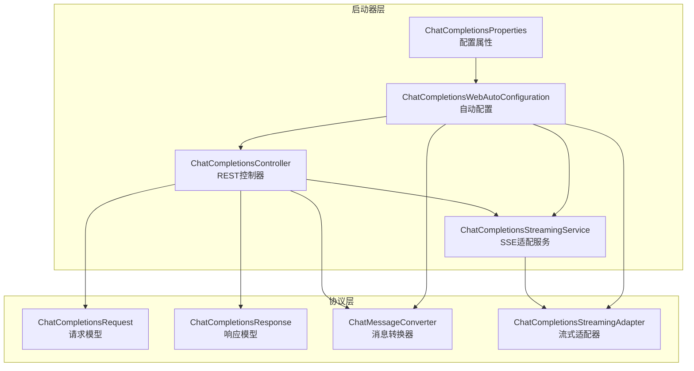
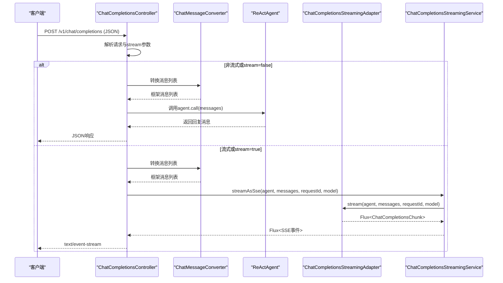
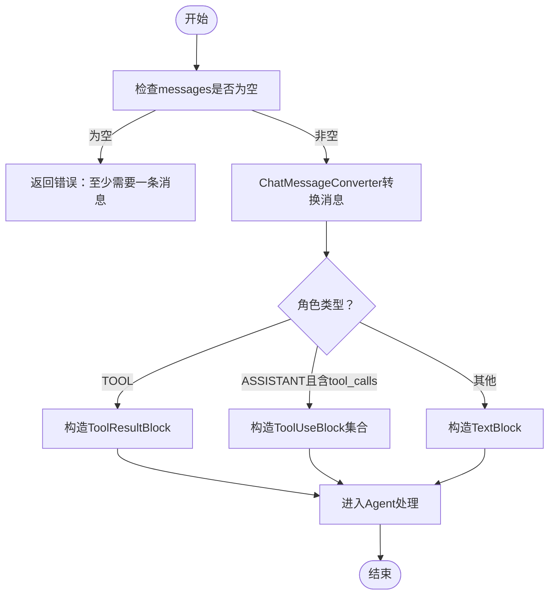
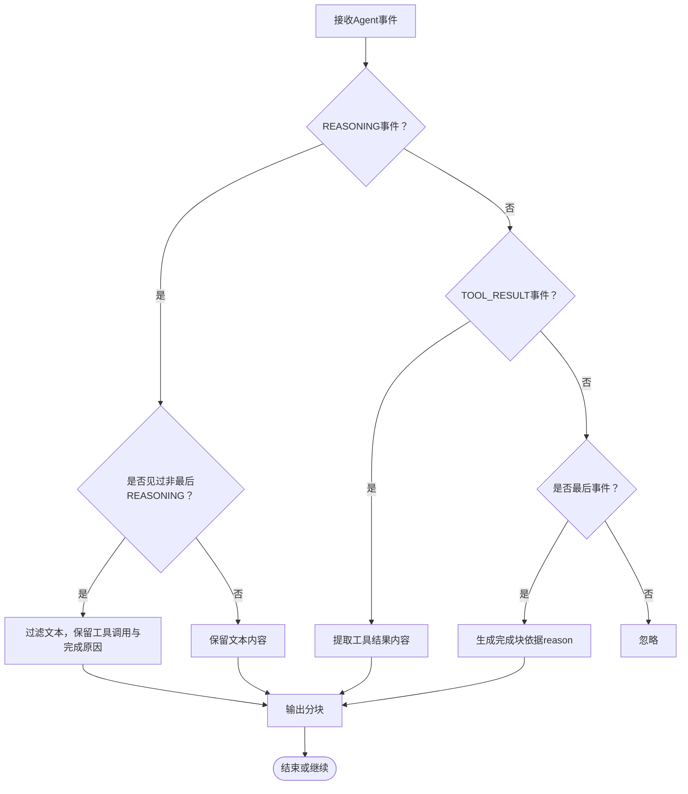
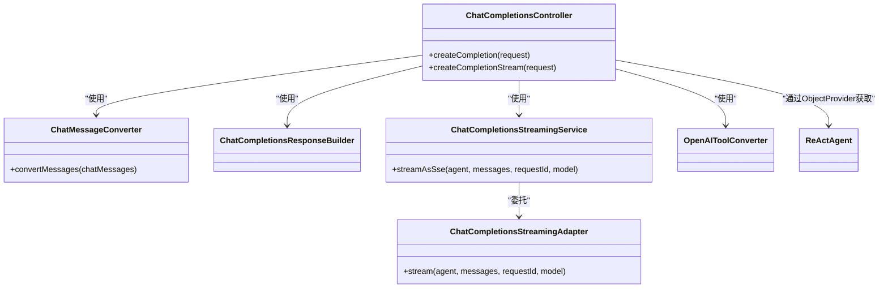

# 聊天补全Web Starter

<cite>
**本文档引用的文件**
- [ChatCompletionsController.java](file://agentscope-extensions/agentscope-spring-boot-starters/agentscope-chat-completions-web-starter/src/main/java/io/agentscope/spring/boot/chat/web/ChatCompletionsController.java)
- [ChatCompletionsStreamingService.java](file://agentscope-extensions/agentscope-spring-boot-starters/agentscope-chat-completions-web-starter/src/main/java/io/agentscope/spring/boot/chat/service/ChatCompletionsStreamingService.java)
- [ChatCompletionsWebAutoConfiguration.java](file://agentscope-extensions/agentscope-spring-boot-starters/agentscope-chat-completions-web-starter/src/main/java/io/agentscope/spring/boot/chat/config/ChatCompletionsWebAutoConfiguration.java)
- [ChatCompletionsProperties.java](file://agentscope-extensions/agentscope-spring-boot-starters/agentscope-chat-completions-web-starter/src/main/java/io/agentscope/spring/boot/chat/config/ChatCompletionsProperties.java)
- [ChatCompletionsRequest.java](file://agentscope-extensions/agentscope-extensions-protocol/agentscope-extensions-chat-completions-web/src/main/java/io/agentscope/core/chat/completions/model/ChatCompletionsRequest.java)
- [ChatCompletionsResponse.java](file://agentscope-extensions/agentscope-extensions-protocol/agentscope-extensions-chat-completions-web/src/main/java/io/agentscope/core/chat/completions/model/ChatCompletionsResponse.java)
- [ChatMessageConverter.java](file://agentscope-extensions/agentscope-extensions-protocol/agentscope-extensions-chat-completions-web/src/main/java/io/agentscope/core/chat/completions/converter/ChatMessageConverter.java)
- [ChatCompletionsStreamingAdapter.java](file://agentscope-extensions/agentscope-extensions-protocol/agentscope-extensions-chat-completions-web/src/main/java/io/agentscope/core/chat/completions/streaming/ChatCompletionsStreamingAdapter.java)
- [ChatCompletionsControllerTest.java](file://agentscope-extensions/agentscope-spring-boot-starters/agentscope-chat-completions-web-starter/src/test/java/io/agentscope/spring/boot/chat/web/ChatCompletionsControllerTest.java)
- [ChatCompletionsRequestTest.java](file://agentscope-extensions/agentscope-extensions-protocol/agentscope-extensions-chat-completions-web/src/test/java/io/agentscope/core/chat/completions/model/ChatCompletionsRequestTest.java)
- [ChatCompletionsResponseTest.java](file://agentscope-extensions/agentscope-extensions-protocol/agentscope-extensions-chat-completions-web/src/test/java/io/agentscope/core/chat/completions/model/ChatCompletionsResponseTest.java)
</cite>

## 目录
1. [简介](#简介)
2. [项目结构](#项目结构)
3. [核心组件](#核心组件)
4. [架构总览](#架构总览)
5. [详细组件分析](#详细组件分析)
6. [依赖关系分析](#依赖关系分析)
7. [性能考虑](#性能考虑)
8. [故障排除指南](#故障排除指南)
9. [结论](#结论)
10. [附录：API使用示例与配置](#附录api使用示例与配置)

## 简介
本项目为AgentScope聊天补全Web Spring Boot Starter，提供与OpenAI兼容的聊天补全HTTP接口，支持非流式JSON响应与Server-Sent Events（SSE）流式输出。控制器采用无状态设计，每次请求携带完整对话历史，由框架内部的ReActAgent处理并返回结果。同时提供工具调用支持，允许在响应中返回工具调用指令，客户端可按规范执行工具并继续对话。

## 项目结构
该模块位于Spring Boot Starter与协议模型之间，采用分层设计：
- 启动器层：控制器、自动配置、流式服务
- 协议层：请求/响应模型、消息转换器、流式适配器
- 测试层：控制器行为验证、模型正确性校验

**图表来源**
- [ChatCompletionsController.java:77-294](file://agentscope-extensions/agentscope-spring-boot-starters/agentscope-chat-completions-web-starter/src/main/java/io/agentscope/spring/boot/chat/web/ChatCompletionsController.java#L77-L294)
- [ChatCompletionsStreamingService.java:52-127](file://agentscope-extensions/agentscope-spring-boot-starters/agentscope-chat-completions-web-starter/src/main/java/io/agentscope/spring/boot/chat/service/ChatCompletionsStreamingService.java#L52-L127)
- [ChatCompletionsWebAutoConfiguration.java:53-151](file://agentscope-extensions/agentscope-spring-boot-starters/agentscope-chat-completions-web-starter/src/main/java/io/agentscope/spring/boot/chat/config/ChatCompletionsWebAutoConfiguration.java#L53-L151)
- [ChatCompletionsProperties.java:34-59](file://agentscope-extensions/agentscope-spring-boot-starters/agentscope-chat-completions-web-starter/src/main/java/io/agentscope/spring/boot/chat/config/ChatCompletionsProperties.java#L34-L59)
- [ChatCompletionsRequest.java:58-115](file://agentscope-extensions/agentscope-extensions-protocol/agentscope-extensions-chat-completions-web/src/main/java/io/agentscope/core/chat/completions/model/ChatCompletionsRequest.java#L58-L115)
- [ChatCompletionsResponse.java:86-208](file://agentscope-extensions/agentscope-extensions-protocol/agentscope-extensions-chat-completions-web/src/main/java/io/agentscope/core/chat/completions/model/ChatCompletionsResponse.java#L86-L208)
- [ChatMessageConverter.java:51-213](file://agentscope-extensions/agentscope-extensions-protocol/agentscope-extensions-chat-completions-web/src/main/java/io/agentscope/core/chat/completions/converter/ChatMessageConverter.java#L51-L213)
- [ChatCompletionsStreamingAdapter.java:68-334](file://agentscope-extensions/agentscope-extensions-protocol/agentscope-extensions-chat-completions-web/src/main/java/io/agentscope/core/chat/completions/streaming/ChatCompletionsStreamingAdapter.java#L68-L334)

**章节来源**
- [ChatCompletionsController.java:1-294](file://agentscope-extensions/agentscope-spring-boot-starters/agentscope-chat-completions-web-starter/src/main/java/io/agentscope/spring/boot/chat/web/ChatCompletionsController.java#L1-L294)
- [ChatCompletionsWebAutoConfiguration.java:1-151](file://agentscope-extensions/agentscope-spring-boot-starters/agentscope-chat-completions-web-starter/src/main/java/io/agentscope/spring/boot/chat/config/ChatCompletionsWebAutoConfiguration.java#L1-L151)

## 核心组件
- ChatCompletionsController：暴露/v1/chat/completions端点，支持非流式JSON与SSE流式两种模式；自动根据请求参数或Accept头选择处理路径。
- ChatCompletionsStreamingService：将框架无关的流式事件转换为SSE事件，负责JSON序列化与结束事件标记。
- ChatCompletionsStreamingAdapter：将Agent事件流转换为OpenAI兼容的流式块，支持文本增量、工具调用、工具结果与完成事件。
- ChatMessageConverter：将HTTP请求中的消息DTO转换为框架内部消息对象，支持角色映射、工具调用与工具结果消息。
- ChatCompletionsWebAutoConfiguration：基于条件注解启用自动装配，注册控制器、转换器、构建器、流式适配器与服务。
- ChatCompletionsProperties：提供启用开关与基础路径等配置项。

**章节来源**
- [ChatCompletionsController.java:77-294](file://agentscope-extensions/agentscope-spring-boot-starters/agentscope-chat-completions-web-starter/src/main/java/io/agentscope/spring/boot/chat/web/ChatCompletionsController.java#L77-L294)
- [ChatCompletionsStreamingService.java:52-127](file://agentscope-extensions/agentscope-spring-boot-starters/agentscope-chat-completions-web-starter/src/main/java/io/agentscope/spring/boot/chat/service/ChatCompletionsStreamingService.java#L52-L127)
- [ChatCompletionsStreamingAdapter.java:68-334](file://agentscope-extensions/agentscope-extensions-protocol/agentscope-extensions-chat-completions-web/src/main/java/io/agentscope/core/chat/completions/streaming/ChatCompletionsStreamingAdapter.java#L68-L334)
- [ChatMessageConverter.java:51-213](file://agentscope-extensions/agentscope-extensions-protocol/agentscope-extensions-chat-completions-web/src/main/java/io/agentscope/core/chat/completions/converter/ChatMessageConverter.java#L51-L213)
- [ChatCompletionsWebAutoConfiguration.java:53-151](file://agentscope-extensions/agentscope-spring-boot-starters/agentscope-chat-completions-web-starter/src/main/java/io/agentscope/spring/boot/chat/config/ChatCompletionsWebAutoConfiguration.java#L53-L151)
- [ChatCompletionsProperties.java:34-59](file://agentscope-extensions/agentscope-spring-boot-starters/agentscope-chat-completions-web-starter/src/main/java/io/agentscope/spring/boot/chat/config/ChatCompletionsProperties.java#L34-L59)

## 架构总览
下图展示从HTTP请求到Agent处理再到SSE响应的完整链路：

**图表来源**
- [ChatCompletionsController.java:123-202](file://agentscope-extensions/agentscope-spring-boot-starters/agentscope-chat-completions-web-starter/src/main/java/io/agentscope/spring/boot/chat/web/ChatCompletionsController.java#L123-L202)
- [ChatCompletionsStreamingService.java:79-84](file://agentscope-extensions/agentscope-spring-boot-starters/agentscope-chat-completions-web-starter/src/main/java/io/agentscope/spring/boot/chat/service/ChatCompletionsStreamingService.java#L79-L84)
- [ChatCompletionsStreamingAdapter.java:92-125](file://agentscope-extensions/agentscope-extensions-protocol/agentscope-extensions-chat-completions-web/src/main/java/io/agentscope/core/chat/completions/streaming/ChatCompletionsStreamingAdapter.java#L92-L125)
- [ChatMessageConverter.java:68-77](file://agentscope-extensions/agentscope-extensions-protocol/agentscope-extensions-chat-completions-web/src/main/java/io/agentscope/core/chat/completions/converter/ChatMessageConverter.java#L68-L77)

## 详细组件分析

### REST API设计与端点定义
- 基础路径：可通过配置agentscope.chat-completions.base-path自定义，默认/v1/chat/completions。
- 非流式端点：POST /v1/chat/completions，consumes=application/json，返回JSON响应。
- 流式端点：POST /v1/chat/completions，consumes=application/json，produces=text/event-stream，返回SSE流。
- 兼容性：完全遵循OpenAI Chat Completions API规范，支持messages、stream、tools等字段。

请求处理逻辑要点：
- 当request.stream为true时，即使未设置Accept: text/event-stream，也会自动切换到流式模式以提升兼容性。
- 当在流式端点显式传入stream=false时，会直接拒绝该请求并提示使用非流式端点。
- 控制器通过ObjectProvider获取原型作用域的Agent实例，确保每次请求无状态。

响应格式：
- 非流式：标准OpenAI格式的ChatCompletionsResponse，包含choices、usage等。
- 流式：SSE数据字段为ChatCompletionsChunk的JSON序列化，以"[DONE]"事件结束。

**章节来源**
- [ChatCompletionsController.java:123-202](file://agentscope-extensions/agentscope-spring-boot-starters/agentscope-chat-completions-web-starter/src/main/java/io/agentscope/spring/boot/chat/web/ChatCompletionsController.java#L123-L202)
- [ChatCompletionsController.java:213-292](file://agentscope-extensions/agentscope-spring-boot-starters/agentscope-chat-completions-web-starter/src/main/java/io/agentscope/spring/boot/chat/web/ChatCompletionsController.java#L213-L292)
- [ChatCompletionsRequest.java:58-115](file://agentscope-extensions/agentscope-extensions-protocol/agentscope-extensions-chat-completions-web/src/main/java/io/agentscope/core/chat/completions/model/ChatCompletionsRequest.java#L58-L115)
- [ChatCompletionsResponse.java:86-208](file://agentscope-extensions/agentscope-extensions-protocol/agentscope-extensions-chat-completions-web/src/main/java/io/agentscope/core/chat/completions/model/ChatCompletionsResponse.java#L86-L208)

### 对话管理与消息路由
- 无状态设计：每次请求必须包含完整的messages数组，服务器不维护会话状态。
- 角色映射：支持user、assistant、system、tool四种角色，其中assistant可携带tool_calls，tool消息包含tool_call_id与name。
- 工具调用流程：当代理决定调用工具时，响应中出现tool_calls；客户端需执行工具并将结果以tool消息形式追加到历史后再次发送。

**图表来源**
- [ChatMessageConverter.java:86-165](file://agentscope-extensions/agentscope-extensions-protocol/agentscope-extensions-chat-completions-web/src/main/java/io/agentscope/core/chat/completions/converter/ChatMessageConverter.java#L86-L165)

**章节来源**
- [ChatMessageConverter.java:51-213](file://agentscope-extensions/agentscope-extensions-protocol/agentscope-extensions-chat-completions-web/src/main/java/io/agentscope/core/chat/completions/converter/ChatMessageConverter.java#L51-L213)
- [ChatCompletionsRequest.java:26-57](file://agentscope-extensions/agentscope-extensions-protocol/agentscope-extensions-chat-completions-web/src/main/java/io/agentscope/core/chat/completions/model/ChatCompletionsRequest.java#L26-L57)

### 流式响应处理机制
- 事件过滤：仅订阅REASONING与TOOL_RESULT两类事件，并开启增量模式。
- 文本去重：若检测到存在非最后REASONING事件（即增量文本），则过滤掉最后累积事件中的文本内容，避免重复。
- 分块生成：根据事件内容生成文本块、工具调用块、工具结果块与完成块。
- 错误处理：将异常转换为包含错误信息的文本块，便于客户端识别。

**图表来源**
- [ChatCompletionsStreamingAdapter.java:92-125](file://agentscope-extensions/agentscope-extensions-protocol/agentscope-extensions-chat-completions-web/src/main/java/io/agentscope/core/chat/completions/streaming/ChatCompletionsStreamingAdapter.java#L92-L125)
- [ChatCompletionsStreamingAdapter.java:137-275](file://agentscope-extensions/agentscope-extensions-protocol/agentscope-extensions-chat-completions-web/src/main/java/io/agentscope/core/chat/completions/streaming/ChatCompletionsStreamingAdapter.java#L137-L275)

**章节来源**
- [ChatCompletionsStreamingAdapter.java:68-334](file://agentscope-extensions/agentscope-extensions-protocol/agentscope-extensions-chat-completions-web/src/main/java/io/agentscope/core/chat/completions/streaming/ChatCompletionsStreamingAdapter.java#L68-L334)
- [ChatCompletionsStreamingService.java:79-127](file://agentscope-extensions/agentscope-spring-boot-starters/agentscope-chat-completions-web-starter/src/main/java/io/agentscope/spring/boot/chat/service/ChatCompletionsStreamingService.java#L79-L127)

### 自动配置与Bean装配
- 条件启用：当agentscope.chat-completions.enabled为true（默认）且存在ReActAgent类时生效。
- Bean注册：自动注册消息转换器、工具转换器、响应构建器、流式适配器与流式服务；控制器通过ObjectProvider注入以保证无状态。
- 可选覆盖：若应用已定义同名Bean，则不会重复注册。

**章节来源**
- [ChatCompletionsWebAutoConfiguration.java:53-151](file://agentscope-extensions/agentscope-spring-boot-starters/agentscope-chat-completions-web-starter/src/main/java/io/agentscope/spring/boot/chat/config/ChatCompletionsWebAutoConfiguration.java#L53-L151)

## 依赖关系分析
- 控制器依赖：消息转换器、响应构建器、流式服务、工具转换器、Agent提供者。
- 流式服务依赖：框架无关的流式适配器，负责事件到分块的转换。
- 流式适配器依赖：Agent事件流、消息内容块、工具调用/结果模型。

**图表来源**
- [ChatCompletionsController.java:83-109](file://agentscope-extensions/agentscope-spring-boot-starters/agentscope-chat-completions-web-starter/src/main/java/io/agentscope/spring/boot/chat/web/ChatCompletionsController.java#L83-L109)
- [ChatCompletionsStreamingService.java:63-65](file://agentscope-extensions/agentscope-spring-boot-starters/agentscope-chat-completions-web-starter/src/main/java/io/agentscope/spring/boot/chat/service/ChatCompletionsStreamingService.java#L63-L65)

**章节来源**
- [ChatCompletionsController.java:83-109](file://agentscope-extensions/agentscope-spring-boot-starters/agentscope-chat-completions-web-starter/src/main/java/io/agentscope/spring/boot/chat/web/ChatCompletionsController.java#L83-L109)
- [ChatCompletionsStreamingService.java:52-127](file://agentscope-extensions/agentscope-spring-boot-starters/agentscope-chat-completions-web-starter/src/main/java/io/agentscope/spring/boot/chat/service/ChatCompletionsStreamingService.java#L52-L127)

## 性能考虑
- 无状态设计：每次请求独立处理，避免服务器端会话开销，适合水平扩展。
- 增量文本去重：在增量模式下过滤最后累积事件的文本，减少冗余传输。
- 原型Bean：通过ObjectProvider获取Agent实例，避免共享状态带来的锁竞争。
- 流式传输：SSE逐块推送，降低首字节延迟，改善用户体验。
- 日志与追踪：控制器记录请求ID与耗时，便于问题定位与性能分析。

[本节为通用指导，无需列出具体文件来源]

## 故障排除指南
常见问题与处理：
- 请求缺少messages：返回错误，提示至少需要一条消息。
- Agent实例创建失败：返回错误，提示agentProvider返回null。
- 在流式端点传入stream=false：直接拒绝请求，提示使用非流式端点。
- 流式过程中发生异常：转换为包含错误信息的SSE事件返回。
- 工具调用参数解析失败：记录警告并使用空参数继续处理。

**章节来源**
- [ChatCompletionsControllerTest.java:171-214](file://agentscope-extensions/agentscope-spring-boot-starters/agentscope-chat-completions-web-starter/src/test/java/io/agentscope/spring/boot/chat/web/ChatCompletionsControllerTest.java#L171-L214)
- [ChatCompletionsControllerTest.java:330-348](file://agentscope-extensions/agentscope-spring-boot-starters/agentscope-chat-completions-web-starter/src/test/java/io/agentscope/spring/boot/chat/web/ChatCompletionsControllerTest.java#L330-L348)
- [ChatCompletionsControllerTest.java:370-390](file://agentscope-extensions/agentscope-spring-boot-starters/agentscope-chat-completions-web-starter/src/test/java/io/agentscope/spring/boot/chat/web/ChatCompletionsControllerTest.java#L370-L390)
- [ChatMessageConverter.java:173-184](file://agentscope-extensions/agentscope-extensions-protocol/agentscope-extensions-chat-completions-web/src/main/java/io/agentscope/core/chat/completions/converter/ChatMessageConverter.java#L173-L184)

## 结论
本Starter以无状态、与OpenAI兼容为核心设计理念，通过清晰的分层与可替换的适配器，既满足了快速集成的需求，又保持了良好的扩展性。非流式与流式双通道设计兼顾了不同客户端场景，配合完善的错误处理与日志追踪，能够稳定支撑生产环境下的聊天补全服务。

[本节为总结性内容，无需列出具体文件来源]

## 附录：API使用示例与配置

### API使用示例
以下示例描述典型交互流程，不包含具体代码片段，请参考测试用例定位实现位置。

- 单轮对话（非流式）
  - 客户端发送包含messages的JSON请求至/v1/chat/completions，stream=false或省略。
  - 服务器返回标准OpenAI格式的ChatCompletionsResponse。
  - 参考路径：[ChatCompletionsControllerTest.java:96-129](file://agentscope-extensions/agentscope-spring-boot-starters/agentscope-chat-completions-web-starter/src/test/java/io/agentscope/spring/boot/chat/web/ChatCompletionsControllerTest.java#L96-L129)

- 多轮对话（非流式）
  - 客户端每次请求均携带完整的历史messages，服务器不保存状态。
  - 支持system、user、assistant、tool角色的消息组合。
  - 参考路径：[ChatCompletionsRequestTest.java:108-143](file://agentscope-extensions/agentscope-extensions-protocol/agentscope-extensions-chat-completions-web/src/test/java/io/agentscope/core/chat/completions/model/ChatCompletionsRequestTest.java#L108-L143)

- 流式输出（SSE）
  - 客户端发送stream=true或在非流式端点设置Accept: text/event-stream。
  - 服务器返回text/event-stream，数据字段为ChatCompletionsChunk的JSON。
  - 参考路径：[ChatCompletionsControllerTest.java:133-167](file://agentscope-extensions/agentscope-spring-boot-starters/agentscope-chat-completions-web-starter/src/test/java/io/agentscope/spring/boot/chat/web/ChatCompletionsControllerTest.java#L133-L167)

- 工具调用
  - 代理在assistant消息中返回tool_calls；客户端执行工具并将tool消息加入历史后再次请求。
  - 参考路径：[ChatCompletionsResponseTest.java:207-227](file://agentscope-extensions/agentscope-extensions-protocol/agentscope-extensions-chat-completions-web/src/test/java/io/agentscope/core/chat/completions/model/ChatCompletionsResponseTest.java#L207-L227)

### 配置选项
- 启用开关：agentscope.chat-completions.enabled=true（默认）
- 基础路径：agentscope.chat-completions.base-path=/v1/chat/completions
- 会话管理：当前版本为无状态设计，不包含内置会话存储配置

**章节来源**
- [ChatCompletionsProperties.java:34-59](file://agentscope-extensions/agentscope-spring-boot-starters/agentscope-chat-completions-web-starter/src/main/java/io/agentscope/spring/boot/chat/config/ChatCompletionsProperties.java#L34-L59)
- [ChatCompletionsWebAutoConfiguration.java:55-59](file://agentscope-extensions/agentscope-spring-boot-starters/agentscope-chat-completions-web-starter/src/main/java/io/agentscope/spring/boot/chat/config/ChatCompletionsWebAutoConfiguration.java#L55-L59)

### WebSocket集成指南
- 当前Starter提供SSE流式输出，未内置WebSocket端点。
- 若需WebSocket集成，可在应用层新增WebSocket处理器，将Agent事件转换为WebSocket帧进行推送。
- 注意：WebSocket与SSE在连接管理、错误恢复与浏览器兼容性方面存在差异，需结合业务场景评估。

[本节为概念性指导，无需列出具体文件来源]