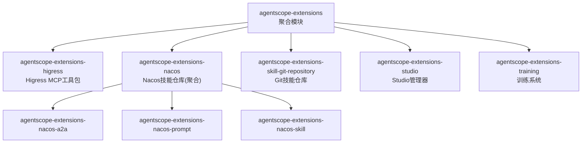
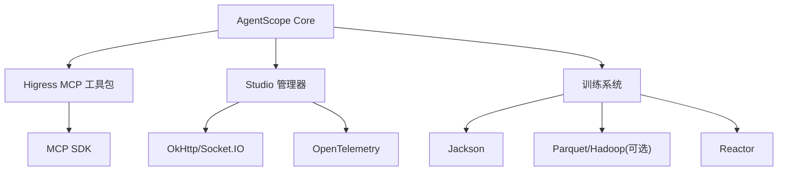
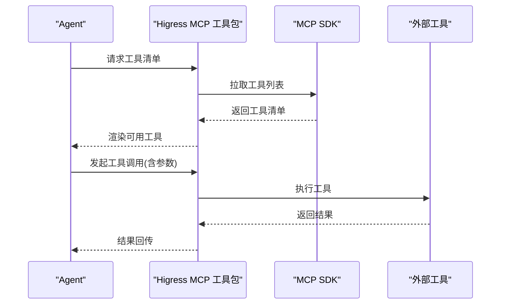
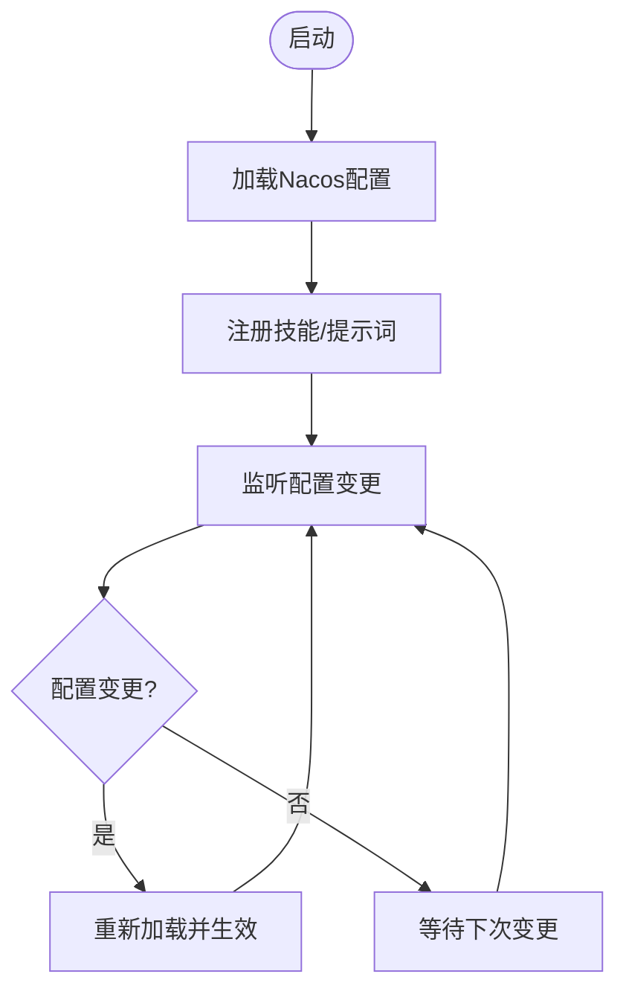
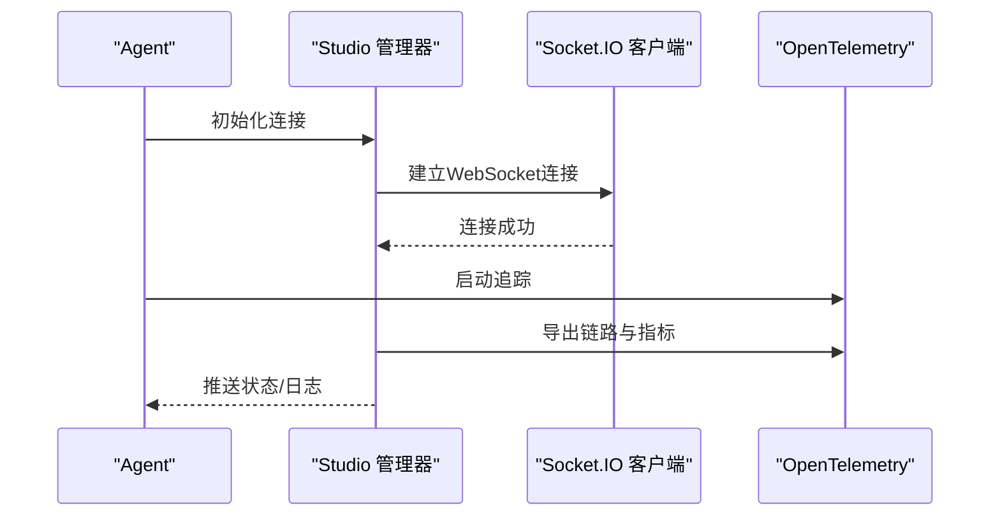
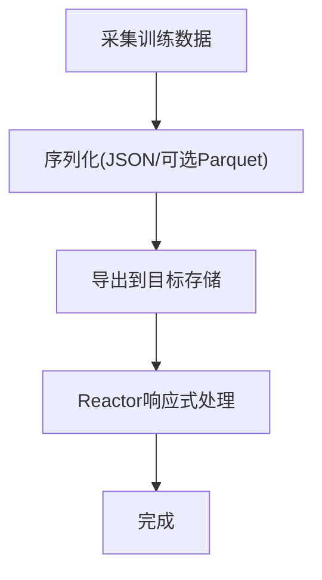
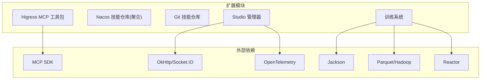

# 其他扩展

<cite>
**本文引用的文件**
- [agentscope-extensions/pom.xml](file://agentscope-extensions/pom.xml)
- [agentscope-extensions/agentscope-extensions-higress/pom.xml](file://agentscope-extensions/agentscope-extensions-higress/pom.xml)
- [agentscope-extensions/agentscope-extensions-nacos/pom.xml](file://agentscope-extensions/agentscope-extensions-nacos/pom.xml)
- [agentscope-extensions/agentscope-extensions-studio/pom.xml](file://agentscope-extensions/agentscope-extensions-studio/pom.xml)
- [agentscope-extensions/agentscope-extensions-training/pom.xml](file://agentscope-extensions/agentscope-extensions-training/pom.xml)
</cite>

## 目录
1. [简介](#简介)
2. [项目结构](#项目结构)
3. [核心组件](#核心组件)
4. [架构总览](#架构总览)
5. [详细组件分析](#详细组件分析)
6. [依赖分析](#依赖分析)
7. [性能考虑](#性能考虑)
8. [故障排查指南](#故障排查指南)
9. [结论](#结论)
10. [附录](#附录)

## 简介
本章节面向AgentScope Java的“其他扩展”模块，聚焦于以下特殊能力扩展：Higress MCP工具包、Nacos技能仓库、Git技能仓库、Studio管理器、训练系统。文档从设计目标、技术架构、应用场景、扩展间协作与集成方式、配置示例、API接口与使用指南等方面进行系统化梳理，并给出扩展开发最佳实践与自定义扩展实现方法，帮助读者快速理解并高效使用这些扩展。

## 项目结构
“其他扩展”位于agentscope-extensions模块中，采用多模块聚合结构，每个子模块独立封装特定能力或第三方集成。核心模块包括：
- Higress MCP工具包：基于MCP协议与AgentScope核心能力集成，用于在AI网关场景下实现工具选择与调用。
- Nacos技能仓库：以Nacos为注册中心与配置中心，提供技能（Skill）与提示词（Prompt）的动态发布与订阅。
- Git技能仓库：通过Git仓库作为技能存储与版本化管理，支持技能的版本控制与回滚。
- Studio管理器：提供与Studio的通信与可观测性能力，支持WebSocket连接与OpenTelemetry追踪导出。
- 训练系统：提供训练数据采集与导出能力，支持JSON与可选Parquet格式，配合Reactor进行响应式处理。

图表来源
- [agentscope-extensions/pom.xml:33-49](file://agentscope-extensions/pom.xml#L33-L49)

章节来源
- [agentscope-extensions/pom.xml:1-51](file://agentscope-extensions/pom.xml#L1-L51)

## 核心组件
本节对各扩展模块的核心职责与边界进行概述，便于快速定位与集成。

- Higress MCP工具包
  - 设计目标：在Higress AI网关场景下，借助MCP协议实现工具选择与调用，提升Agent对外部工具的发现与执行能力。
  - 关键依赖：依赖AgentScope核心与MCP SDK，测试框架采用JUnit与Mockito。
  - 应用场景：需要在网关层统一编排工具调用、进行工具选择与安全控制的智能体系统。

- Nacos技能仓库
  - 设计目标：以Nacos为注册中心与配置中心，实现技能与提示词的集中化管理、动态发布与订阅。
  - 组织形式：作为聚合模块，包含A2A、Prompt、Skill三个子模块，分别对应不同维度的配置与服务治理。
  - 应用场景：多环境、多租户下的技能与提示词分发，以及灰度发布与热更新需求。

- Git技能仓库
  - 设计目标：将技能以Git仓库进行版本化管理，支持分支策略、变更审计与回滚。
  - 应用场景：对技能进行源码级管理、团队协作与合规审计的场景。

- Studio管理器
  - 设计目标：提供与Studio的通信与可观测性能力，支持WebSocket连接与OpenTelemetry追踪导出。
  - 关键依赖：OkHttp、Socket.IO客户端、OpenTelemetry生态。
  - 应用场景：可视化调试、远程监控与链路追踪。

- 训练系统
  - 设计目标：提供训练数据采集与导出能力，支持JSON与可选Parquet格式，结合Reactor进行响应式处理。
  - 关键依赖：Jackson、Parquet/Hadoop可选、SLF4J、Reactor。
  - 应用场景：离线/在线训练数据收集、批处理与流式导出。

章节来源
- [agentscope-extensions/agentscope-extensions-higress/pom.xml:33-62](file://agentscope-extensions/agentscope-extensions-higress/pom.xml#L33-L62)
- [agentscope-extensions/agentscope-extensions-nacos/pom.xml:34-38](file://agentscope-extensions/agentscope-extensions-nacos/pom.xml#L34-L38)
- [agentscope-extensions/agentscope-extensions-studio/pom.xml:33-75](file://agentscope-extensions/agentscope-extensions-studio/pom.xml#L33-L75)
- [agentscope-extensions/agentscope-extensions-training/pom.xml:33-108](file://agentscope-extensions/agentscope-extensions-training/pom.xml#L33-L108)

## 架构总览
下图展示了“其他扩展”模块与AgentScope核心的关系，以及主要外部依赖：

图表来源
- [agentscope-extensions/agentscope-extensions-higress/pom.xml:34-42](file://agentscope-extensions/agentscope-extensions-higress/pom.xml#L34-L42)
- [agentscope-extensions/agentscope-extensions-studio/pom.xml:42-74](file://agentscope-extensions/agentscope-extensions-studio/pom.xml#L42-L74)
- [agentscope-extensions/agentscope-extensions-training/pom.xml:41-80](file://agentscope-extensions/agentscope-extensions-training/pom.xml#L41-L80)

## 详细组件分析

### Higress MCP工具包
- 设计目标
  - 在Higress AI网关中，通过MCP协议实现工具发现、选择与调用，增强Agent对外部工具的编排能力。
- 技术架构
  - 基于AgentScope核心能力与MCP SDK集成，提供工具清单拉取、参数校验、调用执行与结果回传。
  - 测试采用JUnit与Mockito，确保工具调用流程的稳定性与可验证性。
- 应用场景
  - 需要在网关层统一编排工具调用、进行工具选择与安全控制的智能体系统。
- 使用指南
  - 引入依赖后，在Agent运行时通过MCP客户端管理器对接工具清单与调用。
  - 参考路径：[agentscope-extensions/agentscope-extensions-higress/pom.xml:33-62](file://agentscope-extensions/agentscope-extensions-higress/pom.xml#L33-L62)

图表来源
- [agentscope-extensions/agentscope-extensions-higress/pom.xml:34-42](file://agentscope-extensions/agentscope-extensions-higress/pom.xml#L34-L42)

章节来源
- [agentscope-extensions/agentscope-extensions-higress/pom.xml:33-62](file://agentscope-extensions/agentscope-extensions-higress/pom.xml#L33-L62)

### Nacos技能仓库
- 设计目标
  - 以Nacos为注册中心与配置中心，实现技能与提示词的集中化管理、动态发布与订阅，满足多环境与多租户需求。
- 技术架构
  - 聚合模块，包含A2A、Prompt、Skill三个子模块，分别负责不同维度的配置与服务治理。
  - 通过Nacos实现配置的热更新与灰度发布，降低运维成本。
- 应用场景
  - 多环境、多租户下的技能与提示词分发，以及灰度发布与热更新需求。
- 使用指南
  - 引入相应子模块依赖，配置Nacos地址与命名空间，即可实现技能与提示词的动态加载。
  - 参考路径：[agentscope-extensions/agentscope-extensions-nacos/pom.xml:34-38](file://agentscope-extensions/agentscope-extensions-nacos/pom.xml#L34-L38)

图表来源
- [agentscope-extensions/agentscope-extensions-nacos/pom.xml:34-38](file://agentscope-extensions/agentscope-extensions-nacos/pom.xml#L34-L38)

章节来源
- [agentscope-extensions/agentscope-extensions-nacos/pom.xml:34-38](file://agentscope-extensions/agentscope-extensions-nacos/pom.xml#L34-L38)

### Git技能仓库
- 设计目标
  - 将技能以Git仓库进行版本化管理，支持分支策略、变更审计与回滚，满足源码级管理与合规审计。
- 技术架构
  - 通过Git仓库作为技能存储，结合AgentScope的技能加载机制，实现技能的版本化与可追溯。
- 应用场景
  - 对技能进行源码级管理、团队协作与合规审计的场景。
- 使用指南
  - 引入Git技能仓库模块，配置仓库地址与分支策略，Agent启动时自动加载指定版本的技能。
  - 参考路径：[agentscope-extensions/pom.xml:43](file://agentscope-extensions/pom.xml#L43)

章节来源
- [agentscope-extensions/pom.xml:43](file://agentscope-extensions/pom.xml#L43)

### Studio管理器
- 设计目标
  - 提供与Studio的通信与可观测性能力，支持WebSocket连接与OpenTelemetry追踪导出，便于可视化调试与远程监控。
- 技术架构
  - 依赖OkHttp与Socket.IO客户端实现WebSocket通信；依赖OpenTelemetry进行链路追踪与指标导出。
- 应用场景
  - 可视化调试、远程监控与链路追踪。
- 使用指南
  - 引入依赖后，配置Studio地址与认证信息，建立WebSocket连接并启用OpenTelemetry导出。
  - 参考路径：[agentscope-extensions/agentscope-extensions-studio/pom.xml:33-75](file://agentscope-extensions/agentscope-extensions-studio/pom.xml#L33-L75)

图表来源
- [agentscope-extensions/agentscope-extensions-studio/pom.xml:42-74](file://agentscope-extensions/agentscope-extensions-studio/pom.xml#L42-L74)

章节来源
- [agentscope-extensions/agentscope-extensions-studio/pom.xml:33-75](file://agentscope-extensions/agentscope-extensions-studio/pom.xml#L33-L75)

### 训练系统
- 设计目标
  - 提供训练数据采集与导出能力，支持JSON与可选Parquet格式，结合Reactor进行响应式处理。
- 技术架构
  - 依赖Jackson进行JSON序列化；可选Parquet/Hadoop用于高性能批量导出；SLF4J用于日志；Reactor用于响应式编程。
- 应用场景
  - 离线/在线训练数据收集、批处理与流式导出。
- 使用指南
  - 引入依赖后，配置数据采集策略与导出目标，按需启用Parquet导出；通过Reactor处理事件流。
  - 参考路径：[agentscope-extensions/agentscope-extensions-training/pom.xml:33-108](file://agentscope-extensions/agentscope-extensions-training/pom.xml#L33-L108)

图表来源
- [agentscope-extensions/agentscope-extensions-training/pom.xml:41-80](file://agentscope-extensions/agentscope-extensions-training/pom.xml#L41-L80)

章节来源
- [agentscope-extensions/agentscope-extensions-training/pom.xml:33-108](file://agentscope-extensions/agentscope-extensions-training/pom.xml#L33-L108)

## 依赖分析
- 模块耦合关系
  - Higress MCP工具包与AgentScope核心强相关，同时引入MCP SDK。
  - Nacos技能仓库为聚合模块，内部通过子模块解耦A2A、Prompt、Skill三类配置。
  - Studio管理器与训练系统均与AgentScope核心存在依赖关系，但彼此无直接耦合。
- 外部依赖
  - Higress MCP工具包：MCP SDK。
  - Studio管理器：OkHttp、Socket.IO、OpenTelemetry。
  - 训练系统：Jackson、Parquet/Hadoop(可选)、Reactor、SLF4J。
- 集成点
  - 各模块通过Maven聚合管理，便于统一构建与版本控制。
  - 与AgentScope核心的集成点主要体现在技能加载、消息传递与可观测性方面。

图表来源
- [agentscope-extensions/agentscope-extensions-higress/pom.xml:34-42](file://agentscope-extensions/agentscope-extensions-higress/pom.xml#L34-L42)
- [agentscope-extensions/agentscope-extensions-studio/pom.xml:42-74](file://agentscope-extensions/agentscope-extensions-studio/pom.xml#L42-L74)
- [agentscope-extensions/agentscope-extensions-training/pom.xml:41-80](file://agentscope-extensions/agentscope-extensions-training/pom.xml#L41-L80)

章节来源
- [agentscope-extensions/agentscope-extensions-higress/pom.xml:33-62](file://agentscope-extensions/agentscope-extensions-higress/pom.xml#L33-L62)
- [agentscope-extensions/agentscope-extensions-studio/pom.xml:33-75](file://agentscope-extensions/agentscope-extensions-studio/pom.xml#L33-L75)
- [agentscope-extensions/agentscope-extensions-training/pom.xml:33-108](file://agentscope-extensions/agentscope-extensions-training/pom.xml#L33-L108)

## 性能考虑
- 响应式与异步
  - 训练系统采用Reactor进行响应式处理，有助于在高并发场景下提升吞吐与资源利用率。
- 序列化与存储
  - 训练系统默认使用JSON，可选Parquet/Hadoop以获得更高的压缩比与查询效率，适合大规模数据导出。
- 通信开销
  - Studio管理器通过Socket.IO与OpenTelemetry进行低延迟通信与可观测性导出，建议合理设置采样率与缓冲区大小。
- 工具调用
  - Higress MCP工具包通过MCP SDK进行工具调用，建议对工具执行时间与失败重试进行限流与熔断。

## 故障排查指南
- Higress MCP工具包
  - 症状：工具调用失败或超时。
  - 排查：确认MCP SDK版本兼容性、网络连通性与工具清单有效性；检查测试用例是否覆盖关键路径。
  - 参考路径：[agentscope-extensions/agentscope-extensions-higress/pom.xml:44-62](file://agentscope-extensions/agentscope-extensions-higress/pom.xml#L44-L62)
- Nacos技能仓库
  - 症状：配置无法热更新或订阅异常。
  - 排查：检查Nacos服务连通性、命名空间与权限配置；确认子模块依赖正确引入。
  - 参考路径：[agentscope-extensions/agentscope-extensions-nacos/pom.xml:34-38](file://agentscope-extensions/agentscope-extensions-nacos/pom.xml#L34-L38)
- Studio管理器
  - 症状：WebSocket连接失败或链路追踪缺失。
  - 排查：确认Studio地址与认证信息；检查OpenTelemetry导出配置与网络策略。
  - 参考路径：[agentscope-extensions/agentscope-extensions-studio/pom.xml:42-74](file://agentscope-extensions/agentscope-extensions-studio/pom.xml#L42-L74)
- 训练系统
  - 症状：导出失败或内存占用过高。
  - 排查：检查磁盘空间与权限；调整Parquet写入参数与背压策略；确认Reactor背压策略与线程池配置。
  - 参考路径：[agentscope-extensions/agentscope-extensions-training/pom.xml:41-108](file://agentscope-extensions/agentscope-extensions-training/pom.xml#L41-L108)

章节来源
- [agentscope-extensions/agentscope-extensions-higress/pom.xml:44-62](file://agentscope-extensions/agentscope-extensions-higress/pom.xml#L44-L62)
- [agentscope-extensions/agentscope-extensions-nacos/pom.xml:34-38](file://agentscope-extensions/agentscope-extensions-nacos/pom.xml#L34-L38)
- [agentscope-extensions/agentscope-extensions-studio/pom.xml:42-74](file://agentscope-extensions/agentscope-extensions-studio/pom.xml#L42-L74)
- [agentscope-extensions/agentscope-extensions-training/pom.xml:41-108](file://agentscope-extensions/agentscope-extensions-training/pom.xml#L41-L108)

## 结论
“其他扩展”模块围绕工具编排、配置中心、版本化管理、可视化与可观测性、训练数据处理等关键能力，提供了可插拔、可组合的扩展方案。通过清晰的模块划分与标准化依赖，开发者可在不侵入核心的前提下快速集成与定制扩展，满足复杂业务场景下的多样化需求。

## 附录
- 配置示例与API接口
  - Higress MCP工具包：参考MCP SDK文档与JUnit测试用例，了解工具清单与调用流程。
  - Nacos技能仓库：参考Nacos官方文档与子模块依赖，配置命名空间与权限。
  - Git技能仓库：参考Git仓库配置与AgentScope技能加载机制。
  - Studio管理器：参考Socket.IO与OpenTelemetry官方文档，配置连接与导出。
  - 训练系统：参考Jackson与Parquet/Hadoop文档，配置序列化与导出参数。
- 最佳实践
  - 明确模块边界与依赖范围，避免循环依赖。
  - 对外部依赖进行版本锁定与兼容性测试。
  - 在生产环境启用可观测性与告警，保障系统稳定性。
  - 对关键流程编写单元测试与集成测试，确保可验证性。