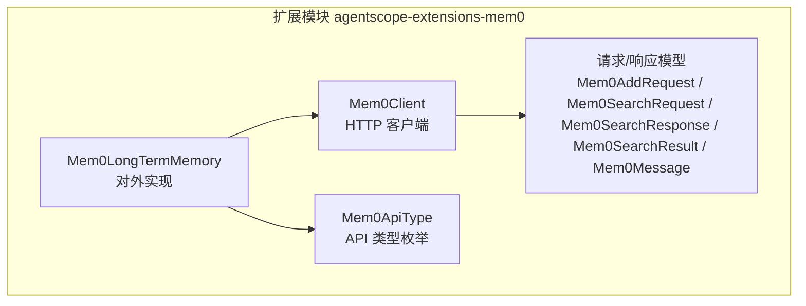
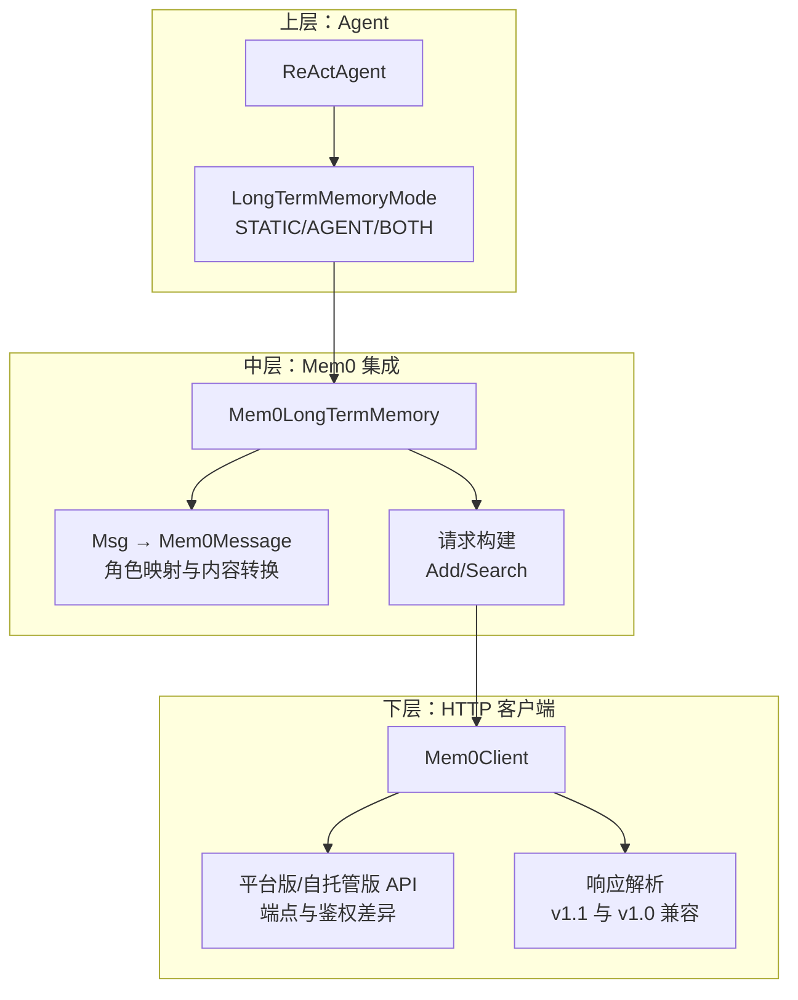
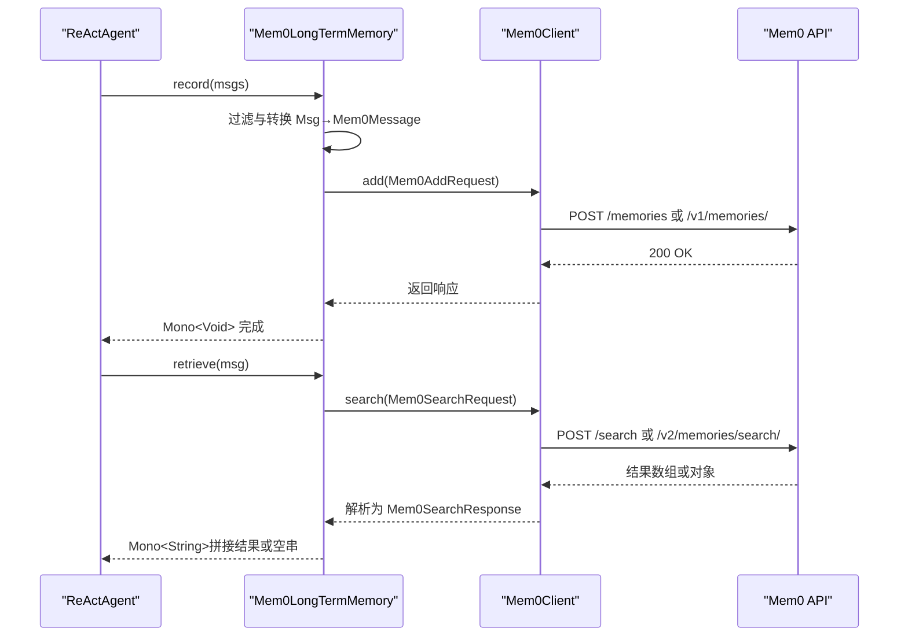
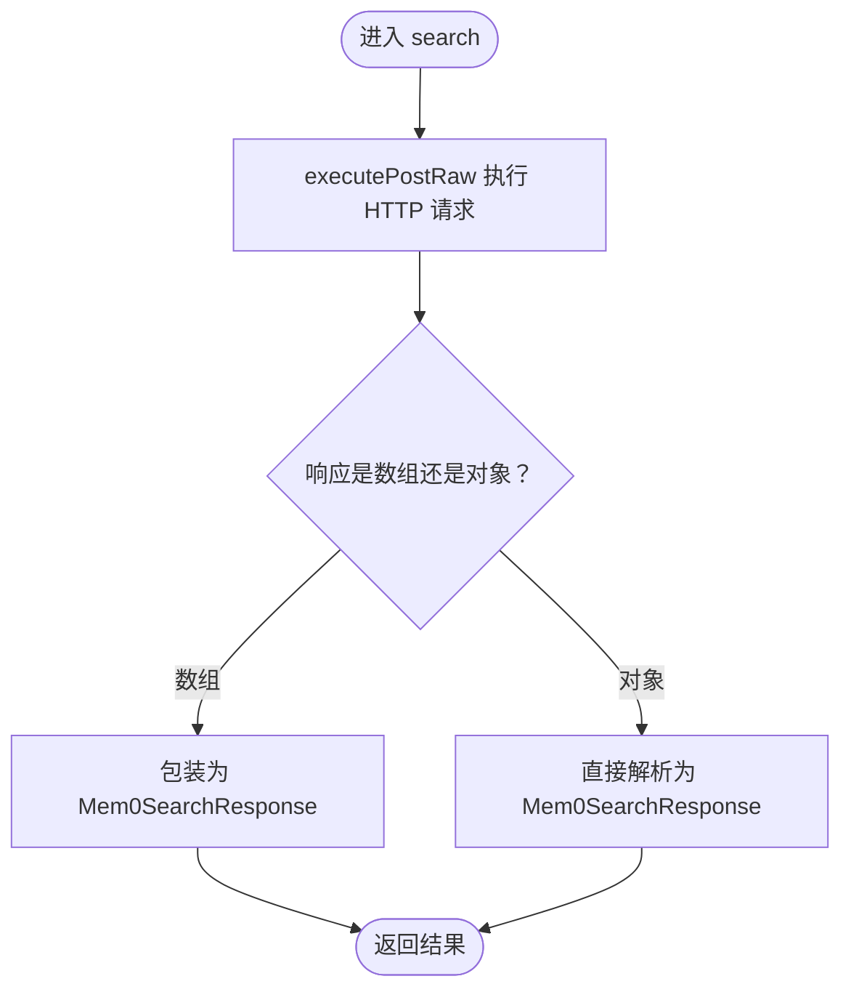
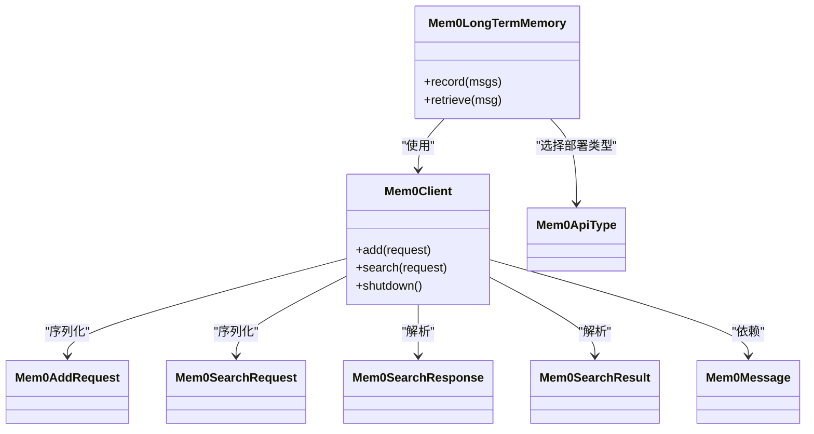

# Mem0长期记忆集成

<cite>
**本文引用的文件**
- [Mem0LongTermMemory.java](file://agentscope-extensions/agentscope-extensions-mem/agentscope-extensions-mem0/src/main/java/io/agentscope/core/memory/mem0/Mem0LongTermMemory.java)
- [Mem0Client.java](file://agentscope-extensions/agentscope-extensions-mem/agentscope-extensions-mem0/src/main/java/io/agentscope/core/memory/mem0/Mem0Client.java)
- [Mem0ApiType.java](file://agentscope-extensions/agentscope-extensions-mem/agentscope-extensions-mem0/src/main/java/io/agentscope/core/memory/mem0/Mem0ApiType.java)
- [Mem0Message.java](file://agentscope-extensions/agentscope-extensions-mem/agentscope-extensions-mem0/src/main/java/io/agentscope/core/memory/mem0/Mem0Message.java)
- [Mem0AddRequest.java](file://agentscope-extensions/agentscope-extensions-mem/agentscope-extensions-mem0/src/main/java/io/agentscope/core/memory/mem0/Mem0AddRequest.java)
- [Mem0SearchRequest.java](file://agentscope-extensions/agentscope-extensions-mem/agentscope-extensions-mem0/src/main/java/io/agentscope/core/memory/mem0/Mem0SearchRequest.java)
- [Mem0SearchResponse.java](file://agentscope-extensions/agentscope-extensions-mem/agentscope-extensions-mem0/src/main/java/io/agentscope/core/memory/mem0/Mem0SearchResponse.java)
- [Mem0SearchResult.java](file://agentscope-extensions/agentscope-extensions-mem/agentscope-extensions-mem0/src/main/java/io/agentscope/core/memory/mem0/Mem0SearchResult.java)
- [memory.md（v1 英文）](file://docs/v1/en/docs/task/memory.md)
- [memory.md（v1 中文）](file://docs/v1/zh/docs/task/memory.md)
- [mem0.md（v2 英文）](file://docs/v2/en/integration/memory/mem0.md)
- [overview.md（v2 英文）](file://docs/v2/en/integration/memory/overview.md)
</cite>

## 目录
1. [简介](#简介)
2. [项目结构](#项目结构)
3. [核心组件](#核心组件)
4. [架构总览](#架构总览)
5. [组件详解](#组件详解)
6. [依赖关系分析](#依赖关系分析)
7. [性能考量](#性能考量)
8. [故障排查指南](#故障排查指南)
9. [结论](#结论)
10. [附录](#附录)

## 简介
本文件面向在 AgentScope Java 中集成 Mem0 长期记忆服务的开发者，系统性阐述 Mem0 作为 AI 应用内存层的架构设计与实现要点，覆盖以下关键主题：
- 向量嵌入语义搜索与 LLM 驱动的记忆提取/推断
- Mem0LongTermMemory 的实现原理：三层次元数据组织（agentId、userId、runId）、自定义元数据过滤、多租户内存隔离
- 消息记录流程、检索算法与错误处理机制
- 完整配置示例：平台版与自托管版本的部署方式、认证配置与性能调优参数
- 实际使用场景分析、成本评估与最佳实践建议

## 项目结构
Mem0 集成位于 agentscope-extensions 子模块下的 agentscope-extensions-mem0，核心代码围绕 LongTermMemory 接口与 Mem0 的 HTTP API 交互展开，主要文件如下：
- Mem0LongTermMemory：对外暴露的长期记忆实现，封装记录与检索逻辑
- Mem0Client：HTTP 客户端，适配平台版与自托管版 API 差异
- 请求/响应模型：Mem0AddRequest、Mem0SearchRequest、Mem0SearchResponse、Mem0SearchResult、Mem0Message
- 枚举：Mem0ApiType，用于区分平台版与自托管版 API 类型

图表来源
- [Mem0LongTermMemory.java:113-440](file://agentscope-extensions/agentscope-extensions-mem/agentscope-extensions-mem0/src/main/java/io/agentscope/core/memory/mem0/Mem0LongTermMemory.java#L113-L440)
- [Mem0Client.java:44-280](file://agentscope-extensions/agentscope-extensions-mem/agentscope-extensions-mem0/src/main/java/io/agentscope/core/memory/mem0/Mem0Client.java#L44-L280)
- [Mem0ApiType.java:18-53](file://agentscope-extensions/agentscope-extensions-mem/agentscope-extensions-mem0/src/main/java/io/agentscope/core/memory/mem0/Mem0ApiType.java#L18-L53)
- [Mem0AddRequest.java:23-469](file://agentscope-extensions/agentscope-extensions-mem/agentscope-extensions-mem0/src/main/java/io/agentscope/core/memory/mem0/Mem0AddRequest.java#L23-L469)
- [Mem0SearchRequest.java:24-366](file://agentscope-extensions/agentscope-extensions-mem/agentscope-extensions-mem0/src/main/java/io/agentscope/core/memory/mem0/Mem0SearchRequest.java#L24-L366)
- [Mem0SearchResponse.java:22-62](file://agentscope-extensions/agentscope-extensions-mem/agentscope-extensions-mem0/src/main/java/io/agentscope/core/memory/mem0/Mem0SearchResponse.java#L22-L62)
- [Mem0SearchResult.java:25-225](file://agentscope-extensions/agentscope-extensions-mem/agentscope-extensions-mem0/src/main/java/io/agentscope/core/memory/mem0/Mem0SearchResult.java#L25-L225)
- [Mem0Message.java:20-129](file://agentscope-extensions/agentscope-extensions-mem/agentscope-extensions-mem0/src/main/java/io/agentscope/core/memory/mem0/Mem0Message.java#L20-L129)

章节来源
- [Mem0LongTermMemory.java:1-440](file://agentscope-extensions/agentscope-extensions-mem/agentscope-extensions-mem0/src/main/java/io/agentscope/core/memory/mem0/Mem0LongTermMemory.java#L1-L440)
- [Mem0Client.java:1-280](file://agentscope-extensions/agentscope-extensions-mem/agentscope-extensions-mem0/src/main/java/io/agentscope/core/memory/mem0/Mem0Client.java#L1-L280)
- [Mem0ApiType.java:1-53](file://agentscope-extensions/agentscope-extensions-mem/agentscope-extensions-mem0/src/main/java/io/agentscope/core/memory/mem0/Mem0ApiType.java#L1-L53)
- [Mem0Message.java:1-129](file://agentscope-extensions/agentscope-extensions-mem/agentscope-extensions-mem0/src/main/java/io/agentscope/core/memory/mem0/Mem0Message.java#L1-L129)
- [Mem0AddRequest.java:1-469](file://agentscope-extensions/agentscope-extensions-mem/agentscope-extensions-mem0/src/main/java/io/agentscope/core/memory/mem0/Mem0AddRequest.java#L1-L469)
- [Mem0SearchRequest.java:1-366](file://agentscope-extensions/agentscope-extensions-mem/agentscope-extensions-mem0/src/main/java/io/agentscope/core/memory/mem0/Mem0SearchRequest.java#L1-L366)
- [Mem0SearchResponse.java:1-62](file://agentscope-extensions/agentscope-extensions-mem/agentscope-extensions-mem0/src/main/java/io/agentscope/core/memory/mem0/Mem0SearchResponse.java#L1-L62)
- [Mem0SearchResult.java:1-225](file://agentscope-extensions/agentscope-extensions-mem/agentscope-extensions-mem0/src/main/java/io/agentscope/core/memory/mem0/Mem0SearchResult.java#L1-L225)

## 核心组件
- Mem0LongTermMemory：实现 LongTermMemory 接口，负责消息记录与检索。内部通过 Mem0Client 发起 HTTP 请求，并对响应进行解析与错误兜底。
- Mem0Client：封装 HTTP 通信细节，自动根据 Mem0ApiType 选择平台版或自托管版的端点与鉴权头；支持 v1.1 与 v1.0 两种搜索响应格式的兼容解析。
- 请求/响应模型：以标准 POJO 表达 Mem0 API 的请求与响应结构，便于序列化与类型安全。

章节来源
- [Mem0LongTermMemory.java:113-440](file://agentscope-extensions/agentscope-extensions-mem/agentscope-extensions-mem0/src/main/java/io/agentscope/core/memory/mem0/Mem0LongTermMemory.java#L113-L440)
- [Mem0Client.java:44-280](file://agentscope-extensions/agentscope-extensions-mem/agentscope-extensions-mem0/src/main/java/io/agentscope/core/memory/mem0/Mem0Client.java#L44-L280)
- [Mem0ApiType.java:18-53](file://agentscope-extensions/agentscope-extensions-mem/agentscope-extensions-mem0/src/main/java/io/agentscope/core/memory/mem0/Mem0ApiType.java#L18-L53)
- [Mem0Message.java:20-129](file://agentscope-extensions/agentscope-extensions-mem/agentscope-extensions-mem0/src/main/java/io/agentscope/core/memory/mem0/Mem0Message.java#L20-L129)
- [Mem0AddRequest.java:23-469](file://agentscope-extensions/agentscope-extensions-mem/agentscope-extensions-mem0/src/main/java/io/agentscope/core/memory/mem0/Mem0AddRequest.java#L23-L469)
- [Mem0SearchRequest.java:24-366](file://agentscope-extensions/agentscope-extensions-mem/agentscope-extensions-mem0/src/main/java/io/agentscope/core/memory/mem0/Mem0SearchRequest.java#L24-L366)
- [Mem0SearchResponse.java:22-62](file://agentscope-extensions/agentscope-extensions-mem/agentscope-extensions-mem0/src/main/java/io/agentscope/core/memory/mem0/Mem0SearchResponse.java#L22-L62)
- [Mem0SearchResult.java:25-225](file://agentscope-extensions/agentscope-extensions-mem/agentscope-extensions-mem0/src/main/java/io/agentscope/core/memory/mem0/Mem0SearchResult.java#L25-L225)

## 架构总览
Mem0 集成采用“接口抽象 + HTTP 客户端 + 数据模型”的分层设计：
- 上层：ReActAgent 通过 LongTermMemoryMode 配置自动触发记录/召回
- 中层：Mem0LongTermMemory 将 Msg 转换为 Mem0Message 并构造请求
- 下层：Mem0Client 选择端点与鉴权头，发起 HTTP 请求并解析响应

图表来源
- [Mem0LongTermMemory.java:169-292](file://agentscope-extensions/agentscope-extensions-mem/agentscope-extensions-mem0/src/main/java/io/agentscope/core/memory/mem0/Mem0LongTermMemory.java#L169-L292)
- [Mem0Client.java:222-267](file://agentscope-extensions/agentscope-extensions-mem/agentscope-extensions-mem0/src/main/java/io/agentscope/core/memory/mem0/Mem0Client.java#L222-L267)
- [Mem0ApiType.java:18-53](file://agentscope-extensions/agentscope-extensions-mem/agentscope-extensions-mem0/src/main/java/io/agentscope/core/memory/mem0/Mem0ApiType.java#L18-L53)
- [Mem0Message.java:20-129](file://agentscope-extensions/agentscope-extensions-mem/agentscope-extensions-mem0/src/main/java/io/agentscope/core/memory/mem0/Mem0Message.java#L20-L129)
- [Mem0AddRequest.java:23-469](file://agentscope-extensions/agentscope-extensions-mem/agentscope-extensions-mem0/src/main/java/io/agentscope/core/memory/mem0/Mem0AddRequest.java#L23-L469)
- [Mem0SearchRequest.java:24-366](file://agentscope-extensions/agentscope-extensions-mem/agentscope-extensions-mem0/src/main/java/io/agentscope/core/memory/mem0/Mem0SearchRequest.java#L24-L366)
- [Mem0SearchResponse.java:22-62](file://agentscope-extensions/agentscope-extensions-mem/agentscope-extensions-mem0/src/main/java/io/agentscope/core/memory/mem0/Mem0SearchResponse.java#L22-L62)
- [Mem0SearchResult.java:25-225](file://agentscope-extensions/agentscope-extensions-mem/agentscope-extensions-mem0/src/main/java/io/agentscope/core/memory/mem0/Mem0SearchResult.java#L25-L225)

## 组件详解

### Mem0LongTermMemory：记录与检索
- 记录流程（record）：
  - 过滤空消息与压缩历史标记
  - 将 Msg 映射为 Mem0Message（角色映射：USER/SYSTEM→user，ASSISTANT/TOOL→assistant）
  - 构造 Mem0AddRequest（包含 agentId、userId、runId、metadata、infer=true），调用 Mem0Client.add
- 检索流程（retrieve）：
  - 构造 Mem0SearchRequest（query、filters 合并 metadata、topK 默认 5）
  - 调用 Mem0Client.search，聚合结果为字符串，异常时返回空串

图表来源
- [Mem0LongTermMemory.java:169-292](file://agentscope-extensions/agentscope-extensions-mem/agentscope-extensions-mem0/src/main/java/io/agentscope/core/memory/mem0/Mem0LongTermMemory.java#L169-L292)
- [Mem0Client.java:222-267](file://agentscope-extensions/agentscope-extensions-mem/agentscope-extensions-mem0/src/main/java/io/agentscope/core/memory/mem0/Mem0Client.java#L222-L267)
- [Mem0AddRequest.java:36-125](file://agentscope-extensions/agentscope-extensions-mem/agentscope-extensions-mem0/src/main/java/io/agentscope/core/memory/mem0/Mem0AddRequest.java#L36-L125)
- [Mem0SearchRequest.java:36-90](file://agentscope-extensions/agentscope-extensions-mem/agentscope-extensions-mem0/src/main/java/io/agentscope/core/memory/mem0/Mem0SearchRequest.java#L36-L90)

章节来源
- [Mem0LongTermMemory.java:169-292](file://agentscope-extensions/agentscope-extensions-mem/agentscope-extensions-mem0/src/main/java/io/agentscope/core/memory/mem0/Mem0LongTermMemory.java#L169-L292)

### Mem0Client：API 适配与兼容解析
- 端点与鉴权：
  - 平台版：/v1/memories/、/v2/memories/search/；Authorization: Token <apiKey>
  - 自托管版：/memories、/search；X-API-Key: <apiKey>
- 搜索响应兼容：
  - v1.1：{"results":[...]}
  - v1.0：直接数组 [...]
- 错误处理：
  - 非 2xx 抛出带状态码与错误体信息的 IOException
  - 其他异常包装为 IOException

图表来源
- [Mem0Client.java:248-267](file://agentscope-extensions/agentscope-extensions-mem/agentscope-extensions-mem0/src/main/java/io/agentscope/core/memory/mem0/Mem0Client.java#L248-L267)

章节来源
- [Mem0Client.java:44-280](file://agentscope-extensions/agentscope-extensions-mem/agentscope-extensions-mem0/src/main/java/io/agentscope/core/memory/mem0/Mem0Client.java#L44-L280)
- [Mem0ApiType.java:18-53](file://agentscope-extensions/agentscope-extensions-mem/agentscope-extensions-mem0/src/main/java/io/agentscope/core/memory/mem0/Mem0ApiType.java#L18-L53)

### 三层次元数据组织与多租户隔离
- 三层标识：
  - agentId：Agent 级别隔离
  - userId：用户/工作空间级别隔离
  - runId：会话/运行级别隔离
- 自定义元数据：
  - 记录时写入 metadata 字段
  - 检索时合并到 filters，实现业务维度过滤
- 至少提供其一，否则构建失败

章节来源
- [Mem0LongTermMemory.java:44-54](file://agentscope-extensions/agentscope-extensions-mem/agentscope-extensions-mem0/src/main/java/io/agentscope/core/memory/mem0/Mem0LongTermMemory.java#L44-L54)
- [Mem0LongTermMemory.java:149-154](file://agentscope-extensions/agentscope-extensions-mem/agentscope-extensions-mem0/src/main/java/io/agentscope/core/memory/mem0/Mem0LongTermMemory.java#L149-L154)
- [Mem0AddRequest.java:36-108](file://agentscope-extensions/agentscope-extensions-mem/agentscope-extensions-mem0/src/main/java/io/agentscope/core/memory/mem0/Mem0AddRequest.java#L36-L108)
- [Mem0SearchRequest.java:36-90](file://agentscope-extensions/agentscope-extensions-mem/agentscope-extensions-mem0/src/main/java/io/agentscope/core/memory/mem0/Mem0SearchRequest.java#L36-L90)

### 检索算法与过滤机制
- 语义相似度检索：POST /search 或 /v2/memories/search/，按 relevance score 排序
- 过滤条件：
  - 标准过滤：agent_id、user_id、run_id、app_id（由 Builder 同步到 filters）
  - 自定义过滤：metadata 合并到 filters
  - 其他参数：topK、threshold、rerank、fields 等
- 默认 topK 为 10（v2 规范），检索时默认 topK 为 5

章节来源
- [Mem0SearchRequest.java:36-90](file://agentscope-extensions/agentscope-extensions-mem/agentscope-extensions-mem0/src/main/java/io/agentscope/core/memory/mem0/Mem0SearchRequest.java#L36-L90)
- [Mem0SearchRequest.java:204-364](file://agentscope-extensions/agentscope-extensions-mem/agentscope-extensions-mem0/src/main/java/io/agentscope/core/memory/mem0/Mem0SearchRequest.java#L204-L364)
- [Mem0LongTermMemory.java:239-254](file://agentscope-extensions/agentscope-extensions-mem/agentscope-extensions-mem0/src/main/java/io/agentscope/core/memory/mem0/Mem0LongTermMemory.java#L239-L254)

### 错误处理机制
- 记录阶段：空列表或无效输入直接返回空 Mono
- 检索阶段：查询为空或无结果返回空字符串；HTTP 失败抛出 IOException，上层 onErrorReturn("") 返回空串
- 客户端：非 2xx 状态码携带状态码与错误体信息

章节来源
- [Mem0LongTermMemory.java:170-204](file://agentscope-extensions/agentscope-extensions-mem/agentscope-extensions-mem0/src/main/java/io/agentscope/core/memory/mem0/Mem0LongTermMemory.java#L170-L204)
- [Mem0LongTermMemory.java:268-292](file://agentscope-extensions/agentscope-extensions-mem/agentscope-extensions-mem0/src/main/java/io/agentscope/core/memory/mem0/Mem0LongTermMemory.java#L268-L292)
- [Mem0Client.java:160-184](file://agentscope-extensions/agentscope-extensions-mem/agentscope-extensions-mem0/src/main/java/io/agentscope/core/memory/mem0/Mem0Client.java#L160-L184)

### 配置与部署模式
- 依赖引入：agentscope-extensions-mem0
- 部署模式：
  - PLATFORM（默认）：Mem0 SaaS，端点 /v1/memories/ 与 /v2/memories/search/，Authorization: Token <apiKey>
  - SELF_HOSTED：自建服务，端点 /memories 与 /search，X-API-Key: <apiKey>
- 关键参数：
  - apiBaseUrl：Mem0 服务地址
  - apiKey：API 密钥（平台版必填；自建视部署而定）
  - agentName/userId/runName：至少提供其一
  - metadata：自定义过滤标签
  - timeout：HTTP 超时（默认 60 秒）

章节来源
- [mem0.md（v2 英文）:1-107](file://docs/v2/en/integration/memory/mem0.md#L1-L107)
- [Mem0ApiType.java:18-53](file://agentscope-extensions/agentscope-extensions-mem/agentscope-extensions-mem0/src/main/java/io/agentscope/core/memory/mem0/Mem0ApiType.java#L18-L53)
- [Mem0LongTermMemory.java:299-438](file://agentscope-extensions/agentscope-extensions-mem/agentscope-extensions-mem0/src/main/java/io/agentscope/core/memory/mem0/Mem0LongTermMemory.java#L299-L438)

## 依赖关系分析
- Mem0LongTermMemory 依赖 Mem0Client 与请求/响应模型
- Mem0Client 依赖 OkHttp 与 JsonCodec，内部根据 Mem0ApiType 切换端点与鉴权头
- 请求/响应模型均为 POJO，便于序列化与类型安全

图表来源
- [Mem0LongTermMemory.java:113-440](file://agentscope-extensions/agentscope-extensions-mem/agentscope-extensions-mem0/src/main/java/io/agentscope/core/memory/mem0/Mem0LongTermMemory.java#L113-L440)
- [Mem0Client.java:44-280](file://agentscope-extensions/agentscope-extensions-mem/agentscope-extensions-mem0/src/main/java/io/agentscope/core/memory/mem0/Mem0Client.java#L44-L280)
- [Mem0ApiType.java:18-53](file://agentscope-extensions/agentscope-extensions-mem/agentscope-extensions-mem0/src/main/java/io/agentscope/core/memory/mem0/Mem0ApiType.java#L18-L53)
- [Mem0AddRequest.java:23-469](file://agentscope-extensions/agentscope-extensions-mem/agentscope-extensions-mem0/src/main/java/io/agentscope/core/memory/mem0/Mem0AddRequest.java#L23-L469)
- [Mem0SearchRequest.java:24-366](file://agentscope-extensions/agentscope-extensions-mem/agentscope-extensions-mem0/src/main/java/io/agentscope/core/memory/mem0/Mem0SearchRequest.java#L24-L366)
- [Mem0SearchResponse.java:22-62](file://agentscope-extensions/agentscope-extensions-mem/agentscope-extensions-mem0/src/main/java/io/agentscope/core/memory/mem0/Mem0SearchResponse.java#L22-L62)
- [Mem0SearchResult.java:25-225](file://agentscope-extensions/agentscope-extensions-mem/agentscope-extensions-mem0/src/main/java/io/agentscope/core/memory/mem0/Mem0SearchResult.java#L25-L225)
- [Mem0Message.java:20-129](file://agentscope-extensions/agentscope-extensions-mem/agentscope-extensions-mem0/src/main/java/io/agentscope/core/memory/mem0/Mem0Message.java#L20-L129)

## 性能考量
- 异步非阻塞：HTTP 请求在 bounded elastic 调度器上执行，避免阻塞调用线程
- 超时设置：默认读超时 60 秒，可根据网络与服务延迟调整
- 检索参数：合理设置 topK、threshold 与 rerank，平衡召回质量与性能
- 记录批量化：将多个 Msg 合并一次记录，减少往返次数
- 缓存与去重：在应用层对重复消息进行去重，降低无效记录

## 故障排查指南
- 无法连接 Mem0：
  - 检查 apiBaseUrl 是否正确且可达
  - 平台版需提供 apiKey，自建版根据部署情况确认是否需要 X-API-Key
- 认证失败：
  - 平台版使用 Authorization: Token <apiKey>
  - 自托管使用 X-API-Key: <apiKey>
- 检索无结果：
  - 确认 userId/agentId/runId 与写入时一致
  - 检查 metadata 是否正确合并到 filters
  - 调整 threshold 或增加 topK
- 响应格式异常：
  - 客户端已兼容 v1.0 数组与 v1.1 对象两种格式，若仍报错，请检查服务端版本与输出格式

章节来源
- [Mem0Client.java:135-186](file://agentscope-extensions/agentscope-extensions-mem/agentscope-extensions-mem0/src/main/java/io/agentscope/core/memory/mem0/Mem0Client.java#L135-L186)
- [Mem0Client.java:248-267](file://agentscope-extensions/agentscope-extensions-mem/agentscope-extensions-mem0/src/main/java/io/agentscope/core/memory/mem0/Mem0Client.java#L248-L267)
- [Mem0ApiType.java:18-53](file://agentscope-extensions/agentscope-extensions-mem/agentscope-extensions-mem0/src/main/java/io/agentscope/core/memory/mem0/Mem0ApiType.java#L18-L53)

## 结论
Mem0 集成通过清晰的接口抽象与 HTTP 客户端适配，实现了跨平台部署的一致体验。其三层次元数据组织与自定义过滤机制，满足多租户与业务维度的隔离需求；语义检索与 LLM 驱动的记忆提取，为 Agent 提供了稳定可靠的长期记忆能力。配合合理的性能调优与故障排查策略，可在生产环境中获得良好的稳定性与可维护性。

## 附录

### 使用场景与最佳实践
- 场景建议：
  - 用户偏好与历史决策：通过 userId+metadata 进行精准召回
  - 多 Agent 协作：通过 agentId 区分 Agent 的记忆边界
  - 会话级记忆：通过 runId 将记忆限定在特定会话内
- 最佳实践：
  - 在记录前对消息进行清洗与压缩，避免冗余
  - 合理设置 metadata，避免过于宽泛导致检索噪声
  - 使用 BOTH 模式时，注意控制检索频率，避免过度调用

章节来源
- [overview.md（v2 英文）:1-30](file://docs/v2/en/integration/memory/overview.md#L1-L30)
- [mem0.md（v2 英文）:1-107](file://docs/v2/en/integration/memory/mem0.md#L1-L107)

### 配置参考（Builder 字段）
- 必填项：至少提供 agentName、userId、runName 之一
- 常用项：apiBaseUrl、apiKey、apiType、metadata、timeout
- 检索参数：topK、threshold、rerank、keywordSearch、filterMemories、fields

章节来源
- [Mem0LongTermMemory.java:299-438](file://agentscope-extensions/agentscope-extensions-mem/agentscope-extensions-mem0/src/main/java/io/agentscope/core/memory/mem0/Mem0LongTermMemory.java#L299-L438)
- [Mem0SearchRequest.java:204-364](file://agentscope-extensions/agentscope-extensions-mem/agentscope-extensions-mem0/src/main/java/io/agentscope/core/memory/mem0/Mem0SearchRequest.java#L204-L364)