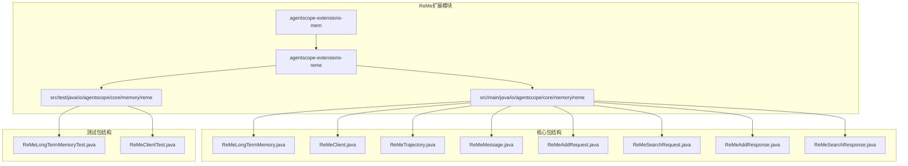
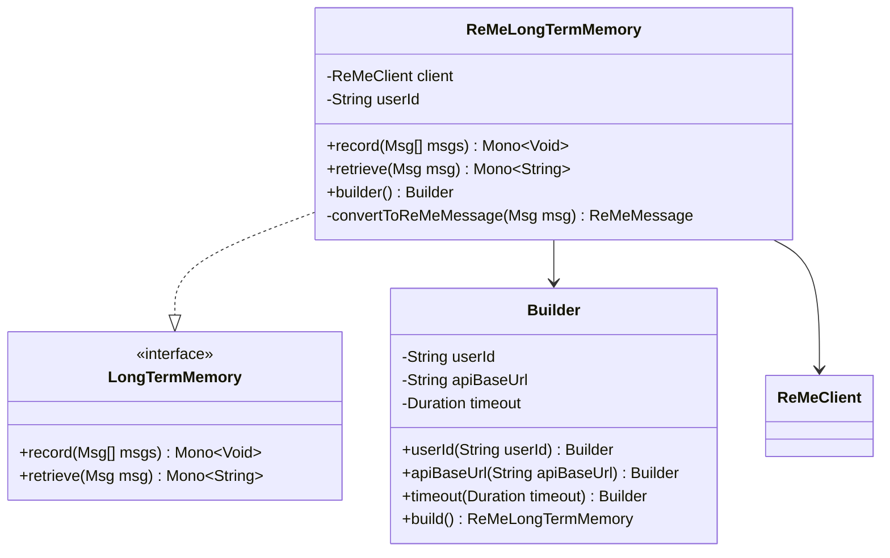
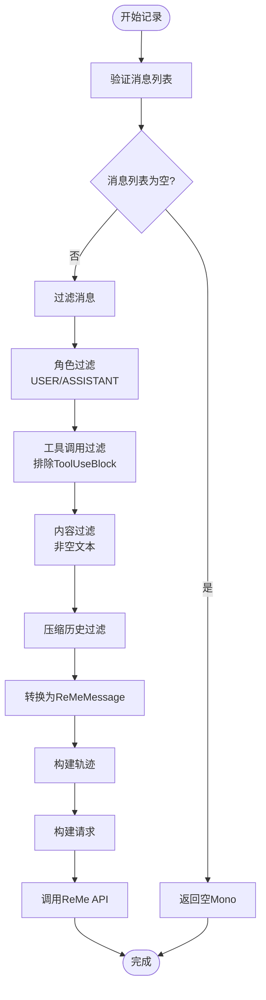
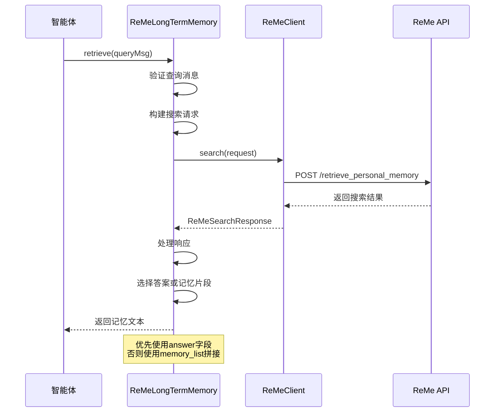
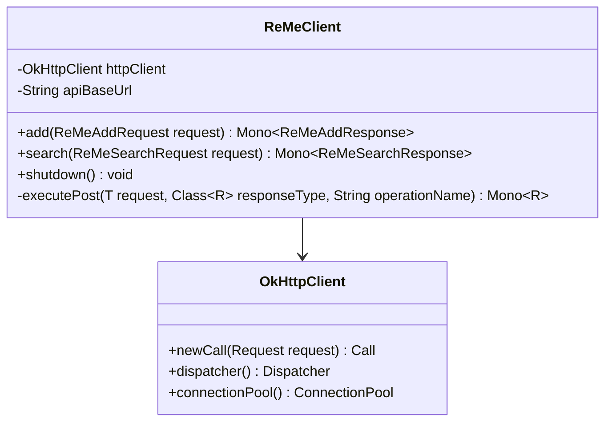
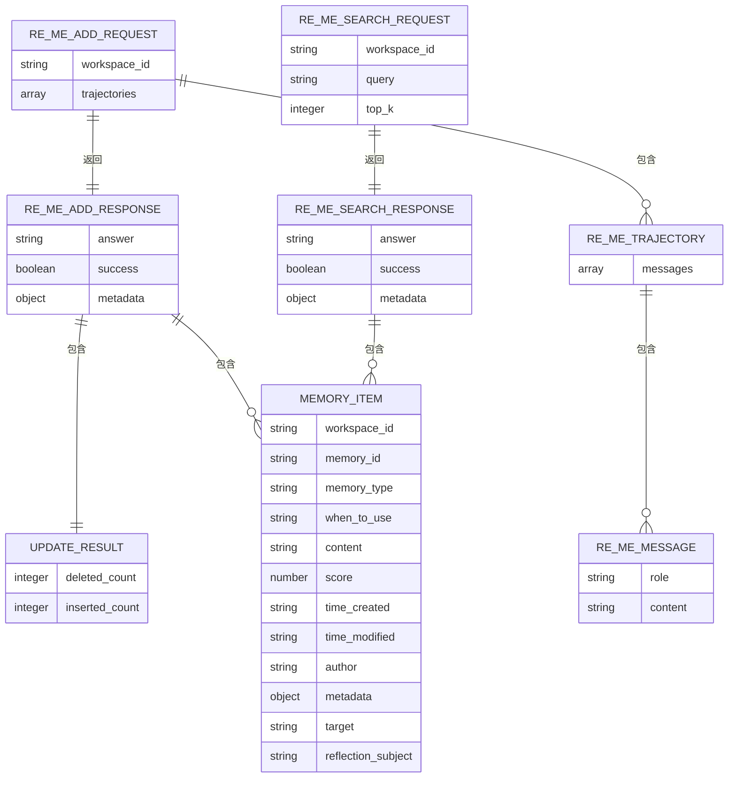
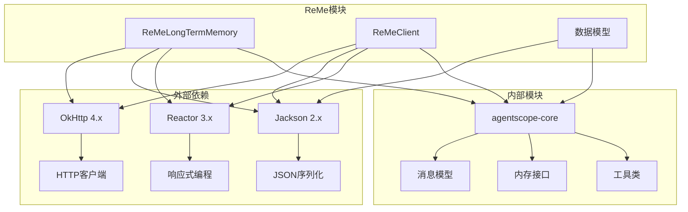

# ReMe长期记忆集成

<cite>
**本文档引用的文件**
- [ReMeLongTermMemory.java](file://agentscope-extensions/agentscope-extensions-mem/agentscope-extensions-reme/src/main/java/io/agentscope/core/memory/reme/ReMeLongTermMemory.java)
- [ReMeClient.java](file://agentscope-extensions/agentscope-extensions-mem/agentscope-extensions-reme/src/main/java/io/agentscope/core/memory/reme/ReMeClient.java)
- [ReMeTrajectory.java](file://agentscope-extensions/agentscope-extensions-mem/agentscope-extensions-reme/src/main/java/io/agentscope/core/memory/reme/ReMeTrajectory.java)
- [ReMeMessage.java](file://agentscope-extensions/agentscope-extensions-mem/agentscope-extensions-reme/src/main/java/io/agentscope/core/memory/reme/ReMeMessage.java)
- [ReMeAddRequest.java](file://agentscope-extensions/agentscope-extensions-mem/agentscope-extensions-reme/src/main/java/io/agentscope/core/memory/reme/ReMeAddRequest.java)
- [ReMeSearchRequest.java](file://agentscope-extensions/agentscope-extensions-mem/agentscope-extensions-reme/src/main/java/io/agentscope/core/memory/reme/ReMeSearchRequest.java)
- [ReMeAddResponse.java](file://agentscope-extensions/agentscope-extensions-mem/agentscope-extensions-reme/src/main/java/io/agentscope/core/memory/reme/ReMeAddResponse.java)
- [ReMeSearchResponse.java](file://agentscope-extensions/agentscope-extensions-mem/agentscope-extensions-reme/src/main/java/io/agentscope/core/memory/reme/ReMeSearchResponse.java)
- [ReMeLongTermMemoryTest.java](file://agentscope-extensions/agentscope-extensions-mem/agentscope-extensions-reme/src/test/java/io/agentscope/core/memory/reme/ReMeLongTermMemoryTest.java)
- [ReMeClientTest.java](file://agentscope-extensions/agentscope-extensions-mem/agentscope-extensions-reme/src/test/java/io/agentscope/core/memory/reme/ReMeClientTest.java)
- [LongTermMemory.java](file://agentscope-core/src/main/java/io/agentscope/core/memory/LongTermMemory.java)
- [reme.md](file://docs/v2/zh/integration/memory/reme.md)
</cite>

## 目录
1. [简介](#简介)
2. [项目结构](#项目结构)
3. [核心组件](#核心组件)
4. [架构概览](#架构概览)
5. [详细组件分析](#详细组件分析)
6. [依赖关系分析](#依赖关系分析)
7. [性能考虑](#性能考虑)
8. [故障排除指南](#故障排除指南)
9. [结论](#结论)
10. [附录](#附录)

## 简介

ReMe长期记忆服务是Agentscope框架中的一个先进记忆增强系统，专门用于提供持久化的、可搜索的记忆存储。该系统基于轨迹（trajectory）概念，通过大型语言模型（LLM）驱动的记忆提取和推理，为AI应用提供智能的记忆管理能力。

ReMe的核心特色包括：
- **基于轨迹的记忆提取**：将对话历史转换为可检索的记忆片段
- **工作区隔离**：支持多租户场景下的独立记忆上下文
- **自动记忆摘要**：从对话轨迹中提取和存储难忘信息
- **反应式非阻塞操作**：使用Reactor框架提供异步内存操作

ReMe长期记忆服务通过ReMeLongTermMemory类实现，该类实现了Agentscope的核心内存接口，为智能体提供无缝的记忆管理体验。

## 项目结构

ReMe长期记忆服务位于Agentscope项目的扩展模块中，采用清晰的分层架构：



**图表来源**
- [ReMeLongTermMemory.java:1-307](file://agentscope-extensions/agentscope-extensions-mem/agentscope-extensions-reme/src/main/java/io/agentscope/core/memory/reme/ReMeLongTermMemory.java#L1-L307)
- [ReMeClient.java:1-178](file://agentscope-extensions/agentscope-extensions-mem/agentscope-extensions-reme/src/main/java/io/agentscope/core/memory/reme/ReMeClient.java#L1-L178)

**章节来源**
- [ReMeLongTermMemory.java:1-307](file://agentscope-extensions/agentscope-extensions-mem/agentscope-extensions-reme/src/main/java/io/agentscope/core/memory/reme/ReMeLongTermMemory.java#L1-L307)
- [reme.md:1-61](file://docs/v2/zh/integration/memory/reme.md#L1-L61)

## 核心组件

ReMe长期记忆服务由以下核心组件构成：

### 主要组件概述

| 组件名称 | 类型 | 职责 | 关键特性 |
|---------|------|------|----------|
| ReMeLongTermMemory | 主要实现类 | 内存记录和检索 | 实现LongTermMemory接口，处理消息过滤和转换 |
| ReMeClient | HTTP客户端 | API通信 | 基于OkHttp的异步HTTP客户端 |
| ReMeTrajectory | 数据模型 | 对话轨迹表示 | 包含消息序列的轨迹对象 |
| ReMeMessage | 数据模型 | 单个消息表示 | 用户和助手消息的角色映射 |
| ReMeAddRequest | 请求对象 | 记忆添加请求 | 工作区ID和轨迹列表 |
| ReMeSearchRequest | 请求对象 | 记忆搜索请求 | 查询字符串和结果数量限制 |
| ReMeAddResponse | 响应对象 | 添加操作响应 | 记忆列表和更新结果 |
| ReMeSearchResponse | 响应对象 | 搜索操作响应 | 答案文本和记忆片段 |

### 架构设计原则

ReMe系统采用以下设计原则：

1. **分离关注点**：内存逻辑与HTTP通信分离
2. **不可变数据模型**：使用Builder模式确保数据完整性
3. **异步非阻塞**：基于Reactor框架的响应式编程
4. **错误处理**：全面的异常处理和降级策略
5. **配置灵活性**：支持自定义超时和工作区设置

**章节来源**
- [ReMeLongTermMemory.java:28-66](file://agentscope-extensions/agentscope-extensions-mem/agentscope-extensions-reme/src/main/java/io/agentscope/core/memory/reme/ReMeLongTermMemory.java#L28-L66)
- [ReMeClient.java:30-33](file://agentscope-extensions/agentscope-extensions-mem/agentscope-extensions-reme/src/main/java/io/agentscope/core/memory/reme/ReMeClient.java#L30-L33)

## 架构概览

ReMe长期记忆服务采用分层架构，实现了清晰的职责分离和模块化设计：

```mermaid
graph TB
subgraph "应用层"
A[ReActAgent] --> B[LongTermMemory接口]
end
subgraph "ReMe实现层"
B --> C[ReMeLongTermMemory]
C --> D[消息过滤器]
C --> E[轨迹构建器]
end
subgraph "通信层"
D --> F[ReMeClient]
E --> F
F --> G[OkHttp客户端]
end
subgraph "外部服务"
G --> H[ReMe API服务器]
H --> I[/summary_personal_memory]
H --> J[/retrieve_personal_memory]
end
subgraph "数据模型层"
K[ReMeMessage] --> L[ReMeTrajectory]
L --> M[ReMeAddRequest]
N[ReMeSearchRequest] --> O[ReMeAddResponse]
N --> P[ReMeSearchResponse]
end
F --> K
F --> L
F --> M
F --> N
F --> O
F --> P
```

**图表来源**
- [ReMeLongTermMemory.java:66-307](file://agentscope-extensions/agentscope-extensions-mem/agentscope-extensions-reme/src/main/java/io/agentscope/core/memory/reme/ReMeLongTermMemory.java#L66-L307)
- [ReMeClient.java:33-178](file://agentscope-extensions/agentscope-extensions-mem/agentscope-extensions-reme/src/main/java/io/agentscope/core/memory/reme/ReMeClient.java#L33-L178)

### 核心流程

ReMe系统的工作流程包括两个主要阶段：

1. **记忆记录阶段**：消息过滤 → 轨迹构建 → API调用
2. **记忆检索阶段**：查询准备 → API搜索 → 结果处理

**章节来源**
- [ReMeLongTermMemory.java:87-244](file://agentscope-extensions/agentscope-extensions-mem/agentscope-extensions-reme/src/main/java/io/agentscope/core/memory/reme/ReMeLongTermMemory.java#L87-L244)

## 详细组件分析

### ReMeLongTermMemory类分析

ReMeLongTermMemory是ReMe系统的核心实现类，完全实现了LongTermMemory接口：



**图表来源**
- [ReMeLongTermMemory.java:66-307](file://agentscope-extensions/agentscope-extensions-mem/agentscope-extensions-reme/src/main/java/io/agentscope/core/memory/reme/ReMeLongTermMemory.java#L66-L307)

#### 记忆记录流程

ReMeLongTermMemory的record方法实现了复杂的过滤和转换逻辑：



**图表来源**
- [ReMeLongTermMemory.java:108-168](file://agentscope-extensions/agentscope-extensions-mem/agentscope-extensions-reme/src/main/java/io/agentscope/core/memory/reme/ReMeLongTermMemory.java#L108-L168)

#### 记忆检索流程

检索功能提供了灵活的结果处理策略：



**图表来源**
- [ReMeLongTermMemory.java:197-244](file://agentscope-extensions/agentscope-extensions-mem/agentscope-extensions-reme/src/main/java/io/agentscope/core/memory/reme/ReMeLongTermMemory.java#L197-L244)
- [ReMeClient.java:150-165](file://agentscope-extensions/agentscope-extensions-mem/agentscope-extensions-reme/src/main/java/io/agentscope/core/memory/reme/ReMeClient.java#L150-L165)

**章节来源**
- [ReMeLongTermMemory.java:87-244](file://agentscope-extensions/agentscope-extensions-mem/agentscope-extensions-reme/src/main/java/io/agentscope/core/memory/reme/ReMeLongTermMemory.java#L87-L244)

### ReMeClient类分析

ReMeClient提供了ReMe API的HTTP客户端封装：



**图表来源**
- [ReMeClient.java:33-178](file://agentscope-extensions/agentscope-extensions-mem/agentscope-extensions-reme/src/main/java/io/agentscope/core/memory/reme/ReMeClient.java#L33-L178)

#### HTTP通信机制

ReMeClient采用了线程池管理和异步处理策略：

| 组件 | 配置 | 用途 | 超时设置 |
|------|------|------|----------|
| OkHttpClient | 连接超时 | HTTP连接建立 | 30秒 |
| OkHttpClient | 读取超时 | 响应读取 | 可配置 |
| OkHttpClient | 写入超时 | 请求发送 | 30秒 |
| Schedulers | boundedElastic | 异步执行 | 自动管理 |

**章节来源**
- [ReMeClient.java:47-68](file://agentscope-extensions/agentscope-extensions-mem/agentscope-extensions-reme/src/main/java/io/agentscope/core/memory/reme/ReMeClient.java#L47-L68)

### 数据模型分析

ReMe系统使用了完整且类型安全的数据模型：



**图表来源**
- [ReMeAddRequest.java:28-99](file://agentscope-extensions/agentscope-extensions-mem/agentscope-extensions-reme/src/main/java/io/agentscope/core/memory/reme/ReMeAddRequest.java#L28-L99)
- [ReMeSearchRequest.java:27-120](file://agentscope-extensions/agentscope-extensions-mem/agentscope-extensions-reme/src/main/java/io/agentscope/core/memory/reme/ReMeSearchRequest.java#L27-L120)
- [ReMeAddResponse.java:43-315](file://agentscope-extensions/agentscope-extensions-mem/agentscope-extensions-reme/src/main/java/io/agentscope/core/memory/reme/ReMeAddResponse.java#L43-L315)
- [ReMeSearchResponse.java:47-274](file://agentscope-extensions/agentscope-extensions-mem/agentscope-extensions-reme/src/main/java/io/agentscope/core/memory/reme/ReMeSearchResponse.java#L47-L274)

**章节来源**
- [ReMeTrajectory.java:27-78](file://agentscope-extensions/agentscope-extensions-mem/agentscope-extensions-reme/src/main/java/io/agentscope/core/memory/reme/ReMeTrajectory.java#L27-L78)
- [ReMeMessage.java:26-96](file://agentscope-extensions/agentscope-extensions-mem/agentscope-extensions-reme/src/main/java/io/agentscope/core/memory/reme/ReMeMessage.java#L26-L96)

## 依赖关系分析

ReMe长期记忆服务的依赖关系体现了清晰的模块化设计：



**图表来源**
- [ReMeLongTermMemory.java:18-26](file://agentscope-extensions/agentscope-extensions-mem/agentscope-extensions-reme/src/main/java/io/agentscope/core/memory/reme/ReMeLongTermMemory.java#L18-L26)
- [ReMeClient.java:18-28](file://agentscope-extensions/agentscope-extensions-mem/agentscope-extensions-reme/src/main/java/io/agentscope/core/memory/reme/ReMeClient.java#L18-L28)

### 核心依赖说明

| 依赖库 | 版本范围 | 用途 | 关键特性 |
|--------|----------|------|----------|
| OkHttp | 4.x | HTTP通信 | 连接池、超时控制、拦截器 |
| Jackson | 2.x | JSON处理 | 注解驱动、流式API |
| Reactor | 3.x | 响应式编程 | 非阻塞、背压处理 |
| Agentscope Core | 2.x | 框架集成 | 消息模型、内存接口 |

**章节来源**
- [ReMeLongTermMemory.java:18-26](file://agentscope-extensions/agentscope-extensions-mem/agentscope-extensions-reme/src/main/java/io/agentscope/core/memory/reme/ReMeLongTermMemory.java#L18-L26)
- [ReMeClient.java:18-28](file://agentscope-extensions/agentscope-extensions-mem/agentscope-extensions-reme/src/main/java/io/agentscope/core/memory/reme/ReMeClient.java#L18-L28)

## 性能考虑

ReMe长期记忆服务在设计时充分考虑了性能优化：

### 异步处理策略

1. **非阻塞I/O**：使用OkHttp的异步能力避免线程阻塞
2. **响应式编程**：基于Reactor的Mono类型提供流畅的异步链式调用
3. **线程池管理**：boundedElastic调度器自动管理线程生命周期

### 缓存和优化

1. **消息过滤**：在客户端进行预过滤减少网络传输
2. **轨迹合并**：将相关消息组合成轨迹提高处理效率
3. **结果缓存**：ReMe服务器端的智能缓存机制

### 错误处理和重试

1. **超时控制**：可配置的HTTP超时防止资源泄露
2. **优雅降级**：网络错误时返回空结果而非抛出异常
3. **连接复用**：OkHttp连接池减少连接建立开销

## 故障排除指南

### 常见问题及解决方案

| 问题类型 | 症状 | 可能原因 | 解决方案 |
|----------|------|----------|----------|
| 连接超时 | Timeout异常 | 网络延迟或服务器无响应 | 增加超时时间，检查网络连通性 |
| JSON解析失败 | JsonException | API响应格式变化 | 更新依赖版本，检查API兼容性 |
| 权限错误 | 401/403状态码 | 认证配置错误 | 检查API密钥和权限设置 |
| 资源不足 | OutOfMemoryError | 大量并发请求 | 调整线程池大小，实施请求限流 |

### 调试技巧

1. **启用详细日志**：配置OkHttp的调试日志级别
2. **监控指标**：跟踪请求延迟和成功率
3. **内存使用**：监控Reactor操作符的内存占用

**章节来源**
- [ReMeClientTest.java:184-203](file://agentscope-extensions/agentscope-extensions-mem/agentscope-extensions-reme/src/test/java/io/agentscope/core/memory/reme/ReMeClientTest.java#L184-L203)
- [ReMeLongTermMemoryTest.java:557-574](file://agentscope-extensions/agentscope-extensions-mem/agentscope-extensions-reme/src/test/java/io/agentscope/core/memory/reme/ReMeLongTermMemoryTest.java#L557-L574)

## 结论

ReMe长期记忆服务为Agentscope框架提供了一个强大而灵活的记忆管理解决方案。通过其基于轨迹的概念和LLM驱动的记忆提取能力，ReMe能够智能地从对话历史中识别和存储有价值的信息。

### 主要优势

1. **智能记忆提取**：基于LLM的语义理解和记忆片段生成
2. **工作区隔离**：天然支持多租户和用户隔离
3. **响应式设计**：非阻塞的异步处理提升系统吞吐量
4. **易于集成**：符合Agentscope框架的设计模式

### 适用场景

- 需要长期对话上下文保持的应用
- 个性化AI助手和聊天机器人
- 需要学习用户偏好的智能系统
- 多用户共享环境下的独立记忆管理

## 附录

### 集成指南

#### Maven依赖配置

```xml
<dependency>
    <groupId>io.agentscope</groupId>
    <artifactId>agentscope-extensions-reme</artifactId>
    <version>${agentscope.version}</version>
</dependency>
```

#### 基本使用示例

```java
// 创建ReMe长期记忆实例
ReMeLongTermMemory memory = ReMeLongTermMemory.builder()
    .userId("task_workspace")
    .apiBaseUrl("http://localhost:8002")
    .build();

// 在智能体中使用
ReActAgent agent = ReActAgent.builder()
    .name("Assistant")
    .model(model)
    .longTermMemory(memory)
    .longTermMemoryMode(LongTermMemoryMode.BOTH)
    .build();
```

#### 高级配置选项

| 参数 | 类型 | 默认值 | 描述 |
|------|------|--------|------|
| userId | String | 必填 | 工作区标识符 |
| apiBaseUrl | String | 必填 | ReMe服务器地址 |
| timeout | Duration | 60秒 | HTTP请求超时时间 |

**章节来源**
- [reme.md:11-61](file://docs/v2/zh/integration/memory/reme.md#L11-L61)
- [ReMeLongTermMemory.java:251-305](file://agentscope-extensions/agentscope-extensions-mem/agentscope-extensions-reme/src/main/java/io/agentscope/core/memory/reme/ReMeLongTermMemory.java#L251-L305)