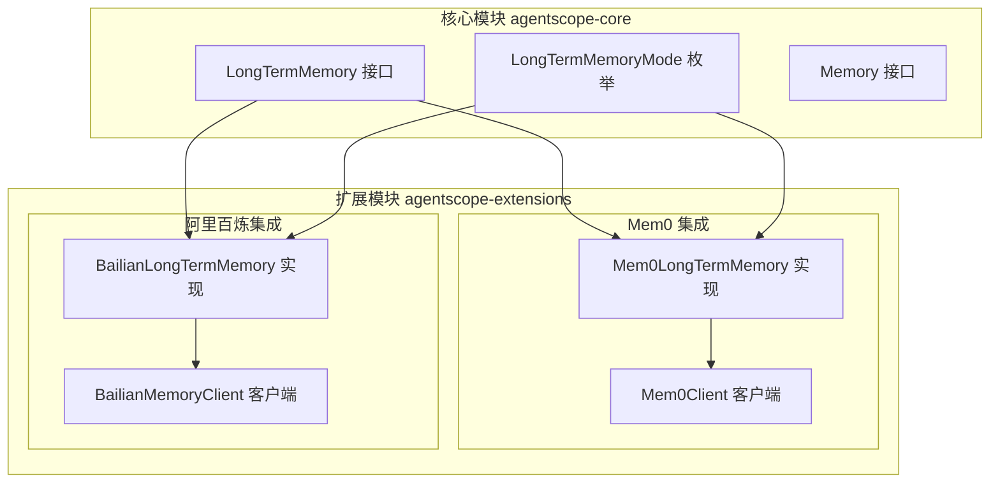
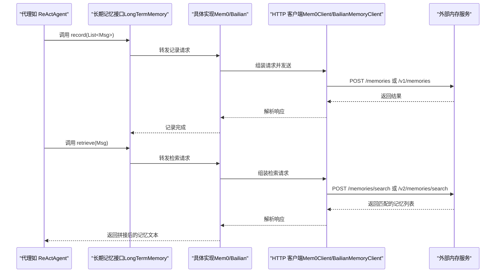
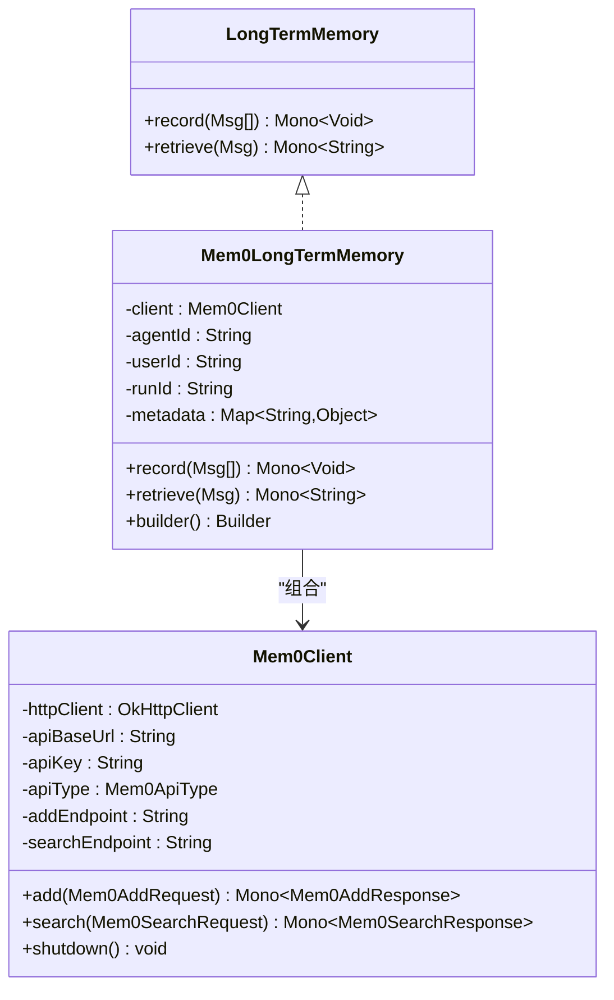
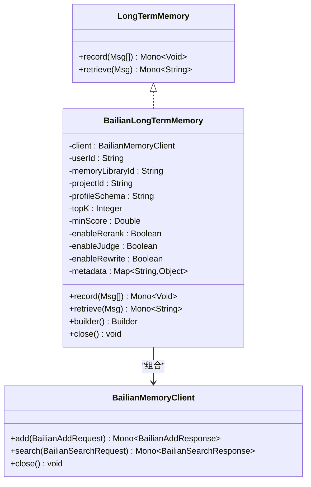
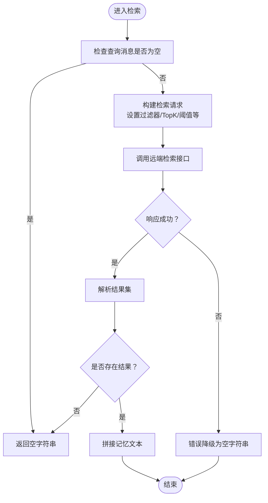
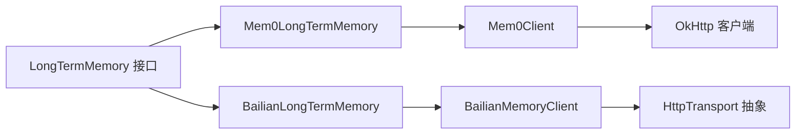

# 内存扩展

<cite>
**本文引用的文件**
- [agentscope-core/src/main/java/io/agentscope/core/memory/LongTermMemory.java](file://agentscope-core/src/main/java/io/agentscope/core/memory/LongTermMemory.java)
- [agentscope-core/src/main/java/io/agentscope/core/memory/Memory.java](file://agentscope-core/src/main/java/io/agentscope/core/memory/Memory.java)
- [agentscope-core/src/main/java/io/agentscope/core/memory/LongTermMemoryMode.java](file://agentscope-core/src/main/java/io/agentscope/core/memory/LongTermMemoryMode.java)
- [agentscope-extensions/agentscope-extensions-mem/agentscope-extensions-mem0/src/main/java/io/agentscope/core/memory/mem0/Mem0LongTermMemory.java](file://agentscope-extensions/agentscope-extensions-mem/agentscope-extensions-mem0/src/main/java/io/agentscope/core/memory/mem0/Mem0LongTermMemory.java)
- [agentscope-extensions/agentscope-extensions-mem/agentscope-extensions-mem0/src/main/java/io/agentscope/core/memory/mem0/Mem0Client.java](file://agentscope-extensions/agentscope-extensions-mem/agentscope-extensions-mem0/src/main/java/io/agentscope/core/memory/mem0/Mem0Client.java)
- [agentscope-extensions/agentscope-extensions-mem/agentscope-extensions-memory-bailian/src/main/java/io/agentscope/core/memory/bailian/BailianLongTermMemory.java](file://agentscope-extensions/agentscope-extensions-mem/agentscope-extensions-memory-bailian/src/main/java/io/agentscope/core/memory/bailian/BailianLongTermMemory.java)
- [agentscope-extensions/agentscope-extensions-mem/agentscope-extensions-memory-bailian/src/main/java/io/agentscope/core/memory/bailian/BailianMemoryClient.java](file://agentscope-extensions/agentscope-extensions-mem/agentscope-extensions-memory-bailian/src/main/java/io/agentscope/core/memory/bailian/BailianMemoryClient.java)
- [agentscope-examples/documentation/src/main/java/io/agentscope/examples/documentation2/harness/memory/MemoryCompactionExample.java](file://agentscope-examples/documentation/src/main/java/io/agentscope/examples/documentation2/harness/memory/MemoryCompactionExample.java)
- [agentscope-guide.html](file://agentscope-guide.html)
- [agentscope-2.0.0-RC2-guide.html](file://agentscope-2.0.0-RC2-guide.html)
- [SKILL.md](file://SKILL.md)
</cite>

## 目录
1. [简介](#简介)
2. [项目结构](#项目结构)
3. [核心组件](#核心组件)
4. [架构总览](#架构总览)
5. [详细组件分析](#详细组件分析)
6. [依赖关系分析](#依赖关系分析)
7. [性能考量](#性能考量)
8. [故障排查指南](#故障排查指南)
9. [结论](#结论)
10. [附录](#附录)

## 简介
本技术文档聚焦于 AgentScope Java 的“内存扩展”模块，系统性阐述长期记忆系统的实现架构与集成方案。文档覆盖以下要点：
- 长期记忆接口与模式设计（已废弃但保留以兼容 v1）
- Mem0、阿里百炼（Bailian）等内存服务提供商的集成实现
- 数据模型、存储策略与检索机制
- 记忆生命周期管理、增量更新与去重策略
- 配置示例、性能优化与容量规划建议
- 使用场景分析、成本评估与迁移策略

## 项目结构
围绕“内存扩展”的关键代码分布在 core 与 extensions 两个模块中：
- 核心接口与模式定义位于 core 模块
- 扩展实现（Mem0、百炼等）位于 extensions 模块对应的子工程中
- 示例与文档辅助理解使用方式与最佳实践

图表来源
- [agentscope-core/src/main/java/io/agentscope/core/memory/LongTermMemory.java:71-112](file://agentscope-core/src/main/java/io/agentscope/core/memory/LongTermMemory.java#L71-L112)
- [agentscope-core/src/main/java/io/agentscope/core/memory/LongTermMemoryMode.java:54-71](file://agentscope-core/src/main/java/io/agentscope/core/memory/LongTermMemoryMode.java#L54-L71)
- [agentscope-extensions/agentscope-extensions-mem/agentscope-extensions-mem0/src/main/java/io/agentscope/core/memory/mem0/Mem0LongTermMemory.java:113-440](file://agentscope-extensions/agentscope-extensions-mem/agentscope-extensions-mem0/src/main/java/io/agentscope/core/memory/mem0/Mem0LongTermMemory.java#L113-L440)
- [agentscope-extensions/agentscope-extensions-mem/agentscope-extensions-mem0/src/main/java/io/agentscope/core/memory/mem0/Mem0Client.java:44-280](file://agentscope-extensions/agentscope-extensions-mem/agentscope-extensions-mem0/src/main/java/io/agentscope/core/memory/mem0/Mem0Client.java#L44-L280)
- [agentscope-extensions/agentscope-extensions-mem/agentscope-extensions-memory-bailian/src/main/java/io/agentscope/core/memory/bailian/BailianLongTermMemory.java:77-492](file://agentscope-extensions/agentscope-extensions-mem/agentscope-extensions-memory-bailian/src/main/java/io/agentscope/core/memory/bailian/BailianLongTermMemory.java#L77-L492)
- [agentscope-extensions/agentscope-extensions-mem/agentscope-extensions-memory-bailian/src/main/java/io/agentscope/core/memory/bailian/BailianMemoryClient.java](file://agentscope-extensions/agentscope-extensions-mem/agentscope-extensions-memory-bailian/src/main/java/io/agentscope/core/memory/bailian/BailianMemoryClient.java)

章节来源
- [agentscope-guide.html:964-1005](file://agentscope-guide.html#L964-L1005)
- [agentscope-2.0.0-RC2-guide.html:68-80](file://agentscope-2.0.0-RC2-guide.html#L68-L80)

## 核心组件
- 长期记忆接口（LongTermMemory）
  - 提供记录与检索能力，返回响应式 Mono，便于非阻塞集成
  - 已标记为废弃（since 2.0.0），长期记忆能力被移除，跨会话持久化应由应用层在 AgentState 中处理
- 长期记忆模式（LongTermMemoryMode）
  - 控制框架与代理对记忆的控制权分配：静态控制、代理控制、或二者结合
  - 已标记为废弃，对应能力不再存在
- 记忆接口（Memory）
  - 用于短期记忆（会话内）的消息缓冲与持久化镜像（仅写入兼容）
- 扩展实现
  - Mem0LongTermMemory：对接 Mem0 平台或自托管服务，支持多租户元数据隔离与语义检索
  - BailianLongTermMemory：对接阿里云百炼长记忆服务，支持 TopK、最小相似度、重排/判断/改写等参数化检索

章节来源
- [agentscope-core/src/main/java/io/agentscope/core/memory/LongTermMemory.java:71-112](file://agentscope-core/src/main/java/io/agentscope/core/memory/LongTermMemory.java#L71-L112)
- [agentscope-core/src/main/java/io/agentscope/core/memory/LongTermMemoryMode.java:54-71](file://agentscope-core/src/main/java/io/agentscope/core/memory/LongTermMemoryMode.java#L54-L71)
- [agentscope-core/src/main/java/io/agentscope/core/memory/Memory.java:35-79](file://agentscope-core/src/main/java/io/agentscope/core/memory/Memory.java#L35-L79)
- [agentscope-extensions/agentscope-extensions-mem/agentscope-extensions-mem0/src/main/java/io/agentscope/core/memory/mem0/Mem0LongTermMemory.java:113-440](file://agentscope-extensions/agentscope-extensions-mem/agentscope-extensions-mem0/src/main/java/io/agentscope/core/memory/mem0/Mem0LongTermMemory.java#L113-L440)
- [agentscope-extensions/agentscope-extensions-mem/agentscope-extensions-memory-bailian/src/main/java/io/agentscope/core/memory/bailian/BailianLongTermMemory.java:77-492](file://agentscope-extensions/agentscope-extensions-mem/agentscope-extensions-memory-bailian/src/main/java/io/agentscope/core/memory/bailian/BailianLongTermMemory.java#L77-L492)

## 架构总览
下图展示从代理到长期记忆扩展的整体调用链路与数据流：

图表来源
- [agentscope-core/src/main/java/io/agentscope/core/memory/LongTermMemory.java:91-110](file://agentscope-core/src/main/java/io/agentscope/core/memory/LongTermMemory.java#L91-L110)
- [agentscope-extensions/agentscope-extensions-mem/agentscope-extensions-mem0/src/main/java/io/agentscope/core/memory/mem0/Mem0LongTermMemory.java:169-292](file://agentscope-extensions/agentscope-extensions-mem/agentscope-extensions-mem0/src/main/java/io/agentscope/core/memory/mem0/Mem0LongTermMemory.java#L169-L292)
- [agentscope-extensions/agentscope-extensions-mem/agentscope-extensions-mem0/src/main/java/io/agentscope/core/memory/mem0/Mem0Client.java:222-267](file://agentscope-extensions/agentscope-extensions-mem/agentscope-extensions-mem0/src/main/java/io/agentscope/core/memory/mem0/Mem0Client.java#L222-L267)
- [agentscope-extensions/agentscope-extensions-mem/agentscope-extensions-memory-bailian/src/main/java/io/agentscope/core/memory/bailian/BailianLongTermMemory.java:147-273](file://agentscope-extensions/agentscope-extensions-mem/agentscope-extensions-memory-bailian/src/main/java/io/agentscope/core/memory/bailian/BailianLongTermMemory.java#L147-L273)
- [agentscope-extensions/agentscope-extensions-mem/agentscope-extensions-memory-bailian/src/main/java/io/agentscope/core/memory/bailian/BailianMemoryClient.java](file://agentscope-extensions/agentscope-extensions-mem/agentscope-extensions-memory-bailian/src/main/java/io/agentscope/core/memory/bailian/BailianMemoryClient.java)

## 详细组件分析

### Mem0 长期记忆实现
- 功能特性
  - 语义检索：基于向量嵌入与相似度排序
  - LLM 推理抽取：可启用记忆抽取与推断
  - 多租户隔离：通过 agentId、userId、runId 与自定义 metadata 过滤
  - 自托管与平台双栈：支持平台 v1/v2 与自托管 v1/v2 端点
  - 非阻塞：基于 Reactor Mono 的异步操作
- 数据模型与流程
  - 记录：将 Msg 列表转换为 Mem0Message，过滤空内容与压缩历史标记，调用 add 接口
  - 检索：构建查询请求（含过滤器），调用 search 接口，聚合返回的记忆文本
- 关键类关系

图表来源
- [agentscope-core/src/main/java/io/agentscope/core/memory/LongTermMemory.java:71-112](file://agentscope-core/src/main/java/io/agentscope/core/memory/LongTermMemory.java#L71-L112)
- [agentscope-extensions/agentscope-extensions-mem/agentscope-extensions-mem0/src/main/java/io/agentscope/core/memory/mem0/Mem0LongTermMemory.java:113-440](file://agentscope-extensions/agentscope-extensions-mem/agentscope-extensions-mem0/src/main/java/io/agentscope/core/memory/mem0/Mem0LongTermMemory.java#L113-L440)
- [agentscope-extensions/agentscope-extensions-mem/agentscope-extensions-mem0/src/main/java/io/agentscope/core/memory/mem0/Mem0Client.java:44-280](file://agentscope-extensions/agentscope-extensions-mem/agentscope-extensions-mem0/src/main/java/io/agentscope/core/memory/mem0/Mem0Client.java#L44-L280)

章节来源
- [agentscope-extensions/agentscope-extensions-mem/agentscope-extensions-mem0/src/main/java/io/agentscope/core/memory/mem0/Mem0LongTermMemory.java:113-440](file://agentscope-extensions/agentscope-extensions-mem/agentscope-extensions-mem0/src/main/java/io/agentscope/core/memory/mem0/Mem0LongTermMemory.java#L113-L440)
- [agentscope-extensions/agentscope-extensions-mem/agentscope-extensions-mem0/src/main/java/io/agentscope/core/memory/mem0/Mem0Client.java:44-280](file://agentscope-extensions/agentscope-extensions-mem/agentscope-extensions-mem0/src/main/java/io/agentscope/core/memory/mem0/Mem0Client.java#L44-L280)

### 百炼（阿里云）长期记忆实现
- 功能特性
  - 语义检索与向量相似度
  - 可配置 TopK、最小分数、重排/判断/改写等增强检索
  - 多租户隔离：userId、memoryLibraryId、projectId 等维度
  - 非阻塞异步处理，错误降级为空结果
- 数据模型与流程
  - 记录：过滤 SYSTEM/TOOL 与带工具调用的 ASSISTANT，仅保留有效用户-助手交互；排除压缩历史标记
  - 检索：构造用户角色查询，按配置返回记忆节点内容拼接
- 关键类关系

图表来源
- [agentscope-core/src/main/java/io/agentscope/core/memory/LongTermMemory.java:71-112](file://agentscope-core/src/main/java/io/agentscope/core/memory/LongTermMemory.java#L71-L112)
- [agentscope-extensions/agentscope-extensions-mem/agentscope-extensions-memory-bailian/src/main/java/io/agentscope/core/memory/bailian/BailianLongTermMemory.java:77-492](file://agentscope-extensions/agentscope-extensions-mem/agentscope-extensions-memory-bailian/src/main/java/io/agentscope/core/memory/bailian/BailianLongTermMemory.java#L77-L492)
- [agentscope-extensions/agentscope-extensions-mem/agentscope-extensions-memory-bailian/src/main/java/io/agentscope/core/memory/bailian/BailianMemoryClient.java](file://agentscope-extensions/agentscope-extensions-mem/agentscope-extensions-memory-bailian/src/main/java/io/agentscope/core/memory/bailian/BailianMemoryClient.java)

章节来源
- [agentscope-extensions/agentscope-extensions-mem/agentscope-extensions-memory-bailian/src/main/java/io/agentscope/core/memory/bailian/BailianLongTermMemory.java:77-492](file://agentscope-extensions/agentscope-extensions-mem/agentscope-extensions-memory-bailian/src/main/java/io/agentscope/core/memory/bailian/BailianLongTermMemory.java#L77-L492)

### 记忆生命周期与检索流程（算法视角）
以下流程图抽象了两类实现的检索路径，体现去重、过滤与聚合逻辑。

图表来源
- [agentscope-extensions/agentscope-extensions-mem/agentscope-extensions-mem0/src/main/java/io/agentscope/core/memory/mem0/Mem0LongTermMemory.java:268-292](file://agentscope-extensions/agentscope-extensions-mem/agentscope-extensions-mem0/src/main/java/io/agentscope/core/memory/mem0/Mem0LongTermMemory.java#L268-L292)
- [agentscope-extensions/agentscope-extensions-mem/agentscope-extensions-memory-bailian/src/main/java/io/agentscope/core/memory/bailian/BailianLongTermMemory.java:227-273](file://agentscope-extensions/agentscope-extensions-mem/agentscope-extensions-memory-bailian/src/main/java/io/agentscope/core/memory/bailian/BailianLongTermMemory.java#L227-L273)

## 依赖关系分析
- 组件耦合
  - LongTermMemory 作为统一接口，Mem0LongTermMemory 与 BailianLongTermMemory 分别实现
  - 各实现通过各自客户端（Mem0Client、BailianMemoryClient）访问远端服务
- 外部依赖
  - OkHttp 用于 HTTP 通信
  - Reactor Mono 用于非阻塞响应式编程
  - JSON 序列化工具用于请求/响应编解码
- 潜在循环依赖
  - 当前实现为单向依赖（实现依赖客户端，客户端不依赖实现），无循环风险

图表来源
- [agentscope-core/src/main/java/io/agentscope/core/memory/LongTermMemory.java:71-112](file://agentscope-core/src/main/java/io/agentscope/core/memory/LongTermMemory.java#L71-L112)
- [agentscope-extensions/agentscope-extensions-mem/agentscope-extensions-mem0/src/main/java/io/agentscope/core/memory/mem0/Mem0LongTermMemory.java:113-440](file://agentscope-extensions/agentscope-extensions-mem/agentscope-extensions-mem0/src/main/java/io/agentscope/core/memory/mem0/Mem0LongTermMemory.java#L113-L440)
- [agentscope-extensions/agentscope-extensions-mem/agentscope-extensions-mem0/src/main/java/io/agentscope/core/memory/mem0/Mem0Client.java:44-280](file://agentscope-extensions/agentscope-extensions-mem/agentscope-extensions-mem0/src/main/java/io/agentscope/core/memory/mem0/Mem0Client.java#L44-L280)
- [agentscope-extensions/agentscope-extensions-mem/agentscope-extensions-memory-bailian/src/main/java/io/agentscope/core/memory/bailian/BailianLongTermMemory.java:77-492](file://agentscope-extensions/agentscope-extensions-mem/agentscope-extensions-memory-bailian/src/main/java/io/agentscope/core/memory/bailian/BailianLongTermMemory.java#L77-L492)
- [agentscope-extensions/agentscope-extensions-mem/agentscope-extensions-memory-bailian/src/main/java/io/agentscope/core/memory/bailian/BailianMemoryClient.java](file://agentscope-extensions/agentscope-extensions-mem/agentscope-extensions-memory-bailian/src/main/java/io/agentscope/core/memory/bailian/BailianMemoryClient.java)

章节来源
- [agentscope-extensions/agentscope-extensions-mem/agentscope-extensions-mem0/src/main/java/io/agentscope/core/memory/mem0/Mem0Client.java:44-280](file://agentscope-extensions/agentscope-extensions-mem/agentscope-extensions-mem0/src/main/java/io/agentscope/core/memory/mem0/Mem0Client.java#L44-L280)
- [agentscope-extensions/agentscope-extensions-mem/agentscope-extensions-memory-bailian/src/main/java/io/agentscope/core/memory/bailian/BailianMemoryClient.java](file://agentscope-extensions/agentscope-extensions-mem/agentscope-extensions-memory-bailian/src/main/java/io/agentscope/core/memory/bailian/BailianMemoryClient.java)

## 性能考量
- 异步非阻塞
  - 所有记录与检索均返回 Mono，避免阻塞主线程，适合高并发场景
- 网络与序列化
  - 使用 OkHttp 并设置连接/读/写超时；合理配置超时时间以平衡稳定性与延迟
  - JSON 编解码采用统一工具，减少序列化开销
- 检索参数优化
  - Mem0：topK、过滤器（agentId/userId/runId/metadata）可降低无关结果，提升相关性
  - 百炼：TopK、最小分数、重排/判断/改写等可显著影响召回质量与性能
- 错误降级
  - 检索失败时返回空字符串，避免中断推理流程；可在上层进行重试或告警

章节来源
- [agentscope-extensions/agentscope-extensions-mem/agentscope-extensions-mem0/src/main/java/io/agentscope/core/memory/mem0/Mem0LongTermMemory.java:268-292](file://agentscope-extensions/agentscope-extensions-mem/agentscope-extensions-mem0/src/main/java/io/agentscope/core/memory/mem0/Mem0LongTermMemory.java#L268-L292)
- [agentscope-extensions/agentscope-extensions-mem/agentscope-extensions-memory-bailian/src/main/java/io/agentscope/core/memory/bailian/BailianLongTermMemory.java:227-273](file://agentscope-extensions/agentscope-extensions-mem/agentscope-extensions-memory-bailian/src/main/java/io/agentscope/core/memory/bailian/BailianLongTermMemory.java#L227-L273)
- [agentscope-extensions/agentscope-extensions-mem/agentscope-extensions-mem0/src/main/java/io/agentscope/core/memory/mem0/Mem0Client.java:104-120](file://agentscope-extensions/agentscope-extensions-mem/agentscope-extensions-mem0/src/main/java/io/agentscope/core/memory/mem0/Mem0Client.java#L104-L120)

## 故障排查指南
- 常见问题与定位
  - 记录为空：确认消息列表非空且包含有效文本；压缩历史标记会被过滤
  - 检索为空：检查过滤器（userId/agentId/runId/metadata）是否正确；确认服务端有匹配记忆
  - 超时异常：调整 HTTP 超时与 Mem0/百炼服务端配置；必要时增加重试策略
  - 权限错误：核对 API Key 与授权头格式；平台与自托管的头部可能不同
- 日志与降级
  - 百炼实现对记录/检索过程中的异常进行日志记录并降级为空结果，便于快速定位问题
- 资源释放
  - 百炼实现支持 AutoCloseable，在资源管理器中确保关闭客户端

章节来源
- [agentscope-extensions/agentscope-extensions-mem/agentscope-extensions-mem0/src/main/java/io/agentscope/core/memory/mem0/Mem0LongTermMemory.java:169-204](file://agentscope-extensions/agentscope-extensions-mem/agentscope-extensions-mem0/src/main/java/io/agentscope/core/memory/mem0/Mem0LongTermMemory.java#L169-L204)
- [agentscope-extensions/agentscope-extensions-mem/agentscope-extensions-memory-bailian/src/main/java/io/agentscope/core/memory/bailian/BailianLongTermMemory.java:147-215](file://agentscope-extensions/agentscope-extensions-mem/agentscope-extensions-memory-bailian/src/main/java/io/agentscope/core/memory/bailian/BailianLongTermMemory.java#L147-L215)
- [agentscope-extensions/agentscope-extensions-mem/agentscope-extensions-mem0/src/main/java/io/agentscope/core/memory/mem0/Mem0Client.java:135-186](file://agentscope-extensions/agentscope-extensions-mem/agentscope-extensions-mem0/src/main/java/io/agentscope/core/memory/mem0/Mem0Client.java#L135-L186)
- [agentscope-extensions/agentscope-extensions-mem/agentscope-extensions-memory-bailian/src/main/java/io/agentscope/core/memory/bailian/BailianLongTermMemory.java:314-320](file://agentscope-extensions/agentscope-extensions-mem/agentscope-extensions-memory-bailian/src/main/java/io/agentscope/core/memory/bailian/BailianLongTermMemory.java#L314-L320)

## 结论
- 长期记忆能力在 v2.0.0 中已被移除，跨会话持久化应由应用层在 AgentState 中实现
- 内存扩展模块提供了成熟的 Mem0 与阿里百炼集成，具备语义检索、多租户隔离与非阻塞异步能力
- 在实际落地中，应结合业务场景选择合适的检索参数、错误降级与资源管理策略，并关注网络与序列化开销

## 附录

### 配置示例与最佳实践
- Mem0 配置要点
  - 必填项：apiBaseUrl；可选认证：apiKey；可选类型：apiType（平台/自托管）
  - 多租户：agentName、userId、runName；自定义元数据：metadata
  - 超时：timeout（默认 60 秒）
- 百炼配置要点
  - 必填项：apiKey、userId；可选：memoryLibraryId、projectId、profileSchema
  - 检索参数：topK、minScore、enableRerank/enableJudge/enableRewrite
  - HTTP 传输：可注入 HttpTransport 实现
- 使用示例参考
  - 示例代码片段路径：[Mem0 长期记忆使用示例:538-552](file://SKILL.md#L538-L552)
  - 示例代码片段路径：[Harness 记忆压缩示例](file://agentscope-examples/documentation/src/main/java/io/agentscope/examples/documentation2/harness/memory/MemoryCompactionExample.java)

章节来源
- [agentscope-extensions/agentscope-extensions-mem/agentscope-extensions-mem0/src/main/java/io/agentscope/core/memory/mem0/Mem0LongTermMemory.java:299-438](file://agentscope-extensions/agentscope-extensions-mem/agentscope-extensions-mem0/src/main/java/io/agentscope/core/memory/mem0/Mem0LongTermMemory.java#L299-L438)
- [agentscope-extensions/agentscope-extensions-mem/agentscope-extensions-memory-bailian/src/main/java/io/agentscope/core/memory/bailian/BailianLongTermMemory.java:307-490](file://agentscope-extensions/agentscope-extensions-mem/agentscope-extensions-memory-bailian/src/main/java/io/agentscope/core/memory/bailian/BailianLongTermMemory.java#L307-L490)
- [SKILL.md:538-552](file://SKILL.md#L538-L552)
- [agentscope-examples/documentation/src/main/java/io/agentscope/examples/documentation2/harness/memory/MemoryCompactionExample.java](file://agentscope-examples/documentation/src/main/java/io/agentscope/examples/documentation2/harness/memory/MemoryCompactionExample.java)

### 数据模型与存储策略
- 数据模型
  - Mem0：消息对象包含角色与内容；检索请求包含查询与过滤器；响应包含结果列表
  - 百炼：消息对象包含角色与内容；检索请求包含用户标识、TopK、阈值与增强开关；响应包含记忆节点内容
- 存储策略
  - 服务端侧向量索引与元数据过滤，客户端仅负责请求组装与结果聚合
- 去重与过滤
  - 记录阶段：过滤空内容、压缩历史标记、按角色与工具调用类型筛选
  - 检索阶段：通过过滤器限定上下文范围，避免跨会话污染

章节来源
- [agentscope-extensions/agentscope-extensions-mem/agentscope-extensions-mem0/src/main/java/io/agentscope/core/memory/mem0/Mem0LongTermMemory.java:169-204](file://agentscope-extensions/agentscope-extensions-mem/agentscope-extensions-mem0/src/main/java/io/agentscope/core/memory/mem0/Mem0LongTermMemory.java#L169-L204)
- [agentscope-extensions/agentscope-extensions-mem/agentscope-extensions-memory-bailian/src/main/java/io/agentscope/core/memory/bailian/BailianLongTermMemory.java:147-215](file://agentscope-extensions/agentscope-extensions-mem/agentscope-extensions-memory-bailian/src/main/java/io/agentscope/core/memory/bailian/BailianLongTermMemory.java#L147-L215)

### 使用场景与迁移策略
- 场景建议
  - 长期记忆：需要跨会话保持个性化与上下文的场景
  - 语义检索：强调相关性而非精确匹配的问答/检索
  - 多租户：按用户/项目/会话隔离记忆
- 迁移策略
  - v1 → v2：停止使用 LongTermMemory 接口；将跨会话上下文迁移到 AgentState
  - 记忆迁移：若需保留历史，可在升级前导出服务端记忆并在新架构中重建
  - 参数迁移：将 v1 的过滤器与检索参数映射到新实现的对应字段

章节来源
- [agentscope-core/src/main/java/io/agentscope/core/memory/LongTermMemory.java:66-70](file://agentscope-core/src/main/java/io/agentscope/core/memory/LongTermMemory.java#L66-L70)
- [agentscope-guide.html:964-1005](file://agentscope-guide.html#L964-L1005)
- [agentscope-2.0.0-RC2-guide.html:68-80](file://agentscope-2.0.0-RC2-guide.html#L68-L80)