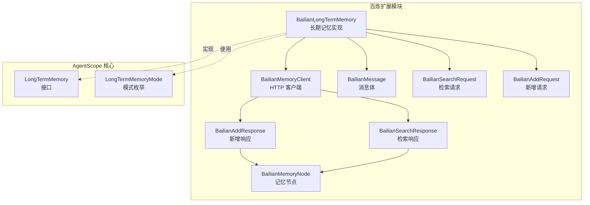
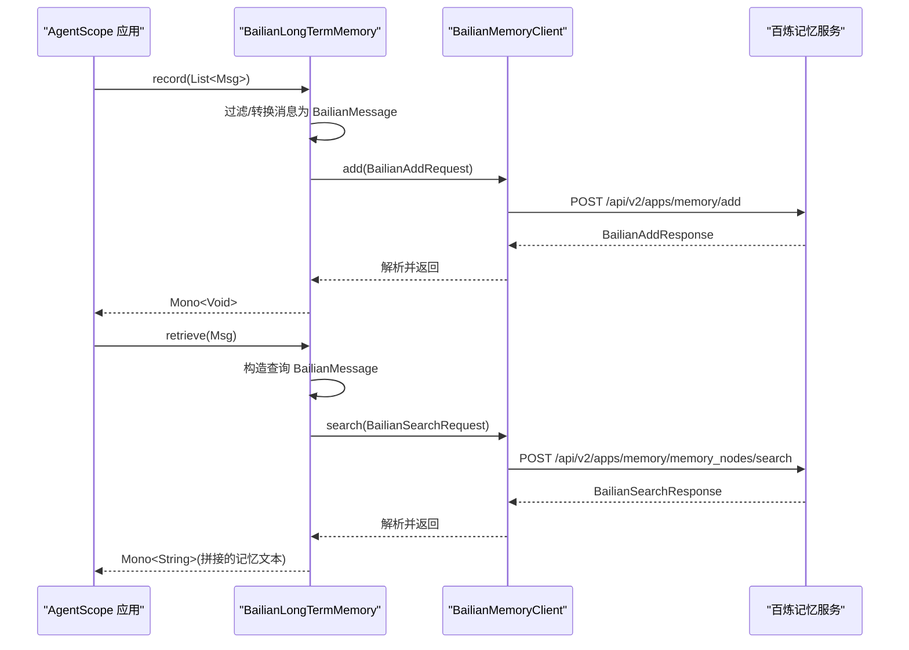
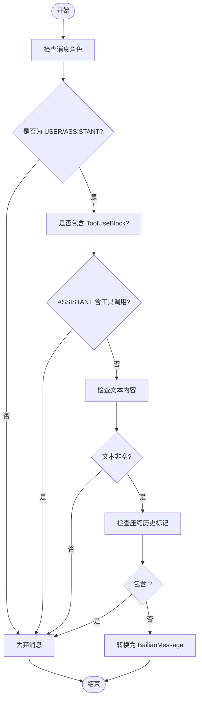
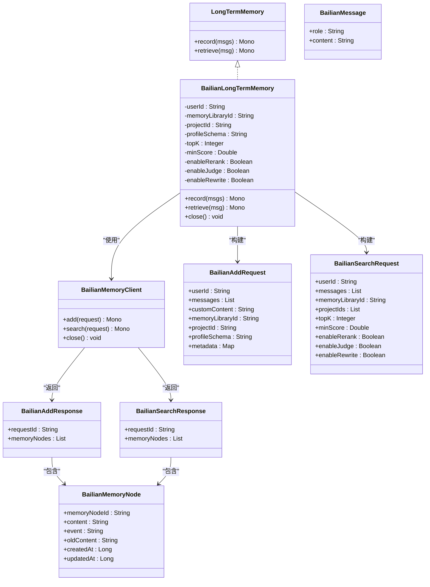

# 百炼内存集成

<cite>
**本文引用的文件**
- [BailianLongTermMemory.java](file://agentscope-extensions/agentscope-extensions-mem/agentscope-extensions-memory-bailian/src/main/java/io/agentscope/core/memory/bailian/BailianLongTermMemory.java)
- [BailianMemoryClient.java](file://agentscope-extensions/agentscope-extensions-mem/agentscope-extensions-memory-bailian/src/main/java/io/agentscope/core/memory/bailian/BailianMemoryClient.java)
- [BailianMessage.java](file://agentscope-extensions/agentscope-extensions-mem/agentscope-extensions-memory-bailian/src/main/java/io/agentscope/core/memory/bailian/BailianMessage.java)
- [BailianSearchRequest.java](file://agentscope-extensions/agentscope-extensions-mem/agentscope-extensions-memory-bailian/src/main/java/io/agentscope/core/memory/bailian/BailianSearchRequest.java)
- [BailianAddRequest.java](file://agentscope-extensions/agentscope-extensions-mem/agentscope-extensions-memory-bailian/src/main/java/io/agentscope/core/memory/bailian/BailianAddRequest.java)
- [BailianSearchResponse.java](file://agentscope-extensions/agentscope-extensions-mem/agentscope-extensions-memory-bailian/src/main/java/io/agentscope/core/memory/bailian/BailianSearchResponse.java)
- [BailianAddResponse.java](file://agentscope-extensions/agentscope-extensions-mem/agentscope-extensions-memory-bailian/src/main/java/io/agentscope/core/memory/bailian/BailianAddResponse.java)
- [BailianMemoryNode.java](file://agentscope-extensions/agentscope-extensions-mem/agentscope-extensions-memory-bailian/src/main/java/io/agentscope/core/memory/bailian/BailianMemoryNode.java)
- [LongTermMemory.java](file://agentscope-core/src/main/java/io/agentscope/core/memory/LongTermMemory.java)
- [LongTermMemoryMode.java](file://agentscope-core/src/main/java/io/agentscope/core/memory/LongTermMemoryMode.java)
- [pom.xml](file://agentscope-extensions/agentscope-extensions-mem/agentscope-extensions-memory-bailian/pom.xml)
- [memory.md](file://docs/v1/zh/docs/task/memory.md)
- [bailian.md](file://docs/v2/en/integration/memory/bailian.md)
- [README.md](file://README.md)
</cite>

## 目录
1. [简介](#简介)
2. [项目结构](#项目结构)
3. [核心组件](#核心组件)
4. [架构总览](#架构总览)
5. [详细组件分析](#详细组件分析)
6. [依赖关系分析](#依赖关系分析)
7. [性能考虑](#性能考虑)
8. [故障排查指南](#故障排查指南)
9. [结论](#结论)
10. [附录](#附录)

## 简介
本文件面向在 AgentScope 中集成阿里云百炼长期记忆服务的开发者，系统性阐述 BailianLongTermMemory 的数据模型设计、消息转换机制与检索优化策略，并结合 AgentScope 的内存接口与模式，说明如何在应用中正确配置与使用。同时给出与阿里云生态的集成优势（认证授权、访问控制、监控告警）以及配置指南、性能基准与容量规划建议、故障恢复策略与典型应用场景。

## 项目结构
百炼内存扩展位于 agentscope-extensions-mem 模块下的 agentscope-extensions-memory-bailian 子模块，核心类围绕“请求对象-客户端-内存实现”三层展开，配合 agentscope-core 的 LongTermMemory 接口完成与框架的对接。

图示来源
- [BailianLongTermMemory.java:77-492](file://agentscope-extensions/agentscope-extensions-mem/agentscope-extensions-memory-bailian/src/main/java/io/agentscope/core/memory/bailian/BailianLongTermMemory.java#L77-L492)
- [BailianMemoryClient.java:67-268](file://agentscope-extensions/agentscope-extensions-mem/agentscope-extensions-memory-bailian/src/main/java/io/agentscope/core/memory/bailian/BailianMemoryClient.java#L67-L268)
- [BailianMessage.java:26-133](file://agentscope-extensions/agentscope-extensions-mem/agentscope-extensions-memory-bailian/src/main/java/io/agentscope/core/memory/bailian/BailianMessage.java#L26-L133)
- [BailianSearchRequest.java:28-376](file://agentscope-extensions/agentscope-extensions-mem/agentscope-extensions-memory-bailian/src/main/java/io/agentscope/core/memory/bailian/BailianSearchRequest.java#L28-L376)
- [BailianAddRequest.java:33-308](file://agentscope-extensions/agentscope-extensions-mem/agentscope-extensions-memory-bailian/src/main/java/io/agentscope/core/memory/bailian/BailianAddRequest.java#L33-L308)
- [BailianSearchResponse.java:30-81](file://agentscope-extensions/agentscope-extensions-mem/agentscope-extensions-memory-bailian/src/main/java/io/agentscope/core/memory/bailian/BailianSearchResponse.java#L30-L81)
- [BailianAddResponse.java:29-176](file://agentscope-extensions/agentscope-extensions-mem/agentscope-extensions-memory-bailian/src/main/java/io/agentscope/core/memory/bailian/BailianAddResponse.java#L29-L176)
- [BailianMemoryNode.java:24-164](file://agentscope-extensions/agentscope-extensions-mem/agentscope-extensions-memory-bailian/src/main/java/io/agentscope/core/memory/bailian/BailianMemoryNode.java#L24-L164)
- [LongTermMemory.java:71-112](file://agentscope-core/src/main/java/io/agentscope/core/memory/LongTermMemory.java#L71-L112)
- [LongTermMemoryMode.java:53-71](file://agentscope-core/src/main/java/io/agentscope/core/memory/LongTermMemoryMode.java#L53-L71)

章节来源
- [pom.xml:33-47](file://agentscope-extensions/agentscope-extensions-mem/agentscope-extensions-memory-bailian/pom.xml#L33-L47)
- [README.md:50-52](file://README.md#L50-L52)

## 核心组件
- BailianLongTermMemory：实现 LongTermMemory 接口，负责消息过滤与转换、调用 BailianMemoryClient 进行新增与检索、返回格式化后的记忆文本。
- BailianMemoryClient：封装 HTTP 请求，统一处理 Authorization 头、JSON 序列化与反序列化、错误映射与调度线程池。
- 数据模型：
  - BailianMessage：最小消息单元（role/content），用于新增与检索。
  - BailianAddRequest/SearchRequest：新增与检索请求体，支持多租户隔离字段（userId/memoryLibraryId/projectId/profileSchema）与检索参数（topK/minScore/rerank/judge/rewrite）。
  - BailianAddResponse/BailianSearchResponse + BailianMemoryNode：响应与记忆节点，包含 content、事件类型、时间戳等。

章节来源
- [BailianLongTermMemory.java:77-492](file://agentscope-extensions/agentscope-extensions-mem/agentscope-extensions-memory-bailian/src/main/java/io/agentscope/core/memory/bailian/BailianLongTermMemory.java#L77-L492)
- [BailianMemoryClient.java:67-268](file://agentscope-extensions/agentscope-extensions-mem/agentscope-extensions-memory-bailian/src/main/java/io/agentscope/core/memory/bailian/BailianMemoryClient.java#L67-L268)
- [BailianMessage.java:26-133](file://agentscope-extensions/agentscope-extensions-mem/agentscope-extensions-memory-bailian/src/main/java/io/agentscope/core/memory/bailian/BailianMessage.java#L26-L133)
- [BailianSearchRequest.java:28-376](file://agentscope-extensions/agentscope-extensions-mem/agentscope-extensions-memory-bailian/src/main/java/io/agentscope/core/memory/bailian/BailianSearchRequest.java#L28-L376)
- [BailianAddRequest.java:33-308](file://agentscope-extensions/agentscope-extensions-mem/agentscope-extensions-memory-bailian/src/main/java/io/agentscope/core/memory/bailian/BailianAddRequest.java#L33-L308)
- [BailianSearchResponse.java:30-81](file://agentscope-extensions/agentscope-extensions-mem/agentscope-extensions-memory-bailian/src/main/java/io/agentscope/core/memory/bailian/BailianSearchResponse.java#L30-L81)
- [BailianAddResponse.java:29-176](file://agentscope-extensions/agentscope-extensions-mem/agentscope-extensions-memory-bailian/src/main/java/io/agentscope/core/memory/bailian/BailianAddResponse.java#L29-L176)
- [BailianMemoryNode.java:24-164](file://agentscope-extensions/agentscope-extensions-mem/agentscope-extensions-memory-bailian/src/main/java/io/agentscope/core/memory/bailian/BailianMemoryNode.java#L24-L164)

## 架构总览
下图展示了从 AgentScope 调用到百炼服务的端到端流程，包括消息过滤、请求构建、HTTP 调用与响应解析。

图示来源
- [BailianLongTermMemory.java:147-273](file://agentscope-extensions/agentscope-extensions-mem/agentscope-extensions-memory-bailian/src/main/java/io/agentscope/core/memory/bailian/BailianLongTermMemory.java#L147-L273)
- [BailianMemoryClient.java:110-127](file://agentscope-extensions/agentscope-extensions-mem/agentscope-extensions-memory-bailian/src/main/java/io/agentscope/core/memory/bailian/BailianMemoryClient.java#L110-L127)

## 详细组件分析

### 数据模型与消息转换
- 角色映射与过滤
  - 仅保留 MsgRole.USER 与 MsgRole.ASSISTANT；ASSISTANT 中含 ToolUseBlock 的消息被过滤（避免记录工具调用请求）。
  - 文本内容为空或包含压缩历史标记的消息被过滤，避免冗余与重复。
- 请求体构造
  - 新增：BailianAddRequest 支持 userId/memoryLibraryId/projectId/profileSchema/metadata/customContent。
  - 检索：BailianSearchRequest 支持 userId/memoryLibraryId/projectIds/topK/minScore/rerank/judge/rewrite。
- 响应解析
  - BailianSearchResponse/BailianAddResponse 返回 memory_nodes 列表，BailianMemoryNode 包含 content、事件类型与时间戳。

图示来源
- [BailianLongTermMemory.java:154-186](file://agentscope-extensions/agentscope-extensions-mem/agentscope-extensions-memory-bailian/src/main/java/io/agentscope/core/memory/bailian/BailianLongTermMemory.java#L154-L186)

章节来源
- [BailianLongTermMemory.java:147-300](file://agentscope-extensions/agentscope-extensions-mem/agentscope-extensions-memory-bailian/src/main/java/io/agentscope/core/memory/bailian/BailianLongTermMemory.java#L147-L300)
- [BailianMessage.java:26-133](file://agentscope-extensions/agentscope-extensions-mem/agentscope-extensions-memory-bailian/src/main/java/io/agentscope/core/memory/bailian/BailianMessage.java#L26-L133)
- [BailianAddRequest.java:33-308](file://agentscope-extensions/agentscope-extensions-mem/agentscope-extensions-memory-bailian/src/main/java/io/agentscope/core/memory/bailian/BailianAddRequest.java#L33-L308)
- [BailianSearchRequest.java:28-376](file://agentscope-extensions/agentscope-extensions-mem/agentscope-extensions-memory-bailian/src/main/java/io/agentscope/core/memory/bailian/BailianSearchRequest.java#L28-L376)

### 检索优化策略
- topK 与 minScore：控制召回数量与相似度阈值，平衡召回质量与性能。
- rerank/judge/rewrite：三段式增强开关，默认关闭以降低延迟与成本；按需开启以提升准确性。
- 多级隔离：通过 userId + memoryLibraryId + projectId 实现三级命名空间隔离，便于多租户与多项目场景。

章节来源
- [BailianLongTermMemory.java:81-94](file://agentscope-extensions/agentscope-extensions-mem/agentscope-extensions-memory-bailian/src/main/java/io/agentscope/core/memory/bailian/BailianLongTermMemory.java#L81-L94)
- [BailianSearchRequest.java:49-67](file://agentscope-extensions/agentscope-extensions-mem/agentscope-extensions-memory-bailian/src/main/java/io/agentscope/core/memory/bailian/BailianSearchRequest.java#L49-L67)
- [bailian.md:46-63](file://docs/v2/en/integration/memory/bailian.md#L46-L63)

### 与 AgentScope 的集成
- 兼容接口：实现 LongTermMemory 接口，供 ReActAgent 在不同模式下自动调用 record/retrieve。
- 模式选择：LongTermMemoryMode 提供 AGENT_CONTROL/STATIC_CONTROL/BOTH 三种模式，推荐 BOTH 以兼顾自动化与可控性。

章节来源
- [LongTermMemory.java:71-112](file://agentscope-core/src/main/java/io/agentscope/core/memory/LongTermMemory.java#L71-L112)
- [LongTermMemoryMode.java:53-71](file://agentscope-core/src/main/java/io/agentscope/core/memory/LongTermMemoryMode.java#L53-L71)
- [bailian.md:21-42](file://docs/v2/en/integration/memory/bailian.md#L21-L42)

### 类关系图

图示来源
- [LongTermMemory.java:71-112](file://agentscope-core/src/main/java/io/agentscope/core/memory/LongTermMemory.java#L71-L112)
- [BailianLongTermMemory.java:77-492](file://agentscope-extensions/agentscope-extensions-mem/agentscope-extensions-memory-bailian/src/main/java/io/agentscope/core/memory/bailian/BailianLongTermMemory.java#L77-L492)
- [BailianMemoryClient.java:67-268](file://agentscope-extensions/agentscope-extensions-mem/agentscope-extensions-memory-bailian/src/main/java/io/agentscope/core/memory/bailian/BailianMemoryClient.java#L67-L268)
- [BailianMessage.java:26-133](file://agentscope-extensions/agentscope-extensions-mem/agentscope-extensions-memory-bailian/src/main/java/io/agentscope/core/memory/bailian/BailianMessage.java#L26-L133)
- [BailianAddRequest.java:33-308](file://agentscope-extensions/agentscope-extensions-mem/agentscope-extensions-memory-bailian/src/main/java/io/agentscope/core/memory/bailian/BailianAddRequest.java#L33-L308)
- [BailianSearchRequest.java:28-376](file://agentscope-extensions/agentscope-extensions-mem/agentscope-extensions-memory-bailian/src/main/java/io/agentscope/core/memory/bailian/BailianSearchRequest.java#L28-L376)
- [BailianSearchResponse.java:30-81](file://agentscope-extensions/agentscope-extensions-mem/agentscope-extensions-memory-bailian/src/main/java/io/agentscope/core/memory/bailian/BailianSearchResponse.java#L30-L81)
- [BailianAddResponse.java:29-176](file://agentscope-extensions/agentscope-extensions-mem/agentscope-extensions-memory-bailian/src/main/java/io/agentscope/core/memory/bailian/BailianAddResponse.java#L29-L176)
- [BailianMemoryNode.java:24-164](file://agentscope-extensions/agentscope-extensions-mem/agentscope-extensions-memory-bailian/src/main/java/io/agentscope/core/memory/bailian/BailianMemoryNode.java#L24-L164)

## 依赖关系分析
- 组件内聚与耦合
  - BailianLongTermMemory 与 BailianMemoryClient 通过 Builder 注入，低耦合高内聚。
  - 请求/响应对象职责单一，便于测试与替换。
- 外部依赖
  - 依赖 agentscope-core 的 LongTermMemory 接口与消息模型。
  - 使用 JsonCodec 进行序列化/反序列化，使用 Reactor Mono 进行异步处理。
- 可能的循环依赖
  - 未发现循环依赖；各模块边界清晰。

章节来源
- [pom.xml:33-47](file://agentscope-extensions/agentscope-extensions-mem/agentscope-extensions-memory-bailian/pom.xml#L33-L47)
- [BailianLongTermMemory.java:18-31](file://agentscope-extensions/agentscope-extensions-mem/agentscope-extensions-memory-bailian/src/main/java/io/agentscope/core/memory/bailian/BailianLongTermMemory.java#L18-L31)
- [BailianMemoryClient.java:18-28](file://agentscope-extensions/agentscope-extensions-mem/agentscope-extensions-memory-bailian/src/main/java/io/agentscope/core/memory/bailian/BailianMemoryClient.java#L18-L28)

## 性能考虑
- 异步与背压
  - 所有操作基于 Reactor Mono，避免阻塞，适合高并发场景。
- 线程调度
  - HTTP 调用在 bounded elastic 调度器执行，避免阻塞事件循环。
- 检索参数权衡
  - topK 与 minScore 影响延迟与成本；rerank/judge/rewrite 显著增加延迟与费用，建议默认关闭，按需启用。
- 连接与资源
  - 实现 AutoCloseable，建议使用 try-with-resources 释放底层 HTTP 连接。

章节来源
- [BailianLongTermMemory.java:314-319](file://agentscope-extensions/agentscope-extensions-mem/agentscope-extensions-memory-bailian/src/main/java/io/agentscope/core/memory/bailian/BailianLongTermMemory.java#L314-L319)
- [BailianMemoryClient.java:194-195](file://agentscope-extensions/agentscope-extensions-mem/agentscope-extensions-memory-bailian/src/main/java/io/agentscope/core/memory/bailian/BailianMemoryClient.java#L194-L195)
- [bailian.md:46-63](file://docs/v2/en/integration/memory/bailian.md#L46-L63)

## 故障排查指南
- 常见异常与定位
  - 缺少必要参数：apiKey 或 userId 为空会抛出非法参数异常，确保在 Builder 中正确设置。
  - HTTP 错误：当响应状态码非成功时，抛出 IO 异常并包含状态码与响应体，便于定位。
  - 空响应：若响应体为空，抛出 IO 异常，检查网络与鉴权。
- 日志与追踪
  - 客户端在调试级别输出请求 URL，便于联调与问题复现。
- 记忆未命中
  - 检查检索参数（topK/minScore）、是否启用了 rerank/judge/rewrite；确认 userId/memoryLibraryId/projectId 是否匹配。
- 消息未入库
  - 确认消息角色与内容符合过滤条件；避免包含压缩历史标记；确保 ASSISTANT 不含 ToolUseBlock。

章节来源
- [BailianLongTermMemory.java:102-107](file://agentscope-extensions/agentscope-extensions-mem/agentscope-extensions-memory-bailian/src/main/java/io/agentscope/core/memory/bailian/BailianLongTermMemory.java#L102-L107)
- [BailianMemoryClient.java:164-184](file://agentscope-extensions/agentscope-extensions-mem/agentscope-extensions-memory-bailian/src/main/java/io/agentscope/core/memory/bailian/BailianMemoryClient.java#L164-L184)
- [BailianLongTermMemoryTest.java:106-175](file://agentscope-extensions/agentscope-extensions-mem/agentscope-extensions-memory-bailian/src/test/java/io/agentscope/core/memory/bailian/BailianLongTermMemoryTest.java#L106-L175)

## 结论
百炼内存扩展通过清晰的数据模型与严格的请求/响应契约，实现了与 AgentScope 的无缝集成。其多级隔离能力与可选的 rerank/judge/rewrite 策略，既满足了企业级多租户需求，又提供了灵活的检索优化路径。建议在生产环境中优先采用默认参数，按需启用增强策略，并通过 try-with-resources 管理资源生命周期，以获得稳定、高效且可维护的长期记忆能力。

## 附录

### 配置指南
- Maven 依赖
  - 引入 agentscope-extensions-memory-bailian 依赖，版本与核心版本保持一致。
- 环境变量与参数
  - 必填：DASHSCOPE_API_KEY、BAILIAN_USER_ID。
  - 可选：BAILIAN_MEMORY_LIBRARY_ID、BAILIAN_PROJECT_ID、BAILIAN_PROFILE_SCHEMA。
- 模式选择
  - 推荐 LongTermMemoryMode.BOTH，兼顾自动化与可控性。

章节来源
- [pom.xml:33-47](file://agentscope-extensions/agentscope-extensions-mem/agentscope-extensions-memory-bailian/pom.xml#L33-L47)
- [bailian.md:11-19](file://docs/v2/en/integration/memory/bailian.md#L11-L19)
- [memory.md:293-301](file://docs/v1/zh/docs/task/memory.md#L293-L301)
- [LongTermMemoryMode.java:53-71](file://agentscope-core/src/main/java/io/agentscope/core/memory/LongTermMemoryMode.java#L53-L71)

### 典型应用场景
- 个人助理：跨对话记住用户偏好与习惯，结合 BOTH 模式实现自动注入上下文。
- 企业客服：通过 memoryLibraryId 与 projectId 实现部门/业务域隔离，保障数据安全。
- 智能助手：在需要高质量检索时启用 rerank/judge/rewrite，提升回答准确性。

章节来源
- [bailian.md:5-9](file://docs/v2/en/integration/memory/bailian.md#L5-L9)
- [BailianSearchRequest.java:49-67](file://agentscope-extensions/agentscope-extensions-mem/agentscope-extensions-memory-bailian/src/main/java/io/agentscope/core/memory/bailian/BailianSearchRequest.java#L49-L67)

### 示例与运行
- 示例代码路径：agentscope-examples/documentation/advanced 下的 BailianMemoryExample。
- 运行命令：设置环境变量后，使用 Maven exec 插件运行示例类。

章节来源
- [memory.md:301-314](file://docs/v1/zh/docs/task/memory.md#L301-L314)